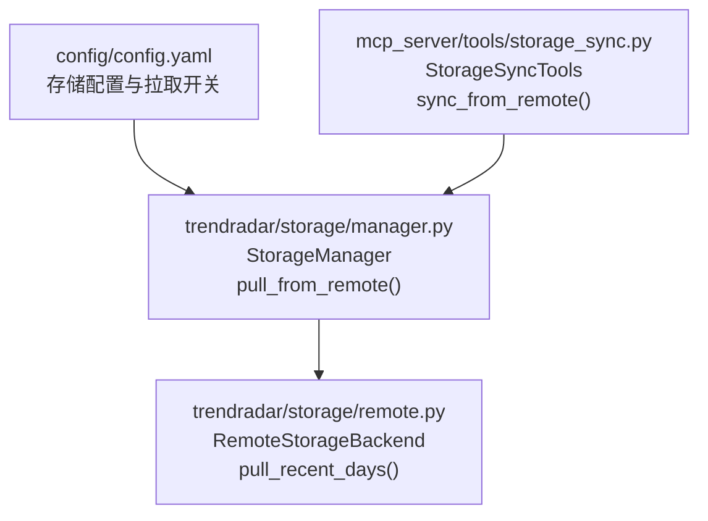
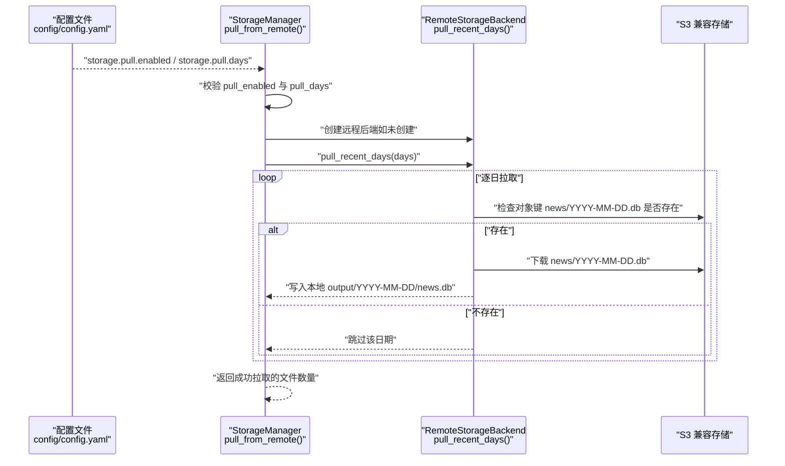
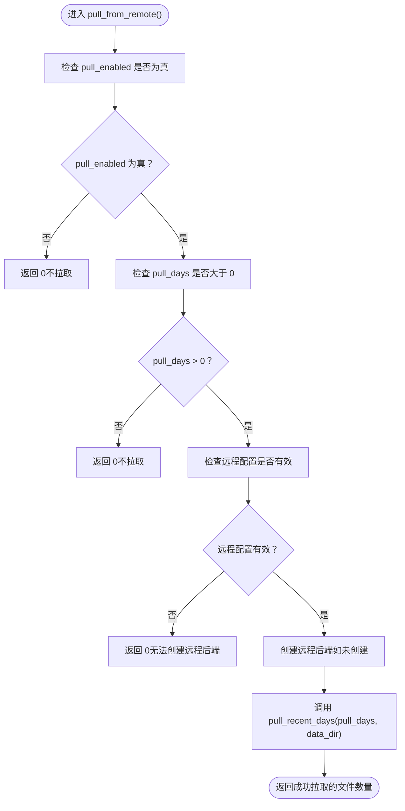
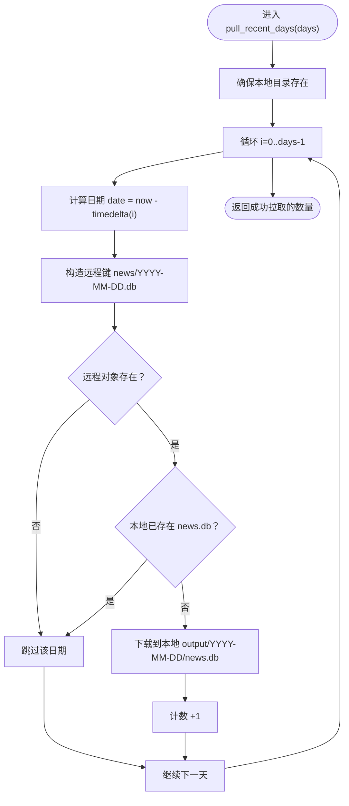
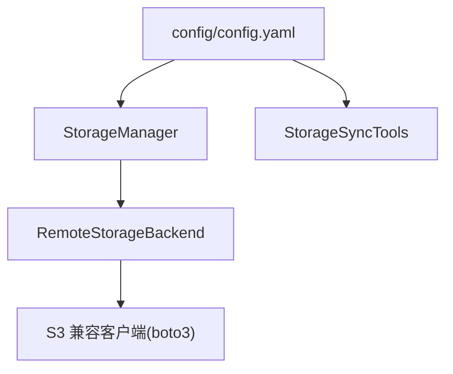

# 拉取策略

<cite>
**本文引用的文件**
- [trendradar/storage/manager.py](file://trendradar/storage/manager.py)
- [trendradar/storage/remote.py](file://trendradar/storage/remote.py)
- [config/config.yaml](file://config/config.yaml)
- [mcp_server/tools/storage_sync.py](file://mcp_server/tools/storage_sync.py)
</cite>

## 目录
1. [简介](#简介)
2. [项目结构](#项目结构)
3. [核心组件](#核心组件)
4. [架构总览](#架构总览)
5. [详细组件分析](#详细组件分析)
6. [依赖关系分析](#依赖关系分析)
7. [性能考量](#性能考量)
8. [故障排查指南](#故障排查指南)
9. [结论](#结论)

## 简介
本文聚焦于 TrendRadar 数据同步机制中的“拉取策略”，系统性阐述 StorageManager.pull_from_remote() 方法的触发条件与执行流程，解释 pull_enabled 与 pull_days 配置参数如何共同决定启动时的自动拉取行为，并说明该策略在 GitHub Actions 等无状态环境中的意义与最佳实践。文档还提供可视化图示，帮助读者快速理解拉取策略的决策逻辑与数据流。

## 项目结构
围绕拉取策略的关键文件与职责如下：
- trendradar/storage/manager.py：统一存储管理器，负责后端选择、拉取入口与配置注入。
- trendradar/storage/remote.py：远程存储后端，提供 pull_recent_days() 实现具体拉取逻辑。
- config/config.yaml：全局配置文件，包含 storage.pull.enabled 与 storage.pull.days 等拉取相关配置项。
- mcp_server/tools/storage_sync.py：MCP Server 的存储同步工具，展示拉取策略在工具层的使用与状态查询。

图表来源
- [config/config.yaml](file://config/config.yaml#L47-L52)
- [trendradar/storage/manager.py](file://trendradar/storage/manager.py#L175-L200)
- [trendradar/storage/remote.py](file://trendradar/storage/remote.py#L1042-L1098)
- [mcp_server/tools/storage_sync.py](file://mcp_server/tools/storage_sync.py#L176-L240)

章节来源
- [config/config.yaml](file://config/config.yaml#L47-L52)
- [trendradar/storage/manager.py](file://trendradar/storage/manager.py#L175-L200)
- [trendradar/storage/remote.py](file://trendradar/storage/remote.py#L1042-L1098)
- [mcp_server/tools/storage_sync.py](file://mcp_server/tools/storage_sync.py#L176-L240)

## 核心组件
- StorageManager.pull_from_remote()
  - 触发条件：pull_enabled 为真且 pull_days 大于 0；同时需要存在有效远程配置。
  - 执行动作：若远程后端尚未创建，先创建；随后调用远程后端的 pull_recent_days()，将最近 N 天的 SQLite 数据库文件下载到本地数据目录。
- RemoteStorageBackend.pull_recent_days()
  - 逐日拉取：从当前日期回溯 N 天，检查远程 news/YYYY-MM-DD.db 是否存在，存在则下载到本地对应日期目录。
  - 去重与跳过：若本地已存在对应日期的 news.db，则跳过该日期。
- 配置来源
  - config/config.yaml 的 storage.pull.enabled 与 storage.pull.days 决定是否启用自动拉取及拉取天数。
  - MCP Server 的 storage_sync 工具同样读取该配置并提供状态查询。

章节来源
- [trendradar/storage/manager.py](file://trendradar/storage/manager.py#L175-L200)
- [trendradar/storage/remote.py](file://trendradar/storage/remote.py#L1042-L1098)
- [config/config.yaml](file://config/config.yaml#L47-L52)
- [mcp_server/tools/storage_sync.py](file://mcp_server/tools/storage_sync.py#L344-L350)

## 架构总览
下图展示了拉取策略在系统中的位置与交互关系，包括配置注入、后端选择、远程拉取与本地落盘的完整链路。

图表来源
- [config/config.yaml](file://config/config.yaml#L47-L52)
- [trendradar/storage/manager.py](file://trendradar/storage/manager.py#L175-L200)
- [trendradar/storage/remote.py](file://trendradar/storage/remote.py#L1042-L1098)

## 详细组件分析

### StorageManager.pull_from_remote() 触发条件与执行流程
- 触发条件
  - pull_enabled 为真：表示启用启动时自动拉取。
  - pull_days > 0：表示拉取最近 N 天的数据。
  - 存在有效远程配置：_has_remote_config() 返回真，确保能创建远程后端。
- 执行流程
  - 若条件满足，先确保远程后端已创建（_create_remote_backend），再调用远程后端的 pull_recent_days()，将最近 N 天的数据库文件下载到本地数据目录。
  - 返回值为成功拉取的数据库文件数量。

图表来源
- [trendradar/storage/manager.py](file://trendradar/storage/manager.py#L175-L200)

章节来源
- [trendradar/storage/manager.py](file://trendradar/storage/manager.py#L175-L200)

### RemoteStorageBackend.pull_recent_days() 拉取逻辑
- 输入参数
  - days：拉取天数。
  - local_data_dir：本地数据目录（默认 output）。
- 核心逻辑
  - 从当前日期回溯至 days 前的每一天，构造远程对象键 news/YYYY-MM-DD.db。
  - 若本地对应日期目录已存在 news.db，则跳过。
  - 若远程对象存在，则下载到本地对应日期目录；否则跳过。
  - 返回成功拉取的数据库文件数量。

图表来源
- [trendradar/storage/remote.py](file://trendradar/storage/remote.py#L1042-L1098)

章节来源
- [trendradar/storage/remote.py](file://trendradar/storage/remote.py#L1042-L1098)

### 配置参数 pull_enabled 与 pull_days 的作用与影响
- pull_enabled
  - 控制是否启用启动时自动拉取。
  - 在 GitHub Actions 等无状态环境中，若未启用自动拉取，容器退出后数据不会持久化，因此需要在部署脚本中显式触发拉取或在 CI 中手动拉取。
- pull_days
  - 控制拉取最近 N 天的数据。
  - 在 MCP Server 等分析场景中，若远程存储仅存放 N 天内的数据，本地需要拉取最近 N 天以便进行分析与报表生成。
- 配置来源
  - config/config.yaml 的 storage.pull.enabled 与 storage.pull.days。
  - MCP Server 的 storage_sync 工具也会读取该配置并提供状态查询。

章节来源
- [config/config.yaml](file://config/config.yaml#L47-L52)
- [mcp_server/tools/storage_sync.py](file://mcp_server/tools/storage_sync.py#L344-L350)

### 在 GitHub Actions 等无状态环境中的重要性
- 无状态特性
  - GitHub Actions 任务完成后，工作区会被清理，容器退出后数据不会持久化。
- 配置驱动的策略
  - 通过 pull_enabled 与 pull_days，可以在 CI 中按需拉取远程数据到本地，从而在后续步骤中进行分析与报表生成。
  - 若未启用自动拉取，应在 CI 步骤中显式调用拉取命令或工具，确保本地具备所需的历史数据。

章节来源
- [trendradar/storage/manager.py](file://trendradar/storage/manager.py#L72-L106)
- [trendradar/storage/manager.py](file://trendradar/storage/manager.py#L175-L200)

### 与 MCP Server 的集成
- MCP Server 的 storage_sync 工具
  - 通过 _get_storage_config() 读取 storage.pull 配置，提供拉取状态查询。
  - sync_from_remote() 会检查远程配置并调用远程后端的拉取逻辑，与 StorageManager 的拉取策略一致。

章节来源
- [mcp_server/tools/storage_sync.py](file://mcp_server/tools/storage_sync.py#L330-L350)
- [mcp_server/tools/storage_sync.py](file://mcp_server/tools/storage_sync.py#L176-L240)

## 依赖关系分析
- StorageManager 依赖 RemoteStorageBackend 进行远程拉取。
- RemoteStorageBackend 依赖 S3 兼容客户端（boto3）进行对象存储操作。
- 配置由 config/config.yaml 注入，MCP Server 的 storage_sync 工具同样读取该配置。

图表来源
- [trendradar/storage/manager.py](file://trendradar/storage/manager.py#L175-L200)
- [trendradar/storage/remote.py](file://trendradar/storage/remote.py#L1042-L1098)
- [config/config.yaml](file://config/config.yaml#L47-L52)
- [mcp_server/tools/storage_sync.py](file://mcp_server/tools/storage_sync.py#L176-L240)

章节来源
- [trendradar/storage/manager.py](file://trendradar/storage/manager.py#L175-L200)
- [trendradar/storage/remote.py](file://trendradar/storage/remote.py#L1042-L1098)
- [config/config.yaml](file://config/config.yaml#L47-L52)
- [mcp_server/tools/storage_sync.py](file://mcp_server/tools/storage_sync.py#L176-L240)

## 性能考量
- 拉取粒度
  - 按天拉取，逐个日期检查远程对象存在性，避免不必要的下载。
- I/O 优化
  - 使用迭代分块下载以适配不同对象存储的传输编码，减少内存占用。
- 本地去重
  - 若本地已存在对应日期的 news.db，则跳过，避免重复下载。
- 并发与批量
  - 当前实现为逐日顺序拉取，适合无状态环境与小规模数据；大规模场景可考虑并发拉取与批量上传策略（需评估对象存储的限速与一致性）。

[本节为通用指导，无需特定文件引用]

## 故障排查指南
- 未配置远程存储
  - 现象：pull_from_remote() 返回 0，提示未配置远程存储。
  - 排查：确认 config/config.yaml 的 storage.remote.* 配置或环境变量是否正确设置。
- boto3 缺失
  - 现象：创建远程后端失败或导入异常。
  - 排查：安装 boto3 并确保网络可达。
- 远程对象不存在
  - 现象：某些日期被跳过。
  - 排查：确认远程存储中是否存在 news/YYYY-MM-DD.db。
- 拉取天数无效
  - 现象：返回 0。
  - 排查：确认 pull_days > 0 且 pull_enabled 为真。

章节来源
- [trendradar/storage/manager.py](file://trendradar/storage/manager.py#L175-L200)
- [trendradar/storage/remote.py](file://trendradar/storage/remote.py#L1042-L1098)

## 结论
- StorageManager.pull_from_remote() 的触发条件由 pull_enabled 与 pull_days 共同决定，且要求存在有效远程配置。
- 在 GitHub Actions 等无状态环境中，配置驱动的拉取策略尤为重要：通过 pull_enabled 与 pull_days，可在 CI 中按需拉取远程数据，保证后续分析与报表生成所需的本地数据完整性。
- RemoteStorageBackend.pull_recent_days() 提供了稳健的逐日拉取与本地去重逻辑，结合 MCP Server 的 storage_sync 工具，形成从配置到执行的一致性闭环。