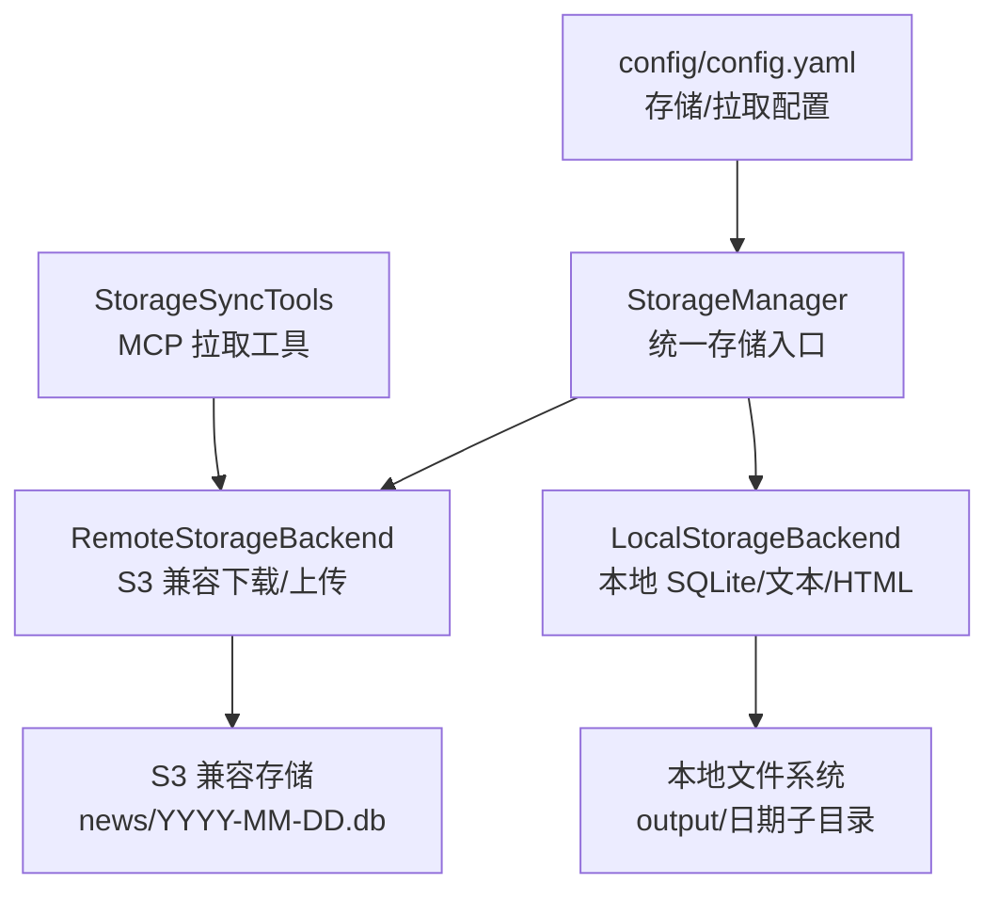
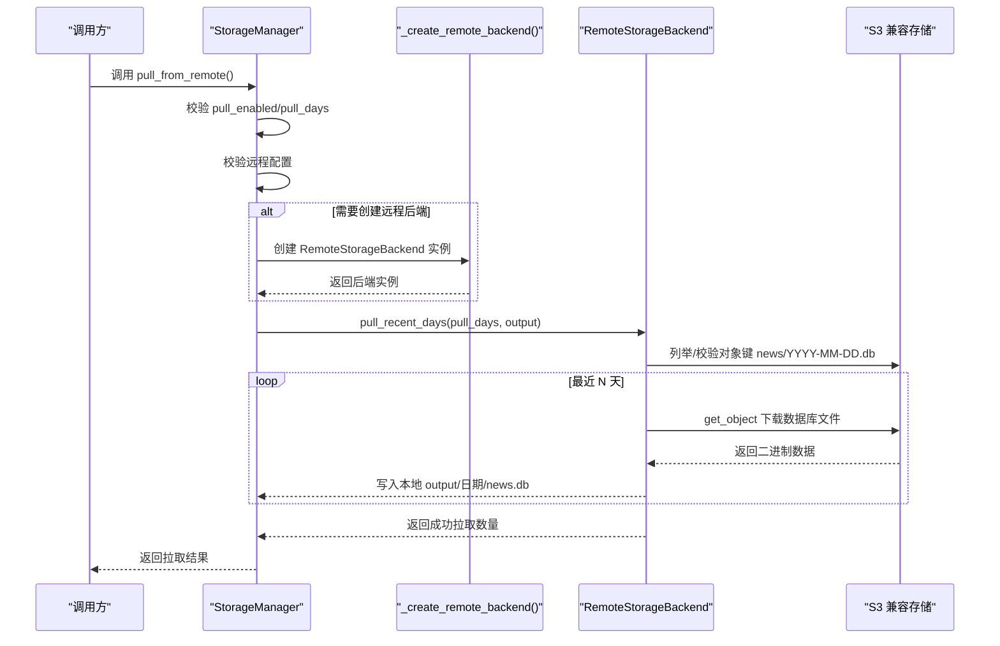
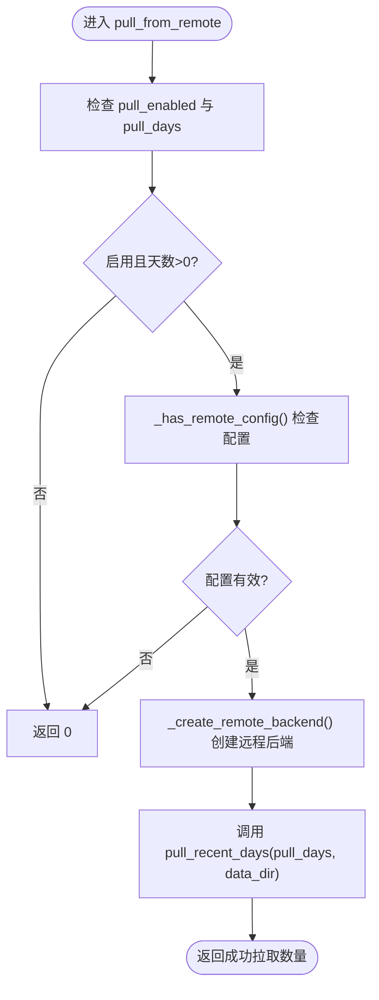
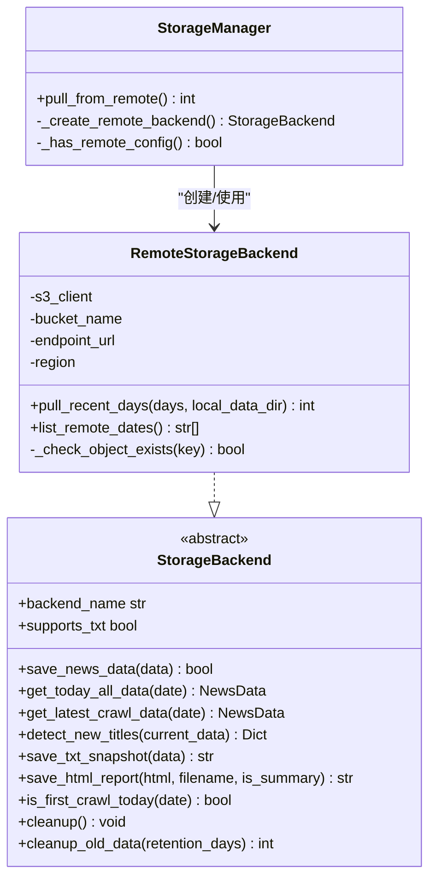
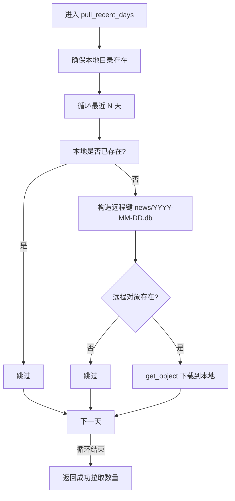
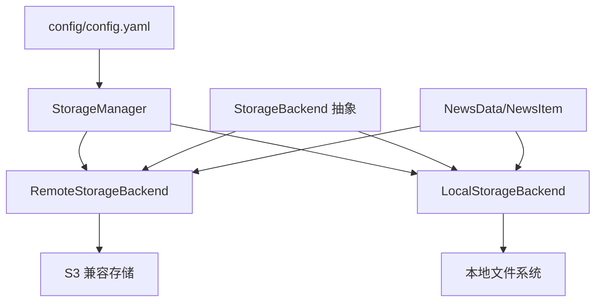

# 数据同步机制

<cite>
**本文引用的文件**
- [trendradar/storage/manager.py](file://trendradar/storage/manager.py)
- [trendradar/storage/remote.py](file://trendradar/storage/remote.py)
- [trendradar/storage/local.py](file://trendradar/storage/local.py)
- [trendradar/storage/base.py](file://trendradar/storage/base.py)
- [trendradar/storage/schema.sql](file://trendradar/storage/schema.sql)
- [mcp_server/tools/storage_sync.py](file://mcp_server/tools/storage_sync.py)
- [config/config.yaml](file://config/config.yaml)
</cite>

## 目录
1. [简介](#简介)
2. [项目结构](#项目结构)
3. [核心组件](#核心组件)
4. [架构总览](#架构总览)
5. [详细组件分析](#详细组件分析)
6. [依赖关系分析](#依赖关系分析)
7. [性能考量](#性能考量)
8. [故障排查指南](#故障排查指南)
9. [结论](#结论)
10. [附录](#附录)

## 简介
本文聚焦 TrendRadar 的数据同步机制，围绕 StorageManager.pull_from_remote() 方法展开，解释其在启动时自动从远程 S3 兼容存储拉取历史数据到本地 output 目录的能力，以支持“增量监控”和“当日汇总”模式。文档详细说明该方法如何通过 _create_remote_backend() 建立远程连接，并调用 RemoteStorageBackend.pull_recent_days() 下载指定天数的 SQLite 数据库文件；同时阐述该机制如何在 GitHub Actions 等无状态环境中，确保每次运行都能获得完整的上下文数据，实现跨执行周期的状态连续性。最后给出 pull_enabled 与 pull_days 配置参数的最佳实践。

## 项目结构
与数据同步相关的关键模块如下：
- 存储管理器：统一调度本地/远程后端，提供 pull_from_remote() 接口
- 远程存储后端：基于 S3 兼容 API，负责下载/上传 SQLite 数据库文件
- 本地存储后端：面向本地文件系统的 SQLite + 文本/HTML 报告
- 抽象基类与数据模型：定义统一接口与数据结构
- 配置文件：定义存储后端类型、格式开关、远程配置、拉取策略等
- MCP 同步工具：提供命令行/服务端拉取能力与状态查询

图表来源
- [trendradar/storage/manager.py](file://trendradar/storage/manager.py#L175-L200)
- [trendradar/storage/remote.py](file://trendradar/storage/remote.py#L1042-L1129)
- [trendradar/storage/local.py](file://trendradar/storage/local.py#L1-L120)
- [config/config.yaml](file://config/config.yaml#L13-L52)

章节来源
- [trendradar/storage/manager.py](file://trendradar/storage/manager.py#L175-L200)
- [trendradar/storage/remote.py](file://trendradar/storage/remote.py#L1042-L1129)
- [trendradar/storage/local.py](file://trendradar/storage/local.py#L1-L120)
- [config/config.yaml](file://config/config.yaml#L13-L52)

## 核心组件
- StorageManager：负责解析运行环境、选择后端、创建远程后端、执行拉取
- RemoteStorageBackend：基于 boto3 的 S3 兼容客户端，提供 pull_recent_days() 下载最近 N 天 SQLite 文件
- LocalStorageBackend：本地 SQLite + 可选 TXT/HTML，用于后续分析与报告
- StorageBackend 抽象基类与 NewsData/NewsItem 数据模型：统一接口与数据结构
- 配置文件 config.yaml：定义 backend 类型、formats、remote、pull 等关键参数

章节来源
- [trendradar/storage/manager.py](file://trendradar/storage/manager.py#L1-L120)
- [trendradar/storage/remote.py](file://trendradar/storage/remote.py#L1-L120)
- [trendradar/storage/local.py](file://trendradar/storage/local.py#L1-L120)
- [trendradar/storage/base.py](file://trendradar/storage/base.py#L1-L120)
- [config/config.yaml](file://config/config.yaml#L13-L52)

## 架构总览
下图展示 pull_from_remote() 的端到端调用链路，从 StorageManager 到 RemoteStorageBackend 的方法调用与数据流。

图表来源
- [trendradar/storage/manager.py](file://trendradar/storage/manager.py#L175-L200)
- [trendradar/storage/remote.py](file://trendradar/storage/remote.py#L1042-L1129)

章节来源
- [trendradar/storage/manager.py](file://trendradar/storage/manager.py#L175-L200)
- [trendradar/storage/remote.py](file://trendradar/storage/remote.py#L1042-L1129)

## 详细组件分析

### StorageManager.pull_from_remote() 方法详解
- 触发条件：当 pull_enabled 为真且 pull_days > 0 时才执行拉取
- 远程配置检查：若未配置远程存储（缺少 endpoint/bucket/access_key 等），直接返回 0
- 远程后端创建：通过 _create_remote_backend() 延迟创建 RemoteStorageBackend 实例
- 调用远程方法：调用 _remote_backend.pull_recent_days(pull_days, data_dir)，将 SQLite 文件下载到本地 output 目录
- 返回值：返回本次成功拉取的数据库文件数量

图表来源
- [trendradar/storage/manager.py](file://trendradar/storage/manager.py#L175-L200)

章节来源
- [trendradar/storage/manager.py](file://trendradar/storage/manager.py#L175-L200)

### _create_remote_backend() 与 RemoteStorageBackend
- _create_remote_backend()：在 StorageManager 中延迟创建 RemoteStorageBackend，读取 remote_config 或环境变量中的 S3_ENDPOINT_URL、S3_BUCKET_NAME、S3_ACCESS_KEY_ID、S3_SECRET_ACCESS_KEY、S3_REGION 等
- RemoteStorageBackend：封装 boto3 客户端，使用虚拟主机风格地址与签名版本（针对腾讯云 COS 使用 SigV2，其他默认 SigV4），提供 pull_recent_days()、list_remote_dates()、上传/下载等能力
- pull_recent_days()：按最近 N 天循环，逐日检查远程对象键 news/YYYY-MM-DD.db 是否存在，若不存在则跳过；若存在则下载到本地 output/日期/news.db

图表来源
- [trendradar/storage/manager.py](file://trendradar/storage/manager.py#L126-L148)
- [trendradar/storage/remote.py](file://trendradar/storage/remote.py#L1042-L1129)
- [trendradar/storage/base.py](file://trendradar/storage/base.py#L187-L356)

章节来源
- [trendradar/storage/manager.py](file://trendradar/storage/manager.py#L126-L148)
- [trendradar/storage/remote.py](file://trendradar/storage/remote.py#L1042-L1129)
- [trendradar/storage/base.py](file://trendradar/storage/base.py#L187-L356)

### RemoteStorageBackend.pull_recent_days() 工作流程
- 输入：days（拉取天数）、local_data_dir（本地输出目录）
- 逻辑：
  - 本地目录不存在则创建
  - 以当前时区时间倒序遍历最近 N 天
  - 对每一天：
    - 若本地已存在对应 news.db，跳过
    - 生成远程对象键 news/YYYY-MM-DD.db
    - 校验对象是否存在，不存在则跳过
    - 使用 get_object + iter_chunks 下载到本地 output/日期/news.db
  - 返回成功拉取的文件数量

图表来源
- [trendradar/storage/remote.py](file://trendradar/storage/remote.py#L1042-L1129)

章节来源
- [trendradar/storage/remote.py](file://trendradar/storage/remote.py#L1042-L1129)

### 与 MCP 同步工具的关系
- MCP Server 提供独立的同步工具 StorageSyncTools，同样基于 RemoteStorageBackend.list_remote_dates() 与 S3 下载实现“从远程拉取到本地”的能力
- 二者目标一致，但 StorageManager.pull_from_remote() 是框架内部在启动阶段自动执行的流程，适合在无状态环境（如 GitHub Actions）中保证每次运行都有完整上下文

章节来源
- [mcp_server/tools/storage_sync.py](file://mcp_server/tools/storage_sync.py#L176-L288)

### 数据模型与表结构
- NewsData/NewsItem：统一的数据结构，便于在本地/远程后端之间传递
- schema.sql：定义 platforms、news_items、title_changes、rank_history、crawl_records、crawl_source_status、push_records 等核心表及索引，支撑排名历史、标题变更、抓取记录、推送记录等业务需求

章节来源
- [trendradar/storage/base.py](file://trendradar/storage/base.py#L1-L186)
- [trendradar/storage/schema.sql](file://trendradar/storage/schema.sql#L1-L118)

## 依赖关系分析
- StorageManager 依赖 RemoteStorageBackend（按需创建）与 LocalStorageBackend（默认后端）
- RemoteStorageBackend 依赖 boto3 客户端与 S3 兼容存储
- 三者均依赖 StorageBackend 抽象接口与 NewsData/NewsItem 数据模型
- 配置文件 config.yaml 决定 backend 类型、formats、remote、pull 等参数

图表来源
- [config/config.yaml](file://config/config.yaml#L13-L52)
- [trendradar/storage/manager.py](file://trendradar/storage/manager.py#L1-L120)
- [trendradar/storage/remote.py](file://trendradar/storage/remote.py#L1-L120)
- [trendradar/storage/local.py](file://trendradar/storage/local.py#L1-L120)
- [trendradar/storage/base.py](file://trendradar/storage/base.py#L187-L356)

章节来源
- [config/config.yaml](file://config/config.yaml#L13-L52)
- [trendradar/storage/manager.py](file://trendradar/storage/manager.py#L1-L120)
- [trendradar/storage/remote.py](file://trendradar/storage/remote.py#L1-L120)
- [trendradar/storage/local.py](file://trendradar/storage/local.py#L1-L120)
- [trendradar/storage/base.py](file://trendradar/storage/base.py#L187-L356)

## 性能考量
- 拉取粒度：按天拉取 SQLite 文件，避免一次性下载全部历史导致网络与磁盘压力过大
- 断点续传：本地已存在则跳过，减少重复下载
- 分页列举：list_remote_dates() 使用分页器列举对象键，避免一次性列举过多对象
- 传输优化：pull_recent_days() 使用 get_object + iter_chunks，适配不同 S3 兼容服务的编码差异
- 时区一致性：统一使用配置时区，确保日期边界与业务逻辑一致

章节来源
- [trendradar/storage/remote.py](file://trendradar/storage/remote.py#L1100-L1129)
- [trendradar/storage/remote.py](file://trendradar/storage/remote.py#L1042-L1129)

## 故障排查指南
- 未配置远程存储：pull_from_remote() 会在配置检查失败时直接返回 0，并打印提示
- 远程后端创建失败：_create_remote_backend() 导入 boto3 失败或初始化异常时返回 None，StorageManager 回退到本地后端
- S3 认证/权限问题：_check_object_exists() 会捕获 ClientError 并区分 404/NoSuchKey 等错误，避免误判为异常
- 无状态环境（如 GitHub Actions）：pull_from_remote() 在启动阶段执行，结合 pull_enabled 与 pull_days，确保每次运行都有最近 N 天的历史数据
- 本地目录权限：确保 output 目录可写，否则拉取后无法写入 news.db

章节来源
- [trendradar/storage/manager.py](file://trendradar/storage/manager.py#L175-L200)
- [trendradar/storage/remote.py](file://trendradar/storage/remote.py#L153-L177)
- [trendradar/storage/remote.py](file://trendradar/storage/remote.py#L1042-L1129)

## 结论
StorageManager.pull_from_remote() 通过 _create_remote_backend() 与 RemoteStorageBackend.pull_recent_days() 的协作，在启动阶段自动从远程 S3 兼容存储拉取最近 N 天的 SQLite 数据库文件至本地 output 目录，从而在 GitHub Actions 等无状态环境中实现跨执行周期的状态连续性。配合 pull_enabled 与 pull_days 配置，用户可在“增量监控”和“当日汇总”模式下获得完整的上下文数据，支撑稳定的数据分析与推送。

## 附录

### 配置参数说明与最佳实践
- backend：选择存储后端类型（local/remote/auto）。在 GitHub Actions 环境下，若配置了远程存储则自动切换为 remote
- formats：sqlite 必须启用；txt/html 可按需开启
- remote：配置 endpoint_url、bucket_name、access_key_id、secret_access_key、region 等；建议通过环境变量注入
- pull.enabled：是否启用启动时自动拉取
- pull.days：拉取最近 N 天的数据；建议根据分析需求与网络/存储成本权衡设置（如 7 天）

章节来源
- [config/config.yaml](file://config/config.yaml#L13-L52)
- [trendradar/storage/manager.py](file://trendradar/storage/manager.py#L93-L125)