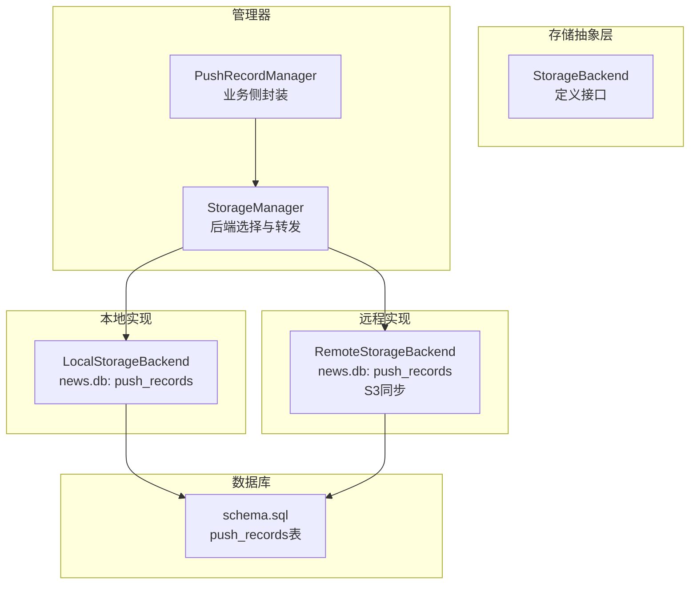
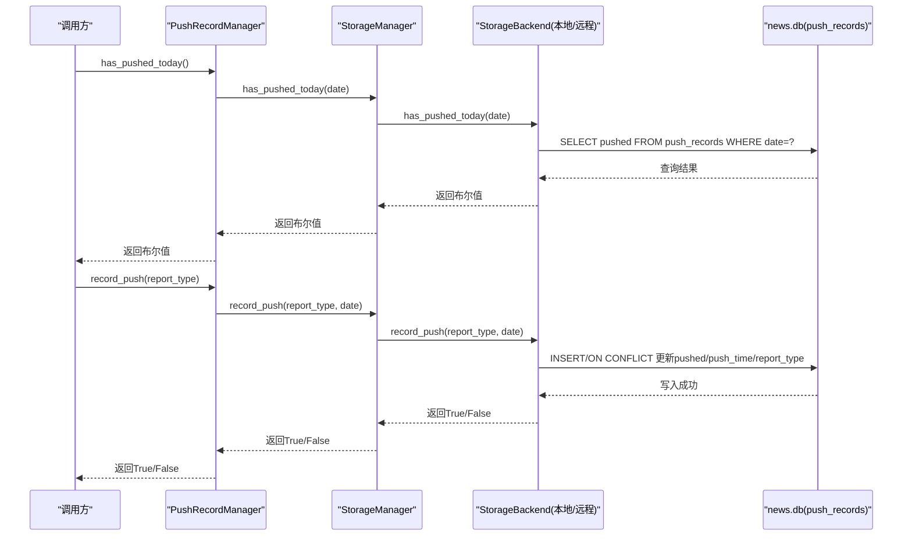
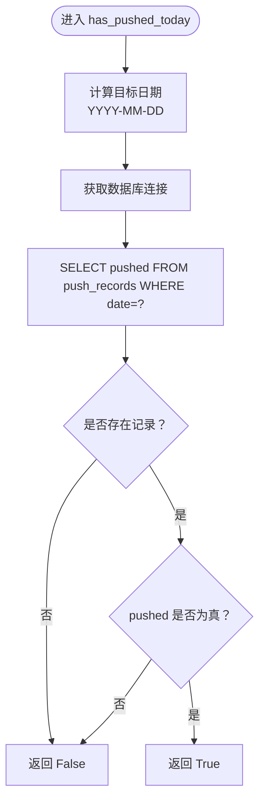
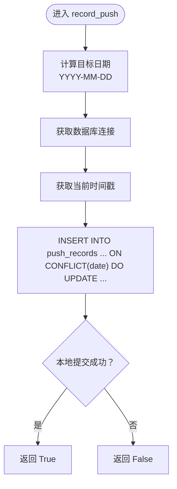
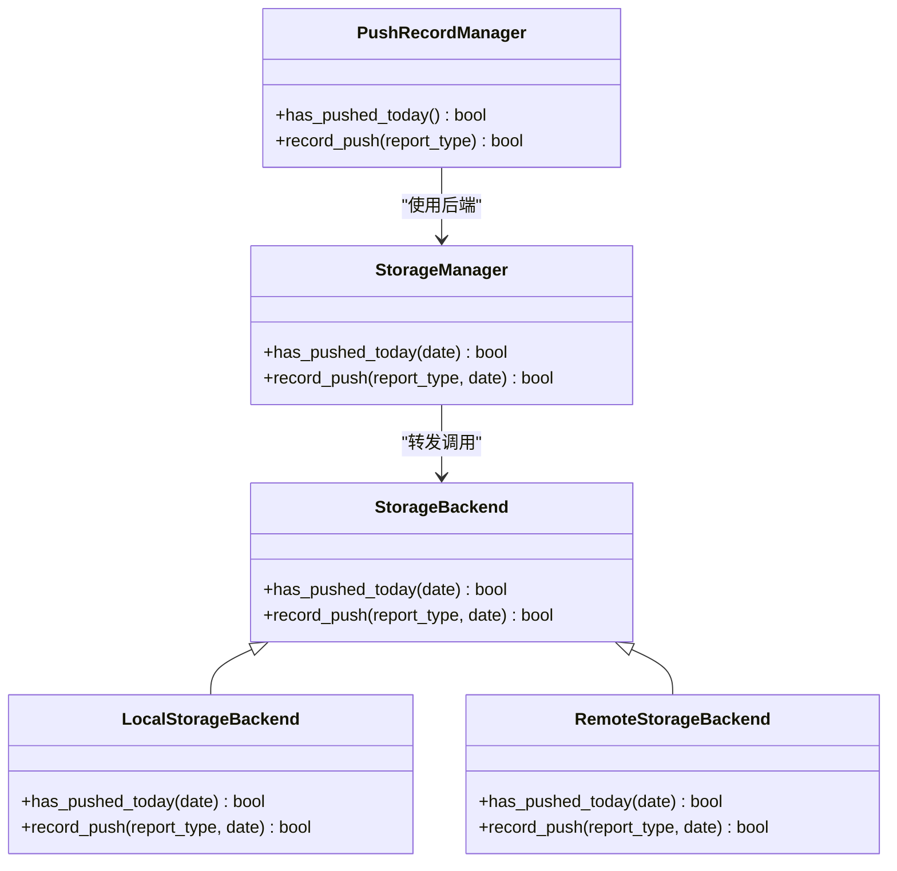

# 推送状态管理

<cite>
**本文引用的文件**
- [trendradar/storage/base.py](file://trendradar/storage/base.py)
- [trendradar/storage/local.py](file://trendradar/storage/local.py)
- [trendradar/storage/remote.py](file://trendradar/storage/remote.py)
- [trendradar/storage/manager.py](file://trendradar/storage/manager.py)
- [trendradar/storage/schema.sql](file://trendradar/storage/schema.sql)
- [trendradar/notification/push_manager.py](file://trendradar/notification/push_manager.py)
- [trendradar/context.py](file://trendradar/context.py)
</cite>

## 目录
1. [简介](#简介)
2. [项目结构](#项目结构)
3. [核心组件](#核心组件)
4. [架构总览](#架构总览)
5. [详细组件分析](#详细组件分析)
6. [依赖关系分析](#依赖关系分析)
7. [性能考量](#性能考量)
8. [故障排查指南](#故障排查指南)
9. [结论](#结论)

## 简介
本文件聚焦于TrendRadar在存储生命周期管理中的“推送状态管理”，系统性解析以下关键点：
- 如何通过has_pushed_today()与record_push()方法实现“每日仅推送一次”的控制；
- 两个方法如何基于SQLite数据库的push_records表进行状态记录与查询；
- LocalStorageBackend与RemoteStorageBackend在news.db数据库中如何持久化推送记录；
- StorageManager如何将调用委托给当前激活的存储后端（本地或远程），保证状态管理一致性；
- 在GitHub Actions等自动化环境中，如何避免重复推送；
- 提供一个典型工作流示例：系统在每日汇总推送前调用has_pushed_today()检查状态，若返回False则执行推送并调用record_push()进行标记。

## 项目结构
推送状态管理涉及的核心文件与职责如下：
- 存储抽象层：定义统一接口，包括has_pushed_today()与record_push()等方法
- 本地存储实现：LocalStorageBackend，使用SQLite news.db存储推送记录
- 远程存储实现：RemoteStorageBackend，同样使用push_records表，但通过S3同步news.db
- 存储管理器：StorageManager，负责后端选择与方法转发
- 推送记录管理器：PushRecordManager，面向业务侧提供once_per_day与时间窗口控制
- 数据库模式：schema.sql定义push_records表结构

图表来源
- [trendradar/storage/base.py](file://trendradar/storage/base.py#L327-L355)
- [trendradar/storage/local.py](file://trendradar/storage/local.py#L820-L890)
- [trendradar/storage/remote.py](file://trendradar/storage/remote.py#L959-L1030)
- [trendradar/storage/manager.py](file://trendradar/storage/manager.py#L267-L293)
- [trendradar/storage/schema.sql](file://trendradar/storage/schema.sql#L83-L95)

章节来源
- [trendradar/storage/base.py](file://trendradar/storage/base.py#L327-L355)
- [trendradar/storage/local.py](file://trendradar/storage/local.py#L820-L890)
- [trendradar/storage/remote.py](file://trendradar/storage/remote.py#L959-L1030)
- [trendradar/storage/manager.py](file://trendradar/storage/manager.py#L267-L293)
- [trendradar/storage/schema.sql](file://trendradar/storage/schema.sql#L83-L95)

## 核心组件
- StorageBackend（抽象接口）
  - 定义has_pushed_today(date)与record_push(report_type, date)方法签名，确保所有后端实现一致的行为契约。
- LocalStorageBackend（本地SQLite实现）
  - 在news.db中使用push_records表记录每日推送状态；查询与写入均基于date字段。
- RemoteStorageBackend（远程S3实现）
  - 同样使用push_records表；记录后会将news.db上传至S3，确保跨容器/节点的一致性。
- StorageManager（后端选择与转发）
  - 根据环境（如GitHub Actions）自动选择本地或远程后端，并将has_pushed_today()/record_push()转发给当前后端。
- PushRecordManager（业务侧封装）
  - 对外暴露has_pushed_today()/record_push()，并提供时间窗口判断能力，便于在特定时间段内控制推送节奏。
- schema.sql（数据库模式）
  - 定义push_records表：date唯一索引、pushed布尔标志、push_time与report_type等字段。

章节来源
- [trendradar/storage/base.py](file://trendradar/storage/base.py#L327-L355)
- [trendradar/storage/local.py](file://trendradar/storage/local.py#L820-L890)
- [trendradar/storage/remote.py](file://trendradar/storage/remote.py#L959-L1030)
- [trendradar/storage/manager.py](file://trendradar/storage/manager.py#L267-L293)
- [trendradar/storage/schema.sql](file://trendradar/storage/schema.sql#L83-L95)
- [trendradar/notification/push_manager.py](file://trendradar/notification/push_manager.py#L15-L67)

## 架构总览
推送状态管理的调用链路如下：
- PushRecordManager对外提供has_pushed_today()/record_push()；
- StorageManager根据运行环境选择后端并转发调用；
- LocalStorageBackend/RemoteStorageBackend在news.db的push_records表上执行查询与写入；
- RemoteStorageBackend额外负责将news.db上传到S3，确保跨环境一致性。

图表来源
- [trendradar/notification/push_manager.py](file://trendradar/notification/push_manager.py#L47-L67)
- [trendradar/storage/manager.py](file://trendradar/storage/manager.py#L267-L293)
- [trendradar/storage/local.py](file://trendradar/storage/local.py#L820-L890)
- [trendradar/storage/remote.py](file://trendradar/storage/remote.py#L959-L1030)

## 详细组件分析

### has_pushed_today() 设计与实现
- 目标：检查指定日期是否已推送过，防止重复推送。
- 查询策略：
  - 本地与远程实现均通过SQLite查询push_records表，条件为date字段匹配目标日期。
  - 若存在记录且pushed为真，则返回True；否则返回False。
- 时区与日期格式：
  - 两个实现均使用本地/配置时区的日期格式（YYYY-MM-DD）作为查询键，确保跨容器/节点一致性。
- 异常处理：
  - 任何异常均返回False，避免因数据库异常导致误判。

图表来源
- [trendradar/storage/local.py](file://trendradar/storage/local.py#L820-L849)
- [trendradar/storage/remote.py](file://trendradar/storage/remote.py#L959-L987)

章节来源
- [trendradar/storage/local.py](file://trendradar/storage/local.py#L820-L849)
- [trendradar/storage/remote.py](file://trendradar/storage/remote.py#L959-L987)

### record_push() 设计与实现
- 目标：在指定日期记录一次推送，包含报告类型与推送时间。
- 写入策略：
  - 以date为唯一键，INSERT一条记录；若冲突则通过ON CONFLICT更新pushed/push_time/report_type。
  - 本地实现直接提交事务；远程实现还会触发news.db上传到S3，确保跨环境持久化。
- 时序与幂等：
  - 即使多次调用，只要日期相同，最终只会保留最后一次推送时间与报告类型，保证幂等性。

图表来源
- [trendradar/storage/local.py](file://trendradar/storage/local.py#L851-L886)
- [trendradar/storage/remote.py](file://trendradar/storage/remote.py#L988-L1030)

章节来源
- [trendradar/storage/local.py](file://trendradar/storage/local.py#L851-L886)
- [trendradar/storage/remote.py](file://trendradar/storage/remote.py#L988-L1030)

### LocalStorageBackend 与 RemoteStorageBackend 的差异
- 共同点：
  - 均使用news.db数据库与push_records表；
  - 均以date为唯一键，记录pushed布尔标志、push_time与report_type。
- 差异点：
  - RemoteStorageBackend在记录成功后，会将news.db上传到S3，确保在GitHub Actions等容器环境下，推送状态不会因容器重建而丢失。
  - StorageManager在GitHub Actions环境中优先选择远程后端（若配置了S3），从而保证“每日仅推送一次”在CI中仍然生效。

章节来源
- [trendradar/storage/local.py](file://trendradar/storage/local.py#L820-L890)
- [trendradar/storage/remote.py](file://trendradar/storage/remote.py#L959-L1030)
- [trendradar/storage/manager.py](file://trendradar/storage/manager.py#L93-L106)

### StorageManager 的后端选择与转发
- 自动选择：
  - 在GitHub Actions环境中，若配置了S3，则优先使用远程后端；否则回退到本地后端。
  - 在非CI环境中，默认使用本地后端。
- 转发机制：
  - has_pushed_today()/record_push()直接转发给当前后端实例，保证上层调用无需感知后端差异。

章节来源
- [trendradar/storage/manager.py](file://trendradar/storage/manager.py#L72-L106)
- [trendradar/storage/manager.py](file://trendradar/storage/manager.py#L267-L293)

### PushRecordManager 的业务封装
- 对外提供has_pushed_today()/record_push()，屏蔽底层存储细节；
- 提供时间窗口判断能力，便于在特定时间段内控制推送；
- 通过context.py注入StorageManager，形成统一的推送状态管理入口。

章节来源
- [trendradar/notification/push_manager.py](file://trendradar/notification/push_manager.py#L15-L67)
- [trendradar/context.py](file://trendradar/context.py#L376-L381)

### 数据库模式：push_records 表
- 关键字段：
  - date：唯一索引，YYYY-MM-DD格式；
  - pushed：布尔标志，表示当日是否已推送；
  - push_time：推送时间；
  - report_type：报告类型；
  - created_at：记录创建时间。
- 设计要点：
  - 唯一键约束确保每日仅一条推送记录；
  - ON CONFLICT更新语义保证幂等写入。

章节来源
- [trendradar/storage/schema.sql](file://trendradar/storage/schema.sql#L83-L95)

## 依赖关系分析
- PushRecordManager依赖StorageManager提供的后端实例；
- StorageManager在GitHub Actions环境下选择RemoteStorageBackend，确保状态跨容器持久化；
- LocalStorageBackend/RemoteStorageBackend共享同一SQL模式（push_records表），降低耦合；
- StorageBackend抽象层隔离了具体实现差异，提升可扩展性。

图表来源
- [trendradar/storage/base.py](file://trendradar/storage/base.py#L327-L355)
- [trendradar/storage/local.py](file://trendradar/storage/local.py#L820-L890)
- [trendradar/storage/remote.py](file://trendradar/storage/remote.py#L959-L1030)
- [trendradar/storage/manager.py](file://trendradar/storage/manager.py#L267-L293)
- [trendradar/notification/push_manager.py](file://trendradar/notification/push_manager.py#L47-L67)

## 性能考量
- 查询与写入均为单表单键查询，push_records表具备date唯一索引，查询与写入开销低；
- RemoteStorageBackend在record_push后执行news.db上传，可能带来网络延迟；建议在批量推送场景下合并调用，减少上传频次；
- ON CONFLICT更新语义避免重复写入，提高幂等性与稳定性。

## 故障排查指南
- has_pushed_today()始终返回False
  - 检查push_records表中是否存在对应date记录；确认date格式是否为YYYY-MM-DD；
  - 确认数据库连接是否正常，以及news.db是否存在于对应日期目录。
- record_push()返回False
  - 检查数据库写入权限与磁盘空间；
  - 远程后端需确认S3上传是否成功，必要时重试或检查网络/凭证。
- GitHub Actions中重复推送
  - 确认StorageManager是否选择了远程后端（已配置S3）；
  - 确认news.db是否成功上传至S3，避免容器重建导致状态丢失。

章节来源
- [trendradar/storage/local.py](file://trendradar/storage/local.py#L820-L890)
- [trendradar/storage/remote.py](file://trendradar/storage/remote.py#L988-L1030)
- [trendradar/storage/manager.py](file://trendradar/storage/manager.py#L93-L106)

## 结论
- has_pushed_today()与record_push()通过push_records表实现了可靠的“每日仅推送一次”控制；
- LocalStorageBackend与RemoteStorageBackend共享同一模式，前者适合本地开发/测试，后者在CI/CD环境中提供跨容器持久化保障；
- StorageManager在GitHub Actions等自动化环境中自动选择远程后端，确保状态一致性；
- 推荐在每日汇总推送前先调用has_pushed_today()，若返回False再执行推送并调用record_push()进行标记，从而避免重复推送。