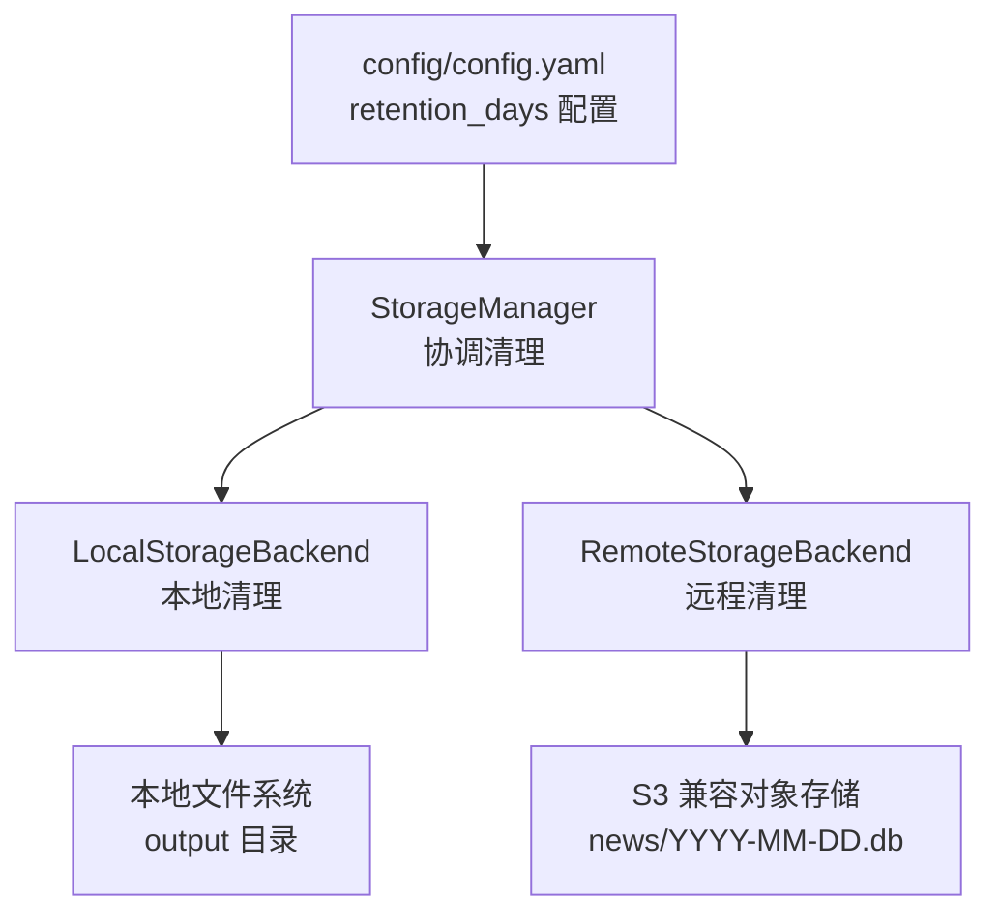
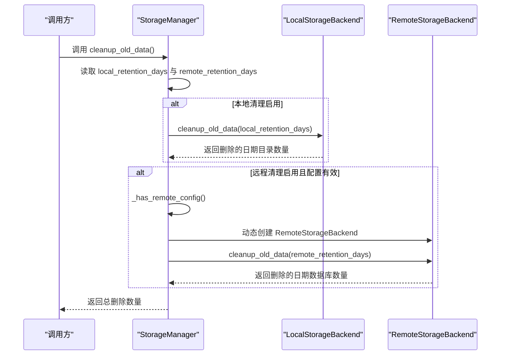
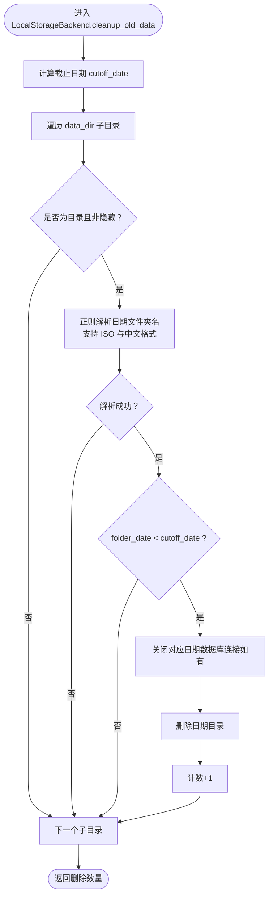
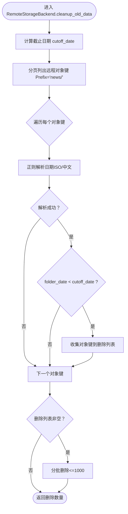
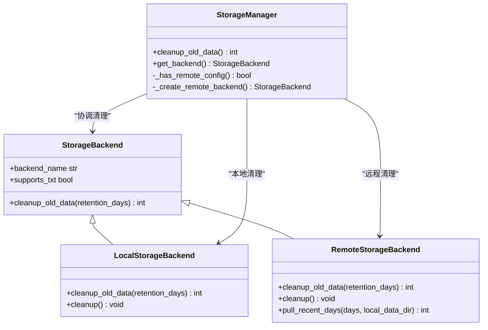
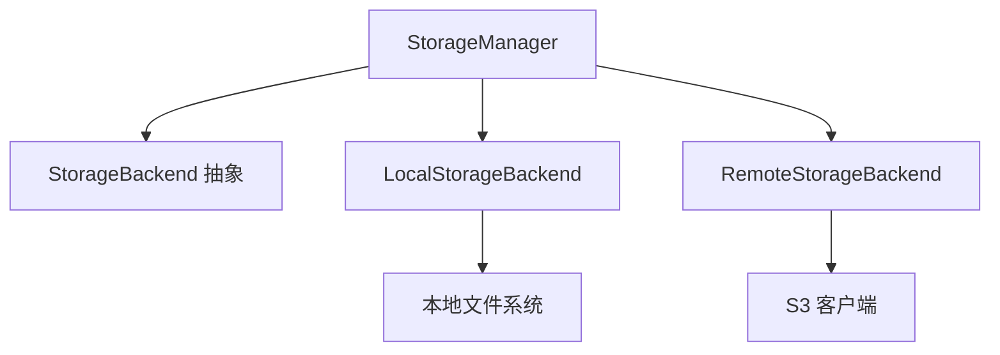

# 数据清理策略

<cite>
**本文引用的文件**
- [trendradar/storage/manager.py](file://trendradar/storage/manager.py)
- [trendradar/storage/local.py](file://trendradar/storage/local.py)
- [trendradar/storage/remote.py](file://trendradar/storage/remote.py)
- [trendradar/storage/base.py](file://trendradar/storage/base.py)
- [config/config.yaml](file://config/config.yaml)
- [mcp_server/tools/storage_sync.py](file://mcp_server/tools/storage_sync.py)
</cite>

## 目录
1. [简介](#简介)
2. [项目结构](#项目结构)
3. [核心组件](#核心组件)
4. [架构总览](#架构总览)
5. [详细组件分析](#详细组件分析)
6. [依赖关系分析](#依赖关系分析)
7. [性能考量](#性能考量)
8. [故障排查指南](#故障排查指南)
9. [结论](#结论)
10. [附录](#附录)

## 简介
本文件聚焦 TrendRadar 存储生命周期管理中的“数据清理策略”，系统性说明 `cleanup_old_data()` 方法的实现机制与工作流程。重点覆盖：
- StorageManager 如何协调本地与远程存储的清理操作；
- 依据 local_retention_days 与 remote_retention_days 配置参数执行过期数据删除；
- LocalStorageBackend 的 cleanup_old_data 如何遍历 output 目录，使用正则表达式解析 ISO（YYYY-MM-DD）与中文（YYYY年MM月DD日）两种日期文件夹名，并与基于时区计算的截止日期比较，识别并删除过期目录；
- 远程存储清理的异步特性：StorageManager 在检测到远程配置后，动态创建 RemoteStorageBackend 实例并调用其 cleanup_old_data，实现对 S3 兼容存储中过期数据库文件的批量删除；
- 通过配置文件示例展示 local_retention_days: 7 与 remote_retention_days: 30 的实际影响。

## 项目结构
围绕数据清理策略的关键文件与职责如下：
- trendradar/storage/manager.py：存储管理器，负责根据配置与环境选择后端，统一暴露 cleanup_old_data 接口，并在需要时动态创建远程后端实例。
- trendradar/storage/local.py：本地存储后端，实现本地文件系统的清理逻辑，包括关闭数据库连接与删除过期目录。
- trendradar/storage/remote.py：远程存储后端，实现 S3 兼容对象存储的清理逻辑，按日期数据库文件批量删除。
- trendradar/storage/base.py：定义统一的存储接口与数据模型，cleanup_old_data 为抽象方法，要求各后端实现。
- config/config.yaml：配置入口，定义 storage.local.retention_days 与 storage.remote.retention_days 等关键参数。
- mcp_server/tools/storage_sync.py：辅助工具，用于列举本地与远程可用日期、计算目录大小等，便于理解清理前后状态。

图表来源
- [trendradar/storage/manager.py](file://trendradar/storage/manager.py#L234-L256)
- [trendradar/storage/local.py](file://trendradar/storage/local.py#L746-L821)
- [trendradar/storage/remote.py](file://trendradar/storage/remote.py#L870-L958)
- [config/config.yaml](file://config/config.yaml#L26-L46)

章节来源
- [trendradar/storage/manager.py](file://trendradar/storage/manager.py#L234-L256)
- [trendradar/storage/local.py](file://trendradar/storage/local.py#L746-L821)
- [trendradar/storage/remote.py](file://trendradar/storage/remote.py#L870-L958)
- [config/config.yaml](file://config/config.yaml#L26-L46)

## 核心组件
- StorageManager.cleanup_old_data：统一入口，依据 local_retention_days 与 remote_retention_days 决定是否清理本地与远程数据；当 remote_retention_days > 0 且存在远程配置时，动态创建 RemoteStorageBackend 并调用其清理方法。
- LocalStorageBackend.cleanup_old_data：遍历 data_dir 下的日期目录，解析 ISO 与中文两种日期格式，计算截止日期，关闭对应日期的数据库连接后删除过期目录。
- RemoteStorageBackend.cleanup_old_data：列出远程 news/ 前缀下的数据库对象，解析日期，批量删除过期对象键，返回清理的日期数量。
- StorageBackend 抽象接口：定义 cleanup_old_data 为统一清理接口，要求各后端实现。

章节来源
- [trendradar/storage/manager.py](file://trendradar/storage/manager.py#L234-L256)
- [trendradar/storage/local.py](file://trendradar/storage/local.py#L746-L821)
- [trendradar/storage/remote.py](file://trendradar/storage/remote.py#L870-L958)
- [trendradar/storage/base.py](file://trendradar/storage/base.py#L298-L309)

## 架构总览
StorageManager 作为协调者，结合配置参数决定清理策略；Local/Remote 后端分别处理各自存储介质的清理细节。

图表来源
- [trendradar/storage/manager.py](file://trendradar/storage/manager.py#L234-L256)
- [trendradar/storage/local.py](file://trendradar/storage/local.py#L746-L821)
- [trendradar/storage/remote.py](file://trendradar/storage/remote.py#L870-L958)

## 详细组件分析

### StorageManager.cleanup_old_data 协调流程
- 仅当 local_retention_days > 0 时清理本地数据，调用 get_backend().cleanup_old_data(local_retention_days)。
- 仅当 remote_retention_days > 0 且 _has_remote_config() 为真时清理远程数据；若远程后端尚未创建，则通过 _create_remote_backend() 动态创建，再调用其 cleanup_old_data(remote_retention_days)。
- 返回本地与远程删除数量之和。

章节来源
- [trendradar/storage/manager.py](file://trendradar/storage/manager.py#L234-L256)

### LocalStorageBackend.cleanup_old_data 本地清理机制
- 截止日期计算：基于配置时区获取当前时间，减去 retention_days 得到 cutoff_date。
- 遍历 data_dir 下的子目录（忽略隐藏项）：
  - 使用正则解析日期文件夹名，支持 ISO（YYYY-MM-DD）与中文（YYYY年MM月DD日）两种格式；
  - 将解析得到的 folder_date 与 cutoff_date 比较，若早于 cutoff_date 则判定为过期；
  - 关闭该日期对应的数据库连接（如有），然后删除整个日期目录；
  - 统计删除数量并输出日志。
- 返回删除的日期目录数量。

图表来源
- [trendradar/storage/local.py](file://trendradar/storage/local.py#L746-L821)

章节来源
- [trendradar/storage/local.py](file://trendradar/storage/local.py#L746-L821)

### RemoteStorageBackend.cleanup_old_data 远程清理机制
- 截止日期计算：同样基于配置时区与 retention_days。
- 使用 S3 客户端分页列出远程存储中 news/ 前缀下的对象键（支持 ISO 与中文两种数据库文件命名）：
  - 正则解析对象键中的日期，构造 folder_date；
  - 若 folder_date 早于 cutoff_date，收集对象键加入待删列表；
- 批量删除（每次最多 1000 个对象键），统计清理的日期数量并输出日志。
- 返回删除的日期数据库文件数量。

图表来源
- [trendradar/storage/remote.py](file://trendradar/storage/remote.py#L870-L958)

章节来源
- [trendradar/storage/remote.py](file://trendradar/storage/remote.py#L870-L958)

### 配置参数与实际影响
- 配置文件中 storage.local.retention_days 与 storage.remote.retention_days 决定清理开关与保留期限：
  - 0：不清理；
  - 正整数 N：仅保留最近 N 天的数据，自动删除过期数据。
- 示例：local_retention_days: 7 与 remote_retention_days: 30
  - 本地 output 目录中早于 7 天的日期目录会被删除；
  - 远程 S3 兼容存储中早于 30 天的 news/YYYY-MM-DD.db（含中文命名）会被批量删除。

章节来源
- [config/config.yaml](file://config/config.yaml#L26-L46)

### 类关系图

图表来源
- [trendradar/storage/base.py](file://trendradar/storage/base.py#L187-L356)
- [trendradar/storage/local.py](file://trendradar/storage/local.py#L1-L120)
- [trendradar/storage/remote.py](file://trendradar/storage/remote.py#L1-L120)
- [trendradar/storage/manager.py](file://trendradar/storage/manager.py#L1-L120)

## 依赖关系分析
- StorageManager 依赖：
  - StorageBackend 抽象接口，确保本地与远程后端实现统一清理接口；
  - 本地后端 LocalStorageBackend；
  - 远程后端 RemoteStorageBackend（按需动态创建）。
- LocalStorageBackend 依赖：
  - 本地文件系统（output 目录）；
  - 时区工具（获取配置时区时间）；
  - 正则表达式解析日期文件夹名；
  - SQLite 连接池（关闭对应日期的连接）。
- RemoteStorageBackend 依赖：
  - S3 客户端（boto3）；
  - 分页列举与批量删除；
  - 正则表达式解析远程对象键中的日期。

图表来源
- [trendradar/storage/manager.py](file://trendradar/storage/manager.py#L1-L120)
- [trendradar/storage/local.py](file://trendradar/storage/local.py#L1-L120)
- [trendradar/storage/remote.py](file://trendradar/storage/remote.py#L1-L120)

章节来源
- [trendradar/storage/manager.py](file://trendradar/storage/manager.py#L1-L120)
- [trendradar/storage/local.py](file://trendradar/storage/local.py#L1-L120)
- [trendradar/storage/remote.py](file://trendradar/storage/remote.py#L1-L120)

## 性能考量
- 本地清理：
  - 遍历目录与正则解析为 O(N) 操作，N 为日期目录数量；
  - 删除目录涉及磁盘 IO，建议在低峰时段执行；
  - 关闭数据库连接后再删除，避免文件占用导致删除失败。
- 远程清理：
  - 分页列举对象键，避免一次性内存压力；
  - 批量删除（每次最多 1000 个），减少 API 调用次数；
  - 正则解析远程对象键为 O(M)，M 为对象数量；
  - 删除后输出日志，便于审计与排障。

[本节为通用指导，无需具体文件分析]

## 故障排查指南
- 本地清理无效：
  - 检查 data_dir 是否正确（默认 output），确认目录存在；
  - 确认 local_retention_days > 0；
  - 查看日志中“清理过期数据”输出，确认过期日期被识别与删除。
- 远程清理无效：
  - 确认 remote_retention_days > 0 且远程配置有效（endpoint_url、bucket_name、access_key_id、secret_access_key）；
  - 检查 S3 客户端初始化与权限；
  - 查看日志中“删除 N 个对象”与“清理过期数据: news/YYYY-MM-DD.db”的输出。
- 日期格式不匹配：
  - 确认日期文件夹名为 ISO（YYYY-MM-DD）或中文（YYYY年MM月DD日）；
  - 若混用格式，可能导致部分日期未被识别清理。

章节来源
- [trendradar/storage/local.py](file://trendradar/storage/local.py#L746-L821)
- [trendradar/storage/remote.py](file://trendradar/storage/remote.py#L870-L958)
- [trendradar/storage/manager.py](file://trendradar/storage/manager.py#L107-L148)

## 结论
TrendRadar 的数据清理策略通过 StorageManager 统一协调本地与远程存储的过期数据删除，确保：
- 本地与远程均支持基于时区的截止日期计算；
- 本地清理支持 ISO 与中文两种日期文件夹命名，远程清理支持 ISO 与中文两种数据库文件命名；
- 远程清理采用分页列举与批量删除，兼顾性能与可靠性；
- 通过配置参数 local_retention_days 与 remote_retention_days 精准控制保留周期，满足不同部署场景的需求。

[本节为总结，无需具体文件分析]

## 附录

### 配置示例与影响说明
- 在 config/config.yaml 中设置：
  - storage.local.retention_days: 7
  - storage.remote.retention_days: 30
- 影响：
  - 本地 output 目录中早于 7 天的日期目录将被删除；
  - 远程 S3 兼容存储中早于 30 天的 news/YYYY-MM-DD.db（含中文命名）将被批量删除。

章节来源
- [config/config.yaml](file://config/config.yaml#L26-L46)