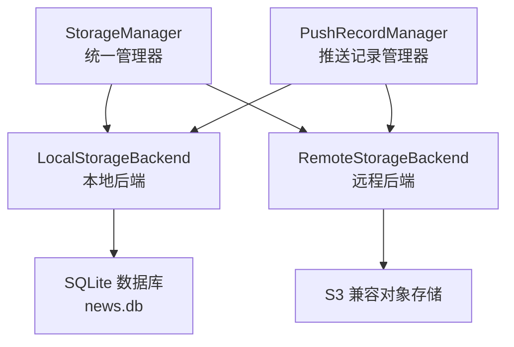
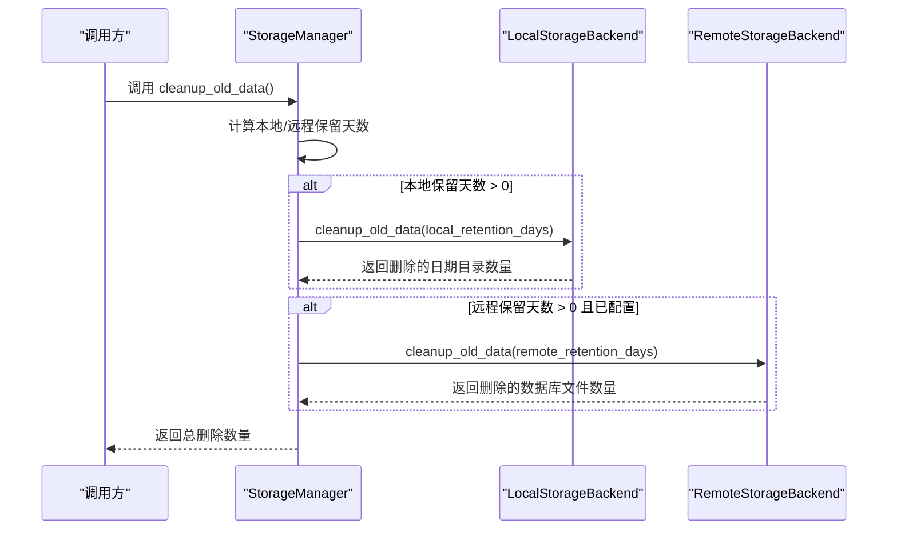
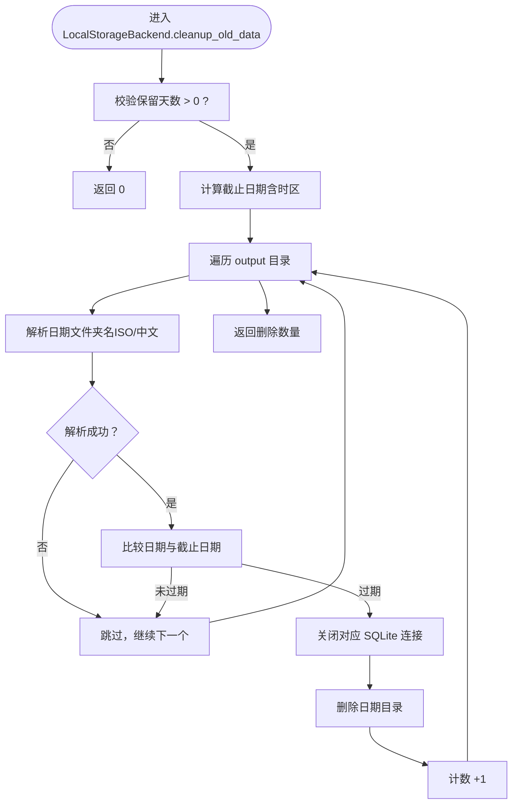
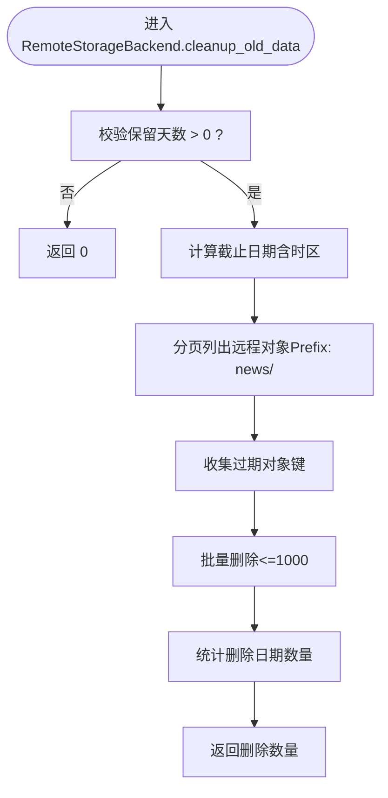
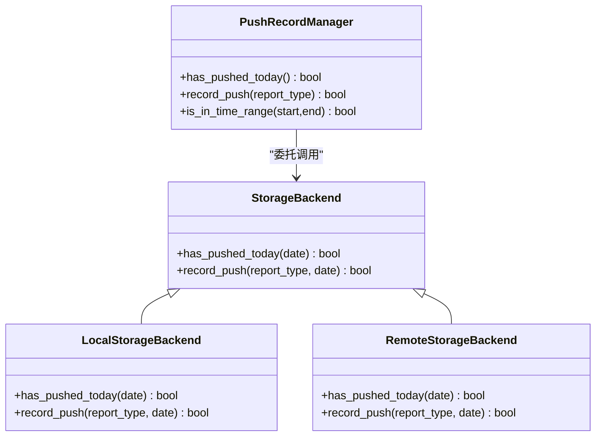
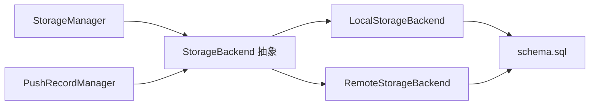

# 生命周期管理

<cite>
**本文引用的文件**
- [trendradar/storage/manager.py](file://trendradar/storage/manager.py)
- [trendradar/storage/local.py](file://trendradar/storage/local.py)
- [trendradar/storage/remote.py](file://trendradar/storage/remote.py)
- [trendradar/storage/base.py](file://trendradar/storage/base.py)
- [trendradar/storage/schema.sql](file://trendradar/storage/schema.sql)
- [trendradar/notification/push_manager.py](file://trendradar/notification/push_manager.py)
</cite>

## 目录
1. [简介](#简介)
2. [项目结构](#项目结构)
3. [核心组件](#核心组件)
4. [架构总览](#架构总览)
5. [详细组件分析](#详细组件分析)
6. [依赖关系分析](#依赖关系分析)
7. [性能考量](#性能考量)
8. [故障排查指南](#故障排查指南)
9. [结论](#结论)

## 简介
本文件聚焦于TrendRadar的存储生命周期管理，围绕“清理过期数据”这一关键能力，系统阐述以下要点：
- cleanup_old_data()方法如何依据local_retention_days与remote_retention_days配置，分别清理本地output目录与远程对象存储中的过期数据，从而有效控制存储占用。
- 该方法如何遍历output目录，解析日期文件夹名（同时支持ISO与中文格式），并与基于时区的截止日期比较，识别并删除过期目录。
- 本地SQLite数据库连接的生命周期管理（通过LocalStorageBackend._db_connections）与远程存储的异步清理策略（通过RemoteStorageBackend）的协同机制。
- 推送状态记录与防重复推送：has_pushed_today()与record_push()如何利用存储后端的push_records表，配合PushRecordManager在GitHub Actions等自动化环境中实现“每日一次”的推送控制。

## 项目结构
TrendRadar采用“后端抽象 + 多后端实现”的存储架构：
- 抽象层：StorageBackend定义统一接口，包括数据保存、读取、推送记录等。
- 本地实现：LocalStorageBackend负责本地SQLite数据库与可选的TXT/HTML快照；提供cleanup_old_data()清理本地过期目录。
- 远程实现：RemoteStorageBackend负责S3兼容对象存储；提供cleanup_old_data()清理远程过期数据库文件，并支持has_pushed_today()/record_push()。
- 管理器：StorageManager根据环境与配置选择后端，协调本地与远程的清理与推送。
- 推送记录：PushRecordManager封装推送记录的查询与写入，统一调用底层存储后端。

图表来源
- [trendradar/storage/manager.py](file://trendradar/storage/manager.py#L1-L344)
- [trendradar/storage/local.py](file://trendradar/storage/local.py#L1-L890)
- [trendradar/storage/remote.py](file://trendradar/storage/remote.py#L1-L1129)
- [trendradar/notification/push_manager.py](file://trendradar/notification/push_manager.py#L1-L110)

章节来源
- [trendradar/storage/manager.py](file://trendradar/storage/manager.py#L1-L344)
- [trendradar/storage/local.py](file://trendradar/storage/local.py#L1-L890)
- [trendradar/storage/remote.py](file://trendradar/storage/remote.py#L1-L1129)
- [trendradar/storage/base.py](file://trendradar/storage/base.py#L1-L456)
- [trendradar/notification/push_manager.py](file://trendradar/notification/push_manager.py#L1-L110)

## 核心组件
- StorageManager.cleanup_old_data(): 统一入口，按配置分别调用本地与远程后端的清理方法，返回删除的日期目录数量。
- LocalStorageBackend.cleanup_old_data(): 遍历output目录，解析日期文件夹名（ISO与中文），计算截止日期，关闭对应SQLite连接并删除过期目录。
- RemoteStorageBackend.cleanup_old_data(): 列举远程news/前缀对象，解析日期键名（ISO与中文），批量删除过期数据库文件。
- StorageBackend.has_pushed_today()/record_push(): 抽象接口，由具体后端实现，用于记录与查询推送状态。
- PushRecordManager：封装推送记录的查询与写入，统一调用底层存储后端，便于在GitHub Actions等环境中实现“每日一次”。

章节来源
- [trendradar/storage/manager.py](file://trendradar/storage/manager.py#L235-L256)
- [trendradar/storage/local.py](file://trendradar/storage/local.py#L746-L820)
- [trendradar/storage/remote.py](file://trendradar/storage/remote.py#L870-L958)
- [trendradar/storage/base.py](file://trendradar/storage/base.py#L298-L355)
- [trendradar/notification/push_manager.py](file://trendradar/notification/push_manager.py#L1-L110)

## 架构总览
下面的序列图展示了cleanup_old_data()的调用链路与执行流程，包括本地与远程清理的协同。

图表来源
- [trendradar/storage/manager.py](file://trendradar/storage/manager.py#L235-L256)
- [trendradar/storage/local.py](file://trendradar/storage/local.py#L746-L820)
- [trendradar/storage/remote.py](file://trendradar/storage/remote.py#L870-L958)

## 详细组件分析

### StorageManager.cleanup_old_data() 实现
- 角色与职责
  - 作为统一入口，根据配置决定是否清理本地与远程数据。
  - 本地清理：委托给当前后端（LocalStorageBackend）的cleanup_old_data()。
  - 远程清理：若配置了远程后端，则创建远程后端实例并调用其cleanup_old_data()。
- 关键行为
  - 本地：当local_retention_days > 0时，调用后端清理方法。
  - 远程：当remote_retention_days > 0且_has_remote_config()为真时，延迟创建远程后端并清理。
  - 返回值：累计删除的日期目录数量（本地）与数据库文件数量（远程）。

章节来源
- [trendradar/storage/manager.py](file://trendradar/storage/manager.py#L235-L256)

### LocalStorageBackend.cleanup_old_data() 实现
- 目标与范围
  - 清理output目录下过期的日期子目录（按天组织）。
- 日期解析与截止日期
  - 支持两种日期文件夹命名格式：ISO（YYYY-MM-DD）与中文（YYYY年MM月DD日）。
  - 截止日期通过时区配置计算，确保与系统时区一致。
- 连接管理与目录删除
  - 在删除目录前，定位对应news.db的SQLite连接，若存在则关闭并移除缓存，避免文件占用导致删除失败。
  - 使用安全删除策略，逐个目录删除并统计数量。
- 返回值
  - 删除的日期目录数量。

图表来源
- [trendradar/storage/local.py](file://trendradar/storage/local.py#L746-L820)

章节来源
- [trendradar/storage/local.py](file://trendradar/storage/local.py#L746-L820)

### RemoteStorageBackend.cleanup_old_data() 实现
- 目标与范围
  - 清理远程对象存储中过期的news/日期.db文件。
- 日期解析与截止日期
  - 支持两种键名格式：ISO（news/YYYY-MM-DD.db）与中文（news/YYYY年MM月DD日.db）。
  - 截止日期同样基于时区配置计算。
- 远程清理策略
  - 使用list_objects_v2分页列举远程对象，收集过期对象键。
  - 采用批量删除（每次最多1000个），减少API调用次数。
  - 统计删除的日期数量并输出清理日志。
- 返回值
  - 删除的数据库文件数量（按日期去重计数）。

图表来源
- [trendradar/storage/remote.py](file://trendradar/storage/remote.py#L870-L958)

章节来源
- [trendradar/storage/remote.py](file://trendradar/storage/remote.py#L870-L958)

### 推送记录与防重复推送：has_pushed_today() 与 record_push()
- 设计目标
  - 在本地与远程存储中统一记录“某日期是否已推送”，避免在GitHub Actions等自动化环境中重复推送。
- 数据模型
  - push_records表包含date、pushed、push_time、report_type等字段，其中date为UNIQUE，确保每日唯一。
- 本地实现（LocalStorageBackend）
  - has_pushed_today()/record_push()均通过SQLite连接访问push_records表，使用ON CONFLICT(date) DO UPDATE保证幂等。
- 远程实现（RemoteStorageBackend）
  - 同样基于SQLite（本地临时文件），完成后上传至远程，确保记录持久化。
- 管理器封装（PushRecordManager）
  - PushRecordManager统一调用底层后端的has_pushed_today()/record_push()，并提供时间窗口判断辅助方法，便于在自动化流水线中控制推送节奏。

图表来源
- [trendradar/storage/base.py](file://trendradar/storage/base.py#L298-L355)
- [trendradar/storage/local.py](file://trendradar/storage/local.py#L822-L886)
- [trendradar/storage/remote.py](file://trendradar/storage/remote.py#L959-L1030)
- [trendradar/notification/push_manager.py](file://trendradar/notification/push_manager.py#L1-L110)

章节来源
- [trendradar/storage/local.py](file://trendradar/storage/local.py#L822-L886)
- [trendradar/storage/remote.py](file://trendradar/storage/remote.py#L959-L1030)
- [trendradar/storage/base.py](file://trendradar/storage/base.py#L298-L355)
- [trendradar/notification/push_manager.py](file://trendradar/notification/push_manager.py#L1-L110)

## 依赖关系分析
- StorageManager依赖StorageBackend抽象，运行时根据环境选择LocalStorageBackend或RemoteStorageBackend。
- LocalStorageBackend与RemoteStorageBackend均依赖SQLite schema（schema.sql）初始化表结构。
- PushRecordManager依赖StorageBackend接口，实现跨后端的推送记录统一管理。

图表来源
- [trendradar/storage/manager.py](file://trendradar/storage/manager.py#L1-L344)
- [trendradar/storage/local.py](file://trendradar/storage/local.py#L1-L120)
- [trendradar/storage/remote.py](file://trendradar/storage/remote.py#L1-L120)
- [trendradar/storage/schema.sql](file://trendradar/storage/schema.sql#L1-L118)
- [trendradar/notification/push_manager.py](file://trendradar/notification/push_manager.py#L1-L110)

章节来源
- [trendradar/storage/manager.py](file://trendradar/storage/manager.py#L1-L344)
- [trendradar/storage/local.py](file://trendradar/storage/local.py#L1-L120)
- [trendradar/storage/remote.py](file://trendradar/storage/remote.py#L1-L120)
- [trendradar/storage/schema.sql](file://trendradar/storage/schema.sql#L1-L118)
- [trendradar/notification/push_manager.py](file://trendradar/notification/push_manager.py#L1-L110)

## 性能考量
- 本地清理
  - 通过关闭对应日期的SQLite连接再删除目录，避免文件占用导致删除失败。
  - 仅删除过期目录，不扫描内部文件，降低I/O开销。
- 远程清理
  - 使用list_objects_v2分页与批量删除，减少API调用次数。
  - 仅删除过期的数据库文件，不下载或上传数据，避免不必要的网络与存储消耗。
- 推送记录
  - 使用UNIQUE约束与ON CONFLICT更新，保证幂等写入，避免重复推送带来的额外写入成本。

[本节为通用性能建议，无需特定文件引用]

## 故障排查指南
- 本地清理无效
  - 确认local_retention_days大于0，且output目录存在。
  - 检查日期文件夹命名是否符合ISO（YYYY-MM-DD）或中文（YYYY年MM月DD日）格式。
  - 查看是否仍有活跃的SQLite连接未释放（LocalStorageBackend._db_connections）。
- 远程清理失败
  - 确认remote_retention_days大于0且远程配置有效（_has_remote_config()）。
  - 检查S3客户端初始化与鉴权配置，确认对象键命名与日期格式匹配。
  - 关注批量删除异常与权限问题。
- 推送重复
  - 若在GitHub Actions中重复推送，检查push_records表是否正确写入与更新。
  - 确认PushRecordManager的时区设置与当前时间一致，避免跨日边界误判。

章节来源
- [trendradar/storage/local.py](file://trendradar/storage/local.py#L746-L820)
- [trendradar/storage/remote.py](file://trendradar/storage/remote.py#L870-L958)
- [trendradar/storage/manager.py](file://trendradar/storage/manager.py#L107-L148)
- [trendradar/notification/push_manager.py](file://trendradar/notification/push_manager.py#L1-L110)

## 结论
- TrendRadar的生命周期管理通过StorageManager统一调度，结合LocalStorageBackend与RemoteStorageBackend的差异化实现，实现了对本地与远程存储的精细化控制。
- cleanup_old_data()方法以“保留天数”为核心参数，采用“基于时区的截止日期 + 日期文件夹解析”的策略，分别清理本地output目录与远程对象存储，兼顾效率与可靠性。
- 通过push_records表与PushRecordManager，系统在本地与远程环境下均能可靠地实现“每日一次”的推送控制，避免自动化流水线中的重复推送风险。
- 建议在生产环境中合理设置local_retention_days与remote_retention_days，定期审计清理效果，并关注推送记录的持久化与一致性。