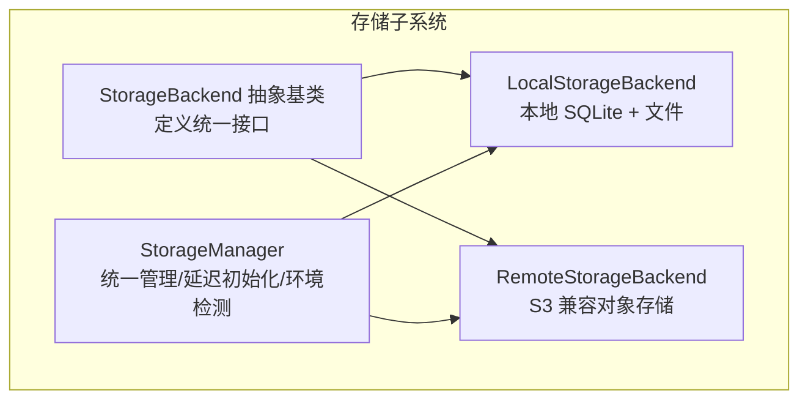
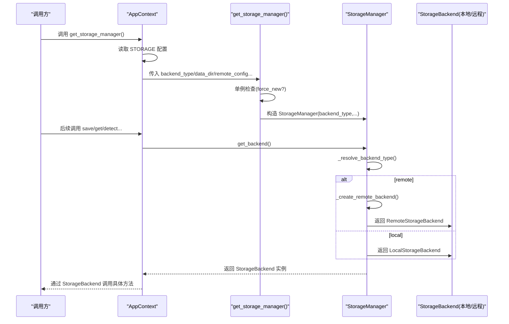
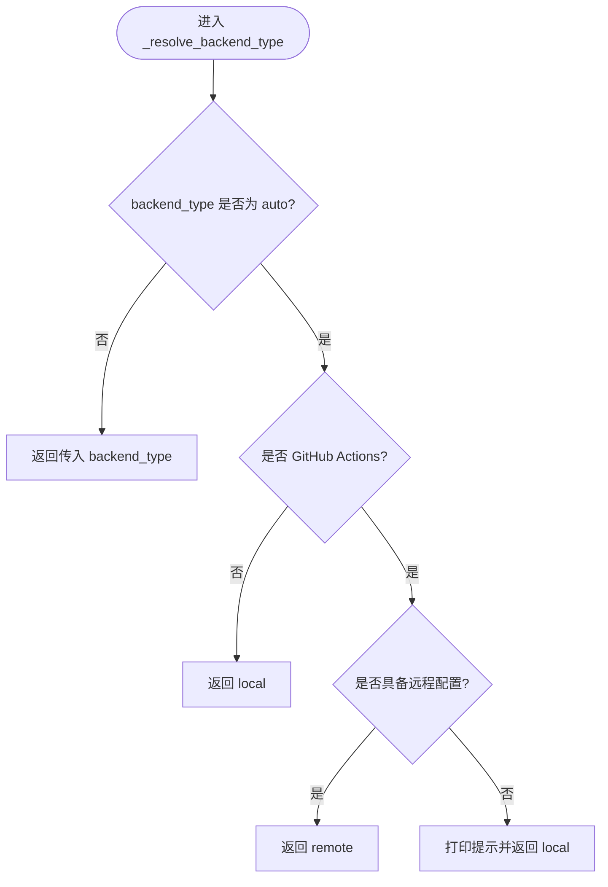
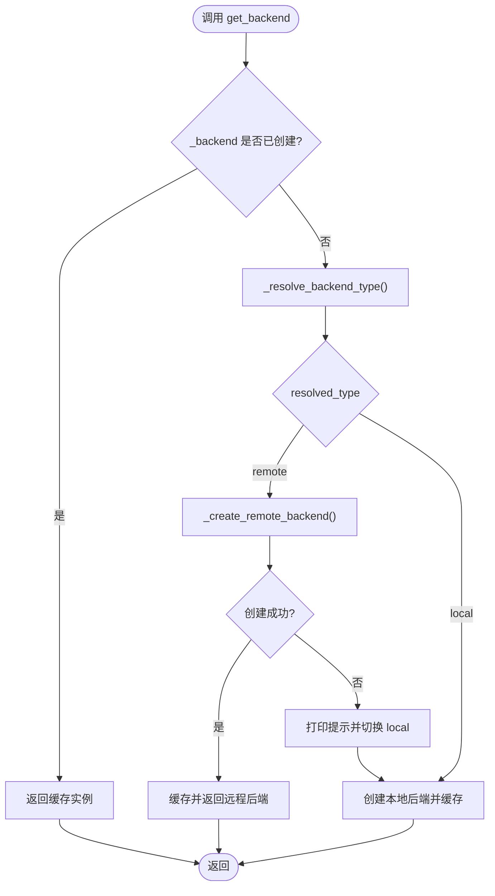
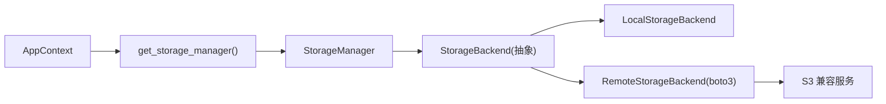

# 存储初始化

<cite>
**本文引用的文件**
- [trendradar/storage/manager.py](file://trendradar/storage/manager.py)
- [trendradar/context.py](file://trendradar/context.py)
- [trendradar/storage/base.py](file://trendradar/storage/base.py)
- [trendradar/storage/local.py](file://trendradar/storage/local.py)
- [trendradar/storage/remote.py](file://trendradar/storage/remote.py)
- [trendradar/storage/schema.sql](file://trendradar/storage/schema.sql)
- [config/config.yaml](file://config/config.yaml)
</cite>

## 目录
1. [简介](#简介)
2. [项目结构](#项目结构)
3. [核心组件](#核心组件)
4. [架构总览](#架构总览)
5. [详细组件分析](#详细组件分析)
6. [依赖关系分析](#依赖关系分析)
7. [性能考量](#性能考量)
8. [故障排查指南](#故障排查指南)
9. [结论](#结论)

## 简介
本文围绕 TrendRadar 的存储初始化机制，系统梳理从应用上下文调用到存储后端实例创建的完整链路，重点解释：
- 如何通过 backend_type 配置实现自动后端选择（auto/local/remote）
- 运行时环境检测（GitHub Actions 与 Docker）如何参与决策
- _resolve_backend_type() 如何根据部署环境与远程配置可用性动态决定存储策略
- get_backend() 中的延迟初始化与单例模式实现
- _create_remote_backend() 如何安全导入与初始化 S3 兼容存储
- 从 AppContext.get_storage_manager() 到实际后端实例创建的调用序列

## 项目结构
存储相关代码位于 trendradar/storage 目录，采用“抽象基类 + 本地/远程具体实现”的分层设计，并由 StorageManager 统一协调与延迟初始化。

图表来源
- [trendradar/storage/base.py](file://trendradar/storage/base.py#L187-L355)
- [trendradar/storage/local.py](file://trendradar/storage/local.py#L25-L120)
- [trendradar/storage/remote.py](file://trendradar/storage/remote.py#L40-L120)
- [trendradar/storage/manager.py](file://trendradar/storage/manager.py#L18-L173)

章节来源
- [trendradar/storage/base.py](file://trendradar/storage/base.py#L187-L355)
- [trendradar/storage/local.py](file://trendradar/storage/local.py#L25-L120)
- [trendradar/storage/remote.py](file://trendradar/storage/remote.py#L40-L120)
- [trendradar/storage/manager.py](file://trendradar/storage/manager.py#L18-L173)

## 核心组件
- StorageManager：负责根据配置与环境选择后端类型，延迟初始化后端实例，提供统一的存储接口转发。
- AppContext：应用上下文，封装配置并延迟初始化 StorageManager 单例，向业务层暴露统一接口。
- StorageBackend 抽象基类：定义保存/读取/清理等统一接口，确保本地与远程实现一致性。
- LocalStorageBackend：基于 SQLite 的本地存储，支持可选 TXT 快照与 HTML 报告。
- RemoteStorageBackend：基于 S3 兼容协议的对象存储，支持下载/合并/上传流程与临时目录清理。

章节来源
- [trendradar/storage/manager.py](file://trendradar/storage/manager.py#L18-L173)
- [trendradar/context.py](file://trendradar/context.py#L126-L155)
- [trendradar/storage/base.py](file://trendradar/storage/base.py#L187-L355)
- [trendradar/storage/local.py](file://trendradar/storage/local.py#L25-L120)
- [trendradar/storage/remote.py](file://trendradar/storage/remote.py#L40-L120)

## 架构总览
从 AppContext.get_storage_manager() 到最终后端实例创建的调用链如下：

图表来源
- [trendradar/context.py](file://trendradar/context.py#L126-L155)
- [trendradar/storage/manager.py](file://trendradar/storage/manager.py#L295-L344)
- [trendradar/storage/manager.py](file://trendradar/storage/manager.py#L149-L173)
- [trendradar/storage/manager.py](file://trendradar/storage/manager.py#L93-L105)
- [trendradar/storage/manager.py](file://trendradar/storage/manager.py#L126-L148)
- [trendradar/storage/local.py](file://trendradar/storage/local.py#L25-L120)
- [trendradar/storage/remote.py](file://trendradar/storage/remote.py#L40-L120)

## 详细组件分析

### StorageManager.__init__ 与 get_storage_manager()
- StorageManager.__init__ 接收 backend_type、data_dir、enable_txt、enable_html、remote_config、保留天数、拉取开关与天数、时区等参数，内部维护 _backend 与 _remote_backend 缓存。
- get_storage_manager() 是 StorageManager 的全局单例工厂，支持 force_new 强制重建；内部通过 _storage_manager 全局变量实现单例。

关键点
- 单例模式：通过全局变量 _storage_manager 与条件判断实现延迟初始化与复用。
- 参数透传：AppContext 将 config.yaml 中的 STORAGE 配置映射为 StorageManager 的构造参数。

章节来源
- [trendradar/storage/manager.py](file://trendradar/storage/manager.py#L29-L106)
- [trendradar/storage/manager.py](file://trendradar/storage/manager.py#L295-L344)
- [trendradar/context.py](file://trendradar/context.py#L126-L155)

### 运行时环境检测与自动后端选择
- is_github_actions()：通过环境变量 GITHUB_ACTIONS 判断。
- is_docker()：通过 /.dockerenv 文件、cgroup 中包含 docker 字段、或 DOCKER_CONTAINER 环境变量判断。
- _resolve_backend_type()：当 backend_type 为 auto 时：
  - 若在 GitHub Actions 且具备远程配置，则选择 remote；
  - 否则回退到 local；
  - 若 backend_type 非 auto，则直接使用传入值。

图表来源
- [trendradar/storage/manager.py](file://trendradar/storage/manager.py#L72-L105)
- [trendradar/storage/manager.py](file://trendradar/storage/manager.py#L107-L125)

章节来源
- [trendradar/storage/manager.py](file://trendradar/storage/manager.py#L72-L105)
- [trendradar/storage/manager.py](file://trendradar/storage/manager.py#L107-L125)

### 远程配置可用性检测
_has_remote_config() 通过 remote_config 或环境变量（S3_BUCKET_NAME、S3_ACCESS_KEY_ID、S3_SECRET_ACCESS_KEY、S3_ENDPOINT_URL、S3_REGION）判断远程配置是否完整。若不完整，将打印详细字段检查日志。

章节来源
- [trendradar/storage/manager.py](file://trendradar/storage/manager.py#L107-L125)

### get_backend() 的延迟初始化与单例
- 首次调用 get_backend() 时：
  - 先解析后端类型（_resolve_backend_type）
  - 若为 remote 且可用，则尝试 _create_remote_backend() 创建远程后端；失败则回退 local
  - 若为 local 或远程创建失败，则创建本地后端
- 后续调用直接返回缓存的 _backend 实例，实现单例与延迟初始化。

图表来源
- [trendradar/storage/manager.py](file://trendradar/storage/manager.py#L149-L173)
- [trendradar/storage/manager.py](file://trendradar/storage/manager.py#L93-L105)
- [trendradar/storage/manager.py](file://trendradar/storage/manager.py#L126-L148)

章节来源
- [trendradar/storage/manager.py](file://trendradar/storage/manager.py#L149-L173)
- [trendradar/storage/manager.py](file://trendradar/storage/manager.py#L93-L105)
- [trendradar/storage/manager.py](file://trendradar/storage/manager.py#L126-L148)

### _create_remote_backend() 的安全导入与初始化
- 在 try 块中导入 boto3 并初始化 S3 客户端，根据 endpoint_url 判定是否为腾讯云 COS，选择签名版本（SigV2/SigV4）。
- 使用虚拟主机风格地址（virtual-hosted style），并根据 region 设置客户端参数。
- 若缺少 boto3，抛出 ImportError 并提示安装依赖。
- 初始化完成后记录签名版本与存储桶信息，便于后续日志与排障。

章节来源
- [trendradar/storage/manager.py](file://trendradar/storage/manager.py#L126-L148)
- [trendradar/storage/remote.py](file://trendradar/storage/remote.py#L40-L120)

### 从 AppContext.get_storage_manager() 到后端实例
- AppContext.get_storage_manager() 从 config.yaml 读取 STORAGE 配置，组装为 StorageManager 的参数，再调用 get_storage_manager() 获取单例。
- 之后业务层通过 AppContext.get_storage_manager() 返回的 StorageBackend 实例调用 save_news_data、get_today_all_data、detect_new_titles、save_txt_snapshot、save_html_report、is_first_crawl_today 等方法。

章节来源
- [trendradar/context.py](file://trendradar/context.py#L126-L155)
- [trendradar/storage/manager.py](file://trendradar/storage/manager.py#L295-L344)
- [trendradar/storage/manager.py](file://trendradar/storage/manager.py#L175-L227)

### 数据模型与表结构
- NewsItem/NewsData：统一的数据模型，支持合并、统计与转换。
- schema.sql：定义 platforms、news_items、title_changes、rank_history、crawl_records、crawl_source_status、push_records 等表及索引，支撑去重、排名历史、抓取记录与推送记录等能力。

章节来源
- [trendradar/storage/base.py](file://trendradar/storage/base.py#L13-L186)
- [trendradar/storage/base.py](file://trendradar/storage/base.py#L357-L456)
- [trendradar/storage/schema.sql](file://trendradar/storage/schema.sql#L1-L118)

## 依赖关系分析
- StorageManager 依赖 StorageBackend 抽象接口，分别在本地与远程实现之间解耦。
- AppContext 依赖 StorageManager 单例，向上提供统一的业务接口。
- RemoteStorageBackend 依赖 boto3（通过 _create_remote_backend() 导入），并在运行时根据 endpoint_url 选择签名版本。
- 本地与远程均使用 SQLite 作为数据存储介质，通过 schema.sql 初始化表结构。

图表来源
- [trendradar/context.py](file://trendradar/context.py#L126-L155)
- [trendradar/storage/manager.py](file://trendradar/storage/manager.py#L295-L344)
- [trendradar/storage/base.py](file://trendradar/storage/base.py#L187-L355)
- [trendradar/storage/local.py](file://trendradar/storage/local.py#L25-L120)
- [trendradar/storage/remote.py](file://trendradar/storage/remote.py#L40-L120)

章节来源
- [trendradar/context.py](file://trendradar/context.py#L126-L155)
- [trendradar/storage/manager.py](file://trendradar/storage/manager.py#L295-L344)
- [trendradar/storage/base.py](file://trendradar/storage/base.py#L187-L355)
- [trendradar/storage/local.py](file://trendradar/storage/local.py#L25-L120)
- [trendradar/storage/remote.py](file://trendradar/storage/remote.py#L40-L120)

## 性能考量
- 延迟初始化与单例：避免不必要的后端初始化开销，减少内存占用。
- 本地连接缓存：LocalStorageBackend 与 RemoteStorageBackend 内部均维护 SQLite 连接缓存，降低频繁打开/关闭数据库的成本。
- 临时目录与清理：RemoteStorageBackend 在上传后自动清理下载的临时文件，避免磁盘膨胀。
- 去重与索引：schema.sql 中的 URL+platform_id 唯一索引与时间/标题索引有助于提升查询与去重效率。
- 远程上传策略：RemoteStorageBackend 使用一次性读取文件内容并显式设置 ContentLength 的方式上传，避免 chunked transfer encoding 带来的兼容性问题与额外开销。

章节来源
- [trendradar/storage/local.py](file://trendradar/storage/local.py#L84-L95)
- [trendradar/storage/remote.py](file://trendradar/storage/remote.py#L275-L294)
- [trendradar/storage/remote.py](file://trendradar/storage/remote.py#L225-L274)
- [trendradar/storage/schema.sql](file://trendradar/storage/schema.sql#L96-L118)

## 故障排查指南
- 远程后端导入失败
  - 现象：提示需要安装 boto3。
  - 处理：安装 boto3 并确认网络可达 S3 兼容服务端点。
  - 参考路径：[trendradar/storage/manager.py](file://trendradar/storage/manager.py#L126-L148)、[trendradar/storage/remote.py](file://trendradar/storage/remote.py#L40-L120)
- 远程配置缺失
  - 现象：_has_remote_config() 返回 False，打印字段检查日志。
  - 处理：补齐 S3_BUCKET_NAME、S3_ACCESS_KEY_ID、S3_SECRET_ACCESS_KEY、S3_ENDPOINT_URL、S3_REGION。
  - 参考路径：[trendradar/storage/manager.py](file://trendradar/storage/manager.py#L107-L125)
- 环境检测误判
  - 现象：GitHub Actions/Docker 环境识别不准确。
  - 处理：检查 GITHUB_ACTIONS、/.dockerenv、cgroup、DOCKER_CONTAINER 等环境变量与文件。
  - 参考路径：[trendradar/storage/manager.py](file://trendradar/storage/manager.py#L72-L105)
- 上传失败或验证失败
  - 现象：上传后验证失败或返回 Not Found。
  - 处理：检查 endpoint_url、region、签名版本（COS 使用 SigV2）、权限与桶名。
  - 参考路径：[trendradar/storage/remote.py](file://trendradar/storage/remote.py#L143-L177)、[trendradar/storage/remote.py](file://trendradar/storage/remote.py#L225-L274)
- 本地数据清理
  - 现象：本地目录过多或过大。
  - 处理：设置 local_retention_days 并调用 cleanup_old_data()。
  - 参考路径：[trendradar/storage/manager.py](file://trendradar/storage/manager.py#L235-L255)、[trendradar/storage/local.py](file://trendradar/storage/local.py#L746-L800)

章节来源
- [trendradar/storage/manager.py](file://trendradar/storage/manager.py#L107-L148)
- [trendradar/storage/remote.py](file://trendradar/storage/remote.py#L143-L177)
- [trendradar/storage/remote.py](file://trendradar/storage/remote.py#L225-L274)
- [trendradar/storage/local.py](file://trendradar/storage/local.py#L746-L800)

## 结论
TrendRadar 的存储初始化机制通过 StorageManager 的自动后端选择与延迟初始化，结合 AppContext 的统一入口，实现了在本地与远程存储之间的无缝切换。其核心优势包括：
- 环境感知：在 GitHub Actions 与 Docker 环境下自动选择合适后端，并在远程配置不可用时回退本地。
- 安全导入：远程后端通过 try 导入 boto3 并在失败时给出明确提示。
- 单例与延迟：避免重复初始化，降低资源消耗。
- 可扩展性：抽象基类统一接口，便于未来接入更多存储后端。