# 存储集成

<cite>
**本文引用的文件**
- [trendradar/context.py](file://trendradar/context.py)
- [trendradar/storage/manager.py](file://trendradar/storage/manager.py)
- [trendradar/storage/base.py](file://trendradar/storage/base.py)
- [trendradar/storage/local.py](file://trendradar/storage/local.py)
- [trendradar/storage/remote.py](file://trendradar/storage/remote.py)
- [trendradar/storage/schema.sql](file://trendradar/storage/schema.sql)
- [trendradar/core/data.py](file://trendradar/core/data.py)
- [config/config.yaml](file://config/config.yaml)
</cite>

## 目录
1. [简介](#简介)
2. [项目结构](#项目结构)
3. [核心组件](#核心组件)
4. [架构总览](#架构总览)
5. [详细组件分析](#详细组件分析)
6. [依赖关系分析](#依赖关系分析)
7. [性能考量](#性能考量)
8. [故障排查指南](#故障排查指南)
9. [结论](#结论)

## 简介
本文件围绕 TrendRadar 的存储集成进行深入文档化，重点聚焦于 AppContext.get_storage_manager() 方法的实现机制与数据流。文档将解释：
- 如何通过 storage_config、remote_config 等参数构建 StorageManager 实例，并实现延迟初始化与单例模式；
- get_output_path 如何结合当前日期与时区生成输出路径并确保目录存在；
- save_titles、read_today_titles、detect_new_titles、is_first_crawl 等方法如何通过 StorageManager 进行数据持久化与读取；
- 从 AppContext 调用到本地 SQLite 或远程 S3 兼容存储的完整数据流；
- cleanup() 中数据清理的触发条件与执行逻辑。

## 项目结构
存储相关代码主要分布在以下模块：
- 应用上下文：AppContext（负责配置访问、时间格式化、存储入口与清理）
- 存储管理器：StorageManager（统一后端选择、代理具体存储能力）
- 抽象基类：StorageBackend（定义统一接口）
- 本地后端：LocalStorageBackend（SQLite + 可选 TXT/HTML）
- 远程后端：RemoteStorageBackend（S3 兼容协议，下载/合并/上传）
- 数据层工具：core/data.py（标题保存、读取、新增检测）
- 数据库结构：schema.sql（SQLite 表结构与索引）

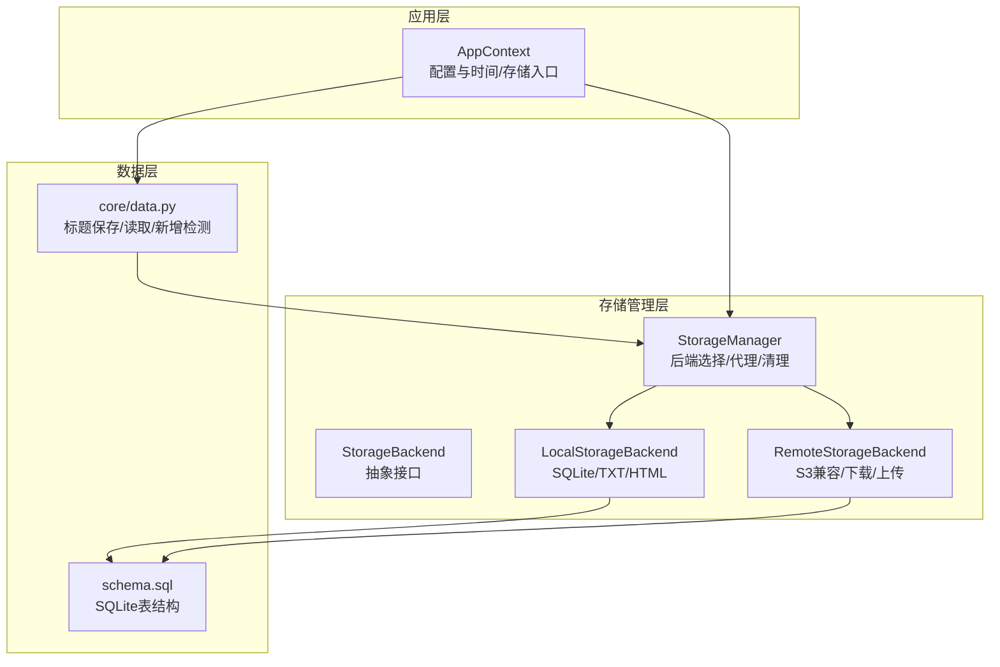

图表来源
- [trendradar/context.py](file://trendradar/context.py#L126-L184)
- [trendradar/storage/manager.py](file://trendradar/storage/manager.py#L149-L234)
- [trendradar/storage/base.py](file://trendradar/storage/base.py#L187-L355)
- [trendradar/storage/local.py](file://trendradar/storage/local.py#L1-L120)
- [trendradar/storage/remote.py](file://trendradar/storage/remote.py#L1-L120)
- [trendradar/core/data.py](file://trendradar/core/data.py#L1-L84)
- [trendradar/storage/schema.sql](file://trendradar/storage/schema.sql#L1-L118)

章节来源
- [trendradar/context.py](file://trendradar/context.py#L126-L184)
- [trendradar/storage/manager.py](file://trendradar/storage/manager.py#L149-L234)
- [trendradar/storage/base.py](file://trendradar/storage/base.py#L187-L355)
- [trendradar/storage/local.py](file://trendradar/storage/local.py#L1-L120)
- [trendradar/storage/remote.py](file://trendradar/storage/remote.py#L1-L120)
- [trendradar/core/data.py](file://trendradar/core/data.py#L1-L84)
- [trendradar/storage/schema.sql](file://trendradar/storage/schema.sql#L1-L118)

## 核心组件
- AppContext：提供 get_storage_manager()、get_output_path()、save_titles()、read_today_titles()、detect_new_titles()、is_first_crawl() 等方法；内部维护 _storage_manager 单例。
- StorageManager：根据 backend_type、环境变量与配置自动选择本地或远程后端；提供统一的 save_news_data、get_today_all_data、get_latest_crawl_data、detect_new_titles、save_txt_snapshot、save_html_report、is_first_crawl_today、cleanup_old_data 等代理方法。
- StorageBackend（抽象）：定义 save_news_data、get_today_all_data、get_latest_crawl_data、detect_new_titles、save_txt_snapshot、save_html_report、is_first_crawl_today、cleanup、cleanup_old_data、backend_name、supports_txt、has_pushed_today、record_push 等接口。
- LocalStorageBackend：基于 SQLite 的本地存储，支持 TXT 快照与 HTML 报告；提供数据去重、排名历史、抓取批次记录、推送记录等能力。
- RemoteStorageBackend：基于 S3 兼容协议的远程存储，支持下载/合并/上传；提供拉取历史数据到本地的能力；清理过期远程对象。
- core/data.py：提供 save_titles_to_file、read_all_today_titles、detect_latest_new_titles 等高层封装，底层委托 StorageManager。
- schema.sql：定义 SQLite 表结构（news_items、rank_history、title_changes、crawl_records、crawl_source_status、push_records）及索引。

章节来源
- [trendradar/context.py](file://trendradar/context.py#L126-L184)
- [trendradar/storage/manager.py](file://trendradar/storage/manager.py#L149-L234)
- [trendradar/storage/base.py](file://trendradar/storage/base.py#L187-L355)
- [trendradar/storage/local.py](file://trendradar/storage/local.py#L1-L120)
- [trendradar/storage/remote.py](file://trendradar/storage/remote.py#L1-L120)
- [trendradar/core/data.py](file://trendradar/core/data.py#L1-L84)
- [trendradar/storage/schema.sql](file://trendradar/storage/schema.sql#L1-L118)

## 架构总览
从 AppContext 到存储后端的调用链路如下：

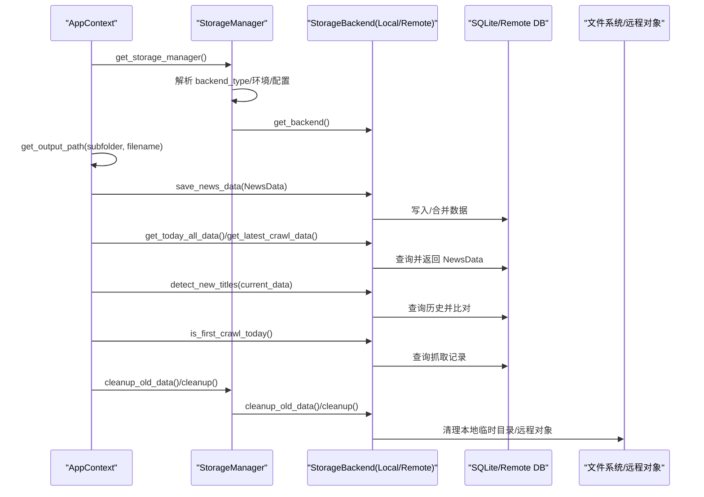

图表来源
- [trendradar/context.py](file://trendradar/context.py#L126-L184)
- [trendradar/storage/manager.py](file://trendradar/storage/manager.py#L149-L234)
- [trendradar/storage/local.py](file://trendradar/storage/local.py#L113-L215)
- [trendradar/storage/remote.py](file://trendradar/storage/remote.py#L312-L512)

## 详细组件分析

### AppContext.get_storage_manager()：延迟初始化与单例
- 延迟初始化：首次调用时根据配置构造 StorageManager，后续复用同一实例。
- 参数来源：
  - storage_config：来自 AppContext.config["STORAGE"]，包含 BACKEND、FORMATS、LOCAL、REMOTE、PULL 等子配置。
  - remote_config：从 STORAGE.REMOTE 提取 bucket_name/access_key_id/secret_access_key/endpoint_url/region。
  - 本地保留策略：LOCAL.RETENTION_DAYS；远程保留策略：REMOTE.RETENTION_DAYS。
  - 拉取策略：PULL.ENABLED/PULL.DAYS。
  - 时区：AppContext.timezone。
- 单例：内部维护 _storage_manager 字段，若未初始化或 force_new 为真则创建新实例。

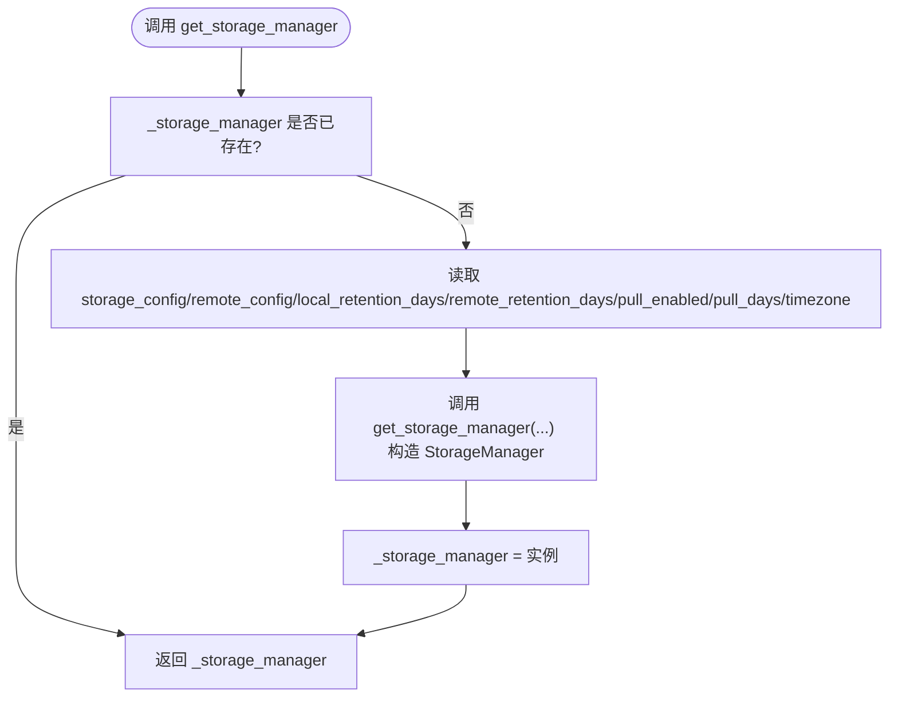

图表来源
- [trendradar/context.py](file://trendradar/context.py#L128-L154)
- [trendradar/storage/manager.py](file://trendradar/storage/manager.py#L295-L344)

章节来源
- [trendradar/context.py](file://trendradar/context.py#L128-L154)
- [trendradar/storage/manager.py](file://trendradar/storage/manager.py#L295-L344)

### AppContext.get_output_path：路径生成与目录保证
- 依据当前时区格式化日期文件夹（YYYY-MM-DD），拼接 subfolder 与 filename。
- 使用 Path.mkdir(parents=True, exist_ok=True) 确保输出目录存在。
- 返回绝对路径字符串，供 save_titles 使用。

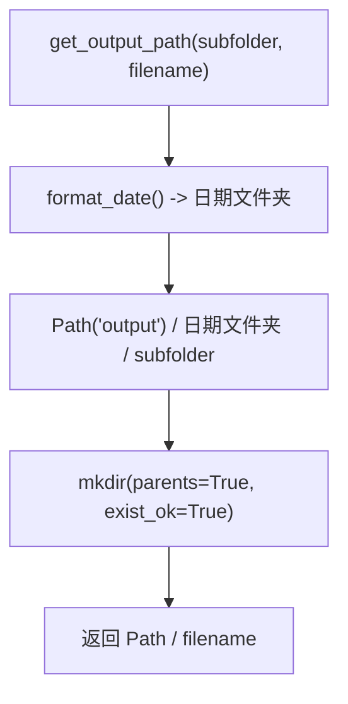

图表来源
- [trendradar/context.py](file://trendradar/context.py#L156-L160)

章节来源
- [trendradar/context.py](file://trendradar/context.py#L156-L160)

### AppContext.save_titles：标题写入与持久化
- 生成输出路径（get_output_path("txt", "{time}.txt"）。
- 调用 core.data.save_titles_to_file 将 results/id_to_name/failed_ids 写入 TXT 文件。
- 该方法不直接操作数据库，而是生成快照文件，便于调试与归档。

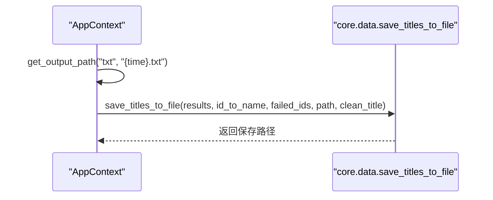

图表来源
- [trendradar/context.py](file://trendradar/context.py#L164-L168)
- [trendradar/core/data.py](file://trendradar/core/data.py#L17-L84)

章节来源
- [trendradar/context.py](file://trendradar/context.py#L164-L168)
- [trendradar/core/data.py](file://trendradar/core/data.py#L17-L84)

### AppContext.read_today_titles/detect_new_titles/is_first_crawl：基于 StorageManager 的数据读取与判定
- read_today_titles：委托 core.data.read_all_today_titles，后者通过 StorageManager.get_today_all_data() 获取合并后的 NewsData，并转换为 results/id_to_name/title_info。
- detect_new_titles：委托 core.data.detect_latest_new_titles，后者通过 StorageManager.get_latest_crawl_data() 与 get_today_all_data() 比对，得到最新批次新增标题。
- is_first_crawl：调用 StorageManager.is_first_crawl_today()，由具体后端判断当天抓取批次数量是否小于等于 1。

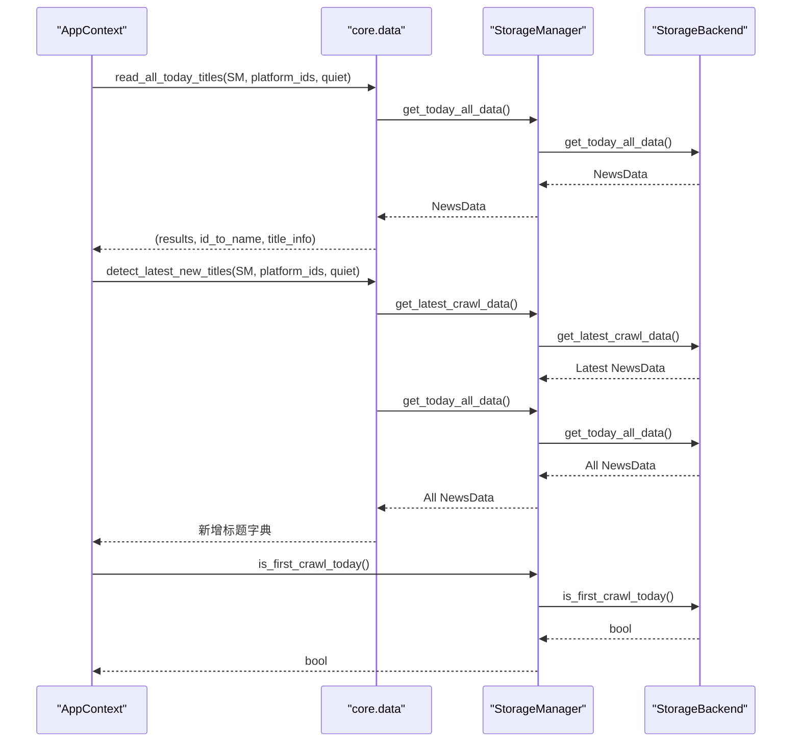

图表来源
- [trendradar/context.py](file://trendradar/context.py#L169-L183)
- [trendradar/core/data.py](file://trendradar/core/data.py#L152-L179)
- [trendradar/core/data.py](file://trendradar/core/data.py#L182-L286)
- [trendradar/storage/manager.py](file://trendradar/storage/manager.py#L200-L227)

章节来源
- [trendradar/context.py](file://trendradar/context.py#L169-L183)
- [trendradar/core/data.py](file://trendradar/core/data.py#L152-L179)
- [trendradar/core/data.py](file://trendradar/core/data.py#L182-L286)
- [trendradar/storage/manager.py](file://trendradar/storage/manager.py#L200-L227)

### StorageManager：后端选择与代理
- 后端类型解析：
  - backend_type="auto" 时：
    - 在 GitHub Actions 环境且配置了远程存储则使用 remote，否则使用 local；
    - 非 GitHub Actions 环境默认 local。
  - 若解析为 remote 但初始化失败，回退到 local。
- 远程配置检查：从 remote_config 或环境变量读取 bucket_name/access_key_id/secret_access_key/endpoint_url/region，打印配置检查日志。
- 代理方法：save_news_data、get_today_all_data、get_latest_crawl_data、detect_new_titles、save_txt_snapshot、save_html_report、is_first_crawl_today、cleanup、cleanup_old_data、has_pushed_today、record_push。
- 拉取历史：pull_from_remote() 从远程拉取最近 N 天的 SQLite 文件到本地 data_dir。

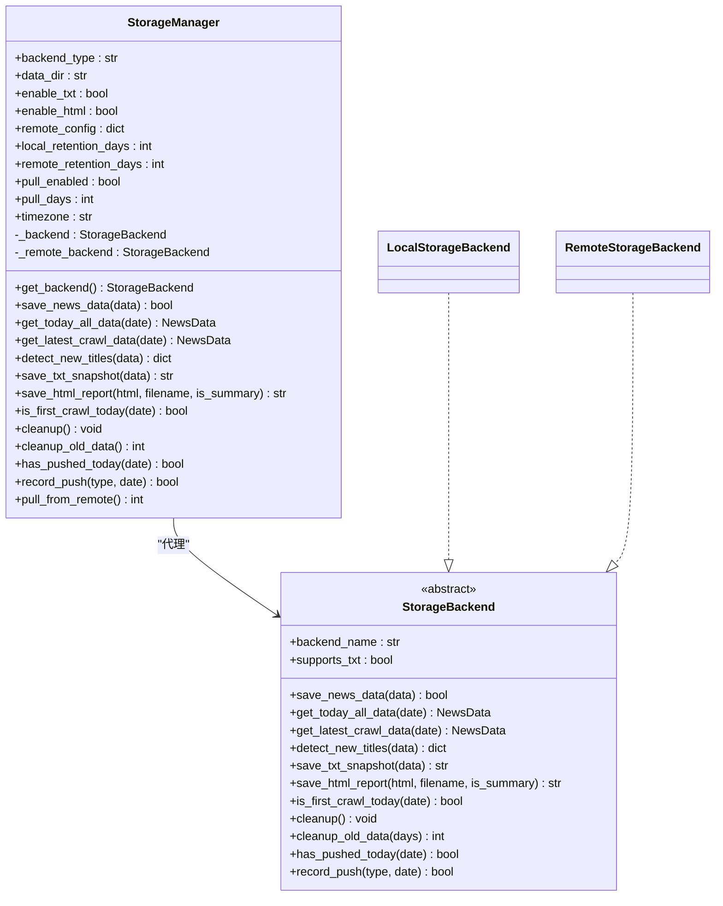

图表来源
- [trendradar/storage/manager.py](file://trendradar/storage/manager.py#L18-L110)
- [trendradar/storage/manager.py](file://trendradar/storage/manager.py#L149-L234)
- [trendradar/storage/base.py](file://trendradar/storage/base.py#L187-L355)
- [trendradar/storage/local.py](file://trendradar/storage/local.py#L1-L120)
- [trendradar/storage/remote.py](file://trendradar/storage/remote.py#L1-L120)

章节来源
- [trendradar/storage/manager.py](file://trendradar/storage/manager.py#L18-L110)
- [trendradar/storage/manager.py](file://trendradar/storage/manager.py#L149-L234)
- [trendradar/storage/base.py](file://trendradar/storage/base.py#L187-L355)

### LocalStorageBackend：SQLite 主存储与 TXT/HTML
- 数据库连接缓存：按日期数据库路径缓存 sqlite3.Connection，减少 IO。
- 表结构：由 schema.sql 初始化，包含 platforms、news_items、rank_history、title_changes、crawl_records、crawl_source_status、push_records。
- 去重与合并：以标准化 URL + platform_id 为唯一标识，记录标题变更历史与排名历史；合并时保留最早 first_time、累计 crawl_count。
- 快照与报告：可选保存 TXT 快照与 HTML 报告；支持按日期目录清理过期数据。
- 首次抓取判定：当 crawl_records 条目数 ≤ 1 视为当天首次抓取。

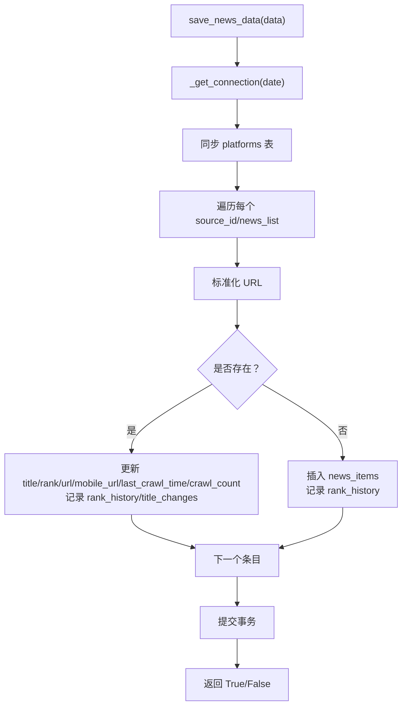

图表来源
- [trendradar/storage/local.py](file://trendradar/storage/local.py#L113-L215)
- [trendradar/storage/local.py](file://trendradar/storage/local.py#L293-L409)
- [trendradar/storage/local.py](file://trendradar/storage/local.py#L410-L521)
- [trendradar/storage/local.py](file://trendradar/storage/local.py#L526-L584)
- [trendradar/storage/local.py](file://trendradar/storage/local.py#L673-L704)
- [trendradar/storage/schema.sql](file://trendradar/storage/schema.sql#L1-L118)

章节来源
- [trendradar/storage/local.py](file://trendradar/storage/local.py#L113-L215)
- [trendradar/storage/local.py](file://trendradar/storage/local.py#L293-L409)
- [trendradar/storage/local.py](file://trendradar/storage/local.py#L410-L521)
- [trendradar/storage/local.py](file://trendradar/storage/local.py#L526-L584)
- [trendradar/storage/local.py](file://trendradar/storage/local.py#L673-L704)
- [trendradar/storage/schema.sql](file://trendradar/storage/schema.sql#L1-L118)

### RemoteStorageBackend：S3 兼容协议与下载/合并/上传
- 客户端初始化：根据 endpoint_url 判断是否为腾讯云 COS，选择签名版本；使用 virtual-hosted style addressing。
- 下载/上传：使用 get_object + iter_chunks 避免 chunked transfer encoding 问题；上传时显式设置 ContentLength。
- 临时目录：在系统临时目录创建本地副本，操作完成后清理。
- 数据合并：下载远程 SQLite → 合并新数据 → 上传回远程；支持批量删除过期对象。
- 拉取历史：pull_recent_days() 从远程拉取最近 N 天的数据库文件到本地 data_dir。
- 首次抓取判定：与本地一致，基于 crawl_records 条目数。

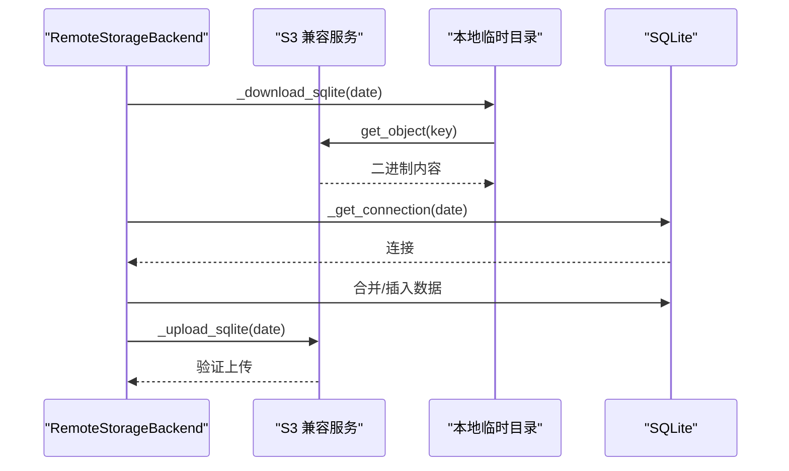

图表来源
- [trendradar/storage/remote.py](file://trendradar/storage/remote.py#L178-L249)
- [trendradar/storage/remote.py](file://trendradar/storage/remote.py#L275-L294)
- [trendradar/storage/remote.py](file://trendradar/storage/remote.py#L312-L512)
- [trendradar/storage/remote.py](file://trendradar/storage/remote.py#L1042-L1099)

章节来源
- [trendradar/storage/remote.py](file://trendradar/storage/remote.py#L178-L249)
- [trendradar/storage/remote.py](file://trendradar/storage/remote.py#L275-L294)
- [trendradar/storage/remote.py](file://trendradar/storage/remote.py#L312-L512)
- [trendradar/storage/remote.py](file://trendradar/storage/remote.py#L1042-L1099)

### 数据清理：cleanup() 与 cleanup_old_data()
- AppContext.cleanup()：
  - 调用 StorageManager.cleanup_old_data() 清理本地与远程过期数据；
  - 调用 StorageManager.cleanup() 清理后端资源；
  - 将 _storage_manager 置空，允许下次重新初始化。
- StorageManager.cleanup_old_data()：
  - 若 local_retention_days > 0：调用本地后端 cleanup_old_data；
  - 若 remote_retention_days > 0 且配置有效：创建远程后端并清理远程过期对象；
  - 返回删除的日期目录/对象数量。
- LocalStorageBackend.cleanup_old_data()：
  - 遍历 output/<date>/ 目录，解析 ISO 或中文日期格式；
  - 关闭对应日期数据库连接并删除过期目录。
- RemoteStorageBackend.cleanup_old_data()：
  - 使用 list_objects_v2 分页列出 news/<date>.db；
  - 解析日期并删除早于 cutoff_date 的对象，支持批量删除。

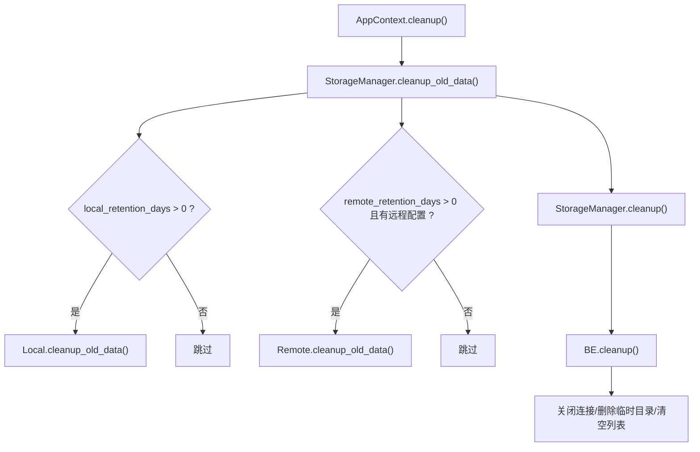

图表来源
- [trendradar/context.py](file://trendradar/context.py#L385-L391)
- [trendradar/storage/manager.py](file://trendradar/storage/manager.py#L235-L256)
- [trendradar/storage/local.py](file://trendradar/storage/local.py#L746-L800)
- [trendradar/storage/remote.py](file://trendradar/storage/remote.py#L870-L958)

章节来源
- [trendradar/context.py](file://trendradar/context.py#L385-L391)
- [trendradar/storage/manager.py](file://trendradar/storage/manager.py#L235-L256)
- [trendradar/storage/local.py](file://trendradar/storage/local.py#L746-L800)
- [trendradar/storage/remote.py](file://trendradar/storage/remote.py#L870-L958)

## 依赖关系分析
- AppContext 依赖：
  - trendradar.storage.get_storage_manager（模块级工厂函数）
  - core.data.save_titles_to_file、read_all_today_titles、detect_latest_new_titles、is_first_crawl_today
  - utils.time（时间格式化与当前时间）
- StorageManager 依赖：
  - StorageBackend 抽象接口
  - LocalStorageBackend/RemoteStorageBackend 实现
  - 环境变量与配置（GitHub Actions/Docker/远程配置）
- Local/Remote 后端依赖：
  - schema.sql（表结构）
  - utils.time（时间格式化）
  - utils.url（URL 标准化）
  - sqlite3（本地）、boto3（远程）

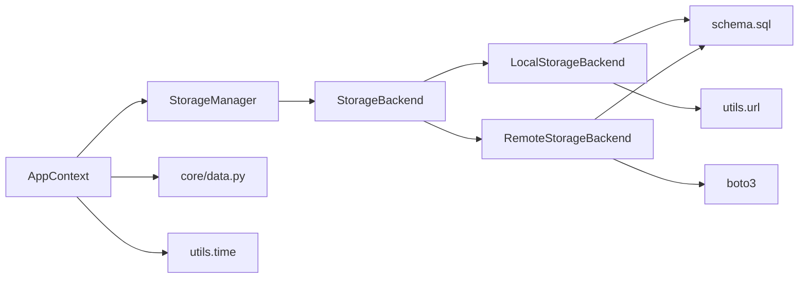

图表来源
- [trendradar/context.py](file://trendradar/context.py#L1-L120)
- [trendradar/storage/manager.py](file://trendradar/storage/manager.py#L1-L110)
- [trendradar/storage/local.py](file://trendradar/storage/local.py#L1-L120)
- [trendradar/storage/remote.py](file://trendradar/storage/remote.py#L1-L120)
- [trendradar/core/data.py](file://trendradar/core/data.py#L1-L84)
- [trendradar/storage/schema.sql](file://trendradar/storage/schema.sql#L1-L118)

章节来源
- [trendradar/context.py](file://trendradar/context.py#L1-L120)
- [trendradar/storage/manager.py](file://trendradar/storage/manager.py#L1-L110)
- [trendradar/storage/local.py](file://trendradar/storage/local.py#L1-L120)
- [trendradar/storage/remote.py](file://trendradar/storage/remote.py#L1-L120)
- [trendradar/core/data.py](file://trendradar/core/data.py#L1-L84)
- [trendradar/storage/schema.sql](file://trendradar/storage/schema.sql#L1-L118)

## 性能考量
- 连接池与缓存：
  - LocalStorageBackend 缓存 sqlite3.Connection，按日期数据库路径区分，减少频繁打开/关闭数据库的开销。
  - RemoteStorageBackend 在本地临时目录操作，避免多次网络往返；上传前读取文件为字节，避免 chunked transfer encoding 导致的兼容性问题。
- 查询优化：
  - schema.sql 定义了多处索引（platform_id、last_crawl_time、title、url+platform 唯一索引），有助于快速检索与去重。
- 批量操作：
  - RemoteStorageBackend 在清理过期对象时使用分页与批量删除，降低 API 调用次数。
- I/O 与磁盘：
  - 本地清理时先关闭对应日期数据库连接再删除目录，避免文件占用导致删除失败。

[本节为通用指导，无需特定文件引用]

## 故障排查指南
- 远程后端初始化失败：
  - 现象：打印“远程后端导入失败”或“远程后端初始化失败”，随后回退到本地存储。
  - 排查：确认已安装 boto3；检查 remote_config 或环境变量是否完整（bucket_name/access_key_id/secret_access_key/endpoint_url/region）。
- 上传/下载异常：
  - 现象：上传/下载失败或验证失败。
  - 排查：检查 endpoint_url 是否正确；腾讯云 COS 需要特殊签名版本；确认网络连通性与权限。
- 首次抓取误判：
  - 现象：is_first_crawl_today 返回 False。
  - 排查：确认 crawl_records 是否存在；若历史数据被清理，可能影响判定。
- 本地清理无效：
  - 现象：retention_days 设置后仍保留旧目录。
  - 排查：确认日期目录格式（ISO 或中文）；检查时区与 cutoff_date 计算。
- 远程清理失败：
  - 现象：批量删除异常或未删除。
  - 排查：确认 list_objects_v2 权限；检查对象键命名与日期格式匹配。

章节来源
- [trendradar/storage/manager.py](file://trendradar/storage/manager.py#L107-L148)
- [trendradar/storage/remote.py](file://trendradar/storage/remote.py#L178-L249)
- [trendradar/storage/remote.py](file://trendradar/storage/remote.py#L870-L958)
- [trendradar/storage/local.py](file://trendradar/storage/local.py#L746-L800)

## 结论
- AppContext.get_storage_manager() 通过延迟初始化与单例模式，将存储后端的选择与生命周期管理集中在 StorageManager 中，简化了上层调用。
- 本地与远程后端均遵循统一的 StorageBackend 接口，实现了数据持久化、读取、新增检测与清理的一致性。
- 通过 schema.sql 的表结构设计与索引，配合 URL 标准化与排名历史记录，实现了稳定的去重与历史追踪能力。
- cleanup() 与 cleanup_old_data() 提供了灵活的本地与远程数据清理策略，保障长期运行的稳定性与成本控制。