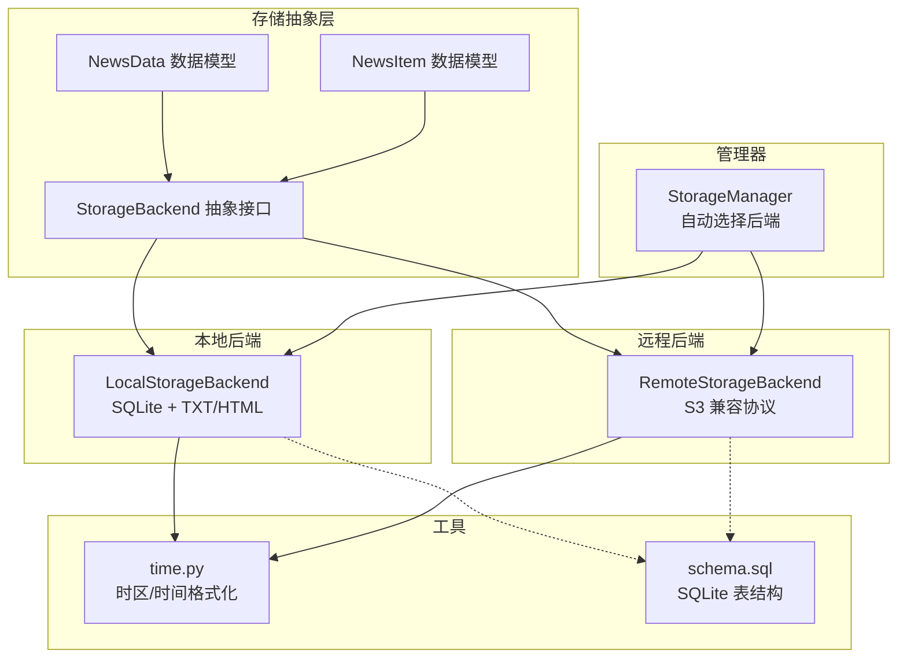
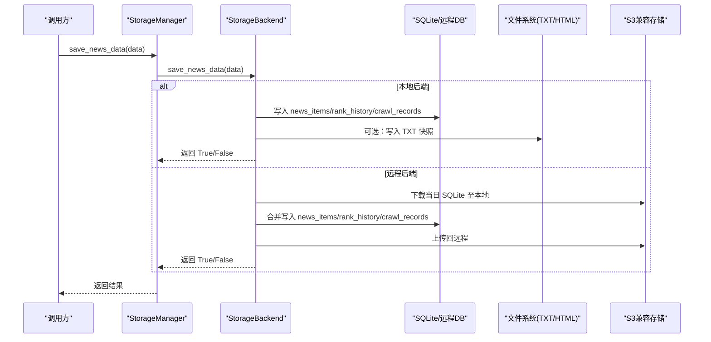
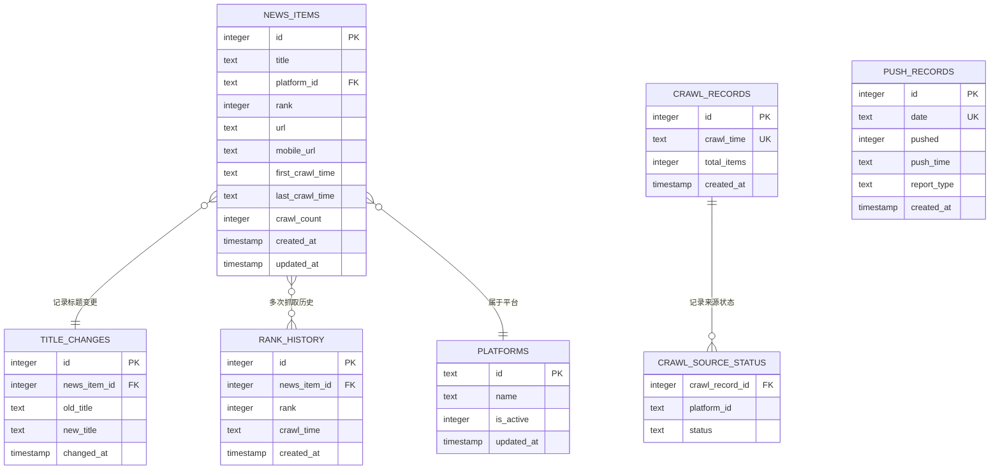
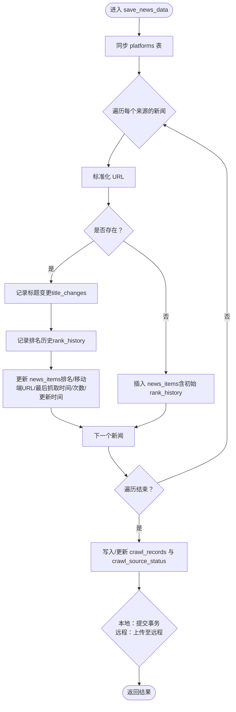
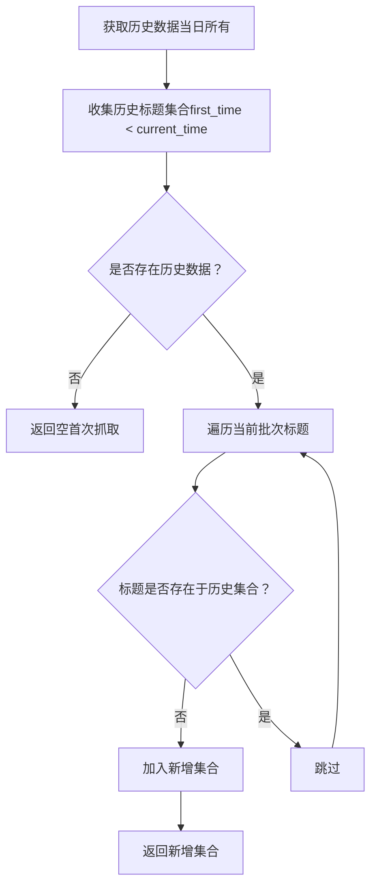
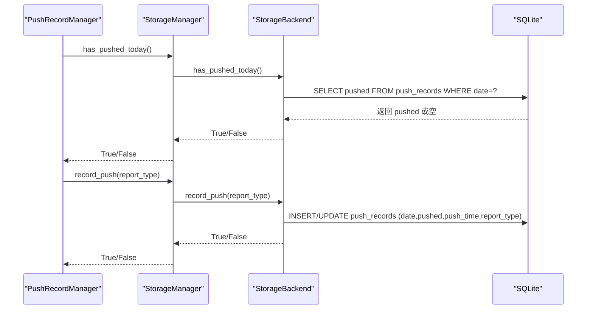
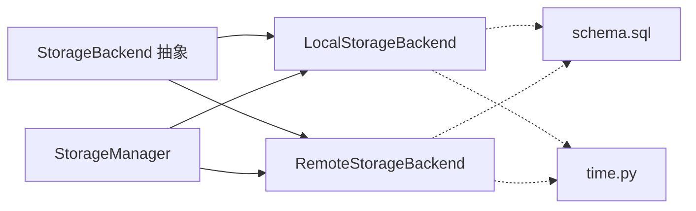

# 数据持久化

<cite>
**本文引用的文件**
- [schema.sql](file://trendradar/storage/schema.sql)
- [base.py](file://trendradar/storage/base.py)
- [local.py](file://trendradar/storage/local.py)
- [remote.py](file://trendradar/storage/remote.py)
- [manager.py](file://trendradar/storage/manager.py)
- [__init__.py](file://trendradar/storage/__init__.py)
- [push_manager.py](file://trendradar/notification/push_manager.py)
- [time.py](file://trendradar/utils/time.py)
</cite>

## 目录
1. [简介](#简介)
2. [项目结构](#项目结构)
3. [核心组件](#核心组件)
4. [架构总览](#架构总览)
5. [详细组件分析](#详细组件分析)
6. [依赖关系分析](#依赖关系分析)
7. [性能考量](#性能考量)
8. [故障排查指南](#故障排查指南)
9. [结论](#结论)

## 简介
本文件围绕 TrendRadar 的数据持久化能力，系统梳理“保存新闻数据”“保存TXT快照”“保存HTML报告”的写入流程；深入解析 NewsData 数据结构与其在本地 SQLite 中的映射关系；结合 schema.sql 解释 news_items、rank_history、crawl_records 等表的实体关系与约束；说明 detect_new_titles 如何通过比较最新抓取数据与历史数据识别新增热点；阐述 get_today_all_data 与 get_latest_crawl_data 的查询逻辑；覆盖本地文件系统（TXT快照）与远程对象存储（S3兼容）的双模持久化策略；并说明 has_pushed_today 与 record_push 在推送去重中的应用。

## 项目结构
存储子系统采用“抽象接口 + 多后端实现 + 管理器统一调度”的分层设计：
- 抽象层：定义统一的存储接口与数据模型（NewsItem、NewsData）
- 本地后端：基于 SQLite 的本地存储，支持 TXT/HTML 快照
- 远程后端：基于 S3 兼容协议的对象存储，支持下载/合并/上传
- 管理器：根据环境自动选择后端，提供统一调用入口
- 工具层：时间工具、URL 规范化等辅助能力

图表来源
- [base.py](file://trendradar/storage/base.py#L187-L356)
- [local.py](file://trendradar/storage/local.py#L1-L120)
- [remote.py](file://trendradar/storage/remote.py#L1-L120)
- [manager.py](file://trendradar/storage/manager.py#L1-L120)
- [time.py](file://trendradar/utils/time.py#L1-L92)
- [schema.sql](file://trendradar/storage/schema.sql#L1-L118)

章节来源
- [base.py](file://trendradar/storage/base.py#L187-L356)
- [local.py](file://trendradar/storage/local.py#L1-L120)
- [remote.py](file://trendradar/storage/remote.py#L1-L120)
- [manager.py](file://trendradar/storage/manager.py#L1-L120)
- [time.py](file://trendradar/utils/time.py#L1-L92)
- [schema.sql](file://trendradar/storage/schema.sql#L1-L118)

## 核心组件
- 抽象接口与数据模型
  - StorageBackend：定义 save_news_data、get_today_all_data、get_latest_crawl_data、detect_new_titles、save_txt_snapshot、save_html_report、is_first_crawl_today、cleanup、cleanup_old_data、has_pushed_today、record_push 等方法
  - NewsItem：封装单条新闻的字段（标题、来源ID、排名、URL、移动端URL、抓取时间、历史排名、首次/最后出现时间、出现次数等）
  - NewsData：封装按来源ID分组的新闻集合、日期、抓取时间、来源ID到名称映射、失败来源ID列表，并提供合并与统计能力
- 本地后端 LocalStorageBackend
  - 基于 SQLite 的主存储，按日期组织数据库文件；支持 TXT 快照与 HTML 报告
  - 提供 save_news_data、get_today_all_data、get_latest_crawl_data、detect_new_titles、save_txt_snapshot、save_html_report、is_first_crawl_today、has_pushed_today、record_push 等实现
- 远程后端 RemoteStorageBackend
  - 基于 S3 兼容协议，下载当日 SQLite 至本地临时目录，合并新数据后上传回远程
  - 提供 save_news_data、get_today_all_data、get_latest_crawl_data、detect_new_titles、save_txt_snapshot、save_html_report、has_pushed_today、record_push 等实现
- 存储管理器 StorageManager
  - 自动检测运行环境（本地/Docker/GitHub Actions），按配置选择后端
  - 统一暴露 save_news_data、get_today_all_data、get_latest_crawl_data、detect_new_titles、save_txt_snapshot、save_html_report、is_first_crawl_today、has_pushed_today、record_push 等方法
- 推送记录管理 PushRecordManager
  - 通过 storage_backend 统一管理推送记录，支持每日只推送一次与时间窗口控制

章节来源
- [base.py](file://trendradar/storage/base.py#L13-L113)
- [base.py](file://trendradar/storage/base.py#L187-L356)
- [local.py](file://trendradar/storage/local.py#L1-L120)
- [remote.py](file://trendradar/storage/remote.py#L1-L120)
- [manager.py](file://trendradar/storage/manager.py#L1-L120)
- [push_manager.py](file://trendradar/notification/push_manager.py#L1-L110)

## 架构总览
双模持久化策略：
- 本地模式：直接写入本地 SQLite，同时可生成 TXT 快照与 HTML 报告
- 远程模式：通过 S3 兼容协议下载远程 SQLite 至本地，合并后上传回远程，适合 CI/CD 环境

图表来源
- [manager.py](file://trendradar/storage/manager.py#L200-L222)
- [local.py](file://trendradar/storage/local.py#L113-L288)
- [remote.py](file://trendradar/storage/remote.py#L312-L512)

## 详细组件分析

### NewsData 数据结构与映射关系
- 数据模型
  - NewsItem 字段：标题、来源ID、来源名称（运行时）、排名、URL、移动端URL、抓取时间、历史排名列表、首次出现时间、最后出现时间、出现次数
  - NewsData 字段：日期（YYYY-MM-DD）、抓取时间（HH时MM分）、按来源ID分组的新闻列表、来源ID到名称映射、失败来源ID列表
  - 合并策略：相同来源+标题的新闻合并历史排名、更新首末时间与出现次数、保留URL优先级
- 映射到 SQLite
  - news_items：标题、来源平台ID、排名、URL、移动端URL、首次抓取时间、最后抓取时间、抓取次数、创建/更新时间
  - rank_history：记录每次抓取的排名变化，关联 news_items
  - crawl_records：记录每次抓取的时间与总量
  - crawl_source_status：记录每次抓取各平台的成功/失败状态
  - platforms：平台元数据（ID、名称、活跃状态、更新时间）
  - title_changes：记录同一 URL 下标题变更历史
  - push_records：记录每日推送状态（once_per_day）

图表来源
- [schema.sql](file://trendradar/storage/schema.sql#L1-L118)

章节来源
- [base.py](file://trendradar/storage/base.py#L13-L113)
- [base.py](file://trendradar/storage/base.py#L114-L185)
- [schema.sql](file://trendradar/storage/schema.sql#L1-L118)

### save_news_data() 写入流程（本地与远程一致）
- 平台同步：将 NewsData 中的来源ID与名称写入 platforms 表（冲突时更新名称与更新时间）
- 去重与更新：
  - 标准化 URL（去除动态参数），以“标准化URL + 平台ID”为唯一键
  - 若存在：记录标题变更（title_changes），写入 rank_history，更新 news_items 的排名、移动端URL、最后抓取时间、抓取次数与更新时间
  - 若不存在：插入新记录，同时写入初始 rank_history
- 抓取记录：
  - 写入/更新 crawl_records（按抓取时间唯一）
  - 写入/更新 crawl_source_status（记录成功/失败来源）
- 本地后端：直接提交事务
- 远程后端：合并完成后上传 SQLite 至远程

图表来源
- [local.py](file://trendradar/storage/local.py#L113-L288)
- [remote.py](file://trendradar/storage/remote.py#L312-L512)
- [schema.sql](file://trendradar/storage/schema.sql#L1-L118)

章节来源
- [local.py](file://trendradar/storage/local.py#L113-L288)
- [remote.py](file://trendradar/storage/remote.py#L312-L512)
- [schema.sql](file://trendradar/storage/schema.sql#L1-L118)

### save_txt_snapshot() 快照策略
- 本地后端：按日期/小时分钟生成 TXT 文件，按来源分组输出，包含 URL 与移动端 URL 信息，末尾列出失败来源
- 远程后端：默认不生成（enable_txt=False），若启用则保存在本地临时目录

章节来源
- [local.py](file://trendradar/storage/local.py#L585-L671)
- [remote.py](file://trendradar/storage/remote.py#L749-L794)

### save_html_report() 报告策略
- 本地后端：按日期生成 HTML 目录，保存报告文件
- 远程后端：默认启用（enable_html=True），保存在本地临时目录

章节来源
- [local.py](file://trendradar/storage/local.py#L641-L671)
- [remote.py](file://trendradar/storage/remote.py#L795-L840)

### detect_new_titles() 新增热点识别
- 逻辑要点：
  - 获取历史数据（当日所有数据）
  - 以“首次出现时间 < 当前抓取时间”的历史标题集合为基准
  - 若当前批次中某标题不在历史集合，则判定为新增
  - 首次抓取（无历史）不产生“新增”概念
- 适用场景：仅统计历史上从未出现过的标题，避免同一标题因 URL 变化产生的重复

图表来源
- [local.py](file://trendradar/storage/local.py#L526-L584)
- [remote.py](file://trendradar/storage/remote.py#L699-L748)

章节来源
- [local.py](file://trendradar/storage/local.py#L526-L584)
- [remote.py](file://trendradar/storage/remote.py#L699-L748)

### get_today_all_data() 查询逻辑
- 从 news_items 读取当日全部新闻，左联 platforms 获取平台名称
- 批量查询 rank_history，按 news_item_id 收集历史排名（去重）
- 组装 NewsData：按 platform_id 分组，填充 ranks、first_time、last_time、count 等字段
- 读取失败来源（crawl_source_status 中 status='failed' 的平台）
- 读取最新抓取时间（crawl_records 最大值）

章节来源
- [local.py](file://trendradar/storage/local.py#L293-L409)
- [remote.py](file://trendradar/storage/remote.py#L513-L617)

### get_latest_crawl_data() 查询逻辑
- 先查询 crawl_records 的最新抓取时间
- 再按“最后抓取时间 = 最新时间”的条件从 news_items 读取当日最新批次数据
- 读取失败来源（仅限该最新批次）

章节来源
- [local.py](file://trendradar/storage/local.py#L410-L525)
- [remote.py](file://trendradar/storage/remote.py#L618-L697)

### 推送去重：has_pushed_today() 与 record_push()
- 存储结构：push_records 表，按日期唯一（UK），记录 pushed、push_time、report_type
- has_pushed_today：按日期查询 pushed 字段，存在即返回 True
- record_push：按日期写入/更新 pushed=1、push_time、report_type，并在远程后端同步上传

图表来源
- [push_manager.py](file://trendradar/notification/push_manager.py#L46-L67)
- [manager.py](file://trendradar/storage/manager.py#L268-L293)
- [local.py](file://trendradar/storage/local.py#L826-L886)
- [remote.py](file://trendradar/storage/remote.py#L959-L1030)
- [schema.sql](file://trendradar/storage/schema.sql#L83-L94)

章节来源
- [push_manager.py](file://trendradar/notification/push_manager.py#L1-L110)
- [manager.py](file://trendradar/storage/manager.py#L268-L293)
- [local.py](file://trendradar/storage/local.py#L826-L886)
- [remote.py](file://trendradar/storage/remote.py#L959-L1030)
- [schema.sql](file://trendradar/storage/schema.sql#L83-L94)

## 依赖关系分析
- StorageBackend 抽象接口被 LocalStorageBackend 与 RemoteStorageBackend 实现
- StorageManager 根据环境自动选择后端，统一暴露方法
- 两个后端均依赖 schema.sql 的表结构与索引
- 时间处理统一由 time.py 提供（时区、日期/时间格式化）
- URL 规范化由工具函数配合使用，保证去重一致性

图表来源
- [base.py](file://trendradar/storage/base.py#L187-L356)
- [local.py](file://trendradar/storage/local.py#L1-L120)
- [remote.py](file://trendradar/storage/remote.py#L1-L120)
- [manager.py](file://trendradar/storage/manager.py#L1-L120)
- [schema.sql](file://trendradar/storage/schema.sql#L1-L118)
- [time.py](file://trendradar/utils/time.py#L1-L92)

章节来源
- [base.py](file://trendradar/storage/base.py#L187-L356)
- [local.py](file://trendradar/storage/local.py#L1-L120)
- [remote.py](file://trendradar/storage/remote.py#L1-L120)
- [manager.py](file://trendradar/storage/manager.py#L1-L120)
- [schema.sql](file://trendradar/storage/schema.sql#L1-L118)
- [time.py](file://trendradar/utils/time.py#L1-L92)

## 性能考量
- 去重与索引
  - news_items 的 (url, platform_id) 唯一索引（仅对非空 URL）有效降低重复插入成本
  - idx_news_platform、idx_news_crawl_time、idx_news_title 等索引提升查询效率
- 批量查询
  - 读取当日数据时，先批量获取 news_item_id，再一次性查询 rank_history，减少往返
- 远程后端
  - 通过下载/上传 SQLite 的方式合并，避免复杂分布式事务；注意网络与磁盘 IO 影响
- 时间与文件命名
  - 使用统一时区与时钟，避免跨时区导致的重复或错乱

[本节为通用建议，无需特定文件来源]

## 故障排查指南
- 本地存储
  - 无法打开数据库：确认 schema.sql 是否存在且可读
  - 保存失败：检查 SQLite 错误日志，关注 URL 标准化与去重逻辑
  - TXT/HTML 保存失败：确认目录权限与文件名合法性
- 远程存储
  - 无法下载/上传：检查 endpoint_url、bucket_name、密钥配置；确认网络可达
  - 上传校验失败：检查对象键是否存在与内容长度
- 推送记录
  - has_pushed_today 返回异常：检查 push_records 表结构与日期格式
  - record_push 失败：确认事务提交与远程上传是否成功

章节来源
- [local.py](file://trendradar/storage/local.py#L113-L288)
- [remote.py](file://trendradar/storage/remote.py#L178-L274)
- [remote.py](file://trendradar/storage/remote.py#L959-L1030)
- [schema.sql](file://trendradar/storage/schema.sql#L83-L94)

## 结论
TrendRadar 的数据持久化以统一抽象接口为核心，结合本地 SQLite 与远程 S3 兼容存储，实现了稳定可靠的双模持久化方案。NewsData 与 SQLite 表结构映射清晰，通过 URL 标准化与索引优化保障去重与查询性能。新增热点检测、历史数据读取、推送去重等功能共同构成完整的数据生命周期管理。推荐在生产环境中：
- 明确后端选择策略（本地/远程）
- 合理设置保留策略与索引维护
- 关注远程网络与磁盘 I/O 对吞吐的影响
- 使用推送记录表实现 once_per_day 与时间窗口控制