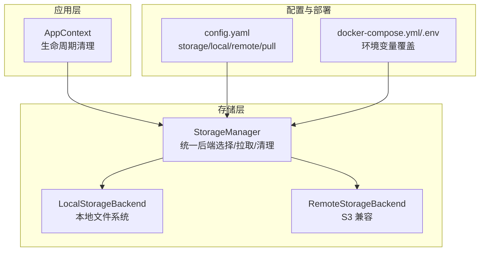
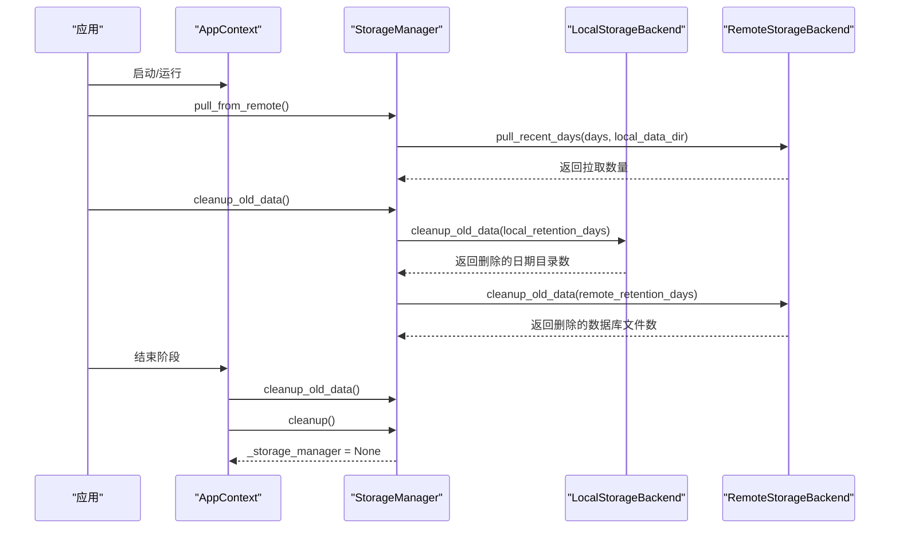
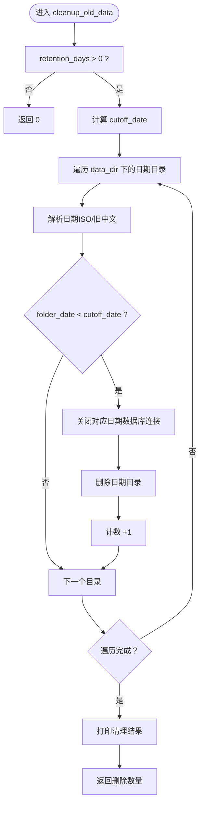
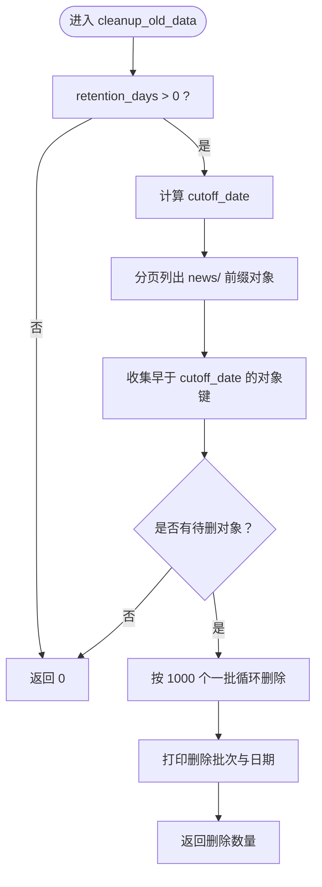
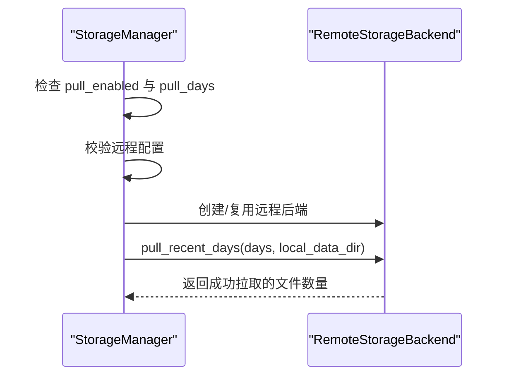
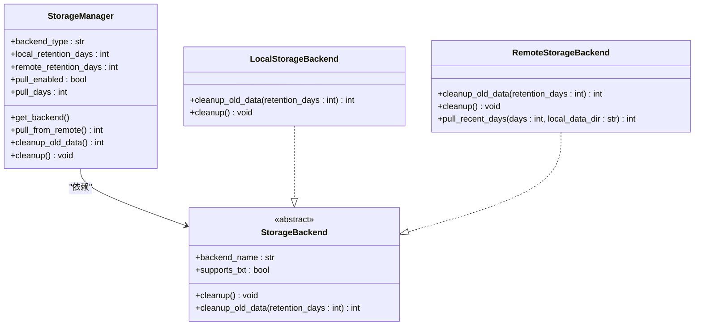

# 资源管理

<cite>
**本文引用的文件**
- [trendradar/storage/manager.py](file://trendradar/storage/manager.py)
- [trendradar/storage/local.py](file://trendradar/storage/local.py)
- [trendradar/storage/remote.py](file://trendradar/storage/remote.py)
- [trendradar/storage/base.py](file://trendradar/storage/base.py)
- [trendradar/context.py](file://trendradar/context.py)
- [config/config.yaml](file://config/config.yaml)
- [docker/docker-compose.yml](file://docker/docker-compose.yml)
- [docker/.env](file://docker/.env)
- [README.md](file://README.md)
</cite>

## 目录
1. [简介](#简介)
2. [项目结构](#项目结构)
3. [核心组件](#核心组件)
4. [架构总览](#架构总览)
5. [详细组件分析](#详细组件分析)
6. [依赖关系分析](#依赖关系分析)
7. [性能考量](#性能考量)
8. [故障排查指南](#故障排查指南)
9. [结论](#结论)
10. [附录](#附录)

## 简介
本技术文档聚焦 TrendRadar 的资源管理功能，围绕以下关键点进行深入解析：
- cleanup_old_data() 与 cleanup() 的实现细节与调用流程
- local_retention_days 与 remote_retention_days 的清理策略
- 本地文件系统与远程存储（S3 兼容）的清理执行逻辑
- pull_from_remote() 在启动时自动同步历史数据的机制（pull_enabled 与 pull_days）
- AppContext.cleanup() 如何协调存储资源释放，确保 _storage_manager 正确清理并置空
- 结合 GitHub Actions 临时环境与长期运行 Docker 容器的不同行为模式

## 项目结构
资源管理相关代码主要分布在以下模块：
- 存储管理器：统一后端选择、拉取与清理入口
- 本地存储后端：基于本地文件系统的数据与清理
- 远程存储后端：基于 S3 兼容协议的云端数据与清理
- 应用上下文：生命周期末尾的资源回收
- 配置与部署：环境变量与 YAML 配置项

图表来源
- [trendradar/storage/manager.py](file://trendradar/storage/manager.py#L1-L120)
- [trendradar/storage/local.py](file://trendradar/storage/local.py#L740-L890)
- [trendradar/storage/remote.py](file://trendradar/storage/remote.py#L830-L1029)
- [trendradar/context.py](file://trendradar/context.py#L380-L391)
- [config/config.yaml](file://config/config.yaml#L13-L52)
- [docker/docker-compose.yml](file://docker/docker-compose.yml#L55-L69)
- [docker/.env](file://docker/.env#L92-L120)

章节来源
- [trendradar/storage/manager.py](file://trendradar/storage/manager.py#L1-L120)
- [config/config.yaml](file://config/config.yaml#L13-L52)
- [docker/docker-compose.yml](file://docker/docker-compose.yml#L55-L69)
- [docker/.env](file://docker/.env#L92-L120)

## 核心组件
- StorageManager：负责后端类型解析（auto/remote/local）、远程拉取、过期数据清理、资源清理与统一接口代理
- LocalStorageBackend：本地文件系统存储，提供本地过期数据清理、推送记录、快照与报告保存
- RemoteStorageBackend：远程 S3 兼容存储，提供远程过期数据清理、推送记录、快照与报告保存
- AppContext：应用生命周期末尾调用 cleanup()，委托 StorageManager 执行清理并置空引用

章节来源
- [trendradar/storage/manager.py](file://trendradar/storage/manager.py#L18-L120)
- [trendradar/storage/local.py](file://trendradar/storage/local.py#L740-L890)
- [trendradar/storage/remote.py](file://trendradar/storage/remote.py#L830-L1029)
- [trendradar/context.py](file://trendradar/context.py#L380-L391)

## 架构总览
资源管理的关键流程如下：
- 后端选择：auto 模式下，GitHub Actions 环境优先 remote（若配置有效），否则回退 local；Docker/本地默认 local
- 启动拉取：pull_from_remote() 在 pull_enabled 且 pull_days>0 时，从远程拉取最近 N 天数据到本地
- 过期清理：cleanup_old_data() 分别调用本地与远程后端的清理方法，依据 local_retention_days 与 remote_retention_days
- 生命周期清理：AppContext.cleanup() 先清理过期数据，再清理资源并置空 _storage_manager

图表来源
- [trendradar/storage/manager.py](file://trendradar/storage/manager.py#L175-L256)
- [trendradar/storage/local.py](file://trendradar/storage/local.py#L746-L821)
- [trendradar/storage/remote.py](file://trendradar/storage/remote.py#L870-L958)
- [trendradar/context.py](file://trendradar/context.py#L385-L391)

## 详细组件分析

### StorageManager：后端选择、拉取与清理
- 后端解析
  - auto 模式：GitHub Actions 且远程配置有效 → remote；否则 local
  - Docker/本地：默认 local
- 拉取逻辑
  - pull_from_remote()：当 pull_enabled 且 pull_days>0 且远程配置有效时，创建远程后端并调用其 pull_recent_days()
- 清理逻辑
  - cleanup_old_data()：分别调用本地与远程后端的 cleanup_old_data()，仅当对应保留天数大于 0 且远程配置有效时清理远程
  - cleanup()：依次调用本地与远程后端的 cleanup()

章节来源
- [trendradar/storage/manager.py](file://trendradar/storage/manager.py#L72-L105)
- [trendradar/storage/manager.py](file://trendradar/storage/manager.py#L175-L256)

### LocalStorageBackend：本地过期数据清理
- 清理策略
  - 仅当 retention_days > 0 时执行
  - 计算截止日期 cutoff_date = 当前配置时间 - retention_days
  - 遍历 data_dir 下的日期目录（支持 ISO 与旧中文格式），解析日期并比较
  - 若早于 cutoff_date：先关闭对应日期的数据库连接，再删除整个日期目录
- 返回值：删除的日期目录数量

图表来源
- [trendradar/storage/local.py](file://trendradar/storage/local.py#L746-L821)

章节来源
- [trendradar/storage/local.py](file://trendradar/storage/local.py#L746-L821)

### RemoteStorageBackend：远程过期数据清理
- 清理策略
  - 仅当 retention_days > 0 时执行
  - 使用 list_objects_v2 分页列出 news/ 前缀对象
  - 解析对象键中的日期（支持 ISO 与旧中文），收集早于 cutoff_date 的对象
  - 批量删除（每次最多 1000 个），记录删除的日期集合
- 返回值：删除的日期集合大小（即删除的数据库文件数）

图表来源
- [trendradar/storage/remote.py](file://trendradar/storage/remote.py#L870-L958)

章节来源
- [trendradar/storage/remote.py](file://trendradar/storage/remote.py#L870-L958)

### AppContext.cleanup()：资源释放协调
- 调用顺序：先执行 cleanup_old_data()，再执行 cleanup()，最后将 _storage_manager 置空
- 作用：确保在应用生命周期结束时，本地与远程资源得到正确释放，避免悬挂连接与临时文件残留

章节来源
- [trendradar/context.py](file://trendradar/context.py#L385-L391)

### 启动时自动同步：pull_from_remote()
- 触发条件：pull_enabled 为真且 pull_days > 0
- 执行流程：校验远程配置 → 创建远程后端（如未存在）→ 调用远程后端的 pull_recent_days()
- 时间范围：按最近 N 天逐日拉取，跳过本地已存在的日期与远程不存在的日期

图表来源
- [trendradar/storage/manager.py](file://trendradar/storage/manager.py#L175-L199)
- [trendradar/storage/remote.py](file://trendradar/storage/remote.py#L1042-L1083)

章节来源
- [trendradar/storage/manager.py](file://trendradar/storage/manager.py#L175-L199)
- [trendradar/storage/remote.py](file://trendradar/storage/remote.py#L1042-L1083)

## 依赖关系分析
- StorageManager 依赖本地与远程存储后端接口（抽象基类）
- 本地与远程后端均实现 cleanup_old_data() 与 cleanup()，并遵循统一的清理策略
- AppContext 通过 StorageManager 协调资源释放
- 配置与部署通过 YAML 与环境变量影响后端选择、保留天数与拉取策略

图表来源
- [trendradar/storage/manager.py](file://trendradar/storage/manager.py#L18-L120)
- [trendradar/storage/base.py](file://trendradar/storage/base.py#L283-L349)
- [trendradar/storage/local.py](file://trendradar/storage/local.py#L746-L821)
- [trendradar/storage/remote.py](file://trendradar/storage/remote.py#L870-L958)

章节来源
- [trendradar/storage/base.py](file://trendradar/storage/base.py#L283-L349)
- [trendradar/storage/manager.py](file://trendradar/storage/manager.py#L18-L120)

## 性能考量
- 本地清理
  - 遍历 data_dir 下的日期目录，逐个解析日期并比较，时间复杂度 O(N)，N 为日期目录数量
  - 删除目录前先关闭对应数据库连接，避免文件占用导致删除失败
- 远程清理
  - 使用 list_objects_v2 分页列出对象，时间复杂度 O(M)，M 为 news/ 前缀对象总数
  - 批量删除每次最多 1000 个对象，减少 API 调用次数，提高吞吐
- 拉取同步
  - 逐日拉取，跳过本地已存在与远程不存在的日期，避免重复 IO
- 环境选择
  - GitHub Actions 环境下 auto 优先 remote（若配置有效），有利于长期数据沉淀与跨任务共享
  - Docker/本地默认 local，便于持久化与离线分析

[本节为通用性能讨论，无需具体文件来源]

## 故障排查指南
- 清理失败
  - 本地：检查 data_dir 是否存在、权限是否足够、对应日期数据库连接是否被占用
  - 远程：确认 S3 凭据与端点配置、网络连通性、对象键命名格式（ISO/旧中文）
- 拉取失败
  - 确认 pull_enabled 与 pull_days 设置、远程配置有效、远程对象存在
- 资源未释放
  - 确认 AppContext.cleanup() 是否被调用，以及 StorageManager.cleanup() 是否被正确执行

章节来源
- [trendradar/storage/local.py](file://trendradar/storage/local.py#L746-L821)
- [trendradar/storage/remote.py](file://trendradar/storage/remote.py#L870-L958)
- [trendradar/storage/manager.py](file://trendradar/storage/manager.py#L228-L234)
- [trendradar/context.py](file://trendradar/context.py#L385-L391)

## 结论
- cleanup_old_data() 与 cleanup() 在本地与远程后端分别实现，遵循统一的保留天数策略
- StorageManager 作为协调者，负责后端选择、启动拉取与资源清理
- AppContext.cleanup() 在生命周期末尾确保资源释放，避免泄漏
- 在 GitHub Actions 与 Docker 容器中，通过配置与环境变量实现不同的资源管理模式，满足临时与长期运行场景的需求

[本节为总结性内容，无需具体文件来源]

## 附录

### 配置项与部署要点
- 配置文件
  - storage.local.retention_days：本地保留天数（0 表示不清理）
  - storage.remote.retention_days：远程保留天数（0 表示不清理）
  - storage.pull.enabled/days：启动时自动拉取最近 N 天
- 环境变量（优先级高于 YAML）
  - STORAGE_BACKEND、LOCAL_RETENTION_DAYS、REMOTE_RETENTION_DAYS、PULL_ENABLED、PULL_DAYS
  - S3_* 相关环境变量用于远程存储配置
- Docker Compose
  - 通过环境变量注入上述配置，容器挂载输出目录以持久化数据

章节来源
- [config/config.yaml](file://config/config.yaml#L13-L52)
- [docker/docker-compose.yml](file://docker/docker-compose.yml#L55-L69)
- [docker/.env](file://docker/.env#L92-L120)
- [README.md](file://README.md#L3018-L3080)