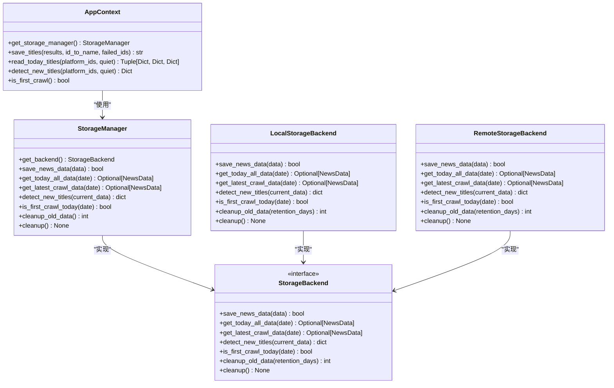
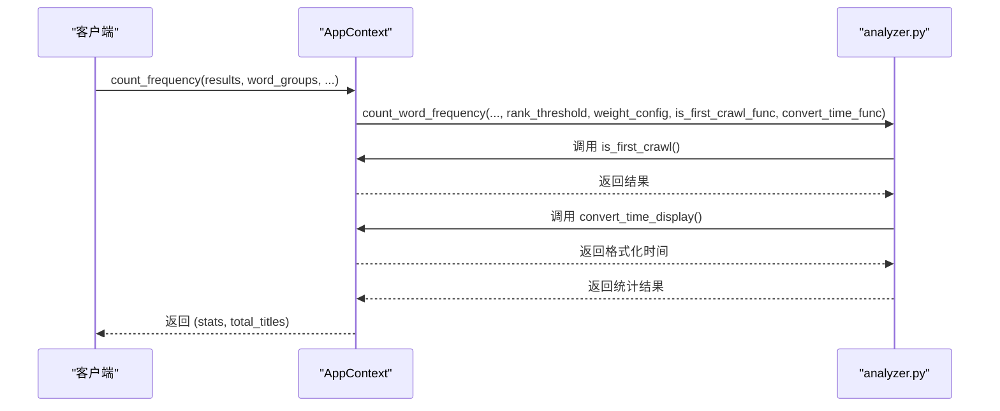
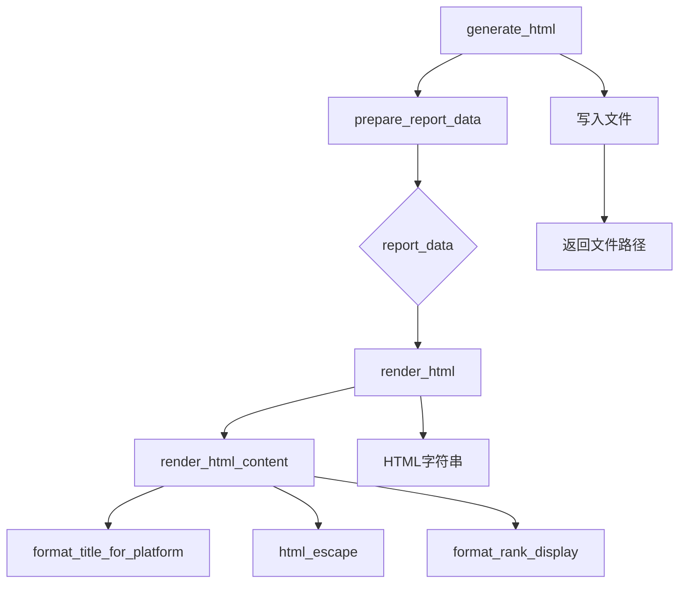
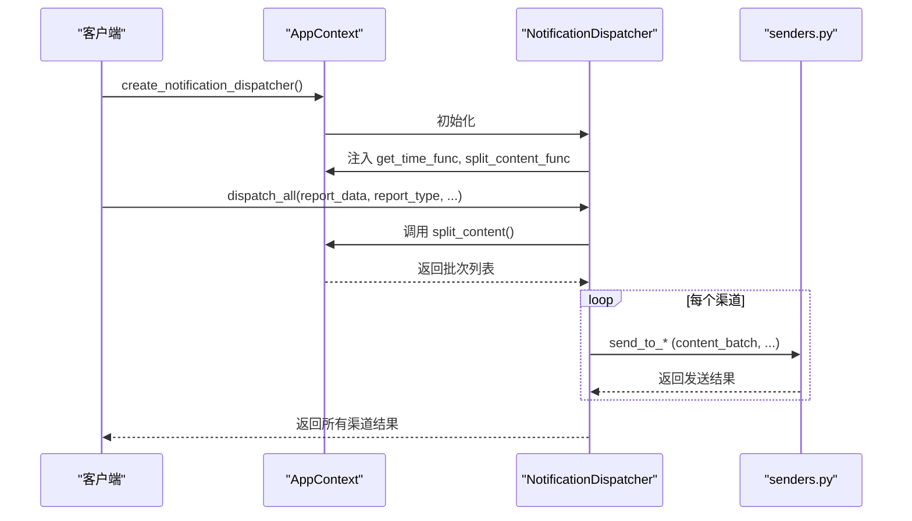

# 应用上下文

<cite>
**本文档引用的文件**   
- [context.py](file://trendradar/context.py#L1-L391)
- [manager.py](file://trendradar/storage/manager.py#L1-L344)
- [dispatcher.py](file://trendradar/notification/dispatcher.py#L1-L421)
- [analyzer.py](file://trendradar/core/analyzer.py#L1-L473)
- [generator.py](file://trendradar/report/generator.py#L1-L236)
- [frequency.py](file://trendradar/core/frequency.py#L1-L195)
- [data.py](file://trendradar/core/data.py#L1-L306)
- [time.py](file://trendradar/utils/time.py#L1-L92)
</cite>

## 目录
1. [简介](#简介)
2. [核心功能](#核心功能)
3. [依赖注入与服务封装](#依赖注入与服务封装)
4. [存储管理](#存储管理)
5. [频率词与统计分析](#频率词与统计分析)
6. [报告生成](#报告生成)
7. [通知分发](#通知分发)
8. [时间与配置](#时间与配置)
9. [资源清理](#资源清理)
10. [使用示例](#使用示例)

## 简介
`AppContext` 类是 TrendRadar 应用的核心依赖注入容器，它封装了所有依赖于配置的操作，旨在消除全局状态并提高代码的可测试性。通过将配置、存储、分析、报告和通知等服务集中管理，`AppContext` 提供了一个统一的接口，使得应用程序的各个组件能够以一种解耦且类型安全的方式进行交互。该类通过属性装饰器提供类型安全的配置访问，并通过延迟初始化和单例模式管理资源，确保了高效且一致的运行环境。

**Section sources**
- [context.py](file://trendradar/context.py#L44-L391)

## 核心功能
`AppContext` 类的核心功能围绕其作为应用上下文的角色展开。它通过 `__init__` 方法接收一个完整的配置字典，并将其存储在实例中。该类通过一系列方法和属性，为应用程序提供了对配置、时间、存储、数据处理、频率词分析、报告生成和通知分发的统一访问。其设计原则是将所有依赖于配置的函数调用转换为对 `AppContext` 实例的方法调用，从而将全局依赖转换为局部依赖，极大地提升了代码的模块化和可维护性。

**Section sources**
- [context.py](file://trendradar/context.py#L66-L75)

## 依赖注入与服务封装
`AppContext` 作为依赖注入容器，通过封装对 `StorageManager`、`NotificationDispatcher` 等关键组件的访问，实现了服务的集中管理。当需要使用某个服务时，客户端代码不再直接导入和实例化该服务，而是通过调用 `AppContext` 的相应方法（如 `get_storage_manager()` 或 `create_notification_dispatcher()`）来获取。这种方式不仅隐藏了服务的创建细节，还允许 `AppContext` 在内部处理依赖关系和配置传递，确保了服务实例的正确初始化和配置一致性。

**Section sources**
- [context.py](file://trendradar/context.py#L44-L391)

## 存储管理
`AppContext` 通过 `get_storage_manager()` 方法提供对存储后端的访问。该方法实现了延迟初始化和单例模式，确保在整个应用生命周期内，对于同一个 `AppContext` 实例，只会创建一个 `StorageManager` 实例。`StorageManager` 负责根据配置自动选择本地或远程存储后端，并提供统一的读写接口。`AppContext` 将配置中的存储相关参数（如 `BACKEND`、`DATA_DIR`、`REMOTE` 配置等）传递给 `get_storage_manager` 工厂函数，从而创建出配置正确的存储管理器。



**Diagram sources **
- [context.py](file://trendradar/context.py#L128-L154)
- [manager.py](file://trendradar/storage/manager.py#L18-L344)

**Section sources**
- [context.py](file://trendradar/context.py#L128-L154)
- [manager.py](file://trendradar/storage/manager.py#L18-L344)

## 频率词与统计分析
`AppContext` 通过 `count_frequency()` 方法集成了权重计算和词频统计的核心功能。该方法内部调用了 `core/analyzer.py` 模块中的 `count_word_frequency` 函数，并将 `AppContext` 自身的配置（如 `rank_threshold` 和 `weight_config`）以及方法（如 `is_first_crawl` 和 `convert_time_display`）作为参数传递。这使得统计分析逻辑能够访问到应用上下文中的最新状态和配置，而无需直接依赖全局变量。`matches_word_groups()` 方法则用于检查标题是否匹配预定义的词组规则，是频率词过滤的关键。



**Diagram sources **
- [context.py](file://trendradar/context.py#L205-L234)
- [analyzer.py](file://trendradar/core/analyzer.py#L90-L473)
- [frequency.py](file://trendradar/core/frequency.py#L132-L194)

**Section sources**
- [context.py](file://trendradar/context.py#L205-L234)
- [analyzer.py](file://trendradar/core/analyzer.py#L90-L473)

## 报告生成
`AppContext` 提供了一套完整的报告生成方法链，包括 `prepare_report()`、`generate_html()` 和 `render_html()`。`generate_html()` 方法是入口点，它首先调用 `prepare_report_data` 函数准备报告数据，然后通过 `render_html_func` 回调（指向 `AppContext` 自身的 `render_html` 方法）来渲染HTML内容。这种设计允许 `AppContext` 将自身的配置（如 `REVERSE_CONTENT_ORDER`）和方法（如 `get_time`）无缝注入到报告生成流程中，最终生成符合要求的HTML报告文件。



**Diagram sources **
- [context.py](file://trendradar/context.py#L258-L306)
- [generator.py](file://trendradar/report/generator.py#L140-L236)
- [formatter.py](file://trendradar/report/formatter.py#L13-L224)

**Section sources**
- [context.py](file://trendradar/context.py#L258-L306)
- [generator.py](file://trendradar/report/generator.py#L140-L236)

## 通知分发
`AppContext` 通过 `create_notification_dispatcher()` 方法协调多渠道推送。该方法创建并返回一个 `NotificationDispatcher` 实例，该实例在初始化时接收 `AppContext` 的配置、`get_time_func` 和 `split_content_func`。`NotificationDispatcher` 利用这些依赖，能够根据配置向飞书、钉钉等多个渠道发送格式化后的通知内容。`split_content()` 方法则负责将大块的报告内容分割成符合各平台大小限制的批次，确保消息能够成功发送。



**Diagram sources **
- [context.py](file://trendradar/context.py#L368-L374)
- [dispatcher.py](file://trendradar/notification/dispatcher.py#L34-L421)
- [splitter.py](file://trendradar/notification/splitter.py#L23-L581)

**Section sources**
- [context.py](file://trendradar/context.py#L368-L374)
- [dispatcher.py](file://trendradar/notification/dispatcher.py#L34-L421)

## 时间与配置
`AppContext` 通过属性装饰器（如 `timezone`、`rank_threshold`、`weight_config`）提供类型安全的配置访问。这些属性从初始化时传入的 `config` 字典中提取相应的值，并提供默认值以增强健壮性。在时间操作方面，`AppContext` 封装了 `utils/time.py` 模块中的函数，提供了 `get_time()`、`format_date()`、`format_time()` 等方法，确保所有时间相关的操作都使用统一的时区（由 `timezone` 属性定义），避免了时区混乱的问题。

**Section sources**
- [context.py](file://trendradar/context.py#L78-L125)
- [time.py](file://trendradar/utils/time.py#L1-L92)

## 资源清理
`AppContext` 的 `cleanup()` 方法在应用结束时负责释放资源。它主要调用内部的 `_storage_manager` 实例的 `cleanup_old_data()` 和 `cleanup()` 方法。`cleanup_old_data()` 会根据配置的保留天数（`local_retention_days` 和 `remote_retention_days`）清理过期的本地和远程数据，而 `cleanup()` 则执行任何必要的清理工作，如关闭数据库连接或文件句柄。最后，`_storage_manager` 被设置为 `None`，完成资源的释放。

**Section sources**
- [context.py](file://trendradar/context.py#L385-L390)
- [manager.py](file://trendradar/storage/manager.py#L228-L255)

## 使用示例
以下是如何使用 `AppContext` 的典型示例：
1.  **初始化**：首先加载配置，然后创建 `AppContext` 实例。
2.  **时间操作**：调用 `get_time()` 获取当前时间，或使用 `format_date()` 获取日期文件夹名。
3.  **数据持久化**：调用 `save_titles()` 方法将爬取结果保存到文件。
4.  **调用服务**：通过 `get_storage_manager()` 获取存储管理器进行更复杂的存储操作。
5.  **清理资源**：在程序结束前，调用 `cleanup()` 方法释放资源。

```python
# 1. 初始化
config = load_config()  # 假设有一个加载配置的函数
ctx = AppContext(config)

# 2. 时间操作
now = ctx.get_time()
date_folder = ctx.format_date()

# 3. 数据持久化
# 假设 results, id_to_name, failed_ids 已定义
ctx.save_titles(results, id_to_name, failed_ids)

# 4. 调用服务
storage = ctx.get_storage_manager()
all_titles, id_to_name, title_info = ctx.read_today_titles()

# 5. 清理资源
ctx.cleanup()
```

**Section sources**
- [context.py](file://trendradar/context.py#L51-L64)