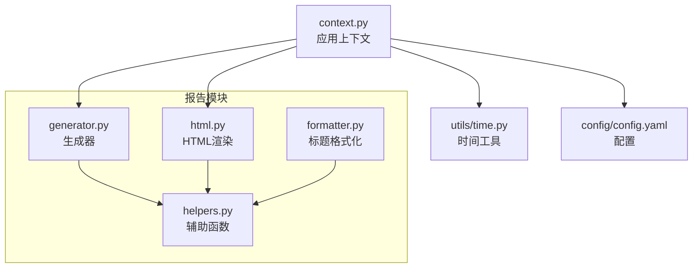
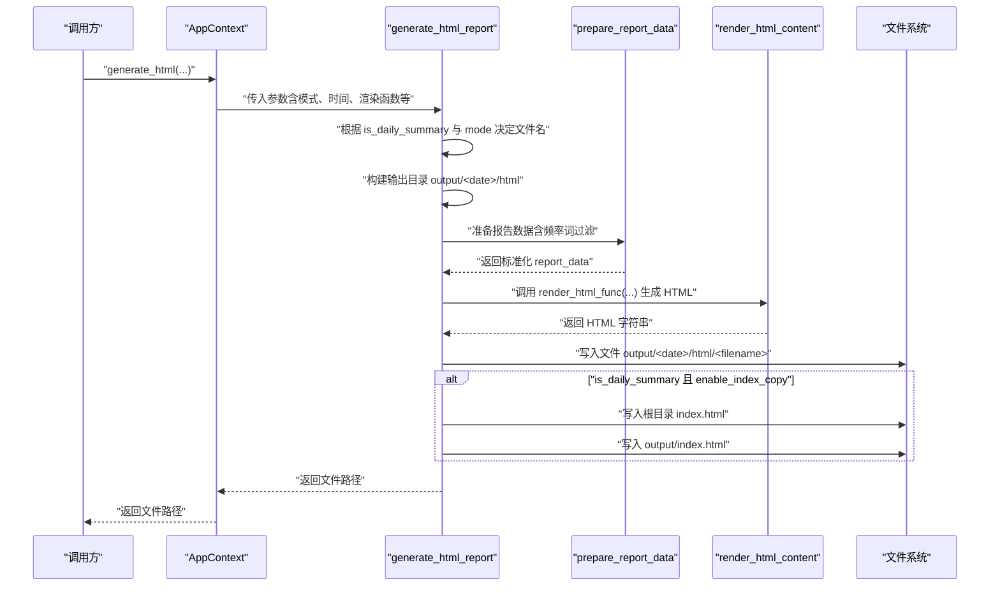
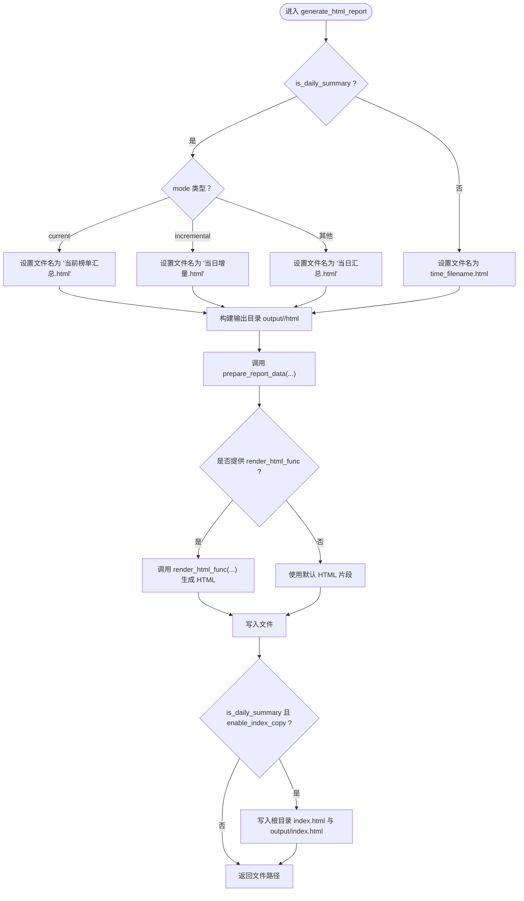
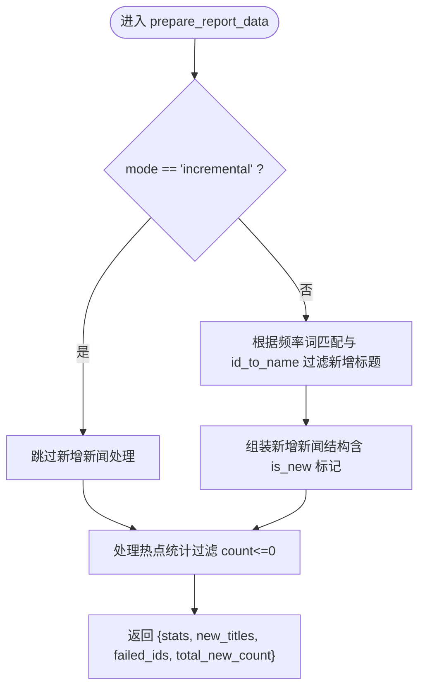
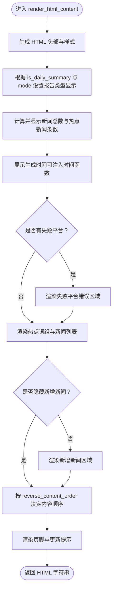
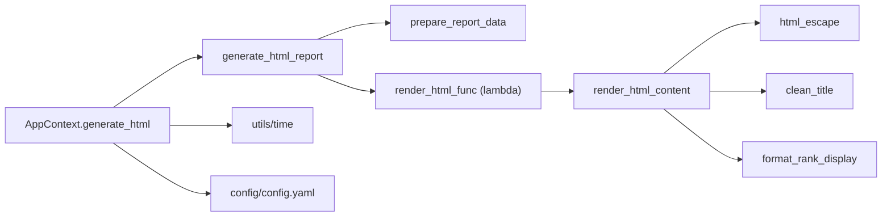

# HTML报告生成

<cite>
**本文引用的文件**
- [trendradar/report/generator.py](file://trendradar/report/generator.py)
- [trendradar/report/html.py](file://trendradar/report/html.py)
- [trendradar/report/helpers.py](file://trendradar/report/helpers.py)
- [trendradar/report/formatter.py](file://trendradar/report/formatter.py)
- [trendradar/context.py](file://trendradar/context.py)
- [trendradar/utils/time.py](file://trendradar/utils/time.py)
- [config/config.yaml](file://config/config.yaml)
</cite>

## 目录
1. [简介](#简介)
2. [项目结构](#项目结构)
3. [核心组件](#核心组件)
4. [架构总览](#架构总览)
5. [详细组件分析](#详细组件分析)
6. [依赖关系分析](#依赖关系分析)
7. [性能考量](#性能考量)
8. [故障排查指南](#故障排查指南)
9. [结论](#结论)

## 简介
本文件聚焦 TrendRadar 报告生成系统中“HTML 报告生成阶段”的实现细节，围绕 `generate_html_report` 函数的执行流程展开，系统性说明：
- 如何依据报告模式与是否为每日汇总确定输出文件名；
- 如何构建输出目录路径；
- `prepare_report_data` 的调用过程与数据准备逻辑；
- `render_html_func` 的调用方式与最终 HTML 内容生成；
- `enable_index_copy` 配置项的作用与行为，即如何将生成的报告同时写入根目录与 output 目录的 index.html，以支持 GitHub Pages 与 Docker Volume 挂载访问。

## 项目结构
与 HTML 报告生成相关的核心模块位于 `trendradar/report/` 下，配合 `trendradar/context.py` 提供统一的上下文封装，`trendradar/utils/time.py` 提供时间格式化能力，`config/config.yaml` 提供全局配置。

图表来源
- [trendradar/report/generator.py](file://trendradar/report/generator.py#L140-L235)
- [trendradar/report/html.py](file://trendradar/report/html.py#L14-L120)
- [trendradar/report/helpers.py](file://trendradar/report/helpers.py#L1-L126)
- [trendradar/report/formatter.py](file://trendradar/report/formatter.py#L1-L224)
- [trendradar/context.py](file://trendradar/context.py#L236-L306)
- [trendradar/utils/time.py](file://trendradar/utils/time.py#L1-L92)
- [config/config.yaml](file://config/config.yaml#L1-L187)

章节来源
- [trendradar/report/generator.py](file://trendradar/report/generator.py#L140-L235)
- [trendradar/report/html.py](file://trendradar/report/html.py#L14-L120)
- [trendradar/report/helpers.py](file://trendradar/report/helpers.py#L1-L126)
- [trendradar/report/formatter.py](file://trendradar/report/formatter.py#L1-L224)
- [trendradar/context.py](file://trendradar/context.py#L236-L306)
- [trendradar/utils/time.py](file://trendradar/utils/time.py#L1-L92)
- [config/config.yaml](file://config/config.yaml#L1-L187)

## 核心组件
- generate_html_report：负责文件名与目录决策、数据准备、HTML 渲染、文件写入，并在满足条件时复制到 index.html。
- prepare_report_data：将原始统计与新增标题数据规范化，支持频率词过滤与模式控制。
- render_html_content：根据 report_data 生成最终 HTML 字符串，支持内容顺序、时间显示、更新提示等。
- AppContext.generate_html：应用上下文封装，统一传参并调用 generate_html_report。
- helpers.html_escape/clean_title/format_rank_display：提供 HTML 转义、标题清洗与排名格式化。
- utils/time：提供日期与时间格式化，用于文件命名与显示。

章节来源
- [trendradar/report/generator.py](file://trendradar/report/generator.py#L140-L235)
- [trendradar/report/html.py](file://trendradar/report/html.py#L14-L120)
- [trendradar/context.py](file://trendradar/context.py#L258-L306)
- [trendradar/report/helpers.py](file://trendradar/report/helpers.py#L1-L126)
- [trendradar/utils/time.py](file://trendradar/utils/time.py#L33-L76)

## 架构总览
下图展示从应用上下文到 HTML 报告生成的关键调用链路与职责边界。

图表来源
- [trendradar/context.py](file://trendradar/context.py#L258-L306)
- [trendradar/report/generator.py](file://trendradar/report/generator.py#L140-L235)
- [trendradar/report/html.py](file://trendradar/report/html.py#L14-L120)

## 详细组件分析

### generate_html_report 执行流程
- 文件名决策
  - 若 is_daily_summary 为真：
    - mode 为 "current"：文件名为“当前榜单汇总.html”
    - mode 为 "incremental"：文件名为“当日增量.html”
    - 其他情况：文件名为“当日汇总.html”
  - 若 is_daily_summary 为假：文件名为 time_filename.html（由时间工具格式化得到）
- 输出目录构建
  - 目录路径为 output_dir / date_folder / "html"，并在写入前确保目录存在
- 数据准备
  - 调用 prepare_report_data，传入统计结果、失败平台、新增标题、平台映射、模式、阈值，以及频率词匹配与加载函数
- HTML 渲染
  - 若提供 render_html_func，则以 report_data、total_titles、is_daily_summary、mode、update_info 为参数调用之；否则使用默认简单 HTML
- 文件写入
  - 将 HTML 写入 file_path
- 索引复制（enable_index_copy）
  - 当 is_daily_summary 为真且 enable_index_copy 为真时：
    - 同步写入根目录 index.html（便于 GitHub Pages 直接访问）
    - 同步写入 output/index.html（便于 Docker Volume 挂载后直接访问）

图表来源
- [trendradar/report/generator.py](file://trendradar/report/generator.py#L140-L235)

章节来源
- [trendradar/report/generator.py](file://trendradar/report/generator.py#L140-L235)

### prepare_report_data 数据准备
- 新增新闻处理
  - 若 mode 为 "incremental"，则隐藏新增新闻区域
  - 否则根据 id_to_name 与可选的频率词匹配函数进行过滤，仅保留匹配的新增标题
  - 将新增标题转换为统一结构（包含标题、来源、时间显示、出现次数、排名、链接、是否新增等）
- 热点统计处理
  - 过滤 count<=0 的词组
  - 将每条标题转换为统一结构（标题、来源、时间显示、出现次数、排名、链接等）
- 返回结构
  - 包含 processed_stats、processed_new_titles、failed_ids、total_new_count

图表来源
- [trendradar/report/generator.py](file://trendradar/report/generator.py#L14-L138)

章节来源
- [trendradar/report/generator.py](file://trendradar/report/generator.py#L14-L138)

### render_html_content HTML 渲染
- 功能要点
  - 生成完整 HTML 文档骨架（头部、样式、脚本）
  - 根据 is_daily_summary 与 mode 决定报告类型显示
  - 展示新闻总数、热点新闻条数、生成时间（可注入时间函数）
  - 渲染失败平台错误区域
  - 渲染热点词组与对应新闻列表（含排名、时间、出现次数、链接）
  - 渲染新增新闻区域（当未隐藏时）
  - 支持内容顺序反转（通过 reverse_content_order）
  - 支持更新提示（update_info）
- 关键渲染逻辑
  - 热点词组与新闻项的循环渲染
  - 排名等级判定与高亮
  - 标题与链接的 HTML 转义
  - 新增标记与时间简化处理

图表来源
- [trendradar/report/html.py](file://trendradar/report/html.py#L14-L120)
- [trendradar/report/html.py](file://trendradar/report/html.py#L140-L738)

章节来源
- [trendradar/report/html.py](file://trendradar/report/html.py#L14-L120)
- [trendradar/report/html.py](file://trendradar/report/html.py#L140-L738)

### AppContext.generate_html 与时间工具
- AppContext.generate_html
  - 通过上下文统一传参：mode、is_daily_summary、rank_threshold、输出目录、日期与时间文件名、渲染函数、频率词匹配与加载函数、enable_index_copy
  - 渲染函数由上下文内部的 render_html 包装，支持内容顺序与时间函数注入
- 时间工具
  - format_date：输出 ISO 日期字符串（YYYY-MM-DD），用于 date_folder
  - format_time：输出 HH-MM（文件名安全），用于 time_filename
  - get_time_display：输出 HH:MM（显示用）

章节来源
- [trendradar/context.py](file://trendradar/context.py#L258-L306)
- [trendradar/utils/time.py](file://trendradar/utils/time.py#L33-L76)

### enable_index_copy 配置项的作用
- 行为说明
  - 当 is_daily_summary 为真且 enable_index_copy 为真时，生成的 HTML 会被同时写入：
    - 根目录 index.html（便于 GitHub Pages 直接访问）
    - output/index.html（便于 Docker Volume 挂载后直接访问）
- 设计目的
  - 支持静态站点托管（GitHub Pages）直接展示最新报告
  - 支持容器化部署（Docker）通过卷挂载将最新报告暴露给宿主或反向代理

章节来源
- [trendradar/report/generator.py](file://trendradar/report/generator.py#L222-L234)

## 依赖关系分析
- 模块耦合
  - generate_html_report 依赖 prepare_report_data、Path、可选的 render_html_func
  - render_html_content 依赖 helpers.html_escape、helpers.clean_title、helpers.format_rank_display
  - AppContext.generate_html 依赖 generate_html_report、render_html_content、utils.time、config
- 外部依赖
  - 文件系统（Path）、datetime、typing、pytz（时间工具）

图表来源
- [trendradar/report/generator.py](file://trendradar/report/generator.py#L140-L235)
- [trendradar/report/html.py](file://trendradar/report/html.py#L14-L120)
- [trendradar/report/helpers.py](file://trendradar/report/helpers.py#L1-L126)
- [trendradar/context.py](file://trendradar/context.py#L258-L306)

章节来源
- [trendradar/report/generator.py](file://trendradar/report/generator.py#L140-L235)
- [trendradar/report/html.py](file://trendradar/report/html.py#L14-L120)
- [trendradar/report/helpers.py](file://trendradar/report/helpers.py#L1-L126)
- [trendradar/context.py](file://trendradar/context.py#L258-L306)

## 性能考量
- I/O 成本
  - 文件写入为顺序写，单次生成涉及一次或多次磁盘写入（取决于是否启用索引复制）
- 渲染成本
  - HTML 渲染主要为字符串拼接与循环遍历，复杂度与热点词组数量与新闻条数线性相关
- 频率词过滤
  - 新增新闻过滤在 prepare_report_data 中进行，若频率词规则较多，可能增加 O(N*M) 的匹配开销（N 为新增新闻数，M 为词组数）
- 建议
  - 控制每关键词最大显示数量（config 中 max_news_per_keyword）以降低渲染体积
  - 合理设置 REVERSE_CONTENT_ORDER，减少不必要的 DOM 结构变化

## 故障排查指南
- 文件名与目录问题
  - 确认 is_daily_summary 与 mode 的组合是否符合预期（“当日汇总.html”、“当前榜单汇总.html”、“当日增量.html”）
  - 确认 output_dir 与 date_folder 是否正确传入（AppContext 已默认使用 format_date/format_time）
- 索引复制未生效
  - 检查 enable_index_copy 是否为 True
  - 确认 is_daily_summary 是否为 True
- 新增新闻区域缺失
  - 若 mode 为 "incremental"，新增新闻区域将被隐藏，属预期行为
- HTML 内容异常
  - 检查 render_html_func 是否正确传入（AppContext 已封装）
  - 确认 report_data 结构是否完整（stats/new_titles/failed_ids/total_new_count）
- 时间显示不正确
  - 检查时区配置（config 中 timezone）与 get_time_func 注入（AppContext 已注入）

章节来源
- [trendradar/context.py](file://trendradar/context.py#L258-L306)
- [config/config.yaml](file://config/config.yaml#L1-L187)

## 结论
本文系统梳理了 TrendRadar HTML 报告生成阶段的执行流程，明确了 generate_html_report 的文件名与目录决策、数据准备、HTML 渲染与索引复制机制。通过 AppContext 的统一封装，开发者可以便捷地在不同部署场景（GitHub Pages、Docker Volume）中获得稳定的报告访问体验。建议在生产环境中结合配置项合理控制渲染规模与内容顺序，以平衡可读性与性能。