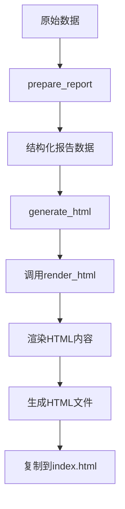
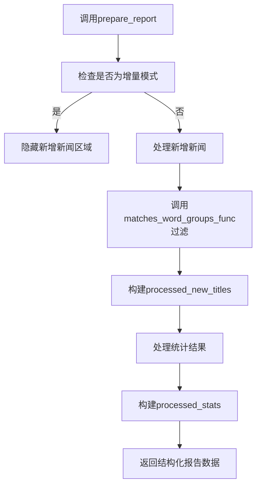
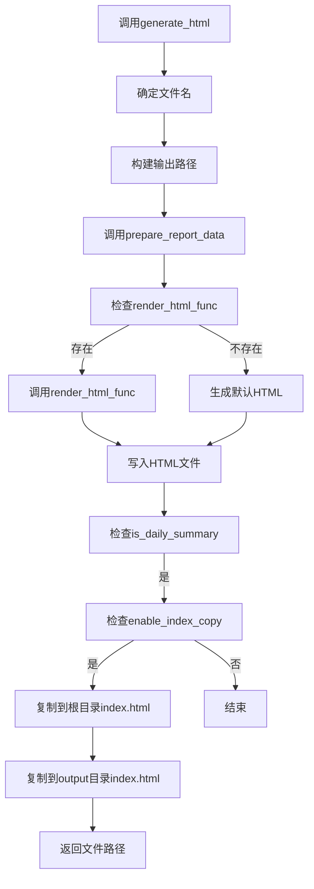
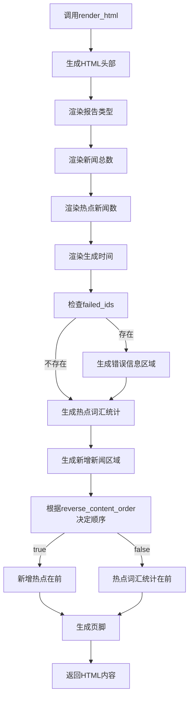
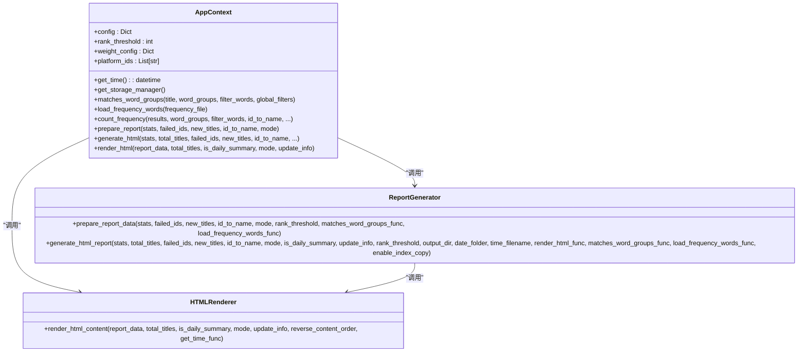
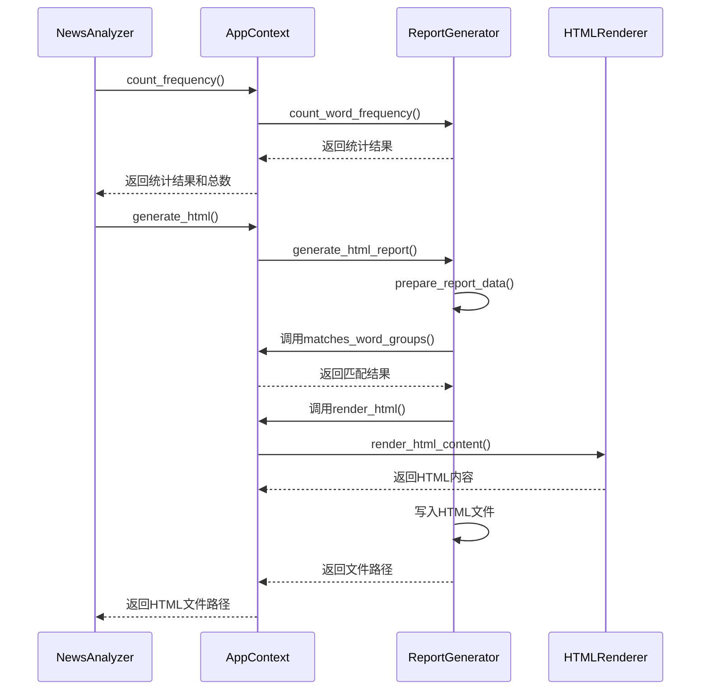
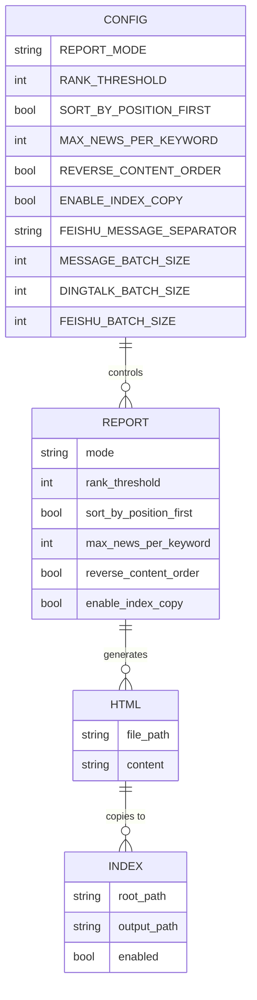

# 报告生成

<cite>
**本文档引用的文件**   
- [context.py](file://trendradar/context.py)
- [generator.py](file://trendradar/report/generator.py)
- [html.py](file://trendradar/report/html.py)
- [analyzer.py](file://trendradar/core/analyzer.py)
- [config.yaml](file://config/config.yaml)
- [__main__.py](file://trendradar/__main__.py)
</cite>

## 目录
1. [报告生成方法链概述](#报告生成方法链概述)
2. [prepare_report 方法分析](#prepare_report-方法分析)
3. [generate_html 方法分析](#generate_html-方法分析)
4. [render_html 方法分析](#render_html-方法分析)
5. [上下文参数传递机制](#上下文参数传递机制)
6. [实际调用示例](#实际调用示例)
7. [配置项作用分析](#配置项作用分析)

## 报告生成方法链概述

TrendRadar报告生成系统通过`AppContext`类中的`prepare_report`、`generate_html`和`render_html`方法链实现从原始数据到HTML报告的转换。这些方法形成了一个完整的报告生成流水线，每个方法负责特定的处理阶段，共同协作完成报告的生成。

该方法链的工作流程如下：`prepare_report`负责准备结构化数据，`generate_html`协调整个HTML报告生成流程，而`render_html`则负责最终的HTML内容渲染。这三个方法通过`AppContext`实例共享上下文参数，确保了配置的一致性。

**Diagram sources**
- [context.py](file://trendradar/context.py#L238-L288)
- [generator.py](file://trendradar/report/generator.py#L140-L235)
- [html.py](file://trendradar/report/html.py#L14-L800)

## prepare_report 方法分析

`prepare_report`方法是报告生成流程的第一步，负责准备报告所需的结构化数据。该方法封装了`prepare_report_data`函数的调用，将原始统计结果转换为适合报告展示的格式。

该方法的主要功能包括：处理新增标题数据、过滤匹配的热点新闻、构建结构化的报告数据。在增量模式下，该方法会隐藏新增新闻区域，而在其他模式下则会处理新增新闻部分。

**Diagram sources**
- [context.py](file://trendradar/context.py#L238-L256)
- [generator.py](file://trendradar/report/generator.py#L14-L137)

**Section sources**
- [context.py](file://trendradar/context.py#L238-L256)
- [generator.py](file://trendradar/report/generator.py#L14-L137)

## generate_html 方法分析

`generate_html`方法是报告生成的协调中心，负责管理整个HTML报告的生成流程。该方法封装了`generate_html_report`函数的调用，并通过回调函数机制与`render_html`方法协作。

该方法的主要职责包括：确定输出文件名、构建输出路径、准备报告数据、协调HTML渲染和文件写入。对于每日汇总报告，该方法还会根据`enable_index_copy`配置项决定是否将报告复制到根目录的`index.html`文件。

**Diagram sources**
- [context.py](file://trendradar/context.py#L258-L287)
- [generator.py](file://trendradar/report/generator.py#L140-L235)

**Section sources**
- [context.py](file://trendradar/context.py#L258-L287)
- [generator.py](file://trendradar/report/generator.py#L140-L235)

## render_html 方法分析

`render_html`方法负责最终的HTML内容渲染，将结构化的报告数据转换为完整的HTML文档。该方法封装了`render_html_content`函数的调用，并注入了必要的上下文参数。

该方法的主要功能包括：生成HTML文档结构、渲染热点词汇统计部分、生成新增新闻区域、处理错误信息显示。渲染过程中会根据`reverse_content_order`配置项决定内容顺序，支持新增热点在前或热点词汇统计在前两种布局。

**Diagram sources**
- [context.py](file://trendradar/context.py#L289-L306)
- [html.py](file://trendradar/report/html.py#L14-L800)

**Section sources**
- [context.py](file://trendradar/context.py#L289-L306)
- [html.py](file://trendradar/report/html.py#L14-L800)

## 上下文参数传递机制

报告生成方法链通过`AppContext`实例传递上下文参数，确保了配置的一致性和方法间的协作。关键的上下文参数包括`rank_threshold`、`matches_word_groups_func`等，这些参数在方法调用链中保持一致。

`rank_threshold`参数用于确定排名高亮的阈值，在`count_frequency`、`prepare_report_data`和`render_html_content`等多个方法中被使用。`matches_word_groups_func`参数则用于标题匹配逻辑，在`prepare_report_data`和`count_word_frequency`方法中被调用。

**Diagram sources**
- [context.py](file://trendradar/context.py#L44-L391)
- [generator.py](file://trendradar/report/generator.py#L14-L235)
- [html.py](file://trendradar/report/html.py#L14-L800)

**Section sources**
- [context.py](file://trendradar/context.py#L44-L391)
- [generator.py](file://trendradar/report/generator.py#L14-L235)
- [html.py](file://trendradar/report/html.py#L14-L800)

## 实际调用示例

在实际应用中，报告生成方法链的调用通常发生在`NewsAnalyzer`类的`_run_analysis_pipeline`方法中。该方法协调了从数据处理到报告生成的完整流程。

**Diagram sources**
- [__main__.py](file://trendradar/__main__.py#L293-L336)
- [context.py](file://trendradar/context.py#L258-L287)
- [generator.py](file://trendradar/report/generator.py#L140-L235)
- [html.py](file://trendradar/report/html.py#L14-L800)

**Section sources**
- [__main__.py](file://trendradar/__main__.py#L293-L336)

## 配置项作用分析

报告生成过程中的行为受到多个配置项的影响，其中`enable_index_copy`是一个关键配置。该配置项控制是否将每日汇总报告复制到根目录和output目录的`index.html`文件，便于通过GitHub Pages或Docker Volume访问。

其他重要配置项包括`rank_threshold`（排名高亮阈值）、`reverse_content_order`（内容顺序）和`REVERSE_CONTENT_ORDER`（反转内容顺序）。这些配置项通过`AppContext`实例传递给各个方法，确保了整个报告生成流程的一致性。

**Diagram sources**
- [config.yaml](file://config/config.yaml#L74-L91)
- [context.py](file://trendradar/context.py#L78-L91)
- [generator.py](file://trendradar/report/generator.py#L156-L157)
- [html.py](file://trendradar/report/html.py#L21-L22)

**Section sources**
- [config.yaml](file://config/config.yaml#L74-L91)