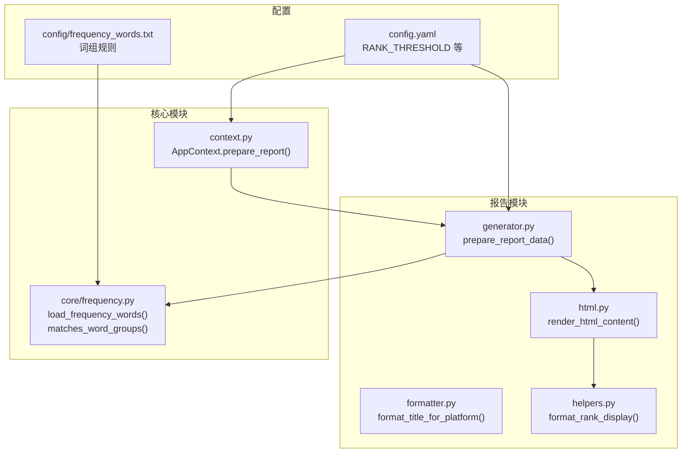
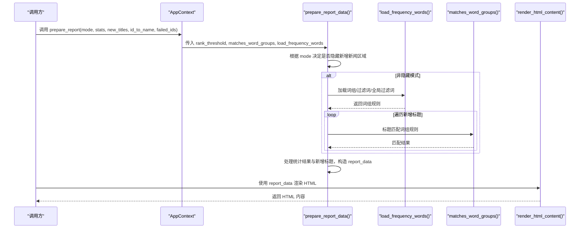
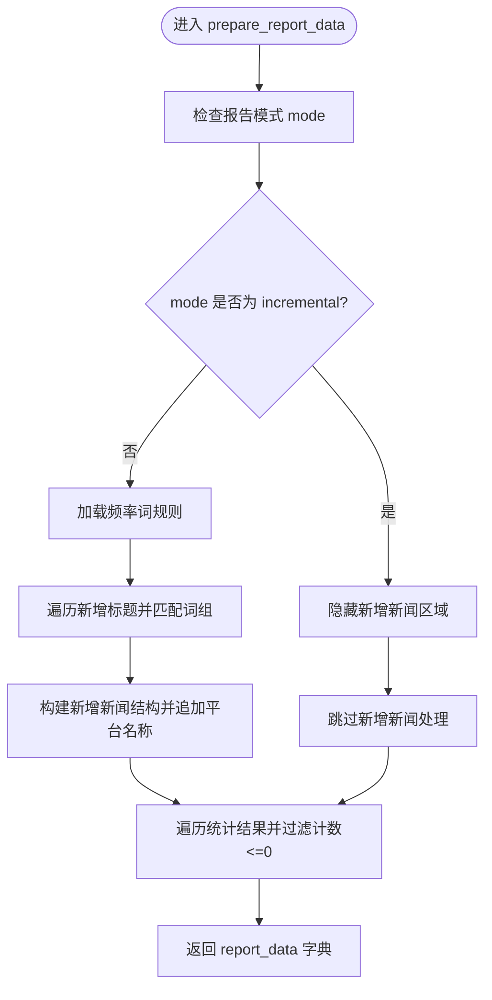
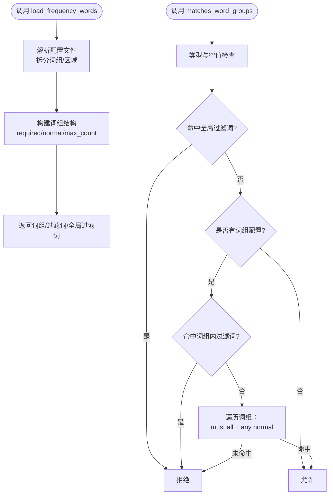
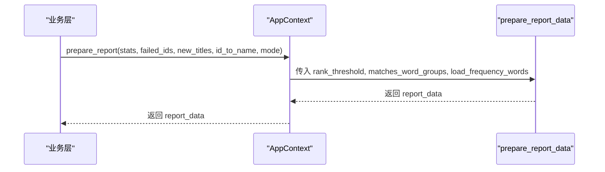
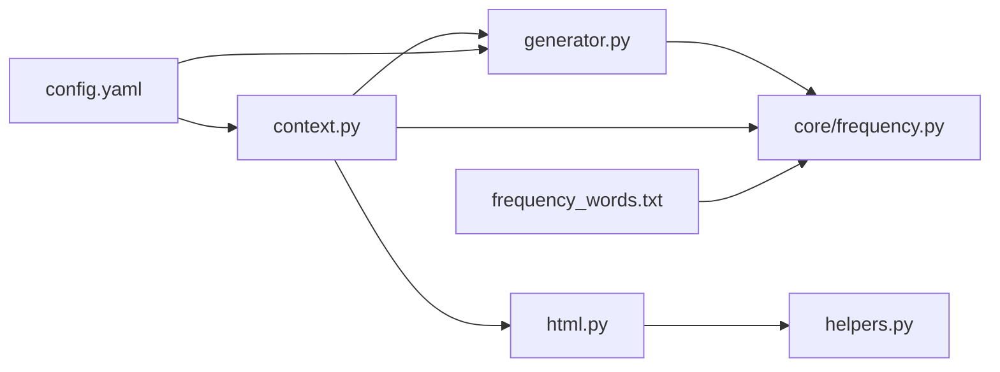

# 数据准备

<cite>
**本文引用的文件**
- [trendradar/report/generator.py](file://trendradar/report/generator.py)
- [trendradar/context.py](file://trendradar/context.py)
- [trendradar/core/frequency.py](file://trendradar/core/frequency.py)
- [trendradar/report/html.py](file://trendradar/report/html.py)
- [trendradar/report/helpers.py](file://trendradar/report/helpers.py)
- [config/config.yaml](file://config/config.yaml)
- [config/frequency_words.txt](file://config/frequency_words.txt)
</cite>

## 目录
1. [简介](#简介)
2. [项目结构](#项目结构)
3. [核心组件](#核心组件)
4. [架构总览](#架构总览)
5. [详细组件分析](#详细组件分析)
6. [依赖关系分析](#依赖关系分析)
7. [性能考量](#性能考量)
8. [故障排查指南](#故障排查指南)
9. [结论](#结论)

## 简介
本章节聚焦 TrendRadar 报告生成系统“数据准备”阶段，围绕 `prepare_report_data` 函数展开，系统性说明其如何处理统计结果、失败ID、新增标题等输入数据；解释报告模式（daily/incremental/current）如何影响“新增新闻区域”的显示；阐明 `matches_word_groups_func` 与 `load_frequency_words_func` 如何协同实现关键词过滤；并结合 `AppContext.prepare_report` 方法的调用示例，说明上下文参数如何传递以保证数据一致性。

## 项目结构
- 报告生成相关模块位于 `trendradar/report/`，包含数据准备、HTML 渲染、标题格式化等子模块。
- 关键词过滤与频率词配置位于 `trendradar/core/frequency.py`，并由配置文件 `config/frequency_words.txt` 提供词组规则。
- 应用上下文 `AppContext` 将配置、统计、报告生成等能力封装，便于在业务流程中统一调用。

图表来源
- [trendradar/report/generator.py](file://trendradar/report/generator.py#L13-L136)
- [trendradar/report/html.py](file://trendradar/report/html.py#L14-L234)
- [trendradar/report/helpers.py](file://trendradar/report/helpers.py#L65-L125)
- [trendradar/context.py](file://trendradar/context.py#L238-L256)
- [trendradar/core/frequency.py](file://trendradar/core/frequency.py#L18-L195)
- [config/config.yaml](file://config/config.yaml#L74-L81)
- [config/frequency_words.txt](file://config/frequency_words.txt#L1-L114)

章节来源
- [trendradar/report/generator.py](file://trendradar/report/generator.py#L13-L136)
- [trendradar/context.py](file://trendradar/context.py#L238-L256)
- [trendradar/core/frequency.py](file://trendradar/core/frequency.py#L18-L195)
- [config/config.yaml](file://config/config.yaml#L74-L81)
- [config/frequency_words.txt](file://config/frequency_words.txt#L1-L114)

## 核心组件
- `prepare_report_data(stats, failed_ids, new_titles, id_to_name, mode, rank_threshold, matches_word_groups_func, load_frequency_words_func)`
  - 输入：统计结果、失败ID、新增标题、平台映射、报告模式、排名阈值、关键词过滤函数、频率词加载函数
  - 输出：标准化后的报告数据字典（包含统计项、新增新闻、失败ID、新增总数）
- `AppContext.prepare_report(stats, failed_ids, new_titles, id_to_name, mode)`
  - 通过上下文统一注入 `rank_threshold`、`matches_word_groups`、`load_frequency_words`，确保数据一致性与可测试性
- `load_frequency_words()` 与 `matches_word_groups()`
  - 从配置文件解析词组规则，实现“必须词/过滤词/全局过滤/最大显示数”等语义匹配
- HTML 渲染与排名高亮
  - `render_html_content()` 根据 report_data 渲染页面，`format_rank_display()` 基于阈值进行高亮

章节来源
- [trendradar/report/generator.py](file://trendradar/report/generator.py#L13-L136)
- [trendradar/context.py](file://trendradar/context.py#L238-L256)
- [trendradar/core/frequency.py](file://trendradar/core/frequency.py#L18-L195)
- [trendradar/report/html.py](file://trendradar/report/html.py#L14-L234)
- [trendradar/report/helpers.py](file://trendradar/report/helpers.py#L65-L125)

## 架构总览
下图展示了从统计结果到最终报告数据的关键流转，以及关键词过滤与报告模式对“新增新闻区域”的影响。

图表来源
- [trendradar/context.py](file://trendradar/context.py#L238-L256)
- [trendradar/report/generator.py](file://trendradar/report/generator.py#L13-L136)
- [trendradar/core/frequency.py](file://trendradar/core/frequency.py#L18-L195)
- [trendradar/report/html.py](file://trendradar/report/html.py#L14-L234)

## 详细组件分析

### prepare_report_data 函数工作机制
- 输入与职责
  - stats：统计结果列表，每项包含关键词、计数、百分比、标题列表等
  - failed_ids：失败平台ID列表
  - new_titles：新增标题字典，按平台ID组织
  - id_to_name：平台ID到名称的映射
  - mode：报告模式（daily/incremental/current）
  - rank_threshold：排名阈值，用于高亮与显示逻辑
  - matches_word_groups_func/load_frequency_words_func：关键词过滤函数与频率词加载函数
- 新增新闻区域控制
  - 当 mode 为 "incremental" 时，隐藏新增新闻区域；其他模式显示
- 新增新闻过滤与组装
  - 若提供匹配函数与加载函数：先加载词组规则，再逐条标题匹配，仅保留匹配项
  - 若未提供：直接使用全部新增标题
  - 将新增标题转换为统一结构，附加平台名称、链接、排名阈值等字段
- 统计结果处理
  - 过滤计数不大于0的统计项
  - 将标题列表转换为统一结构，保留必要字段（标题、来源、时间、计数、排名、链接、是否新增）
- 输出
  - 返回包含 stats、new_titles、failed_ids、total_new_count 的字典

图表来源
- [trendradar/report/generator.py](file://trendradar/report/generator.py#L13-L136)

章节来源
- [trendradar/report/generator.py](file://trendradar/report/generator.py#L13-L136)

### 关键词过滤：matches_word_groups_func 与 load_frequency_words_func 协同
- load_frequency_words()
  - 从配置文件解析词组，支持：
    - 普通词组、必须词（+前缀）、过滤词（!前缀）、最大显示数（@前缀）
    - 全局过滤词区域（[GLOBAL_FILTER]）
  - 返回：词组列表、词组内过滤词、全局过滤词
- matches_word_groups()
  - 匹配优先级：
    1) 全局过滤词：若命中，直接排除
    2) 若无词组配置：默认匹配所有标题（允许显示全部新闻）
    3) 词组内过滤词：命中则排除
    4) 词组匹配：必须词全满足 + 普通词任一满足
- 在 prepare_report_data 中的使用
  - 仅当同时提供两个函数时，才会对新增标题进行过滤；否则直接保留全部新增标题
  - 过滤后打印“频率词过滤后”的匹配数量，便于与推送显示一致

图表来源
- [trendradar/core/frequency.py](file://trendradar/core/frequency.py#L18-L195)

章节来源
- [trendradar/core/frequency.py](file://trendradar/core/frequency.py#L18-L195)
- [trendradar/report/generator.py](file://trendradar/report/generator.py#L13-L136)
- [config/frequency_words.txt](file://config/frequency_words.txt#L1-L114)

### 报告模式与新增新闻区域
- daily：显示当日所有匹配新闻与新增新闻区域
- incremental：仅显示新增新闻，不显示常规统计区域；prepare_report_data 中通过 mode 判断隐藏新增新闻区域
- current：显示当前榜单匹配新闻与新增新闻区域

章节来源
- [trendradar/report/generator.py](file://trendradar/report/generator.py#L13-L136)
- [config/config.yaml](file://config/config.yaml#L59-L81)

### rank_threshold 参数的作用
- 作为“高亮阈值”，在多处影响显示：
  - HTML 渲染：新增新闻与统计新闻的排名高亮逻辑均基于该阈值
  - 排名显示：helpers.format_rank_display 会在最小排名小于等于阈值时采用高亮样式
  - 统计权重计算：在高级分析工具中，阈值参与“高排名次数占比”的计算
- 上下文参数传递
  - AppContext.rank_threshold 从配置读取默认值（如 5），prepare_report_data 的 rank_threshold 默认为 3，但通常通过上下文统一注入，确保全局一致

章节来源
- [trendradar/report/helpers.py](file://trendradar/report/helpers.py#L65-L125)
- [trendradar/report/html.py](file://trendradar/report/html.py#L545-L708)
- [trendradar/context.py](file://trendradar/context.py#L83-L87)
- [config/config.yaml](file://config/config.yaml#L74-L81)

### AppContext.prepare_report 调用示例与上下文参数传递
- AppContext.prepare_report 将以下参数统一注入 prepare_report_data：
  - stats、failed_ids、new_titles、id_to_name、mode
  - rank_threshold：来自 AppContext.rank_threshold（从配置读取）
  - matches_word_groups_func：AppContext.matches_word_groups
  - load_frequency_words_func：AppContext.load_frequency_words
- 优势
  - 消除全局状态依赖，提升可测试性
  - 统一阈值与过滤策略，避免跨模块不一致

图表来源
- [trendradar/context.py](file://trendradar/context.py#L238-L256)
- [trendradar/report/generator.py](file://trendradar/report/generator.py#L13-L136)

章节来源
- [trendradar/context.py](file://trendradar/context.py#L238-L256)

## 依赖关系分析
- 模块耦合
  - generator 依赖 core/frequency 的词组匹配与加载能力
  - context 将配置、统计、报告生成串联为统一入口
  - html/helpers 负责最终展示与高亮逻辑
- 外部依赖
  - 配置文件 config.yaml 提供 RANK_THRESHOLD、报告模式、排序策略等
  - 频率词配置 config/frequency_words.txt 提供关键词过滤规则

图表来源
- [trendradar/report/generator.py](file://trendradar/report/generator.py#L13-L136)
- [trendradar/context.py](file://trendradar/context.py#L238-L256)
- [trendradar/core/frequency.py](file://trendradar/core/frequency.py#L18-L195)
- [trendradar/report/html.py](file://trendradar/report/html.py#L14-L234)
- [trendradar/report/helpers.py](file://trendradar/report/helpers.py#L65-L125)
- [config/config.yaml](file://config/config.yaml#L74-L81)
- [config/frequency_words.txt](file://config/frequency_words.txt#L1-L114)

章节来源
- [trendradar/report/generator.py](file://trendradar/report/generator.py#L13-L136)
- [trendradar/context.py](file://trendradar/context.py#L238-L256)
- [trendradar/core/frequency.py](file://trendradar/core/frequency.py#L18-L195)
- [trendradar/report/html.py](file://trendradar/report/html.py#L14-L234)
- [trendradar/report/helpers.py](file://trendradar/report/helpers.py#L65-L125)
- [config/config.yaml](file://config/config.yaml#L74-L81)
- [config/frequency_words.txt](file://config/frequency_words.txt#L1-L114)

## 性能考量
- 新增新闻过滤
  - 在提供匹配函数与加载函数时，会对每条新增标题执行匹配，复杂度与标题数量线性相关
  - 建议在高频场景下缓存词组规则，减少重复解析开销
- 统计结果处理
  - 统计项计数不大于0时直接跳过，避免无效渲染
- 模式控制
  - incremental 模式下隐藏新增新闻区域，减少渲染与传输成本

[本节为通用指导，无需特定文件引用]

## 故障排查指南
- 新增新闻区域为空
  - 检查 mode 是否为 "incremental"
  - 确认是否提供了匹配函数与加载函数，以及频率词配置是否正确
- 过滤后匹配数异常
  - 查看频率词配置文件，确认是否误用全局过滤词或过滤词
  - 检查词组语法（必须词、过滤词、最大显示数）
- 排名高亮不符合预期
  - 检查配置中的 RANK_THRESHOLD 与上下文注入的 rank_threshold 是否一致
  - 确认 HTML 渲染时使用的阈值与 helpers.format_rank_display 的阈值一致

章节来源
- [trendradar/report/generator.py](file://trendradar/report/generator.py#L13-L136)
- [trendradar/core/frequency.py](file://trendradar/core/frequency.py#L18-L195)
- [trendradar/report/helpers.py](file://trendradar/report/helpers.py#L65-L125)
- [config/config.yaml](file://config/config.yaml#L74-L81)
- [config/frequency_words.txt](file://config/frequency_words.txt#L1-L114)

## 结论
- prepare_report_data 是报告数据准备的核心，负责将统计结果与新增标题标准化，并依据报告模式控制新增新闻区域的显示
- 关键词过滤通过 load_frequency_words 与 matches_word_groups 实现，支持必须词、过滤词、全局过滤与最大显示数等语义
- rank_threshold 在多处用于高亮与显示，应通过 AppContext 统一注入，确保全局一致性
- AppContext.prepare_report 将上下文参数统一注入 prepare_report_data，提升可维护性与可测试性