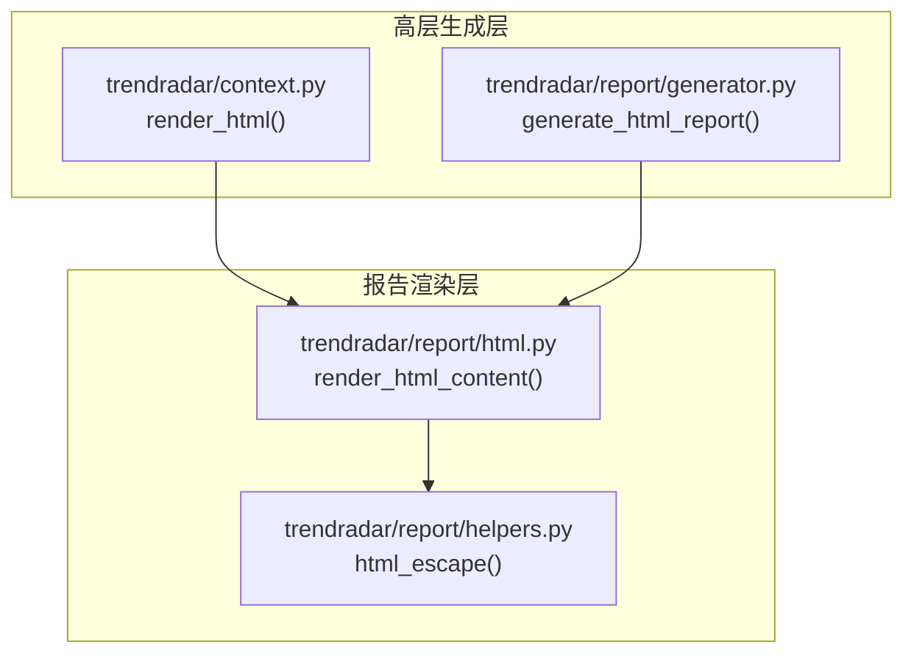
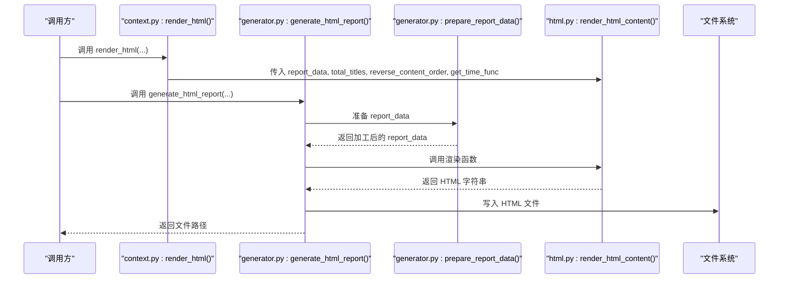
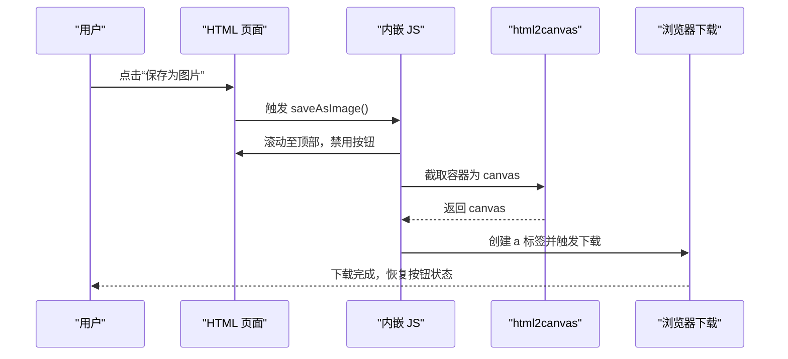
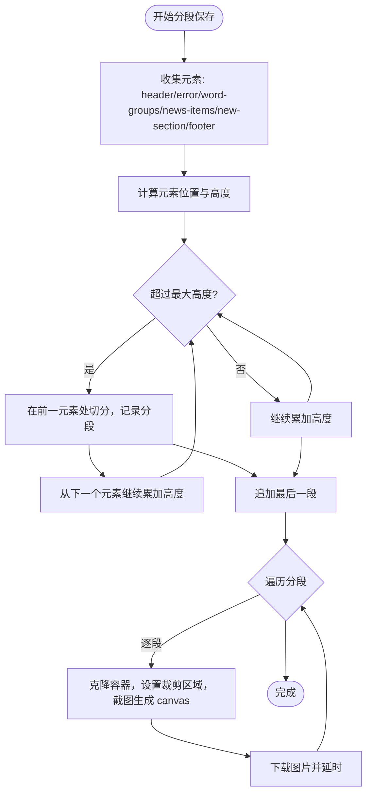
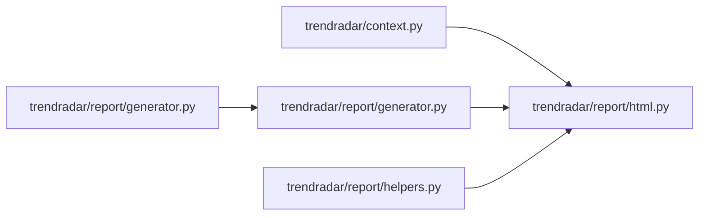

# 模板渲染

<cite>
**本文引用的文件**
- [trendradar/report/html.py](file://trendradar/report/html.py)
- [trendradar/report/helpers.py](file://trendradar/report/helpers.py)
- [trendradar/report/generator.py](file://trendradar/report/generator.py)
- [trendradar/context.py](file://trendradar/context.py)
</cite>

## 目录
1. [简介](#简介)
2. [项目结构](#项目结构)
3. [核心组件](#核心组件)
4. [架构总览](#架构总览)
5. [详细组件分析](#详细组件分析)
6. [依赖关系分析](#依赖关系分析)
7. [性能考量](#性能考量)
8. [故障排查指南](#故障排查指南)
9. [结论](#结论)

## 简介
本文件聚焦于 TrendRadar 报告生成系统中“模板渲染阶段”的实现，围绕 render_html_content 函数展开，系统性说明其如何将 report_data、total_titles 等参数与 HTML/CSS/JS 结合，生成美观的响应式网页报告。文档覆盖报告头部（报告类型、新闻总数、热点新闻数、生成时间）、内容主体（错误信息、热点词汇统计列表、新增热点）、页脚（项目信息与更新提示），并深入解析 reverse_content_order 和 get_time_func 参数对内容排序与时间显示的影响；同时剖析内嵌 JavaScript 如何实现“保存为图片”和“分段保存”功能。

## 项目结构
- 模块划分清晰：报告生成与渲染分离，渲染逻辑集中在 html.py，辅助工具在 helpers.py，高层生成流程在 generator.py，上下文桥接在 context.py。
- 渲染入口：context.py 的 render_html 方法将配置与时间函数注入到 render_html_content，形成最终 HTML。

图表来源
- [trendradar/report/html.py](file://trendradar/report/html.py#L1-L120)
- [trendradar/report/helpers.py](file://trendradar/report/helpers.py#L34-L60)
- [trendradar/report/generator.py](file://trendradar/report/generator.py#L140-L236)
- [trendradar/context.py](file://trendradar/context.py#L289-L307)

章节来源
- [trendradar/report/html.py](file://trendradar/report/html.py#L1-L120)
- [trendradar/report/generator.py](file://trendradar/report/generator.py#L140-L236)
- [trendradar/context.py](file://trendradar/context.py#L289-L307)

## 核心组件
- render_html_content：负责拼装 HTML 页面骨架、填充头部信息、渲染内容主体与页脚，并内嵌 JS 实现截图保存功能。
- html_escape：提供安全的 HTML 转义，防止 XSS 与标签误解析。
- generate_html_report：高层生成器，准备 report_data 并调用渲染函数写入文件。
- render_html：上下文桥接方法，注入 reverse_content_order 与 get_time_func，调用渲染函数。

章节来源
- [trendradar/report/html.py](file://trendradar/report/html.py#L14-L120)
- [trendradar/report/helpers.py](file://trendradar/report/helpers.py#L34-L60)
- [trendradar/report/generator.py](file://trendradar/report/generator.py#L140-L236)
- [trendradar/context.py](file://trendradar/context.py#L289-L307)

## 架构总览
从输入到输出的关键流程如下：
- 输入：stats、failed_ids、new_titles、id_to_name、mode、rank_threshold、is_daily_summary、update_info、total_titles 等。
- 数据准备：prepare_report_data 过滤与加工，统一字段结构，计算 total_new_count。
- 渲染：render_html_content 按模板拼装 HTML，内嵌样式与脚本。
- 写入：generate_html_report 将 HTML 写入目标文件，必要时复制到根目录以适配静态托管。

图表来源
- [trendradar/context.py](file://trendradar/context.py#L289-L307)
- [trendradar/report/generator.py](file://trendradar/report/generator.py#L140-L236)
- [trendradar/report/html.py](file://trendradar/report/html.py#L14-L120)

## 详细组件分析

### render_html_content 函数详解
- 功能定位：将 report_data 与元信息整合为完整 HTML，包含头部、内容区、页脚与内嵌 JS。
- 关键参数：
  - report_data：包含 stats、new_titles、failed_ids、total_new_count。
  - total_titles：新闻总数。
  - is_daily_summary、mode：控制报告类型显示与文件命名策略。
  - update_info：可选，用于页脚展示更新提示。
  - reverse_content_order：控制内容顺序（新增热点在前/默认统计在前）。
  - get_time_func：获取时间的回调，默认使用当前时间。
- 输出：完整的 HTML 字符串。

章节来源
- [trendradar/report/html.py](file://trendradar/report/html.py#L14-L120)

#### 报告头部构建
- 报告类型：根据 is_daily_summary 与 mode 显示“当日汇总/当前榜单/增量模式/实时分析”。
- 新闻总数：直接展示 total_titles。
- 热点新闻数：通过统计各词组下标题数量之和计算。
- 生成时间：优先使用 get_time_func，否则使用默认时间；格式化为“月-日 时:分”。

章节来源
- [trendradar/report/html.py](file://trendradar/report/html.py#L482-L524)

#### 内容主体构建
- 错误信息区：当 report_data["failed_ids"] 存在时，渲染“请求失败的平台”列表，使用 html_escape 转义。
- 热点词汇统计区：
  - 词组循环：为每个词组渲染 word-header（词名、计数、序号）与多条新闻项。
  - 新闻项：包含序号、来源、排名（top/high/普通）、时间显示（简化格式）、出现次数、标题链接。
  - 热度等级：根据 count 判定 hot/warm。
- 新增热点区（非增量模式）：
  - 按来源分组，展示来源名与条数，逐条显示排名与标题链接。
  - total_new_count 用于页脚标题提示。

章节来源
- [trendradar/report/html.py](file://trendradar/report/html.py#L532-L707)

#### 内容顺序控制
- reverse_content_order 为真：先新增热点，再热点统计。
- 默认：先热点统计，再新增热点。

章节来源
- [trendradar/report/html.py](file://trendradar/report/html.py#L709-L715)

#### 页脚构建
- 固定内容：由 TrendRadar 生成，附带项目链接。
- 可选更新提示：当 update_info 存在时，显示远程版本与当前版本对比。

章节来源
- [trendradar/report/html.py](file://trendradar/report/html.py#L719-L736)

#### JavaScript 脚本与交互
- 依赖库：通过 CDN 引入 html2canvas。
- 保存为图片：
  - 点击后滚动至顶部，短暂延迟，隐藏保存按钮，截图容器，生成 canvas，下载 PNG。
  - 成功/失败反馈与按钮状态恢复。
- 分段保存：
  - 计算容器内关键元素（header/error/new-section/footer、word-group/news-item）的位置与高度。
  - 按最大高度阈值进行分段，逐段生成图片并批量下载。
  - 支持进度反馈与异常兜底。

图表来源
- [trendradar/report/html.py](file://trendradar/report/html.py#L739-L808)

图表来源
- [trendradar/report/html.py](file://trendradar/report/html.py#L811-L1040)

### 参数与行为影响

- reverse_content_order
  - 影响内容顺序：新增热点在前或默认统计在前。
  - 适用场景：优先展示最新变化或优先展示整体统计。

- get_time_func
  - 控制生成时间来源：可注入自定义时间函数（如上下文中的 get_time）。
  - 作用：统一时间显示来源，便于测试与一致性。

章节来源
- [trendradar/context.py](file://trendradar/context.py#L289-L307)
- [trendradar/report/html.py](file://trendradar/report/html.py#L517-L524)

### 数据结构与复杂度
- report_data 结构要点
  - stats：列表，每项含 word、count、percentage、titles。
  - titles：列表，每项含 title、source_name、time_display、count、ranks、rank_threshold、url/mobile_url、is_new。
  - new_titles：按来源分组的新增标题集合。
  - failed_ids：失败平台 ID 列表。
  - total_new_count：新增标题总数。
- 复杂度分析
  - 渲染时间复杂度近似 O(N + M)，N 为词组数，M 为新闻总数。
  - JS 截图复杂度取决于 DOM 结构与图片尺寸，受分段策略影响。

章节来源
- [trendradar/report/generator.py](file://trendradar/report/generator.py#L14-L138)
- [trendradar/report/html.py](file://trendradar/report/html.py#L544-L707)

## 依赖关系分析

图表来源
- [trendradar/context.py](file://trendradar/context.py#L289-L307)
- [trendradar/report/html.py](file://trendradar/report/html.py#L1-L120)
- [trendradar/report/helpers.py](file://trendradar/report/helpers.py#L34-L60)
- [trendradar/report/generator.py](file://trendradar/report/generator.py#L140-L236)

## 性能考量
- 截图性能
  - html2canvas 在大尺寸或复杂 DOM 上耗时较长，建议控制容器宽度与内容层级。
  - 分段保存通过 maxHeight 阈值拆分，降低单次截图内存占用与超时风险。
- DOM 更新与可见性
  - 保存前隐藏按钮与额外布局调整，减少截图干扰。
- 文件写入
  - 生成器写入文件为同步操作，建议在后台任务中执行，避免阻塞主线程。

## 故障排查指南
- 保存失败
  - JS 捕获异常并恢复按钮状态，检查网络与 html2canvas 版本兼容性。
  - 若跨域资源导致失败，确认 CORS 设置与 useCORS 配置。
- 内容顺序不符合预期
  - 检查 reverse_content_order 配置是否正确传递。
- 时间显示不一致
  - 确认 get_time_func 返回值与时区设置。
- 新增热点区域缺失
  - 增量模式下默认隐藏新增热点区，检查 mode 与配置。

章节来源
- [trendradar/report/html.py](file://trendradar/report/html.py#L739-L808)
- [trendradar/report/html.py](file://trendradar/report/html.py#L811-L1040)
- [trendradar/context.py](file://trendradar/context.py#L289-L307)

## 结论
render_html_content 将结构化的 report_data 与丰富的 UI 组件（头部、统计列表、新增热点、页脚）有机结合，并通过内嵌 JS 提供一键截图能力。通过 reverse_content_order 与 get_time_func，系统实现了灵活的内容排序与时间显示策略。配合 generate_html_report 的文件落盘与上下文桥接，形成从数据到静态网页的完整闭环。