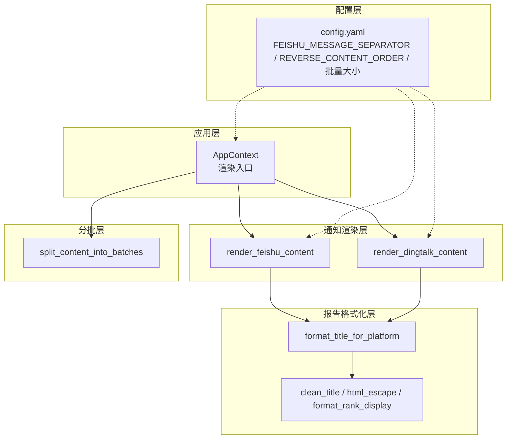
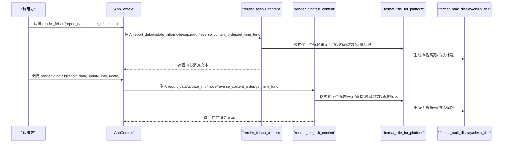
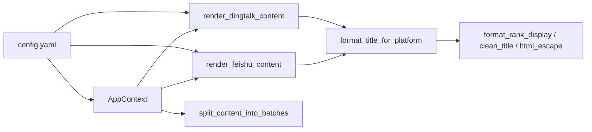

# 内容渲染

<cite>
**本文引用的文件**
- [context.py](file://trendradar/context.py)
- [renderer.py](file://trendradar/notification/renderer.py)
- [formatter.py](file://trendradar/report/formatter.py)
- [helpers.py](file://trendradar/report/helpers.py)
- [config.yaml](file://config/config.yaml)
- [splitter.py](file://trendradar/notification/splitter.py)
</cite>

## 目录
1. [简介](#简介)
2. [项目结构](#项目结构)
3. [核心组件](#核心组件)
4. [架构总览](#架构总览)
5. [详细组件分析](#详细组件分析)
6. [依赖关系分析](#依赖关系分析)
7. [性能考量](#性能考量)
8. [故障排查指南](#故障排查指南)
9. [结论](#结论)

## 简介
本文件聚焦于 TrendRadar 通知内容渲染，系统性阐述 AppContext 中的 render_feishu 与 render_dingtalk 方法，以及底层渲染器 render_feishu_content 与 render_dingtalk_content 的实现细节。文档将解释：
- 如何基于报告数据生成符合飞书与钉钉格式规范的消息内容；
- 飞书与钉钉在消息样式（颜色标记、图标使用、分隔符）上的差异处理；
- reverse_content_order 配置对内容顺序的影响；
- 标题统计部分与新增新闻部分的渲染逻辑，包括热度等级的视觉区分（🔥、📈、📌）与平台来源标识；
- 失败平台信息的渲染方式；
- 版本更新提示的集成机制。

## 项目结构
围绕通知内容渲染的关键文件与职责如下：
- trendradar/context.py：应用上下文，提供 render_feishu/render_dingtalk 便捷入口，并透传配置项（如分隔符、内容顺序、时间函数等）给渲染器。
- trendradar/notification/renderer.py：平台特定渲染器，分别实现 render_feishu_content 与 render_dingtalk_content 的完整消息拼装逻辑。
- trendradar/report/formatter.py：标题格式化工具，按平台生成统一的标题字符串（含来源、链接、时间、热度次数、新增标记等）。
- trendradar/report/helpers.py：报告辅助函数，负责清洗标题、HTML 转义、排名高亮格式化等。
- config/config.yaml：全局配置，包含 FEISHU_MESSAGE_SEPARATOR、REVERSE_CONTENT_ORDER、各平台批量大小等。
- trendradar/notification/splitter.py：消息分批处理模块，提供跨平台分批策略与批次头部预留，供 AppContext.split_content 调用。

图表来源
- [context.py](file://trendradar/context.py#L308-L366)
- [renderer.py](file://trendradar/notification/renderer.py#L1-L261)
- [formatter.py](file://trendradar/report/formatter.py#L1-L224)
- [helpers.py](file://trendradar/report/helpers.py#L1-L126)
- [config.yaml](file://config/config.yaml#L80-L110)
- [splitter.py](file://trendradar/notification/splitter.py#L1-L120)

章节来源
- [context.py](file://trendradar/context.py#L308-L366)
- [renderer.py](file://trendradar/notification/renderer.py#L1-L261)
- [formatter.py](file://trendradar/report/formatter.py#L1-L224)
- [helpers.py](file://trendradar/report/helpers.py#L1-L126)
- [config.yaml](file://config/config.yaml#L80-L110)
- [splitter.py](file://trendradar/notification/splitter.py#L1-L120)

## 核心组件
- AppContext.render_feishu：调用 render_feishu_content，注入分隔符、内容顺序与时间函数，返回飞书消息文本。
- AppContext.render_dingtalk：调用 render_dingtalk_content，注入内容顺序与时间函数，返回钉钉消息文本。
- render_feishu_content：按飞书格式规范拼装“热点词汇统计”“新增热点新闻”“失败平台”与时间/版本提示。
- render_dingtalk_content：按钉钉格式规范拼装“头部信息”“热点词汇统计”“新增热点新闻”“失败平台”与时间/版本提示。
- format_title_for_platform：按平台差异化格式化标题（来源、链接、时间、次数、新增标记、排名高亮）。
- format_rank_display：按平台选择高亮样式，生成排名区间字符串。
- split_content_into_batches：跨平台分批策略，保证批次大小与原子性（词组标题+第一条新闻、来源标题+第一条新闻）。

章节来源
- [context.py](file://trendradar/context.py#L308-L366)
- [renderer.py](file://trendradar/notification/renderer.py#L1-L261)
- [formatter.py](file://trendradar/report/formatter.py#L1-L224)
- [helpers.py](file://trendradar/report/helpers.py#L62-L126)
- [splitter.py](file://trendradar/notification/splitter.py#L23-L120)

## 架构总览
下图展示从 AppContext 到渲染器再到格式化工具的整体调用链路，以及配置参数对渲染行为的影响。

图表来源
- [context.py](file://trendradar/context.py#L308-L366)
- [renderer.py](file://trendradar/notification/renderer.py#L1-L261)
- [formatter.py](file://trendradar/report/formatter.py#L1-L224)
- [helpers.py](file://trendradar/report/helpers.py#L62-L126)

## 详细组件分析

### AppContext.render_feishu 与 AppContext.render_dingtalk
- render_feishu：读取 FEISHU_MESSAGE_SEPARATOR 作为分隔符，透传 REVERSE_CONTENT_ORDER 与 get_time_func，调用 render_feishu_content 生成文本。
- render_dingtalk：透传 REVERSE_CONTENT_ORDER 与 get_time_func，调用 render_dingtalk_content 生成文本。
- split_content：基于配置的 DINGTALK_BATCH_SIZE/FEISHU_BATCH_SIZE/default，结合 feishu_separator 与 reverse_content_order，将长文本拆分为若干批次，确保各平台字节限制与原子性。

章节来源
- [context.py](file://trendradar/context.py#L308-L366)
- [config.yaml](file://config/config.yaml#L80-L110)

### render_feishu_content 实现要点
- 热点词汇统计部分
  - 标题：使用“📊 热点词汇统计”。
  - 每个词组包含热度等级图标（🔥≥10、📈≥5、📌<5），并以序列号标注顺序。
  - 使用 HTML 颜色标签对词组计数进行强调（红色/橙色）。
  - 每个词组下依次列出标题，通过 format_title_for_platform 按飞书格式渲染（来源、链接、时间、次数、新增标记、排名高亮）。
  - 词组之间使用 FEISHU_MESSAGE_SEPARATOR 作为分隔符。
- 新增热点新闻部分
  - 标题：使用“🆕 本次新增热点新闻”，并显示总数。
  - 按来源聚合，每个来源下列出标题；为避免重复标记“新增”，复制标题数据并清空 is_new 标记后再渲染。
  - 使用“---”作为来源之间的分隔符。
- 内容顺序
  - 若 reverse_content_order 为真：新增热点在前，热点统计在后；否则相反。
- 失败平台信息
  - 若存在 failed_ids，渲染“⚠️ 数据获取失败的平台”，并在每行使用红色强调失败平台 ID。
- 时间与版本提示
  - 在文本末尾追加“更新时间：YYYY-MM-DD HH:MM:SS”的灰色提示。
  - 若 update_info 存在，追加“发现新版本 remote_version，当前 current_version”的灰色提示。

章节来源
- [renderer.py](file://trendradar/notification/renderer.py#L14-L135)
- [formatter.py](file://trendradar/report/formatter.py#L52-L72)
- [helpers.py](file://trendradar/report/helpers.py#L62-L126)
- [config.yaml](file://config/config.yaml#L90-L110)

### render_dingtalk_content 实现要点
- 头部信息
  - 包含“总新闻数”“时间”“类型：热点分析报告”，并以“---”分隔。
- 热点词汇统计部分
  - 标题：使用“📊 热点词汇统计”。
  - 热度等级图标与计数采用粗体强调；词组间同样使用“---”分隔。
  - 标题渲染通过 format_title_for_platform 按钉钉格式渲染（来源、链接、时间、次数、新增标记、排名高亮）。
- 新增热点新闻部分
  - 标题：使用“🆕 本次新增热点新闻”，并显示总数。
  - 按来源聚合，每个来源下列出标题；同样清空 is_new 标记后渲染。
- 内容顺序
  - 若 reverse_content_order 为真：新增热点在前，热点统计在后；否则相反。
- 失败平台信息
  - 若存在 failed_ids，渲染“⚠️ 数据获取失败的平台”，并在每行使用粗体强调失败平台 ID。
- 时间与版本提示
  - 在文本末尾追加“更新时间：YYYY-MM-DD HH:MM:SS”的引用样式提示。
  - 若 update_info 存在，追加“发现新版本 remote_version，当前 current_version”的粗体提示。

章节来源
- [renderer.py](file://trendradar/notification/renderer.py#L137-L261)
- [formatter.py](file://trendradar/report/formatter.py#L74-L94)
- [helpers.py](file://trendradar/report/helpers.py#L62-L126)
- [config.yaml](file://config/config.yaml#L90-L110)

### 标题格式化与排名高亮
- format_title_for_platform
  - 飞书：使用 HTML 颜色标签包裹来源、时间、次数等；新增标题前缀“🆕”；排名高亮采用 HTML 颜色标签与粗体组合。
  - 钉钉：使用普通粗体包裹来源、时间、次数等；新增标题前缀“🆕”；排名高亮采用粗体。
  - 其他平台：采用各自平台的强调方式（如 Telegram 使用 <b>/<code>，Slack 使用 * 等）。
- format_rank_display
  - 根据平台类型选择不同的高亮起止标记（HTML/飞书/钉钉/企业微信/Telegram/Slack/默认 markdown）。
  - 当最小排名 ≤ rank_threshold 时，使用高亮标记包裹排名区间；否则仅显示普通区间。

章节来源
- [formatter.py](file://trendradar/report/formatter.py#L1-L224)
- [helpers.py](file://trendradar/report/helpers.py#L62-L126)

### 内容顺序与分隔符
- reverse_content_order
  - 飞书与钉钉渲染器均支持该配置，控制“新增热点新闻”与“热点词汇统计”的前后顺序。
- 分隔符
  - 飞书：使用 FEISHU_MESSAGE_SEPARATOR（默认为长横线）作为词组间分隔符。
  - 钉钉：使用“---”作为词组间与来源间分隔符。
- 分批策略
  - split_content_into_batches 提供跨平台分批能力，确保“词组标题+第一条新闻”“来源标题+第一条新闻”的原子性，避免截断破坏完整性；同时按平台字节上限进行安全截断与批次头部预留。

章节来源
- [renderer.py](file://trendradar/notification/renderer.py#L1-L261)
- [splitter.py](file://trendradar/notification/splitter.py#L23-L120)
- [config.yaml](file://config/config.yaml#L90-L110)

### 失败平台信息与版本更新提示
- 失败平台信息
  - 飞书：使用红色强调失败平台 ID。
  - 钉钉：使用粗体强调失败平台 ID。
- 版本更新提示
  - 飞书与钉钉均在文本末尾追加版本提示；若 update_info 缺失则不显示。

章节来源
- [renderer.py](file://trendradar/notification/renderer.py#L1-L261)

## 依赖关系分析
- AppContext 依赖渲染器与分批模块，通过配置项驱动渲染与分批行为。
- 渲染器依赖标题格式化与报告辅助函数，确保跨平台一致性与可读性。
- 配置文件提供分隔符、内容顺序、批量大小等关键参数，贯穿渲染与分批流程。

图表来源
- [context.py](file://trendradar/context.py#L308-L366)
- [renderer.py](file://trendradar/notification/renderer.py#L1-L261)
- [formatter.py](file://trendradar/report/formatter.py#L1-L224)
- [helpers.py](file://trendradar/report/helpers.py#L1-L126)
- [config.yaml](file://config/config.yaml#L80-L110)
- [splitter.py](file://trendradar/notification/splitter.py#L1-L120)

## 性能考量
- 字节安全截断：分批模块使用 truncate_to_bytes 与 get_max_batch_header_size 预留头部空间，避免多字节字符截断导致的乱码。
- 原子性保障：分批策略确保“词组标题+第一条新闻”“来源标题+第一条新闻”作为一个整体进入批次，减少重复内容与提升可读性。
- 批次大小配置：不同平台设置不同上限（如飞书 29000 字节、钉钉 20000 字节），避免触发平台限制。
- 时间函数注入：通过 get_time_func 注入时间函数，便于测试与统一时区显示。

章节来源
- [splitter.py](file://trendradar/notification/splitter.py#L50-L120)
- [context.py](file://trendradar/context.py#L341-L366)
- [config.yaml](file://config/config.yaml#L80-L110)

## 故障排查指南
- 飞书/钉钉消息过长
  - 检查 FEISHU_MESSAGE_SEPARATOR 与 REVERSE_CONTENT_ORDER 配置是否合理；必要时降低每词组/来源的新闻数量或调整分隔符长度。
  - 确认 FEISHU_BATCH_SIZE/DINGTALK_BATCH_SIZE 配置未被意外修改。
- 标题显示异常
  - 确认 format_title_for_platform 的 show_source 参数与 is_new 标记是否按预期传递；检查 clean_title 是否正确清洗标题。
- 排名高亮不生效
  - 检查 rank_threshold 与 format_rank_display 的平台高亮样式配置；确认 ranks 列表非空。
- 版本提示未显示
  - 确认 update_info 是否传入；检查 app.show_version_update 是否为 true。

章节来源
- [renderer.py](file://trendradar/notification/renderer.py#L1-L261)
- [formatter.py](file://trendradar/report/formatter.py#L1-L224)
- [helpers.py](file://trendradar/report/helpers.py#L62-L126)
- [config.yaml](file://config/config.yaml#L1-L20)

## 结论
- render_feishu_content 与 render_dingtalk_content 通过统一的标题格式化与报告辅助函数，实现了跨平台一致的渲染体验。
- 飞书与钉钉在颜色、强调与分隔符上存在差异，但通过平台分支与配置项实现了清晰的差异化呈现。
- reverse_content_order 与 FEISHU_MESSAGE_SEPARATOR 等配置项提供了灵活的内容组织方式，满足不同团队的阅读偏好。
- 分批策略与字节安全截断确保了长文本在各平台的稳定传输与可读性。
- 版本更新提示与失败平台信息增强了可观测性与问题定位效率。