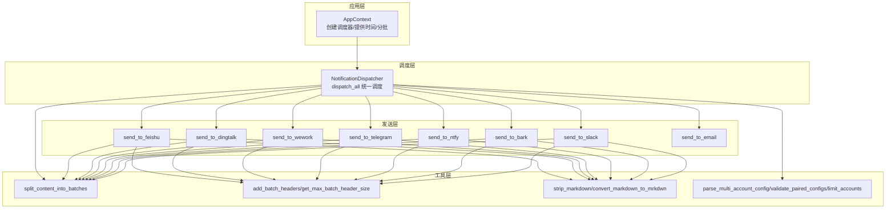
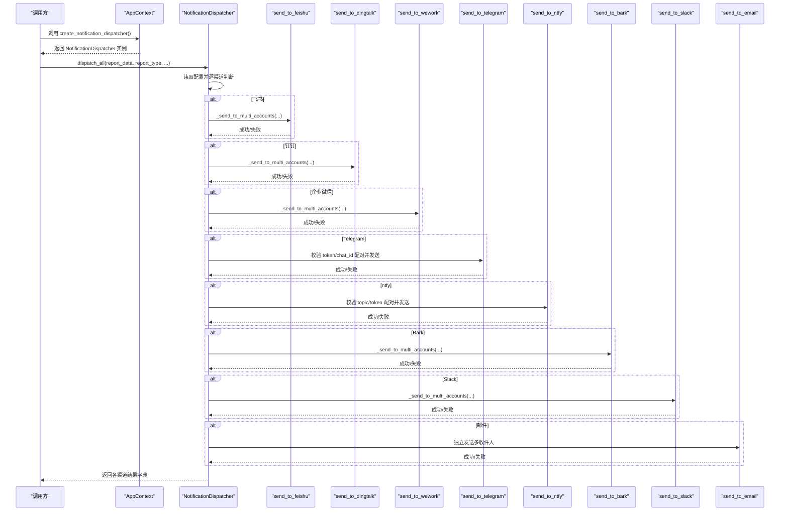
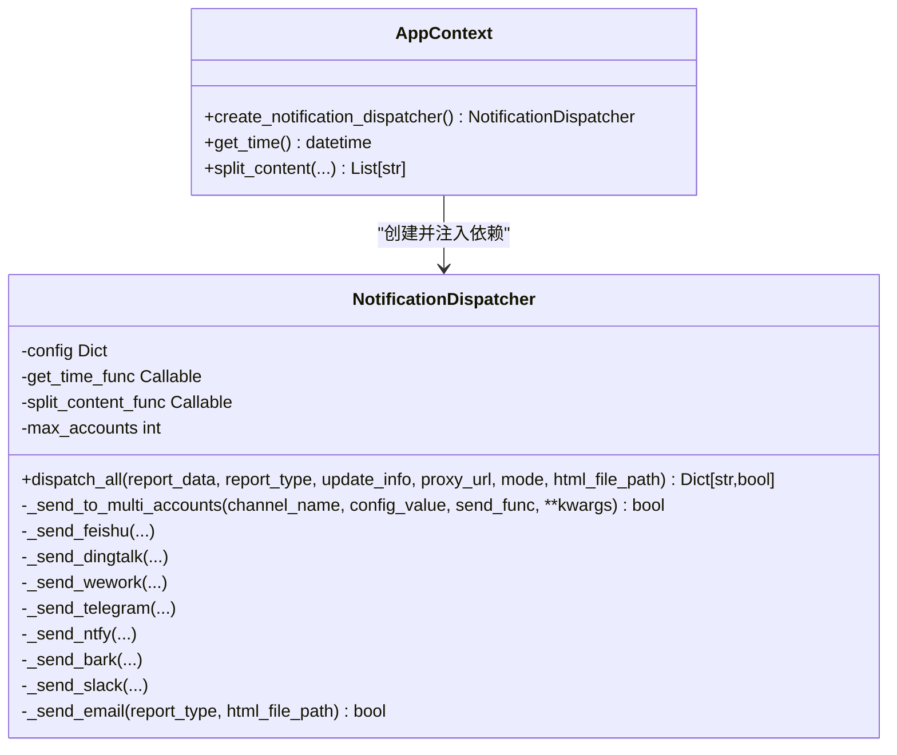
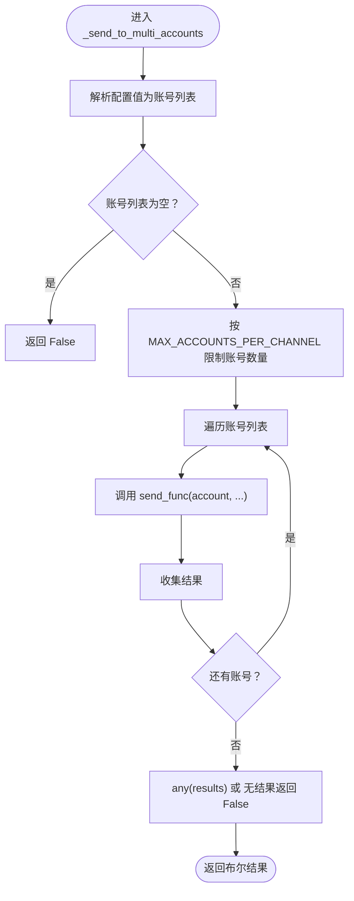
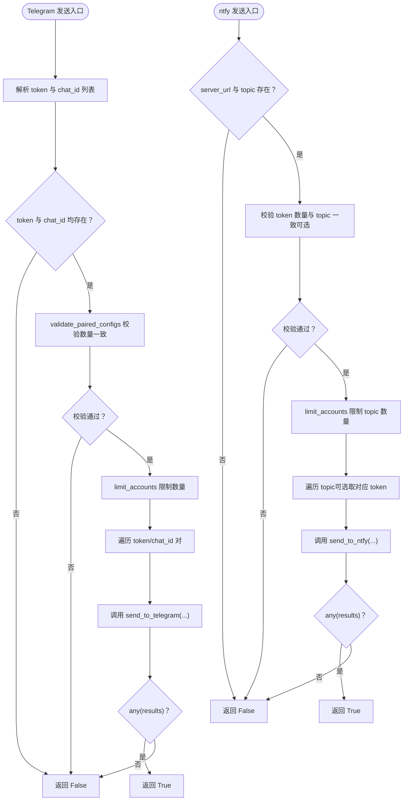
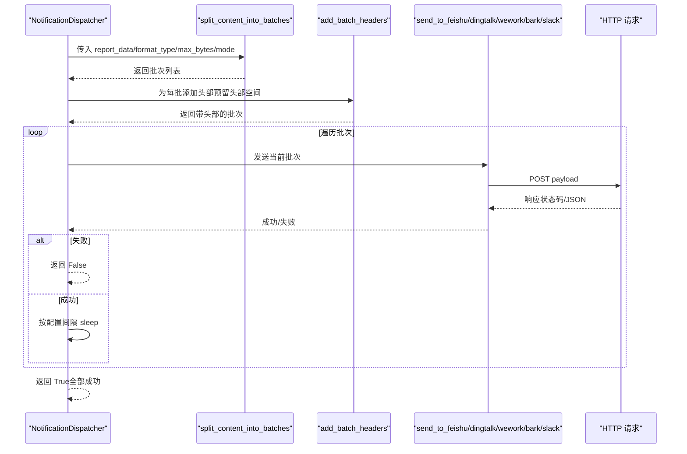
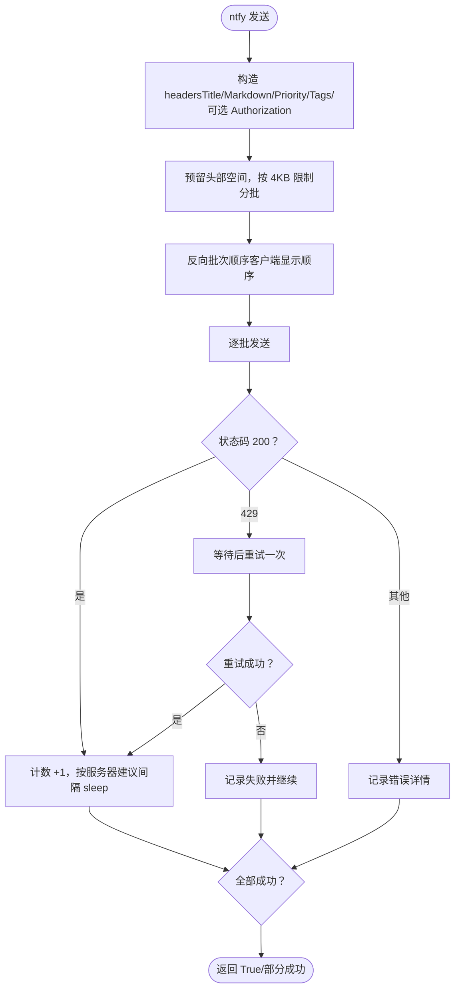
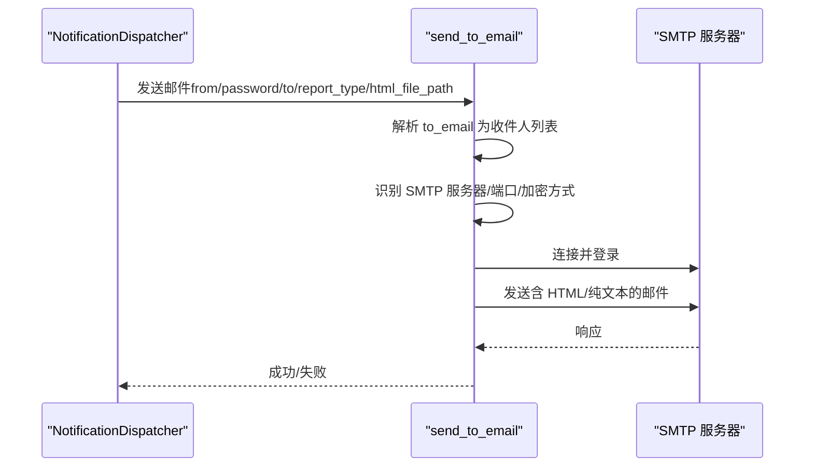
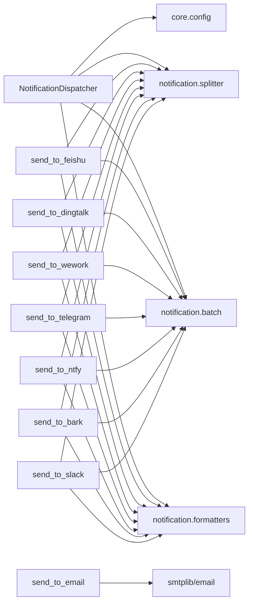

# 推送调度

<cite>
**本文引用的文件**
- [context.py](file://trendradar/context.py)
- [dispatcher.py](file://trendradar/notification/dispatcher.py)
- [senders.py](file://trendradar/notification/senders.py)
- [config.py](file://trendradar/core/config.py)
- [batch.py](file://trendradar/notification/batch.py)
- [formatters.py](file://trendradar/notification/formatters.py)
- [splitter.py](file://trendradar/notification/splitter.py)
- [config.yaml](file://config/config.yaml)
- [push_manager.py](file://trendradar/notification/push_manager.py)
</cite>

## 目录
1. [简介](#简介)
2. [项目结构](#项目结构)
3. [核心组件](#核心组件)
4. [架构总览](#架构总览)
5. [详细组件分析](#详细组件分析)
6. [依赖关系分析](#依赖关系分析)
7. [性能考量](#性能考量)
8. [故障排查指南](#故障排查指南)
9. [结论](#结论)

## 简介
本文件围绕 TrendRadar 的推送调度机制展开，重点说明以下内容：
- AppContext 如何创建 NotificationDispatcher 实例
- NotificationDispatcher 的统一调度入口 dispatch_all 如何协调各渠道推送
- 多账号支持机制：分号分隔多个 Webhook URL，以及 MAX_ACCOUNTS_PER_CHANNEL 的限制
- 通用发送逻辑 _send_to_multi_accounts 的实现思路
- 针对飞书、钉钉、Telegram、ntfy、邮件等渠道的差异化发送流程
- Telegram/ntfy 等需要配对验证的渠道（bot_token 与 chat_id、topic 与 token）处理方式
- 邮件渠道的独立发送逻辑与多收件人支持

## 项目结构
推送相关代码主要分布在以下模块：
- 应用上下文：负责创建调度器与提供时间、内容分批等辅助能力
- 通知调度器：统一调度各渠道，内置多账号解析、配对校验与批量发送
- 发送器：各平台具体发送实现，含分批、头部拼接、超限处理、重试策略等
- 工具模块：多账号解析、配对校验、账号数量限制、内容分批与格式转换
- 配置：集中定义各渠道开关、批次大小、时间窗口、多账号上限等

图表来源
- [context.py](file://trendradar/context.py#L368-L374)
- [dispatcher.py](file://trendradar/notification/dispatcher.py#L61-L137)
- [senders.py](file://trendradar/notification/senders.py#L61-L168)
- [splitter.py](file://trendradar/notification/splitter.py#L23-L112)
- [batch.py](file://trendradar/notification/batch.py#L11-L116)
- [formatters.py](file://trendradar/notification/formatters.py#L11-L81)
- [config.py](file://trendradar/core/config.py#L11-L153)

章节来源
- [context.py](file://trendradar/context.py#L368-L374)
- [dispatcher.py](file://trendradar/notification/dispatcher.py#L61-L137)

## 核心组件
- AppContext.create_notification_dispatcher：基于配置创建 NotificationDispatcher，注入时间函数与内容分批函数，供上层调用。
- NotificationDispatcher.dispatch_all：统一入口，按配置依次尝试各渠道；对需要配对验证的渠道进行配对校验；对多账号渠道使用通用逻辑进行账号遍历与限制。
- 通用发送逻辑 _send_to_multi_accounts：解析分号分隔的多账号配置，限制最大账号数，循环调用具体发送函数，任一账号成功即视为整体成功。
- 各渠道发送器：send_to_feishu/send_to_dingtalk/send_to_wework/send_to_telegram/send_to_ntfy/send_to_bark/send_to_slack/send_to_email，分别实现平台差异化的 payload 构造、分批、头部拼接、超限与重试策略。

章节来源
- [context.py](file://trendradar/context.py#L368-L374)
- [dispatcher.py](file://trendradar/notification/dispatcher.py#L138-L171)
- [senders.py](file://trendradar/notification/senders.py#L61-L168)

## 架构总览
下图展示从 AppContext 创建调度器到各渠道发送的整体流程，以及关键依赖关系。

图表来源
- [context.py](file://trendradar/context.py#L368-L374)
- [dispatcher.py](file://trendradar/notification/dispatcher.py#L61-L137)
- [senders.py](file://trendradar/notification/senders.py#L474-L628)

## 详细组件分析

### AppContext.create_notification_dispatcher 与 NotificationDispatcher
- AppContext.create_notification_dispatcher：将配置、时间函数、内容分批函数注入到 NotificationDispatcher，便于后续统一调度。
- NotificationDispatcher.__init__：保存配置、时间函数、分批函数，并读取 MAX_ACCOUNTS_PER_CHANNEL 作为账号上限。
- NotificationDispatcher.dispatch_all：按顺序检查各渠道配置是否存在，存在则调用对应 _send_* 方法；最终返回每个渠道的发送结果布尔值。

图表来源
- [context.py](file://trendradar/context.py#L368-L374)
- [dispatcher.py](file://trendradar/notification/dispatcher.py#L42-L137)

章节来源
- [context.py](file://trendradar/context.py#L368-L374)
- [dispatcher.py](file://trendradar/notification/dispatcher.py#L42-L137)

### 多账号支持与 MAX_ACCOUNTS_PER_CHANNEL 限制
- 多账号配置解析：parse_multi_account_config 将分号分隔的字符串切分为账号列表，保留空串用于占位。
- 配对验证：validate_paired_configs 校验 Telegram 的 token 与 chat_id、ntfy 的 topic 与 token 数量一致性，若不一致则跳过该渠道。
- 账号数量限制：limit_accounts 在超过 MAX_ACCOUNTS_PER_CHANNEL 时仅保留前 N 个，并打印警告。
- 通用多账号发送：_send_to_multi_accounts 读取配置值，解析账号列表，限制数量，循环调用具体发送函数，任一成功即返回 True。

图表来源
- [dispatcher.py](file://trendradar/notification/dispatcher.py#L138-L171)
- [config.py](file://trendradar/core/config.py#L11-L38)
- [config.py](file://trendradar/core/config.py#L97-L126)

章节来源
- [dispatcher.py](file://trendradar/notification/dispatcher.py#L138-L171)
- [config.py](file://trendradar/core/config.py#L11-L38)
- [config.py](file://trendradar/core/config.py#L97-L126)
- [config.yaml](file://config/config.yaml#L82-L106)

### Telegram 与 ntfy 的配对验证
- Telegram：同时存在 TELEGRAM_BOT_TOKEN 与 TELEGRAM_CHAT_ID 时才触发；内部解析 token 与 chat_id，调用 validate_paired_configs 校验数量一致，再按上限限制并逐一发送。
- ntfy：需要 NTFY_SERVER_URL 与 NTFY_TOPIC；若配置 NTFY_TOKEN，要求 token 数量与 topic 数量一致；同样按上限限制并逐一发送。

图表来源
- [dispatcher.py](file://trendradar/notification/dispatcher.py#L252-L301)
- [dispatcher.py](file://trendradar/notification/dispatcher.py#L303-L351)
- [config.py](file://trendradar/core/config.py#L40-L95)

章节来源
- [dispatcher.py](file://trendradar/notification/dispatcher.py#L252-L301)
- [dispatcher.py](file://trendradar/notification/dispatcher.py#L303-L351)
- [config.py](file://trendradar/core/config.py#L40-L95)

### 飞书、钉钉、企业微信、Bark、Slack 的通用发送流程
- 统一通过 _send_to_multi_accounts 调用对应 send_to_* 函数。
- 各发送器内部：
  - 使用 split_content_func 产出批次内容，预留批次头部空间，统一添加批次头部，避免超限。
  - 逐批发送，打印批次大小与状态；失败时返回 False；成功则按配置间隔 sleep。
  - 飞书/钉钉/企业微信/Slack/Bark 等均遵循相同分批与头部策略，但平台字段略有差异。

图表来源
- [dispatcher.py](file://trendradar/notification/dispatcher.py#L172-L223)
- [dispatcher.py](file://trendradar/notification/dispatcher.py#L225-L251)
- [dispatcher.py](file://trendradar/notification/dispatcher.py#L353-L403)
- [senders.py](file://trendradar/notification/senders.py#L61-L168)
- [senders.py](file://trendradar/notification/senders.py##L170-L266)
- [senders.py](file://trendradar/notification/senders.py#L268-L375)
- [senders.py](file://trendradar/notification/senders.py#L377-L472)
- [senders.py](file://trendradar/notification/senders.py#L630-L800)
- [splitter.py](file://trendradar/notification/splitter.py#L23-L112)
- [batch.py](file://trendradar/notification/batch.py#L11-L116)

章节来源
- [dispatcher.py](file://trendradar/notification/dispatcher.py#L172-L223)
- [dispatcher.py](file://trendradar/notification/dispatcher.py#L225-L251)
- [dispatcher.py](file://trendradar/notification/dispatcher.py#L353-L403)
- [senders.py](file://trendradar/notification/senders.py#L61-L168)
- [senders.py](file://trendradar/notification/senders.py#L170-L266)
- [senders.py](file://trendradar/notification/senders.py#L268-L375)
- [senders.py](file://trendradar/notification/senders.py#L377-L472)
- [senders.py](file://trendradar/notification/senders.py#L630-L800)
- [splitter.py](file://trendradar/notification/splitter.py#L23-L112)
- [batch.py](file://trendradar/notification/batch.py#L11-L116)

### Telegram 与 ntfy 的特殊处理
- Telegram：
  - 使用 bot_token 与 chat_id 构造 sendMessage 请求，parse_mode 为 HTML，禁用网页预览。
  - 与通用流程一致，逐批发送并按配置间隔 sleep。
- ntfy：
  - 严格遵守 4KB 限制，必要时截断；为保证客户端显示顺序，按反向顺序推送（最后一批先推）。
  - 若 429 速率限制，等待后重试一次；支持 Authorization Bearer（可选 token）。
  - 头部与批次标题随批次动态更新，标题包含批次编号。

图表来源
- [senders.py](file://trendradar/notification/senders.py#L630-L800)

章节来源
- [senders.py](file://trendradar/notification/senders.py#L630-L800)

### 邮件渠道的独立发送逻辑
- send_to_email 独立实现，不走通用多账号逻辑。
- 支持多收件人（逗号分隔），自动识别 SMTP 服务器与端口，支持 SSL/TLS；登录后发送 HTML 与纯文本双附件。
- 对常见异常进行分类处理（认证失败、连接错误、数据错误等），并打印详细错误信息。

图表来源
- [dispatcher.py](file://trendradar/notification/dispatcher.py#L405-L421)
- [senders.py](file://trendradar/notification/senders.py#L474-L628)

章节来源
- [dispatcher.py](file://trendradar/notification/dispatcher.py#L405-L421)
- [senders.py](file://trendradar/notification/senders.py#L474-L628)

## 依赖关系分析
- NotificationDispatcher 依赖：
  - 配置解析与限制：parse_multi_account_config、validate_paired_configs、limit_accounts
  - 内容分批：split_content_into_batches
  - 批次头部与字节安全截断：add_batch_headers、get_max_batch_header_size、truncate_to_bytes
  - 格式转换：strip_markdown、convert_markdown_to_mrkdwn
- 各发送器依赖：
  - requests 发起 HTTP 请求
  - 邮件发送器依赖 smtplib 与 email 模块
- AppContext 提供：
  - get_time 与 split_content，供调度器与发送器使用

图表来源
- [dispatcher.py](file://trendradar/notification/dispatcher.py#L138-L403)
- [senders.py](file://trendradar/notification/senders.py#L61-L168)
- [splitter.py](file://trendradar/notification/splitter.py#L23-L112)
- [batch.py](file://trendradar/notification/batch.py#L11-L116)
- [formatters.py](file://trendradar/notification/formatters.py#L11-L81)
- [config.py](file://trendradar/core/config.py#L11-L153)

章节来源
- [dispatcher.py](file://trendradar/notification/dispatcher.py#L138-L403)
- [senders.py](file://trendradar/notification/senders.py#L61-L168)
- [splitter.py](file://trendradar/notification/splitter.py#L23-L112)
- [batch.py](file://trendradar/notification/batch.py#L11-L116)
- [formatters.py](file://trendradar/notification/formatters.py#L11-L81)
- [config.py](file://trendradar/core/config.py#L11-L153)

## 性能考量
- 分批大小与头部预留：各渠道在分批时预留头部空间，避免添加头部后超限；ntfy 严格遵守 4KB 限制，必要时截断。
- 批次间隔：通过 BATCH_SEND_INTERVAL 控制批次间休眠，降低平台限流风险。
- 多账号上限：MAX_ACCOUNTS_PER_CHANNEL 限制账号数量，避免过度并发导致失败或风控。
- ntfy 重试：遇到 429 时等待后重试一次，提升成功率。
- 企业微信文本模式：strip_markdown 去除 markdown 语法，减少传输体积与渲染复杂度。

章节来源
- [config.yaml](file://config/config.yaml#L82-L106)
- [senders.py](file://trendradar/notification/senders.py#L630-L800)
- [batch.py](file://trendradar/notification/batch.py#L11-L116)

## 故障排查指南
- 配置错误
  - Telegram/ntfy 配对数量不一致：validate_paired_configs 会打印错误并跳过该渠道。
  - ntfy token 数量与 topic 数量不一致：直接打印错误并跳过。
  - 多账号数量超过上限：limit_accounts 仅使用前 N 个并打印警告。
- 发送失败
  - 飞书/钉钉/企业微信/Slack/Bark：检查状态码与平台返回的错误信息；确认分批大小与头部预留是否合理。
  - Telegram：检查 bot_token 与 chat_id 是否正确；确认 parse_mode 与 HTML 格式。
  - ntfy：关注 429 速率限制与 413 消息过大；必要时缩短内容或降低发送频率。
  - 邮件：检查 SMTP 服务器、端口、加密方式与认证信息；确认 HTML 文件路径有效。
- 日志定位
  - 各发送器会在每批发送前后打印批次编号、大小与状态；出现异常时会打印错误详情与堆栈。

章节来源
- [config.py](file://trendradar/core/config.py#L40-L95)
- [config.py](file://trendradar/core/config.py#L97-L126)
- [senders.py](file://trendradar/notification/senders.py#L61-L168)
- [senders.py](file://trendradar/notification/senders.py#L170-L266)
- [senders.py](file://trendradar/notification/senders.py#L268-L375)
- [senders.py](file://trendradar/notification/senders.py#L377-L472)
- [senders.py](file://trendradar/notification/senders.py#L630-L800)
- [senders.py](file://trendradar/notification/senders.py#L474-L628)

## 结论
- AppContext.create_notification_dispatcher 提供了清晰的入口，将配置、时间与分批能力注入 NotificationDispatcher。
- NotificationDispatcher.dispatch_all 以“按配置存在与否”为条件，统一调度各渠道；对多账号与配对验证做了完备处理。
- 通用发送逻辑 _send_to_multi_accounts 与内容分批、头部预留、超限与重试策略共同保障了跨平台的一致性与稳定性。
- Telegram/ntfy 等需要配对验证的渠道在调度器中进行了严格的校验与限制，确保账号与 token/chat_id 的一一对应。
- 邮件渠道保持独立发送逻辑，支持多收件人与多种 SMTP 配置，具备完善的异常处理。