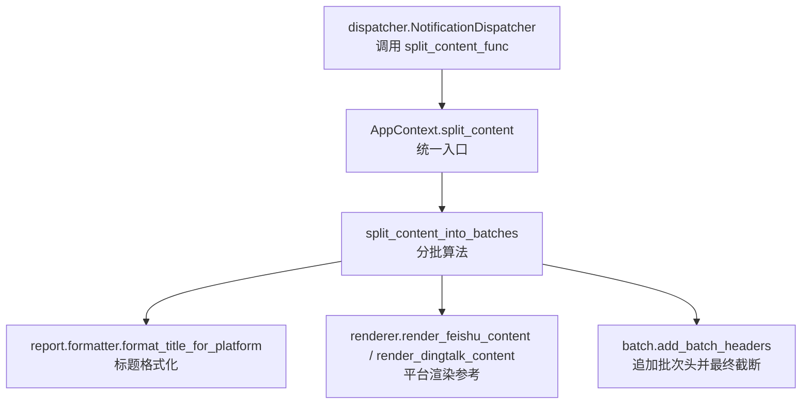
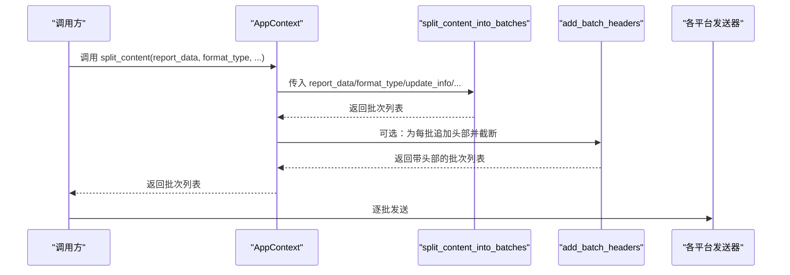
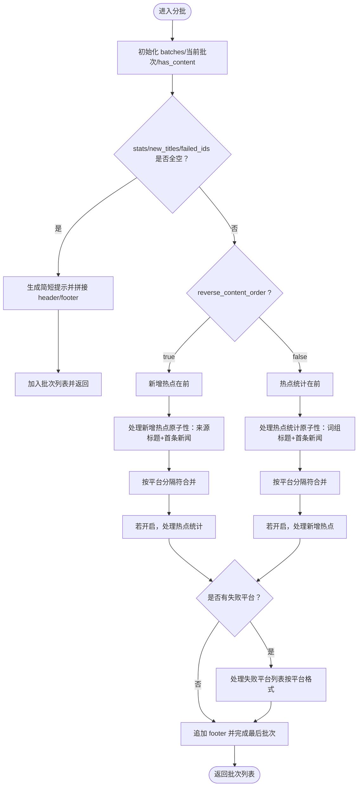
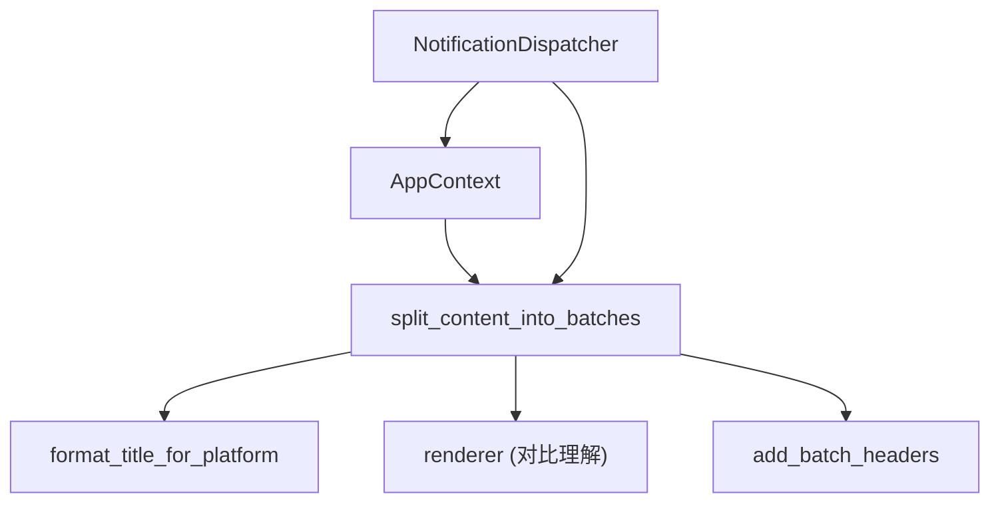

# 消息分批

<cite>
**本文引用的文件**
- [trendradar/context.py](file://trendradar/context.py)
- [trendradar/notification/splitter.py](file://trendradar/notification/splitter.py)
- [trendradar/notification/batch.py](file://trendradar/notification/batch.py)
- [trendradar/notification/renderer.py](file://trendradar/notification/renderer.py)
- [trendradar/report/formatter.py](file://trendradar/report/formatter.py)
- [trendradar/notification/dispatcher.py](file://trendradar/notification/dispatcher.py)
- [config/config.yaml](file://config/config.yaml)
</cite>

## 目录
1. [简介](#简介)
2. [项目结构](#项目结构)
3. [核心组件](#核心组件)
4. [架构总览](#架构总览)
5. [详细组件分析](#详细组件分析)
6. [依赖关系分析](#依赖关系分析)
7. [性能考量](#性能考量)
8. [故障排查指南](#故障排查指南)
9. [结论](#结论)
10. [附录](#附录)

## 简介
本文件聚焦于 TrendRadar 的“消息分批”能力，系统性阐述 AppContext.split_content 方法与 split_content_into_batches 函数的实现原理与使用方式，解释如何依据 DINGTALK_BATCH_SIZE、FEISHU_BATCH_SIZE 等配置对消息内容进行分批处理，确保单条消息不超过各平台限制；同时说明分批算法的原子性原则（关键词组标题与其第一条新闻必须同批）、不同平台在头部信息、尾部信息、分隔符上的差异化处理、reverse_content_order 对分批顺序的影响，以及空消息与失败信息的特殊处理逻辑。

## 项目结构
消息分批涉及的关键模块与文件如下：
- 上下文与入口：AppContext 提供 split_content，作为对外统一的分批入口
- 分批核心：split_content_into_batches 实现分批算法与平台差异化
- 批次后处理：batch.add_batch_headers 在分批完成后追加批次头部并做最终安全截断
- 平台渲染：renderer 提供飞书/钉钉渲染器，用于对比理解头部/分隔符差异
- 标题格式化：report.formatter.format_title_for_platform 统一标题格式化
- 通知调度：dispatcher 调用 split_content 并传入各平台的 batch_size 配置

图表来源
- [trendradar/context.py](file://trendradar/context.py#L341-L365)
- [trendradar/notification/splitter.py](file://trendradar/notification/splitter.py#L23-L581)
- [trendradar/notification/batch.py](file://trendradar/notification/batch.py#L78-L116)
- [trendradar/notification/renderer.py](file://trendradar/notification/renderer.py#L14-L261)
- [trendradar/report/formatter.py](file://trendradar/report/formatter.py#L13-L224)
- [trendradar/notification/dispatcher.py](file://trendradar/notification/dispatcher.py#L172-L223)

章节来源
- [trendradar/context.py](file://trendradar/context.py#L341-L365)
- [trendradar/notification/splitter.py](file://trendradar/notification/splitter.py#L23-L581)
- [trendradar/notification/batch.py](file://trendradar/notification/batch.py#L78-L116)
- [trendradar/notification/renderer.py](file://trendradar/notification/renderer.py#L14-L261)
- [trendradar/report/formatter.py](file://trendradar/report/formatter.py#L13-L224)
- [trendradar/notification/dispatcher.py](file://trendradar/notification/dispatcher.py#L172-L223)

## 核心组件
- AppContext.split_content
  - 作用：对外统一入口，负责将 report_data、format_type、update_info、max_bytes、mode 等参数透传给分批函数，并合并平台批次大小配置（DINGTALK_BATCH_SIZE、FEISHU_BATCH_SIZE、MESSAGE_BATCH_SIZE），同时注入 feishu_separator、reverse_content_order、get_time_func 等上下文参数。
  - 关键点：通过 config.get(...) 读取平台批次大小与分隔符，保证与配置文件一致。
- split_content_into_batches
  - 作用：核心分批算法，按平台差异化生成头部/尾部、分隔符，严格遵守“关键词组标题+第一条新闻”的原子性，支持 reverse_content_order 决定“新增热点在前/统计在前”的顺序，处理空消息与失败平台列表。
  - 关键点：先统计总新闻数，再按平台生成 base_header/base_footer/stats_header/new_header 等；对每个关键词组与来源均进行原子性检查；在分隔符处做边界判断；最后追加 base_footer。
- batch.add_batch_headers
  - 作用：在分批完成后为每批追加“第 x/y 批次”头部，并动态计算允许的最大内容大小，必要时进行安全截断，避免超限。
  - 关键点：估算最大头部字节数，预留空间；对超限内容进行安全截断，避免破坏 UTF-8 编码。

章节来源
- [trendradar/context.py](file://trendradar/context.py#L341-L365)
- [trendradar/notification/splitter.py](file://trendradar/notification/splitter.py#L23-L581)
- [trendradar/notification/batch.py](file://trendradar/notification/batch.py#L78-L116)

## 架构总览
消息分批的整体流程如下：
- 上层通过 AppContext.split_content 提供统一入口
- split_content_into_batches 生成批次内容，遵循平台差异化与原子性原则
- 若需要，batch.add_batch_headers 为每批追加头部并做最终安全截断
- 下游发送器（如钉钉/飞书）拿到批次列表后逐批发送

图表来源
- [trendradar/context.py](file://trendradar/context.py#L341-L365)
- [trendradar/notification/splitter.py](file://trendradar/notification/splitter.py#L23-L581)
- [trendradar/notification/batch.py](file://trendradar/notification/batch.py#L78-L116)
- [trendradar/notification/dispatcher.py](file://trendradar/notification/dispatcher.py#L172-L223)

## 详细组件分析

### AppContext.split_content 方法
- 输入参数：report_data、format_type、update_info、max_bytes、mode
- 输出：分批后的消息内容列表
- 关键实现要点：
  - 合并批次大小配置：从配置读取 DINGTALK_BATCH_SIZE、FEISHU_BATCH_SIZE、MESSAGE_BATCH_SIZE，并传入分批函数
  - 注入平台分隔符：FEISHU_MESSAGE_SEPARATOR
  - 注入内容顺序：REVERSE_CONTENT_ORDER
  - 注入时间函数：get_time_func
  - 调用 split_content_into_batches 执行分批

章节来源
- [trendradar/context.py](file://trendradar/context.py#L341-L365)
- [config/config.yaml](file://config/config.yaml#L82-L91)

### split_content_into_batches 函数
- 分批目标：确保每条消息不超过平台限制（字节）
- 平台差异化处理：
  - 飞书（feishu）：分隔符为 FEISHU_MESSAGE_SEPARATOR；标题与正文采用特定颜色与格式；底部包含更新时间与版本提示
  - 钉钉（dingtalk）：头部包含“总新闻数”“时间”“类型”“分隔线”，新增热点区域以“---”分隔
  - 企业微信（wework）、Bark、Telegram、ntfy、Slack：各自头部/分隔符/样式不同，但分批策略一致
- 原子性原则：
  - 关键词组：标题+第一条新闻必须在同一批次
  - 新增来源：来源标题+第一条新闻必须在同一批次
- 内容顺序：
  - reverse_content_order=false：热点词汇统计在前，新增热点在后
  - reverse_content_order=true：新增热点在前，热点词汇统计在后
- 空消息与失败信息：
  - 空消息：当 stats/new_titles/failed_ids 均为空时，生成简短提示并拼接 base_header/base_footer
  - 失败信息：列出无法获取的平台 ID，按平台采用不同颜色/格式
- 分隔符与头部/尾部：
  - 各平台的 base_header/base_footer/stats_header/new_header/分隔符均在函数内部按 format_type 分支处理
- 字节上限与边界判断：
  - 通过 len(text.encode("utf-8")) 判断当前内容与 footer 合并后的字节数是否超过 max_bytes
  - 若超过则提前落盘当前批次并开启新批次

图表来源
- [trendradar/notification/splitter.py](file://trendradar/notification/splitter.py#L23-L581)

章节来源
- [trendradar/notification/splitter.py](file://trendradar/notification/splitter.py#L23-L581)

### 平台头部/尾部/分隔符差异
- 飞书（feishu）
  - 头部：无
  - 分隔符：FEISHU_MESSAGE_SEPARATOR（默认较长横线）
  - 尾部：包含更新时间与版本提示，使用灰色字体
- 钉钉（dingtalk）
  - 头部：包含“总新闻数”“时间”“类型”“分隔线”
  - 分隔符：使用“---”
  - 尾部：包含更新时间与版本提示，使用引用样式
- 企业微信（wework）、Bark、Telegram、ntfy、Slack
  - 头部/分隔符/样式各有不同，但分批策略一致，均由 format_type 分支处理

章节来源
- [trendradar/notification/splitter.py](file://trendradar/notification/splitter.py#L70-L112)
- [trendradar/notification/splitter.py](file://trendradar/notification/splitter.py#L113-L168)
- [trendradar/notification/splitter.py](file://trendradar/notification/splitter.py#L338-L360)
- [trendradar/notification/splitter.py](file://trendradar/notification/splitter.py#L378-L383)
- [trendradar/notification/splitter.py](file://trendradar/notification/splitter.py#L538-L541)
- [trendradar/notification/renderer.py](file://trendradar/notification/renderer.py#L137-L261)

### reverse_content_order 对分批顺序的影响
- false：热点词汇统计在前，新增热点在后
- true：新增热点在前，热点词汇统计在后
- 两种顺序都会保持“词组标题+首条新闻”和“来源标题+首条新闻”的原子性

章节来源
- [trendradar/notification/splitter.py](file://trendradar/notification/splitter.py#L511-L527)

### 空消息与失败信息的特殊处理
- 空消息：当 stats/new_titles/failed_ids 均为空时，生成简短提示并拼接 base_header/base_footer 后直接加入批次列表
- 失败信息：列出无法获取的平台 ID，按平台采用不同颜色/格式（如飞书红色、钉钉加粗）

章节来源
- [trendradar/notification/splitter.py](file://trendradar/notification/splitter.py#L131-L145)
- [trendradar/notification/splitter.py](file://trendradar/notification/splitter.py#L529-L575)

### 标题格式化与平台一致性
- format_title_for_platform 统一处理标题格式，支持飞书、钉钉、企业微信、Bark、Telegram、ntfy、Slack、HTML 等平台
- 分批时对每条新闻调用 format_title_for_platform，确保不同平台的链接、颜色、时间、次数等展示一致

章节来源
- [trendradar/report/formatter.py](file://trendradar/report/formatter.py#L13-L224)
- [trendradar/notification/splitter.py](file://trendradar/notification/splitter.py#L236-L323)
- [trendradar/notification/splitter.py](file://trendradar/notification/splitter.py#L397-L491)

### 分批算法的原子性原则
- 关键词组：标题+第一条新闻必须同批
- 新增来源：来源标题+第一条新闻必须同批
- 该原则通过“test_content = current_batch + word_with_first_news”和“>= max_bytes”判断来保障，一旦超过上限则提前落盘并开启新批次

章节来源
- [trendradar/notification/splitter.py](file://trendradar/notification/splitter.py#L271-L289)
- [trendradar/notification/splitter.py](file://trendradar/notification/splitter.py#L445-L462)

### 批次头部与最终截断（batch.add_batch_headers）
- 为每批追加“第 x/y 批次”头部，动态计算允许的最大内容大小（max_bytes - header_size）
- 对超限内容进行安全截断，避免破坏 UTF-8 编码
- 仅在批次数大于 1 时生效

章节来源
- [trendradar/notification/batch.py](file://trendradar/notification/batch.py#L78-L116)

## 依赖关系分析
- AppContext 依赖 split_content_into_batches 与渲染器（用于 split_content 中的分隔符与顺序）
- split_content_into_batches 依赖 report.formatter.format_title_for_platform 与平台渲染器（renderer）用于理解头部/分隔符差异
- batch.add_batch_headers 依赖 split_content_into_batches 的输出，作为后处理步骤
- dispatcher 调用 split_content_func（即 AppContext.split_content），并将各平台的 batch_size 配置传入

图表来源
- [trendradar/context.py](file://trendradar/context.py#L341-L365)
- [trendradar/notification/splitter.py](file://trendradar/notification/splitter.py#L23-L581)
- [trendradar/notification/batch.py](file://trendradar/notification/batch.py#L78-L116)
- [trendradar/notification/renderer.py](file://trendradar/notification/renderer.py#L14-L261)
- [trendradar/report/formatter.py](file://trendradar/report/formatter.py#L13-L224)
- [trendradar/notification/dispatcher.py](file://trendradar/notification/dispatcher.py#L172-L223)

章节来源
- [trendradar/context.py](file://trendradar/context.py#L341-L365)
- [trendradar/notification/splitter.py](file://trendradar/notification/splitter.py#L23-L581)
- [trendradar/notification/batch.py](file://trendradar/notification/batch.py#L78-L116)
- [trendradar/notification/renderer.py](file://trendradar/notification/renderer.py#L14-L261)
- [trendradar/report/formatter.py](file://trendradar/report/formatter.py#L13-L224)
- [trendradar/notification/dispatcher.py](file://trendradar/notification/dispatcher.py#L172-L223)

## 性能考量
- 字节计算：使用 encode("utf-8") 计算字节数，避免截断导致的乱码
- 原子性优先：为保证内容完整性，分批时优先满足“标题+首条新闻”同批，可能导致单批略超限，但能显著提升可读性
- 分隔符与头部：不同平台的分隔符与头部会影响最终字节数，建议结合实际平台配置进行测试
- 批次数量：批次越多，头部开销越大；可通过合理设置 batch_size 与内容顺序减少批次数

## 故障排查指南
- 分批后仍超限
  - 检查是否启用了 batch.add_batch_headers，确认其动态截断逻辑是否生效
  - 调整各平台的 batch_size 配置（DINGTALK_BATCH_SIZE、FEISHU_BATCH_SIZE、MESSAGE_BATCH_SIZE）
- 飞书/钉钉分隔符不生效
  - 确认 FEISHU_MESSAGE_SEPARATOR 配置是否正确
  - 检查 reverse_content_order 是否导致顺序变化
- 内容被截断导致阅读不完整
  - 适当增大 batch_size，或减少标题/来源数量
  - 确保标题格式化未引入过多不可见字符
- 空消息与失败信息显示异常
  - 确认 report_data 的 stats/new_titles/failed_ids 结构是否正确
  - 检查平台渲染器与分批函数的分支逻辑是否匹配

章节来源
- [trendradar/notification/batch.py](file://trendradar/notification/batch.py#L78-L116)
- [config/config.yaml](file://config/config.yaml#L82-L91)
- [trendradar/notification/splitter.py](file://trendradar/notification/splitter.py#L70-L112)
- [trendradar/notification/splitter.py](file://trendradar/notification/splitter.py#L338-L360)
- [trendradar/notification/splitter.py](file://trendradar/notification/splitter.py#L529-L575)

## 结论
- AppContext.split_content 与 split_content_into_batches 共同实现了“面向平台、面向字节”的消息分批机制
- 原子性原则确保了“关键词组标题+首条新闻”“来源标题+首条新闻”的完整性，提升可读性
- 不同平台在头部、分隔符、尾部格式上的差异化处理，通过 format_type 分支清晰实现
- reverse_content_order 与 batch.add_batch_headers 为用户提供了灵活的顺序控制与最终安全截断
- 建议结合实际平台配置与内容规模，合理设置 batch_size 与分隔符，以获得最佳推送体验

## 附录
- 配置项参考（来自 config/config.yaml）
  - message_batch_size：默认消息分批大小（字节）
  - dingtalk_batch_size：钉钉消息分批大小（字节）
  - feishu_batch_size：飞书消息分批大小（字节）
  - feishu_message_separator：飞书消息分隔线
  - reverse_content_order：内容顺序开关
  - batch_send_interval：批次发送间隔（秒）

章节来源
- [config/config.yaml](file://config/config.yaml#L82-L91)