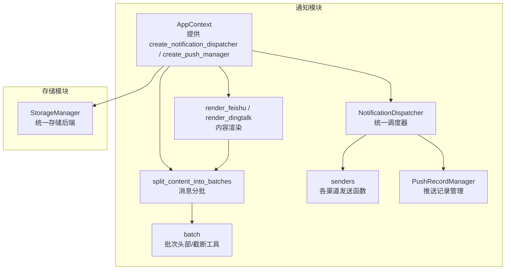
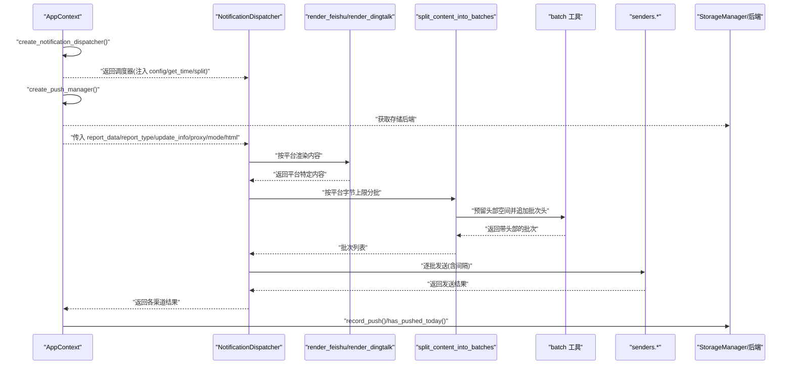
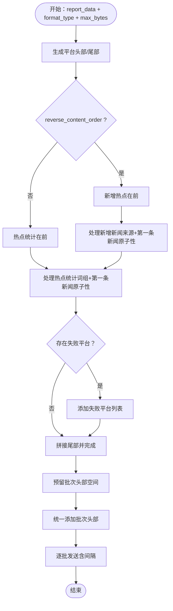
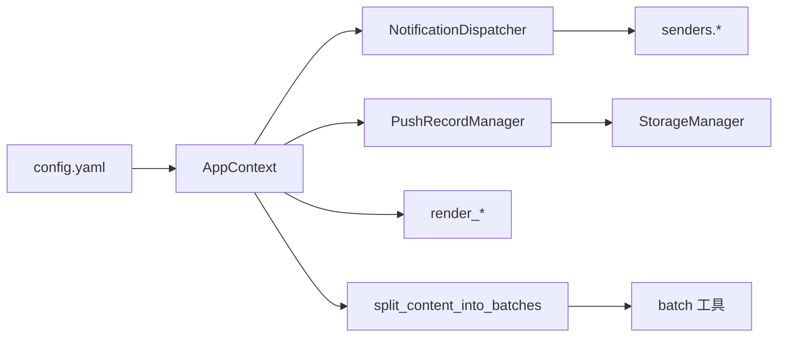

# 通知调度

<cite>
**本文引用的文件**
- [context.py](file://trendradar/context.py)
- [dispatcher.py](file://trendradar/notification/dispatcher.py)
- [renderer.py](file://trendradar/notification/renderer.py)
- [splitter.py](file://trendradar/notification/splitter.py)
- [senders.py](file://trendradar/notification/senders.py)
- [batch.py](file://trendradar/notification/batch.py)
- [push_manager.py](file://trendradar/notification/push_manager.py)
- [manager.py](file://trendradar/storage/manager.py)
- [config.yaml](file://config/config.yaml)
</cite>

## 目录
1. [简介](#简介)
2. [项目结构](#项目结构)
3. [核心组件](#核心组件)
4. [架构总览](#架构总览)
5. [详细组件分析](#详细组件分析)
6. [依赖关系分析](#依赖关系分析)
7. [性能考量](#性能考量)
8. [故障排查指南](#故障排查指南)
9. [结论](#结论)
10. [附录](#附录)

## 简介
本文件围绕 TrendRadar 通知调度系统，聚焦以下目标：
- 解释 AppContext 如何通过 create_notification_dispatcher() 和 create_push_manager() 提供统一的调度与推送记录能力
- 说明 NotificationDispatcher 如何利用 config、get_time_func、split_content_func 协调多渠道推送
- 详解 render_feishu、render_dingtalk、split_content 的职责与实现要点
- 解析 split_content_into_batches 如何依据 DINGTALK_BATCH_SIZE、FEISHU_BATCH_SIZE 等配置进行内容分割
- 展示从报告数据到分批消息的完整转换路径
- 说明 PushRecordManager 在推送记录管理中的作用

## 项目结构
通知调度相关代码主要分布在 trendradar/notification 目录，配合 trendradar/context 提供统一入口；存储层通过 storage/manager 提供统一后端。

图表来源
- [context.py](file://trendradar/context.py#L366-L381)
- [dispatcher.py](file://trendradar/notification/dispatcher.py#L1-L120)
- [renderer.py](file://trendradar/notification/renderer.py#L1-L135)
- [splitter.py](file://trendradar/notification/splitter.py#L1-L120)
- [senders.py](file://trendradar/notification/senders.py#L1-L120)
- [batch.py](file://trendradar/notification/batch.py#L1-L116)
- [push_manager.py](file://trendradar/notification/push_manager.py#L1-L110)
- [manager.py](file://trendradar/storage/manager.py#L1-L120)

章节来源
- [context.py](file://trendradar/context.py#L366-L381)
- [dispatcher.py](file://trendradar/notification/dispatcher.py#L1-L120)
- [renderer.py](file://trendradar/notification/renderer.py#L1-L135)
- [splitter.py](file://trendradar/notification/splitter.py#L1-L120)
- [senders.py](file://trendradar/notification/senders.py#L1-L120)
- [batch.py](file://trendradar/notification/batch.py#L1-L116)
- [push_manager.py](file://trendradar/notification/push_manager.py#L1-L110)
- [manager.py](file://trendradar/storage/manager.py#L1-L120)

## 核心组件
- AppContext：提供 create_notification_dispatcher() 与 create_push_manager()，并将 config、时间函数、内容渲染与分批函数注入调度器
- NotificationDispatcher：统一调度多渠道推送，负责多账号解析、配对校验、批量发送与结果聚合
- render_feishu / render_dingtalk：按平台规范渲染通知内容，支持顺序与时间戳注入
- split_content_into_batches：按平台字节上限与内容原子性进行分批，支持多种分隔符与顺序策略
- senders：各渠道发送函数，统一预留批次头部空间、逐批发送、间隔控制与错误处理
- PushRecordManager：基于存储后端记录/查询推送状态，支持每日仅一次与时间窗口控制
- batch：批次头部生成、最大头部字节估算、安全截断工具

章节来源
- [context.py](file://trendradar/context.py#L366-L381)
- [dispatcher.py](file://trendradar/notification/dispatcher.py#L1-L120)
- [renderer.py](file://trendradar/notification/renderer.py#L1-L135)
- [splitter.py](file://trendradar/notification/splitter.py#L1-L120)
- [senders.py](file://trendradar/notification/senders.py#L1-L120)
- [push_manager.py](file://trendradar/notification/push_manager.py#L1-L110)
- [batch.py](file://trendradar/notification/batch.py#L1-L116)

## 架构总览
下图展示了从 AppContext 到各渠道发送的端到端流程，以及分批与批次头部处理的关键节点。

图表来源
- [context.py](file://trendradar/context.py#L366-L381)
- [dispatcher.py](file://trendradar/notification/dispatcher.py#L120-L220)
- [renderer.py](file://trendradar/notification/renderer.py#L1-L135)
- [splitter.py](file://trendradar/notification/splitter.py#L1-L120)
- [batch.py](file://trendradar/notification/batch.py#L1-L116)
- [senders.py](file://trendradar/notification/senders.py#L1-L120)
- [manager.py](file://trendradar/storage/manager.py#L260-L344)

## 详细组件分析

### AppContext.create_notification_dispatcher() 与 create_push_manager()
- create_notification_dispatcher()
  - 返回 NotificationDispatcher 实例，注入：
    - config：包含各渠道配置、批次大小、分隔符、最大账号数等
    - get_time_func：统一时间函数，保证时区一致性
    - split_content_func：统一分批函数，便于各渠道复用
- create_push_manager()
  - 返回 PushRecordManager 实例，注入：
    - storage_backend：来自 AppContext.get_storage_manager() 的统一存储后端
    - get_time_func：统一时间函数

章节来源
- [context.py](file://trendradar/context.py#L366-L381)
- [manager.py](file://trendradar/storage/manager.py#L260-L344)

### NotificationDispatcher：多渠道调度与多账号处理
- dispatch_all()
  - 按配置开关依次尝试各渠道：飞书、钉钉、企业微信、Telegram、ntfy、Bark、Slack、邮件
  - 对需要配对的渠道（Telegram、ntfy）进行配对校验
- _send_to_multi_accounts()
  - 解析分号分隔的多账号配置，限制最大账号数，逐个发送并聚合结果
- 各渠道发送细节
  - 飞书/钉钉/企业微信/Slack：使用 split_content_func 生成批次，预留批次头部空间，逐批发送并按配置间隔休眠
  - Telegram：按配对 token/chat_id 逐个发送
  - ntfy：严格遵守 4KB 限制，必要时反向推送以保证客户端显示顺序
  - 邮件：使用 HTML 报告文件，自动识别 SMTP 服务器与端口，支持 TLS/SSL

章节来源
- [dispatcher.py](file://trendradar/notification/dispatcher.py#L1-L120)
- [dispatcher.py](file://trendradar/notification/dispatcher.py#L120-L220)
- [dispatcher.py](file://trendradar/notification/dispatcher.py#L220-L421)
- [senders.py](file://trendradar/notification/senders.py#L1-L266)
- [senders.py](file://trendradar/notification/senders.py#L266-L500)
- [senders.py](file://trendradar/notification/senders.py#L500-L800)

### 内容渲染：render_feishu 与 render_dingtalk
- render_feishu_content()
  - 生成“热点词汇统计”与“新增热点新闻”两部分
  - 支持按配置反转内容顺序（新增在前）
  - 使用 get_time_func 注入更新时间，支持附加版本更新信息
- render_dingtalk_content()
  - 生成头部信息（总新闻数、时间、类型），随后“热点词汇统计”与“新增热点新闻”
  - 支持按配置反转内容顺序
  - 使用 get_time_func 注入更新时间，支持附加版本更新信息

章节来源
- [renderer.py](file://trendradar/notification/renderer.py#L1-L135)
- [renderer.py](file://trendradar/notification/renderer.py#L137-L261)

### 内容分批：split_content_into_batches 与 split_content
- split_content_into_batches()
  - 合并默认批次大小与配置（如 FEISHU_BATCH_SIZE、DINGTALK_BATCH_SIZE）
  - 生成平台特定的头部与尾部（含更新时间与版本信息）
  - 按“词组标题+第一条新闻”的原子性原则进行分批，避免截断中间
  - 支持按配置反转顺序（新增在前）
  - 词组间与来源间使用平台特定分隔符
- split_content()
  - AppContext 封装的便捷入口，将 report_data、format_type、update_info、mode 与 batch_sizes 传入 split_content_into_batches
  - 从配置读取各平台批次大小与分隔符、内容顺序等

章节来源
- [splitter.py](file://trendradar/notification/splitter.py#L1-L120)
- [splitter.py](file://trendradar/notification/splitter.py#L120-L220)
- [splitter.py](file://trendradar/notification/splitter.py#L220-L360)
- [splitter.py](file://trendradar/notification/splitter.py#L360-L581)
- [context.py](file://trendradar/context.py#L341-L365)

### 分批流程与批次头部处理
- 预留头部空间
  - 各渠道发送函数在调用分批前，先计算“最大批次头部字节数”，再将 max_bytes 减去该预留值，确保添加批次头后仍不超过平台限制
- 统一添加批次头
  - add_batch_headers() 为每批内容添加“第 x/y 批次”头部，并在超限时安全截断
- 平台差异
  - 飞书/钉钉/企业微信 markdown：使用 Markdown 标记
  - 企业微信 text：去除 Markdown 语法
  - Telegram/Slack：使用各自 parse_mode 或标记
  - ntfy：严格 4KB 限制，必要时反向推送

图表来源
- [splitter.py](file://trendradar/notification/splitter.py#L1-L120)
- [splitter.py](file://trendradar/notification/splitter.py#L120-L220)
- [batch.py](file://trendradar/notification/batch.py#L1-L116)
- [senders.py](file://trendradar/notification/senders.py#L1-L120)

### PushRecordManager：推送记录管理
- has_pushed_today()：查询今日是否已推送
- record_push(report_type)：记录本次推送
- is_in_time_range(start, end)：判断当前时间是否在配置的时间窗口内
- 与存储后端解耦：通过统一的 StorageManager 获取后端实例，支持本地 SQLite 与远程存储

章节来源
- [push_manager.py](file://trendradar/notification/push_manager.py#L1-L110)
- [manager.py](file://trendradar/storage/manager.py#L260-L344)

## 依赖关系分析
- AppContext 依赖
  - config.yaml 中的 notification 配置（批次大小、分隔符、最大账号数、推送窗口）
  - 时间工具：统一时区与时间显示
  - 存储管理器：统一后端
- NotificationDispatcher 依赖
  - senders.*：各渠道发送函数
  - split_content_into_batches：统一分批
  - 多账号解析与配对校验：来自 core.config（在调度器内部使用）
- split_content_into_batches 依赖
  - 平台特定格式化器：format_title_for_platform
  - batch 工具：批次头部、截断
- PushRecordManager 依赖
  - StorageManager：统一存储后端

图表来源
- [config.yaml](file://config/config.yaml#L82-L110)
- [context.py](file://trendradar/context.py#L366-L381)
- [dispatcher.py](file://trendradar/notification/dispatcher.py#L1-L120)
- [splitter.py](file://trendradar/notification/splitter.py#L1-L120)
- [batch.py](file://trendradar/notification/batch.py#L1-L116)
- [push_manager.py](file://trendradar/notification/push_manager.py#L1-L110)
- [manager.py](file://trendradar/storage/manager.py#L260-L344)

## 性能考量
- 分批大小与头部预留
  - 各渠道在分批前预留“最大批次头部字节数”，避免事后截断导致内容不完整
- 批次间隔
  - 通过配置的批次发送间隔降低触发风控与服务端压力
- 原子性分批
  - “词组标题+第一条新闻”不可拆分，减少重复发送与平台渲染问题
- ntfy 特殊处理
  - 严格 4KB 限制，必要时反向推送以保证客户端显示顺序
- 存储后端
  - 自动选择本地或远程后端，减少 IO 开销；支持保留天数清理

[本节为通用指导，不直接分析具体文件]

## 故障排查指南
- 飞书/钉钉/企业微信发送失败
  - 检查 webhook URL 是否正确、是否启用代理
  - 查看批次大小与批次头预留是否合理
  - 关注返回状态码与错误信息，必要时增加批次间隔
- Telegram/ntfy 配对错误
  - Telegram：token 与 chat_id 数量必须一致
  - ntfy：topic 与 token 数量一致（若配置 token）
- 邮件发送失败
  - 检查 SMTP 服务器与端口、加密方式（465 SSL / 587 TLS）
  - 确认 HTML 报告文件存在且路径正确
- 推送记录异常
  - 确认 StorageManager 后端可用，检查 has_pushed_today 与 record_push 行为
  - 校对时区与时间窗口配置

章节来源
- [senders.py](file://trendradar/notification/senders.py#L1-L266)
- [senders.py](file://trendradar/notification/senders.py#L266-L500)
- [senders.py](file://trendradar/notification/senders.py#L500-L800)
- [push_manager.py](file://trendradar/notification/push_manager.py#L1-L110)
- [manager.py](file://trendradar/storage/manager.py#L260-L344)

## 结论
- AppContext 通过 create_notification_dispatcher() 与 create_push_manager() 将配置、时间、存储与通知流程解耦，提升可测试性与可维护性
- NotificationDispatcher 以统一接口协调多渠道与多账号，结合分批与批次头工具，确保各平台合规与稳定
- render_feishu / render_dingtalk 与 split_content_into_batches 提供平台特定的内容渲染与分批策略，满足不同平台的字节限制与显示需求
- PushRecordManager 基于统一存储后端，提供每日仅一次与时间窗口控制，增强用户体验与合规性

[本节为总结性内容，不直接分析具体文件]

## 附录
- 关键配置项（摘自 config.yaml）
  - notification.message_batch_size：通用消息分批大小
  - notification.dingtalk_batch_size：钉钉消息分批大小
  - notification.feishu_batch_size：飞书消息分批大小
  - notification.batch_send_interval：批次发送间隔
  - notification.feishu_message_separator：飞书消息分隔符
  - notification.max_accounts_per_channel：每渠道最大账号数
  - notification.push_window：推送时间窗口控制（enabled、time_range.start/end、once_per_day）

章节来源
- [config.yaml](file://config/config.yaml#L82-L110)