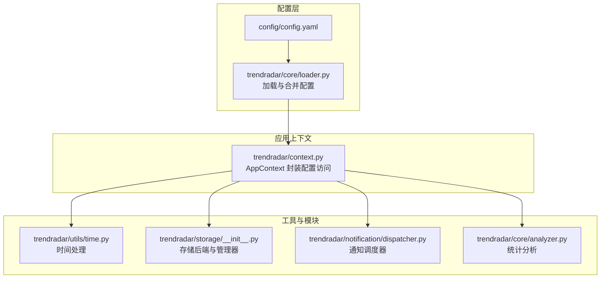
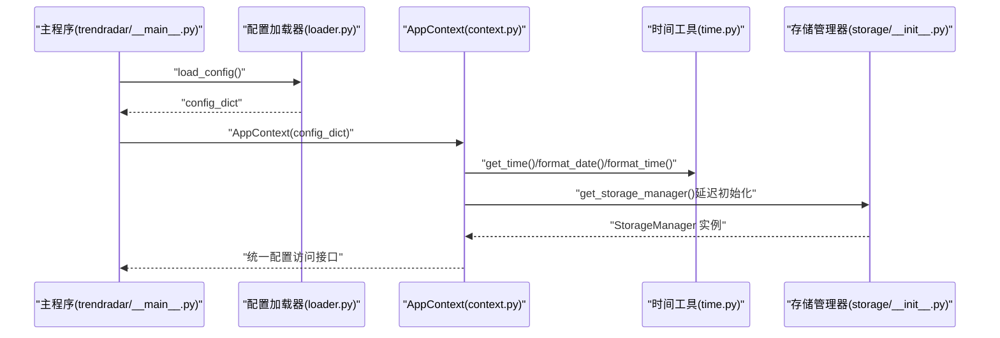
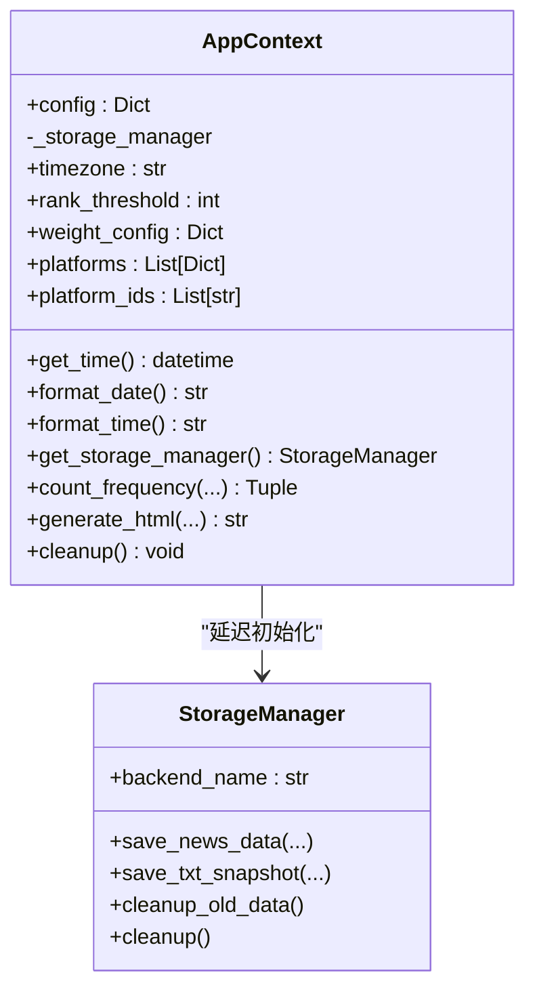
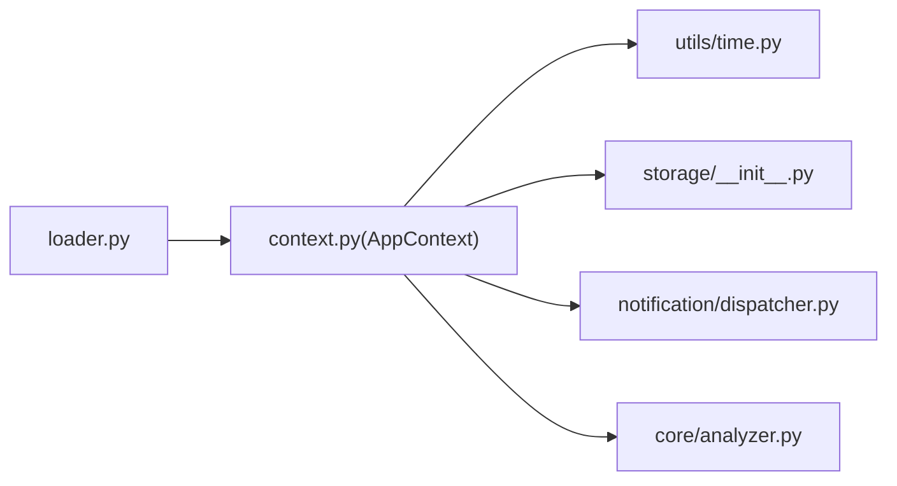

# 配置管理

<cite>
**本文引用的文件**
- [trendradar/context.py](file://trendradar/context.py)
- [trendradar/core/loader.py](file://trendradar/core/loader.py)
- [config/config.yaml](file://config/config.yaml)
- [trendradar/utils/time.py](file://trendradar/utils/time.py)
- [trendradar/storage/__init__.py](file://trendradar/storage/__init__.py)
- [trendradar/__main__.py](file://trendradar/__main__.py)
- [trendradar/core/analyzer.py](file://trendradar/core/analyzer.py)
- [trendradar/notification/dispatcher.py](file://trendradar/notification/dispatcher.py)
</cite>

## 目录
1. [简介](#简介)
2. [项目结构](#项目结构)
3. [核心组件](#核心组件)
4. [架构总览](#架构总览)
5. [详细组件分析](#详细组件分析)
6. [依赖分析](#依赖分析)
7. [性能考虑](#性能考虑)
8. [故障排查指南](#故障排查指南)
9. [结论](#结论)

## 简介
本文件聚焦 TrendRadar 应用的“上下文配置管理”，系统性阐述 AppContext 类如何通过属性装饰器（如 timezone、rank_threshold、weight_config）封装配置访问，解释这些属性如何从 config.yaml 中读取默认值并提供类型安全的访问接口；说明 platforms 与 platform_ids 属性如何解析平台配置列表并提取 ID；解释 config 字段如何承载原始配置字典；并通过调用路径示例展示如何通过 ctx.timezone 与 ctx.rank_threshold 获取配置值；最后说明配置的延迟加载机制及其对可测试性与模块解耦的贡献。

## 项目结构
围绕配置管理的关键文件与职责如下：
- 配置加载：从 config.yaml 与环境变量合并生成完整配置字典
- 应用上下文：封装配置访问与跨模块共享，提供统一接口
- 工具与模块：时间、存储、通知等子系统通过 AppContext 注入配置

图表来源
- [config/config.yaml](file://config/config.yaml#L1-L187)
- [trendradar/core/loader.py](file://trendradar/core/loader.py#L1-L332)
- [trendradar/context.py](file://trendradar/context.py#L1-L391)
- [trendradar/utils/time.py](file://trendradar/utils/time.py#L1-L92)
- [trendradar/storage/__init__.py](file://trendradar/storage/__init__.py#L1-L45)
- [trendradar/notification/dispatcher.py](file://trendradar/notification/dispatcher.py#L1-L200)
- [trendradar/core/analyzer.py](file://trendradar/core/analyzer.py#L1-L200)

章节来源
- [trendradar/context.py](file://trendradar/context.py#L1-L120)
- [trendradar/core/loader.py](file://trendradar/core/loader.py#L1-L120)
- [config/config.yaml](file://config/config.yaml#L1-L187)

## 核心组件
- AppContext：集中封装配置访问与跨模块共享，提供类型安全的属性访问与延迟初始化能力
- 配置加载器：从 YAML 与环境变量合并配置，输出标准化的配置字典
- 时间工具：基于配置时区进行时间格式化与显示
- 存储模块：根据配置选择本地/远程/自动后端，并延迟初始化存储管理器
- 通知调度器：基于配置批量发送消息，支持多账号与配对校验
- 统计分析：使用配置中的阈值与权重进行新闻权重计算与排序

章节来源
- [trendradar/context.py](file://trendradar/context.py#L66-L120)
- [trendradar/core/loader.py](file://trendradar/core/loader.py#L1-L120)
- [trendradar/utils/time.py](file://trendradar/utils/time.py#L1-L92)
- [trendradar/storage/__init__.py](file://trendradar/storage/__init__.py#L1-L45)
- [trendradar/notification/dispatcher.py](file://trendradar/notification/dispatcher.py#L1-L120)
- [trendradar/core/analyzer.py](file://trendradar/core/analyzer.py#L1-L120)

## 架构总览
AppContext 作为配置访问的唯一入口，向上游模块暴露统一的属性接口，向下通过工具函数与子系统使用配置。配置来源于 YAML 与环境变量的合并，最终以字典形式注入 AppContext。

图表来源
- [trendradar/__main__.py](file://trendradar/__main__.py#L100-L140)
- [trendradar/core/loader.py](file://trendradar/core/loader.py#L280-L332)
- [trendradar/context.py](file://trendradar/context.py#L105-L155)
- [trendradar/utils/time.py](file://trendradar/utils/time.py#L1-L92)
- [trendradar/storage/__init__.py](file://trendradar/storage/__init__.py#L1-L45)

## 详细组件分析

### AppContext 类与属性装饰器
AppContext 通过 Python 属性（@property）封装配置访问，提供类型安全的默认值与便捷方法：
- timezone：读取 TIMEZONE，若未配置则回退为默认时区
- rank_threshold：读取 RANK_THRESHOLD，若未配置则回退为默认阈值
- weight_config：读取 WEIGHT_CONFIG，若未配置则回退为空字典
- platforms：读取 PLATFORMS 平台配置列表
- platform_ids：从 platforms 中提取 id 列表

这些属性均通过字典的 get 方法访问，具备默认值与类型安全特性，便于在各模块中直接使用。

章节来源
- [trendradar/context.py](file://trendradar/context.py#L78-L102)

### 配置来源与默认值
- config.yaml 提供默认配置，如 TIMEZONE、RANK_THRESHOLD、WEIGHT_CONFIG、PLATFORMS 等
- 配置加载器会将 YAML 中的键映射为大写常量键（如 TIMEZONE），并允许环境变量覆盖
- AppContext 在属性访问时提供兜底默认值，确保即使某些键缺失也能稳定运行

章节来源
- [config/config.yaml](file://config/config.yaml#L1-L187)
- [trendradar/core/loader.py](file://trendradar/core/loader.py#L41-L120)
- [trendradar/context.py](file://trendradar/context.py#L78-L102)

### 平台配置解析与 ID 提取
- platforms 返回 PLATFORMS 列表（字典数组）
- platform_ids 基于 platforms 逐项提取 id，形成字符串列表
- 主程序在初始化阶段会读取 ctx.platform_ids 以过滤历史数据与控制爬取范围

章节来源
- [trendradar/context.py](file://trendradar/context.py#L93-L102)
- [trendradar/__main__.py](file://trendradar/__main__.py#L234-L268)

### 配置字段 config 的作用
- config 字段保存完整的配置字典，作为 AppContext 的内部存储
- 各模块通过 ctx.config 直接读取任意配置项（如 STORAGE、REPORT、NOTIFICATION 等）
- 主程序在初始化阶段会根据运行环境（如 GitHub Actions）对 config 进行动态覆盖（例如 STORAGE RETENTION_DAYS）

章节来源
- [trendradar/context.py](file://trendradar/context.py#L66-L76)
- [trendradar/__main__.py](file://trendradar/__main__.py#L129-L143)

### 通过 ctx.timezone 与 ctx.rank_threshold 获取配置值
- 获取时区：ctx.timezone 返回字符串
- 获取阈值：ctx.rank_threshold 返回整型
- 使用示例（调用路径）：
  - 时区用于时间格式化与显示：参见 [trendradar/context.py](file://trendradar/context.py#L105-L120)
  - 阈值用于统计分析：参见 [trendradar/context.py](file://trendradar/context.py#L224-L234) 与 [trendradar/core/analyzer.py](file://trendradar/core/analyzer.py#L16-L61)

章节来源
- [trendradar/context.py](file://trendradar/context.py#L105-L120)
- [trendradar/context.py](file://trendradar/context.py#L224-L234)
- [trendradar/core/analyzer.py](file://trendradar/core/analyzer.py#L16-L61)

### 配置在系统各模块的作用范围
- 时间模块：基于 ctx.timezone 进行时间格式化与显示
- 存储模块：根据 ctx.config 的 STORAGE 配置选择后端并延迟初始化
- 通知模块：基于 ctx.config 的通知配置与分批大小等参数
- 统计分析：基于 ctx.rank_threshold 与 ctx.weight_config 进行权重计算与排序

章节来源
- [trendradar/context.py](file://trendradar/context.py#L105-L155)
- [trendradar/context.py](file://trendradar/context.py#L236-L307)
- [trendradar/notification/dispatcher.py](file://trendradar/notification/dispatcher.py#L1-L120)
- [trendradar/core/analyzer.py](file://trendradar/core/analyzer.py#L1-L120)

### 延迟加载机制与可测试性
- 存储管理器采用延迟初始化（单例）：首次调用 get_storage_manager() 时才创建实例，后续复用
- 延迟加载的优势：
  - 降低启动成本：未使用存储时不会初始化
  - 提升可测试性：可在测试中替换 ctx.config 或直接注入 mock 实例
  - 解耦模块：存储后端的选择与初始化由 AppContext 内部控制，调用方无需关心细节

章节来源
- [trendradar/context.py](file://trendradar/context.py#L128-L155)

### 类关系图（代码级）

图表来源
- [trendradar/context.py](file://trendradar/context.py#L66-L155)
- [trendradar/storage/__init__.py](file://trendradar/storage/__init__.py#L1-L45)

## 依赖分析
- AppContext 依赖：
  - 配置字典（由 loader.py 生成）
  - 时间工具（基于时区）
  - 存储模块（按配置选择后端）
  - 通知模块（基于配置的分批大小与开关）
  - 统计分析模块（基于阈值与权重）

图表来源
- [trendradar/core/loader.py](file://trendradar/core/loader.py#L280-L332)
- [trendradar/context.py](file://trendradar/context.py#L1-L120)
- [trendradar/utils/time.py](file://trendradar/utils/time.py#L1-L92)
- [trendradar/storage/__init__.py](file://trendradar/storage/__init__.py#L1-L45)
- [trendradar/notification/dispatcher.py](file://trendradar/notification/dispatcher.py#L1-L120)
- [trendradar/core/analyzer.py](file://trendradar/core/analyzer.py#L1-L120)

## 性能考虑
- 延迟初始化存储管理器：避免不必要的 IO 与网络开销
- 属性访问均为 O(1) 字典查询，开销极低
- 配置合并与环境变量覆盖发生在启动阶段，运行时不再重复解析

## 故障排查指南
- 时区无效：当配置的 TIMEZONE 不存在时，时间工具会回退到默认时区并打印警告
- 配置缺失：若 YAML 中缺少某键，AppContext 属性提供默认值；可通过检查 ctx.config 确认实际值
- 存储后端异常：检查 STORAGE 配置（backend、formats、remote/local/pull）是否正确
- 通知发送失败：检查各渠道 webhook 与分批大小配置，确认多账号解析与配对验证通过

章节来源
- [trendradar/utils/time.py](file://trendradar/utils/time.py#L15-L31)
- [trendradar/notification/dispatcher.py](file://trendradar/notification/dispatcher.py#L138-L200)

## 结论
AppContext 通过属性装饰器将配置访问统一抽象为类型安全的接口，结合 config.yaml 与环境变量的合并机制，提供了灵活、可测试、可维护的配置管理方案。其延迟加载与集中封装显著提升了模块解耦与运行效率，使时间、存储、通知与统计分析等子系统能够以最小耦合的方式共享配置。