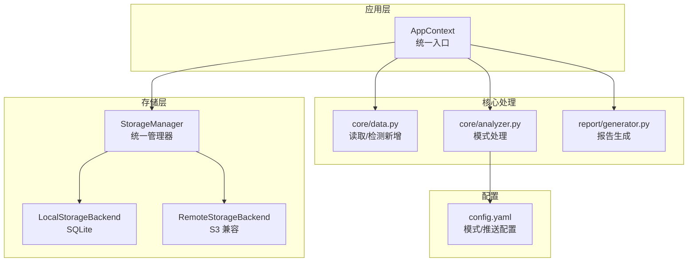
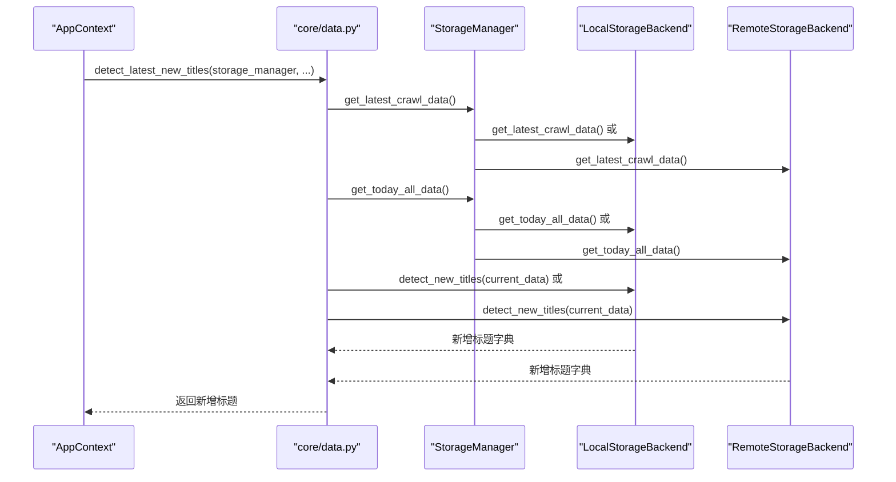
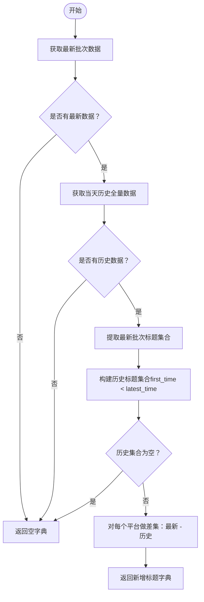
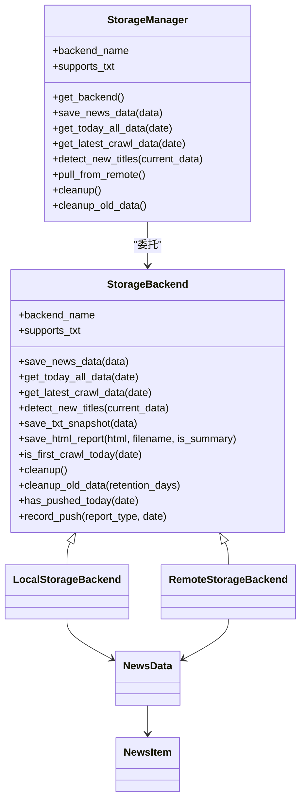

# 增量检测

<cite>
**本文引用的文件**
- [trendradar/context.py](file://trendradar/context.py)
- [trendradar/storage/manager.py](file://trendradar/storage/manager.py)
- [trendradar/storage/local.py](file://trendradar/storage/local.py)
- [trendradar/storage/remote.py](file://trendradar/storage/remote.py)
- [trendradar/storage/base.py](file://trendradar/storage/base.py)
- [trendradar/storage/schema.sql](file://trendradar/storage/schema.sql)
- [trendradar/core/data.py](file://trendradar/core/data.py)
- [trendradar/core/analyzer.py](file://trendradar/core/analyzer.py)
- [trendradar/report/generator.py](file://trendradar/report/generator.py)
- [config/config.yaml](file://config/config.yaml)
</cite>

## 目录
1. [简介](#简介)
2. [项目结构](#项目结构)
3. [核心组件](#核心组件)
4. [架构总览](#架构总览)
5. [详细组件分析](#详细组件分析)
6. [依赖关系分析](#依赖关系分析)
7. [性能考量](#性能考量)
8. [故障排查指南](#故障排查指南)
9. [结论](#结论)
10. [附录](#附录)

## 简介
本文件聚焦于 TrendRadar 的“增量检测”机制，围绕 `detect_latest_new_titles()` 函数展开，系统阐述其在本地存储（LocalStorageBackend）与远程存储（RemoteStorageBackend）中的实现差异，以及如何通过 SQLite 数据库持久化维护标题历史记录，从而支持热点趋势的演变追踪。同时，结合 AppContext.detect_new_titles() 方法，说明在增量模式（incremental）下的数据处理流程与推送策略。

## 项目结构
- 存储层：抽象基类 StorageBackend 定义统一接口；Local/Remote 后端分别实现本地 SQLite 与远程 S3 兼容存储。
- 核心数据处理：core/data.py 提供从存储后端读取、检测新增标题的能力。
- 应用上下文：context.py 提供统一入口，封装配置、时间、存储、报告、通知等功能。
- 报告与分析：report/generator.py 与 core/analyzer.py 在不同模式（daily/current/incremental）下对新增标题进行呈现与统计。

图表来源
- [trendradar/context.py](file://trendradar/context.py#L160-L185)
- [trendradar/storage/manager.py](file://trendradar/storage/manager.py#L180-L230)
- [trendradar/storage/local.py](file://trendradar/storage/local.py#L520-L584)
- [trendradar/storage/remote.py](file://trendradar/storage/remote.py#L699-L748)
- [trendradar/core/data.py](file://trendradar/core/data.py#L182-L286)
- [trendradar/core/analyzer.py](file://trendradar/core/analyzer.py#L152-L255)
- [trendradar/report/generator.py](file://trendradar/report/generator.py#L42-L61)
- [config/config.yaml](file://config/config.yaml#L69-L81)

章节来源
- [trendradar/context.py](file://trendradar/context.py#L160-L185)
- [trendradar/storage/manager.py](file://trendradar/storage/manager.py#L180-L230)
- [trendradar/core/data.py](file://trendradar/core/data.py#L182-L286)
- [config/config.yaml](file://config/config.yaml#L69-L81)

## 核心组件
- AppContext.detect_new_titles(): 通过 StorageManager 获取最新批次的新增标题，供后续统计与报告使用。
- StorageManager.detect_new_titles(): 统一调用具体后端的 detect_new_titles()。
- LocalStorageBackend.detect_new_titles(): 基于 SQLite 的历史数据与当前批次时间，计算新增标题。
- RemoteStorageBackend.detect_new_titles(): 与本地逻辑一致，但通过下载/上传远程 SQLite 文件实现。
- core/data.detect_latest_new_titles_from_storage(): 通用的增量检测逻辑，支持平台过滤与日志输出。
- 数据模型与表结构：NewsData/NewsItem、SQLite schema（news_items、rank_history、title_changes、crawl_records、crawl_source_status、push_records）。

章节来源
- [trendradar/context.py](file://trendradar/context.py#L160-L185)
- [trendradar/storage/manager.py](file://trendradar/storage/manager.py#L208-L215)
- [trendradar/storage/local.py](file://trendradar/storage/local.py#L526-L584)
- [trendradar/storage/remote.py](file://trendradar/storage/remote.py#L699-L748)
- [trendradar/core/data.py](file://trendradar/core/data.py#L182-L286)
- [trendradar/storage/schema.sql](file://trendradar/storage/schema.sql#L1-L118)

## 架构总览
增量检测的关键流程如下：
- AppContext.detect_new_titles() 调用 core/data.detect_latest_new_titles()。
- detect_latest_new_titles() 通过 StorageManager.get_latest_crawl_data() 与 get_today_all_data() 获取最新批次与历史全量数据。
- Local/Remote 后端各自实现 detect_new_titles()，基于 first_time < latest_time 的规则判定“历史标题”，再与最新批次标题做差集得到新增标题。
- 新增标题进入统计与报告阶段，受 report 模式（daily/current/incremental）影响。

图表来源
- [trendradar/context.py](file://trendradar/context.py#L160-L185)
- [trendradar/core/data.py](file://trendradar/core/data.py#L182-L286)
- [trendradar/storage/manager.py](file://trendradar/storage/manager.py#L204-L215)
- [trendradar/storage/local.py](file://trendradar/storage/local.py#L526-L584)
- [trendradar/storage/remote.py](file://trendradar/storage/remote.py#L699-L748)

## 详细组件分析

### detect_latest_new_titles() 工作原理
- 输入：StorageManager 实例、可选平台过滤列表、静默开关。
- 步骤：
  1) 读取最新批次数据（latest_data）与当天历史全量数据（all_data）。
  2) 从 latest_data 中提取最新批次标题集合 latest_titles。
  3) 从 all_data 中收集历史标题集合 historical_titles：只要某标题的 first_time < latest_time，即视为历史。
  4) 若历史集合为空（当天仅有一次抓取），返回空字典。
  5) 对每个平台，取 latest_titles 与 historical_titles 的差集，得到新增标题 new_titles。
- 输出：按平台分组的新增标题字典，供后续统计与报告使用。

图表来源
- [trendradar/core/data.py](file://trendradar/core/data.py#L182-L286)

章节来源
- [trendradar/core/data.py](file://trendradar/core/data.py#L182-L286)

### StorageManager 与后端适配
- StorageManager.detect_new_titles(current_data) 直接委托给当前后端的 detect_new_titles()。
- 后端选择逻辑：
  - auto 模式：在 GitHub Actions 且配置了远程存储时使用 remote，否则使用 local。
  - local：直接使用本地 SQLite。
  - remote：下载远程 news/YYYY-MM-DD.db 至临时目录，处理后再上传回远程。

章节来源
- [trendradar/storage/manager.py](file://trendradar/storage/manager.py#L93-L174)
- [trendradar/storage/manager.py](file://trendradar/storage/manager.py#L175-L215)

### LocalStorageBackend.detect_new_titles()
- 从 get_today_all_data() 读取历史全量数据。
- 通过 first_time < current_time 判定历史标题，再与最新批次标题做差集。
- 特殊情况：若历史为空（当天第一次抓取），返回空字典（无“新增”概念）。

章节来源
- [trendradar/storage/local.py](file://trendradar/storage/local.py#L526-L584)

### RemoteStorageBackend.detect_new_titles()
- 逻辑与本地一致：读取历史全量数据，基于 first_time < current_time 判定历史标题，差集得到新增。
- 区别在于：通过 _download_sqlite() 下载远程 SQLite，处理完成后 _upload_sqlite() 上传回远程。

章节来源
- [trendradar/storage/remote.py](file://trendradar/storage/remote.py#L699-L748)

### SQLite 持久化与历史记录维护
- 表结构要点：
  - news_items：标题、平台、URL、首次/最后抓取时间、抓取次数、排名历史外键。
  - rank_history：记录每次抓取的排名变化，支持趋势追踪。
  - title_changes：记录同一 URL 下标题变更历史。
  - crawl_records/crawl_source_status：记录每次抓取时间、总量与来源状态。
  - push_records：推送记录（用于 once_per_day 等功能）。
- 增量检测依赖字段：
  - first_crawl_time：用于判定“历史标题”的关键依据。
  - last_crawl_time：用于定位最新批次。
  - rank_history：用于统计与趋势分析。

章节来源
- [trendradar/storage/schema.sql](file://trendradar/storage/schema.sql#L1-L118)

### AppContext.detect_new_titles() 与增量模式
- AppContext.detect_new_titles() 直接调用 core/data.detect_latest_new_titles()，并将结果返回给上层。
- 增量模式（incremental）：
  - 若当天首次抓取，系统通常将本次所有新闻标记为新增（由 analyzer 逻辑决定）。
  - 非首次抓取时，仅处理新增标题，减少重复推送。
  - 报告侧在 incremental 模式下会隐藏新增新闻区域，仅展示新出现的匹配频率词新闻。

章节来源
- [trendradar/context.py](file://trendradar/context.py#L160-L185)
- [trendradar/core/analyzer.py](file://trendradar/core/analyzer.py#L152-L255)
- [trendradar/report/generator.py](file://trendradar/report/generator.py#L42-L61)
- [config/config.yaml](file://config/config.yaml#L69-L81)

## 依赖关系分析
- AppContext 依赖 StorageManager 提供统一存储接口。
- StorageManager 依赖 Local/Remote 后端实现具体逻辑。
- Local/Remote 后端均依赖 SQLite schema 与表结构。
- 核心数据处理（core/data.py）依赖 StorageBackend 接口与 NewsData/NewsItem 数据模型。
- 报告与分析（report/generator.py、core/analyzer.py）依赖配置（config.yaml）与新增标题结果。

图表来源
- [trendradar/storage/base.py](file://trendradar/storage/base.py#L187-L356)
- [trendradar/storage/manager.py](file://trendradar/storage/manager.py#L180-L230)
- [trendradar/storage/local.py](file://trendradar/storage/local.py#L526-L584)
- [trendradar/storage/remote.py](file://trendradar/storage/remote.py#L699-L748)
- [trendradar/storage/base.py](file://trendradar/storage/base.py#L13-L113)

## 性能考量
- 本地存储（LocalStorageBackend）：
  - 采用 SQLite 本地文件，I/O 开销低，适合高频抓取与快速增量检测。
  - 通过索引（last_crawl_time、title、url+platform 唯一索引）优化查询与去重。
- 远程存储（RemoteStorageBackend）：
  - 需要下载/上传 SQLite 文件，网络与 I/O 成本较高，适合集中分析或跨环境协作。
  - 通过虚拟主机风格地址与签名版本选择适配不同云厂商。
- 增量检测复杂度：
  - 读取历史全量数据与最新批次数据，时间复杂度近似 O(N+M)，N/M 为历史与最新批次条目数。
  - 差集计算为哈希集合操作，平均 O(N)。
- 建议：
  - 在本地开发与小规模部署优先使用 local 后端。
  - 远程后端适合 CI/CD 或 MCP Server 场景，注意网络抖动与超时处理。

[本节为通用指导，无需列出章节来源]

## 故障排查指南
- 未检测到新增标题：
  - 检查当天是否仅有一次抓取（first_crawl_today 为真），此时无历史标题，返回空字典属预期行为。
  - 确认 latest_time 与 first_time 的时间语义是否符合预期（latest_time 为最新抓取时间，first_time 为首次出现时间）。
- 远程后端异常：
  - 确认 S3 配置（endpoint_url、bucket_name、access_key_id、secret_access_key、region）完整有效。
  - 检查 _download_sqlite/_upload_sqlite 是否成功，关注 chunked transfer encoding 兼容性。
- 报告中未显示新增区域：
  - 在 incremental 模式下，报告侧会隐藏新增新闻区域，这是设计使然。
- 数据一致性：
  - 确保 URL 标准化逻辑与平台 ID 一致，避免同一标题因 URL 变化导致误判为新增。

章节来源
- [trendradar/storage/remote.py](file://trendradar/storage/remote.py#L178-L274)
- [trendradar/storage/remote.py](file://trendradar/storage/remote.py#L275-L311)
- [trendradar/storage/remote.py](file://trendradar/storage/remote.py#L312-L512)
- [trendradar/report/generator.py](file://trendradar/report/generator.py#L42-L61)
- [trendradar/core/data.py](file://trendradar/core/data.py#L288-L305)

## 结论
TrendRadar 的增量检测机制通过 StorageManager 统一调度 Local/Remote 后端，基于 SQLite 的 first_time 与 last_crawl_time 字段，实现对“历史标题”的准确识别与“新增标题”的高效差集计算。该机制在本地与远程环境下保持一致的行为，配合 AppContext.detect_new_titles() 与 report/analyzer 的模式控制，能够在增量模式下显著降低重复推送，同时保留对热点趋势演变的追踪能力。

[本节为总结，无需列出章节来源]

## 附录

### 增量模式下的数据处理流程（含推送）
- AppContext.detect_new_titles() 获取新增标题。
- analyzer 在 incremental 模式下：
  - 首次抓取：将本次所有新闻标记为新增。
  - 非首次抓取：仅处理新增标题。
- report/generator 在 incremental 模式下隐藏新增新闻区域，仅展示新出现的匹配频率词新闻。

章节来源
- [trendradar/context.py](file://trendradar/context.py#L160-L185)
- [trendradar/core/analyzer.py](file://trendradar/core/analyzer.py#L152-L255)
- [trendradar/report/generator.py](file://trendradar/report/generator.py#L42-L61)
- [config/config.yaml](file://config/config.yaml#L69-L81)