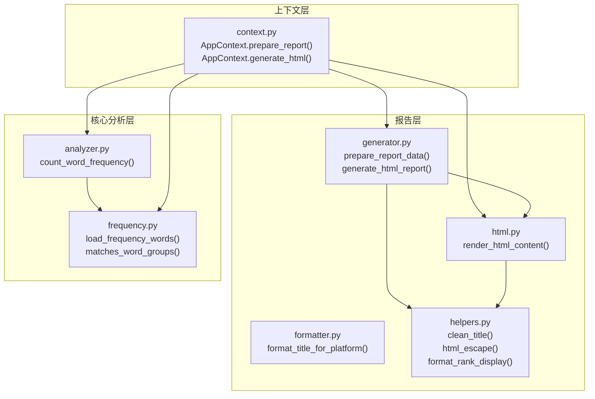
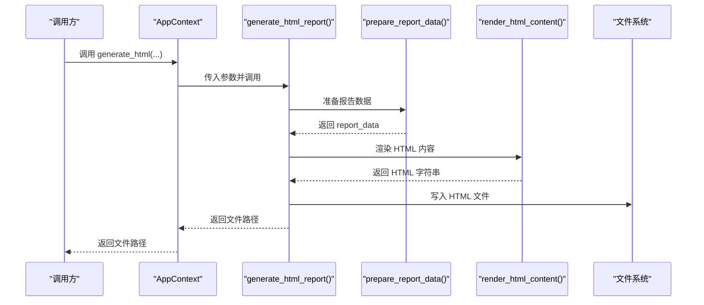
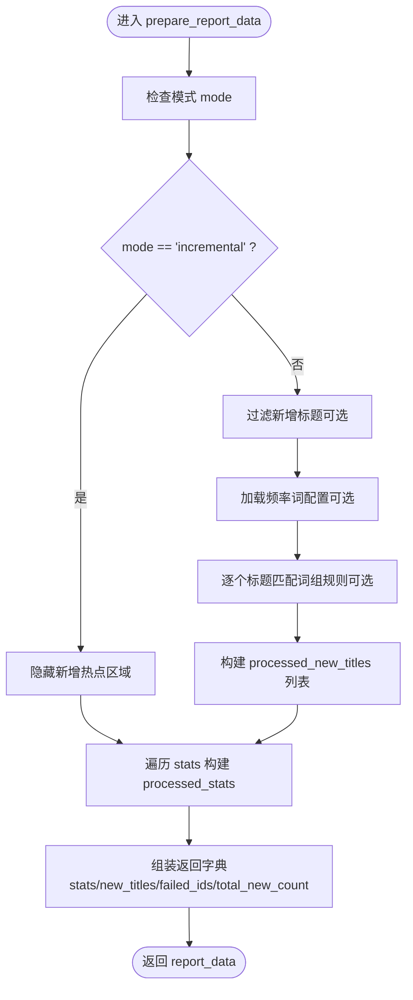
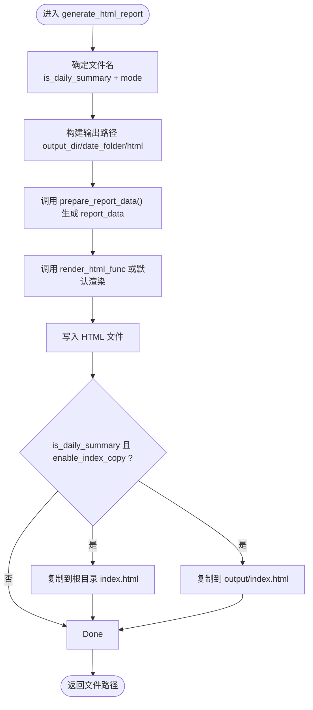
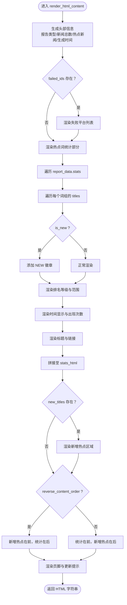
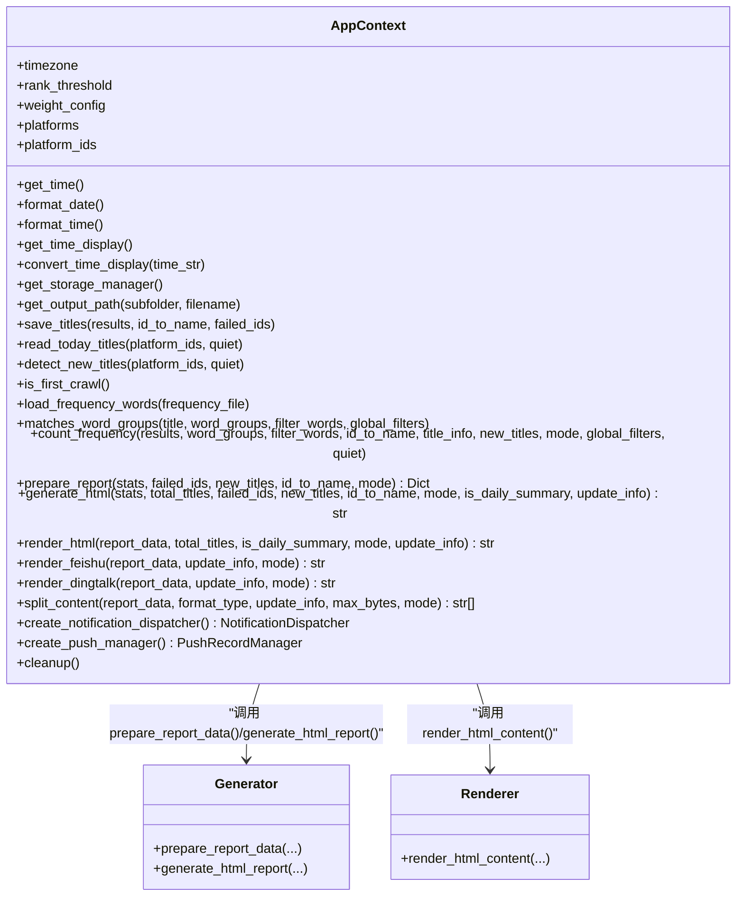
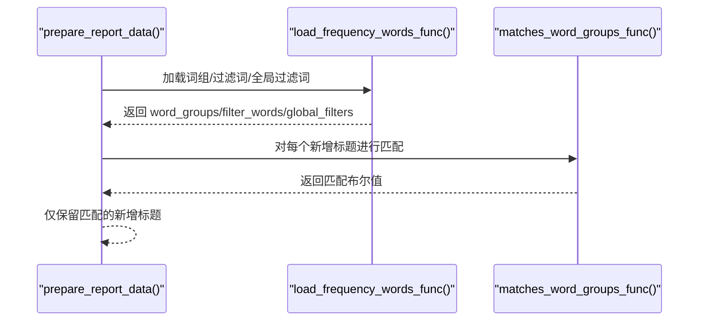
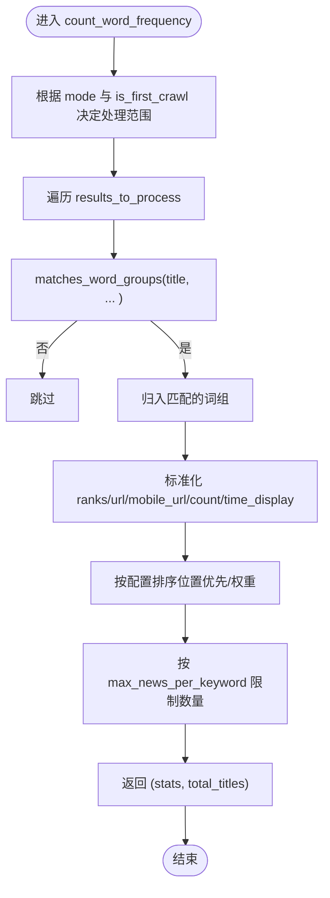
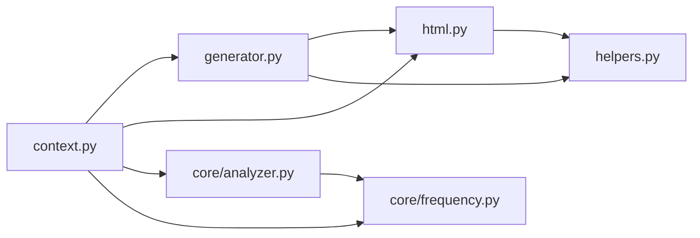

# 报告准备

<cite>
**本文引用的文件**
- [trendradar/report/generator.py](file://trendradar/report/generator.py)
- [trendradar/context.py](file://trendradar/context.py)
- [trendradar/report/html.py](file://trendradar/report/html.py)
- [trendradar/report/helpers.py](file://trendradar/report/helpers.py)
- [trendradar/report/formatter.py](file://trendradar/report/formatter.py)
- [trendradar/core/analyzer.py](file://trendradar/core/analyzer.py)
- [trendradar/core/frequency.py](file://trendradar/core/frequency.py)
</cite>

## 目录
1. [简介](#简介)
2. [项目结构](#项目结构)
3. [核心组件](#核心组件)
4. [架构总览](#架构总览)
5. [详细组件分析](#详细组件分析)
6. [依赖关系分析](#依赖关系分析)
7. [性能考量](#性能考量)
8. [故障排查指南](#故障排查指南)
9. [结论](#结论)

## 简介
本文件聚焦 TrendRadar 报告准备阶段，围绕两个关键函数展开：prepare_report_data() 与 generate_html_report()。文档将解释系统如何把核心分析输出的 stats 数据结构化为报告所需的数据模型，包括失败平台信息的整合、新增标题的标记与内容排序；同时阐述 HTML 报告的生成机制：模板渲染、CSS 样式应用与响应式设计，以及从分析结果到最终 HTML 输出的完整转换过程，结合 AppContext.prepare_report() 与 AppContext.generate_html() 方法进行串联说明。

## 项目结构
报告相关代码主要分布在以下模块：
- 报告生成器：负责数据准备与 HTML 生成
- 上下文封装：对外提供统一接口，协调各子模块
- HTML 渲染：负责模板渲染、样式与交互
- 辅助与格式化：提供清洗、转义、格式化等通用能力
- 核心分析：提供统计分析与词组匹配能力

图表来源
- [trendradar/report/generator.py](file://trendradar/report/generator.py#L1-L236)
- [trendradar/report/html.py](file://trendradar/report/html.py#L1-L1051)
- [trendradar/report/formatter.py](file://trendradar/report/formatter.py#L1-L224)
- [trendradar/report/helpers.py](file://trendradar/report/helpers.py#L1-L126)
- [trendradar/context.py](file://trendradar/context.py#L236-L307)
- [trendradar/core/analyzer.py](file://trendradar/core/analyzer.py#L90-L289)
- [trendradar/core/frequency.py](file://trendradar/core/frequency.py#L1-L95)

章节来源
- [trendradar/report/generator.py](file://trendradar/report/generator.py#L1-L236)
- [trendradar/context.py](file://trendradar/context.py#L236-L307)
- [trendradar/report/html.py](file://trendradar/report/html.py#L1-L1051)
- [trendradar/report/helpers.py](file://trendradar/report/helpers.py#L1-L126)
- [trendradar/report/formatter.py](file://trendradar/report/formatter.py#L1-L224)
- [trendradar/core/analyzer.py](file://trendradar/core/analyzer.py#L90-L289)
- [trendradar/core/frequency.py](file://trendradar/core/frequency.py#L1-L95)

## 核心组件
- prepare_report_data(stats, failed_ids, new_titles, id_to_name, mode, rank_threshold, matches_word_groups_func, load_frequency_words_func)
  - 功能：将核心分析输出的 stats 结构化为报告数据，整合失败平台信息，处理新增标题过滤与标记，计算 total_new_count。
  - 关键点：
    - 增量模式下隐藏新增热点区域。
    - 若提供匹配函数与频率词加载函数，则对新增标题进行词组过滤。
    - 对 stats 中的每个标题保留必要字段并标准化 is_new 标记。
    - 返回包含 stats、new_titles、failed_ids、total_new_count 的字典。
- generate_html_report(stats, total_titles, failed_ids, new_titles, id_to_name, mode, is_daily_summary, update_info, rank_threshold, output_dir, date_folder, time_filename, render_html_func, matches_word_groups_func, load_frequency_words_func, enable_index_copy)
  - 功能：根据配置生成 HTML 报告文件，支持每日汇总与时间文件命名，支持复制到根目录 index.html。
  - 关键点：
    - 依据 is_daily_summary 与 mode 选择文件名。
    - 调用 prepare_report_data() 生成报告数据。
    - 通过 render_html_func 渲染 HTML 内容，否则使用默认简单 HTML。
    - 写入文件并按需复制到根目录与 output 目录。

章节来源
- [trendradar/report/generator.py](file://trendradar/report/generator.py#L14-L137)
- [trendradar/report/generator.py](file://trendradar/report/generator.py#L140-L235)

## 架构总览
从分析结果到 HTML 输出的完整流程如下：

图表来源
- [trendradar/context.py](file://trendradar/context.py#L258-L287)
- [trendradar/report/generator.py](file://trendradar/report/generator.py#L140-L235)
- [trendradar/report/html.py](file://trendradar/report/html.py#L14-L1051)

章节来源
- [trendradar/context.py](file://trendradar/context.py#L236-L307)
- [trendradar/report/generator.py](file://trendradar/report/generator.py#L140-L235)
- [trendradar/report/html.py](file://trendradar/report/html.py#L14-L1051)

## 详细组件分析

### 函数 prepare_report_data() 数据准备流程
该函数负责将核心分析输出的 stats 结构化为报告可用的数据模型，并完成新增标题的过滤与标记、失败平台信息的整合与统计。

图表来源
- [trendradar/report/generator.py](file://trendradar/report/generator.py#L14-L137)

章节来源
- [trendradar/report/generator.py](file://trendradar/report/generator.py#L14-L137)

要点说明
- 新增标题过滤：当提供 matches_word_groups_func 与 load_frequency_words_func 时，会对 new_titles 按词组规则进行过滤，仅保留匹配项；否则保留全部。
- 新增标记：对新增标题设置 is_new=True，并保留 source_name、ranks、url、mobile_url 等字段。
- 失败平台整合：将 failed_ids 作为列表返回，便于后续渲染“请求失败的平台”区域。
- 统计数据标准化：对 stats 中的每个标题保留 title、source_name、time_display、count、ranks、rank_threshold、url、mobile_url、is_new 等字段，保证渲染一致性。
- 新增热点统计：计算 total_new_count，用于 HTML 渲染时显示“新增热点”总数。

### 函数 generate_html_report() HTML 生成流程
该函数负责根据 report_data 生成 HTML 文件，支持每日汇总与时间文件命名，支持复制到根目录 index.html。

图表来源
- [trendradar/report/generator.py](file://trendradar/report/generator.py#L140-L235)

章节来源
- [trendradar/report/generator.py](file://trendradar/report/generator.py#L140-L235)

要点说明
- 文件命名策略：每日汇总根据 mode 选择“当日汇总.html”、“当日增量.html”或“当前榜单汇总.html”，否则使用 time_filename。
- 输出目录：自动创建 output/date_folder/html。
- 渲染策略：若提供 render_html_func，则使用其渲染；否则使用默认简单 HTML。
- 索引复制：每日汇总且启用时，同时写入根目录与 output 目录的 index.html，便于静态托管访问。

### HTML 报告渲染机制
HTML 报告由 render_html_content() 完成，采用内联样式与响应式布局，支持保存为图片与分段保存。

图表来源
- [trendradar/report/html.py](file://trendradar/report/html.py#L14-L1051)

章节来源
- [trendradar/report/html.py](file://trendradar/report/html.py#L14-L1051)

要点说明
- 失败平台渲染：若 report_data["failed_ids"] 存在，渲染为错误区域，便于用户快速定位问题。
- 热点词统计：按词组聚合，统计 count 并按热度分级（hot/warm），为每条新闻编号。
- 新增热点：按来源分组，为每条新增新闻编号并显示排名等级。
- 排序控制：通过 reverse_content_order 控制内容顺序，满足“新增热点优先”的需求。
- 响应式设计：媒体查询适配移动端，按钮与排版在小屏设备上优化。
- 交互功能：提供“保存为图片”和“分段保存”功能，基于 html2canvas 实现截图与批量下载。

### 与 AppContext 的集成
AppContext 提供统一入口，将 prepare_report_data() 与 generate_html_report() 与上下文配置、时间格式化、存储管理等能力衔接起来。

图表来源
- [trendradar/context.py](file://trendradar/context.py#L236-L307)
- [trendradar/report/generator.py](file://trendradar/report/generator.py#L14-L235)
- [trendradar/report/html.py](file://trendradar/report/html.py#L14-L1051)

章节来源
- [trendradar/context.py](file://trendradar/context.py#L236-L307)

要点说明
- prepare_report()：封装 prepare_report_data() 调用，注入 rank_threshold、id_to_name、mode、匹配与频率词加载函数。
- generate_html()：封装 generate_html_report() 调用，注入输出目录、日期文件夹、时间文件名、渲染函数、匹配与频率词加载函数，并启用索引复制。
- render_html()：封装 render_html_content() 调用，注入 reverse_content_order、get_time_func 等上下文配置。

### 词组匹配与频率词加载
prepare_report_data() 支持通过 matches_word_groups_func 与 load_frequency_words_func 对新增标题进行词组过滤，从而提升报告质量与相关性。

图表来源
- [trendradar/report/generator.py](file://trendradar/report/generator.py#L40-L70)
- [trendradar/core/frequency.py](file://trendradar/core/frequency.py#L1-L95)

章节来源
- [trendradar/report/generator.py](file://trendradar/report/generator.py#L40-L70)
- [trendradar/core/frequency.py](file://trendradar/core/frequency.py#L1-L95)

要点说明
- 词组加载：从配置文件解析词组、必须词、过滤词与全局过滤词。
- 标题匹配：逐标题进行词组匹配，未匹配则过滤掉，减少噪声。
- 过滤统计：打印原始与过滤后的新增热点数量，便于核对效果。

### 统计分析与数据来源
核心分析模块提供 count_word_frequency()，产出 stats 数据结构，供 prepare_report_data() 使用。

图表来源
- [trendradar/core/analyzer.py](file://trendradar/core/analyzer.py#L90-L289)
- [trendradar/core/frequency.py](file://trendradar/core/frequency.py#L1-L95)

章节来源
- [trendradar/core/analyzer.py](file://trendradar/core/analyzer.py#L90-L289)
- [trendradar/core/frequency.py](file://trendradar/core/frequency.py#L1-L95)

要点说明
- 增量/当前/当日模式：决定处理范围与是否标记新增。
- 词组匹配：支持必须词、普通词、过滤词与全局过滤词。
- 排序与限制：支持按位置优先与权重排序，并限制每词组最大显示数量。
- 输出结构：返回 stats 列表与 total_titles，供报告层消费。

## 依赖关系分析
- prepare_report_data() 依赖：
  - AppContext 的 matches_word_groups 与 load_frequency_words（可选），用于新增标题过滤。
  - helpers.html_escape、format_rank_display（间接通过 HTML 渲染层使用）。
- generate_html_report() 依赖：
  - AppContext 的 render_html（lambda 包装），用于渲染 HTML。
  - 文件系统写入与目录创建。
- HTML 渲染依赖：
  - helpers.clean_title、html_escape、format_rank_display。
  - html2canvas（内嵌脚本）用于截图保存。
- 上下文依赖：
  - AppContext 将配置、时间、存储、通知等功能统一封装，降低耦合。

图表来源
- [trendradar/report/generator.py](file://trendradar/report/generator.py#L1-L236)
- [trendradar/report/html.py](file://trendradar/report/html.py#L1-L1051)
- [trendradar/report/helpers.py](file://trendradar/report/helpers.py#L1-L126)
- [trendradar/context.py](file://trendradar/context.py#L236-L307)
- [trendradar/core/analyzer.py](file://trendradar/core/analyzer.py#L90-L289)
- [trendradar/core/frequency.py](file://trendradar/core/frequency.py#L1-L95)

章节来源
- [trendradar/report/generator.py](file://trendradar/report/generator.py#L1-L236)
- [trendradar/report/html.py](file://trendradar/report/html.py#L1-L1051)
- [trendradar/report/helpers.py](file://trendradar/report/helpers.py#L1-L126)
- [trendradar/context.py](file://trendradar/context.py#L236-L307)
- [trendradar/core/analyzer.py](file://trendradar/core/analyzer.py#L90-L289)
- [trendradar/core/frequency.py](file://trendradar/core/frequency.py#L1-L95)

## 性能考量
- 新增标题过滤：在 prepare_report_data() 中对新增标题进行词组过滤，减少后续渲染负担，提升报告相关性。
- 统计与排序：在核心分析阶段完成排序与限制，避免在渲染层重复计算。
- HTML 渲染：采用内联样式与一次性拼接，减少外部依赖；保存为图片采用 html2canvas，注意网络与跨域设置。
- 文件写入：批量写入与索引复制在同一流程中完成，避免多次 IO。

## 故障排查指南
- 新增热点数量异常
  - 检查频率词配置是否正确加载与生效。
  - 查看 prepare_report_data() 中过滤日志输出，确认原始与过滤后的数量差异。
- 失败平台未显示
  - 确认 failed_ids 是否传入 report_data。
  - 检查 HTML 渲染中错误区域的条件分支。
- 排名显示不正确
  - 检查 rank_threshold 与 ranks 数据来源。
  - 确认 HTML 渲染中排名等级判定逻辑。
- 保存为图片失败
  - 检查 html2canvas 脚本加载与跨域设置。
  - 确认容器尺寸与滚动区域，避免截图空白。

章节来源
- [trendradar/report/generator.py](file://trendradar/report/generator.py#L40-L70)
- [trendradar/report/html.py](file://trendradar/report/html.py#L525-L560)
- [trendradar/report/html.py](file://trendradar/report/html.py#L740-L809)
- [trendradar/report/html.py](file://trendradar/report/html.py#L811-L1040)

## 结论
prepare_report_data() 与 generate_html_report() 构成了报告准备阶段的核心链路：前者将核心分析输出的 stats 结构化并整合失败平台与新增标题，后者将结构化数据渲染为 HTML 并持久化输出。通过 AppContext 的统一封装，系统实现了从分析结果到最终 HTML 输出的完整闭环，具备良好的扩展性与可维护性。配合响应式设计与图片保存功能，报告具备较强的可读性与实用性。