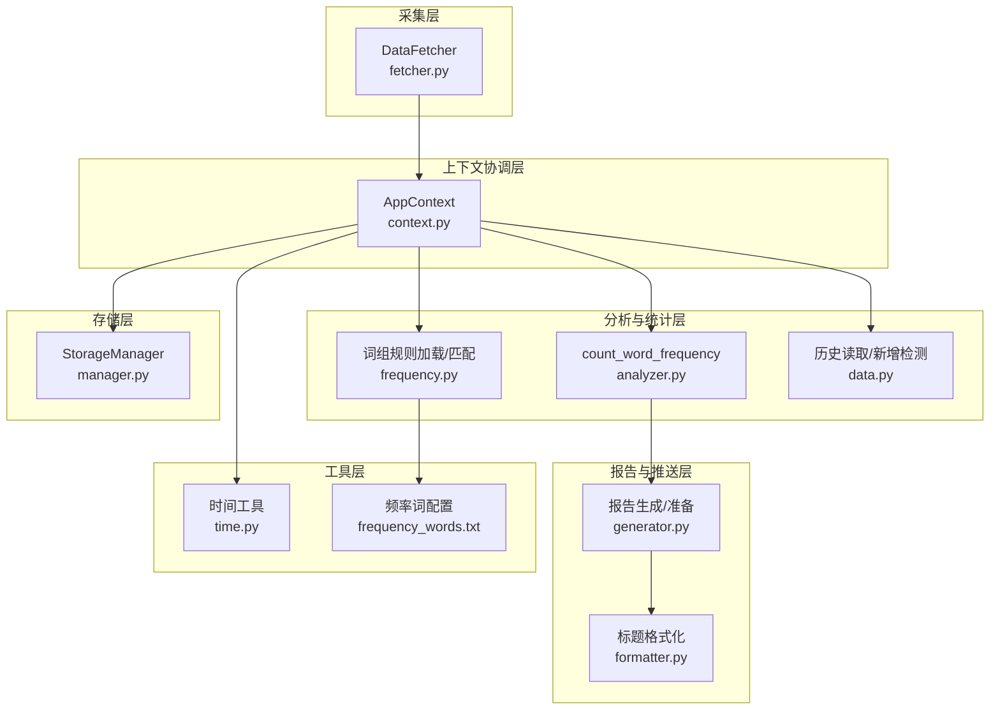
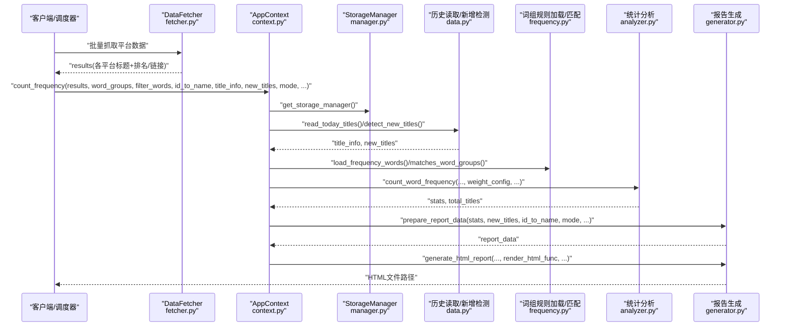
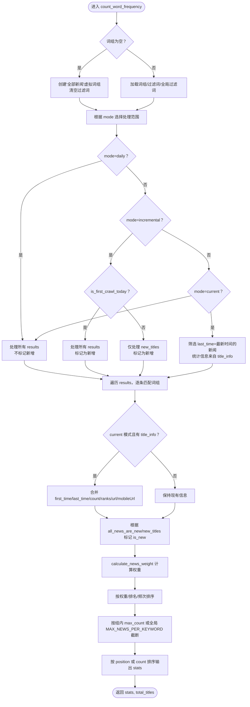
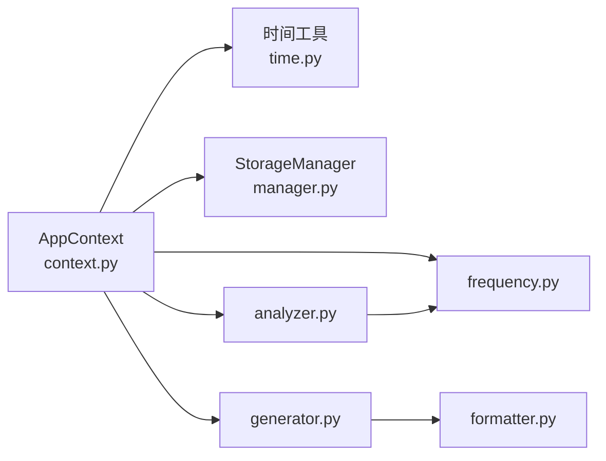

# 数据流

<cite>
**本文引用的文件**
- [context.py](file://trendradar/context.py)
- [analyzer.py](file://trendradar/core/analyzer.py)
- [fetcher.py](file://trendradar/crawler/fetcher.py)
- [frequency.py](file://trendradar/core/frequency.py)
- [data.py](file://trendradar/core/data.py)
- [generator.py](file://trendradar/report/generator.py)
- [manager.py](file://trendradar/storage/manager.py)
- [formatter.py](file://trendradar/report/formatter.py)
- [time.py](file://trendradar/utils/time.py)
- [frequency_words.txt](file://config/frequency_words.txt)
</cite>

## 目录
1. [简介](#简介)
2. [项目结构](#项目结构)
3. [核心组件](#核心组件)
4. [架构总览](#架构总览)
5. [详细组件分析](#详细组件分析)
6. [依赖关系分析](#依赖关系分析)
7. [性能考量](#性能考量)
8. [故障排查指南](#故障排查指南)
9. [结论](#结论)

## 简介
本文件围绕 TrendRadar 的数据流生命周期展开，重点以 count_word_frequency 为核心，系统梳理从数据采集、历史数据读取、增量检测、词频统计、权重计算、报告准备到 HTML 生成的完整链路。同时，明确 mode 参数（daily/incremental/current）对数据流的控制逻辑，以及 frequency_words.txt 与 WEIGHT_CONFIG 在规则与排序中的作用。

## 项目结构
- 数据采集层：crawler/fetcher.py 通过 API 获取各平台原始数据，形成 results。
- 上下文与协调层：trendradar/context.py 提供 AppContext，封装配置、时间、存储、统计与报告生成等统一入口。
- 分析与统计层：trendradar/core/analyzer.py 实现权重计算与统计排序；trendradar/core/frequency.py 负责词组规则加载与匹配；trendradar/core/data.py 提供历史数据读取与新增检测。
- 报告与推送层：trendradar/report/generator.py 生成报告数据与 HTML；trendradar/report/formatter.py 统一标题格式化；notification 模块负责推送渲染与分发。
- 存储层：trendradar/storage/manager.py 统一管理本地/远程存储后端，提供读取、保存、检测新增等功能。
- 工具层：trendradar/utils/time.py 提供时间相关工具。

图表来源
- [fetcher.py](file://trendradar/crawler/fetcher.py#L1-L185)
- [context.py](file://trendradar/context.py#L1-L391)
- [analyzer.py](file://trendradar/core/analyzer.py#L1-L473)
- [frequency.py](file://trendradar/core/frequency.py#L1-L195)
- [data.py](file://trendradar/core/data.py#L1-L306)
- [generator.py](file://trendradar/report/generator.py#L1-L236)
- [formatter.py](file://trendradar/report/formatter.py#L1-L224)
- [manager.py](file://trendradar/storage/manager.py#L1-L344)
- [time.py](file://trendradar/utils/time.py#L1-L92)
- [frequency_words.txt](file://config/frequency_words.txt#L1-L114)

章节来源
- [context.py](file://trendradar/context.py#L1-L391)
- [analyzer.py](file://trendradar/core/analyzer.py#L1-L473)
- [fetcher.py](file://trendradar/crawler/fetcher.py#L1-L185)
- [frequency.py](file://trendradar/core/frequency.py#L1-L195)
- [data.py](file://trendradar/core/data.py#L1-L306)
- [generator.py](file://trendradar/report/generator.py#L1-L236)
- [manager.py](file://trendradar/storage/manager.py#L1-L344)
- [formatter.py](file://trendradar/report/formatter.py#L1-L224)
- [time.py](file://trendradar/utils/time.py#L1-L92)
- [frequency_words.txt](file://config/frequency_words.txt#L1-L114)

## 核心组件
- AppContext：集中管理配置、时间、存储、统计与报告生成，提供统一接口。
- DataFetcher：从外部 API 抓取各平台原始数据，构造 results。
- 词组规则：frequency_words.txt 定义词组/必须词/过滤词/全局过滤词/最大显示数量，frequency.py 加载并匹配。
- 统计分析：count_word_frequency 根据 mode 控制处理范围，结合权重配置计算权重并排序。
- 历史与新增：read_all_today_titles 读取历史统计，detect_latest_new_titles 检测最新批次新增。
- 报告生成：prepare_report_data 与 generate_html_report 组织数据并生成 HTML。

章节来源
- [context.py](file://trendradar/context.py#L160-L310)
- [analyzer.py](file://trendradar/core/analyzer.py#L90-L473)
- [frequency.py](file://trendradar/core/frequency.py#L18-L195)
- [data.py](file://trendradar/core/data.py#L152-L306)
- [generator.py](file://trendradar/report/generator.py#L14-L236)

## 架构总览
下面以 sequence 图展示从采集到推送的关键流程，强调 results、title_info、new_titles 作为输入，word_groups 与 weight_config 作为规则与排序依据，最终输出 stats。

图表来源
- [fetcher.py](file://trendradar/crawler/fetcher.py#L117-L185)
- [context.py](file://trendradar/context.py#L169-L235)
- [data.py](file://trendradar/core/data.py#L152-L306)
- [frequency.py](file://trendradar/core/frequency.py#L18-L195)
- [analyzer.py](file://trendradar/core/analyzer.py#L90-L473)
- [generator.py](file://trendradar/report/generator.py#L140-L236)

## 详细组件分析

### 组件A：count_word_frequency 数据流与模式控制
- 输入
  - results：抓取结果，结构为 {source_id: {title: title_data}}，其中 title_data 包含 ranks/url/mobileUrl 等。
  - title_info：历史统计信息，包含 first_time/last_time/count/ranks/url/mobileUrl。
  - new_titles：最新批次新增标题，结构同上。
  - word_groups/filter_words/global_filters：来自 frequency_words.txt 的词组规则。
  - weight_config：权重配置，包含 RANK_WEIGHT/FREQUENCY_WEIGHT/HOTNESS_WEIGHT。
  - mode：daily/incremental/current。
- 处理逻辑
  - 词组为空时，自动创建“全部新闻”虚拟词组并清空过滤词，实现全量显示。
  - mode 控制处理范围与新增标记：
    - daily：处理所有新闻，不标记新增。
    - incremental：当 is_first_crawl_today 为真时，将处理的所有新闻标记为新增；否则仅处理 new_titles 并标记新增。
    - current：仅处理 last_time 等于最新时间的新闻，统计信息来自 title_info。
  - 词组匹配：先做全局过滤与过滤词过滤，再按 required/normal 词组匹配。
  - 历史信息融合：current 模式下从 title_info 合并 first_time/last_time/count/ranks/url/mobileUrl。
  - 新增标记：根据 all_news_are_new 或 new_titles 中的记录判断 is_new。
  - 权重计算：calculate_news_weight 基于排名、频次与热度（阈值内的高排名占比）加权求和，再按配置权重归一化。
  - 排序：优先按权重降序，其次按最小排名升序，再次按出现次数降序；随后按配置 position 或 count 排序。
  - 最大显示数量：按 group.max_count > 0 优先使用组内限制，否则使用全局 MAX_NEWS_PER_KEYWORD。
- 输出
  - stats：按组聚合的统计结果，每组包含 word/count/position/titles（titles 已按权重排序并截断）。
  - total_titles：输入新闻总数。

图表来源
- [analyzer.py](file://trendradar/core/analyzer.py#L90-L473)
- [frequency.py](file://trendradar/core/frequency.py#L18-L195)
- [data.py](file://trendradar/core/data.py#L152-L306)

章节来源
- [analyzer.py](file://trendradar/core/analyzer.py#L90-L473)
- [frequency.py](file://trendradar/core/frequency.py#L18-L195)
- [data.py](file://trendradar/core/data.py#L152-L306)

### 组件B：词组规则与权重配置
- 词组规则加载
  - frequency_words.txt 按空行分组，支持普通词、必须词（+前缀）、过滤词（!前缀）、最大显示数量（@数字）。
  - 支持 [GLOBAL_FILTER] 区域定义全局过滤词。
  - load_frequency_words 返回 word_groups/filter_words/global_filters。
- 词组匹配
  - matches_word_groups 先做全局过滤与过滤词过滤，再检查 required/normal 词组。
- 权重配置
  - WEIGHT_CONFIG 由 AppContext.weight_config 提供，包含 RANK_WEIGHT/FREQUENCY_WEIGHT/HOTNESS_WEIGHT。
  - calculate_news_weight 将排名、频次与热度加权组合，作为排序主因子。

章节来源
- [frequency.py](file://trendradar/core/frequency.py#L18-L195)
- [frequency_words.txt](file://config/frequency_words.txt#L1-L114)
- [analyzer.py](file://trendradar/core/analyzer.py#L16-L88)
- [context.py](file://trendradar/context.py#L88-L92)

### 组件C：历史数据与新增检测
- 历史读取
  - read_all_today_titles 从存储后端读取当天所有标题，返回 all_results/id_to_name/title_info。
- 新增检测
  - detect_latest_new_titles 通过比较最新批次与历史数据，得到 new_titles。
  - 判断逻辑：若某标题在历史中首次出现时间早于最新批次，则视为历史；最新批次中不在历史集合中的标题即为新增。
- 首次爬取检测
  - is_first_crawl_today 通过扫描当天 txt 快照数量判断是否当天第一次抓取。

章节来源
- [data.py](file://trendradar/core/data.py#L152-L306)
- [manager.py](file://trendradar/storage/manager.py#L180-L235)

### 组件D：报告准备与 HTML 生成
- prepare_report_data
  - 根据 mode 决定是否隐藏新增区域（incremental 模式隐藏）。
  - 若提供 matches_word_groups_func/load_frequency_words_func，会对新增标题进行词组过滤。
  - 生成 processed_stats 与 processed_new_titles，便于渲染。
- generate_html_report
  - 生成报告数据后，调用 render_html_func 渲染 HTML 内容，写入文件并可复制到 index.html。

章节来源
- [generator.py](file://trendradar/report/generator.py#L14-L236)

### 组件E：标题格式化与推送
- format_title_for_platform
  - 针对不同平台（飞书、钉钉、Slack、Telegram、HTML 等）统一格式化标题，包含来源、链接、排名、时间、出现次数与新增标识。
- AppContext.render_feishu/render_dingtalk/split_content
  - 提供通知内容渲染与分批策略，结合配置决定分隔符、顺序与大小限制。

章节来源
- [formatter.py](file://trendradar/report/formatter.py#L1-L224)
- [context.py](file://trendradar/context.py#L309-L365)

## 依赖关系分析
- AppContext 依赖
  - 时间工具：get_time/format_date/format_time/get_time_display/convert_time_for_display。
  - 存储管理：get_storage_manager/read_today_titles/detect_new_titles/is_first_crawl。
  - 词组规则：load_frequency_words/matches_word_groups。
  - 统计分析：count_word_frequency。
  - 报告生成：prepare_report_data/generate_html_report/render_html。
- Analyzer 依赖
  - frequency.matches_word_groups：词组匹配。
  - utils.time.format_time_display：时间显示格式化。
- StorageManager 依赖
  - 本地/远程后端：统一保存、读取、检测新增、清理等能力。
- Report 依赖
  - formatter.format_title_for_platform：跨平台标题格式化。
  - generator.prepare_report_data/generate_html_report：报告数据与 HTML 生成。

图表来源
- [context.py](file://trendradar/context.py#L1-L391)
- [analyzer.py](file://trendradar/core/analyzer.py#L1-L473)
- [frequency.py](file://trendradar/core/frequency.py#L1-L195)
- [data.py](file://trendradar/core/data.py#L1-L306)
- [generator.py](file://trendradar/report/generator.py#L1-L236)
- [formatter.py](file://trendradar/report/formatter.py#L1-L224)
- [manager.py](file://trendradar/storage/manager.py#L1-L344)
- [time.py](file://trendradar/utils/time.py#L1-L92)

章节来源
- [context.py](file://trendradar/context.py#L1-L391)
- [analyzer.py](file://trendradar/core/analyzer.py#L1-L473)
- [frequency.py](file://trendradar/core/frequency.py#L1-L195)
- [data.py](file://trendradar/core/data.py#L1-L306)
- [generator.py](file://trendradar/report/generator.py#L1-L236)
- [formatter.py](file://trendradar/report/formatter.py#L1-L224)
- [manager.py](file://trendradar/storage/manager.py#L1-L344)
- [time.py](file://trendradar/utils/time.py#L1-L92)

## 性能考量
- 网络与重试：DataFetcher 对单个平台请求具备指数回退与随机抖动，降低 API 压力与失败风险。
- 排序复杂度：统计阶段对每组 titles 做一次排序，整体复杂度近似 O(N log N)，其中 N 为匹配后的新闻条数。
- 截断策略：按组内 max_count 或全局 MAX_NEWS_PER_KEYWORD 截断，避免输出膨胀。
- I/O 优化：历史读取与新增检测基于存储后端的批量查询与集合差集，减少重复扫描。
- 报告生成：prepare_report_data 与 generate_html_report 采用一次性构建与写盘，适合静态页面发布。

[本节为通用建议，无需列出具体文件来源]

## 故障排查指南
- 词组规则问题
  - 确认 frequency_words.txt 路径与格式正确，必要时设置 FREQUENCY_WORDS_PATH 环境变量。
  - 检查 [GLOBAL_FILTER]/[WORD_GROUPS] 区域语法，过滤词与必须词前缀是否正确。
- 新增检测异常
  - 若 detect_latest_new_titles 返回空，确认当天历史数据是否存在，以及 latest_time 与 first_time 的判定逻辑是否符合预期。
- 权重配置无效
  - 确认 WEIGHT_CONFIG 是否正确注入到 AppContext.weight_config，并在 count_word_frequency 中生效。
- 报告生成失败
  - 检查 generate_html_report 的输出目录权限与磁盘空间；确认 render_html_func 可用。
- 首次爬取误判
  - is_first_crawl_today 基于 txt 快照数量判断，若输出目录结构异常可能导致误判。

章节来源
- [frequency.py](file://trendradar/core/frequency.py#L18-L195)
- [data.py](file://trendradar/core/data.py#L288-L306)
- [generator.py](file://trendradar/report/generator.py#L140-L236)
- [context.py](file://trendradar/context.py#L88-L92)

## 结论
TrendRadar 的数据流以 AppContext 为中心，围绕 count_word_frequency 构建了从采集、历史与新增检测、词组匹配、权重计算与排序、到报告生成与推送的闭环。mode 参数灵活控制处理范围与新增标记，配合词组规则与权重配置，实现了可定制、可扩展的趋势分析与可视化输出。通过合理的依赖解耦与模块职责划分，系统在可维护性与性能之间取得平衡。