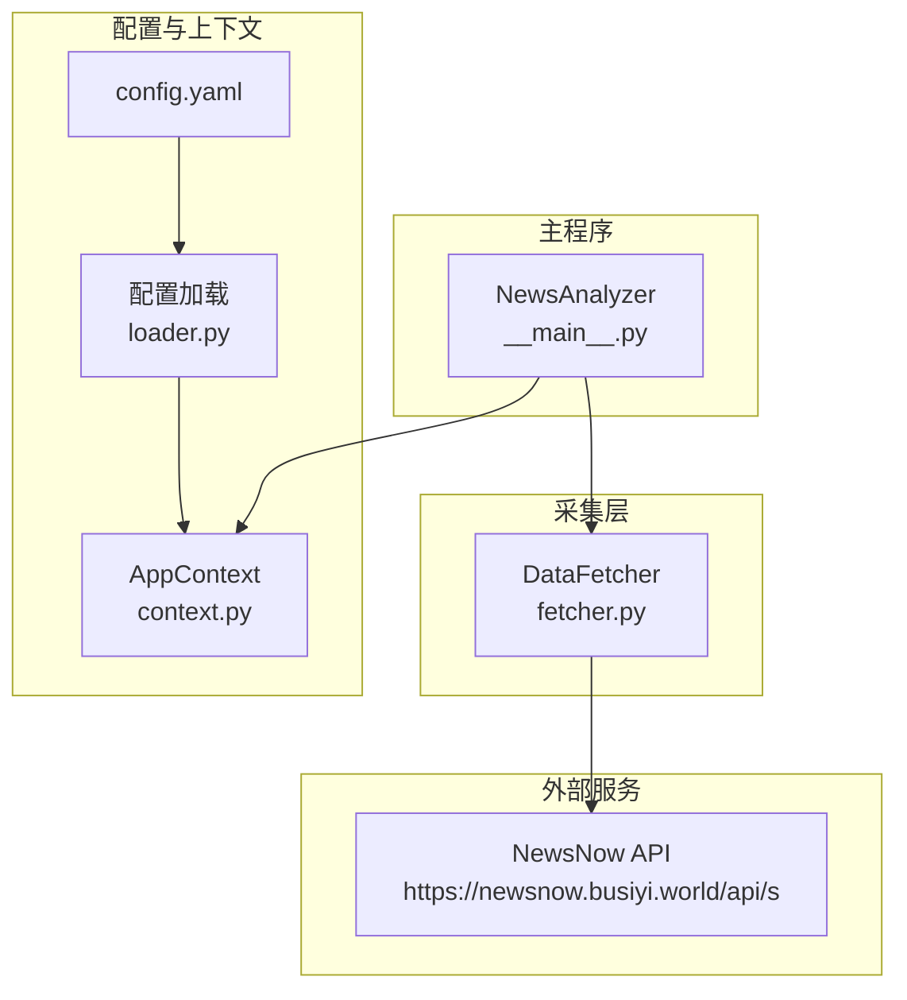
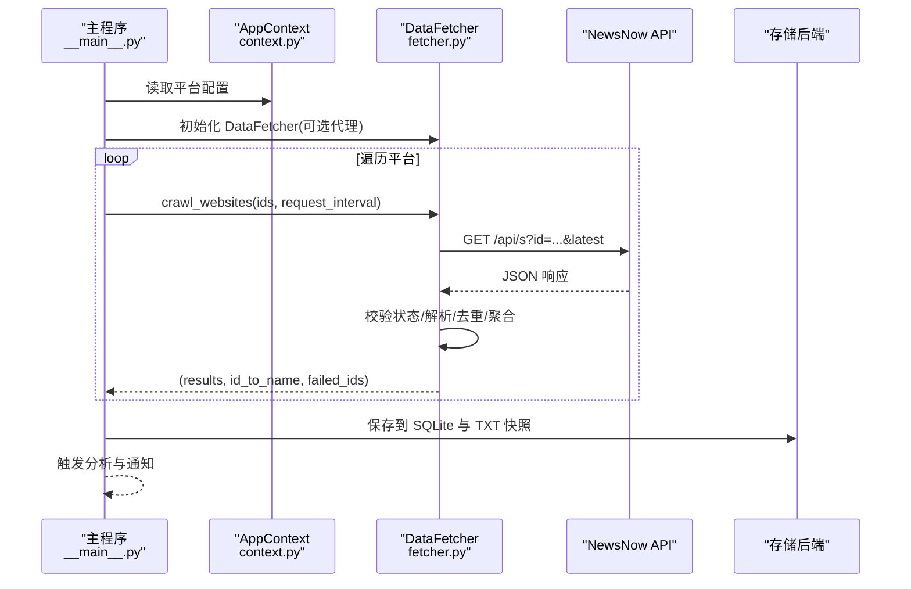
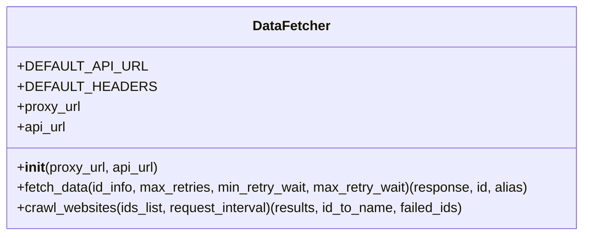
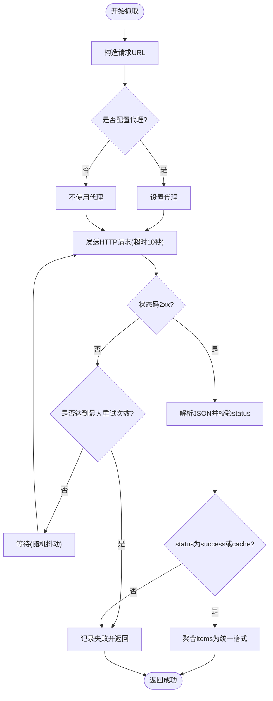
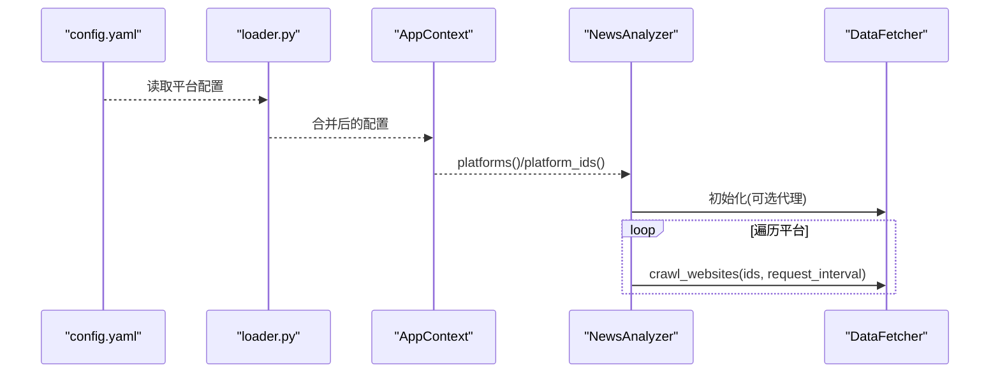
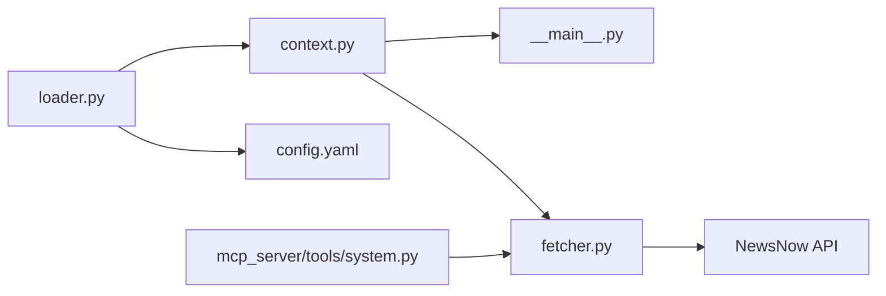

# 数据采集

<cite>
**本文引用的文件**
- [fetcher.py](file://trendradar/crawler/fetcher.py)
- [context.py](file://trendradar/context.py)
- [config.yaml](file://config/config.yaml)
- [loader.py](file://trendradar/core/loader.py)
- [__main__.py](file://trendradar/__main__.py)
- [system.py](file://mcp_server/tools/system.py)
</cite>

## 目录
1. [简介](#简介)
2. [项目结构](#项目结构)
3. [核心组件](#核心组件)
4. [架构总览](#架构总览)
5. [详细组件分析](#详细组件分析)
6. [依赖关系分析](#依赖关系分析)
7. [性能与稳定性](#性能与稳定性)
8. [故障排查指南](#故障排查指南)
9. [结论](#结论)
10. [附录](#附录)

## 简介
本文件聚焦 TrendRadar 数据采集模块，系统性阐述 `fetcher.py` 中实现的多平台热搜数据抓取机制。文档说明如何通过 HTTP 请求从知乎、微博、抖音等11个平台获取原始数据，解析响应内容并结构化为统一的数据格式；解释爬虫调度逻辑，包括重试机制、超时处理和错误恢复策略；结合 `AppContext` 的 `platforms()` 方法，展示如何根据 `config.yaml` 的平台配置动态初始化爬虫实例；提供实际代码示例路径，演示数据采集的完整流程，并说明采集频率控制和反爬虫应对措施。

## 项目结构
围绕数据采集的关键文件与职责如下：
- trendradar/crawler/fetcher.py：实现 DataFetcher 类，负责 HTTP 请求、重试、解析与批量抓取。
- trendradar/context.py：提供 AppContext，暴露平台配置、时间工具、存储管理等能力。
- config/config.yaml：定义平台清单、爬虫参数、通知与存储等配置。
- trendradar/core/loader.py：加载配置文件与环境变量，合并为运行时配置。
- trendradar/__main__.py：主程序入口，组织“采集-分析-通知”全流程。
- mcp_server/tools/system.py：MCP 场景下的临时爬取示例，展示如何使用 DataFetcher。

图表来源
- [fetcher.py](file://trendradar/crawler/fetcher.py#L1-L185)
- [context.py](file://trendradar/context.py#L93-L102)
- [loader.py](file://trendradar/core/loader.py#L275-L333)
- [config.yaml](file://config/config.yaml#L163-L187)
- [__main__.py](file://trendradar/__main__.py#L531-L571)

章节来源
- [fetcher.py](file://trendradar/crawler/fetcher.py#L1-L185)
- [context.py](file://trendradar/context.py#L93-L102)
- [config.yaml](file://config/config.yaml#L163-L187)
- [loader.py](file://trendradar/core/loader.py#L275-L333)
- [__main__.py](file://trendradar/__main__.py#L531-L571)

## 核心组件
- DataFetcher：封装 HTTP 请求、重试、解析与批量抓取逻辑，支持代理与请求间隔控制。
- AppContext.platforms：从配置中读取平台列表，供主程序与 MCP 工具使用。
- 配置加载：从 config.yaml 与环境变量合并配置，包含爬虫参数、平台清单等。
- 主程序入口：统一调度采集、转换、存储与通知。

章节来源
- [fetcher.py](file://trendradar/crawler/fetcher.py#L20-L185)
- [context.py](file://trendradar/context.py#L93-L102)
- [loader.py](file://trendradar/core/loader.py#L275-L333)
- [config.yaml](file://config/config.yaml#L53-L58)

## 架构总览
数据采集的整体流程：
1. 读取配置（config.yaml + 环境变量）。
2. 通过 AppContext 获取平台配置列表。
3. 初始化 DataFetcher（可选代理、API 基础地址）。
4. 对每个平台发起 HTTP 请求，解析 JSON，校验状态。
5. 结构化为统一数据格式，记录失败平台。
6. 保存到存储后端（SQLite）与 TXT 快照（可选）。
7. 触发分析与通知（由主程序统一调度）。

图表来源
- [__main__.py](file://trendradar/__main__.py#L531-L571)
- [fetcher.py](file://trendradar/crawler/fetcher.py#L117-L185)
- [context.py](file://trendradar/context.py#L93-L102)

## 详细组件分析

### DataFetcher 类与抓取流程
DataFetcher 提供两类关键能力：
- 单平台抓取：fetch_data(id_info, max_retries, min_retry_wait, max_retry_wait)
- 批量抓取：crawl_websites(ids_list, request_interval)

实现要点：
- 默认 API 基础地址与通用请求头。
- 支持代理（http/https）。
- 单平台抓取包含指数退避重试与随机抖动，超时 10 秒。
- 批量抓取按请求间隔（毫秒）随机扰动，避免被限流。
- 响应解析与校验：要求 status 字段为 success 或 cache；解析 items 列表，清洗标题并聚合相同标题的排名。
- 失败处理：JSON 解析失败或异常时记录失败平台。

图表来源
- [fetcher.py](file://trendradar/crawler/fetcher.py#L20-L185)

章节来源
- [fetcher.py](file://trendradar/crawler/fetcher.py#L20-L116)
- [fetcher.py](file://trendradar/crawler/fetcher.py#L117-L185)

### 爬取调度与重试机制
- 单平台重试：最大重试次数、最小/最大等待时间，采用随机均匀分布与递增抖动，避免同时重试导致雪崩。
- 批量请求间隔：请求间隔毫秒级，加入 [-10, 20] 的随机扰动，最小不低于 50ms，降低被限速概率。
- 超时控制：单次请求超时 10 秒，防止阻塞。
- 错误恢复：JSON 解析失败或业务状态异常时记录失败平台，不影响其他平台继续抓取。

图表来源
- [fetcher.py](file://trendradar/crawler/fetcher.py#L50-L116)
- [fetcher.py](file://trendradar/crawler/fetcher.py#L117-L185)

章节来源
- [fetcher.py](file://trendradar/crawler/fetcher.py#L50-L116)
- [fetcher.py](file://trendradar/crawler/fetcher.py#L117-L185)

### 平台配置与动态初始化
- 平台配置来源于 config.yaml 的 platforms 列表，包含 id 与 name。
- AppContext.platforms 属性返回配置列表；AppContext.platform_ids 返回平台 ID 列表。
- 主程序入口 NewsAnalyzer 在采集阶段遍历 AppContext.platforms，组装 (id, name) 元组传给 DataFetcher。
- MCP 工具 system.py 中也展示了如何基于 crawler 配置初始化 DataFetcher 并执行抓取。

图表来源
- [config.yaml](file://config/config.yaml#L163-L187)
- [loader.py](file://trendradar/core/loader.py#L300-L333)
- [context.py](file://trendradar/context.py#L93-L102)
- [__main__.py](file://trendradar/__main__.py#L531-L571)
- [system.py](file://mcp_server/tools/system.py#L140-L171)

章节来源
- [config.yaml](file://config/config.yaml#L163-L187)
- [context.py](file://trendradar/context.py#L93-L102)
- [__main__.py](file://trendradar/__main__.py#L531-L571)
- [system.py](file://mcp_server/tools/system.py#L140-L171)

### 数据结构化与统一格式
- 输入：每个平台返回的 JSON，包含 items 列表。
- 输出：统一结构
  - results[id][title] = {
      "ranks": [index...],
      "url": "...",
      "mobileUrl": "...",
    }
- 标题清洗：跳过 None、浮点型、空字符串或纯空白标题；去空白。
- 去重与聚合：相同标题合并，累积排名列表；保留首个 URL 与移动端 URL。

章节来源
- [fetcher.py](file://trendradar/crawler/fetcher.py#L140-L175)

### 采集频率控制与反爬虫应对
- 请求间隔：crawl_websites 使用 request_interval（毫秒），并在相邻请求间加入 [-10, 20] 的随机抖动，最小不低于 50ms。
- 代理支持：可通过配置启用代理，减少 IP 被封风险。
- 重试与退避：指数退避 + 随机抖动，降低集中重试的概率。
- 超时控制：单请求 10 秒，避免长时间阻塞。
- 状态校验：仅接受 status 为 success 或 cache 的响应，异常直接失败并重试。

章节来源
- [fetcher.py](file://trendradar/crawler/fetcher.py#L117-L185)
- [config.yaml](file://config/config.yaml#L53-L58)

## 依赖关系分析
- DataFetcher 依赖 requests 发送 HTTP 请求，依赖 json 解析响应。
- 主程序 NewsAnalyzer 依赖 AppContext 获取平台配置与存储管理器，依赖 DataFetcher 执行抓取。
- 配置加载 loader.py 从 config.yaml 与环境变量合并配置，供 AppContext 使用。
- MCP 工具 system.py 也依赖 DataFetcher 与配置中的 crawler 段。

图表来源
- [loader.py](file://trendradar/core/loader.py#L275-L333)
- [context.py](file://trendradar/context.py#L93-L102)
- [__main__.py](file://trendradar/__main__.py#L531-L571)
- [fetcher.py](file://trendradar/crawler/fetcher.py#L20-L185)
- [system.py](file://mcp_server/tools/system.py#L140-L171)

章节来源
- [loader.py](file://trendradar/core/loader.py#L275-L333)
- [context.py](file://trendradar/context.py#L93-L102)
- [__main__.py](file://trendradar/__main__.py#L531-L571)
- [fetcher.py](file://trendradar/crawler/fetcher.py#L20-L185)
- [system.py](file://mcp_server/tools/system.py#L140-L171)

## 性能与稳定性
- 并发与限速：批量抓取通过请求间隔与抖动控制整体速率，避免触发平台限流。
- 重试策略：指数退避 + 随机抖动，降低网络抖动与平台限流叠加的风险。
- 超时与失败：单请求 10 秒超时，失败平台单独记录，不影响其他平台。
- 存储与输出：采集完成后统一保存到 SQLite 与 TXT 快照，便于后续分析与回溯。

[本节为通用指导，无需列出具体文件来源]

## 故障排查指南
常见问题与定位思路：
- 代理配置无效：确认 config.yaml 中 use_proxy 与 default_proxy 设置；MCP 工具中也需检查 crawler.use_proxy 与 proxy_url。
- 状态异常：当响应 status 非 success 或 cache 时，DataFetcher 会抛出异常并重试；检查上游 API 状态与网络连通性。
- JSON 解析失败：若响应体非合法 JSON，将记录失败平台；检查上游返回格式与编码。
- 超时与限流：适当增大 request_interval 或启用代理；观察平台返回的限流策略。
- 平台缺失：确认 config.yaml 的 platforms 列表中包含目标平台 id；主程序会据此组装抓取列表。

章节来源
- [fetcher.py](file://trendradar/crawler/fetcher.py#L50-L116)
- [fetcher.py](file://trendradar/crawler/fetcher.py#L140-L175)
- [config.yaml](file://config/config.yaml#L53-L58)
- [system.py](file://mcp_server/tools/system.py#L140-L171)

## 结论
DataFetcher 通过简洁而稳健的 HTTP 抓取、重试与解析逻辑，实现了对多平台热搜数据的统一采集。配合 AppContext 的平台配置与主程序的调度，形成“配置驱动、可扩展、可恢复”的采集体系。通过请求间隔抖动、代理与超时控制，有效降低反爬虫风险并提升稳定性。建议在生产环境中结合代理、合理的请求间隔与完善的失败记录，持续优化采集质量与成功率。

[本节为总结性内容，无需列出具体文件来源]

## 附录

### 实际代码示例路径（不展示具体代码）
- 初始化 DataFetcher 并执行批量抓取（主程序入口）
  - [主程序入口](file://trendradar/__main__.py#L531-L571)
- 初始化 DataFetcher 并执行批量抓取（MCP 工具）
  - [MCP 工具](file://mcp_server/tools/system.py#L140-L171)
- DataFetcher 单平台抓取与重试机制
  - [单平台抓取](file://trendradar/crawler/fetcher.py#L50-L116)
- DataFetcher 批量抓取与请求间隔控制
  - [批量抓取](file://trendradar/crawler/fetcher.py#L117-L185)
- 平台配置与动态初始化
  - [平台配置](file://config/config.yaml#L163-L187)
  - [AppContext.platforms](file://trendradar/context.py#L93-L102)
  - [配置加载](file://trendradar/core/loader.py#L300-L333)