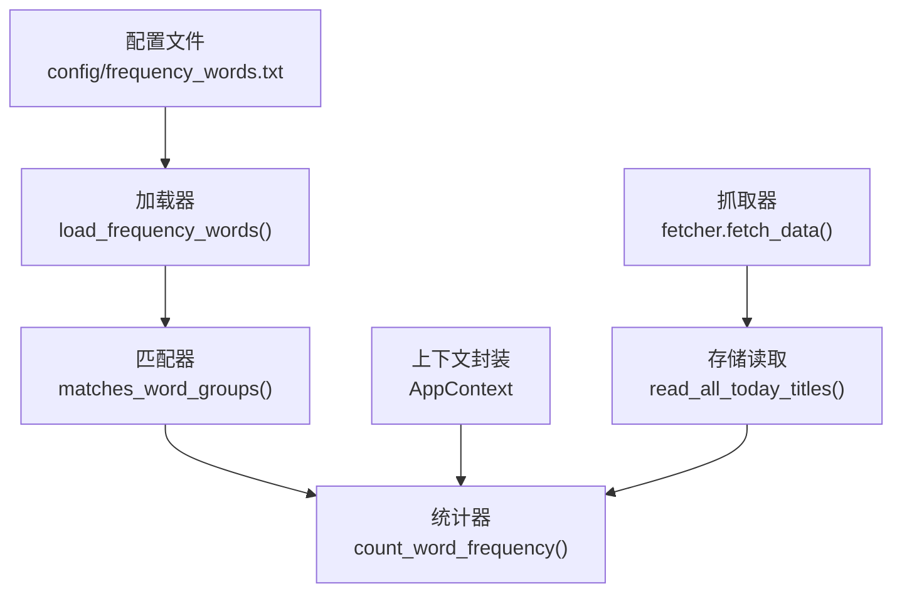
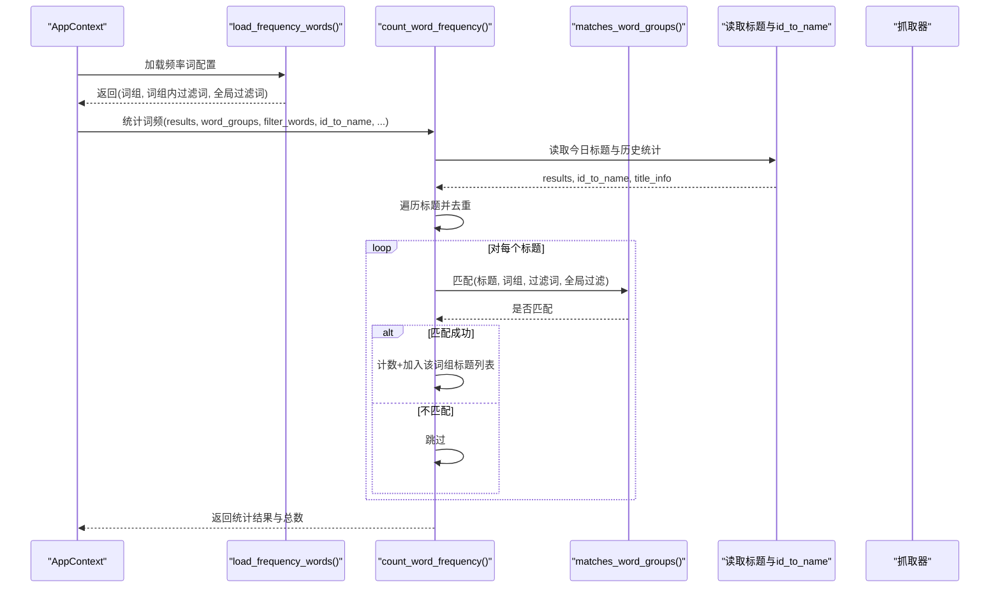
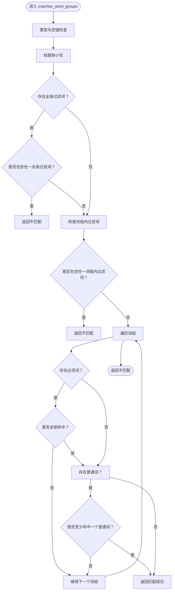
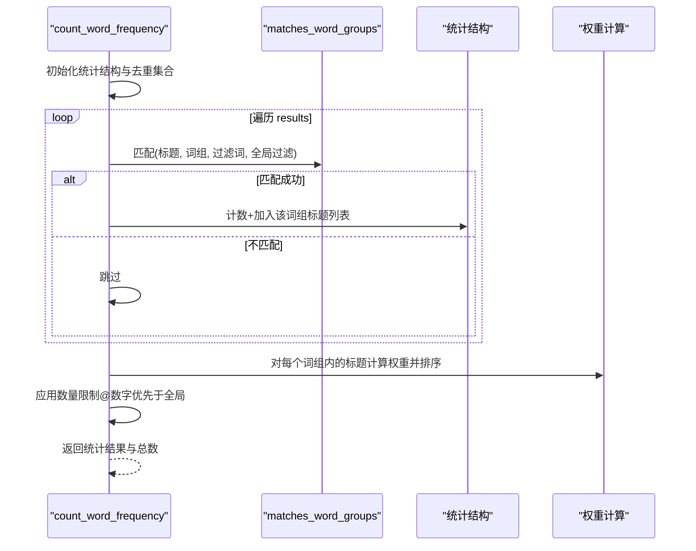
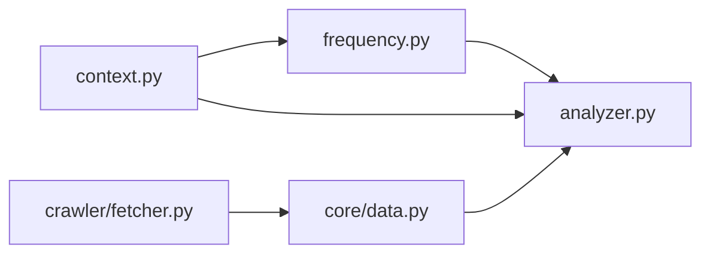

# 关键词匹配

<cite>
**本文引用的文件**
- [config/frequency_words.txt](file://config/frequency_words.txt)
- [trendradar/core/frequency.py](file://trendradar/core/frequency.py)
- [trendradar/core/analyzer.py](file://trendradar/core/analyzer.py)
- [trendradar/context.py](file://trendradar/context.py)
- [README.md](file://README.md)
- [mcp_server/services/parser_service.py](file://mcp_server/services/parser_service.py)
- [trendradar/core/data.py](file://trendradar/core/data.py)
- [trendradar/crawler/fetcher.py](file://trendradar/crawler/fetcher.py)
</cite>

## 目录
1. [简介](#简介)
2. [项目结构与入口](#项目结构与入口)
3. [核心组件](#核心组件)
4. [架构总览](#架构总览)
5. [详细组件分析](#详细组件分析)
6. [依赖关系分析](#依赖关系分析)
7. [性能与复杂度](#性能与复杂度)
8. [故障排查指南](#故障排查指南)
9. [结论](#结论)

## 简介
本文件围绕 TrendRadar 的关键词匹配机制进行系统化说明，重点聚焦于以 matches_word_groups 为核心的匹配流程，以及 count_word_frequency 如何基于该流程完成词组分组统计与来源标识。文档还详细解析 frequency_words.txt 的语法规则：普通词（直接匹配）、必须词（+前缀）、过滤词（!前缀）、全局过滤词（[GLOBAL_FILTER] 区块）与数量限制（@数字），并给出优先级与跨词组统一过滤策略的实现细节与实践建议。

## 项目结构与入口
- 关键配置文件：config/frequency_words.txt
- 匹配与统计核心：
  - trendradar/core/frequency.py：加载词组、执行匹配
  - trendradar/core/analyzer.py：统计词频、来源映射、排序与截断
- 上下文封装：trendradar/context.py
- 其他辅助：
  - mcp_server/services/parser_service.py：另一种词组解析（MCP侧）
  - trendradar/core/data.py：从存储读取标题与来源映射
  - trendradar/crawler/fetcher.py：抓取标题并清洗

图表来源
- [config/frequency_words.txt](file://config/frequency_words.txt#L1-L114)
- [trendradar/core/frequency.py](file://trendradar/core/frequency.py#L18-L129)
- [trendradar/core/analyzer.py](file://trendradar/core/analyzer.py#L90-L195)
- [trendradar/context.py](file://trendradar/context.py#L187-L234)
- [trendradar/core/data.py](file://trendradar/core/data.py#L152-L170)
- [trendradar/crawler/fetcher.py](file://trendradar/crawler/fetcher.py#L129-L158)

章节来源
- [config/frequency_words.txt](file://config/frequency_words.txt#L1-L114)
- [trendradar/core/frequency.py](file://trendradar/core/frequency.py#L18-L129)
- [trendradar/core/analyzer.py](file://trendradar/core/analyzer.py#L90-L195)
- [trendradar/context.py](file://trendradar/context.py#L187-L234)
- [trendradar/core/data.py](file://trendradar/core/data.py#L152-L170)
- [trendradar/crawler/fetcher.py](file://trendradar/crawler/fetcher.py#L129-L158)

## 核心组件
- 配置加载与解析
  - load_frequency_words：从频率词配置文件读取，按空行分隔词组；识别区域标记 [GLOBAL_FILTER]/[WORD_GROUPS]；解析 +（必须词）、!（过滤词）、@（数量限制）；输出词组列表、词组内过滤词、全局过滤词。
- 匹配引擎
  - matches_word_groups：大小写不敏感匹配；优先级最高为全局过滤；其次词组内过滤；最后词组匹配（必须词与普通词组合条件）。
- 统计与分组
  - count_word_frequency：遍历各平台标题，统一调用 matches_word_groups；按词组 group_key 统计计数与标题清单；应用权重排序与数量限制；通过 id_to_name 映射来源名称；支持 daily/incremental/current 三种模式与新增标记。

章节来源
- [trendradar/core/frequency.py](file://trendradar/core/frequency.py#L18-L129)
- [trendradar/core/frequency.py](file://trendradar/core/frequency.py#L132-L195)
- [trendradar/core/analyzer.py](file://trendradar/core/analyzer.py#L90-L195)
- [trendradar/core/analyzer.py](file://trendradar/core/analyzer.py#L226-L360)

## 架构总览
下面的序列图展示了“标题匹配流程”的关键步骤，从读取配置到最终统计输出。

图表来源
- [trendradar/context.py](file://trendradar/context.py#L187-L234)
- [trendradar/core/frequency.py](file://trendradar/core/frequency.py#L18-L129)
- [trendradar/core/analyzer.py](file://trendradar/core/analyzer.py#L90-L195)
- [trendradar/core/analyzer.py](file://trendradar/core/analyzer.py#L226-L360)
- [trendradar/core/data.py](file://trendradar/core/data.py#L152-L170)
- [trendradar/crawler/fetcher.py](file://trendradar/crawler/fetcher.py#L129-L158)

## 详细组件分析

### 配置文件与语法规则（frequency_words.txt）
- 词组分隔：以空行分隔不同词组，每个词组独立统计。
- 语法类型：
  - 普通词：直接写入，标题包含其中任意一个即命中。
  - 必须词（+前缀）：该词组必须同时包含普通词与所有必须词。
  - 过滤词（!前缀）：若标题包含该词则直接排除。
  - 数量限制（@数字）：限制该词组最多显示的新闻条数。
  - 全局过滤（[GLOBAL_FILTER] 区块）：任何情况下均优先过滤，优先级最高。
- 区域标记：
  - [GLOBAL_FILTER]：全局过滤区，仅支持纯文本词，忽略特殊语法。
  - [WORD_GROUPS]：词组区，保持现有语法。
  - 默认行为：不使用区域标记时，视为词组处理（向后兼容）。

章节来源
- [config/frequency_words.txt](file://config/frequency_words.txt#L1-L114)
- [trendradar/core/frequency.py](file://trendradar/core/frequency.py#L18-L129)
- [README.md](file://README.md#L1705-L1836)

### 匹配引擎 matches_word_groups
- 输入：标题、词组列表、词组内过滤词、全局过滤词。
- 大小写不敏感：统一转为小写进行匹配。
- 优先级：
  1) 全局过滤：若包含任一全局过滤词，直接返回不匹配。
  2) 词组内过滤：若包含任一词组内过滤词，直接返回不匹配。
  3) 词组匹配：遍历词组，要求：
     - 若存在必须词，必须全部命中；
     - 至少命中一个普通词；
     - 任一词组满足上述条件即返回匹配成功。
- 特殊情况：当未配置任何词组时，返回匹配成功（用于“显示全部新闻”场景）。

图表来源
- [trendradar/core/frequency.py](file://trendradar/core/frequency.py#L132-L195)

章节来源
- [trendradar/core/frequency.py](file://trendradar/core/frequency.py#L132-L195)

### 统计与分组 count_word_frequency
- 输入：抓取结果、词组、过滤词、id_to_name、历史统计、模式（daily/incremental/current）、全局过滤词、权重配置、每关键词最大显示数、排序策略、首次爬取检测、时间格式化函数、静默模式。
- 标题去重：同一平台同标题仅处理一次，避免重复统计。
- 模式差异：
  - daily：处理全部新闻，打印“频率词过滤”统计摘要。
  - incremental：当天第一次爬取时处理全部新闻并标记新增；非第一次仅处理新增新闻。
  - current：仅处理最新时间批次的新闻，但统计信息来自历史。
- 来源标识：通过 id_to_name 将 source_id 映射为来源名称。
- 排序与截断：
  - 按权重排序（权重计算函数 calculate_news_weight）。
  - 数量限制优先级：@数字（词组内） > 全局配置（max_news_per_keyword） > 不限制。
- 新增标记：在增量/当前模式且当天首次时，统计匹配的新增新闻数量。

图表来源
- [trendradar/core/analyzer.py](file://trendradar/core/analyzer.py#L90-L195)
- [trendradar/core/analyzer.py](file://trendradar/core/analyzer.py#L226-L360)
- [trendradar/core/analyzer.py](file://trendradar/core/analyzer.py#L411-L473)

章节来源
- [trendradar/core/analyzer.py](file://trendradar/core/analyzer.py#L90-L195)
- [trendradar/core/analyzer.py](file://trendradar/core/analyzer.py#L226-L360)
- [trendradar/core/analyzer.py](file://trendradar/core/analyzer.py#L411-L473)

### 来源映射 id_to_name
- 读取来源映射：从存储后端读取 id_to_name，用于在报告与通知中显示来源名称。
- 抓取阶段：抓取器会填充 id_to_name，保证后续统计与渲染可用。

章节来源
- [trendradar/core/data.py](file://trendradar/core/data.py#L152-L170)
- [trendradar/crawler/fetcher.py](file://trendradar/crawler/fetcher.py#L129-L158)

### 与 MCP 侧的词组解析对比
- MCP 服务端解析器 parser_service.py 支持另一种词组格式（以 | 分隔词组，以 , 分隔词组内词，支持 + 与 ! 语法），用于 MCP 管理界面的词组导入。
- 与 core 层的 frequency_words.txt 不冲突，二者分别服务于不同场景。

章节来源
- [mcp_server/services/parser_service.py](file://mcp_server/services/parser_service.py#L561-L608)

## 依赖关系分析
- 模块耦合：
  - analyzer 依赖 frequency 的 matches_word_groups。
  - context 封装了 load_frequency_words 与 count_word_frequency 的调用入口。
  - data 与 fetcher 为 analyzer 提供输入数据与 id_to_name。
- 外部依赖：
  - 配置文件路径可通过环境变量 FREQUENCY_WORDS_PATH 指定。
  - 存储后端提供标题与历史统计数据。

图表来源
- [trendradar/core/frequency.py](file://trendradar/core/frequency.py#L132-L195)
- [trendradar/core/analyzer.py](file://trendradar/core/analyzer.py#L90-L195)
- [trendradar/context.py](file://trendradar/context.py#L187-L234)
- [trendradar/core/data.py](file://trendradar/core/data.py#L152-L170)
- [trendradar/crawler/fetcher.py](file://trendradar/crawler/fetcher.py#L129-L158)

章节来源
- [trendradar/core/frequency.py](file://trendradar/core/frequency.py#L132-L195)
- [trendradar/core/analyzer.py](file://trendradar/core/analyzer.py#L90-L195)
- [trendradar/context.py](file://trendradar/context.py#L187-L234)
- [trendradar/core/data.py](file://trendradar/core/data.py#L152-L170)
- [trendradar/crawler/fetcher.py](file://trendradar/crawler/fetcher.py#L129-L158)

## 性能与复杂度
- 匹配复杂度：
  - 单标题匹配：O(G + R + N)，其中 G 为词组数，R 为必须词数，N 为普通词数。全局过滤与词组内过滤为线性扫描。
- 统计复杂度：
  - 遍历所有标题 O(T)；对每个标题调用匹配 O(G)；排序 O(K log K)，K 为该词组标题数。
- 优化建议：
  - 控制词组数量与每组词数，避免过度复杂导致匹配开销上升。
  - 合理设置 @数字 与全局 MAX_NEWS_PER_KEYWORD，减少输出规模。
  - 使用去重集合避免重复处理相同标题。

[本节为通用性能讨论，无需列出具体文件来源]

## 故障排查指南
- 配置文件不存在
  - 现象：加载频率词时报错。
  - 排查：确认 FREQUENCY_WORDS_PATH 环境变量或默认路径 config/frequency_words.txt 是否存在。
  - 参考：[trendradar/core/frequency.py](file://trendradar/core/frequency.py#L44-L51)
- 全局过滤误伤
  - 现象：正常新闻被过滤。
  - 排查：检查 [GLOBAL_FILTER] 区块是否包含过于宽泛的词；必要时移除或调整。
  - 参考：[trendradar/core/frequency.py](file://trendradar/core/frequency.py#L78-L87)
- 词组内过滤词误伤
  - 现象：命中关键词但被排除。
  - 排查：检查词组内 ! 词是否过于宽泛；优先使用更精确的 + 限定范围。
  - 参考：[trendradar/core/frequency.py](file://trendradar/core/frequency.py#L106-L109)
- 必须词缺失导致不匹配
  - 现象：标题包含关键词但未命中。
  - 排查：为词组添加 + 必须词，确保范围限定。
  - 参考：[trendradar/core/frequency.py](file://trendradar/core/frequency.py#L109-L112)
- 数量限制未生效
  - 现象：超过预期条数。
  - 排查：确认 @数字 与全局 MAX_NEWS_PER_KEYWORD 的优先级；@数字 优先于全局配置。
  - 参考：[trendradar/core/analyzer.py](file://trendradar/core/analyzer.py#L435-L443)
- 模式选择不当
  - 现象：增量模式无新增或 current 模式未筛选最新时间。
  - 排查：确认 is_first_crawl_func 与 latest_time 逻辑；检查 mode 参数。
  - 参考：[trendradar/core/analyzer.py](file://trendradar/core/analyzer.py#L155-L200)
- 来源名称为空
  - 现象：报告中来源显示为 ID。
  - 排查：确认 id_to_name 是否正确加载；检查抓取器是否填充。
  - 参考：[trendradar/core/data.py](file://trendradar/core/data.py#L152-L170), [trendradar/crawler/fetcher.py](file://trendradar/crawler/fetcher.py#L129-L158)

章节来源
- [trendradar/core/frequency.py](file://trendradar/core/frequency.py#L44-L51)
- [trendradar/core/frequency.py](file://trendradar/core/frequency.py#L78-L87)
- [trendradar/core/frequency.py](file://trendradar/core/frequency.py#L106-L112)
- [trendradar/core/analyzer.py](file://trendradar/core/analyzer.py#L435-L443)
- [trendradar/core/analyzer.py](file://trendradar/core/analyzer.py#L155-L200)
- [trendradar/core/data.py](file://trendradar/core/data.py#L152-L170)
- [trendradar/crawler/fetcher.py](file://trendradar/crawler/fetcher.py#L129-L158)

## 结论
- matches_word_groups 提供了清晰的优先级与大小写不敏感匹配，适合在大规模标题中快速筛选目标新闻。
- count_word_frequency 将匹配、统计、排序、截断与来源映射整合，形成完整的词组分组统计链路。
- frequency_words.txt 的语法规则与区域标记提供了灵活的配置能力，配合 @ 数量限制与全局过滤策略，可在不同模式下平衡准确性与可读性。
- 建议在实践中遵循“从宽到严”的策略：先以普通词覆盖范围，再逐步引入 + 限定与 ! 过滤，最后通过 @ 数量限制收敛输出规模。