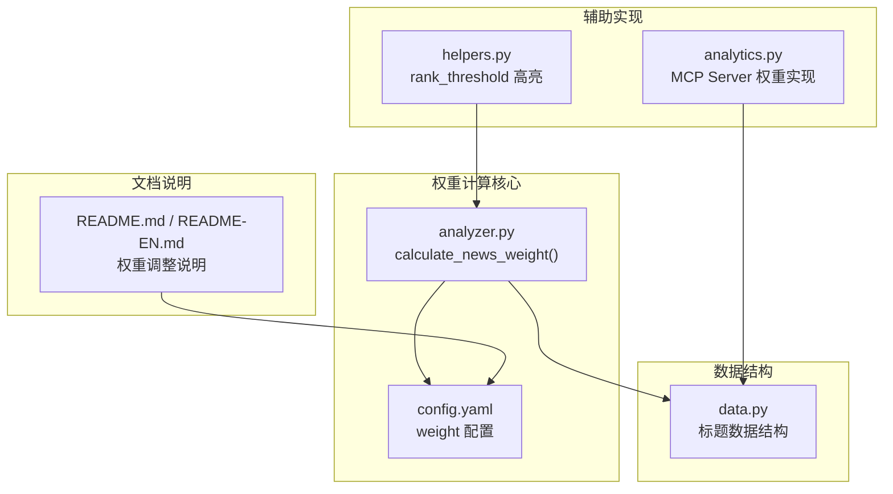
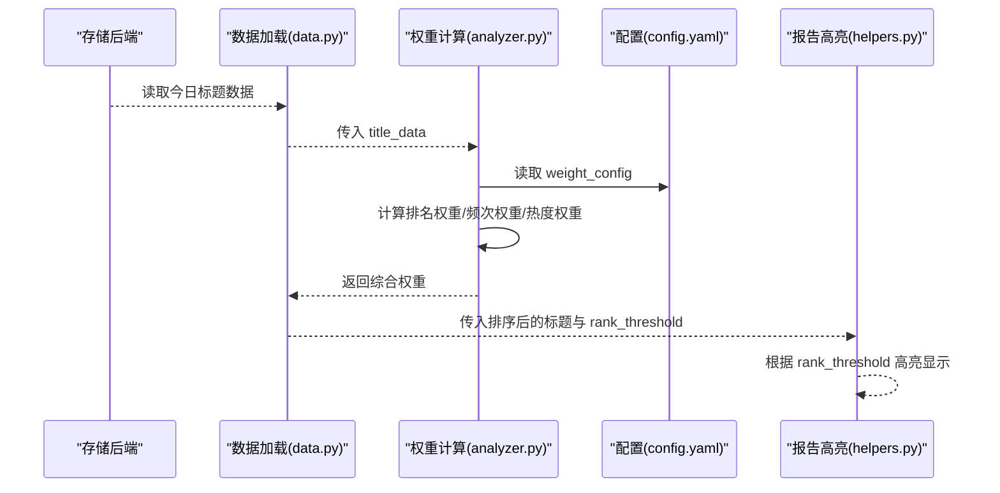
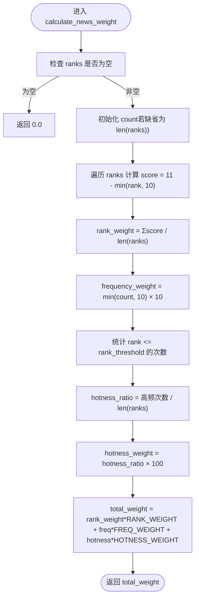
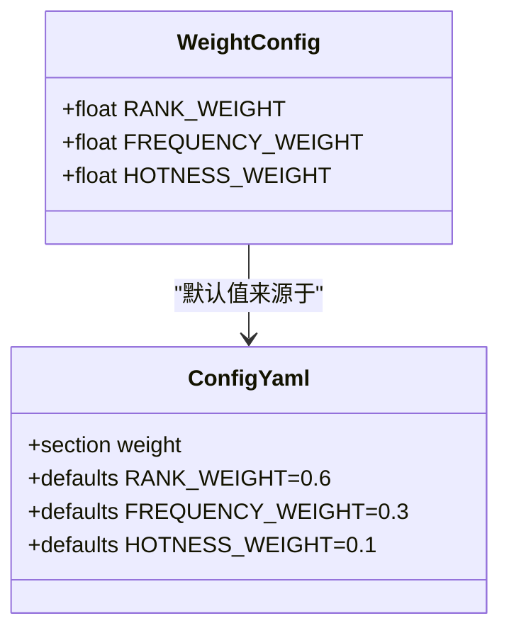
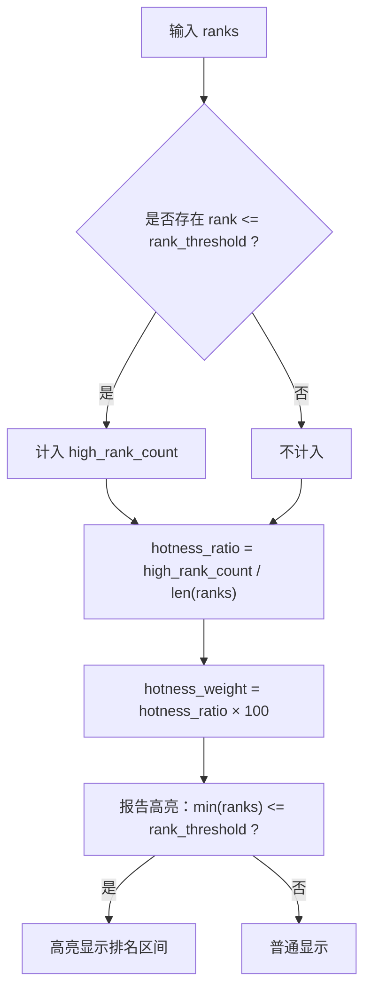
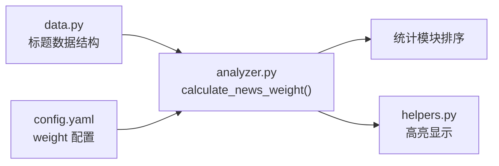

# 权重计算

<cite>
**本文引用的文件**
- [analyzer.py](file://trendradar/core/analyzer.py)
- [config.yaml](file://config/config.yaml)
- [analytics.py](file://mcp_server/tools/analytics.py)
- [helpers.py](file://trendradar/report/helpers.py)
- [data.py](file://trendradar/core/data.py)
- [README.md](file://README.md)
- [README-EN.md](file://README-EN.md)
</cite>

## 目录
1. [简介](#简介)
2. [项目结构](#项目结构)
3. [核心组件](#核心组件)
4. [架构总览](#架构总览)
5. [详细组件分析](#详细组件分析)
6. [依赖关系分析](#依赖关系分析)
7. [性能考量](#性能考量)
8. [故障排查指南](#故障排查指南)
9. [结论](#结论)
10. [附录](#附录)

## 简介
本文件围绕 TrendRadar 的“新闻权重计算”算法进行系统化技术文档整理，以 calculate_news_weight() 为核心，深入解析三重权重组合策略：
- 排名权重（RANK_WEIGHT）：基于 11 - min(rank, 10) 的平均得分，强调榜单靠前的新闻更具权重
- 频次权重（FREQUENCY_WEIGHT）：基于 min(count, 10) × 10 的增长衰减，强调持续出现但有限度
- 热度权重（HOTNESS_WEIGHT）：基于 rank_threshold 内高排名占比的热度加成，突出“高排名持续性”

同时，文档覆盖 weight_config 配置项结构与调整方法、rank_threshold 参数对高排名判定的影响，并通过流程图与序列图展示典型场景下的计算过程，最后给出性能优化建议与常见偏差的解决方案。

## 项目结构
与权重计算直接相关的模块与文件如下：
- 核心算法实现：trendradar/core/analyzer.py 中的 calculate_news_weight()
- 配置来源：config/config.yaml 的 weight 段落
- 辅助权重实现（MCP Server）：mcp_server/tools/analytics.py 中的 calculate_news_weight()
- 排名高亮阈值使用：trendradar/report/helpers.py 的排名高亮逻辑
- 数据结构与输入：trendradar/core/data.py 中的标题数据结构
- 文档说明：README.md 与 README-EN.md 中的权重调整章节

图表来源
- [analyzer.py](file://trendradar/core/analyzer.py#L16-L61)
- [config.yaml](file://config/config.yaml#L157-L162)
- [analytics.py](file://mcp_server/tools/analytics.py#L24-L74)
- [helpers.py](file://trendradar/report/helpers.py#L65-L125)
- [data.py](file://trendradar/core/data.py#L120-L145)
- [README.md](file://README.md#L2054-L2114)
- [README-EN.md](file://README-EN.md#L2003-L2046)

章节来源
- [analyzer.py](file://trendradar/core/analyzer.py#L16-L61)
- [config.yaml](file://config/config.yaml#L157-L162)
- [analytics.py](file://mcp_server/tools/analytics.py#L24-L74)
- [helpers.py](file://trendradar/report/helpers.py#L65-L125)
- [data.py](file://trendradar/core/data.py#L120-L145)
- [README.md](file://README.md#L2054-L2114)
- [README-EN.md](file://README-EN.md#L2003-L2046)

## 核心组件
- calculate_news_weight(title_data, rank_threshold, weight_config)：主权重计算函数，返回综合权重值
- 权重配置 weight_config：包含 RANK_WEIGHT、FREQUENCY_WEIGHT、HOTNESS_WEIGHT 三项权重系数
- rank_threshold：高排名判定阈值，用于热度加成与报告高亮
- 输入数据结构：title_data 包含 ranks（排名列表）、count（出现次数）

章节来源
- [analyzer.py](file://trendradar/core/analyzer.py#L16-L61)
- [config.yaml](file://config/config.yaml#L157-L162)

## 架构总览
权重计算贯穿数据准备、权重计算与排序三个阶段：
- 数据准备：从存储后端读取标题数据，构造包含 ranks、count 的 title_data
- 权重计算：调用 calculate_news_weight() 计算综合权重
- 排序与展示：按权重排序并结合 rank_threshold 进行高亮显示

图表来源
- [data.py](file://trendradar/core/data.py#L86-L145)
- [analyzer.py](file://trendradar/core/analyzer.py#L16-L61)
- [config.yaml](file://config/config.yaml#L157-L162)
- [helpers.py](file://trendradar/report/helpers.py#L65-L125)

## 详细组件分析

### 1. calculate_news_weight() 算法详解
- 输入
  - title_data：包含 ranks（列表）、count（整数，若缺省为 len(ranks)）
  - rank_threshold：整数，用于热度加成与高亮判定
  - weight_config：字典，包含 RANK_WEIGHT、FREQUENCY_WEIGHT、HOTNESS_WEIGHT
- 输出
  - 综合权重值（float）

- 计算步骤
  1) 排名权重（Rank Weight）
     - 对每个排名 rank，计算 score = 11 - min(rank, 10)
     - 对所有 score 求和并除以出现次数，得到平均得分
  2) 频次权重（Frequency Weight）
     - frequency_weight = min(count, 10) × 10
     - 限制在 10 次以内，超过 10 次不再线性增长
  3) 热度权重（Hotness Weight）
     - high_rank_count = 统计 rank ≤ rank_threshold 的次数
     - hotness_ratio = high_rank_count / len(ranks)
     - hotness_weight = hotness_ratio × 100
  4) 综合权重
     - total_weight = rank_weight × RANK_WEIGHT + frequency_weight × FREQUENCY_WEIGHT + hotness_weight × HOTNESS_WEIGHT

- 复杂度
  - 时间复杂度：O(n)，其中 n 为 ranks 长度
  - 空间复杂度：O(1)

图表来源
- [analyzer.py](file://trendradar/core/analyzer.py#L16-L61)

章节来源
- [analyzer.py](file://trendradar/core/analyzer.py#L16-L61)

### 2. 权重配置 weight_config 结构与调整
- 结构
  - RANK_WEIGHT：排名权重系数（默认来自 config.yaml）
  - FREQUENCY_WEIGHT：频次权重系数（默认来自 config.yaml）
  - HOTNESS_WEIGHT：热度权重系数（默认来自 config.yaml）
- 默认值来源
  - config/config.yaml 的 weight 段落提供默认值
- 调整方法
  - 三者之和必须为 1.0
  - 根据业务目标调整：追求时效性提高 RANK_WEIGHT；追求持续性提高 FREQUENCY_WEIGHT
  - 建议每次调整 0.1~0.2，观察效果

图表来源
- [config.yaml](file://config/config.yaml#L157-L162)
- [README.md](file://README.md#L2054-L2114)
- [README-EN.md](file://README-EN.md#L2003-L2046)

章节来源
- [config.yaml](file://config/config.yaml#L157-L162)
- [README.md](file://README.md#L2054-L2114)
- [README-EN.md](file://README-EN.md#L2003-L2046)

### 3. rank_threshold 参数的作用与影响
- 高度权重（热度加成）：仅统计 rank ≤ rank_threshold 的次数，占比越高，热度权重越大
- 报告高亮：当最小排名 ≤ rank_threshold 时，报告中对排名区间进行高亮显示
- 场景建议
  - 实时热点型：较小的 rank_threshold（如 3~5），强调“刚上榜即高亮”
  - 深度话题型：较大的 rank_threshold（如 8~10），强调“长期维持在榜单内”

图表来源
- [analyzer.py](file://trendradar/core/analyzer.py#L46-L52)
- [helpers.py](file://trendradar/report/helpers.py#L65-L125)

章节来源
- [analyzer.py](file://trendradar/core/analyzer.py#L46-L52)
- [helpers.py](file://trendradar/report/helpers.py#L65-L125)

### 4. 典型场景与计算示例（概念性说明）
以下为三类典型场景的权重计算过程说明（不展示具体数值，仅说明流程与侧重点）：
- 多平台高位（短期爆发）
  - 特征：多平台同时出现，ranks 多为 1~5，count 较低
  - 侧重点：RANK_WEIGHT 占比高，频次权重较低，热度权重取决于高排名占比
- 持续上榜（稳态传播）
  - 特征：ranks 多为 5~10，count 较高
  - 侧重点：FREQUENCY_WEIGHT 占比提升，RANK_WEIGHT 仍重要，热度权重反映持续性
- 突发新闻（快速爆发）
  - 特征：count 快速上升，ranks 从高位快速下降
  - 侧重点：FREQUENCY_WEIGHT 快速提升，RANK_WEIGHT 体现初始热度，热度权重反映“高排名持续比例”

章节来源
- [analyzer.py](file://trendradar/core/analyzer.py#L16-L61)

### 5. 与 MCP Server 权重实现的差异
- MCP Server 的 analytics.py 中同样实现了 calculate_news_weight()，但默认权重固定为 0.6/0.3/0.1，便于独立分析
- TrendRadar 核心模块的 calculate_news_weight() 使用 weight_config 动态读取权重，便于在 config.yaml 中灵活调整

章节来源
- [analytics.py](file://mcp_server/tools/analytics.py#L24-L74)
- [analyzer.py](file://trendradar/core/analyzer.py#L16-L61)

## 依赖关系分析
- 数据来源依赖：title_data 来源于存储后端读取，字段包括 ranks、count、url、mobileUrl 等
- 配置依赖：权重系数来自 config.yaml 的 weight 段落
- 报告依赖：helpers.py 使用 rank_threshold 进行高亮显示
- 排序依赖：analyzer.py 在统计模块中使用 calculate_news_weight() 作为排序键的一部分

图表来源
- [data.py](file://trendradar/core/data.py#L120-L145)
- [analyzer.py](file://trendradar/core/analyzer.py#L16-L61)
- [config.yaml](file://config/config.yaml#L157-L162)
- [helpers.py](file://trendradar/report/helpers.py#L65-L125)

章节来源
- [data.py](file://trendradar/core/data.py#L120-L145)
- [analyzer.py](file://trendradar/core/analyzer.py#L16-L61)
- [config.yaml](file://config/config.yaml#L157-L162)
- [helpers.py](file://trendradar/report/helpers.py#L65-L125)

## 性能考量
- 时间复杂度 O(n)：权重计算主要为线性扫描 ranks，适合大规模新闻数据
- 建议
  - 对于超大规模数据，可在上游去重与合并 ranks（已有去重逻辑），减少重复计算
  - 将权重系数集中管理在 config.yaml，避免硬编码，便于热更新与灰度调整
  - 在排序阶段，尽量减少不必要的二次计算，复用中间结果

[本节为通用性能建议，不直接分析具体文件]

## 故障排查指南
- ranks 为空导致权重为 0
  - 现象：返回 0.0
  - 处理：检查数据加载逻辑，确保 title_data 中包含有效的 ranks
- count 缺失
  - 现象：使用 len(ranks) 作为 count
  - 处理：保证数据结构中 count 字段可用，或在上游补全
- 权重系数和为 1.0
  - 现象：权重异常偏高或偏低
  - 处理：确保 RANK_WEIGHT + FREQUENCY_WEIGHT + HOTNESS_WEIGHT = 1.0
- rank_threshold 设置不当
  - 现象：热度权重过低或过高，报告高亮不明显
  - 处理：根据场景调整 rank_threshold，实时热点型偏小，深度话题型偏大

章节来源
- [analyzer.py](file://trendradar/core/analyzer.py#L16-L61)
- [README.md](file://README.md#L2054-L2114)
- [README-EN.md](file://README-EN.md#L2003-L2046)

## 结论
TrendRadar 的权重计算以“排名、频次、热度”三维度构建，既强调榜单靠前的重要性，又兼顾持续性与高排名占比。通过 weight_config 与 rank_threshold 的灵活配置，可以针对不同业务目标（实时热点 vs. 深度分析）进行定向优化。建议在生产环境中：
- 将权重系数集中管理在 config.yaml
- 根据场景设定合理的 rank_threshold
- 对大规模数据进行去重与合并，降低重复计算
- 在排序阶段复用中间结果，提升整体吞吐

[本节为总结性内容，不直接分析具体文件]

## 附录
- 配置位置与默认值
  - config/config.yaml 的 weight 段落提供默认权重
- 调整建议
  - 三者之和必须为 1.0
  - 建议每次调整 0.1~0.2，观察效果
- 参考文档
  - README.md 与 README-EN.md 中的“热点权重调整”章节

章节来源
- [config.yaml](file://config/config.yaml#L157-L162)
- [README.md](file://README.md#L2054-L2114)
- [README-EN.md](file://README-EN.md#L2003-L2046)