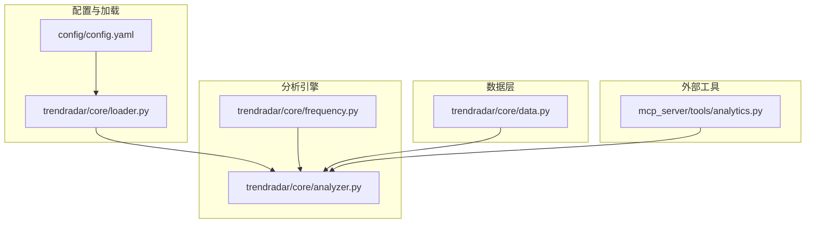
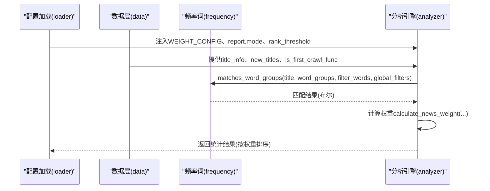
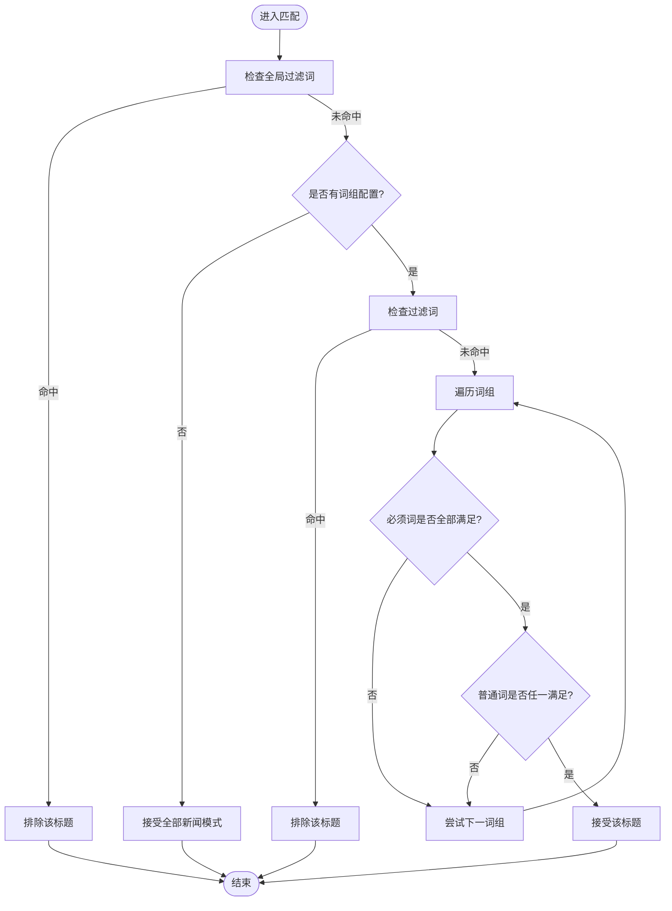
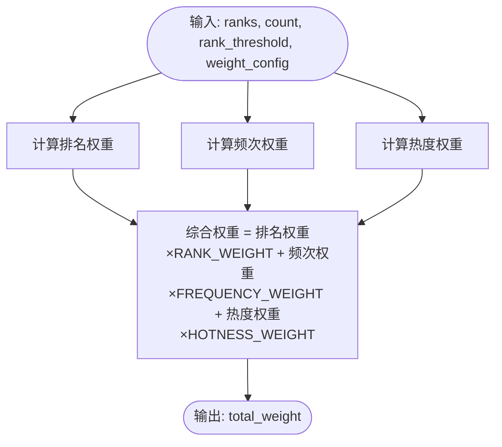
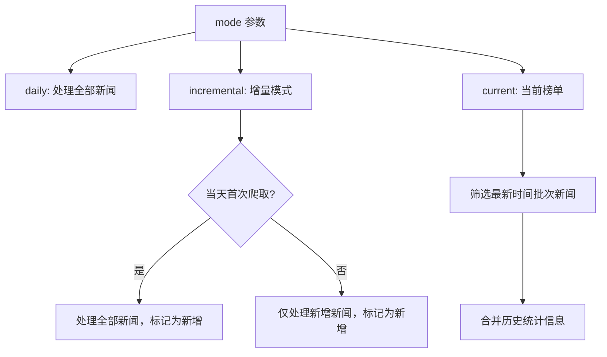
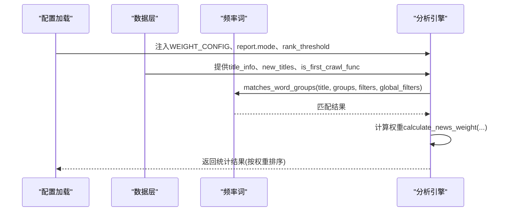
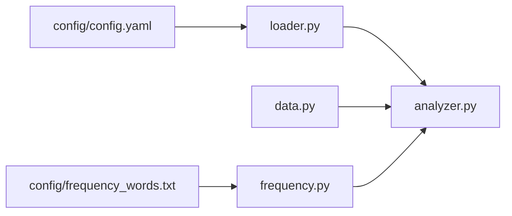

# 核心分析

<cite>
**本文引用的文件**
- [analyzer.py](file://trendradar/core/analyzer.py)
- [frequency.py](file://trendradar/core/frequency.py)
- [frequency_words.txt](file://config/frequency_words.txt)
- [config.yaml](file://config/config.yaml)
- [loader.py](file://trendradar/core/loader.py)
- [data.py](file://trendradar/core/data.py)
- [analytics.py](file://mcp_server/tools/analytics.py)
</cite>

## 目录
1. [简介](#简介)
2. [项目结构](#项目结构)
3. [核心组件](#核心组件)
4. [架构总览](#架构总览)
5. [详细组件分析](#详细组件分析)
6. [依赖关系分析](#依赖关系分析)
7. [性能考量](#性能考量)
8. [故障排查指南](#故障排查指南)
9. [结论](#结论)
10. [附录](#附录)

## 简介
本文件聚焦 TrendRadar 核心分析引擎，围绕两个关键函数展开：count_word_frequency() 与 calculate_news_weight()。前者负责基于频率词配置对标题进行筛选与统计，并结合模式参数（daily/incremental/current）决定处理范围与新增标记；后者负责综合排名、频次与热度三项指标，按权重配置计算新闻权重，用于排序与展示。文档还系统梳理了关键词匹配规则（普通词、必须词、过滤词、全局过滤）、权重计算策略与 WEIGHT_CONFIG 的调整方法，并通过流程图与序列图直观呈现分析过程。

## 项目结构
- 核心分析位于 trendradar/core/analyzer.py，依赖频率词匹配模块 trendradar/core/frequency.py。
- 频率词配置文件 config/frequency_words.txt 定义普通词、必须词、过滤词、全局过滤词与最大显示数量。
- 配置加载位于 trendradar/core/loader.py，从 config/config.yaml 中读取 report.mode、rank_threshold、max_news_per_keyword、sort_by_position_first 等参数，并将权重配置注入 WEIGTH_CONFIG。
- 数据层在 trendradar/core/data.py，提供从存储后端读取历史标题、检测新增标题、判断当天首次爬取等功能，支撑增量/当前榜单模式的逻辑。
- MCP Server 的 analytics.py 提供独立的权重计算实现，便于外部工具复用。

图表来源
- [config.yaml](file://config/config.yaml#L74-L81)
- [loader.py](file://trendradar/core/loader.py#L118-L126)
- [analyzer.py](file://trendradar/core/analyzer.py#L90-L126)
- [frequency.py](file://trendradar/core/frequency.py#L132-L195)
- [data.py](file://trendradar/core/data.py#L182-L286)
- [analytics.py](file://mcp_server/tools/analytics.py#L24-L73)

章节来源
- [config.yaml](file://config/config.yaml#L74-L81)
- [loader.py](file://trendradar/core/loader.py#L118-L126)
- [analyzer.py](file://trendradar/core/analyzer.py#L90-L126)
- [frequency.py](file://trendradar/core/frequency.py#L132-L195)
- [data.py](file://trendradar/core/data.py#L182-L286)
- [analytics.py](file://mcp_server/tools/analytics.py#L24-L73)

## 核心组件
- count_word_frequency(): 统计词频并筛选标题，支持必须词、普通词、过滤词、全局过滤词，按模式（daily/incremental/current）决定处理范围与新增标记，最后按权重排序并限制每组最大显示数量。
- calculate_news_weight(): 计算单条新闻的综合权重，包含排名权重、频次权重与热度权重，权重比例由 WEIGHT_CONFIG 控制。
- matches_word_groups(): 基于频率词配置判断标题是否匹配，遵循“全局过滤优先、过滤词优先、必须词+普通词”的匹配顺序。
- load_frequency_words(): 从频率词配置文件加载词组、过滤词与全局过滤词，支持区域标记与最大显示数量。

章节来源
- [analyzer.py](file://trendradar/core/analyzer.py#L90-L126)
- [analyzer.py](file://trendradar/core/analyzer.py#L16-L61)
- [frequency.py](file://trendradar/core/frequency.py#L132-L195)
- [frequency.py](file://trendradar/core/frequency.py#L18-L129)

## 架构总览
分析流程自上而下：配置加载（loader）提供 report.mode、rank_threshold、WEIGHT_CONFIG 等参数；数据层（data）提供历史标题与新增检测；频率词模块（frequency）提供匹配规则；最终由分析引擎（analyzer）完成筛选、统计、排序与展示。

图表来源
- [loader.py](file://trendradar/core/loader.py#L118-L126)
- [data.py](file://trendradar/core/data.py#L182-L286)
- [frequency.py](file://trendradar/core/frequency.py#L132-L195)
- [analyzer.py](file://trendradar/core/analyzer.py#L90-L126)

## 详细组件分析

### 关键词匹配逻辑（频率词规则）
- 规则类型
  - 普通词：出现在标题中即可匹配。
  - 必须词（+前缀）：标题必须包含全部列出的必须词。
  - 过滤词（!前缀）：若标题包含任一过滤词，则直接排除。
  - 全局过滤（[GLOBAL_FILTER] 区域）：优先级最高，匹配任一全局过滤词即排除。
  - 最大显示数量（@数字）：限定该词组最多显示条数。
- 匹配顺序
  1) 全局过滤检查（最高优先级）
  2) 若无词组配置，则全部匹配（用于“全部新闻”模式）
  3) 过滤词检查
  4) 逐组检查：必须词全满足 + 普通词任一满足
- 配置文件
  - 频率词配置文件采用“空行分隔词组”，支持区域标记 [GLOBAL_FILTER] 与 [WORD_GROUPS]。
  - 支持 @ 数字 设置每组最大显示数量；!、+、@ 三种特殊语法在 GLOBAL_FILTER 区域不生效。

图表来源
- [frequency.py](file://trendradar/core/frequency.py#L132-L195)
- [frequency_words.txt](file://config/frequency_words.txt#L1-L114)

章节来源
- [frequency.py](file://trendradar/core/frequency.py#L18-L129)
- [frequency.py](file://trendradar/core/frequency.py#L132-L195)
- [frequency_words.txt](file://config/frequency_words.txt#L1-L114)

### 权重计算算法（calculate_news_weight）
- 输入字段
  - ranks：标题在各平台/批次的排名列表
  - count：出现次数（默认等于 ranks 长度）
  - rank_threshold：高排名阈值
  - weight_config：包含 RANK_WEIGHT、FREQUENCY_WEIGHT、HOTNESS_WEIGHT 的权重配置
- 权重构成
  - 排名权重：对每个排名计算 11 - min(rank, 10)，再平均，作为排名权重
  - 频次权重：min(count, 10) × 10
  - 热度权重：高排名次数 / 总出现次数 × 100
  - 综合权重：排名权重×RANK_WEIGHT + 频次权重×FREQUENCY_WEIGHT + 热度权重×HOTNESS_WEIGHT
- 默认权重（WEIGHT_CONFIG）
  - 来源于配置文件 weight 段落，分别对应 rank_weight、frequency_weight、hotness_weight
  - 默认值为 0.6、0.3、0.1，合计 1.0
- 使用场景
  - 日常模式：强调综合热度，适合全面了解当日趋势
  - 实时模式：提高排名权重，突出当前榜单变化
  - 深度模式：提高频次权重，强调持续热度

图表来源
- [analyzer.py](file://trendradar/core/analyzer.py#L16-L61)
- [config.yaml](file://config/config.yaml#L158-L162)
- [loader.py](file://trendradar/core/loader.py#L118-L126)
- [analytics.py](file://mcp_server/tools/analytics.py#L24-L73)

章节来源
- [analyzer.py](file://trendradar/core/analyzer.py#L16-L61)
- [config.yaml](file://config/config.yaml#L158-L162)
- [loader.py](file://trendradar/core/loader.py#L118-L126)
- [analytics.py](file://mcp_server/tools/analytics.py#L24-L73)

### 模式参数（daily/incremental/current）对统计逻辑的影响
- daily（当日汇总）
  - 处理范围：对所有新闻进行统计，不区分新增
  - 新增标记：all_news_are_new=False
  - 输出：当日累计匹配新闻数，适合全面回顾当日趋势
- incremental（增量监控）
  - 首次爬取当天：results_to_process=results，all_news_are_new=True，匹配到的新闻均标记为新增
  - 非首次爬取当天：仅处理 new_titles，all_news_are_new=True，匹配到的新闻均标记为新增
  - 输出：仅展示新增匹配新闻，避免重复打扰
- current（当前榜单）
  - 处理范围：仅处理最新时间批次的新闻（latest_time），从 title_info 合并历史统计信息
  - 新增标记：all_news_are_new=False
  - 输出：当前榜单匹配新闻，适合实时追踪热点变化

图表来源
- [analyzer.py](file://trendradar/core/analyzer.py#L155-L200)
- [analyzer.py](file://trendradar/core/analyzer.py#L198-L208)
- [analyzer.py](file://trendradar/core/analyzer.py#L241-L246)
- [analyzer.py](file://trendradar/core/analyzer.py#L293-L321)
- [data.py](file://trendradar/core/data.py#L182-L286)

章节来源
- [analyzer.py](file://trendradar/core/analyzer.py#L155-L200)
- [analyzer.py](file://trendradar/core/analyzer.py#L198-L208)
- [analyzer.py](file://trendradar/core/analyzer.py#L241-L246)
- [analyzer.py](file://trendradar/core/analyzer.py#L293-L321)
- [data.py](file://trendradar/core/data.py#L182-L286)

### 统计与排序流程（count_word_frequency）
- 数据准备
  - 从配置加载词组、过滤词、全局过滤词
  - 从存储读取 title_info 与 new_titles，判断是否当天首次爬取
- 标题筛选
  - 使用 matches_word_groups() 进行匹配
  - 在 daily/incremental/current 模式下，按处理范围筛选
- 权重计算与排序
  - 对每条新闻调用 calculate_news_weight() 计算权重
  - 排序键：-权重、min(ranks)、-count
- 结果输出
  - 每组按 max_count 限制显示数量
  - 支持按配置位置优先或按热点条数优先排序

图表来源
- [loader.py](file://trendradar/core/loader.py#L118-L126)
- [data.py](file://trendradar/core/data.py#L182-L286)
- [frequency.py](file://trendradar/core/frequency.py#L132-L195)
- [analyzer.py](file://trendradar/core/analyzer.py#L90-L126)
- [analyzer.py](file://trendradar/core/analyzer.py#L420-L457)

章节来源
- [analyzer.py](file://trendradar/core/analyzer.py#L90-L126)
- [analyzer.py](file://trendradar/core/analyzer.py#L420-L457)
- [frequency.py](file://trendradar/core/frequency.py#L132-L195)
- [data.py](file://trendradar/core/data.py#L182-L286)
- [loader.py](file://trendradar/core/loader.py#L118-L126)

## 依赖关系分析
- analyzer.py 依赖 frequency.py 的 matches_word_groups() 进行关键词匹配
- analyzer.py 依赖 data.py 的 title_info、new_titles、is_first_crawl_func 提供历史统计与新增检测
- loader.py 从 config.yaml 读取 report.mode、rank_threshold、max_news_per_keyword、sort_by_position_first 与 WEIGHT_CONFIG
- frequency_words.txt 为频率词配置来源，被 frequency.py 解析

图表来源
- [config.yaml](file://config/config.yaml#L74-L81)
- [config.yaml](file://config/config.yaml#L158-L162)
- [loader.py](file://trendradar/core/loader.py#L118-L126)
- [analyzer.py](file://trendradar/core/analyzer.py#L90-L126)
- [frequency.py](file://trendradar/core/frequency.py#L18-L129)
- [frequency_words.txt](file://config/frequency_words.txt#L1-L114)

章节来源
- [config.yaml](file://config/config.yaml#L74-L81)
- [config.yaml](file://config/config.yaml#L158-L162)
- [loader.py](file://trendradar/core/loader.py#L118-L126)
- [analyzer.py](file://trendradar/core/analyzer.py#L90-L126)
- [frequency.py](file://trendradar/core/frequency.py#L18-L129)
- [frequency_words.txt](file://config/frequency_words.txt#L1-L114)

## 性能考量
- 匹配复杂度
  - matches_word_groups() 对每个标题进行全局过滤、过滤词与词组匹配，整体复杂度近似 O(T×(G+K))，其中 T 为标题数，G 为词组数，K 为过滤词/必须词/普通词数量
- 排序复杂度
  - count_word_frequency() 对每组标题进行排序，复杂度 O(N log N)，N 为该组匹配标题数
- 优化建议
  - 合理设置 max_news_per_keyword 与每组 @ 数量，减少排序与展示开销
  - 使用 is_first_crawl_func 与 new_titles 缩小增量模式处理范围
  - 频繁改动频率词配置时，建议先在测试环境验证匹配效率

[本节为通用性能讨论，无需特定文件引用]

## 故障排查指南
- 频率词文件缺失
  - 现象：加载频率词时报错
  - 排查：确认 FREQUENCY_WORDS_PATH 环境变量或 config/frequency_words.txt 是否存在
- 增量模式无推送
  - 现象：长时间无新增新闻推送
  - 排查：确认是否当天首次爬取、new_titles 是否为空、关键词配置是否过严或过宽
- 权重配置无效
  - 现象：权重比例不符合预期
  - 排查：确认 config/config.yaml 中 weight 段落与 loader 加载逻辑一致，且 WEIGHT_CONFIG 注入正确
- 当前榜单模式显示异常
  - 现象：当前榜单新闻重复或缺失
  - 排查：确认 latest_time 筛选逻辑与 title_info 合并逻辑

章节来源
- [frequency.py](file://trendradar/core/frequency.py#L44-L57)
- [data.py](file://trendradar/core/data.py#L182-L286)
- [loader.py](file://trendradar/core/loader.py#L118-L126)
- [config.yaml](file://config/config.yaml#L158-L162)

## 结论
count_word_frequency() 与 calculate_news_weight() 构成了 TrendRadar 的核心分析引擎：前者通过频率词规则与模式参数实现高效筛选与统计，后者以排名、频次与热度三要素的加权组合实现稳定排序。配合灵活的权重配置与模式选择，系统既能满足全面回顾（daily），也能满足实时追踪（current）与高频监控（incremental）。建议在生产环境中结合业务目标动态调整权重与关键词配置，以获得最佳的热点发现体验。

[本节为总结性内容，无需特定文件引用]

## 附录

### 配置项与权重调整方法
- 权重配置（WEIGHT_CONFIG）
  - 来源：config/config.yaml 的 weight 段落
  - 字段：rank_weight、frequency_weight、hotness_weight
  - 默认：0.6、0.3、0.1，合计 1.0
  - 调整建议：追求时效性提高 rank_weight，追求稳定性提高 frequency_weight
- 报告模式（report.mode）
  - daily：当日累计
  - incremental：仅新增
  - current：当前榜单
- 其他关键参数
  - rank_threshold：高排名阈值
  - max_news_per_keyword：每关键词最大显示数量
  - sort_by_position_first：优先按配置位置排序

章节来源
- [config.yaml](file://config/config.yaml#L74-L81)
- [config.yaml](file://config/config.yaml#L158-L162)
- [loader.py](file://trendradar/core/loader.py#L118-L126)
- [analyzer.py](file://trendradar/core/analyzer.py#L90-L126)