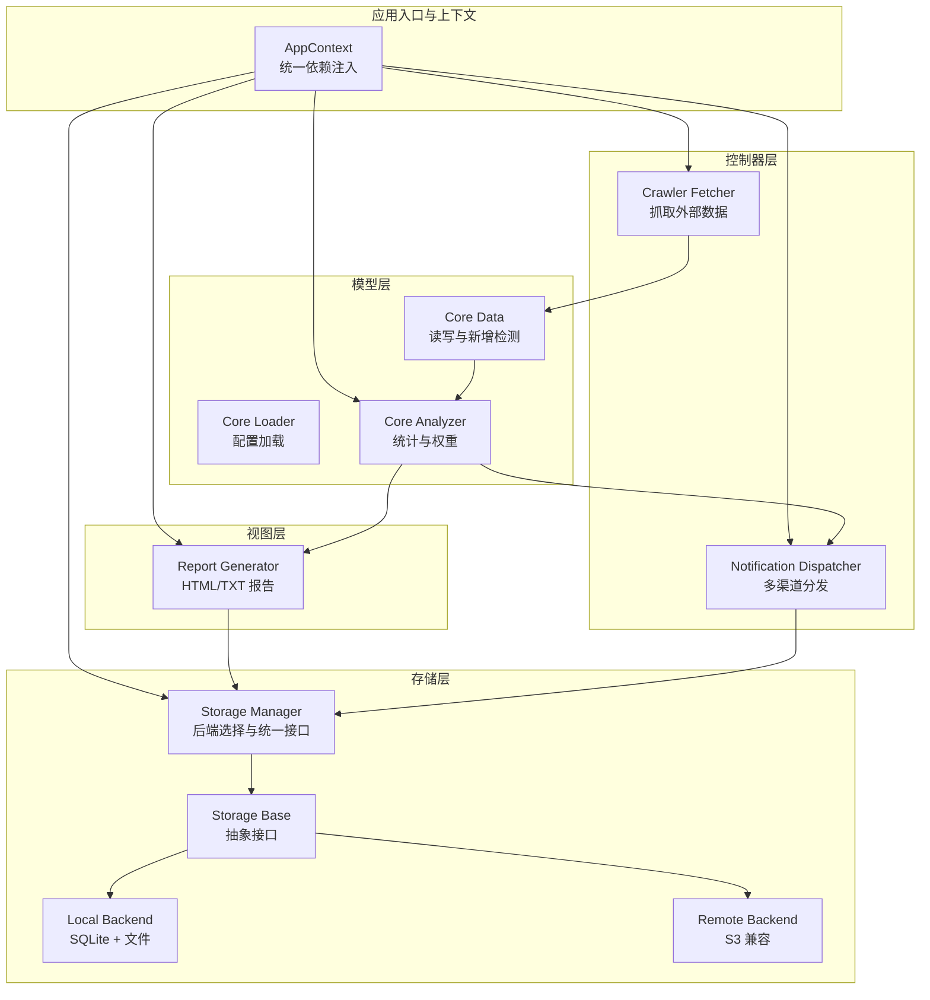
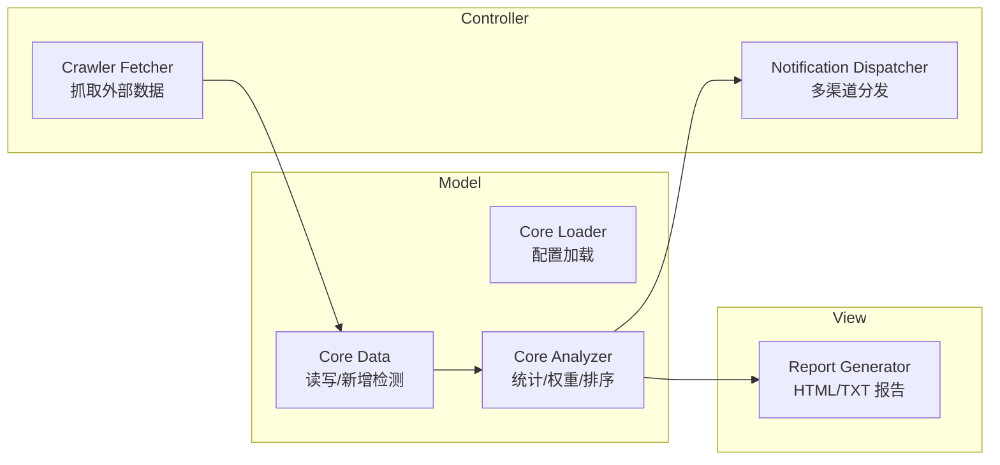
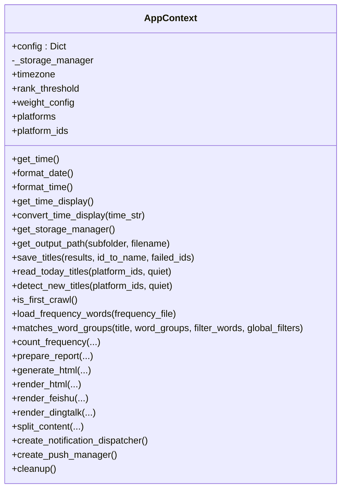
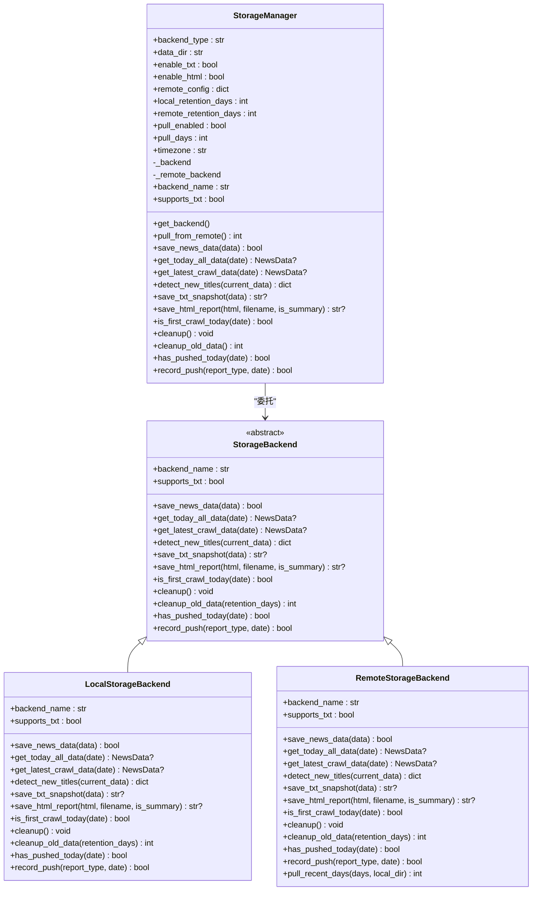
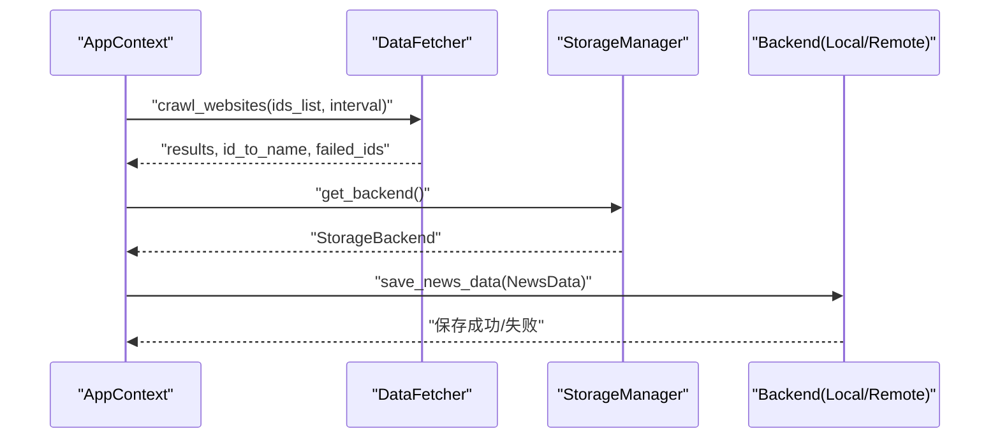
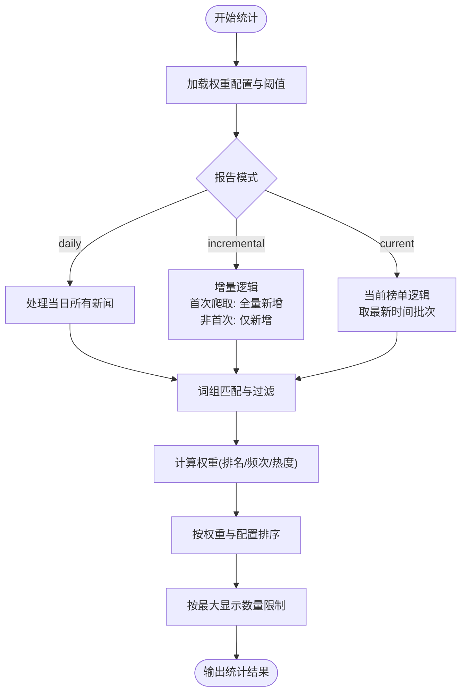
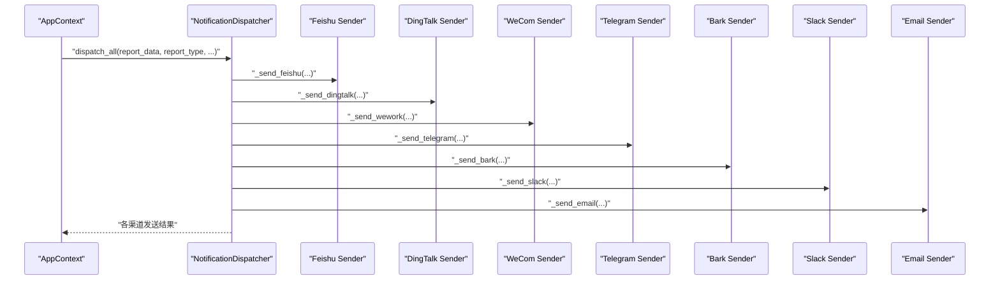
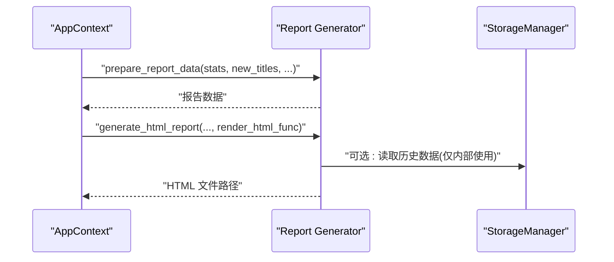
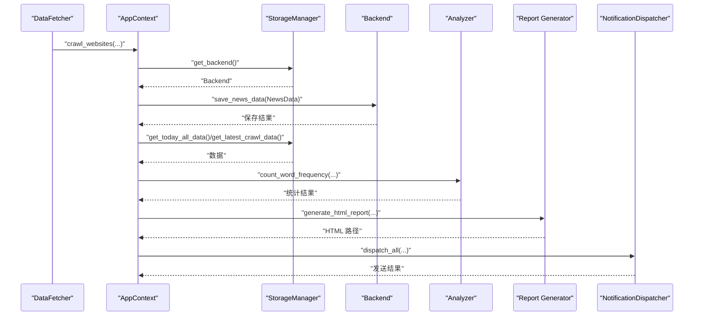
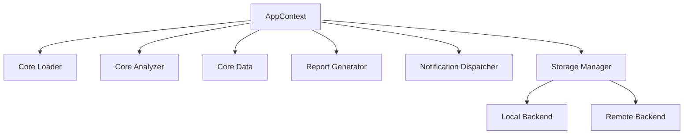

# 架构设计

<cite>
**本文引用的文件**
- [trendradar/context.py](file://trendradar/context.py)
- [trendradar/core/analyzer.py](file://trendradar/core/analyzer.py)
- [trendradar/core/loader.py](file://trendradar/core/loader.py)
- [trendradar/core/data.py](file://trendradar/core/data.py)
- [trendradar/crawler/fetcher.py](file://trendradar/crawler/fetcher.py)
- [trendradar/notification/dispatcher.py](file://trendradar/notification/dispatcher.py)
- [trendradar/notification/formatters.py](file://trendradar/notification/formatters.py)
- [trendradar/report/generator.py](file://trendradar/report/generator.py)
- [trendradar/storage/manager.py](file://trendradar/storage/manager.py)
- [trendradar/storage/base.py](file://trendradar/storage/base.py)
- [trendradar/storage/local.py](file://trendradar/storage/local.py)
- [trendradar/storage/remote.py](file://trendradar/storage/remote.py)
- [config/config.yaml](file://config/config.yaml)
</cite>

## 目录
1. [引言](#引言)
2. [项目结构](#项目结构)
3. [核心组件](#核心组件)
4. [架构总览](#架构总览)
5. [详细组件分析](#详细组件分析)
6. [依赖分析](#依赖分析)
7. [性能考虑](#性能考虑)
8. [故障排查指南](#故障排查指南)
9. [结论](#结论)

## 引言
本架构文档聚焦于 TrendRadar 的高内聚、低耦合模块化设计，围绕以下目标展开：
- 解释 AppContext 作为应用上下文的核心作用，如何封装配置、存储、分析、报告与通知等能力，消除全局状态并提供依赖注入。
- 展示 MVC 架构风格：trendradar/core/ 为 Model 层（数据与业务逻辑）、trendradar/report/ 为 View 层（HTML/TXT 报告生成）、trendradar/crawler/ 与 trendradar/notification/ 为 Controller 层（外部交互）。
- 描述数据流：从爬虫模块获取原始数据，经 DataLoader（通过 AppContext 统一入口）清洗与加载，交由 Analyzer 进行权重计算与趋势分析，最终由 NotificationDispatcher 分发到各通知渠道。
- 说明 StorageManager 如何抽象本地 SQLite 与远程 S3 兼容存储，实现“auto”模式下的自动后端切换与拉取策略。

## 项目结构
TrendRadar 采用清晰的分层与职责分离：
- trendradar/context.py：应用上下文，集中暴露配置、时间、存储、分析、报告与通知等统一接口。
- trendradar/core/：模型层，包含数据加载、分析、词频与权重计算等核心业务逻辑。
- trendradar/crawler/：控制器层，负责对外部 API 的抓取与重试。
- trendradar/notification/：控制器层，负责通知渠道的多账号分发与内容格式转换。
- trendradar/report/：视图层，负责报告数据准备与 HTML/TXT 报告生成。
- trendradar/storage/：存储抽象与实现，统一本地 SQLite 与远程 S3 兼容存储。
- config/config.yaml：全局配置入口，驱动各模块行为。

图表来源
- [trendradar/context.py](file://trendradar/context.py#L1-L391)
- [trendradar/crawler/fetcher.py](file://trendradar/crawler/fetcher.py#L1-L185)
- [trendradar/core/analyzer.py](file://trendradar/core/analyzer.py#L1-L473)
- [trendradar/core/data.py](file://trendradar/core/data.py#L1-L306)
- [trendradar/report/generator.py](file://trendradar/report/generator.py#L1-L236)
- [trendradar/notification/dispatcher.py](file://trendradar/notification/dispatcher.py#L1-L421)
- [trendradar/storage/manager.py](file://trendradar/storage/manager.py#L1-L344)
- [trendradar/storage/base.py](file://trendradar/storage/base.py#L1-L456)
- [trendradar/storage/local.py](file://trendradar/storage/local.py#L1-L200)
- [trendradar/storage/remote.py](file://trendradar/storage/remote.py#L1-L200)

章节来源
- [trendradar/context.py](file://trendradar/context.py#L1-L391)
- [config/config.yaml](file://config/config.yaml#L1-L187)

## 核心组件
- AppContext：应用上下文，提供统一的依赖注入与配置访问，封装时间、存储、分析、报告与通知等能力，消除全局状态，提升可测试性与可维护性。
- StorageManager：统一存储后端管理器，支持本地 SQLite 与远程 S3 兼容存储，自动检测运行环境并在“auto”模式下切换后端；支持拉取历史数据到本地。
- DataFetcher：爬虫控制器，负责从外部 API 抓取数据，具备重试与代理支持。
- NotificationDispatcher：通知调度器，统一多账号分发逻辑，支持多种渠道与批量发送策略。
- Analyzer：统计分析模块，计算新闻权重、格式化时间显示、按词组规则统计词频与排序。
- Report Generator：报告生成模块，准备报告数据并生成 HTML/TXT 报告。
- Storage Base/Local/Remote：存储抽象与实现，提供统一接口，屏蔽本地与远程差异。

章节来源
- [trendradar/context.py](file://trendradar/context.py#L1-L391)
- [trendradar/storage/manager.py](file://trendradar/storage/manager.py#L1-L344)
- [trendradar/crawler/fetcher.py](file://trendradar/crawler/fetcher.py#L1-L185)
- [trendradar/notification/dispatcher.py](file://trendradar/notification/dispatcher.py#L1-L421)
- [trendradar/core/analyzer.py](file://trendradar/core/analyzer.py#L1-L473)
- [trendradar/report/generator.py](file://trendradar/report/generator.py#L1-L236)
- [trendradar/storage/base.py](file://trendradar/storage/base.py#L1-L456)
- [trendradar/storage/local.py](file://trendradar/storage/local.py#L1-L200)
- [trendradar/storage/remote.py](file://trendradar/storage/remote.py#L1-L200)

## 架构总览
TrendRadar 采用 MVC 风格：
- Model（trendradar/core/）：封装数据与业务逻辑，包括数据加载、分析与统计。
- View（trendradar/report/）：负责报告生成（HTML/TXT），将统计结果可视化。
- Controller（trendradar/crawler/ 与 trendradar/notification/）：处理外部交互，分别负责数据抓取与通知分发。

图表来源
- [trendradar/core/loader.py](file://trendradar/core/loader.py#L1-L333)
- [trendradar/core/data.py](file://trendradar/core/data.py#L1-L306)
- [trendradar/core/analyzer.py](file://trendradar/core/analyzer.py#L1-L473)
- [trendradar/report/generator.py](file://trendradar/report/generator.py#L1-L236)
- [trendradar/crawler/fetcher.py](file://trendradar/crawler/fetcher.py#L1-L185)
- [trendradar/notification/dispatcher.py](file://trendradar/notification/dispatcher.py#L1-L421)

## 详细组件分析

### AppContext：统一依赖注入与上下文封装
- 职责
  - 暴露统一接口：时间、存储、数据读写、分析、报告与通知。
  - 消除全局状态：通过构造函数注入配置，避免直接依赖全局 CONFIG。
  - 延迟初始化与单例：存储管理器按需创建并复用。
- 关键能力
  - 时间：时区配置、时间格式化、显示转换。
  - 存储：根据 STORAGE 配置创建 StorageManager，支持 auto 模式自动切换。
  - 数据：保存 TXT 快照、读取当天标题、检测新增、首次爬取判断。
  - 分析：加载频率词、词组匹配、统计词频与权重计算。
  - 报告：准备报告数据、生成 HTML、渲染 HTML 内容。
  - 通知：创建调度器与推送记录管理器，内容分批与多账号分发。
  - 资源清理：调用存储后端清理过期数据与资源。
- 设计优势
  - 高内聚：将与“上下文”相关的所有能力聚合在一个类中。
  - 低耦合：通过 AppContext 统一入口，各模块仅依赖上下文接口，不直接依赖具体实现细节。

图表来源
- [trendradar/context.py](file://trendradar/context.py#L1-L391)

章节来源
- [trendradar/context.py](file://trendradar/context.py#L1-L391)

### StorageManager：存储后端抽象与自动切换
- 职责
  - 统一存储接口：save_news_data、get_today_all_data、get_latest_crawl_data、detect_new_titles、save_txt_snapshot、save_html_report、is_first_crawl_today、cleanup、cleanup_old_data、has_pushed_today、record_push。
  - 自动后端选择：backend_type 为 auto 时，在 GitHub Actions 且配置了远程存储则使用 remote，否则使用 local。
  - 运行环境检测：is_github_actions、is_docker。
  - 远程拉取：pull_from_remote，支持拉取最近 N 天数据到本地。
  - 单例管理：全局单例，支持强制重建。
- 本地后端（LocalStorageBackend）
  - SQLite 主存储，按日期组织数据库文件，支持平台信息、新闻项、排名历史与标题变更记录。
  - 支持 TXT 快照与 HTML 报告生成（可选）。
- 远程后端（RemoteStorageBackend）
  - S3 兼容协议，使用 boto3 访问对象存储。
  - 下载当天 SQLite 至本地临时目录进行合并与上传，支持腾讯云 COS 的特殊签名版本。
  - 支持拉取历史数据到本地（pull_from_remote）。

图表来源
- [trendradar/storage/manager.py](file://trendradar/storage/manager.py#L1-L344)
- [trendradar/storage/base.py](file://trendradar/storage/base.py#L1-L456)
- [trendradar/storage/local.py](file://trendradar/storage/local.py#L1-L200)
- [trendradar/storage/remote.py](file://trendradar/storage/remote.py#L1-L200)

章节来源
- [trendradar/storage/manager.py](file://trendradar/storage/manager.py#L1-L344)
- [trendradar/storage/base.py](file://trendradar/storage/base.py#L1-L456)
- [trendradar/storage/local.py](file://trendradar/storage/local.py#L1-L200)
- [trendradar/storage/remote.py](file://trendradar/storage/remote.py#L1-L200)

### DataFetcher：爬虫控制器
- 职责
  - 从外部 API 抓取数据，支持重试与代理。
  - 批量爬取多个平台，构建 results、id_to_name 与 failed_ids。
- 关键点
  - 重试策略：指数退避与随机抖动。
  - 请求间隔：可配置，避免过于频繁导致限流。
  - 数据清洗：过滤无效标题，合并相同标题的不同排名。

图表来源
- [trendradar/context.py](file://trendradar/context.py#L1-L391)
- [trendradar/crawler/fetcher.py](file://trendradar/crawler/fetcher.py#L1-L185)
- [trendradar/storage/manager.py](file://trendradar/storage/manager.py#L1-L344)
- [trendradar/storage/base.py](file://trendradar/storage/base.py#L1-L456)

章节来源
- [trendradar/crawler/fetcher.py](file://trendradar/crawler/fetcher.py#L1-L185)

### Analyzer：统计与权重计算
- 职责
  - 计算新闻权重（基于排名、频次与热度）。
  - 格式化时间显示（首末时间区间）。
  - 统计词频，支持必须词、频率词、过滤词与全局过滤词，按配置排序与限制数量。
  - 支持三种报告模式：daily（当日汇总）、incremental（增量监控）、current（当前榜单）。
- 关键点
  - 权重配置：rank_weight、frequency_weight、hotness_weight。
  - 新增检测：结合 is_first_crawl 与历史数据，区分“新增”与“历史”。
  - 排序优先级：可按配置位置优先或按热点条数优先。

图表来源
- [trendradar/core/analyzer.py](file://trendradar/core/analyzer.py#L1-L473)

章节来源
- [trendradar/core/analyzer.py](file://trendradar/core/analyzer.py#L1-L473)

### NotificationDispatcher：通知分发与多账号管理
- 职责
  - 统一多账号分发接口，支持飞书、钉钉、企业微信、Telegram、ntfy、Bark、Slack、邮件等。
  - 内容分批与发送间隔控制。
  - 多账号解析、数量限制与配对验证（如 Telegram 的 token 与 chat_id）。
- 关键点
  - 批量发送：按渠道配置的 batch_size 与 batch_interval 控制。
  - 多账号：parse_multi_account_config 与 limit_accounts。
  - 配对校验：validate_paired_configs。

图表来源
- [trendradar/notification/dispatcher.py](file://trendradar/notification/dispatcher.py#L1-L421)
- [trendradar/notification/formatters.py](file://trendradar/notification/formatters.py#L1-L81)

章节来源
- [trendradar/notification/dispatcher.py](file://trendradar/notification/dispatcher.py#L1-L421)
- [trendradar/notification/formatters.py](file://trendradar/notification/formatters.py#L1-L81)

### Report Generator：报告生成与数据准备
- 职责
  - 准备报告数据：统计结果与新增新闻（按词组过滤与阈值）。
  - 生成 HTML 报告：写入文件并可复制到 index.html。
- 关键点
  - 新增新闻区域：在 incremental 模式下隐藏。
  - 频率词过滤：与推送显示一致，减少噪音。

图表来源
- [trendradar/report/generator.py](file://trendradar/report/generator.py#L1-L236)
- [trendradar/context.py](file://trendradar/context.py#L1-L391)

章节来源
- [trendradar/report/generator.py](file://trendradar/report/generator.py#L1-L236)

### 数据流：从抓取到通知
- 流程
  - 爬虫抓取：DataFetcher 从外部 API 获取原始数据，构建 results、id_to_name 与 failed_ids。
  - 数据入库：AppContext 调用 StorageManager 保存 NewsData。
  - 数据读取：AppContext 读取当天所有标题与新增标题，用于分析与报告。
  - 统计分析：Analyzer 计算权重、统计词频并排序。
  - 报告生成：Report Generator 准备数据并生成 HTML/TXT 报告。
  - 通知分发：NotificationDispatcher 按配置分发到各渠道，支持多账号与批量发送。
  - 存储清理：AppContext 调用 StorageManager 清理过期数据与资源。

图表来源
- [trendradar/crawler/fetcher.py](file://trendradar/crawler/fetcher.py#L1-L185)
- [trendradar/context.py](file://trendradar/context.py#L1-L391)
- [trendradar/storage/manager.py](file://trendradar/storage/manager.py#L1-L344)
- [trendradar/storage/base.py](file://trendradar/storage/base.py#L1-L456)
- [trendradar/core/analyzer.py](file://trendradar/core/analyzer.py#L1-L473)
- [trendradar/report/generator.py](file://trendradar/report/generator.py#L1-L236)
- [trendradar/notification/dispatcher.py](file://trendradar/notification/dispatcher.py#L1-L421)

## 依赖分析
- 组件耦合与内聚
  - AppContext 高内聚地封装了时间、存储、分析、报告与通知等能力，降低模块间直接依赖。
  - StorageManager 作为统一入口，屏蔽本地与远程差异，降低上层对具体存储实现的耦合。
  - NotificationDispatcher 通过配置与回调函数解耦渠道实现细节。
- 直接与间接依赖
  - AppContext 依赖 trendradar.utils.*（时间与 URL 工具）、trendradar.core.*（分析与数据）、trendradar.report.*（报告）、trendradar.notification.*（通知）、trendradar.storage.*（存储）。
  - StorageManager 依赖 StorageBackend 抽象，具体实现为 LocalStorageBackend 与 RemoteStorageBackend。
  - Analyzer 依赖 frequency 匹配工具与 AppContext 的时间转换与阈值配置。
- 循环依赖
  - 未发现循环依赖迹象；各模块通过 AppContext 与 StorageManager 形成清晰的单向依赖链。
- 外部依赖与集成点
  - 远程存储依赖 boto3（S3 兼容协议）。
  - 通知渠道依赖各平台 Webhook/Token/ChatId 等配置。
  - 报告生成依赖 HTML 渲染与文件系统。

图表来源
- [trendradar/context.py](file://trendradar/context.py#L1-L391)
- [trendradar/storage/manager.py](file://trendradar/storage/manager.py#L1-L344)
- [trendradar/storage/local.py](file://trendradar/storage/local.py#L1-L200)
- [trendradar/storage/remote.py](file://trendradar/storage/remote.py#L1-L200)

章节来源
- [trendradar/context.py](file://trendradar/context.py#L1-L391)
- [trendradar/storage/manager.py](file://trendradar/storage/manager.py#L1-L344)

## 性能考虑
- 存储层
  - 本地 SQLite：按日期分库，适合中小规模数据；注意磁盘空间与索引优化。
  - 远程 S3：下载/合并/上传涉及网络 IO，建议合理设置 pull_days 与 batch_size。
- 爬虫层
  - 请求间隔与重试策略平衡稳定性与吞吐量；代理与超时设置避免阻塞。
- 分析层
  - 权重计算与排序复杂度与新闻条目数量相关；可通过 max_news_per_keyword 限制输出规模。
- 通知层
  - 多账号与批量发送需控制 batch_size 与 batch_interval，避免触发平台限流。

## 故障排查指南
- 配置加载
  - 确认 CONFIG_PATH 环境变量或 config/config.yaml 存在且可读。
  - 检查 STORAGE.backend 与 STORAGE.remote.* 配置是否完整。
- 存储后端
  - 远程后端需安装 boto3；若导入失败，检查依赖与环境变量。
  - 检查 S3 endpoint、bucket、access_key、secret_key、region 是否正确。
- 爬虫抓取
  - 观察重试日志与失败 ID 列表，确认 API 可达性与代理设置。
- 通知分发
  - 多账号数量与配对验证（如 Telegram token/chat_id）需一致。
  - 检查各渠道 webhook/URL 是否有效，必要时开启 DEBUG 日志。
- 报告生成
  - HTML 报告路径与 index.html 复制逻辑是否生效；确认输出目录权限。

章节来源
- [trendradar/core/loader.py](file://trendradar/core/loader.py#L1-L333)
- [trendradar/storage/remote.py](file://trendradar/storage/remote.py#L1-L200)
- [trendradar/crawler/fetcher.py](file://trendradar/crawler/fetcher.py#L1-L185)
- [trendradar/notification/dispatcher.py](file://trendradar/notification/dispatcher.py#L1-L421)
- [trendradar/report/generator.py](file://trendradar/report/generator.py#L1-L236)

## 结论
TrendRadar 通过 AppContext 实现统一依赖注入与上下文封装，结合 StorageManager 的存储抽象与自动后端切换，形成了高内聚、低耦合的模块化架构。MVC 风格的分层使职责清晰：Model 负责数据与业务逻辑，View 负责报告生成，Controller 负责外部交互。该设计提升了系统的可扩展性、可维护性与可移植性，便于在本地与云端环境中灵活部署与演进。