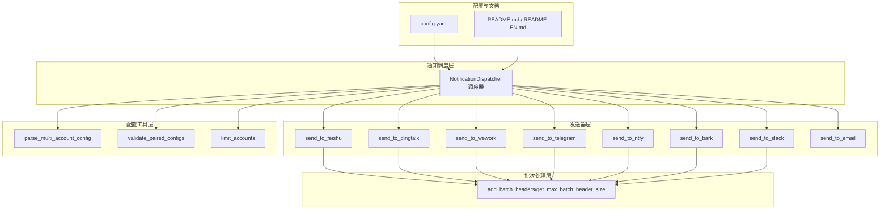
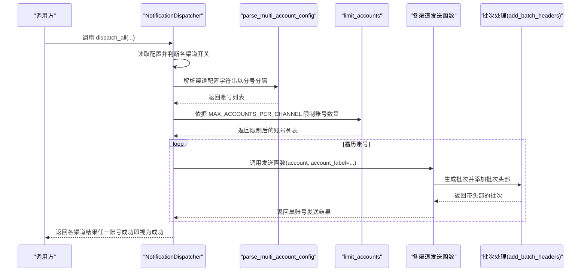
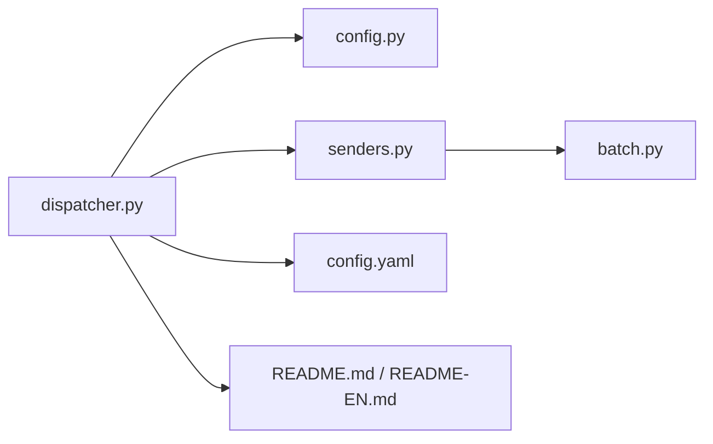

# 多账号处理机制

<cite>
**本文引用的文件**
- [dispatcher.py](file://trendradar/notification/dispatcher.py)
- [senders.py](file://trendradar/notification/senders.py)
- [config.py](file://trendradar/core/config.py)
- [batch.py](file://trendradar/notification/batch.py)
- [config.yaml](file://config/config.yaml)
- [README.md](file://README.md)
- [README-EN.md](file://README-EN.md)
</cite>

## 目录
1. [简介](#简介)
2. [项目结构](#项目结构)
3. [核心组件](#核心组件)
4. [架构总览](#架构总览)
5. [详细组件分析](#详细组件分析)
6. [依赖关系分析](#依赖关系分析)
7. [性能考量](#性能考量)
8. [故障排查指南](#故障排查指南)
9. [结论](#结论)

## 简介
本章节聚焦 TrendRadar 通知调度器中的“多账号处理机制”。目标是解释调度器如何通过通用方法统一处理飞书、钉钉、企业微信、Telegram、ntfy、Bark、Slack 等渠道的多账号配置；如何解析以分号分隔的多账号字符串、如何基于配置项限制账号数量、如何在各渠道发送函数中体现“账号标签”以便区分日志，以及在调度器主流程中如何调用这些逻辑并进行容错处理。

## 项目结构
围绕多账号处理的相关文件主要分布在以下模块：
- 调度器：负责统一入口与多账号通用逻辑
- 发送器：各渠道具体发送实现，支持分批与账号标签
- 配置工具：解析、校验与限制多账号
- 批次处理：为各渠道生成批次头部并安全截断
- 配置文件：集中声明最大账号数量与各渠道配置
- 文档：提供示例与注意事项

图表来源
- [dispatcher.py](file://trendradar/notification/dispatcher.py#L1-L421)
- [senders.py](file://trendradar/notification/senders.py#L1-L1036)
- [config.py](file://trendradar/core/config.py#L1-L125)
- [batch.py](file://trendradar/notification/batch.py#L1-L116)
- [config.yaml](file://config/config.yaml#L82-L156)
- [README.md](file://README.md#L2780-L2960)
- [README-EN.md](file://README-EN.md#L2747-L2918)

章节来源
- [dispatcher.py](file://trendradar/notification/dispatcher.py#L1-L137)
- [config.yaml](file://config/config.yaml#L82-L156)

## 核心组件
- 通用多账号发送方法：_send_to_multi_accounts
- 多账号解析：parse_multi_account_config
- 配对校验：validate_paired_configs（用于 Telegram/ntfy）
- 账号数量限制：limit_accounts
- 各渠道发送函数：send_to_feishu、send_to_dingtalk、send_to_wework、send_to_telegram、send_to_ntfy、send_to_bark、send_to_slack
- 批次头部与安全截断：add_batch_headers、get_max_batch_header_size
- 配置项：MAX_ACCOUNTS_PER_CHANNEL、各渠道 webhook/token/topic 等

章节来源
- [dispatcher.py](file://trendradar/notification/dispatcher.py#L138-L250)
- [config.py](file://trendradar/core/config.py#L1-L125)
- [senders.py](file://trendradar/notification/senders.py#L1-L1036)
- [batch.py](file://trendradar/notification/batch.py#L1-L116)
- [config.yaml](file://config/config.yaml#L82-L156)

## 架构总览
下图展示了调度器如何统一调用多账号通用逻辑，并在各渠道发送函数中体现“账号标签”，同时通过批次处理保证内容大小合规。

图表来源
- [dispatcher.py](file://trendradar/notification/dispatcher.py#L138-L250)
- [senders.py](file://trendradar/notification/senders.py#L1-L1036)
- [config.py](file://trendradar/core/config.py#L1-L125)
- [batch.py](file://trendradar/notification/batch.py#L1-L116)
- [config.yaml](file://config/config.yaml#L82-L156)

## 详细组件分析

### 通用多账号发送方法：_send_to_multi_accounts
- 输入：渠道名、配置值（可能含多个账号）、发送函数、其他参数
- 流程：
  1) 使用 parse_multi_account_config 解析以分号分隔的配置字符串，得到账号列表；
  2) 使用 limit_accounts 按配置限制账号数量；
  3) 循环遍历账号，构造 account_label（当存在多个账号时显示“账号1/账号2”等），调用发送函数；
  4) 收集各账号发送结果，只要任一账号成功即返回 True。
- 关键点：
  - account_label 仅在多账号时附加，单账号时不显示；
  - 发送函数签名要求支持 account_label 关键字参数；
  - 返回值采用“任一成功即成功”的策略，提升容错能力。

章节来源
- [dispatcher.py](file://trendradar/notification/dispatcher.py#L138-L171)

### 多账号解析：parse_multi_account_config
- 功能：将“以分号分隔”的配置字符串拆分为账号列表，保留空串用于占位；
- 行为：若输入为空或拆分后全为空串，返回空列表；
- 用途：为所有以分号分隔的多账号配置提供统一解析入口。

章节来源
- [config.py](file://trendradar/core/config.py#L11-L38)

### 配对校验：validate_paired_configs
- 适用场景：Telegram（token 与 chat_id）、ntfy（topic 与 token）等需要成对配置的渠道；
- 功能：校验多个配置项的账号数量是否一致，不一致则打印错误并跳过该渠道；
- 返回：(是否通过, 账号数量)。

章节来源
- [config.py](file://trendradar/core/config.py#L40-L95)

### 账号数量限制：limit_accounts
- 功能：当账号数量超过最大限制时，仅保留前 N 个并输出警告日志；
- 限制来源：配置项 MAX_ACCOUNTS_PER_CHANNEL；
- 用途：统一控制各渠道最大账号数量，避免过度消耗资源或触发外部风控。

章节来源
- [config.py](file://trendradar/core/config.py#L97-L125)
- [config.yaml](file://config/config.yaml#L82-L106)

### 飞书、钉钉、企业微信等渠道的统一应用
- 三类渠道均通过 _send_to_multi_accounts 实现多账号发送：
  - 飞书：FEISHU_WEBHOOK_URL
  - 钉钉：DINGTALK_WEBHOOK_URL
  - 企业微信：WEWORK_WEBHOOK_URL
- 共同特征：
  - 使用 parse_multi_account_config 解析配置；
  - 使用 limit_accounts 限制账号数量；
  - 在发送函数中通过 account_label 区分日志；
  - 各自支持批次发送与批次间隔配置。

章节来源
- [dispatcher.py](file://trendradar/notification/dispatcher.py#L172-L250)
- [senders.py](file://trendradar/notification/senders.py#L61-L168)
- [senders.py](file://trendradar/notification/senders.py#L170-L266)
- [senders.py](file://trendradar/notification/senders.py#L268-L375)

### Telegram 的配对与多账号
- 解析 token 与 chat_id；
- 调用 validate_paired_configs 校验数量一致性；
- 限制账号数量后，按索引一一对应发送；
- account_label 用于日志区分。

章节来源
- [dispatcher.py](file://trendradar/notification/dispatcher.py#L252-L302)
- [config.py](file://trendradar/core/config.py#L40-L95)

### ntfy 的配对与多账号
- 解析 topic 与 token；
- 若提供 token，要求 token 数量与 topic 数量一致（或部分为空占位）；
- 限制账号数量后，按索引发送（token 可为空占位）；
- account_label 用于日志区分。

章节来源
- [dispatcher.py](file://trendradar/notification/dispatcher.py#L303-L352)
- [config.py](file://trendradar/core/config.py#L97-L125)

### 各渠道发送函数中的账号标签与批次处理
- 账号标签：在 senders 中，日志前缀会根据 account_label 动态拼接，便于区分不同账号；
- 批次处理：各发送函数通过分批函数与 add_batch_headers 生成批次并添加头部，预留头部空间避免超限；
- 批次间隔：各渠道支持批次间隔参数，用于控制发送节奏。

章节来源
- [senders.py](file://trendradar/notification/senders.py#L61-L168)
- [senders.py](file://trendradar/notification/senders.py#L170-L266)
- [senders.py](file://trendradar/notification/senders.py#L268-L375)
- [senders.py](file://trendradar/notification/senders.py#L377-L472)
- [senders.py](file://trendradar/notification/senders.py#L630-L800)
- [batch.py](file://trendradar/notification/batch.py#L1-L116)

### 调度器主流程中的调用逻辑与容错
- dispatch_all 会依次检查各渠道开关并调用对应 _send_* 方法；
- 任一渠道返回 True 即视为该渠道“成功”，从而提升整体成功率；
- 多账号场景下，单账号失败不影响其他账号；
- Telegram/ntfy 在解析与配对校验阶段失败会直接跳过该渠道。

章节来源
- [dispatcher.py](file://trendradar/notification/dispatcher.py#L61-L137)
- [dispatcher.py](file://trendradar/notification/dispatcher.py#L252-L352)

## 依赖关系分析
- 调度器依赖配置工具（解析、校验、限制）与发送器；
- 发送器依赖批次处理模块；
- 配置项来自 config.yaml，调度器读取并传入各发送函数；
- README 提供示例与注意事项，指导用户正确配置多账号。

图表来源
- [dispatcher.py](file://trendradar/notification/dispatcher.py#L1-L421)
- [config.py](file://trendradar/core/config.py#L1-L125)
- [senders.py](file://trendradar/notification/senders.py#L1-L1036)
- [batch.py](file://trendradar/notification/batch.py#L1-L116)
- [config.yaml](file://config/config.yaml#L82-L156)
- [README.md](file://README.md#L2780-L2960)
- [README-EN.md](file://README-EN.md#L2747-L2918)

## 性能考量
- 多账号意味着独立发送，总耗时约等于账号数 × 单账号耗时；
- 合理控制账号数量可显著降低总耗时；
- 合理设置批次大小与批次间隔，避免触发外部限流；
- GitHub Actions 环境下建议谨慎配置账号数量，避免触发速率限制或影响账号状态。

章节来源
- [README.md](file://README.md#L2914-L2945)
- [README-EN.md](file://README-EN.md#L2890-L2918)
- [config.yaml](file://config/config.yaml#L82-L106)

## 故障排查指南
- 多账号未生效：
  - 检查配置项是否以分号分隔；
  - 检查 MAX_ACCOUNTS_PER_CHANNEL 是否过小导致被截断；
- Telegram/ntfy 推送被跳过：
  - 检查 token 与 chat_id（或 topic 与 token）数量是否一致；
  - 检查 token 与 topic 的占位是否正确（空串表示该账号无需 token）；
- 发送失败但日志显示“部分成功”：
  - 这是“任一账号成功即成功”的设计，属于预期行为；
- 批次超限或内容被截断：
  - 检查批次大小与批次头部预留是否合理；
  - 适当减小批次大小或减少内容长度。

章节来源
- [config.py](file://trendradar/core/config.py#L40-L125)
- [dispatcher.py](file://trendradar/notification/dispatcher.py#L252-L352)
- [senders.py](file://trendradar/notification/senders.py#L61-L168)
- [senders.py](file://trendradar/notification/senders.py#L170-L266)
- [senders.py](file://trendradar/notification/senders.py#L268-L375)
- [senders.py](file://trendradar/notification/senders.py#L377-L472)
- [senders.py](file://trendradar/notification/senders.py#L630-L800)
- [batch.py](file://trendradar/notification/batch.py#L1-L116)

## 结论
TrendRadar 的通知调度器通过“通用多账号发送方法 + 统一解析/校验/限制 + 各渠道发送函数 + 批次处理”的架构，实现了对飞书、钉钉、企业微信、Telegram、ntfy、Bark、Slack 等渠道的统一多账号支持。其关键优势包括：
- 以分号分隔的多账号配置具备良好的可读性与扩展性；
- 通过 limit_accounts 与 MAX_ACCOUNTS_PER_CHANNEL 控制账号规模，兼顾稳定性与安全性；
- 通过 validate_paired_configs 保障配对配置的一致性；
- 通过 account_label 与批次处理提升可观测性与可靠性；
- 通过“任一账号成功即成功”的策略增强容错能力。