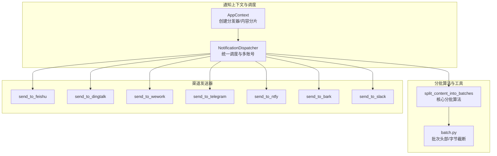
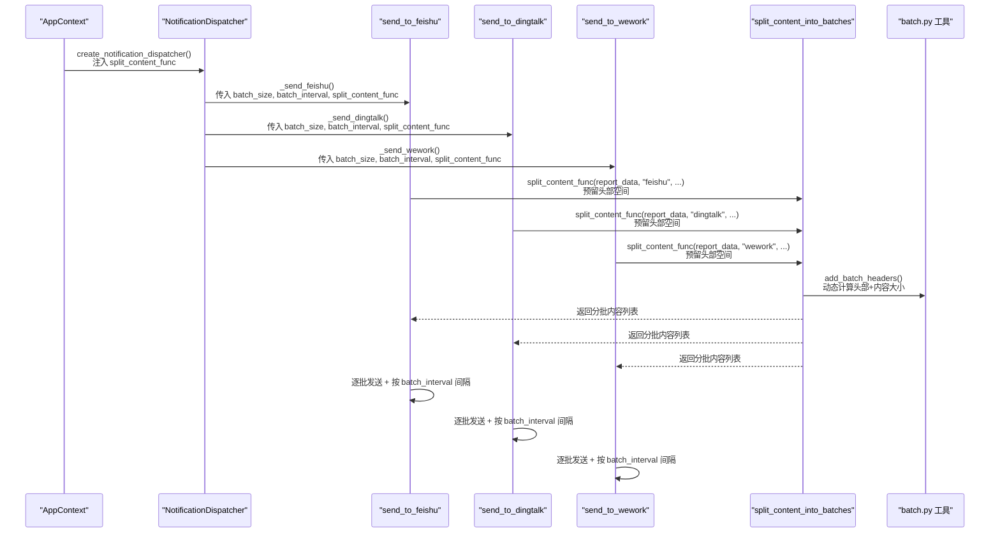
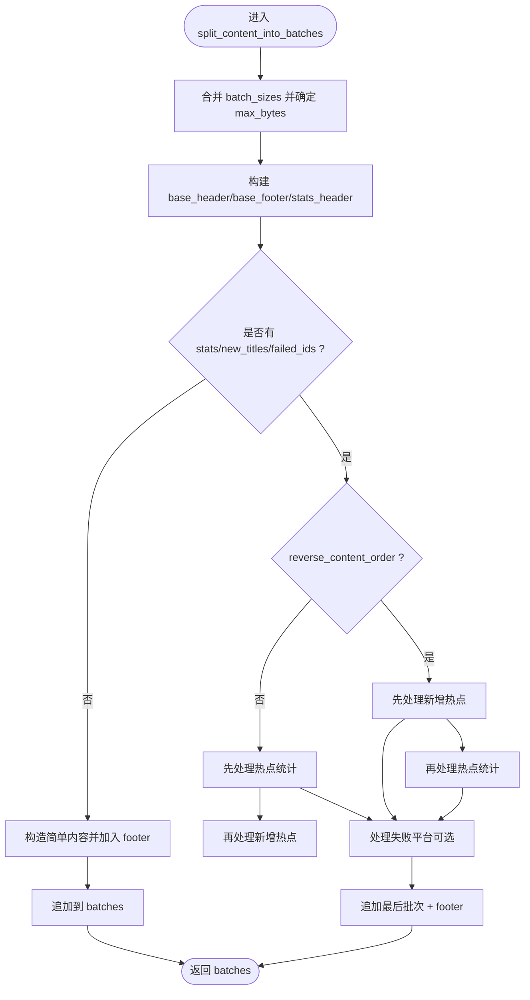
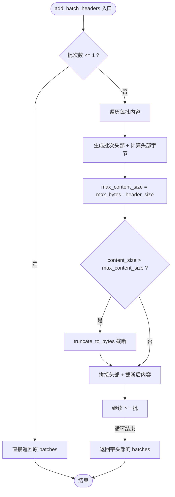
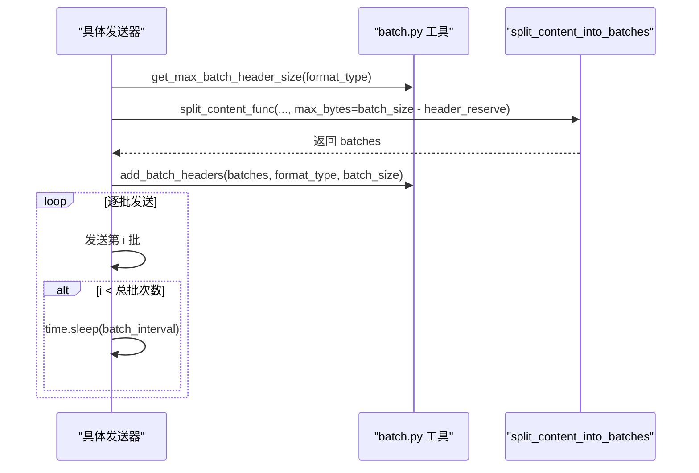
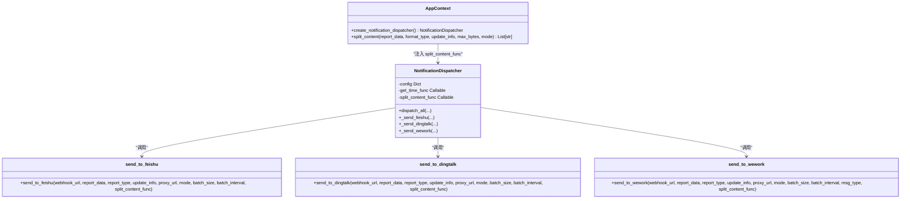
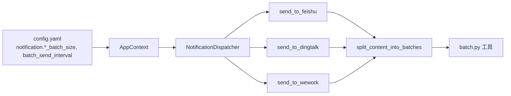

# 消息分批策略

<cite>
**本文引用的文件**
- [context.py](file://trendradar/context.py)
- [dispatcher.py](file://trendradar/notification/dispatcher.py)
- [splitter.py](file://trendradar/notification/splitter.py)
- [batch.py](file://trendradar/notification/batch.py)
- [senders.py](file://trendradar/notification/senders.py)
- [config.yaml](file://config/config.yaml)
</cite>

## 目录
1. [简介](#简介)
2. [项目结构](#项目结构)
3. [核心组件](#核心组件)
4. [架构总览](#架构总览)
5. [详细组件分析](#详细组件分析)
6. [依赖关系分析](#依赖关系分析)
7. [性能考量](#性能考量)
8. [故障排查指南](#故障排查指南)
9. [结论](#结论)

## 简介
本文件围绕 TrendRadar 的消息分批发送策略展开，重点说明以下内容：
- 如何通过高阶函数 split_content_func 注入到 NotificationDispatcher；
- AppContext 如何通过 create_notification_dispatcher() 与 split_content() 方法建立依赖；
- 不同通知渠道（飞书、钉钉、企业微信等）如何依据各自 *_BATCH_SIZE 配置进行内容分片；
- BATCH_SEND_INTERVAL 如何控制批次间的发送间隔以避免 API 限流；
- split_content_into_batches 的实际分批算法如何保证消息完整性与发送效率。

## 项目结构
与消息分批相关的核心文件分布如下：
- 上下文与调度层：trendradar/context.py、trendradar/notification/dispatcher.py
- 分批算法与批次工具：trendradar/notification/splitter.py、trendradar/notification/batch.py
- 渠道发送器：trendradar/notification/senders.py
- 配置：config/config.yaml

图表来源
- [context.py](file://trendradar/context.py#L341-L375)
- [dispatcher.py](file://trendradar/notification/dispatcher.py#L172-L250)
- [splitter.py](file://trendradar/notification/splitter.py#L23-L120)
- [batch.py](file://trendradar/notification/batch.py#L11-L116)
- [senders.py](file://trendradar/notification/senders.py#L99-L237)

章节来源
- [context.py](file://trendradar/context.py#L341-L375)
- [dispatcher.py](file://trendradar/notification/dispatcher.py#L172-L250)
- [splitter.py](file://trendradar/notification/splitter.py#L23-L120)
- [batch.py](file://trendradar/notification/batch.py#L11-L116)
- [senders.py](file://trendradar/notification/senders.py#L99-L237)

## 核心组件
- AppContext.split_content(): 将 report_data、format_type、update_info、mode 等参数传入 split_content_into_batches，并注入 batch_sizes、分隔符、内容顺序等配置，最终返回分批后的消息列表。
- NotificationDispatcher.split_content_func: 在创建分发器时注入 AppContext.split_content()，随后在各渠道发送器中调用该函数进行分批。
- split_content_into_batches(): 核心分批算法，按平台格式拼接标题、统计、新增新闻、失败平台等段落，保证“词组标题+第一条新闻”、“来源标题+第一条新闻”的原子性，同时考虑分隔符与页脚，动态计算每批大小。
- batch.py: 提供批次头部生成、最大头部字节估算、安全截断等工具，确保添加头部后仍满足平台字节限制。
- 各渠道发送器：在调用 split_content_func 前预留头部空间，再统一添加批次头部；逐批发送并在批次间按配置间隔 sleep。

章节来源
- [context.py](file://trendradar/context.py#L341-L375)
- [dispatcher.py](file://trendradar/notification/dispatcher.py#L42-L71)
- [splitter.py](file://trendradar/notification/splitter.py#L23-L120)
- [batch.py](file://trendradar/notification/batch.py#L11-L116)
- [senders.py](file://trendradar/notification/senders.py#L99-L237)

## 架构总览
下图展示从 AppContext 到各渠道发送器的调用链路，以及分批策略的关键节点。

图表来源
- [context.py](file://trendradar/context.py#L341-L375)
- [dispatcher.py](file://trendradar/notification/dispatcher.py#L172-L250)
- [senders.py](file://trendradar/notification/senders.py#L99-L237)
- [splitter.py](file://trendradar/notification/splitter.py#L23-L120)
- [batch.py](file://trendradar/notification/batch.py#L78-L116)

## 详细组件分析

### split_content_into_batches 分批算法
- 输入参数：report_data、format_type、update_info、max_bytes、mode、batch_sizes、feishu_separator、reverse_content_order、get_time_func。
- 输出：分批后的消息内容列表。
- 关键特性：
  - 默认批次大小：钉钉 20000、飞书 29000、ntfy 3800、默认 4000。
  - 优先保证“词组标题+第一条新闻”、“来源标题+第一条新闻”的原子性，避免跨批截断导致语义不完整。
  - 动态拼接 base_header/base_footer/stats_header/new_titles/failures 等段落，考虑不同平台的格式差异与分隔符。
  - 支持 reverse_content_order：新增热点在前，热点统计在后。
  - 通过 len(content.encode("utf-8")) 计算字节数，避免截断多字节字符。

图表来源
- [splitter.py](file://trendradar/notification/splitter.py#L23-L120)
- [splitter.py](file://trendradar/notification/splitter.py#L120-L581)

章节来源
- [splitter.py](file://trendradar/notification/splitter.py#L23-L120)
- [splitter.py](file://trendradar/notification/splitter.py#L120-L581)

### 分批头部与字节安全
- get_max_batch_header_size(format_type): 估算最大头部字节数（假设最多 99 批次），用于预留空间。
- add_batch_headers(batches, format_type, max_bytes): 为每批添加头部，并动态计算允许的内容大小，若超限则安全截断。
- truncate_to_bytes(text, max_bytes): 安全截断到指定字节数，避免破坏 UTF-8 编码。

图表来源
- [batch.py](file://trendradar/notification/batch.py#L11-L116)

章节来源
- [batch.py](file://trendradar/notification/batch.py#L11-L116)

### 渠道分批与间隔控制
- 飞书、钉钉、企业微信、Telegram、ntfy、Bark、Slack 等发送器均遵循相同流程：
  - 预留头部空间：header_reserve = get_max_batch_header_size(format_type)
  - 调用 split_content_func(report_data, format_type, ..., max_bytes=batch_size - header_reserve)
  - 统一添加批次头部：add_batch_headers(batches, format_type, batch_size)
  - 逐批发送：对每批打印日志、构造 payload、发送请求
  - 批次间隔：仅在 i < len(batches) 时执行 time.sleep(batch_interval)

图表来源
- [senders.py](file://trendradar/notification/senders.py#L99-L237)
- [senders.py](file://trendradar/notification/senders.py#L268-L374)
- [senders.py](file://trendradar/notification/senders.py#L377-L471)
- [senders.py](file://trendradar/notification/senders.py#L630-L803)
- [senders.py](file://trendradar/notification/senders.py#L805-L948)
- [senders.py](file://trendradar/notification/senders.py#L950-L1036)
- [batch.py](file://trendradar/notification/batch.py#L11-L116)
- [splitter.py](file://trendradar/notification/splitter.py#L23-L120)

章节来源
- [senders.py](file://trendradar/notification/senders.py#L99-L237)
- [senders.py](file://trendradar/notification/senders.py#L268-L374)
- [senders.py](file://trendradar/notification/senders.py#L377-L471)
- [senders.py](file://trendradar/notification/senders.py#L630-L803)
- [senders.py](file://trendradar/notification/senders.py#L805-L948)
- [senders.py](file://trendradar/notification/senders.py#L950-L1036)
- [batch.py](file://trendradar/notification/batch.py#L11-L116)
- [splitter.py](file://trendradar/notification/splitter.py#L23-L120)

### 高阶函数 split_content_func 的注入与依赖
- AppContext.create_notification_dispatcher() 将 self.split_content 注入到 NotificationDispatcher 的 split_content_func 属性中。
- NotificationDispatcher 在各渠道发送方法中，将 split_content_func 作为关键字参数传入具体发送器。
- 各发送器内部不再关心分批细节，仅负责预留头部空间、添加头部、逐批发送与间隔控制。

图表来源
- [context.py](file://trendradar/context.py#L341-L375)
- [dispatcher.py](file://trendradar/notification/dispatcher.py#L42-L71)
- [senders.py](file://trendradar/notification/senders.py#L99-L237)
- [senders.py](file://trendradar/notification/senders.py#L268-L374)
- [senders.py](file://trendradar/notification/senders.py#L377-L471)

章节来源
- [context.py](file://trendradar/context.py#L341-L375)
- [dispatcher.py](file://trendradar/notification/dispatcher.py#L42-L71)
- [senders.py](file://trendradar/notification/senders.py#L99-L237)
- [senders.py](file://trendradar/notification/senders.py#L268-L374)
- [senders.py](file://trendradar/notification/senders.py#L377-L471)

## 依赖关系分析
- AppContext 依赖 split_content_into_batches 实现分批；通过 split_content() 将配置映射为 batch_sizes、分隔符、内容顺序等。
- NotificationDispatcher 依赖 AppContext.split_content_func，从而统一各渠道的分批入口。
- 各渠道发送器依赖 batch.py 的头部与截断工具，确保在添加头部后仍满足平台字节上限。
- 配置层通过 config.yaml 提供各渠道的 *_BATCH_SIZE 与 BATCH_SEND_INTERVAL，驱动分批与间隔策略。

图表来源
- [config.yaml](file://config/config.yaml#L82-L105)
- [context.py](file://trendradar/context.py#L341-L375)
- [dispatcher.py](file://trendradar/notification/dispatcher.py#L172-L250)
- [senders.py](file://trendradar/notification/senders.py#L99-L237)
- [splitter.py](file://trendradar/notification/splitter.py#L23-L120)
- [batch.py](file://trendradar/notification/batch.py#L11-L116)

章节来源
- [config.yaml](file://config/config.yaml#L82-L105)
- [context.py](file://trendradar/context.py#L341-L375)
- [dispatcher.py](file://trendradar/notification/dispatcher.py#L172-L250)
- [senders.py](file://trendradar/notification/senders.py#L99-L237)
- [splitter.py](file://trendradar/notification/splitter.py#L23-L120)
- [batch.py](file://trendradar/notification/batch.py#L11-L116)

## 性能考量
- 分批大小选择：
  - 钉钉：默认 20000 字节；飞书：默认 29000 字节；ntfy：默认 3800 字节；其他默认 4000 字节。
  - 若平台文档有更严格的限制，可在配置中调整 *_BATCH_SIZE。
- 头部预留与安全截断：
  - 通过 get_max_batch_header_size 预留头部空间，避免添加头部后超限。
  - add_batch_headers 动态计算允许内容大小，超限时使用 truncate_to_bytes 截断，保证 UTF-8 完整性。
- 批次间隔：
  - BATCH_SEND_INTERVAL 控制批次间等待时间，降低 API 限流风险，提升整体成功率。
- 内容顺序：
  - reverse_content_order 可切换“新增热点在前/热点统计在后”，在保证完整性前提下优化阅读体验。

章节来源
- [config.yaml](file://config/config.yaml#L82-L105)
- [batch.py](file://trendradar/notification/batch.py#L11-L116)
- [splitter.py](file://trendradar/notification/splitter.py#L23-L120)
- [senders.py](file://trendradar/notification/senders.py#L99-L237)

## 故障排查指南
- 分批后仍超限：
  - 检查各渠道 *_BATCH_SIZE 是否过小；确认是否正确预留头部空间；必要时减小分隔符或简化内容。
- 多字节字符截断异常：
  - 确认使用 truncate_to_bytes 进行安全截断；避免在截断后继续拼接导致编码损坏。
- 批次头部导致超限：
  - 使用 add_batch_headers 动态计算允许内容大小；若仍超限，适当降低 batch_size 或减少批次数量。
- API 限流：
  - 增大 BATCH_SEND_INTERVAL；对于 ntfy/Bark 等平台，注意其服务端限流策略与重试机制。
- 多账号发送：
  - 注意每个账号独立计算批次间隔，总耗时会随账号数线性增长；建议控制账号数量。

章节来源
- [batch.py](file://trendradar/notification/batch.py#L11-L116)
- [senders.py](file://trendradar/notification/senders.py#L630-L803)
- [senders.py](file://trendradar/notification/senders.py#L805-L948)

## 结论
TrendRadar 的消息分批策略通过“高阶函数注入 + 平台配置 + 工具函数保障”的方式，实现了：
- 统一的分批入口与清晰的职责边界；
- 针对不同平台的差异化分批大小与头部处理；
- 原子性保障与字节安全截断；
- 明确的批次间隔控制，有效规避 API 限流；
- 可配置的分隔符、内容顺序与默认批次大小，兼顾效率与可读性。