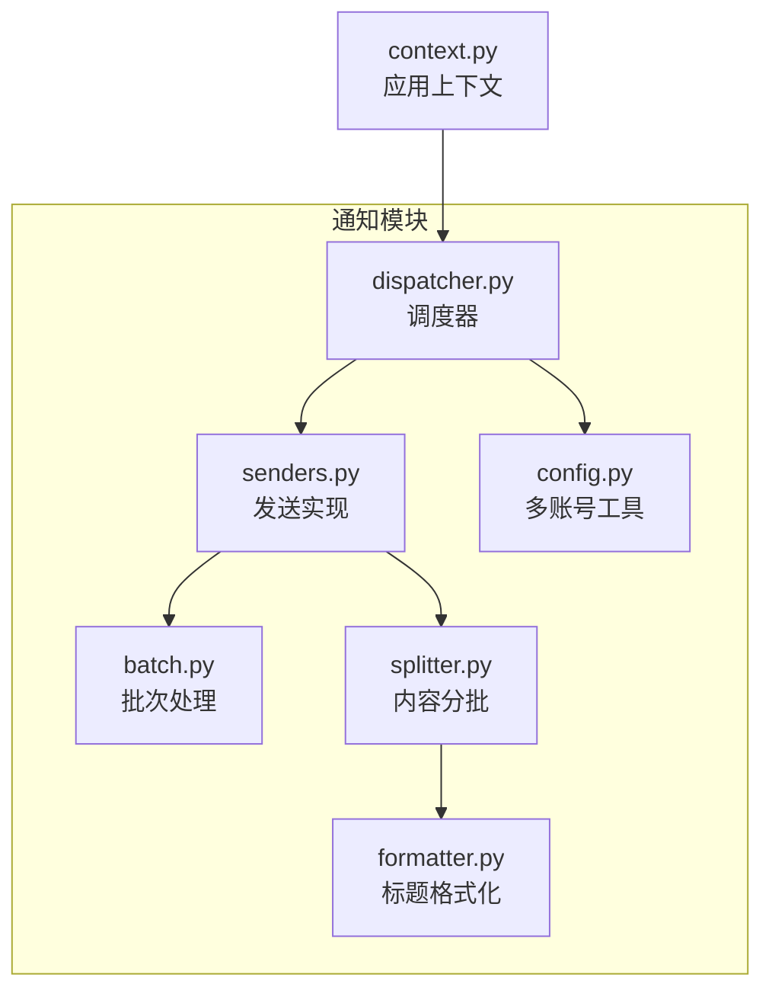
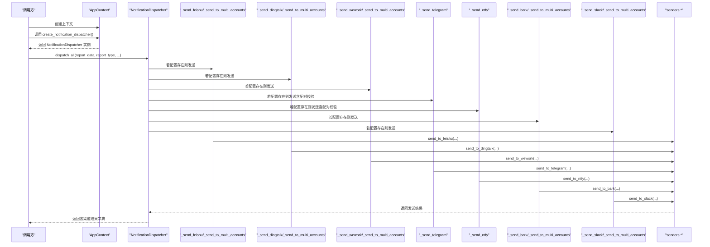
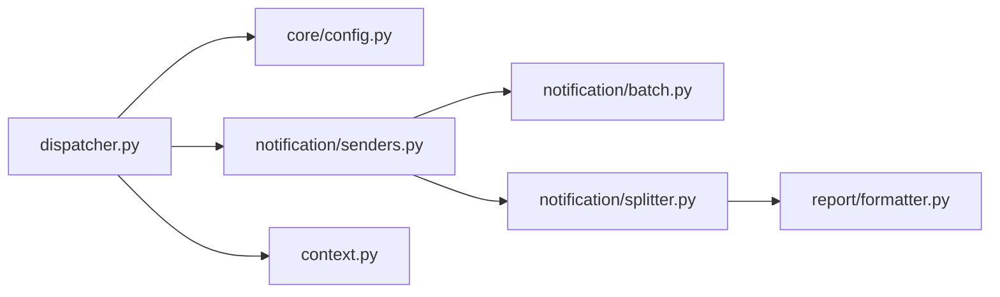

# 通知调度

<cite>
**本文档引用的文件**
- [dispatcher.py](file://trendradar/notification/dispatcher.py)
- [context.py](file://trendradar/context.py)
- [senders.py](file://trendradar/notification/senders.py)
- [batch.py](file://trendradar/notification/batch.py)
- [splitter.py](file://trendradar/notification/splitter.py)
- [config.py](file://trendradar/core/config.py)
- [formatter.py](file://trendradar/report/formatter.py)
</cite>

## 目录
1. [简介](#简介)
2. [项目结构](#项目结构)
3. [核心组件](#核心组件)
4. [架构总览](#架构总览)
5. [组件详解](#组件详解)
6. [依赖关系分析](#依赖关系分析)
7. [性能与限流策略](#性能与限流策略)
8. [故障排查指南](#故障排查指南)
9. [结论](#结论)

## 简介
本文件面向TrendRadar的通知调度系统，聚焦于NotificationDispatcher的多账号分发机制，系统性阐述如下要点：
- 通过dispatch_all()统一入口，按渠道配置分别触发发送流程；
- 通用方法_send_to_multi_accounts()解析“;”分隔的多账号配置，配合limit_accounts()限制账号数量，并循环调用具体发送函数；
- Telegram与ntfy在配对配置（token/chat_id、server/topic）上的验证逻辑；
- split_content_func在消息分批中的作用，以及batch_interval如何控制发送频率以避免限流；
- AppContext.create_notification_dispatcher()的创建过程及与应用上下文的依赖注入关系；
- 各_send_*方法如何调用底层senders模块的具体实现。

## 项目结构
通知调度相关代码主要位于trendradar/notification目录，核心文件包括：
- dispatcher.py：统一调度器，负责渠道选择与多账号分发；
- senders.py：各平台发送实现，包含分批、头部拼接、限流与重试等；
- batch.py：批次头部生成、字节截断与安全截断；
- splitter.py：内容分批算法，保证原子性与平台限制；
- config.py：多账号解析、配对校验、账号数量限制；
- context.py：应用上下文，提供create_notification_dispatcher()进行依赖注入。

图表来源
- [dispatcher.py](file://trendradar/notification/dispatcher.py#L1-L137)
- [senders.py](file://trendradar/notification/senders.py#L61-L168)
- [batch.py](file://trendradar/notification/batch.py#L1-L116)
- [splitter.py](file://trendradar/notification/splitter.py#L23-L112)
- [config.py](file://trendradar/core/config.py#L11-L153)
- [formatter.py](file://trendradar/report/formatter.py#L13-L68)
- [context.py](file://trendradar/context.py#L368-L374)

章节来源
- [dispatcher.py](file://trendradar/notification/dispatcher.py#L1-L137)
- [context.py](file://trendradar/context.py#L368-L374)

## 核心组件
- NotificationDispatcher：统一调度器，提供dispatch_all()入口，内部封装多账号解析、配对验证、数量限制与循环发送。
- AppContext.create_notification_dispatcher()：基于应用上下文创建调度器，注入get_time_func与split_content_func，实现配置与时间/分批逻辑的解耦。
- senders模块：各平台发送函数，均支持分批发送、批次头部拼接、按平台限制与重试策略。
- batch模块：提供批次头部格式、最大头部字节估算、安全截断与批量头部追加。
- splitter模块：按平台限制与格式要求进行内容分批，保证词组标题+第一条新闻的原子性。
- config模块：parse_multi_account_config()解析多账号；validate_paired_configs()校验配对；limit_accounts()限制账号数量；get_account_at_index()安全取值。

章节来源
- [dispatcher.py](file://trendradar/notification/dispatcher.py#L34-L137)
- [context.py](file://trendradar/context.py#L368-L374)
- [senders.py](file://trendradar/notification/senders.py#L61-L168)
- [batch.py](file://trendradar/notification/batch.py#L1-L116)
- [splitter.py](file://trendradar/notification/splitter.py#L23-L112)
- [config.py](file://trendradar/core/config.py#L11-L153)

## 架构总览
下图展示从应用上下文到调度器再到各发送器的整体调用链路与职责边界。

图表来源
- [context.py](file://trendradar/context.py#L368-L374)
- [dispatcher.py](file://trendradar/notification/dispatcher.py#L61-L137)
- [senders.py](file://trendradar/notification/senders.py#L61-L168)

## 组件详解

### 1) 统一调度入口：dispatch_all()
- 功能：遍历配置，按渠道是否存在配置决定是否调用对应发送方法，最终返回各渠道发送结果字典。
- 关键点：
  - Telegram与ntfy在进入各自发送方法前会进行配对验证；
  - 邮件通道保持原有逻辑，支持多收件人；
  - 其余通道统一走_send_to_multi_accounts()，实现多账号循环发送。

章节来源
- [dispatcher.py](file://trendradar/notification/dispatcher.py#L61-L137)

### 2) 通用多账号发送：_send_to_multi_accounts()
- 输入：渠道名、配置值（可能包含多个账号，以“;”分隔）、发送函数签名、额外参数。
- 流程：
  - parse_multi_account_config()解析多账号；
  - limit_accounts()限制账号数量（默认上限由配置提供）；
  - 循环调用发送函数，支持account_label标注；
  - 返回any(results)以表示任一账号成功即视为成功。
- 适用：飞书、钉钉、企业微信、Bark、Slack等。

章节来源
- [dispatcher.py](file://trendradar/notification/dispatcher.py#L138-L171)
- [config.py](file://trendradar/core/config.py#L11-L38)
- [config.py](file://trendradar/core/config.py#L97-L126)

### 3) Telegram配对验证与发送
- 配置解析：分别解析TELEGRAM_BOT_TOKEN与TELEGRAM_CHAT_ID；
- 验证逻辑：validate_paired_configs()确保token与chat_id数量一致；
- 数量限制：limit_accounts()限制账号数量；
- 发送循环：按索引配对token与chat_id，逐个发送；
- 分批与限流：batch_size与batch_interval由各渠道配置提供，传入底层send_to_telegram()。

章节来源
- [dispatcher.py](file://trendradar/notification/dispatcher.py#L252-L301)
- [config.py](file://trendradar/core/config.py#L40-L95)
- [senders.py](file://trendradar/notification/senders.py#L377-L471)

### 4) ntfy配对验证与发送
- 配置解析：解析NTFY_SERVER_URL与NTFY_TOPIC，可选NTFY_TOKEN；
- 验证逻辑：
  - 若配置NTFY_TOKEN，则其数量必须与topic一致；
  - 否则仅topic参与循环；
- 数量限制：limit_accounts()限制topic数量；
- 发送循环：按索引取token（若存在），逐个发送；
- 分批与限流：batch_size固定为3800字节，底层实现严格遵守4KB限制并支持重试。

章节来源
- [dispatcher.py](file://trendradar/notification/dispatcher.py#L303-L351)
- [senders.py](file://trendradar/notification/senders.py#L630-L800)

### 5) split_content_func与内容分批
- split_content_func由AppContext.split_content()提供，内部委托split_content_into_batches()执行分批；
- 分批策略：
  - 依据平台默认batch_size或显式max_bytes；
  - 保证“词组标题+第一条新闻”的原子性；
  - 支持可选的reverse_content_order，控制新增热点与统计顺序；
  - 通过get_time_func注入时间戳，增强可测性与一致性。
- 发送侧使用：各send_to_*函数接收split_content_func，先分批再追加批次头部，最后逐批发送。

章节来源
- [context.py](file://trendradar/context.py#L341-L365)
- [splitter.py](file://trendradar/notification/splitter.py#L23-L112)
- [batch.py](file://trendradar/notification/batch.py#L1-L116)
- [senders.py](file://trendradar/notification/senders.py#L61-L168)

### 6) 发送频率控制：batch_interval
- 在各send_to_*函数中，当存在多批次时，会在批次间sleep(batch_interval)；
- 不同渠道默认值不同，例如飞书、钉钉、Bark、Slack默认1.0秒；
- Telegram与ntfy在底层实现中还包含平台特定的限流策略（如ntfy的429重试与间隔）。

章节来源
- [dispatcher.py](file://trendradar/notification/dispatcher.py#L181-L197)
- [dispatcher.py](file://trendradar/notification/dispatcher.py#L209-L223)
- [dispatcher.py](file://trendradar/notification/dispatcher.py#L235-L249)
- [dispatcher.py](file://trendradar/notification/dispatcher.py#L362-L377)
- [dispatcher.py](file://trendradar/notification/dispatcher.py#L389-L403)
- [senders.py](file://trendradar/notification/senders.py#L118-L167)
- [senders.py](file://trendradar/notification/senders.py#L225-L265)
- [senders.py](file://trendradar/notification/senders.py#L332-L374)
- [senders.py](file://trendradar/notification/senders.py#L432-L471)
- [senders.py](file://trendradar/notification/senders.py#L716-L799)

### 7) 依赖注入：AppContext.create_notification_dispatcher()
- 作用：基于AppContext的config、get_time_func与split_content_func创建NotificationDispatcher实例；
- 优势：将配置、时间与分批逻辑注入到调度器，避免全局状态，提升可测试性与可维护性。

章节来源
- [context.py](file://trendradar/context.py#L368-L374)
- [dispatcher.py](file://trendradar/notification/dispatcher.py#L42-L60)

### 8) 各_send_*方法与底层senders模块的关系
- _send_feishu/_send_dingtalk/_send_wework/_send_bark/_send_slack：
  - 统一走_send_to_multi_accounts()，内部调用对应send_to_*函数；
  - 传入batch_size、batch_interval、split_content_func、get_time_func等参数；
- _send_telegram/_send_ntfy：
  - 先进行配对验证与账号数量限制，再逐个发送；
  - 传入batch_size、split_content_func等参数；
- send_to_*函数：
  - 调用split_content_func生成批次；
  - 通过batch.add_batch_headers()追加批次头部；
  - 逐批POST请求，处理响应与异常，必要时sleep(batch_interval)或平台特定重试。

章节来源
- [dispatcher.py](file://trendradar/notification/dispatcher.py#L172-L421)
- [senders.py](file://trendradar/notification/senders.py#L61-L168)
- [senders.py](file://trendradar/notification/senders.py#L170-L266)
- [senders.py](file://trendradar/notification/senders.py#L268-L375)
- [senders.py](file://trendradar/notification/senders.py#L377-L471)
- [senders.py](file://trendradar/notification/senders.py#L630-L800)

## 依赖关系分析
- NotificationDispatcher依赖：
  - config.py：parse_multi_account_config、validate_paired_configs、limit_accounts、get_account_at_index；
  - senders.*：各平台发送函数；
  - AppContext：提供get_time_func与split_content_func。
- senders.*依赖：
  - batch.py：批次头部与字节截断；
  - splitter.py：内容分批；
  - formatter.py：标题格式化（间接影响分批与显示）。

图表来源
- [dispatcher.py](file://trendradar/notification/dispatcher.py#L13-L33)
- [senders.py](file://trendradar/notification/senders.py#L1-L33)
- [splitter.py](file://trendradar/notification/splitter.py#L1-L22)
- [formatter.py](file://trendradar/report/formatter.py#L13-L68)

章节来源
- [dispatcher.py](file://trendradar/notification/dispatcher.py#L13-L33)
- [senders.py](file://trendradar/notification/senders.py#L1-L33)
- [splitter.py](file://trendradar/notification/splitter.py#L1-L22)
- [formatter.py](file://trendradar/report/formatter.py#L13-L68)

## 性能与限流策略
- 内容分批：
  - 通过split_content_into_batches()按平台默认或配置的batch_size进行分批；
  - 采用“词组标题+第一条新闻”的原子性策略，避免截断破坏语义；
  - 通过get_max_batch_header_size()预留头部空间，避免添加头部后超限。
- 发送频率控制：
  - 多批次场景下，各平台在批次间sleep(batch_interval)；
  - ntfy在公共服务器上遇到429时自动重试并延长等待时间；
  - Telegram与ntfy对平台限制（如4KB）有明确约束与重试策略。
- 账号数量限制：
  - limit_accounts()限制每个渠道的账号数量，防止过度并发导致限流或运行时间过长。

章节来源
- [splitter.py](file://trendradar/notification/splitter.py#L23-L112)
- [batch.py](file://trendradar/notification/batch.py#L34-L116)
- [senders.py](file://trendradar/notification/senders.py#L118-L167)
- [senders.py](file://trendradar/notification/senders.py#L225-L265)
- [senders.py](file://trendradar/notification/senders.py#L332-L374)
- [senders.py](file://trendradar/notification/senders.py#L432-L471)
- [senders.py](file://trendradar/notification/senders.py#L716-L799)
- [config.py](file://trendradar/core/config.py#L97-L126)

## 故障排查指南
- Telegram/ntfy配对错误：
  - 现象：配对配置数量不一致或缺少必需项，直接跳过该渠道；
  - 排查：核对TELEGRAM_BOT_TOKEN与TELEGRAM_CHAT_ID数量，或NTFY_TOPIC与NTFY_TOKEN数量。
- ntfy消息过大或429：
  - 现象：单批次超过4KB或触发速率限制；
  - 排查：确认batch_size为3800且底层已按4KB限制处理；必要时降低内容复杂度或增加批次间隔。
- 邮件发送失败：
  - 现象：SMTP认证错误、服务器断开、收件人/发件人被拒、数据错误、连接错误；
  - 排查：检查邮箱域名对应的SMTP配置、端口与加密方式、授权码、HTML文件路径。
- 多账号数量过多：
  - 现象：超过最大限制，仅使用前N个账号；
  - 排查：调整MAX_ACCOUNTS_PER_CHANNEL或减少配置数量。

章节来源
- [dispatcher.py](file://trendradar/notification/dispatcher.py#L252-L301)
- [dispatcher.py](file://trendradar/notification/dispatcher.py#L303-L351)
- [senders.py](file://trendradar/notification/senders.py#L474-L628)
- [senders.py](file://trendradar/notification/senders.py#L716-L799)
- [config.py](file://trendradar/core/config.py#L97-L126)

## 结论
NotificationDispatcher通过统一入口与通用多账号发送逻辑，有效整合了多渠道通知的发送流程。借助AppContext的依赖注入，调度器与配置、时间、分批逻辑解耦，提升了可测试性与可维护性。Telegram与ntfy在配对验证与平台限制方面提供了严谨的保障；split_content_func与batch_interval共同确保内容完整性与发送稳定性。整体设计兼顾了扩展性与健壮性，适合在多种部署环境下稳定运行。