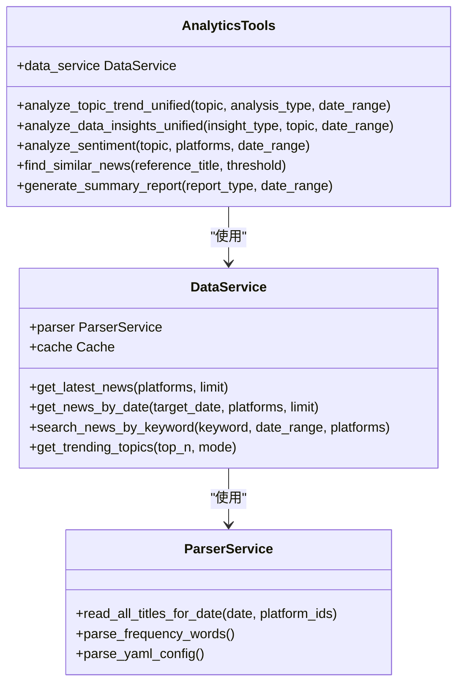

# AI智能分析

<cite>
**本文档引用的文件**   
- [server.py](file://mcp_server/server.py)
- [analytics.py](file://mcp_server/tools/analytics.py)
- [README-MCP-FAQ.md](file://README-MCP-FAQ.md)
- [data_query.py](file://mcp_server/tools/data_query.py)
- [search_tools.py](file://mcp_server/tools/search_tools.py)
- [system.py](file://mcp_server/tools/system.py)
- [date_parser.py](file://mcp_server/utils/date_parser.py)
</cite>

## 目录
1. [引言](#引言)
2. [系统架构与MCP协议](#系统架构与mcp协议)
3. [WebSocket服务器与自然语言查询处理](#websocket服务器与自然语言查询处理)
4. [13种分析工具与路由机制](#13种分析工具与路由机制)
5. [深度分析能力的技术基础](#深度分析能力的技术基础)
6. [多客户端支持实现](#多客户端支持实现)
7. [AI分析与常规推送的集成](#ai分析与常规推送的集成)
8. [使用示例解析](#使用示例解析)
9. [结论](#结论)

## 引言
本文档旨在阐述TrendRadar项目中基于MCP（Model Context Protocol）协议的AI智能分析功能。该系统通过一个WebSocket服务器接收用户的自然语言查询，利用一套精心设计的13种分析工具进行深度处理，并生成结构化的响应。文档将详细解释`server.py`中WebSocket服务器如何接收和解析查询，`analytics.py`中的分析工具如何工作，以及系统如何将用户请求智能地路由到最合适的分析工具。同时，结合`README-MCP-FAQ.md`中的使用示例，说明多客户端支持的实现方式和深度分析能力的技术基础，并讨论AI分析功能与常规推送功能的集成点。

## 系统架构与MCP协议
TrendRadar的AI智能分析功能基于MCP协议构建，该协议定义了AI模型与外部工具服务器之间的通信标准。系统的核心是一个FastMCP 2.0实现，它作为一个工具服务器，向AI客户端（如Cherry Studio）暴露一系列可调用的工具。这些工具涵盖了从基础数据查询到高级数据分析的完整功能链。

整个系统采用模块化设计，主要由以下几个部分构成：
*   **MCP服务器 (`server.py`)**: 系统的入口点，负责启动WebSocket或HTTP服务，注册所有可用的工具，并处理来自AI客户端的请求。
*   **工具模块 (`tools/`)**: 包含各种功能的实现，如`analytics.py`（数据分析）、`data_query.py`（数据查询）、`search_tools.py`（智能检索）等。
*   **服务层 (`services/`)**: 提供数据访问和业务逻辑的底层服务，如`DataService`，它封装了对存储在`output/`目录下的历史数据的读取逻辑。
*   **工具调用机制**: AI模型在对话中，根据用户的自然语言描述，选择并调用相应的MCP工具。服务器执行工具逻辑后，将结构化结果返回给AI，AI再将结果整合成自然语言回复给用户。

这种架构将复杂的分析逻辑从AI模型中解耦，使得AI可以专注于理解用户意图和生成回复，而将精确的数据处理和计算任务交给专门的、可靠的后端工具。

**Section sources**
- [server.py](file://mcp_server/server.py#L1-L910)

## WebSocket服务器与自然语言查询处理
系统的通信入口是`mcp_server/server.py`文件中定义的WebSocket服务器。该服务器使用FastMCP库，支持stdio和HTTP两种传输模式，为AI客户端提供了一个稳定的通信通道。

当AI客户端（如配置了MCP的Cherry Studio）连接到服务器时，服务器会暴露一个包含16个工具的列表。用户的所有查询最终都会被AI模型解析，并转化为对这些工具的调用。服务器的处理流程如下：

1.  **请求接收**: 服务器通过`mcp.tool`装饰器注册了多个异步函数，这些函数对应着不同的分析工具。
2.  **工具路由**: 当收到一个工具调用请求时，服务器会根据请求中的`tool`字段（如`analyze_sentiment`）找到对应的函数。
3.  **参数解析**: 服务器接收来自AI的JSON格式参数（如`topic`, `date_range`），并将其传递给工具函数。
4.  **工具执行**: 工具函数内部会调用底层服务（如`DataService`）来获取和处理数据。
5.  **响应生成**: 工具函数执行完毕后，将结果以JSON格式返回给服务器，服务器再将其转发给AI客户端。

值得注意的是，服务器本身并不直接处理“自然语言”，而是处理由AI模型已经解析好的、结构化的工具调用请求。AI模型充当了用户自然语言和服务器结构化工具之间的“翻译器”。

**Section sources**
- [server.py](file://mcp_server/server.py#L1-L910)

## 13种分析工具与路由机制
系统的核心能力在于其提供的13种分析工具，这些工具被精心组织，以应对不同类型的用户查询。`server.py`中的工具被分为几个类别，系统通过AI模型的决策来实现智能路由。

### 基础数据查询工具
这些是P0级别的核心工具，用于获取原始数据。
*   `get_latest_news`: 获取最新一批爬取的新闻，用于快速了解当前热点。
*   `get_news_by_date`: 按指定日期查询历史新闻。
*   `get_trending_topics`: 统计用户在`config/frequency_words.txt`中自定义的关注词的出现频率。

### 智能检索工具
这些工具提供了更高级的搜索能力。
*   `search_news`: 统一搜索接口，支持关键词、模糊内容和实体名称三种模式。
*   `search_related_news_history`: 基于一篇种子新闻，在历史数据中查找相关新闻。

### 高级数据分析工具
这是系统最核心的13种分析能力的体现，由`analytics.py`提供。
*   `analyze_topic_trend`: 统一话题趋势分析工具，整合了热度趋势、生命周期、异常热度检测和未来预测四种模式。
*   `analyze_data_insights`: 统一数据洞察分析工具，提供平台对比、平台活跃度统计和关键词共现分析三种模式。
*   `analyze_sentiment`: 分析新闻的情感倾向，生成用于AI进行深度情感分析的结构化提示词。
*   `find_similar_news`: 查找与指定新闻标题相似的其他新闻。
*   `generate_summary_report`: 自动生成每日或每周的热点摘要报告。

### 路由机制
路由并非由服务器代码硬编码，而是由AI模型的推理能力动态决定。当用户提出一个查询时，AI模型会根据其对工具描述的理解，选择最合适的工具进行调用。例如：
*   用户问“分析AI本周的趋势” → AI模型会先调用`resolve_date_range("本周")`获取精确日期，再调用`analyze_topic_trend`。
*   用户问“对比各平台对'人工智能'的关注度” → AI模型会直接调用`analyze_data_insights`并设置`insight_type="platform_compare"`。

这种基于语义理解的动态路由，使得系统能够灵活应对各种复杂的用户需求。

**Section sources**
- [server.py](file://mcp_server/server.py#L1-L910)
- [analytics.py](file://mcp_server/tools/analytics.py#L1-L1996)

## 深度分析能力的技术基础
系统的深度分析能力建立在`mcp_server/tools/analytics.py`文件中实现的复杂算法之上。该文件中的`AnalyticsTools`类是所有高级分析功能的载体。

### 统一分析接口
`AnalyticsTools`类通过`analyze_topic_trend_unified`和`analyze_data_insights_unified`等统一方法，将多种分析模式整合在一起。这简化了`server.py`的接口，同时保持了内部逻辑的清晰。

### 核心算法实现
*   **趋势分析 (`get_topic_trend_analysis`)**: 该方法遍历指定日期范围内的每一天，统计包含指定话题的新闻数量，从而绘制出热度变化曲线。它会计算总提及次数、平均每日提及、峰值时间以及涨跌幅度。
*   **平台对比分析 (`compare_platforms`)**: 该方法收集各平台在指定时间内的新闻数据，统计每个平台的总新闻数、话题提及次数，并计算覆盖率（话题提及/总新闻）。它还能找出各平台独有的热点话题。
*   **关键词共现分析 (`analyze_keyword_cooccurrence`)**: 该方法提取每条新闻标题的关键词，然后计算所有关键词对的共现频次，找出经常一起出现的关键词组合。
*   **情感分析 (`analyze_sentiment`)**: 此工具并不直接进行情感分析，而是收集相关新闻数据，并生成一个高度优化的AI提示词（`ai_prompt`），供AI模型进行后续的深度情感分析。
*   **相似新闻查找 (`find_similar_news`)**: 利用`difflib.SequenceMatcher`库计算标题之间的文本相似度，并结合关键词重合度来综合判断相似性。

这些算法共同构成了系统强大的分析能力，能够从海量新闻数据中提炼出有价值的洞察。

**Diagram sources**
- [analytics.py](file://mcp_server/tools/analytics.py#L76-L800)
- [data_service.py](file://mcp_server/services/data_service.py#L17-L624)
- [parser_service.py](file://mcp_server/services/parser_service.py#L1-L100)

**Section sources**
- [analytics.py](file://mcp_server/tools/analytics.py#L1-L1996)

## 多客户端支持实现
系统通过MCP协议的标准化设计，天然支持多客户端。任何实现了MCP客户端的AI应用都可以连接到此服务器。

### 实现方式
1.  **协议标准化**: MCP协议定义了清晰的工具注册、调用和响应格式。只要客户端遵循此协议，就能与服务器通信。
2.  **无状态服务**: 服务器本身不维护与特定客户端的会话状态。每个工具调用都是独立的，服务器只负责执行计算并返回结果。
3.  **HTTP/STDIO支持**: 服务器支持HTTP和stdio两种传输模式。HTTP模式允许通过网络连接，使得多个客户端可以从不同位置访问；stdio模式则适用于本地集成。
4.  **配置灵活性**: 客户端可以通过环境变量或配置文件来指定服务器的地址和端口，方便在不同环境中部署和使用。

例如，文档中提到的“硅基流动”平台，用户只需在Cherry Studio中配置API密钥，即可使用该平台的AI模型来调用本MCP服务器的工具，实现多客户端支持。

**Section sources**
- [server.py](file://mcp_server/server.py#L785-L868)
- [README-MCP-FAQ.md](file://README-MCP-FAQ.md#L27-L62)

## AI分析与常规推送的集成
AI智能分析功能与系统的常规推送功能是两个独立但互补的模块，它们通过共享底层数据和配置实现集成。

### 集成点
1.  **共享数据源**: 两者都依赖于`output/`目录下由爬虫生成的新闻数据。`DataService`服务为AI分析和推送功能提供统一的数据访问接口。
2.  **共享配置**: `config/config.yaml`文件中的配置，如`notification`（推送配置）和`keywords`（关注词），被两个功能共同使用。例如，`get_trending_topics`工具分析的就是`frequency_words.txt`中的关注词，而推送功能也会根据这些词来决定是否发送通知。
3.  **共享存储后端**: 推送记录管理器（`PushRecordManager`）使用`storage_backend`来记录推送历史，这确保了“每日只推送一次”等功能的可靠性，无论是在本地还是在GitHub Actions上运行。
4.  **功能互补**: 常规推送是被动的、基于规则的（如“当关注词出现时推送”），而AI分析是主动的、交互式的（如“分析过去一周的趋势”）。用户可以先通过AI分析发现深度洞察，再利用推送功能持续监控相关话题。

这种集成使得系统既能提供实时的热点提醒，又能支持深度的、按需的分析查询，形成了一个完整的新闻监控和分析解决方案。

**Section sources**
- [push_manager.py](file://trendradar/notification/push_manager.py#L1-L110)
- [config.yaml](file://config/config.yaml#L1-L100)
- [frequency_words.txt](file://config/frequency_words.txt#L1-L50)

## 使用示例解析
结合`README-MCP-FAQ.md`中的示例，我们可以更清晰地理解系统的使用流程。

### 示例1：分析话题趋势
*   **用户提问**: “分析'人工智能'最近一周的热度趋势”
*   **系统流程**:
    1.  AI模型调用`resolve_date_range("最近一周")`，服务器返回精确的日期范围（如{"start": "2025-11-11", "end": "2025-11-17"}）。
    2.  AI模型调用`analyze_topic_trend(topic="人工智能", analysis_type="trend", date_range=上一步返回的值)`。
    3.  服务器执行趋势分析，返回包含每日提及次数、涨跌率和峰值时间的JSON数据。
    4.  AI模型将JSON数据转化为自然语言报告。

### 示例2：情感倾向分析
*   **用户提问**: “看看'特斯拉'相关新闻是正面还是负面的”
*   **系统流程**:
    1.  AI模型调用`analyze_sentiment(topic="特斯拉")`。
    2.  服务器收集包含“特斯拉”的新闻，计算其权重，并生成一个包含精选新闻样本的AI提示词。
    3.  服务器将提示词返回给AI模型。
    4.  AI模型使用该提示词进行深度情感分析，并向用户报告结果。

这些示例展示了从自然语言到工具调用，再到结构化响应的完整闭环。

**Section sources**
- [README-MCP-FAQ.md](file://README-MCP-FAQ.md#L227-L324)

## 结论
TrendRadar的AI智能分析功能通过MCP协议构建了一个强大而灵活的分析平台。`server.py`作为通信枢纽，接收并路由AI模型的请求；`analytics.py`中的13种分析工具提供了深度的数据洞察能力。系统通过AI模型的语义理解实现智能路由，并利用`resolve_date_range`等工具确保了日期解析的一致性和准确性。多客户端支持通过标准化的MCP协议得以实现，而AI分析与常规推送功能则通过共享数据源和配置紧密集成。整体架构清晰，职责分明，为用户提供了一个集实时监控与深度分析于一体的新闻热点解决方案。