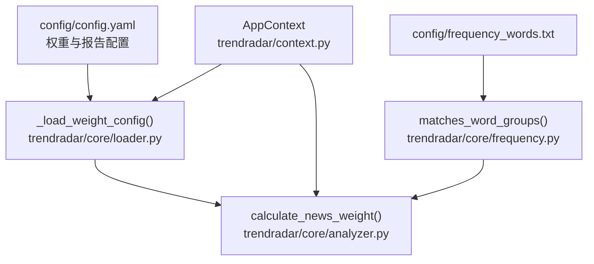
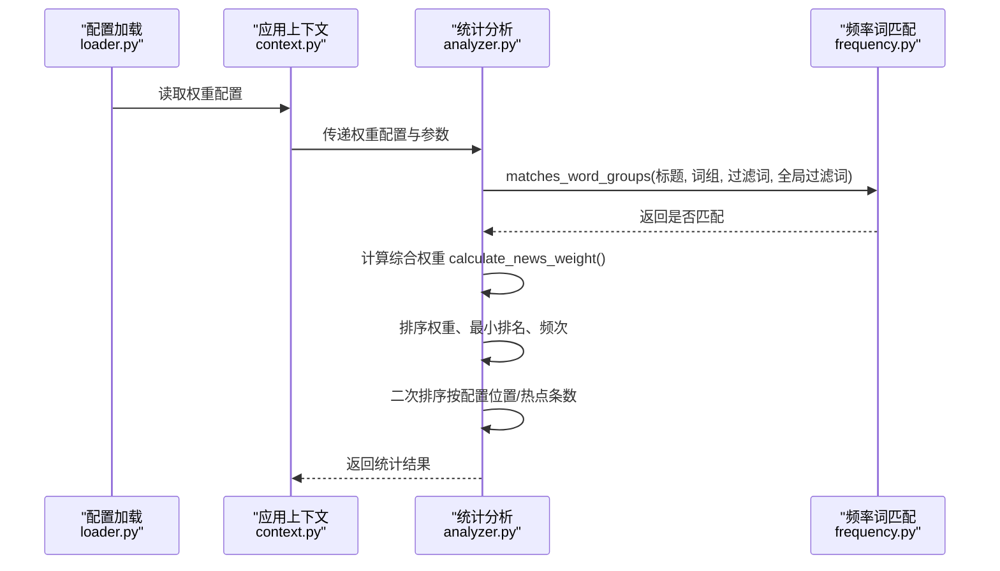
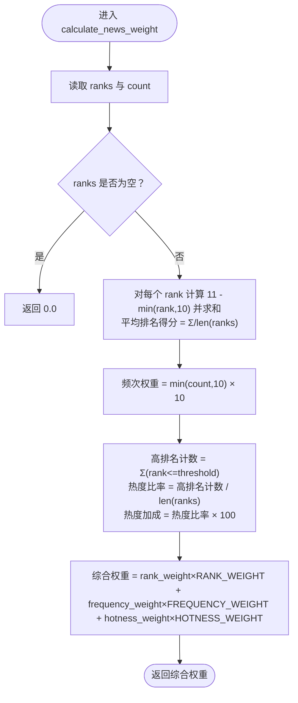
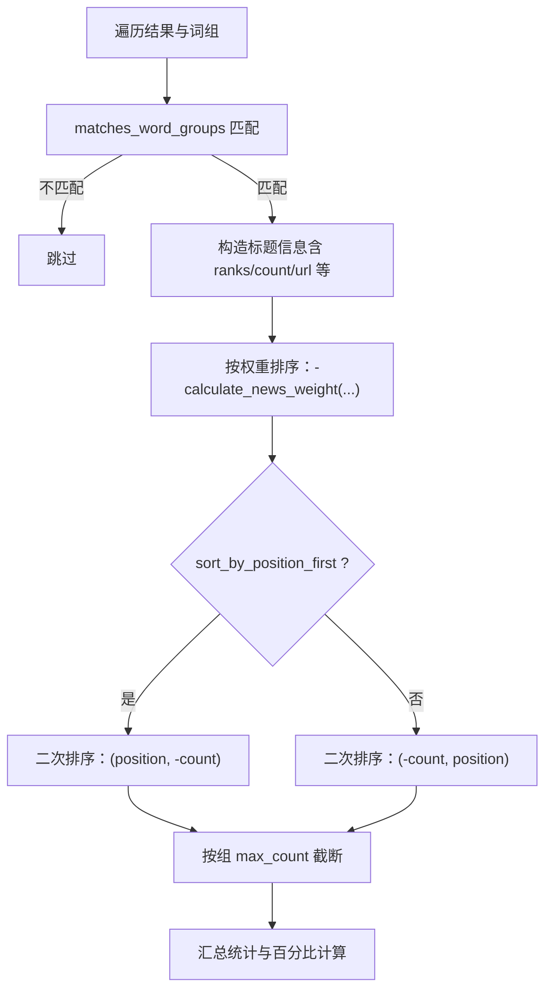
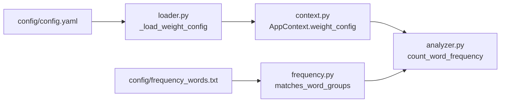

# 个性化热点算法

<cite>
**本文引用的文件**
- [analyzer.py](file://trendradar/core/analyzer.py)
- [config.yaml](file://config/config.yaml)
- [frequency.py](file://trendradar/core/frequency.py)
- [context.py](file://trendradar/context.py)
- [loader.py](file://trendradar/core/loader.py)
- [frequency_words.txt](file://config/frequency_words.txt)
- [README-EN.md](file://README-EN.md)
</cite>

## 目录
1. [简介](#简介)
2. [项目结构](#项目结构)
3. [核心组件](#核心组件)
4. [架构总览](#架构总览)
5. [详细组件分析](#详细组件分析)
6. [依赖关系分析](#依赖关系分析)
7. [性能考虑](#性能考虑)
8. [故障排查指南](#故障排查指南)
9. [结论](#结论)
10. [附录](#附录)

## 简介
本文件深入解析个性化热点排序算法的实现细节，重点围绕以下目标展开：
- 详解 analyzer.py 中 calculate_news_weight 如何结合排名权重（60%）、频次权重（30%）、热度加成（10%）计算综合得分。
- 解释 config.yaml 中 weight 配置项（rank_weight、frequency_weight、hotness_weight）如何影响算法行为。
- 提供针对不同场景（实时热点型、深度话题型）的权重调整示例。
- 讨论算法的时间复杂度与性能优化策略。
- 说明 count_word_frequency 中 sort_by_position_first 参数如何影响最终排序。

## 项目结构
与热点排序算法直接相关的关键文件与职责如下：
- trendradar/core/analyzer.py：包含 calculate_news_weight、count_word_frequency、format_time_display 等统计分析函数。
- config/config.yaml：包含权重配置（weight）与报告模式、排序优先级等运行期配置。
- trendradar/core/frequency.py：词组匹配与频率词加载逻辑。
- trendradar/context.py：应用上下文，提供权重配置、平台配置、时间显示等访问入口。
- trendradar/core/loader.py：配置加载器，负责从 YAML 中提取权重配置并标准化为内部键名。
- config/frequency_words.txt：频率词配置文件，定义词组、必须词、过滤词、全局过滤词等。
- README-EN.md：包含权重调整的高级配置说明与示例。

图表来源
- [config.yaml](file://config/config.yaml#L157-L162)
- [loader.py](file://trendradar/core/loader.py#L118-L125)
- [context.py](file://trendradar/context.py#L88-L91)
- [analyzer.py](file://trendradar/core/analyzer.py#L16-L61)
- [frequency.py](file://trendradar/core/frequency.py#L132-L195)
- [frequency_words.txt](file://config/frequency_words.txt#L1-L114)

章节来源
- [config.yaml](file://config/config.yaml#L157-L162)
- [loader.py](file://trendradar/core/loader.py#L118-L125)
- [context.py](file://trendradar/context.py#L88-L91)
- [analyzer.py](file://trendradar/core/analyzer.py#L16-L61)
- [frequency.py](file://trendradar/core/frequency.py#L132-L195)
- [frequency_words.txt](file://config/frequency_words.txt#L1-L114)

## 核心组件
- calculate_news_weight：计算单条新闻的综合权重，作为排序依据。
- count_word_frequency：统计词频、过滤与新增标记、按权重排序、按配置位置/热点条数二次排序。
- matches_word_groups：根据频率词配置进行标题匹配。
- 配置加载：从 YAML 读取权重配置并标准化为内部键名。

章节来源
- [analyzer.py](file://trendradar/core/analyzer.py#L16-L61)
- [analyzer.py](file://trendradar/core/analyzer.py#L90-L472)
- [frequency.py](file://trendradar/core/frequency.py#L132-L195)
- [loader.py](file://trendradar/core/loader.py#L118-L125)

## 架构总览
个性化热点排序的整体流程如下：
- 从配置文件加载权重与报告参数。
- 读取抓取结果，按频率词规则进行匹配与过滤。
- 对匹配到的新闻计算综合权重，进行排序。
- 根据 sort_by_position_first 与 max_news_per_keyword 等参数进行二次排序与截断。
- 输出统计结果与报告。

图表来源
- [loader.py](file://trendradar/core/loader.py#L118-L125)
- [context.py](file://trendradar/context.py#L88-L91)
- [analyzer.py](file://trendradar/core/analyzer.py#L90-L472)
- [frequency.py](file://trendradar/core/frequency.py#L132-L195)

## 详细组件分析

### calculate_news_weight 综合权重计算
- 输入：标题数据（包含 ranks、count）、排名阈值、权重配置。
- 输出：综合权重值。
- 计算步骤：
  1) 排名权重（Rank Weight）：对每个排名计算 11 - min(rank, 10)，求和后除以出现次数，得到平均排名得分。
  2) 频次权重（Frequency Weight）：min(count, 10) × 10，限制频次上限以避免过度放大。
  3) 热度加成（Hotness Weight）：高排名次数（rank ≤ rank_threshold）占比 × 100。
  4) 综合权重 = rank_weight × RANK_WEIGHT + frequency_weight × FREQUENCY_WEIGHT + hotness_weight × HOTNESS_WEIGHT。

图表来源
- [analyzer.py](file://trendradar/core/analyzer.py#L16-L61)

章节来源
- [analyzer.py](file://trendradar/core/analyzer.py#L16-L61)

### 配置项 weight 的影响
- 在 config.yaml 的 weight 段落中，rank_weight、frequency_weight、hotness_weight 控制综合权重的合成比例。
- 默认值分别为 0.6、0.3、0.1，合计 1.0。
- README-EN.md 提供了两种典型场景的权重调整示例：
  - 实时热点型：提升 rank_weight，降低 frequency_weight，保持 hotness_weight。
  - 深度话题型：适度降低 rank_weight，提升 frequency_weight，保持 hotness_weight。
- 注意：权重之和必须为 1.0；建议每次调整 0.1~0.2 观察效果。

章节来源
- [config.yaml](file://config/config.yaml#L157-L162)
- [README-EN.md](file://README-EN.md#L2003-L2046)

### count_word_frequency 排序与二次排序
- 词组匹配：使用 matches_word_groups 进行必须词、普通词、过滤词、全局过滤词的匹配。
- 统计与新增标记：根据 mode（daily/incremental/current）与 is_first_crawl_func 决定处理范围与新增标记。
- 权重排序：对每条新闻调用 calculate_news_weight，排序键为：
  - 主键：-calculate_news_weight(...)
  - 次键：min(ranks)（越小越靠前）
  - 三键：-count（频次越高越靠前）
- 二次排序：
  - 若 sort_by_position_first 为真：先按配置位置，再按热点条数。
  - 否则：先按热点条数，再按配置位置。
- 截断：若 group 的 max_count > 0，则仅保留前 N 条。

图表来源
- [analyzer.py](file://trendradar/core/analyzer.py#L90-L472)
- [frequency.py](file://trendradar/core/frequency.py#L132-L195)

章节来源
- [analyzer.py](file://trendradar/core/analyzer.py#L90-L472)
- [frequency.py](file://trendradar/core/frequency.py#L132-L195)

### 频率词配置与过滤
- 频率词配置文件支持：
  - 普通词组：任意匹配即可。
  - 必须词：以“+”前缀，要求全部包含。
  - 过滤词：以“!”前缀，匹配则排除。
  - 全局过滤词：置于 [GLOBAL_FILTER] 区域，优先级最高。
  - 最大显示数量：以“@数字”标注，限制该词组最多显示条数。
- 词组加载与匹配逻辑由 frequency.py 提供。

章节来源
- [frequency.py](file://trendradar/core/frequency.py#L18-L129)
- [frequency.py](file://trendradar/core/frequency.py#L132-L195)
- [frequency_words.txt](file://config/frequency_words.txt#L1-L114)

### 配置加载与上下文
- loader.py 将 YAML 中的 weight 字段标准化为内部键名（RANK_WEIGHT、FREQUENCY_WEIGHT、HOTNESS_WEIGHT）。
- context.py 提供权重配置访问（weight_config）与报告参数（如 SORT_BY_POSITION_FIRST、MAX_NEWS_PER_KEYWORD）。
- count_word_frequency 接收 sort_by_position_first 与 weight_config 等参数，直接影响最终排序。

章节来源
- [loader.py](file://trendradar/core/loader.py#L118-L125)
- [context.py](file://trendradar/context.py#L88-L91)
- [analyzer.py](file://trendradar/core/analyzer.py#L90-L472)

## 依赖关系分析
- analyzer.py 依赖 frequency.py 的 matches_word_groups。
- count_word_frequency 依赖 analyzer.py 的 calculate_news_weight 与 format_time_display。
- 配置加载器 loader.py 与应用上下文 context.py 共同决定权重配置与排序优先级。
- 频率词配置文件 frequency_words.txt 为 matches_word_groups 提供词组规则。

图表来源
- [config.yaml](file://config/config.yaml#L157-L162)
- [loader.py](file://trendradar/core/loader.py#L118-L125)
- [context.py](file://trendradar/context.py#L88-L91)
- [analyzer.py](file://trendradar/core/analyzer.py#L90-L472)
- [frequency.py](file://trendradar/core/frequency.py#L132-L195)
- [frequency_words.txt](file://config/frequency_words.txt#L1-L114)

章节来源
- [analyzer.py](file://trendradar/core/analyzer.py#L16-L61)
- [analyzer.py](file://trendradar/core/analyzer.py#L90-L472)
- [frequency.py](file://trendradar/core/frequency.py#L132-L195)
- [loader.py](file://trendradar/core/loader.py#L118-L125)
- [context.py](file://trendradar/context.py#L88-L91)
- [config.yaml](file://config/config.yaml#L157-L162)
- [frequency_words.txt](file://config/frequency_words.txt#L1-L114)

## 性能考虑
- 时间复杂度分析：
  - 对于每条新闻，计算综合权重为 O(k)，k 为该新闻的 ranks 数量。
  - 对所有匹配新闻进行排序：O(m log m)，m 为匹配新闻总数。
  - 词组匹配：对每个标题扫描词组集合，复杂度约为 O(m × g)，g 为词组数量。
  - 二次排序与截断：O(s log s)（s 为组内新闻数）与 O(N)（N 为 max_news_per_keyword）。
- 优化策略：
  - 限制词组数量与过滤词规模，减少 matches_word_groups 的扫描成本。
  - 使用更高效的匹配结构（如前缀树）可进一步降低匹配开销（需扩展 frequency.py）。
  - 对于大规模数据，可考虑分批处理与缓存中间结果（如 ranks 合并、历史统计）。
  - 合理设置 max_news_per_keyword，避免排序与渲染压力过大。
  - 在高频调用场景下，尽量复用权重配置与时间转换函数，减少重复初始化。

[本节为通用性能讨论，不直接分析具体文件，故无章节来源]

## 故障排查指南
- 权重配置未生效：
  - 检查 config.yaml 中 weight 段落是否正确设置，且权重之和为 1.0。
  - 确认 loader.py 已将 YAML 键标准化为 RANK_WEIGHT/FREQUENCY_WEIGHT/HOTNESS_WEIGHT。
- 排序不符合预期：
  - 检查 sort_by_position_first 是否按预期开启/关闭。
  - 确认 max_news_per_keyword 是否限制了显示数量。
- 词组匹配异常：
  - 检查 frequency_words.txt 的词组语法（必须词、过滤词、全局过滤词、最大显示数量）。
  - 确保 matches_word_groups 的全局过滤与过滤词逻辑未误判。
- 新增标记问题：
  - 检查 mode 与 is_first_crawl_func 的组合是否符合预期（daily/incremental/current）。
  - 确认 new_titles 与 title_info 的数据结构与字段是否完整。

章节来源
- [config.yaml](file://config/config.yaml#L157-L162)
- [loader.py](file://trendradar/core/loader.py#L118-L125)
- [analyzer.py](file://trendradar/core/analyzer.py#L90-L472)
- [frequency.py](file://trendradar/core/frequency.py#L132-L195)
- [frequency_words.txt](file://config/frequency_words.txt#L1-L114)

## 结论
- 个性化热点排序通过 calculate_news_weight 将排名、频次与热度三要素融合，配合权重配置实现灵活的排序策略。
- config.yaml 的 weight 段落提供了平衡实时热点与深度分析的调节手段，README-EN.md 提供了明确的场景化示例。
- count_word_frequency 的排序键与二次排序逻辑保证了既关注热点强度，又兼顾词组配置位置与展示数量。
- 在大规模数据场景下，建议优化词组匹配与分批处理，合理设置权重与截断参数，以获得更好的性能与可读性。

[本节为总结性内容，不直接分析具体文件，故无章节来源]

## 附录

### 权重调整示例（来自 README-EN.md）
- 实时热点型（追求时效）：
  - rank_weight: 0.8
  - frequency_weight: 0.1
  - hotness_weight: 0.1
- 深度话题型（追求持续热度）：
  - rank_weight: 0.4
  - frequency_weight: 0.5
  - hotness_weight: 0.1

章节来源
- [README-EN.md](file://README-EN.md#L2003-L2046)