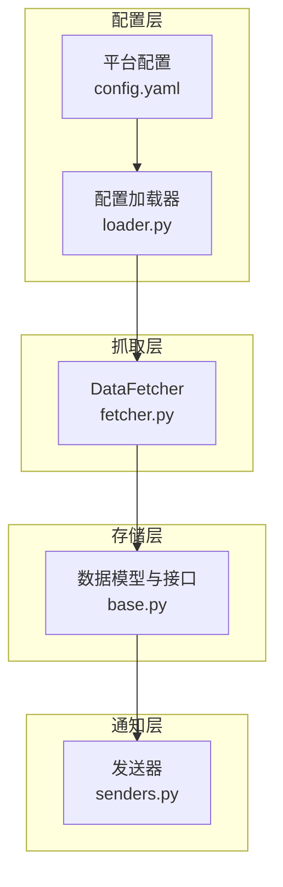
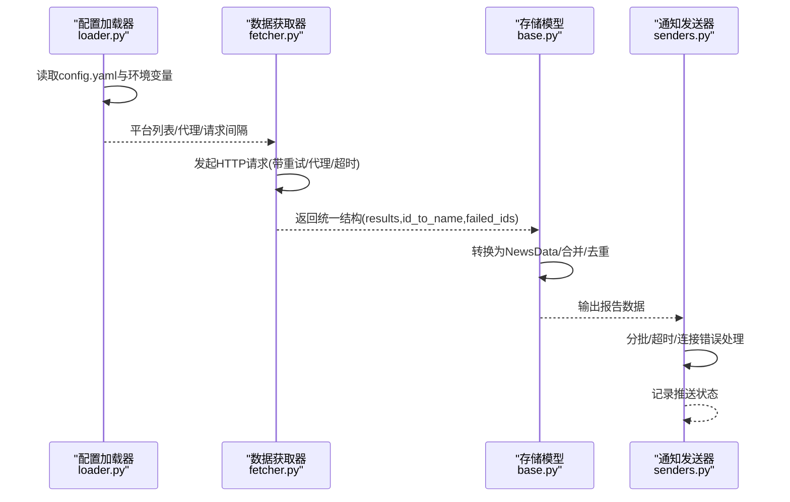
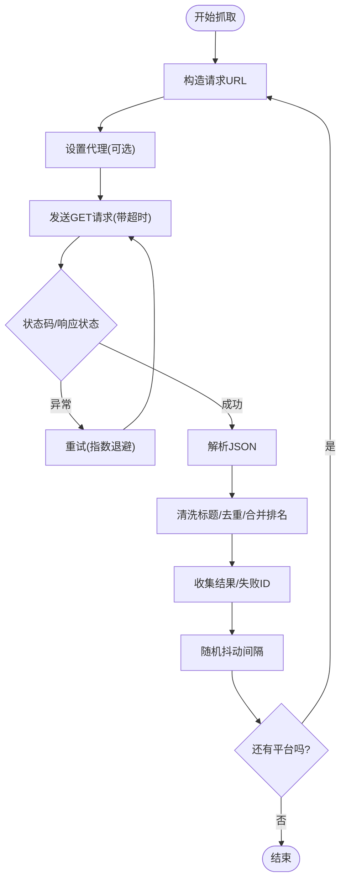
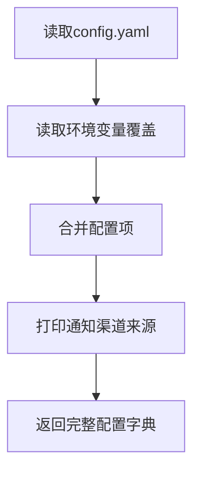
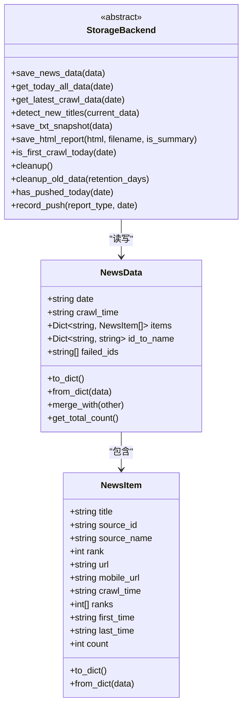
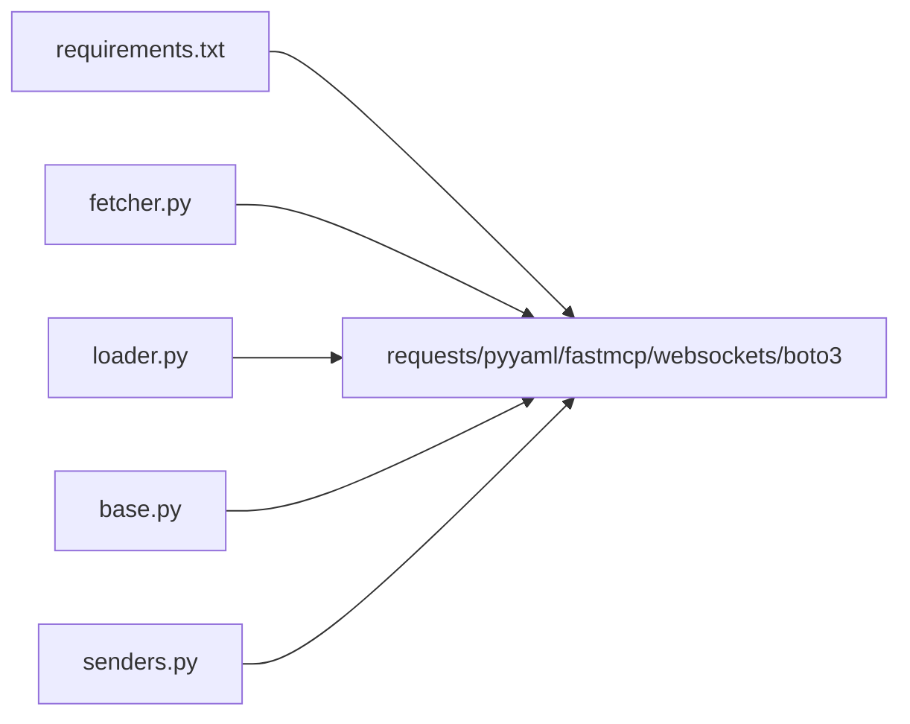

# 全网热点聚合

<cite>
**本文引用的文件**
- [README.md](file://README.md)
- [config.yaml](file://config/config.yaml)
- [fetcher.py](file://trendradar/crawler/fetcher.py)
- [loader.py](file://trendradar/core/loader.py)
- [base.py](file://trendradar/storage/base.py)
- [config.py](file://trendradar/core/config.py)
- [senders.py](file://trendradar/notification/senders.py)
- [requirements.txt](file://requirements.txt)
- [README-EN.md](file://README-EN.md)
</cite>

## 目录
1. [简介](#简介)
2. [项目结构](#项目结构)
3. [核心组件](#核心组件)
4. [架构总览](#架构总览)
5. [详细组件分析](#详细组件分析)
6. [依赖关系分析](#依赖关系分析)
7. [性能考量](#性能考量)
8. [故障排查指南](#故障排查指南)
9. [结论](#结论)
10. [附录](#附录)

## 简介
本项目通过统一的配置与数据抓取机制，聚合11个主流平台（知乎、抖音、微博、bilibili、华尔街见闻、贴吧、百度热搜、财联社热门、澎湃新闻、凤凰新闻、今日头条）的热搜内容。数据由第三方API统一提供，系统负责：
- 从NewsNow API抓取各平台热搜
- 统一加载与格式化平台数据
- 生成报告并按配置进行推送
- 支持增量/当前榜单/当日汇总三种推送模式
- 支持多渠道通知与存储（本地SQLite/远程S3兼容）

## 项目结构
围绕“抓取-加载-存储-推送”的主链路，核心模块分布如下：
- trendradar/crawler/fetcher.py：封装HTTP请求、重试、代理、解析与异常处理
- trendradar/core/loader.py：从YAML与环境变量加载配置，合并平台列表与通知渠道
- trendradar/storage/base.py：定义统一数据模型与存储接口，负责数据结构一致性
- config/config.yaml：平台列表、推送模式、通知渠道、存储与权重等配置入口
- trendradar/notification/senders.py：各渠道发送器，包含批量与超时/连接错误处理
- trendradar/core/config.py：多账号解析与校验工具
- README.md / README-EN.md：平台列表与扩展说明

图表来源
- [fetcher.py](file://trendradar/crawler/fetcher.py#L1-L185)
- [loader.py](file://trendradar/core/loader.py#L275-L333)
- [config.yaml](file://config/config.yaml#L163-L187)
- [base.py](file://trendradar/storage/base.py#L1-L120)
- [senders.py](file://trendradar/notification/senders.py#L770-L947)

章节来源
- [README.md](file://README.md#L198-L217)
- [config.yaml](file://config/config.yaml#L163-L187)

## 核心组件
- DataFetcher：封装HTTP请求、重试、代理、JSON解析与异常处理；支持批量抓取与去重/清洗
- Loader：从YAML与环境变量加载配置，合并平台列表、通知渠道、推送窗口、权重与存储配置
- Storage Data Model：统一NewsItem/NewsData结构，支持合并、去重、时间与排名历史记录
- Notification Senders：统一的批量发送与错误处理，针对不同渠道的超时/连接错误进行分类处理
- Multi-account Config：多账号解析与配对校验，限制最大账号数

章节来源
- [fetcher.py](file://trendradar/crawler/fetcher.py#L1-L185)
- [loader.py](file://trendradar/core/loader.py#L1-L333)
- [base.py](file://trendradar/storage/base.py#L1-L120)
- [config.py](file://trendradar/core/config.py#L1-L153)
- [senders.py](file://trendradar/notification/senders.py#L770-L947)

## 架构总览
系统以“配置驱动 + 统一数据模型”为核心，抓取层通过NewsNow API获取原始热搜，加载层负责规范化与合并，存储层提供统一的数据结构与持久化接口，通知层按配置进行分批与推送。

图表来源
- [loader.py](file://trendradar/core/loader.py#L275-L333)
- [fetcher.py](file://trendradar/crawler/fetcher.py#L50-L185)
- [base.py](file://trendradar/storage/base.py#L357-L456)
- [senders.py](file://trendradar/notification/senders.py#L770-L947)

## 详细组件分析

### 抓取器 DataFetcher（fetcher.py）
- HTTP请求处理
  - 默认UA与通用headers，支持代理（http/https）
  - 超时控制与指数退避重试（最小/最大等待时间）
  - 成功/缓存/失败状态判定与日志
- 数据解析与清洗
  - JSON解析失败与异常捕获
  - 标题清洗：跳过None、浮点、空字符串
  - 去重：相同标题合并排名列表，保留URL与移动端URL
- 批量抓取
  - 逐个平台请求，随机抖动请求间隔，避免触发限流
  - 失败ID收集，便于后续报告展示

图表来源
- [fetcher.py](file://trendradar/crawler/fetcher.py#L50-L185)

章节来源
- [fetcher.py](file://trendradar/crawler/fetcher.py#L1-L185)

### 配置加载器（loader.py）
- 配置来源优先级：环境变量 > config.yaml
- 关键配置项
  - 应用：时区
  - 爬虫：请求间隔、代理、启用开关
  - 报告：模式(daily/current/incremental)、排序优先级、最大新闻数、内容顺序
  - 通知：批量大小、批次间隔、渠道开关与最大账号数
  - 推送窗口：启用、时间范围、每日一次
  - 权重：排名/频次/热度权重
  - 存储：后端(local/remote/auto)、格式、本地/远程参数、拉取策略
  - 平台：平台列表（默认11个）
  - Webhook：各渠道URL/Token/Topic等
- 多账号解析与校验
  - 分号分隔多账号
  - Telegram等配对参数数量一致性校验
  - 最大账号数限制与日志提示

图表来源
- [loader.py](file://trendradar/core/loader.py#L275-L333)
- [config.py](file://trendradar/core/config.py#L1-L153)

章节来源
- [loader.py](file://trendradar/core/loader.py#L1-L333)
- [config.py](file://trendradar/core/config.py#L1-L153)
- [config.yaml](file://config/config.yaml#L1-L187)

### 存储数据模型与转换（base.py）
- 数据模型
  - NewsItem：标题、来源ID/名称、排名、URL、移动端URL、抓取时间、历史排名、首次/最后出现时间、出现次数
  - NewsData：日期、抓取时间、按来源ID分组的新闻列表、ID到名称映射、失败ID列表
- 合并与去重
  - 相同(source_id,title)合并历史排名、更新first_time/last_time/count
  - URL与移动端URL保留
- 转换工具
  - crawl_results -> NewsData：将抓取结果转换为统一结构
  - NewsData -> results：兼容旧格式

图表来源
- [base.py](file://trendradar/storage/base.py#L1-L185)

章节来源
- [base.py](file://trendradar/storage/base.py#L1-L185)
- [base.py](file://trendradar/storage/base.py#L357-L456)

### 通知发送器（senders.py）
- 批量发送与超时/连接错误处理
  - ConnectTimeout/ReadTimeout/ConnectionError分类处理
  - 413过大/其他状态码错误输出与日志
  - 成功批次计数与最终结果判定
- 与配置联动
  - 基于配置的批量大小与批次间隔
  - 多渠道并行/串行策略（由调用方控制）

章节来源
- [senders.py](file://trendradar/notification/senders.py#L770-L947)

## 依赖关系分析
- 外部依赖
  - requests：HTTP请求
  - PyYAML：YAML配置解析
  - fastmcp/websockets/boto3：MCP服务与S3兼容存储
- 内部依赖
  - fetcher依赖requests与json
  - loader依赖yaml与环境变量
  - base依赖dataclasses与typing
  - senders依赖requests与异常类型

图表来源
- [requirements.txt](file://requirements.txt#L1-L7)

章节来源
- [requirements.txt](file://requirements.txt#L1-L7)

## 性能考量
- 请求间隔与抖动
  - 批量抓取时对请求间隔加入随机抖动，降低触发平台限流概率
- 重试策略
  - 指数退避重试，避免雪崩效应
- 数据去重与合并
  - 相同标题合并历史排名，减少重复数据
- 存储与清理
  - 支持本地/远程存储后端，可配置保留天数，避免数据膨胀
- 推送分批
  - 不同渠道批量大小差异化配置，避免消息过大被拒

章节来源
- [fetcher.py](file://trendradar/crawler/fetcher.py#L117-L185)
- [loader.py](file://trendradar/core/loader.py#L81-L97)
- [base.py](file://trendradar/storage/base.py#L118-L185)
- [README-EN.md](file://README-EN.md#L3055-L3078)

## 故障排查指南
- 平台API变更或访问限制
  - 通过重试与随机抖动缓解限流
  - 失败ID会在报告中展示，便于定位
  - 建议合理控制请求频率与使用代理
- 推送失败
  - 413过大：降低批量大小或分批发送
  - 超时/连接错误：检查网络与代理，适当增大超时
  - 多账号配对不一致：核对Telegram等配对参数数量
- 配置问题
  - 确认环境变量覆盖优先级
  - 检查平台列表与通知渠道是否正确配置

章节来源
- [fetcher.py](file://trendradar/crawler/fetcher.py#L81-L116)
- [senders.py](file://trendradar/notification/senders.py#L770-L947)
- [config.py](file://trendradar/core/config.py#L40-L95)
- [config.yaml](file://config/config.yaml#L93-L156)

## 结论
TrendRadar通过统一的配置与数据模型，将来自第三方API的多平台热搜数据进行标准化与聚合，支持多种推送模式与多渠道通知，并具备完善的异常处理与性能优化策略。平台扩展只需在配置中添加新的平台ID与名称即可，满足持续演进的需求。

## 附录

### 如何添加新平台（基于README说明）
- 在配置文件中添加平台条目，包含id与name
- 平台ID来源于第三方API支持列表，可在对应站点查看
- 添加后无需修改核心代码，系统会自动加载并参与聚合

章节来源
- [README-EN.md](file://README-EN.md#L1624-L1645)
- [config.yaml](file://config/config.yaml#L163-L187)