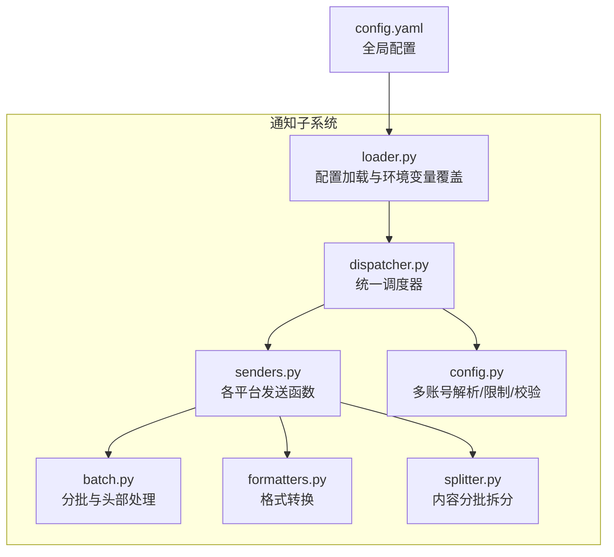
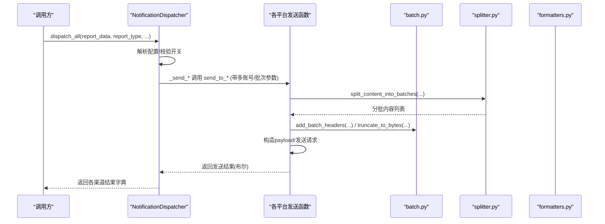
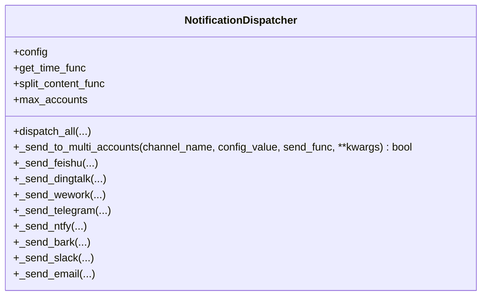
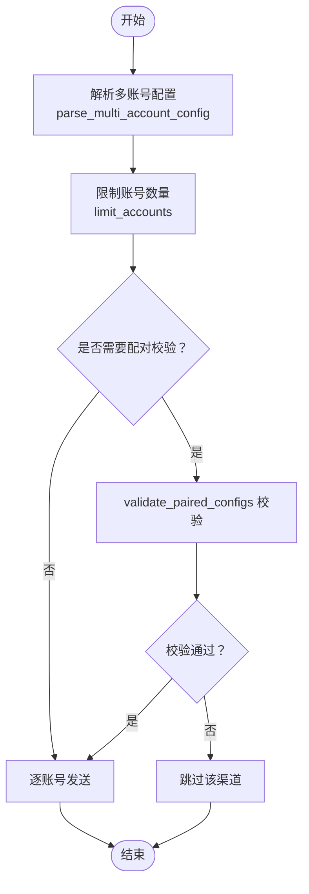
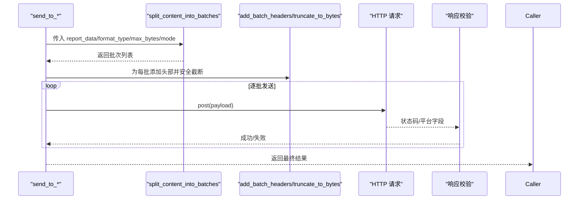
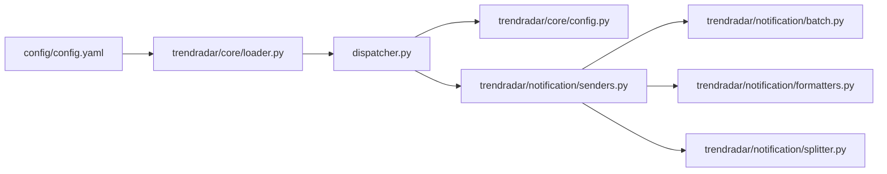

# 多渠道实时推送

<cite>
**本文引用的文件**
- [dispatcher.py](file://trendradar/notification/dispatcher.py)
- [senders.py](file://trendradar/notification/senders.py)
- [config.yaml](file://config/config.yaml)
- [config.py](file://trendradar/core/config.py)
- [batch.py](file://trendradar/notification/batch.py)
- [formatters.py](file://trendradar/notification/formatters.py)
- [splitter.py](file://trendradar/notification/splitter.py)
- [loader.py](file://trendradar/core/loader.py)
</cite>

## 目录
1. [简介](#简介)
2. [项目结构](#项目结构)
3. [核心组件](#核心组件)
4. [架构总览](#架构总览)
5. [详细组件分析](#详细组件分析)
6. [依赖关系分析](#依赖关系分析)
7. [性能考量](#性能考量)
8. [故障排查指南](#故障排查指南)
9. [结论](#结论)

## 简介
本文件系统性阐述多渠道实时推送系统的架构与实现，重点围绕以下目标展开：
- 解释 NotificationDispatcher 类如何通过 _send_to_multi_accounts 通用方法，统一调度企业微信、飞书、钉钉、Telegram、ntfy、Bark、Slack、邮件等8种渠道。
- 说明多账号配置（分号分隔）的解析与限制逻辑，以及 MAX_ACCOUNTS_PER_CHANNEL 的作用边界。
- 描述 senders.py 中各 send_to_* 函数的实现模式与平台差异。
- 介绍 config.yaml 中各类 Webhook/Token/Topic 的配置方法。
- 提供推送失败的重试机制与错误处理策略。

## 项目结构
推送子系统位于 trendradar/notification 目录，关键模块如下：
- dispatcher.py：统一调度器，负责渠道开关、多账号解析与限制、调用具体发送函数。
- senders.py：各平台发送函数，实现分批、格式化、请求与错误处理。
- batch.py：分批头部生成、字节截断与安全截断。
- formatters.py：格式转换（如去除 markdown、转换为 Slack mrkdwn）。
- splitter.py：内容分批拆分，保证平台字节限制与内容完整性。
- config.py：多账号解析、配对校验、账号数量限制。
- config.yaml：全局配置入口，包含各渠道 Webhook/Token/Topic、批次大小、时间窗口等。
- loader.py：从配置文件与环境变量加载最终运行配置（含 MAX_ACCOUNTS_PER_CHANNEL）。

图表来源
- [dispatcher.py](file://trendradar/notification/dispatcher.py#L1-L137)
- [senders.py](file://trendradar/notification/senders.py#L1-L120)
- [batch.py](file://trendradar/notification/batch.py#L1-L116)
- [formatters.py](file://trendradar/notification/formatters.py#L1-L81)
- [splitter.py](file://trendradar/notification/splitter.py#L1-L120)
- [config.py](file://trendradar/core/config.py#L1-L125)
- [loader.py](file://trendradar/core/loader.py#L81-L120)
- [config.yaml](file://config/config.yaml#L82-L156)

章节来源
- [dispatcher.py](file://trendradar/notification/dispatcher.py#L1-L137)
- [senders.py](file://trendradar/notification/senders.py#L1-L120)
- [batch.py](file://trendradar/notification/batch.py#L1-L116)
- [formatters.py](file://trendradar/notification/formatters.py#L1-L81)
- [splitter.py](file://trendradar/notification/splitter.py#L1-L120)
- [config.py](file://trendradar/core/config.py#L1-L125)
- [loader.py](file://trendradar/core/loader.py#L81-L120)
- [config.yaml](file://config/config.yaml#L82-L156)

## 核心组件
- 统一调度器 NotificationDispatcher
  - 负责根据配置开关逐一尝试各渠道；对需要配对的渠道进行配对校验；对多账号进行解析与数量限制；调用 senders.py 中的具体发送函数。
  - 关键方法：dispatch_all、_send_to_multi_accounts、_send_feishu/_send_dingtalk/_send_wework/_send_telegram/_send_ntfy/_send_bark/_send_slack/_send_email。
- 发送函数 senders.py
  - 实现各平台的请求构造、分批发送、批次间隔、平台特定格式与校验。
  - 关键函数：send_to_feishu、send_to_dingtalk、send_to_wework、send_to_telegram、send_to_ntfy、send_to_bark、send_to_slack、send_to_email。
- 多账号与限制工具 config.py
  - parse_multi_account_config：解析分号分隔的多账号。
  - validate_paired_configs：校验 Telegram/ntfy 等配对配置数量一致性。
  - limit_accounts：按 MAX_ACCOUNTS_PER_CHANNEL 限制账号数量。
- 分批与格式化 batch.py / formatters.py / splitter.py
  - batch.py：生成批次头部、计算最大头部字节数、安全截断。
  - formatters.py：去除 markdown、转换为 Slack mrkdwn。
  - splitter.py：按平台字节限制拆分内容，保证词组标题+首条新闻的原子性。
- 配置加载 loader.py 与 config.yaml
  - loader.py：从 config.yaml 与环境变量合并加载配置，包括 MAX_ACCOUNTS_PER_CHANNEL。
  - config.yaml：定义各渠道 Webhook/Token/Topic、批次大小、时间窗口、多账号说明等。

章节来源
- [dispatcher.py](file://trendradar/notification/dispatcher.py#L42-L137)
- [senders.py](file://trendradar/notification/senders.py#L61-L168)
- [config.py](file://trendradar/core/config.py#L11-L125)
- [batch.py](file://trendradar/notification/batch.py#L1-L116)
- [formatters.py](file://trendradar/notification/formatters.py#L1-L81)
- [splitter.py](file://trendradar/notification/splitter.py#L1-L120)
- [loader.py](file://trendradar/core/loader.py#L81-L120)
- [config.yaml](file://config/config.yaml#L82-L156)

## 架构总览
下图展示调度器与各发送函数之间的交互关系，以及分批与格式化模块的协作。

图表来源
- [dispatcher.py](file://trendradar/notification/dispatcher.py#L81-L137)
- [senders.py](file://trendradar/notification/senders.py#L61-L168)
- [batch.py](file://trendradar/notification/batch.py#L78-L116)
- [splitter.py](file://trendradar/notification/splitter.py#L23-L120)
- [formatters.py](file://trendradar/notification/formatters.py#L1-L81)

## 详细组件分析

### 统一调度器 NotificationDispatcher
- 初始化
  - 从配置读取 MAX_ACCOUNTS_PER_CHANNEL（默认3），并注入 get_time_func、split_content_func。
- dispatch_all
  - 依据配置开关依次尝试各渠道：飞书、钉钉、企业微信、Telegram、ntfy、Bark、Slack、邮件。
  - 返回字典，key 为渠道名，value 为是否成功（任一账号成功即视为成功）。
- _send_to_multi_accounts
  - 通用多账号发送逻辑：
    - 使用 parse_multi_account_config 解析分号分隔的配置。
    - 使用 limit_accounts 限制账号数量。
    - 逐个账号调用传入的 send_func(account, account_label=...)，最终 any(results) 即为该渠道结果。
- 渠道专属发送方法
  - _send_feishu/_send_dingtalk/_send_wework/_send_bark/_send_slack：均复用 _send_to_multi_accounts，传入对应 send_to_* 函数与平台参数。
  - _send_telegram：额外进行配对校验 validate_paired_configs(token/chat_id)，限制账号数量并对齐长度。
  - _send_ntfy：校验 topic 与 token 数量一致性（若提供 token），限制账号数量并对齐长度。
  - _send_email：保持原有逻辑，支持多收件人（逗号分隔）。

图表来源
- [dispatcher.py](file://trendradar/notification/dispatcher.py#L42-L421)

章节来源
- [dispatcher.py](file://trendradar/notification/dispatcher.py#L42-L137)
- [dispatcher.py](file://trendradar/notification/dispatcher.py#L138-L421)

### 多账号配置与限制（分号分隔与 MAX_ACCOUNTS_PER_CHANNEL）
- 解析
  - parse_multi_account_config：将分号分隔的字符串切分为账号列表，保留空串用于占位。
- 配对校验
  - validate_paired_configs：对 Telegram 的 token/chat_id、ntfy 的 topic/token 等配对配置进行数量一致性校验，不一致则跳过该渠道。
- 数量限制
  - limit_accounts：当账号数量超过 max_count（来自 MAX_ACCOUNTS_PER_CHANNEL）时，仅使用前 N 个并打印警告。
- 加载与覆盖
  - loader._load_notification_config：从 config.yaml 读取 max_accounts_per_channel，支持环境变量覆盖（MAX_ACCOUNTS_PER_CHANNEL）。

图表来源
- [config.py](file://trendradar/core/config.py#L11-L125)
- [loader.py](file://trendradar/core/loader.py#L81-L120)
- [dispatcher.py](file://trendradar/notification/dispatcher.py#L138-L351)

章节来源
- [config.py](file://trendradar/core/config.py#L11-L125)
- [loader.py](file://trendradar/core/loader.py#L81-L120)
- [dispatcher.py](file://trendradar/notification/dispatcher.py#L138-L351)

### 各平台发送函数实现模式（senders.py）
- 共同特征
  - 均支持分批发送：通过 split_content_func 产出批次，add_batch_headers 统一添加批次头部，truncate_to_bytes 避免超限。
  - 均支持代理（proxy_url）、批次间隔（batch_interval）、时间戳（get_time_func）等参数。
  - 均对响应状态码与平台特定字段进行校验，失败时打印错误并返回 False。
- 平台差异
  - 飞书/钉钉/企业微信/Slack/Bark：使用 JSON payload，按平台字段组织内容。
  - 企业微信：支持 markdown 与 text 两种消息类型，text 模式会 strip_markdown 去除格式。
  - Telegram：使用 sendMessage，parse_mode 为 HTML。
  - ntfy：严格遵守 4KB 限制，公共服务器建议间隔更长；遇到 429 速率限制会等待并重试一次。
  - 邮件：支持多收件人（逗号分隔），自动识别 SMTP 服务器与端口，区分 SSL/TLS；捕获多种 SMTP 异常并给出明确提示。

图表来源
- [senders.py](file://trendradar/notification/senders.py#L61-L168)
- [senders.py](file://trendradar/notification/senders.py#L170-L266)
- [senders.py](file://trendradar/notification/senders.py#L268-L375)
- [senders.py](file://trendradar/notification/senders.py#L377-L472)
- [senders.py](file://trendradar/notification/senders.py#L630-L947)
- [batch.py](file://trendradar/notification/batch.py#L78-L116)
- [splitter.py](file://trendradar/notification/splitter.py#L23-L120)
- [formatters.py](file://trendradar/notification/formatters.py#L1-L81)

章节来源
- [senders.py](file://trendradar/notification/senders.py#L61-L168)
- [senders.py](file://trendradar/notification/senders.py#L170-L266)
- [senders.py](file://trendradar/notification/senders.py#L268-L375)
- [senders.py](file://trendradar/notification/senders.py#L377-L472)
- [senders.py](file://trendradar/notification/senders.py#L630-L947)
- [batch.py](file://trendradar/notification/batch.py#L1-L116)
- [formatters.py](file://trendradar/notification/formatters.py#L1-L81)
- [splitter.py](file://trendradar/notification/splitter.py#L1-L120)

### 配置方法：config.yaml 中 Webhook/Token/Topic
- 通知总开关与批次参数
  - enable_notification：是否启用通知。
  - message_batch_size/dingtalk_batch_size/feishu_batch_size/bark_batch_size/slack_batch_size：各平台分批大小。
  - batch_send_interval：批次间隔（秒）。
  - feishu_message_separator：飞书消息分隔线。
  - max_accounts_per_channel：每渠道最大账号数（默认3）。
- 多账号说明
  - 使用分号分隔多个账号；Telegram/ntfy 等需要配对的配置数量必须一致。
- Webhooks 与 Token/Topic
  - 飞书：feishu_url
  - 钉钉：dingtalk_url
  - 企业微信：wework_url，wework_msg_type（markdown/text）
  - Telegram：telegram_bot_token、telegram_chat_id
  - 邮件：email_from、email_password、email_to、email_smtp_server、email_smtp_port
  - ntfy：ntfy_server_url、ntfy_topic、ntfy_token
  - Bark：bark_url
  - Slack：slack_webhook_url

章节来源
- [config.yaml](file://config/config.yaml#L82-L156)

## 依赖关系分析
- dispatcher.py 依赖
  - trendradar.core.config：parse_multi_account_config、validate_paired_configs、limit_accounts、get_account_at_index。
  - trendradar.notification.senders：各平台发送函数。
- senders.py 依赖
  - trendradar.notification.batch：add_batch_headers、truncate_to_bytes、get_max_batch_header_size。
  - trendradar.notification.formatters：strip_markdown、convert_markdown_to_mrkdwn。
  - trendradar.notification.splitter：split_content_into_batches。
- 配置加载
  - trendradar.core.loader：从 config.yaml 与环境变量合并配置，包括 MAX_ACCOUNTS_PER_CHANNEL。

图表来源
- [dispatcher.py](file://trendradar/notification/dispatcher.py#L1-L40)
- [senders.py](file://trendradar/notification/senders.py#L1-L40)
- [batch.py](file://trendradar/notification/batch.py#L1-L40)
- [formatters.py](file://trendradar/notification/formatters.py#L1-L40)
- [splitter.py](file://trendradar/notification/splitter.py#L1-L40)
- [loader.py](file://trendradar/core/loader.py#L81-L120)
- [config.yaml](file://config/config.yaml#L82-L156)

章节来源
- [dispatcher.py](file://trendradar/notification/dispatcher.py#L1-L40)
- [senders.py](file://trendradar/notification/senders.py#L1-L40)
- [batch.py](file://trendradar/notification/batch.py#L1-L40)
- [formatters.py](file://trendradar/notification/formatters.py#L1-L40)
- [splitter.py](file://trendradar/notification/splitter.py#L1-L40)
- [loader.py](file://trendradar/core/loader.py#L81-L120)
- [config.yaml](file://config/config.yaml#L82-L156)

## 性能考量
- 分批与头部预留
  - 各平台在分批前预留头部空间，避免添加头部后超限导致截断破坏内容完整性。
- 批次间隔
  - 通过 batch_send_interval 控制批次间等待，降低平台限流风险。
- 平台字节限制
  - 不同平台最大字节限制不同（如 ntfy 严格 4KB），分批时动态计算允许内容大小并安全截断。
- 多账号并发
  - 多账号独立发送，总耗时约等于账号数 × 单账号耗时；建议控制账号数量以提升吞吐。
- 重试策略
  - ntfy 在 429 速率限制时等待并重试一次；其余平台主要依赖批次重试与日志定位问题。

章节来源
- [batch.py](file://trendradar/notification/batch.py#L34-L116)
- [senders.py](file://trendradar/notification/senders.py#L630-L947)
- [config.yaml](file://config/config.yaml#L82-L106)

## 故障排查指南
- 配置错误
  - Telegram/ntfy 配对数量不一致：将打印错误并跳过该渠道。
  - 邮件 SMTP 认证失败/连接失败/收件人被拒等：捕获具体异常并打印详细信息，便于定位。
- 速率限制与超时
  - ntfy 429：等待后重试一次；公共服务器建议更长间隔。
  - 请求超时/连接错误：打印异常并返回失败。
- 内容超限
  - 分批后仍超限：batch.truncate_to_bytes 已做安全截断；可在配置中适当减小批次大小或减少内容。
- 多账号风险
  - 超过 MAX_ACCOUNTS_PER_CHANNEL：仅使用前 N 个并打印警告；建议在 GitHub Actions 环境谨慎配置过多账号。

章节来源
- [dispatcher.py](file://trendradar/notification/dispatcher.py#L252-L351)
- [senders.py](file://trendradar/notification/senders.py#L630-L947)
- [config.py](file://trendradar/core/config.py#L97-L125)

## 结论
本系统通过 NotificationDispatcher 将多渠道推送抽象为统一接口，借助多账号解析与限制、内容分批与格式化、平台差异化处理与稳健的错误处理，实现了高可靠、可扩展的实时推送能力。建议：
- 合理设置 MAX_ACCOUNTS_PER_CHANNEL，避免过度配置引发资源与风控风险。
- 根据平台特性调整批次大小与间隔，平衡推送速度与稳定性。
- 对 Telegram/ntfy 等配对配置严格对齐数量，确保推送可用。
- 遇到失败时结合日志与异常类型快速定位原因（认证、限流、超时、内容超限）。