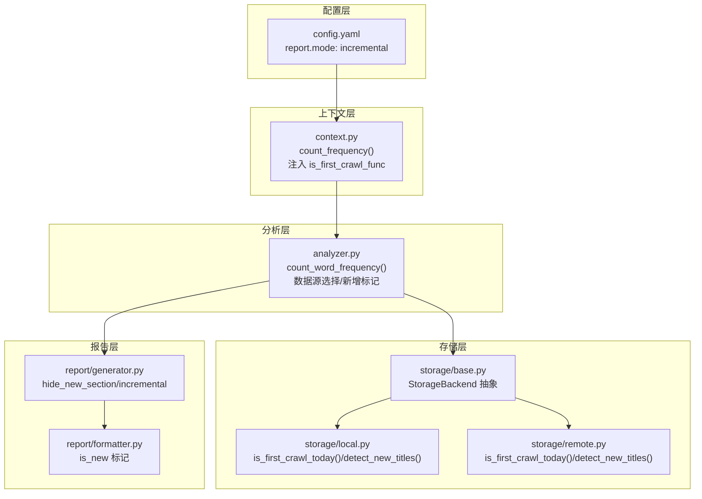
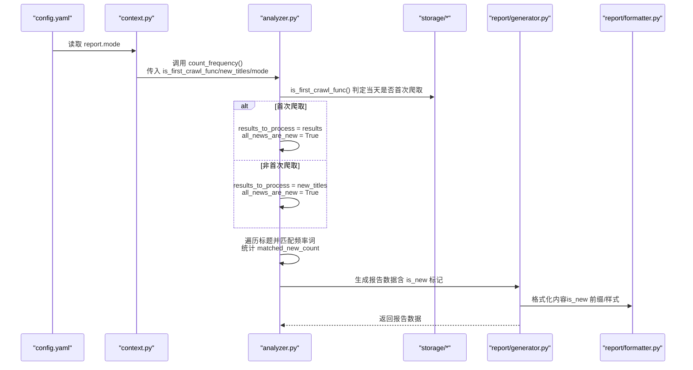
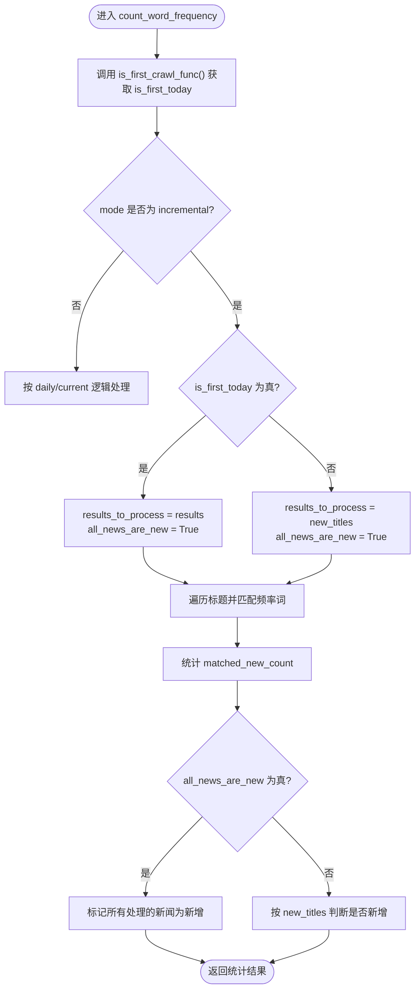
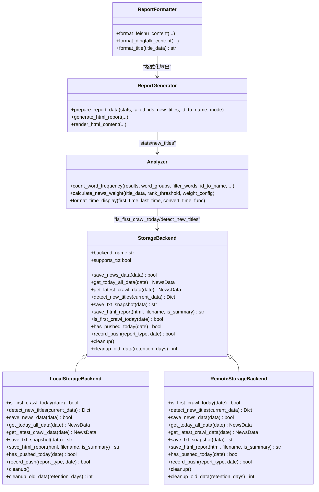
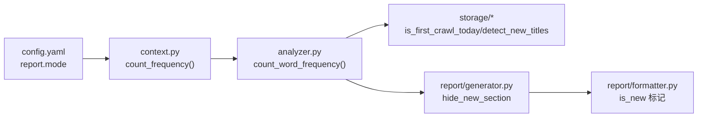

# 增量监控模式

<cite>
**本文引用的文件**
- [analyzer.py](file://trendradar/core/analyzer.py)
- [context.py](file://trendradar/context.py)
- [config.yaml](file://config/config.yaml)
- [generator.py](file://trendradar/report/generator.py)
- [formatter.py](file://trendradar/report/formatter.py)
- [local.py](file://trendradar/storage/local.py)
- [remote.py](file://trendradar/storage/remote.py)
- [base.py](file://trendradar/storage/base.py)
- [README-EN.md](file://README-EN.md)
</cite>

## 目录
1. [简介](#简介)
2. [项目结构](#项目结构)
3. [核心组件](#核心组件)
4. [架构总览](#架构总览)
5. [详细组件分析](#详细组件分析)
6. [依赖关系分析](#依赖关系分析)
7. [性能考量](#性能考量)
8. [故障排查指南](#故障排查指南)
9. [结论](#结论)
10. [附录](#附录)

## 简介
本篇文档围绕“增量监控模式”展开，聚焦于在 analyzer.py 的 count_word_frequency 函数中，当 mode="incremental" 时，系统如何依据 is_first_today 标志位在两种数据源之间切换：当天首次爬取时处理全部新闻并标记为新增；非首次时仅处理 new_titles 中的新增新闻，并将 all_news_are_new 设为 True。同时解析 config.yaml 中 report.mode: "incremental" 的配置如何激活该模式，并说明该模式下“有新增才推送”的节能机制是如何实现的。最后给出实际使用案例、适用场景以及首次运行时可能推送大量历史数据的边界情况说明。

## 项目结构
与增量监控模式直接相关的关键文件与职责如下：
- analyzer.py：统计分析核心，负责词频统计、数据源选择、新增标记、匹配计数与输出。
- context.py：上下文封装，将 is_first_crawl_func 注入 analyzer，统一调用入口。
- config.yaml：配置中心，report.mode 控制报告模式，包括 daily、current、incremental。
- report/generator.py：报告生成器，根据模式隐藏新增区域或按频率词过滤新增。
- report/formatter.py：内容格式化，为新增新闻打上“isNew”标记。
- storage/local.py、storage/remote.py、storage/base.py：存储抽象与实现，提供 is_first_crawl_today 判定、新增检测、数据合并等能力。
- README-EN.md：官方文档，明确增量模式“仅在有新增时推送”的特性与注意事项。

图表来源
- [config.yaml](file://config/config.yaml#L75-L81)
- [context.py](file://trendradar/context.py#L205-L234)
- [analyzer.py](file://trendradar/core/analyzer.py#L90-L208)
- [generator.py](file://trendradar/report/generator.py#L42-L61)
- [formatter.py](file://trendradar/report/formatter.py#L171-L177)
- [local.py](file://trendradar/storage/local.py#L673-L703)
- [remote.py](file://trendradar/storage/remote.py#L817-L834)
- [base.py](file://trendradar/storage/base.py#L187-L356)

章节来源
- [config.yaml](file://config/config.yaml#L69-L81)
- [context.py](file://trendradar/context.py#L205-L234)
- [analyzer.py](file://trendradar/core/analyzer.py#L90-L208)
- [generator.py](file://trendradar/report/generator.py#L42-L61)
- [formatter.py](file://trendradar/report/formatter.py#L171-L177)
- [local.py](file://trendradar/storage/local.py#L673-L703)
- [remote.py](file://trendradar/storage/remote.py#L817-L834)
- [base.py](file://trendradar/storage/base.py#L187-L356)

## 核心组件
- 增量模式开关与行为
  - config.yaml 中 report.mode: "incremental" 激活增量模式。
  - analyzer.py 的 count_word_frequency 在 mode="incremental" 时，依据 is_first_today 切换数据源与新增标记策略。
- 首次爬取判定
  - is_first_crawl_func 由 context.py 注入，底层由 storage/local.py 或 storage/remote.py 提供 is_first_crawl_today 实现。
- 新增新闻检测
  - storage 层提供 detect_new_titles/detect_latest_new_titles，用于从历史数据中识别新增新闻，供 analyzer 的 new_titles 参数使用。
- 报告生成与推送
  - report/generator.py 在增量模式下隐藏新增区域，避免重复展示；formatter.py 为新增新闻打上 is_new 标记。
  - README-EN.md 明确增量模式“仅在有新增时推送”的特性。

章节来源
- [config.yaml](file://config/config.yaml#L75-L81)
- [context.py](file://trendradar/context.py#L205-L234)
- [analyzer.py](file://trendradar/core/analyzer.py#L152-L208)
- [local.py](file://trendradar/storage/local.py#L673-L703)
- [remote.py](file://trendradar/storage/remote.py#L817-L834)
- [generator.py](file://trendradar/report/generator.py#L42-L61)
- [formatter.py](file://trendradar/report/formatter.py#L171-L177)
- [README-EN.md](file://README-EN.md#L732-L740)

## 架构总览
下图展示了从配置到分析再到报告与推送的整体流程，重点标注了增量模式下的数据源选择与新增标记逻辑。

图表来源
- [config.yaml](file://config/config.yaml#L75-L81)
- [context.py](file://trendradar/context.py#L205-L234)
- [analyzer.py](file://trendradar/core/analyzer.py#L152-L208)
- [generator.py](file://trendradar/report/generator.py#L42-L61)
- [formatter.py](file://trendradar/report/formatter.py#L171-L177)

## 详细组件分析

### 增量模式的数据源切换与新增标记
- 首次爬取（is_first_today 为真）
  - 处理全部新闻 results，all_news_are_new 设为 True，使所有处理的新闻均标记为新增。
  - matched_new_count 用于统计“匹配频率词的新增新闻数量”，便于后续日志与推送决策。
- 非首次爬取（is_first_today 为假）
  - 仅处理 new_titles，all_news_are_new 仍为 True，保证只推送新增且匹配频率词的新闻。
  - 若 new_titles 为空或无匹配，matched_new_count 为 0，系统将不会发送通知（详见日志与推送逻辑）。

图表来源
- [analyzer.py](file://trendradar/core/analyzer.py#L152-L208)
- [analyzer.py](file://trendradar/core/analyzer.py#L226-L255)
- [analyzer.py](file://trendradar/core/analyzer.py#L329-L358)

章节来源
- [analyzer.py](file://trendradar/core/analyzer.py#L152-L208)
- [analyzer.py](file://trendradar/core/analyzer.py#L226-L255)
- [analyzer.py](file://trendradar/core/analyzer.py#L329-L358)

### 配置项 report.mode: "incremental" 的激活
- config.yaml 中 report.mode: "incremental" 指定报告模式为增量监控。
- context.py 的 count_frequency 将 mode 透传给 analyzer，从而触发增量模式分支。
- README-EN.md 明确增量模式“仅在有新增时推送”的特性，与 analyzer 的 matched_new_count 逻辑相呼应。

章节来源
- [config.yaml](file://config/config.yaml#L75-L81)
- [context.py](file://trendradar/context.py#L205-L234)
- [README-EN.md](file://README-EN.md#L732-L740)

### 新增新闻检测与 is_first_crawl_today
- 首次爬取判定
  - storage/local.py 与 storage/remote.py 均提供 is_first_crawl_today 实现：通过查询抓取记录数量（<=1 视为首次）来判断。
- 新增新闻检测
  - storage 层提供 detect_new_titles/detect_latest_new_titles，用于从历史数据中识别新增新闻，供 analyzer 的 new_titles 参数使用。
- 上下文注入
  - context.py 将 self.is_first_crawl 作为 is_first_crawl_func 注入 analyzer，确保 analyzer 能够正确判断当天是否首次爬取。

章节来源
- [local.py](file://trendradar/storage/local.py#L673-L703)
- [remote.py](file://trendradar/storage/remote.py#L817-L834)
- [context.py](file://trendradar/context.py#L205-L234)

### 报告生成与推送的节能机制
- 报告生成
  - report/generator.py 在增量模式下设置 hide_new_section = True，隐藏新增区域，避免重复展示。
  - 若存在 new_titles 且提供匹配函数，则会对新增新闻进行频率词过滤后再展示。
- 内容格式化
  - report/formatter.py 为 is_new=True 的新闻添加前缀标识，便于区分新增与历史。
- 推送决策
  - analyzer 在增量模式下会统计 matched_new_count：若为 0 且存在频率词配置（len(word_groups) > 1），将不会发送通知，从而实现“有新增才推送”的节能机制。

章节来源
- [generator.py](file://trendradar/report/generator.py#L42-L61)
- [formatter.py](file://trendradar/report/formatter.py#L171-L177)
- [analyzer.py](file://trendradar/core/analyzer.py#L362-L388)

### 类关系与数据流（代码级）

图表来源
- [base.py](file://trendradar/storage/base.py#L187-L356)
- [local.py](file://trendradar/storage/local.py#L673-L703)
- [remote.py](file://trendradar/storage/remote.py#L817-L834)
- [analyzer.py](file://trendradar/core/analyzer.py#L90-L120)
- [generator.py](file://trendradar/report/generator.py#L42-L61)
- [formatter.py](file://trendradar/report/formatter.py#L171-L177)

## 依赖关系分析
- 配置依赖
  - config.yaml 的 report.mode 影响 analyzer 的 mode 参数，进而决定数据源选择与新增标记策略。
- 运行时依赖
  - context.py 将 is_first_crawl_func 注入 analyzer，is_first_crawl_func 由 storage/local.py 或 storage/remote.py 的 is_first_crawl_today 实现提供。
  - analyzer 依赖 storage 层的 detect_new_titles 产出 new_titles，用于非首次爬取时的增量处理。
- 报告与推送依赖
  - report/generator.py 根据 mode 隐藏新增区域；formatter.py 为 is_new 标记提供可视化。
  - analyzer 的 matched_new_count 为“有新增才推送”的关键指标。

图表来源
- [config.yaml](file://config/config.yaml#L75-L81)
- [context.py](file://trendradar/context.py#L205-L234)
- [analyzer.py](file://trendradar/core/analyzer.py#L152-L208)
- [generator.py](file://trendradar/report/generator.py#L42-L61)
- [formatter.py](file://trendradar/report/formatter.py#L171-L177)
- [local.py](file://trendradar/storage/local.py#L673-L703)
- [remote.py](file://trendradar/storage/remote.py#L817-L834)

章节来源
- [config.yaml](file://config/config.yaml#L75-L81)
- [context.py](file://trendradar/context.py#L205-L234)
- [analyzer.py](file://trendradar/core/analyzer.py#L152-L208)
- [generator.py](file://trendradar/report/generator.py#L42-L61)
- [formatter.py](file://trendradar/report/formatter.py#L171-L177)
- [local.py](file://trendradar/storage/local.py#L673-L703)
- [remote.py](file://trendradar/storage/remote.py#L817-L834)

## 性能考量
- 增量模式减少无效推送：仅在有新增时才生成报告并发送通知，降低消息体大小与推送频率，节省带宽与设备电量。
- 数据源最小化：非首次爬取仅处理 new_titles，避免对全量历史数据进行匹配与统计，提升吞吐。
- 存储层优化：is_first_crawl_today 通过抓取记录计数快速判断，detect_new_titles 基于合并与差集策略识别新增，减少 IO 与内存占用。
- 报告生成优化：在增量模式下隐藏新增区域，减少渲染与拼接成本。

## 故障排查指南
- 增量模式长时间无推送
  - 可能原因：当前时段无新增匹配频率词的新闻；关键词配置过严或过宽；监控平台数量不足。
  - 解决方案：优化关键词配置、切换为 current 或 daily 模式、增加监控平台。
- 首次运行推送过多历史数据
  - 现象：当天首次爬取时，系统处理全部新闻并标记为新增，可能一次性推送较多内容。
  - 建议：首次运行后尽快调整频率词配置，缩小匹配范围，后续运行将仅推送新增。
- 新增检测异常
  - 检查 is_first_crawl_today 的实现是否正确（基于抓取记录计数）；确认 storage 层 has_pushed_today/record_push 是否正常工作。
- 报告未隐藏新增区域
  - 确认 report.mode 是否为 incremental；确认 report/generator.py 的 hide_new_section 逻辑生效。

章节来源
- [README-EN.md](file://README-EN.md#L732-L740)
- [analyzer.py](file://trendradar/core/analyzer.py#L362-L388)
- [generator.py](file://trendradar/report/generator.py#L42-L61)
- [local.py](file://trendradar/storage/local.py#L673-L703)
- [remote.py](file://trendradar/storage/remote.py#L817-L834)

## 结论
增量监控模式通过“当天首次处理全部新闻并标记为新增，非首次仅处理新增并按频率词过滤”的双轨策略，在保证首次覆盖的前提下，显著降低了重复推送与消息体积。配合 report/generator 的新增区域隐藏与 analyzer 的 matched_new_count 决策，实现了“有新增才推送”的节能机制。对于首次运行可能推送大量历史数据的情况，可通过优化关键词配置与平台数量逐步收敛推送规模。

## 附录
- 实际使用案例
  - 场景：高频监控特定话题（如某公司股票、政策事件），希望仅在首次出现时收到通知，避免重复打扰。
  - 配置：将 report.mode 设置为 incremental，合理配置频率词与监控平台，确保关键词覆盖面与精度平衡。
- 边界情况
  - 首次运行：由于 all_news_are_new 为真，当天首次爬取会处理全部新闻并标记为新增，推送量可能较大；建议在首次后优化关键词与平台配置。
  - 无新增：当 matched_new_count 为 0 且存在频率词配置时，系统不会发送通知，符合“节能”目标。