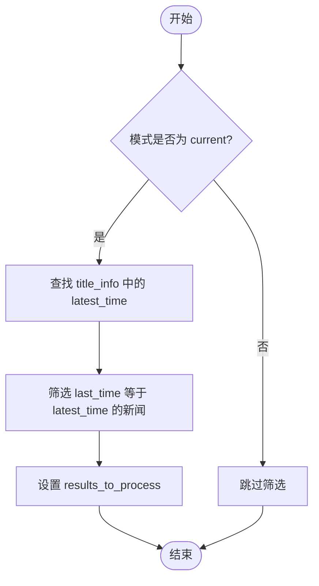

# 当前榜单模式

<cite>
**本文档引用的文件**  
- [analyzer.py](file://trendradar/core/analyzer.py)
- [config.yaml](file://config/config.yaml)
- [frequency.py](file://trendradar/core/frequency.py)
- [context.py](file://trendradar/context.py)
- [base.py](file://trendradar/storage/base.py)
</cite>

## 目录
1. [引言](#引言)
2. [当前榜单模式的技术实现](#当前榜单模式的技术实现)
3. [配置激活机制](#配置激活机制)
4. [业务场景与使用案例](#业务场景与使用案例)
5. [数据一致性挑战](#数据一致性挑战)
6. [结论](#结论)

## 引言

当前榜单模式是 TrendRadar 系统中用于实时追踪热点内容的核心功能之一。该模式通过分析最新的新闻数据，精准识别并展示当前最热门的新闻条目，适用于需要即时了解最新动态的业务场景。本报告将深入分析 `analyzer.py` 中 `count_word_frequency` 函数在 `mode="current"` 时的实现逻辑，探讨 `config.yaml` 中 `report.mode: "current"` 配置如何激活此模式，并讨论其在实际应用中的优势与挑战。

## 当前榜单模式的技术实现

在 `analyzer.py` 的 `count_word_frequency` 函数中，当 `mode="current"` 时，系统会根据 `title_info` 找到 `latest_time`，并筛选出 `last_time` 等于 `latest_time` 的新闻作为 `results_to_process`。这一过程确保了只有最新批次的新闻被处理，从而实现了对当前最热内容的精准追踪。

具体实现步骤如下：
1. 遍历 `title_info` 中的所有新闻条目，找出最新的 `last_time`。
2. 使用找到的 `latest_time` 筛选 `results` 中的新闻，仅保留 `last_time` 等于 `latest_time` 的条目。
3. 将筛选后的新闻集合赋值给 `results_to_process`，供后续处理。



**图表来源**  
- [analyzer.py](file://trendradar/core/analyzer.py#L164-L187)

**本节来源**  
- [analyzer.py](file://trendradar/core/analyzer.py#L164-L187)

## 配置激活机制

`config.yaml` 文件中的 `report.mode: "current"` 配置项用于激活当前榜单模式。当此配置项设置为 `"current"` 时，系统会在每次运行时自动进入当前榜单模式，执行上述筛选逻辑。

```yaml
report:
  mode: "current" # 可选: "daily"|"incremental"|"current"
  rank_threshold: 5 # 排名高亮阈值
  sort_by_position_first: false # 排序优先级：true=先按配置位置排序，false=先按热点条数排序
  max_news_per_keyword: 0 # 每个关键词最大显示数量，0=不限制
  reverse_content_order: false # 内容顺序：false=热点词汇统计在前，true=新增热点新闻在前
```

**本节来源**  
- [config.yaml](file://config/config.yaml#L75-L81)

## 业务场景与使用案例

当前榜单模式特别适用于需要实时监控热点内容的场景。例如，在社交媒体监控、新闻聚合平台或市场趋势分析中，用户可以通过此模式快速获取最新的热门话题和新闻事件。

实际使用案例包括：
- **社交媒体监控**：企业可以利用当前榜单模式实时跟踪品牌相关的热门话题，及时响应公众舆论。
- **新闻聚合平台**：新闻网站可以使用此模式为用户提供最新的热点新闻列表，提升用户体验。
- **市场趋势分析**：市场分析师可以通过此模式捕捉最新的市场动态，辅助决策制定。

**本节来源**  
- [analyzer.py](file://trendradar/core/analyzer.py#L164-L187)
- [config.yaml](file://config/config.yaml#L75-L81)

## 数据一致性挑战

尽管当前榜单模式能够有效追踪实时热点，但其依赖于历史数据 `title_info` 的完整性。如果 `title_info` 中的数据不完整或存在延迟，可能会导致筛选结果不准确，影响系统的可靠性。

数据一致性问题主要体现在以下几个方面：
- **数据延迟**：由于数据采集和处理的延迟，`title_info` 可能未能及时更新，导致 `latest_time` 不准确。
- **数据丢失**：在网络故障或系统异常情况下，部分新闻数据可能未被记录，造成 `title_info` 缺失。
- **数据重复**：同一新闻条目可能因多次抓取而被重复记录，影响 `last_time` 的准确性。

为解决这些问题，建议采取以下措施：
- **增强数据校验**：在数据入库前进行严格校验，确保数据的完整性和一致性。
- **优化数据同步**：采用更高效的数据同步机制，减少数据延迟。
- **定期数据清理**：定期清理重复和无效数据，保持 `title_info` 的清洁。

**本节来源**  
- [analyzer.py](file://trendradar/core/analyzer.py#L164-L187)
- [base.py](file://trendradar/storage/base.py#L118-L184)

## 结论

当前榜单模式通过精确的筛选逻辑，实现了对实时热点内容的高效追踪。`config.yaml` 中的 `report.mode: "current"` 配置项简单明了地激活了这一功能，使其在多种业务场景中具有广泛的应用价值。然而，该模式的成功运行依赖于历史数据 `title_info` 的完整性和一致性，因此在实际部署中需注意数据管理的各个环节，以确保系统的稳定性和准确性。