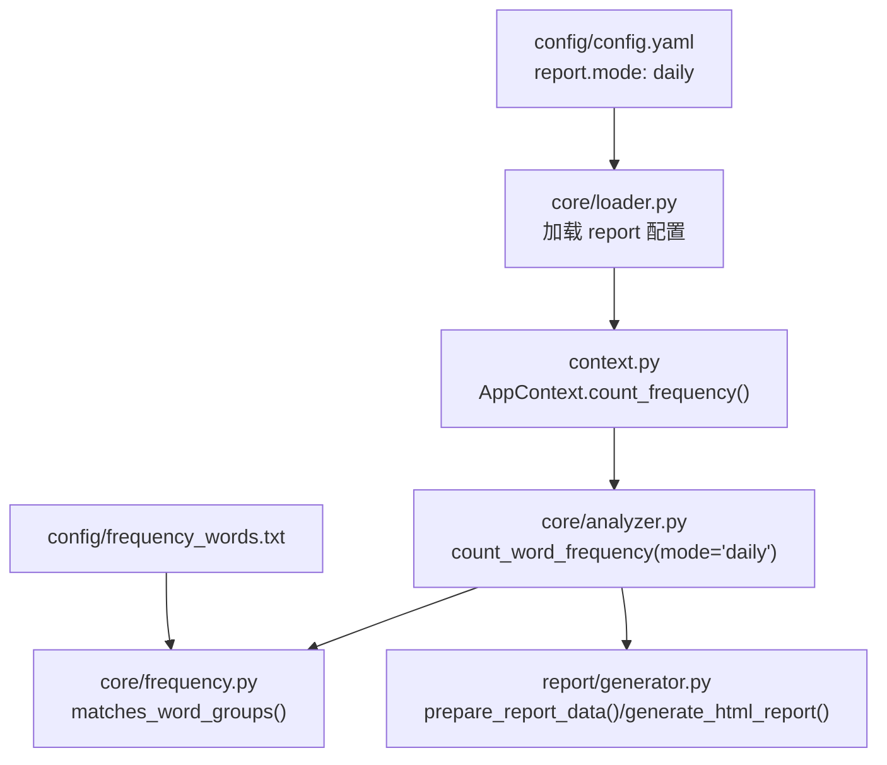
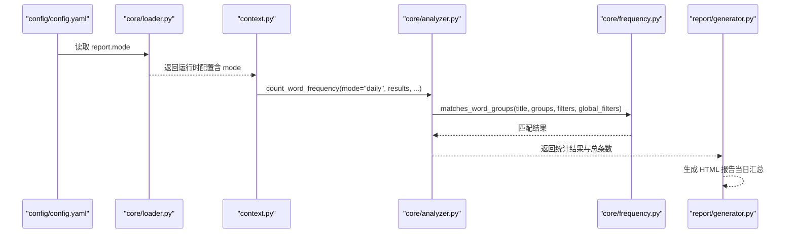
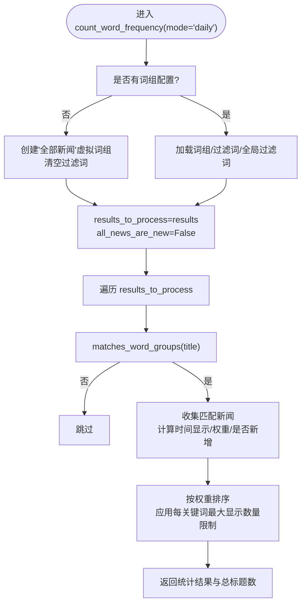
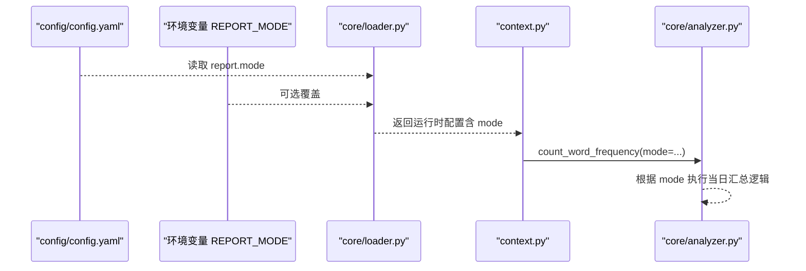
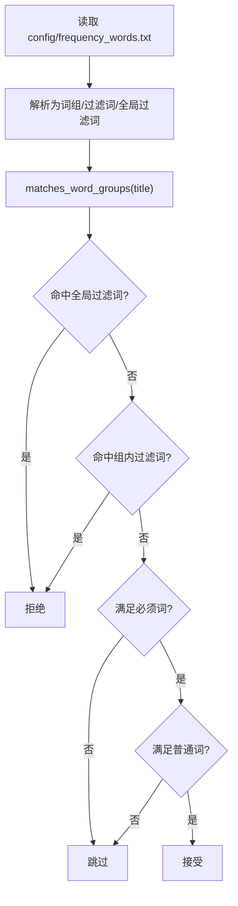
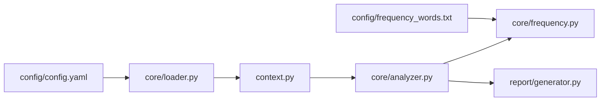

# 当日汇总模式

<cite>
**本文引用的文件**
- [analyzer.py](file://trendradar/core/analyzer.py)
- [context.py](file://trendradar/context.py)
- [config.py](file://trendradar/core/config.py)
- [loader.py](file://trendradar/core/loader.py)
- [frequency.py](file://trendradar/core/frequency.py)
- [config.yaml](file://config/config.yaml)
- [frequency_words.txt](file://config/frequency_words.txt)
- [generator.py](file://trendradar/report/generator.py)
- [data_service.py](file://mcp_server/services/data_service.py)
</cite>

## 目录
1. [简介](#简介)
2. [项目结构](#项目结构)
3. [核心组件](#核心组件)
4. [架构总览](#架构总览)
5. [详细组件分析](#详细组件分析)
6. [依赖关系分析](#依赖关系分析)
7. [性能考量](#性能考量)
8. [故障排查指南](#故障排查指南)
9. [结论](#结论)
10. [附录](#附录)

## 简介
本文聚焦“当日汇总模式”的技术实现与业务场景，围绕 analyzer.py 中 count_word_frequency 函数在 mode="daily" 时的行为展开，解释 config.yaml 中 report.mode: "daily" 如何激活该模式，并分析该模式下系统如何处理所有新闻数据进行汇总统计。同时给出实际使用案例，说明该模式适用于日报总结与全面了解当日热点趋势的场景，并讨论其对系统资源的持续消耗影响。

## 项目结构
与“当日汇总模式”直接相关的模块与文件如下：
- 统计分析核心：trendradar/core/analyzer.py
- 上下文封装：trendradar/context.py
- 配置加载与覆盖：trendradar/core/loader.py
- 频率词加载与匹配：trendradar/core/frequency.py
- 配置文件：config/config.yaml、config/frequency_words.txt
- 报告生成：trendradar/report/generator.py
- MCP 服务中的模式处理：mcp_server/services/data_service.py

图表来源
- [config.yaml](file://config/config.yaml#L75-L81)
- [loader.py](file://trendradar/core/loader.py#L63-L78)
- [context.py](file://trendradar/context.py#L205-L234)
- [analyzer.py](file://trendradar/core/analyzer.py#L90-L106)
- [frequency.py](file://trendradar/core/frequency.py#L132-L195)
- [generator.py](file://trendradar/report/generator.py#L14-L138)

章节来源
- [config.yaml](file://config/config.yaml#L75-L81)
- [loader.py](file://trendradar/core/loader.py#L63-L78)
- [context.py](file://trendradar/context.py#L205-L234)
- [analyzer.py](file://trendradar/core/analyzer.py#L90-L106)
- [frequency.py](file://trendradar/core/frequency.py#L132-L195)
- [generator.py](file://trendradar/report/generator.py#L14-L138)

## 核心组件
- 报告模式配置：config/config.yaml 的 report.mode 字段决定推送模式，其中 daily 表示“当日汇总”。
- 配置加载与覆盖：core/loader.py 将 report.mode 从 YAML 读取，并允许通过环境变量 REPORT_MODE 覆盖。
- 上下文封装：context.py 的 AppContext.count_frequency() 将配置注入到统计函数，统一传递参数。
- 统计函数：analyzer.py 的 count_word_frequency(mode="daily") 在当日汇总模式下处理所有新闻数据，不标记新增，也不仅处理新增。
- 频率词匹配：frequency.py 提供 matches_word_groups()，用于根据频率词配置过滤标题。
- 报告生成：report/generator.py 的 prepare_report_data()/generate_html_report() 将统计结果与新增新闻整合为报告。

章节来源
- [config.yaml](file://config/config.yaml#L75-L81)
- [loader.py](file://trendradar/core/loader.py#L63-L78)
- [context.py](file://trendradar/context.py#L205-L234)
- [analyzer.py](file://trendradar/core/analyzer.py#L90-L106)
- [frequency.py](file://trendradar/core/frequency.py#L132-L195)
- [generator.py](file://trendradar/report/generator.py#L14-L138)

## 架构总览
当日汇总模式的关键调用链如下：
- 配置层：config/config.yaml 的 report.mode: "daily"，经 core/loader.py 转换为运行时配置。
- 上下文层：AppContext.count_frequency() 将 mode 传入统计函数。
- 统计层：count_word_frequency(mode="daily") 设置 results_to_process=results、all_news_are_new=False，处理所有新闻并进行词频统计与排序。
- 报告层：prepare_report_data()/generate_html_report() 生成 HTML 报告，标注“当日汇总”。

图表来源
- [config.yaml](file://config/config.yaml#L75-L81)
- [loader.py](file://trendradar/core/loader.py#L63-L78)
- [context.py](file://trendradar/context.py#L205-L234)
- [analyzer.py](file://trendradar/core/analyzer.py#L90-L106)
- [frequency.py](file://trendradar/core/frequency.py#L132-L195)
- [generator.py](file://trendradar/report/generator.py#L14-L138)

## 详细组件分析

### 当日汇总模式的技术实现
- 模式入口与参数传递
  - AppContext.count_frequency() 将 mode 参数透传给 count_word_frequency。
  - 该函数还注入权重配置、排序优先级、时间转换函数、首次爬取检测函数等。
- 模式分支与数据源
  - 当 mode="daily" 时，results_to_process=results，表示处理所有输入新闻；all_news_are_new=False，表示不将处理的新闻标记为新增。
  - 该分支还会统计 total_input_news，并打印“当日汇总模式：处理 X 条新闻，模式：频率词过滤”等信息。
- 词频统计与过滤
  - 使用 matches_word_groups() 对标题进行词组匹配，支持必须词、普通词、过滤词与全局过滤词。
  - 若未配置词组，系统会创建一个“全部新闻”虚拟词组，清空过滤词，从而显示所有新闻。
- 排序与限制
  - 统一使用 calculate_news_weight() 计算权重，结合排名、频次与热度进行排序。
  - 支持按配置位置优先或按热点条数优先两种排序策略。
  - 支持每关键词最大显示数量限制（优先使用词组内的 @N，否则使用全局配置）。
- 结果输出
  - 返回统计结果列表与总标题数；在非 quiet 模式下打印过滤后的匹配新闻数。

图表来源
- [analyzer.py](file://trendradar/core/analyzer.py#L90-L106)
- [analyzer.py](file://trendradar/core/analyzer.py#L146-L208)
- [analyzer.py](file://trendradar/core/analyzer.py#L226-L360)
- [analyzer.py](file://trendradar/core/analyzer.py#L411-L472)
- [frequency.py](file://trendradar/core/frequency.py#L132-L195)

章节来源
- [analyzer.py](file://trendradar/core/analyzer.py#L90-L106)
- [analyzer.py](file://trendradar/core/analyzer.py#L146-L208)
- [analyzer.py](file://trendradar/core/analyzer.py#L226-L360)
- [analyzer.py](file://trendradar/core/analyzer.py#L411-L472)
- [frequency.py](file://trendradar/core/frequency.py#L132-L195)

### 配置激活流程：report.mode: "daily"
- 配置来源
  - config/config.yaml 的 report.mode: "daily" 指定默认推送模式。
- 环境变量覆盖
  - core/loader.py 的 _load_report_config() 支持通过环境变量 REPORT_MODE 覆盖默认值。
- 运行时注入
  - AppContext.count_frequency() 将 mode 作为参数传入统计函数，确保统计逻辑与配置一致。

图表来源
- [config.yaml](file://config/config.yaml#L75-L81)
- [loader.py](file://trendradar/core/loader.py#L63-L78)
- [context.py](file://trendradar/context.py#L205-L234)
- [analyzer.py](file://trendradar/core/analyzer.py#L90-L106)

章节来源
- [config.yaml](file://config/config.yaml#L75-L81)
- [loader.py](file://trendradar/core/loader.py#L63-L78)
- [context.py](file://trendradar/context.py#L205-L234)
- [analyzer.py](file://trendradar/core/analyzer.py#L90-L106)

### 频率词配置与匹配
- 频率词文件
  - config/frequency_words.txt 定义词组、必须词、过滤词、全局过滤词与每组最大显示数量。
- 加载与解析
  - core/frequency.py 的 load_frequency_words() 将文件解析为词组列表、组内过滤词与全局过滤词。
- 匹配逻辑
  - frequency.py 的 matches_word_groups() 优先检查全局过滤词，再检查组内过滤词，最后按必须词与普通词规则匹配。

图表来源
- [frequency_words.txt](file://config/frequency_words.txt#L1-L114)
- [frequency.py](file://trendradar/core/frequency.py#L18-L129)
- [frequency.py](file://trendradar/core/frequency.py#L132-L195)

章节来源
- [frequency_words.txt](file://config/frequency_words.txt#L1-L114)
- [frequency.py](file://trendradar/core/frequency.py#L18-L129)
- [frequency.py](file://trendradar/core/frequency.py#L132-L195)

### 报告生成与模式标识
- 报告数据准备
  - report/generator.py 的 prepare_report_data() 将统计结果与新增新闻整合为报告数据，其中 daily 模式下会保留新增新闻区域（除非显式隐藏）。
- HTML 生成
  - generate_html_report() 根据 is_daily_summary 与 mode 生成对应文件名（当日汇总.html），并在 HTML 中标注报告类型与统计信息。

章节来源
- [generator.py](file://trendradar/report/generator.py#L14-L138)
- [generator.py](file://trendradar/report/generator.py#L140-L236)

### MCP 服务中的模式处理
- mcp_server/services/data_service.py 的 get_trending_topics() 展示了与模式相关的另一处处理逻辑：daily 模式下处理当天所有累计数据，current 模式下只处理最新一批数据。
- 该实现与 analyzer.py 的 daily 模式语义一致，均强调“当日累计”的概念。

章节来源
- [data_service.py](file://mcp_server/services/data_service.py#L285-L335)

## 依赖关系分析
- 模块耦合
  - analyzer.py 依赖 frequency.py 的匹配函数，用于词频过滤。
  - context.py 作为门面，将配置与统计函数解耦，便于测试与扩展。
  - generator.py 依赖 analyzer.py 的统计结果与上下文提供的匹配函数，完成报告生成。
- 外部依赖
  - 配置文件 config/config.yaml 与 config/frequency_words.txt 提供运行时行为约束。
  - 环境变量 REPORT_MODE 可覆盖默认模式，体现灵活的部署能力。

图表来源
- [config.yaml](file://config/config.yaml#L75-L81)
- [loader.py](file://trendradar/core/loader.py#L63-L78)
- [context.py](file://trendradar/context.py#L205-L234)
- [analyzer.py](file://trendradar/core/analyzer.py#L90-L106)
- [frequency.py](file://trendradar/core/frequency.py#L132-L195)
- [generator.py](file://trendradar/report/generator.py#L14-L138)
- [frequency_words.txt](file://config/frequency_words.txt#L1-L114)

章节来源
- [config.yaml](file://config/config.yaml#L75-L81)
- [loader.py](file://trendradar/core/loader.py#L63-L78)
- [context.py](file://trendradar/context.py#L205-L234)
- [analyzer.py](file://trendradar/core/analyzer.py#L90-L106)
- [frequency.py](file://trendradar/core/frequency.py#L132-L195)
- [generator.py](file://trendradar/report/generator.py#L14-L138)
- [frequency_words.txt](file://config/frequency_words.txt#L1-L114)

## 性能考量
- 数据规模与处理开销
  - 当日汇总模式处理所有新闻（results_to_process=results），在新闻量较大时会带来更高的 CPU 与内存开销。
  - 词频匹配与权重计算均为 O(N) 级别的线性扫描，但随着新闻条数增长，总体耗时呈线性上升。
- 过滤与排序
  - matches_word_groups() 与 calculate_news_weight() 的调用次数等于匹配的新闻条数；排序复杂度受统计结果数量影响。
- 配置优化
  - 合理设置每关键词最大显示数量（max_news_per_keyword 或词组内的 @N），可显著降低后续渲染与推送成本。
  - 适当收紧频率词配置，减少不必要的匹配与排序，有助于降低资源消耗。
- 存储与 IO
  - 报告生成涉及文件写入与复制（当日汇总时复制到 index.html），在频繁执行时会产生额外 IO 开销。

[本节为通用性能讨论，无需特定文件来源]

## 故障排查指南
- 模式未生效
  - 检查 config/config.yaml 的 report.mode 是否为 "daily"，或是否通过环境变量 REPORT_MODE 覆盖为其他值。
  - 确认 core/loader.py 的 _load_report_config() 是否正确读取配置。
- 未显示任何新闻
  - 若未配置词组，系统会创建“全部新闻”虚拟词组并清空过滤词，应能看到所有新闻。
  - 若配置了词组但仍无匹配，检查 config/frequency_words.txt 的语法与内容。
- 新闻未标记为新增
  - 当日汇总模式下 all_news_are_new=False，不会将处理的新闻标记为新增，这是预期行为。
- 报告未生成或命名异常
  - 检查 report/generator.py 的 generate_html_report() 是否根据 is_daily_summary 与 mode 正确生成文件名（当日汇总.html）。

章节来源
- [config.yaml](file://config/config.yaml#L75-L81)
- [loader.py](file://trendradar/core/loader.py#L63-L78)
- [analyzer.py](file://trendradar/core/analyzer.py#L146-L208)
- [frequency_words.txt](file://config/frequency_words.txt#L1-L114)
- [generator.py](file://trendradar/report/generator.py#L140-L236)

## 结论
当日汇总模式通过“处理所有新闻、不标记新增”的设计，实现了对当日累计热点的全面统计与展示。其核心在于：
- config.yaml 的 report.mode: "daily" 作为入口配置；
- core/loader.py 的环境变量覆盖机制提供灵活性；
- context.py 的参数注入保证统计函数的一致性；
- analyzer.py 的 daily 分支确保 results_to_process=results、all_news_are_new=False；
- frequency.py 的匹配逻辑保障词频过滤的准确性；
- report/generator.py 的报告生成确保输出与模式一致。

该模式适用于日报总结与全面了解当日热点趋势的场景，但需注意在大规模数据下的资源消耗，可通过合理配置与限制输出数量进行优化。

[本节为总结性内容，无需特定文件来源]

## 附录

### 实际使用案例
- 日报总结
  - 场景：每天下午6点查看今日所有重要新闻，不遗漏任何热点。
  - 行为：当日汇总模式下，系统处理当天所有匹配新闻并生成 HTML 报告，标注“当日汇总”。
- 全面了解当日热点趋势
  - 场景：希望看到关键词在一天内的分布与变化，而非仅看最新榜单。
  - 行为：系统按权重排序并限制每关键词显示数量，便于快速把握趋势。

[本节为使用场景说明，无需特定文件来源]