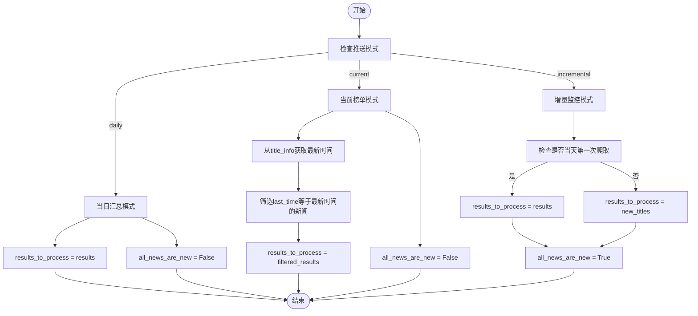

# 智能推送策略

<cite>
**本文档引用文件**   
- [analyzer.py](file://trendradar/core/analyzer.py)
- [config.yaml](file://config/config.yaml)
- [data.py](file://trendradar/core/data.py)
- [frequency.py](file://trendradar/core/frequency.py)
- [push_manager.py](file://trendradar/notification/push_manager.py)
- [__main__.py](file://trendradar/__main__.py)
- [context.py](file://trendradar/context.py)
</cite>

## 目录
1. [引言](#引言)
2. [三种推送模式概述](#三种推送模式概述)
3. [技术实现分析](#技术实现分析)
4. [配置项控制机制](#配置项控制机制)
5. [系统资源消耗对比](#系统资源消耗对比)
6. [实际使用案例](#实际使用案例)
7. [数据一致性处理](#数据一致性处理)
8. [总结](#总结)

## 引言
TrendRadar 是一个新闻热点聚合与分析工具，通过三种不同的推送模式（当日汇总、当前榜单、增量监控）为用户提供灵活的信息获取方式。本文档将深入分析这三种模式的技术实现、业务场景以及在 `analyzer.py` 的 `count_word_frequency` 函数中 `results_to_process` 数据源选择和 `all_news_are_new` 标记逻辑上的差异。同时，解释 `config.yaml` 中 `EXECUTE_MODE` 配置项如何控制模式切换，不同模式对系统资源消耗的影响，并提供实际使用案例和模式切换时的数据一致性处理方案。

## 三种推送模式概述
TrendRadar 提供了三种推送模式，每种模式针对不同的用户需求和使用场景：

| 模式 | 适用人群 | 推送时机 | 显示内容 | 典型使用场景 |
|------|----------|----------|----------|------------|
| **当日汇总**<br/>`daily` | 📋 企业管理者/普通用户 | 按时推送(默认每小时推送一次) | 当日所有匹配新闻<br/>+ 新增新闻区域 | **案例**：每天下午6点查看今天所有重要新闻<br/>**特点**：看全天完整趋势，不漏掉任何热点<br/>**提醒**：会包含之前推送过的新闻 |
| **当前榜单**<br/>`current` | 📰 自媒体人/内容创作者 | 按时推送(默认每小时推送一次) | 当前榜单匹配新闻<br/>+ 新增新闻区域 | **案例**：每小时追踪"哪些话题现在最火"<br/>**特点**：实时了解当前热度排名变化<br/>**提醒**：持续在榜的新闻每次都会出现 |
| **增量监控**<br/>`incremental` | 📈 投资者/交易员 | 有新增才推送 | 新出现的匹配频率词新闻 | **案例**：监控"特斯拉"，只在有新消息时通知<br/>**特点**：零重复，只看首次出现的新闻<br/>**适合**：高频监控、避免信息打扰 |

### 实际推送效果举例
假设你监控"苹果"关键词，每小时执行一次：

| 时间 | daily 模式推送 | current 模式推送 | incremental 模式推送 |
|-----|--------------|----------------|-------------------|
| 10:00 | 新闻A、新闻B | 新闻A、新闻B | 新闻A、新闻B |
| 11:00 | 新闻A、新闻B、新闻C | 新闻B、新闻C、新闻D | **仅**新闻C |
| 12:00 | 新闻A、新闻B、新闻C | 新闻C、新闻D、新闻E | **仅**新闻D、新闻E |

**说明**：
- `daily`：累积展示当天所有新闻（A、B、C 都保留）
- `current`：展示当前榜单的新闻（排名变化，新闻D上榜，新闻A掉榜）
- `incremental`：**只推送新出现的新闻**（避免重复干扰）

## 技术实现分析
### `count_word_frequency` 函数中的模式差异
在 `analyzer.py` 的 `count_word_frequency` 函数中，三种模式在 `results_to_process` 数据源选择和 `all_news_are_new` 标记逻辑上存在显著差异。

#### 数据源选择 (`results_to_process`)
- **当日汇总模式 (`daily`)**：处理所有新闻，`results_to_process = results`。
- **当前榜单模式 (`current`)**：只处理当前时间批次的新闻，但统计信息来自全部历史。通过 `title_info` 获取最新时间，筛选出 `last_time` 等于最新时间的新闻。
- **增量监控模式 (`incremental`)**：当天第一次爬取时处理所有新闻，之后只处理新增的新闻，`results_to_process = new_titles if new_titles else {}`。

#### 新增标记逻辑 (`all_news_are_new`)
- **当日汇总模式 (`daily`)**：`all_news_are_new = False`，不标记为新增。
- **当前榜单模式 (`current`)**：`all_news_are_new = False`，不标记为新增。
- **增量监控模式 (`incremental`)**：`all_news_are_new = True`，所有处理的新闻都标记为新增。



**图源**
- [analyzer.py](file://trendradar/core/analyzer.py#L154-L200)

**节源**
- [analyzer.py](file://trendradar/core/analyzer.py#L90-L473)

## 配置项控制机制
### `EXECUTE_MODE` 配置项
`config.yaml` 文件中的 `report.mode` 配置项用于控制推送模式的切换。该配置项支持三种选项：`daily`、`incremental` 和 `current`。

```yaml
report:
  mode: "current" # 可选: "daily"|"incremental"|"current"
  rank_threshold: 5 # 排名高亮阈值
  sort_by_position_first: false # 排序优先级：true=先按配置位置排序，false=先按热点条数排序
  max_news_per_keyword: 0 # 每个关键词最大显示数量，0=不限制
  reverse_content_order: false # 内容顺序：false=热点词汇统计在前，true=新增热点新闻在前
```

### 模式切换逻辑
在 `__main__.py` 文件中，`NewsAnalyzer` 类的 `_get_mode_strategy` 方法根据 `report_mode` 配置项返回相应的模式策略。该策略定义了不同模式下的行为，如是否发送实时通知、是否生成汇总报告等。

```python
MODE_STRATEGIES = {
    "incremental": {
        "mode_name": "增量模式",
        "description": "增量模式（只关注新增新闻，无新增时不推送）",
        "realtime_report_type": "实时增量",
        "summary_report_type": "当日汇总",
        "should_send_realtime": True,
        "should_generate_summary": True,
        "summary_mode": "daily",
    },
    "current": {
        "mode_name": "当前榜单模式",
        "description": "当前榜单模式（当前榜单匹配新闻 + 新增新闻区域 + 按时推送）",
        "realtime_report_type": "实时当前榜单",
        "summary_report_type": "当前榜单汇总",
        "should_send_realtime": True,
        "should_generate_summary": True,
        "summary_mode": "current",
    },
    "daily": {
        "mode_name": "当日汇总模式",
        "description": "当日汇总模式（所有匹配新闻 + 新增新闻区域 + 按时推送）",
        "realtime_report_type": "",
        "summary_report_type": "当日汇总",
        "should_send_realtime": False,
        "should_generate_summary": True,
        "summary_mode": "daily",
    },
}
```

## 系统资源消耗对比
### 资源消耗分析
不同推送模式对系统资源的消耗有所不同，主要体现在 CPU、内存和网络带宽的使用上。

| 模式 | CPU 消耗 | 内存消耗 | 网络带宽消耗 | 说明 |
|------|----------|----------|--------------|------|
| **当日汇总**<br/>`daily` | 高 | 高 | 高 | 需要处理和存储当天所有新闻，资源消耗最大 |
| **当前榜单**<br/>`current` | 中 | 中 | 中 | 只处理当前时间批次的新闻，但需要从历史数据中获取完整信息 |
| **增量监控**<br/>`incremental` | 低 | 低 | 低 | 只处理新增的新闻，资源消耗最小 |

### 资源优化建议
- **当日汇总模式**：适用于需要全面了解当天热点趋势的用户，但需确保系统有足够的资源支持。
- **当前榜单模式**：适用于需要实时了解当前热度排名变化的用户，资源消耗适中。
- **增量监控模式**：适用于需要高频监控、避免信息打扰的用户，资源消耗最小，适合长期运行。

## 实际使用案例
### 企业管理者
企业管理者通常使用**当日汇总模式**，以便在每天下午6点查看当天所有重要新闻。这种模式可以帮助他们全面了解当天的热点趋势，不漏掉任何重要信息。

### 自媒体人/内容创作者
自媒体人和内容创作者通常使用**当前榜单模式**，以便每小时追踪"哪些话题现在最火"。这种模式可以帮助他们实时了解当前热度排名变化，及时调整内容策略。

### 投资者/交易员
投资者和交易员通常使用**增量监控模式**，以便监控特定关键词（如"特斯拉"），只在有新消息时通知。这种模式可以帮助他们避免信息打扰，专注于首次出现的新闻。

## 数据一致性处理
### 模式切换时的数据一致性
在模式切换时，确保数据一致性是至关重要的。TrendRadar 通过以下机制来处理数据一致性问题：

1. **存储管理器**：`StorageManager` 类负责统一管理存储后端，确保数据在本地和远程存储之间的一致性。
2. **推送记录管理器**：`PushRecordManager` 类负责管理推送记录，确保在 GitHub Actions 环境中也能正常工作。
3. **数据加载和预处理**：`_load_analysis_data` 方法在加载数据时，会根据当前监控平台列表过滤历史数据，确保数据的一致性。

### 数据一致性检查
在 `__main__.py` 文件中，`_execute_mode_strategy` 方法在执行模式特定逻辑时，会进行数据一致性检查。如果无法读取刚保存的数据文件，会抛出运行时错误。

```python
if analysis_data:
    # 执行分析流水线
else:
    print("❌ 严重错误：无法读取刚保存的数据文件")
    raise RuntimeError("数据一致性检查失败：保存后立即读取失败")
```

## 总结
TrendRadar 的三种推送模式（当日汇总、当前榜单、增量监控）各有其独特的技术实现和业务场景。通过 `config.yaml` 中的 `EXECUTE_MODE` 配置项，用户可以灵活地切换模式，以满足不同的需求。不同模式对系统资源的消耗也有所不同，用户应根据自身情况选择合适的模式。在模式切换时，TrendRadar 通过存储管理器、推送记录管理器和数据一致性检查等机制，确保数据的一致性。