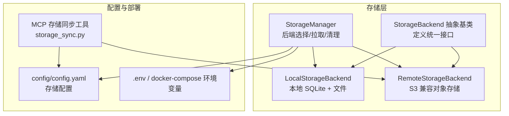
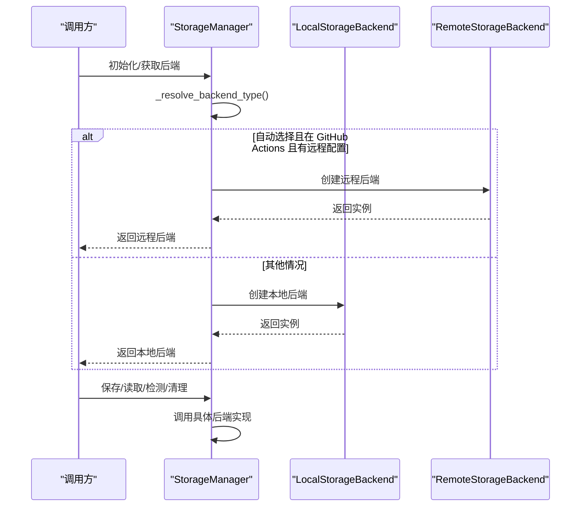
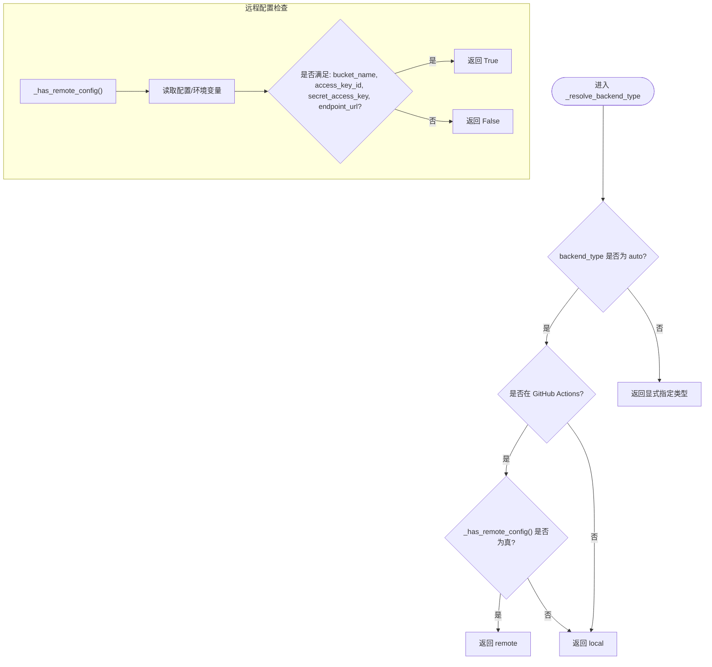
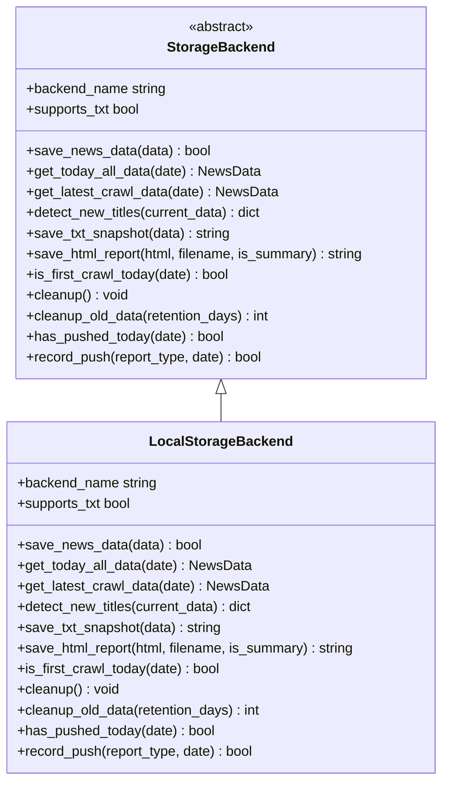
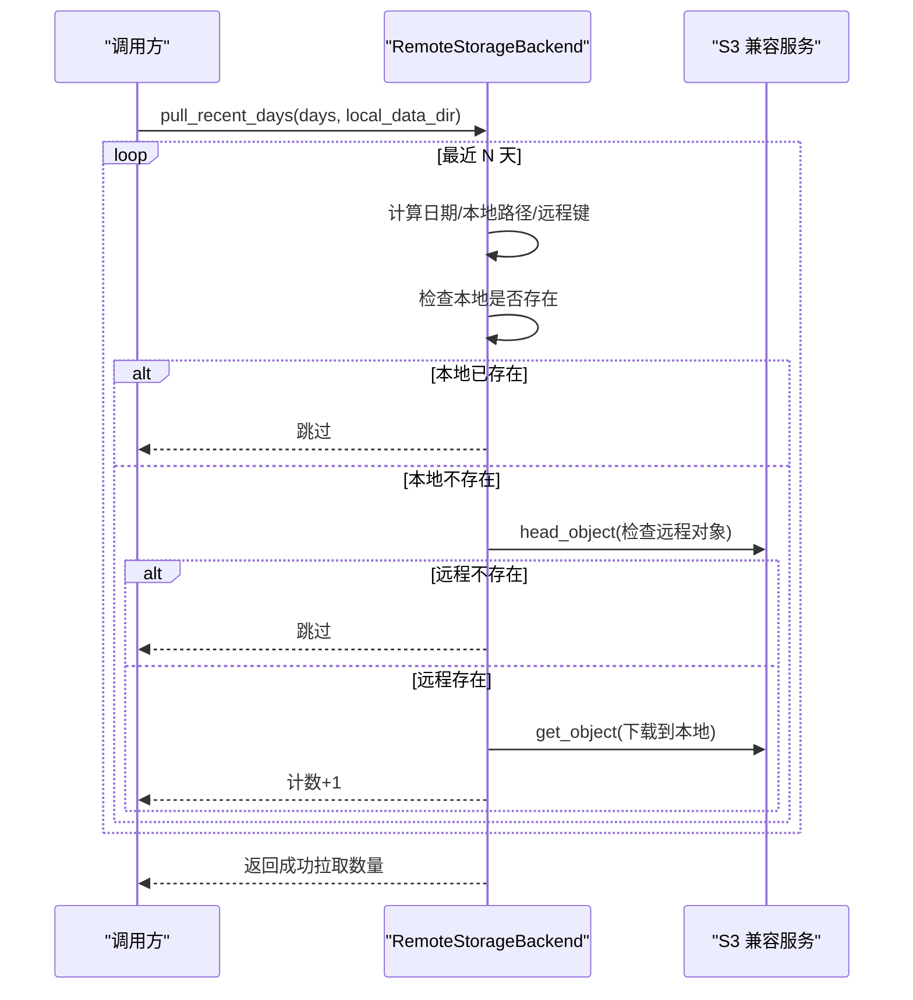
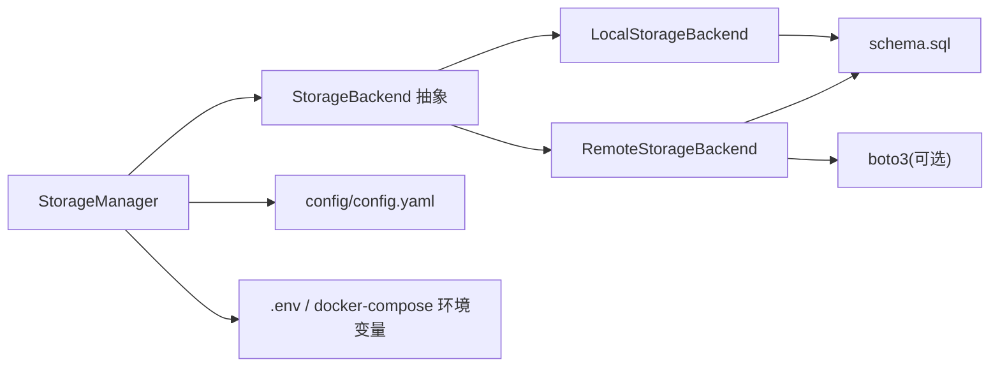

# 灵活存储架构

<cite>
**本文引用的文件**
- [trendradar/storage/manager.py](file://trendradar/storage/manager.py)
- [trendradar/storage/local.py](file://trendradar/storage/local.py)
- [trendradar/storage/remote.py](file://trendradar/storage/remote.py)
- [trendradar/storage/base.py](file://trendradar/storage/base.py)
- [trendradar/storage/schema.sql](file://trendradar/storage/schema.sql)
- [config/config.yaml](file://config/config.yaml)
- [docker/.env](file://docker/.env)
- [docker/docker-compose.yml](file://docker/docker-compose.yml)
- [mcp_server/tools/storage_sync.py](file://mcp_server/tools/storage_sync.py)
</cite>

## 目录
1. [简介](#简介)
2. [项目结构](#项目结构)
3. [核心组件](#核心组件)
4. [架构总览](#架构总览)
5. [详细组件分析](#详细组件分析)
6. [依赖关系分析](#依赖关系分析)
7. [性能考量](#性能考量)
8. [故障排查指南](#故障排查指南)
9. [结论](#结论)
10. [附录](#附录)

## 简介
本文件系统性阐述 TrendRadar 的“双模式存储架构”：本地 SQLite 与远程 S3 兼容云存储的统一抽象与自动切换。重点围绕以下目标展开：
- StorageManager 如何依据运行环境（Docker、GitHub Actions）与配置自动选择存储后端；
- _resolve_backend_type 与 _has_remote_config 的决策逻辑；
- pull_from_remote 的数据同步流程；
- cleanup_old_data 的生命周期管理；
- 结合 config.yaml 的存储配置项，给出不同部署场景的最佳实践。

## 项目结构
存储相关代码集中在 trendradar/storage 目录，采用“抽象基类 + 本地/远程具体实现”的分层设计，并通过统一的 StorageManager 协调后端选择、数据读写与生命周期管理。MCP Server 提供独立的存储同步工具，便于从远程拉取数据到本地分析。

图表来源
- [trendradar/storage/base.py](file://trendradar/storage/base.py#L187-L356)
- [trendradar/storage/local.py](file://trendradar/storage/local.py#L1-L120)
- [trendradar/storage/remote.py](file://trendradar/storage/remote.py#L40-L120)
- [trendradar/storage/manager.py](file://trendradar/storage/manager.py#L29-L173)
- [config/config.yaml](file://config/config.yaml#L12-L52)
- [docker/.env](file://docker/.env#L90-L120)
- [docker/docker-compose.yml](file://docker/docker-compose.yml#L54-L69)
- [mcp_server/tools/storage_sync.py](file://mcp_server/tools/storage_sync.py#L19-L40)

章节来源
- [trendradar/storage/base.py](file://trendradar/storage/base.py#L187-L356)
- [trendradar/storage/manager.py](file://trendradar/storage/manager.py#L29-L173)
- [config/config.yaml](file://config/config.yaml#L12-L52)
- [docker/.env](file://docker/.env#L90-L120)
- [docker/docker-compose.yml](file://docker/docker-compose.yml#L54-L69)
- [mcp_server/tools/storage_sync.py](file://mcp_server/tools/storage_sync.py#L19-L40)

## 核心组件
- StorageBackend 抽象基类：定义统一接口，包括保存、读取、检测新增、生成报告、首次抓取判断、清理资源与过期数据等。
- LocalStorageBackend：基于 SQLite 的本地存储，支持按日期组织的数据库文件、可选 TXT 快照与 HTML 报告；提供过期数据清理。
- RemoteStorageBackend：基于 S3 兼容 API 的远程存储，下载/上传 SQLite 至临时目录进行合并，支持过期数据批量删除。
- StorageManager：统一入口，负责后端类型解析、远程配置检查、远程拉取、生命周期清理与推送记录辅助能力。

章节来源
- [trendradar/storage/base.py](file://trendradar/storage/base.py#L187-L356)
- [trendradar/storage/local.py](file://trendradar/storage/local.py#L1-L120)
- [trendradar/storage/remote.py](file://trendradar/storage/remote.py#L40-L120)
- [trendradar/storage/manager.py](file://trendradar/storage/manager.py#L29-L173)

## 架构总览
双模式架构的核心在于“统一抽象 + 自动后端选择”。StorageManager 在初始化时解析 backend_type 与运行环境，结合远程配置决定使用本地还是远程后端；在运行期通过统一接口对外暴露数据读写与生命周期管理。

图表来源
- [trendradar/storage/manager.py](file://trendradar/storage/manager.py#L93-L173)
- [trendradar/storage/local.py](file://trendradar/storage/local.py#L1-L120)
- [trendradar/storage/remote.py](file://trendradar/storage/remote.py#L40-L120)

## 详细组件分析

### StorageManager：后端选择与生命周期管理
- 自动后端选择
  - _resolve_backend_type：当 backend_type 为 auto 时，若在 GitHub Actions 且具备远程配置则选择 remote，否则选择 local；否则直接使用显式指定的 backend_type。
  - _has_remote_config：检查配置或环境变量中是否完整提供 bucket_name、access_key_id、secret_access_key、endpoint_url。
- 远程后端创建
  - _create_remote_backend：延迟导入并初始化 RemoteStorageBackend，失败时回退到本地后端。
- 数据同步
  - pull_from_remote：在 pull_enabled 且 pull_days > 0 且具备远程配置时，调用远程后端的 pull_recent_days 将最近 N 天的数据库文件拉取到本地。
- 生命周期清理
  - cleanup_old_data：分别调用本地与远程后端的清理逻辑，按 local_retention_days 与 remote_retention_days 控制保留天数。

图表来源
- [trendradar/storage/manager.py](file://trendradar/storage/manager.py#L93-L125)
- [trendradar/storage/manager.py](file://trendradar/storage/manager.py#L107-L125)

章节来源
- [trendradar/storage/manager.py](file://trendradar/storage/manager.py#L93-L173)
- [trendradar/storage/manager.py](file://trendradar/storage/manager.py#L175-L203)
- [trendradar/storage/manager.py](file://trendradar/storage/manager.py#L235-L256)

### LocalStorageBackend：本地 SQLite + 文件
- 数据模型与表结构
  - schema.sql 定义 platforms、news_items、title_changes、rank_history、crawl_records、crawl_source_status、push_records 等表及索引，支持 URL+平台去重、标题变更追踪、排名历史与抓取状态记录。
- 数据写入与合并
  - save_news_data：按 URL 标准化去重，支持标题变更记录与排名历史追加；记录抓取时间、来源状态；输出统计日志。
- 数据读取
  - get_today_all_data/get_latest_crawl_data：按日期聚合新闻，合并排名历史，返回 NewsData。
  - detect_new_titles：基于 first_time 与当前批次时间判断新增标题。
- 报告与快照
  - save_txt_snapshot/save_html_report：按配置生成文本快照与 HTML 报告。
- 首次抓取判断与推送记录
  - is_first_crawl_today/has_pushed_today/record_push：基于 crawl_records 与 push_records 表实现。
- 过期数据清理
  - cleanup_old_data：遍历 output 目录，删除超过保留天数的日期目录，关闭对应数据库连接。

图表来源
- [trendradar/storage/base.py](file://trendradar/storage/base.py#L187-L356)
- [trendradar/storage/local.py](file://trendradar/storage/local.py#L1-L120)

章节来源
- [trendradar/storage/local.py](file://trendradar/storage/local.py#L113-L292)
- [trendradar/storage/local.py](file://trendradar/storage/local.py#L293-L524)
- [trendradar/storage/local.py](file://trendradar/storage/local.py#L526-L584)
- [trendradar/storage/local.py](file://trendradar/storage/local.py#L585-L671)
- [trendradar/storage/local.py](file://trendradar/storage/local.py#L673-L704)
- [trendradar/storage/local.py](file://trendradar/storage/local.py#L735-L745)
- [trendradar/storage/local.py](file://trendradar/storage/local.py#L746-L821)
- [trendradar/storage/schema.sql](file://trendradar/storage/schema.sql#L1-L118)

### RemoteStorageBackend：S3 兼容远程存储
- 连接与初始化
  - 使用 boto3 客户端，按 endpoint 类型选择签名版本（腾讯云 COS 使用 s3，其他默认 s3v4），支持虚拟主机风格地址。
- 数据流（写入）
  - save_news_data：下载远程 SQLite 到临时目录，合并新数据后上传回远程；记录抓取与来源状态，输出统计日志。
- 数据流（读取）
  - get_today_all_data/get_latest_crawl_data/detect_new_titles：与本地一致的读取逻辑，基于合并后的数据库。
- 报告与快照
  - save_html_report：保存到临时目录；save_txt_snapshot：可选开启。
- 过期数据清理
  - cleanup_old_data：枚举过期日期，批量删除 news/{date}.db 对象，支持 1000 个对象批量删除。
- 远程拉取
  - pull_recent_days：按最近 N 天循环拉取，跳过本地已存在与远程不存在的日期，最终返回成功拉取数量。

图表来源
- [trendradar/storage/remote.py](file://trendradar/storage/remote.py#L1042-L1129)
- [trendradar/storage/remote.py](file://trendradar/storage/remote.py#L143-L211)
- [trendradar/storage/remote.py](file://trendradar/storage/remote.py#L225-L274)

章节来源
- [trendradar/storage/remote.py](file://trendradar/storage/remote.py#L40-L120)
- [trendradar/storage/remote.py](file://trendradar/storage/remote.py#L143-L211)
- [trendradar/storage/remote.py](file://trendradar/storage/remote.py#L225-L274)
- [trendradar/storage/remote.py](file://trendradar/storage/remote.py#L275-L311)
- [trendradar/storage/remote.py](file://trendradar/storage/remote.py#L312-L512)
- [trendradar/storage/remote.py](file://trendradar/storage/remote.py#L513-L697)
- [trendradar/storage/remote.py](file://trendradar/storage/remote.py#L749-L794)
- [trendradar/storage/remote.py](file://trendradar/storage/remote.py#L795-L866)
- [trendradar/storage/remote.py](file://trendradar/storage/remote.py#L929-L957)
- [trendradar/storage/remote.py](file://trendradar/storage/remote.py#L1042-L1129)

### MCP 存储同步工具：从远程拉取到本地
- 配置合并：优先读取 config/config.yaml，再合并环境变量（S3_* 与 STORAGE_*）。
- 远程后端创建：按配置初始化 RemoteStorageBackend。
- 拉取流程：计算最近 N 天日期，过滤远程存在且本地不存在的日期，逐日下载 news/{date}.db 到本地 output 目录。
- 状态查询：提供本地/远程可用日期、大小、保留天数等信息。

章节来源
- [mcp_server/tools/storage_sync.py](file://mcp_server/tools/storage_sync.py#L19-L40)
- [mcp_server/tools/storage_sync.py](file://mcp_server/tools/storage_sync.py#L49-L68)
- [mcp_server/tools/storage_sync.py](file://mcp_server/tools/storage_sync.py#L176-L288)
- [mcp_server/tools/storage_sync.py](file://mcp_server/tools/storage_sync.py#L289-L371)
- [mcp_server/tools/storage_sync.py](file://mcp_server/tools/storage_sync.py#L373-L469)

## 依赖关系分析
- StorageManager 依赖 StorageBackend 抽象，运行时注入 LocalStorageBackend 或 RemoteStorageBackend。
- LocalStorageBackend/RemoteStorageBackend 依赖 schema.sql 定义的表结构。
- StorageManager 与 MCP 工具均依赖 config/config.yaml 与环境变量（STORAGE_*、S3_*、PULL_*）。
- RemoteStorageBackend 依赖 boto3（安装提示与导入保护）。

图表来源
- [trendradar/storage/manager.py](file://trendradar/storage/manager.py#L29-L173)
- [trendradar/storage/local.py](file://trendradar/storage/local.py#L96-L112)
- [trendradar/storage/remote.py](file://trendradar/storage/remote.py#L20-L40)
- [config/config.yaml](file://config/config.yaml#L12-L52)
- [docker/.env](file://docker/.env#L90-L120)
- [docker/docker-compose.yml](file://docker/docker-compose.yml#L54-L69)

章节来源
- [trendradar/storage/manager.py](file://trendradar/storage/manager.py#L29-L173)
- [trendradar/storage/local.py](file://trendradar/storage/local.py#L96-L112)
- [trendradar/storage/remote.py](file://trendradar/storage/remote.py#L20-L40)
- [config/config.yaml](file://config/config.yaml#L12-L52)
- [docker/.env](file://docker/.env#L90-L120)
- [docker/docker-compose.yml](file://docker/docker-compose.yml#L54-L69)

## 性能考量
- 本地存储
  - SQLite 连接缓存：LocalStorageBackend 缓存每个日期的数据库连接，减少频繁打开/关闭开销。
  - 批量查询与索引：schema.sql 提供多处索引，有助于按平台、时间、标题检索与排名历史聚合。
- 远程存储
  - 临时目录与下载/上传：RemoteStorageBackend 将远程 SQLite 下载至本地临时目录，合并后再上传，避免跨网络频繁写入。
  - 批量删除：远程清理使用 1000 个对象的批量删除，降低 API 调用次数。
- 时区与时间：统一使用配置时区，保证跨时区部署的一致性与推送窗口控制。

[本节为通用指导，无需特定文件引用]

## 故障排查指南
- 远程后端导入失败
  - 现象：提示需要安装 boto3。
  - 处理：在运行环境中安装 boto3；确认环境变量 S3_* 配置正确。
- 远程配置缺失
  - 现象：_has_remote_config() 返回 False，StorageManager 回退到本地。
  - 处理：检查 config/config.yaml 与环境变量，确保 bucket_name、access_key_id、secret_access_key、endpoint_url 均已配置。
- 远程对象不存在
  - 现象：pull_recent_days 跳过某些日期。
  - 处理：确认远程确实存在 news/{date}.db；检查日期格式与时区。
- 上传/下载异常
  - 现象：上传/下载失败或验证失败。
  - 处理：检查 endpoint 签名版本（腾讯云 COS 使用 s3），确认网络连通与权限；查看错误码与异常日志。
- 本地清理失败
  - 现象：删除过期目录失败。
  - 处理：检查磁盘权限与占用；确认对应日期数据库连接已关闭。

章节来源
- [trendradar/storage/manager.py](file://trendradar/storage/manager.py#L126-L148)
- [trendradar/storage/remote.py](file://trendradar/storage/remote.py#L225-L274)
- [trendradar/storage/remote.py](file://trendradar/storage/remote.py#L929-L957)
- [trendradar/storage/local.py](file://trendradar/storage/local.py#L795-L821)

## 结论
该双模式存储架构通过统一抽象与自动后端选择，实现了在不同运行环境与部署场景下的无缝切换。StorageManager 将后端选择、远程拉取与生命周期管理整合为单一入口，配合 MCP 工具可实现从远程到本地的便捷同步。结合合理的配置与清理策略，可在 GitHub Actions、Docker 与本地环境中稳定运行并高效管理数据。

[本节为总结性内容，无需特定文件引用]

## 附录

### 配置项与最佳实践（结合 config.yaml 与 .env/docker-compose）
- 存储后端选择
  - auto：GitHub Actions 环境且配置远程则用 remote，否则用 local；Docker/本地默认 local。
  - local：强制本地 SQLite。
  - remote：强制远程 S3 兼容存储。
- 数据格式
  - sqlite 必须启用；txt/html 可按需开启。
- 本地存储
  - data_dir：数据目录；retention_days：本地保留天数（0 表示不清理）。
- 远程存储
  - endpoint_url、bucket_name、access_key_id、secret_access_key、region：S3 兼容配置；retention_days：远程保留天数（0 表示不清理）。
- 数据拉取
  - pull.enabled：是否启用启动时自动拉取；pull.days：拉取最近 N 天。
- 环境变量优先级
  - .env 与 docker-compose 中的 STORAGE_*、S3_*、PULL_* 优先于 config/config.yaml。
- 部署场景建议
  - GitHub Actions：backend=auto，配置 S3_*，启用 remote；必要时开启 pull.enabled。
  - Docker：backend=local 或 remote；通过 .env 配置 STORAGE_* 与 PULL_*。
  - 本地开发：backend=local；如需远程分析，可开启 pull.enabled 并配置 S3_*。

章节来源
- [config/config.yaml](file://config/config.yaml#L12-L52)
- [config/config.yaml](file://config/config.yaml#L31-L52)
- [docker/.env](file://docker/.env#L90-L120)
- [docker/docker-compose.yml](file://docker/docker-compose.yml#L54-L69)
- [README.md](file://README.md#L3009-L3016)
- [README.md](file://README.md#L3018-L3040)
- [README.md](file://README.md#L3044-L3060)