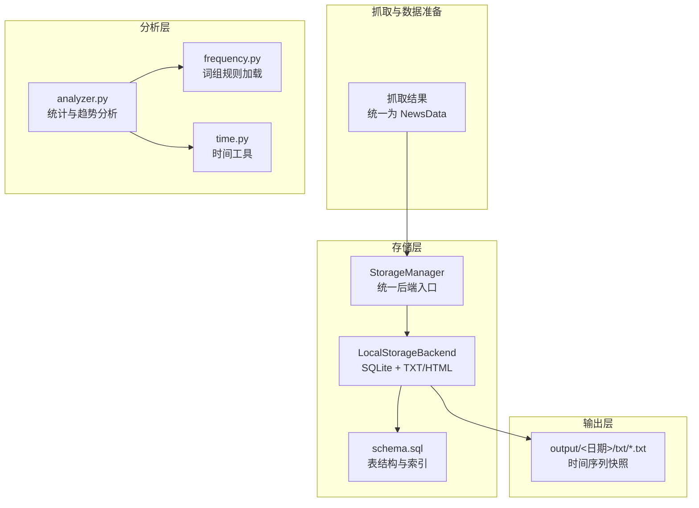
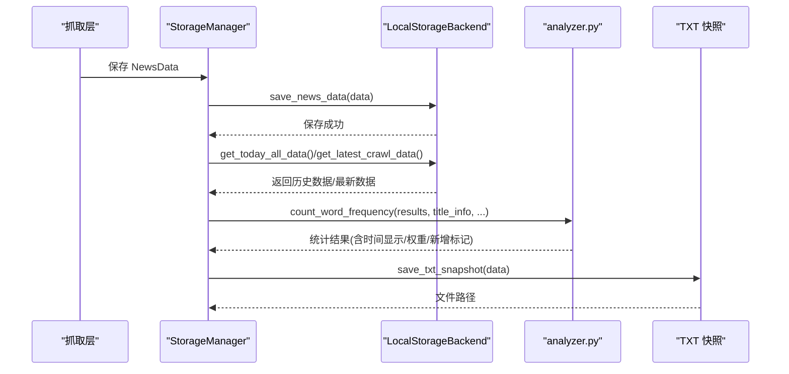
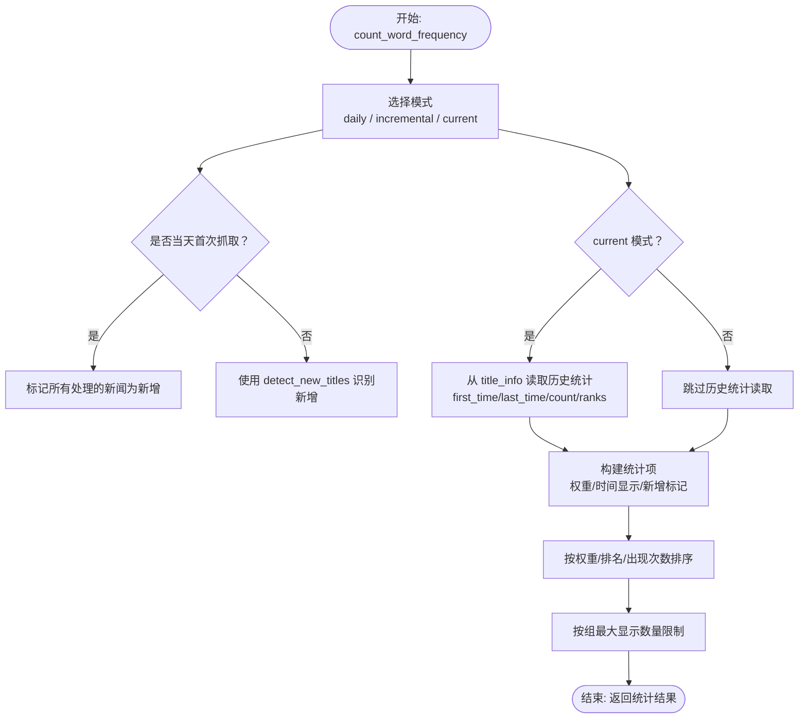
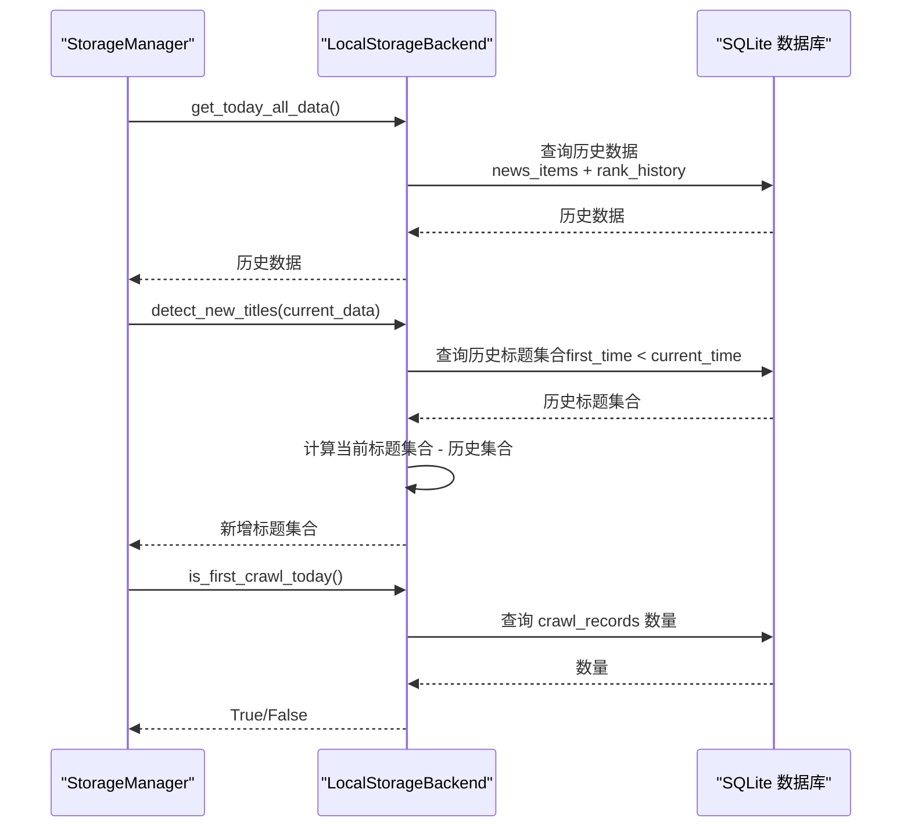
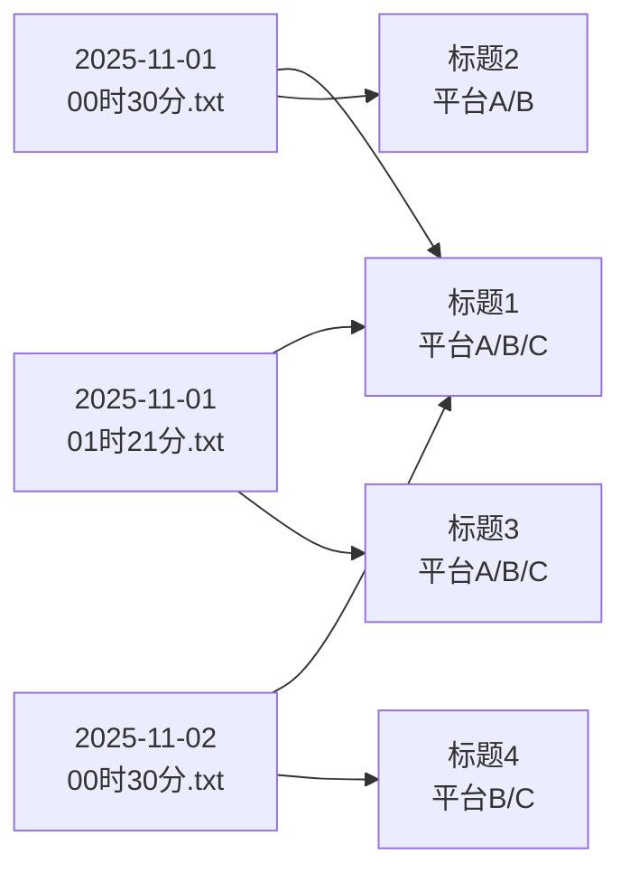
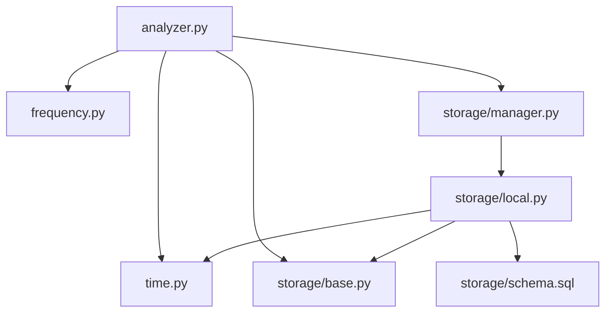

# 热点趋势分析

<cite>
**本文引用的文件**
- [trendradar/core/analyzer.py](file://trendradar/core/analyzer.py)
- [trendradar/storage/manager.py](file://trendradar/storage/manager.py)
- [trendradar/storage/local.py](file://trendradar/storage/local.py)
- [trendradar/storage/base.py](file://trendradar/storage/base.py)
- [trendradar/storage/schema.sql](file://trendradar/storage/schema.sql)
- [trendradar/utils/time.py](file://trendradar/utils/time.py)
- [trendradar/core/frequency.py](file://trendradar/core/frequency.py)
- [output/2025年11月01日/txt/00时30分.txt](file://output/2025年11月01日/txt/00时30分.txt)
- [output/2025年11月01日/txt/01时21分.txt](file://output/2025年11月01日/txt/01时21分.txt)
</cite>

## 目录
1. [简介](#简介)
2. [项目结构](#项目结构)
3. [核心组件](#核心组件)
4. [架构总览](#架构总览)
5. [详细组件分析](#详细组件分析)
6. [依赖关系分析](#依赖关系分析)
7. [性能考量](#性能考量)
8. [故障排查指南](#故障排查指南)
9. [结论](#结论)
10. [附录](#附录)

## 简介
本文件围绕系统如何追踪新闻热度变化与演变过程展开，重点解释以下内容：
- analyzer.py 中 count_word_frequency 函数如何利用 title_info 参数实现跨批次数据对比；
- format_time_display 函数如何生成时间轴信息；
- storage/manager.py 中 detect_new_titles 与 is_first_crawl_today 方法在趋势分析中的作用；
- output/ 目录中的 TXT 文件如何体现时间序列数据，支撑持续性分析与跨平台对比。

## 项目结构
系统采用“抓取-存储-分析-输出”的分层设计：
- 抓取层：将各平台榜单转化为统一数据结构；
- 存储层：以 SQLite 为主，配合 TXT 快照与 HTML 报告；
- 分析层：基于词频规则与时间维度进行统计与趋势判断；
- 输出层：按日期/时间生成 TXT 快照，便于跨批次对比与跨平台对照。

图表来源
- [trendradar/storage/manager.py](file://trendradar/storage/manager.py#L1-L120)
- [trendradar/storage/local.py](file://trendradar/storage/local.py#L1-L120)
- [trendradar/storage/schema.sql](file://trendradar/storage/schema.sql#L1-L118)
- [trendradar/core/analyzer.py](file://trendradar/core/analyzer.py#L1-L120)
- [trendradar/core/frequency.py](file://trendradar/core/frequency.py#L1-L120)
- [trendradar/utils/time.py](file://trendradar/utils/time.py#L1-L92)

章节来源
- [trendradar/storage/manager.py](file://trendradar/storage/manager.py#L1-L120)
- [trendradar/storage/local.py](file://trendradar/storage/local.py#L1-L120)
- [trendradar/storage/schema.sql](file://trendradar/storage/schema.sql#L1-L118)
- [trendradar/core/analyzer.py](file://trendradar/core/analyzer.py#L1-L120)
- [trendradar/core/frequency.py](file://trendradar/core/frequency.py#L1-L120)
- [trendradar/utils/time.py](file://trendradar/utils/time.py#L1-L92)

## 核心组件
- 统计分析模块 analyzer.py
  - 提供计算新闻权重、格式化时间显示、统计词频与趋势分析的核心函数。
- 存储管理器 storage/manager.py
  - 统一后端选择与接口封装，提供 detect_new_titles 与 is_first_crawl_today 等关键方法。
- 本地存储后端 storage/local.py
  - 基于 SQLite 的持久化存储，提供 get_today_all_data、get_latest_crawl_data、detect_new_titles、is_first_crawl_today 等实现。
- 数据模型与合并逻辑 storage/base.py
  - 定义 NewsData/NewsItem 数据结构与合并策略，支撑跨批次聚合。
- 数据库结构 storage/schema.sql
  - 定义 platforms、news_items、rank_history、crawl_records、crawl_source_status、push_records 等表及索引。
- 时间工具 utils/time.py
  - 提供时间格式化与显示转换，辅助 format_time_display。
- 词组规则 core/frequency.py
  - 从配置文件加载词组规则，支持必须词、过滤词、全局过滤词与最大显示数量。

章节来源
- [trendradar/core/analyzer.py](file://trendradar/core/analyzer.py#L1-L120)
- [trendradar/storage/manager.py](file://trendradar/storage/manager.py#L1-L120)
- [trendradar/storage/local.py](file://trendradar/storage/local.py#L1-L120)
- [trendradar/storage/base.py](file://trendradar/storage/base.py#L1-L120)
- [trendradar/storage/schema.sql](file://trendradar/storage/schema.sql#L1-L118)
- [trendradar/utils/time.py](file://trendradar/utils/time.py#L1-L92)
- [trendradar/core/frequency.py](file://trendradar/core/frequency.py#L1-L120)

## 架构总览
系统通过“存储-分析-输出”闭环实现热点趋势追踪：
- 存储层：按日期组织 SQLite 数据库，记录每个抓取批次的排名历史与抓取状态；
- 分析层：基于词组规则与历史统计，计算权重、识别新增、生成时间显示；
- 输出层：按时间生成 TXT 快照，支持跨批次对比与跨平台对照。

图表来源
- [trendradar/storage/manager.py](file://trendradar/storage/manager.py#L170-L230)
- [trendradar/storage/local.py](file://trendradar/storage/local.py#L110-L220)
- [trendradar/core/analyzer.py](file://trendradar/core/analyzer.py#L90-L210)

章节来源
- [trendradar/storage/manager.py](file://trendradar/storage/manager.py#L170-L230)
- [trendradar/storage/local.py](file://trendradar/storage/local.py#L110-L220)
- [trendradar/core/analyzer.py](file://trendradar/core/analyzer.py#L90-L210)

## 详细组件分析

### 统计分析：count_word_frequency 与 format_time_display
- count_word_frequency
  - 支持三种模式：daily（当日汇总）、incremental（当天增量，含首次抓取逻辑）、current（当前榜单，基于最新时间筛选）。
  - 通过 title_info 参数实现跨批次数据对比：在 current 模式下，从 title_info 中读取 first_time/last_time/count/ranks/url/mobileUrl 等字段，从而获得历史累计信息；在 daily/incremental 模式下，也可结合 title_info 进行历史统计。
  - 新增标题检测：当 is_first_crawl_func 返回 True 或 incremental 模式且当天首次抓取时，将所有处理的新闻标记为新增；否则通过 detect_new_titles 比对历史数据确定新增。
  - 权重计算：使用 calculate_news_weight 综合排名、出现次数与高排名比例，用于排序与热点判定。
  - 时间显示：调用 format_time_display 将 HH-MM 转换为 HH:MM，并在首次与末次时间相同时简化显示。
- format_time_display
  - 输入 first_time/last_time 与 convert_time_func，输出形如“HH:MM”或“[HH:MM ~ HH:MM]”的区间显示，便于直观展示时间跨度。

图表来源
- [trendradar/core/analyzer.py](file://trendradar/core/analyzer.py#L90-L210)
- [trendradar/core/analyzer.py](file://trendradar/core/analyzer.py#L63-L88)
- [trendradar/storage/local.py](file://trendradar/storage/local.py#L526-L584)

章节来源
- [trendradar/core/analyzer.py](file://trendradar/core/analyzer.py#L90-L210)
- [trendradar/core/analyzer.py](file://trendradar/core/analyzer.py#L63-L88)

### 存储与趋势：detect_new_titles 与 is_first_crawl_today
- detect_new_titles
  - 通过 get_today_all_data 获取历史数据，收集历史批次中 first_time < current_time 的标题集合，然后与当前批次标题集合做差集，得到新增标题。
  - 在首次抓取（无历史数据）时，返回当前批次所有标题；在历史数据为空时返回空集。
- is_first_crawl_today
  - 通过查询 crawl_records 数量判断当天是否为首次抓取；若记录数小于等于 1，则视为首次抓取，用于控制增量模式下的新增逻辑。

图表来源
- [trendradar/storage/manager.py](file://trendradar/storage/manager.py#L212-L227)
- [trendradar/storage/local.py](file://trendradar/storage/local.py#L526-L584)
- [trendradar/storage/local.py](file://trendradar/storage/local.py#L673-L704)
- [trendradar/storage/schema.sql](file://trendradar/storage/schema.sql#L63-L81)

章节来源
- [trendradar/storage/manager.py](file://trendradar/storage/manager.py#L212-L227)
- [trendradar/storage/local.py](file://trendradar/storage/local.py#L526-L584)
- [trendradar/storage/local.py](file://trendradar/storage/local.py#L673-L704)
- [trendradar/storage/schema.sql](file://trendradar/storage/schema.sql#L63-L81)

### 时间序列与跨平台对比：output/ 目录中的 TXT 文件
- 输出结构
  - 按日期组织，例如 output/2025年11月01日/txt/*.txt，文件名为 HH时MM分.txt，对应抓取时间。
- 内容构成
  - 每个文件包含多个来源平台的榜单，按排名顺序列出标题与链接；部分平台还包含移动端链接。
- 跨批次对比
  - 通过对比同一时刻不同日期的 TXT 文件，可观察标题排名变化与新增情况；同一标题在不同平台的出现与排名可用于跨平台对比。
- 跨平台对照
  - 同一标题在不同平台的出现与 URL 可用于交叉验证与热度扩散分析。

图表来源
- [output/2025年11月01日/txt/00时30分.txt](file://output/2025年11月01日/txt/00时30分.txt#L1-L60)
- [output/2025年11月01日/txt/01时21分.txt](file://output/2025年11月01日/txt/01时21分.txt#L1-L60)

章节来源
- [output/2025年11月01日/txt/00时30分.txt](file://output/2025年11月01日/txt/00时30分.txt#L1-L60)
- [output/2025年11月01日/txt/01时21分.txt](file://output/2025年11月01日/txt/01时21分.txt#L1-L60)

## 依赖关系分析
- analyzer.py 依赖
  - frequency.py：加载词组规则；
  - time.py：时间格式转换；
  - storage/base.py：NewsData/NewsItem 数据结构与转换；
  - storage/manager.py：统一后端接口（detect_new_titles、is_first_crawl_today）。
- storage/local.py 依赖
  - schema.sql：表结构与索引；
  - utils/time.py：时间格式化；
  - storage/base.py：数据模型与合并逻辑。
- 输出层依赖
  - storage/local.py.save_txt_snapshot：生成 TXT 快照。

图表来源
- [trendradar/core/analyzer.py](file://trendradar/core/analyzer.py#L1-L120)
- [trendradar/core/frequency.py](file://trendradar/core/frequency.py#L1-L120)
- [trendradar/utils/time.py](file://trendradar/utils/time.py#L1-L92)
- [trendradar/storage/base.py](file://trendradar/storage/base.py#L1-L120)
- [trendradar/storage/manager.py](file://trendradar/storage/manager.py#L1-L120)
- [trendradar/storage/local.py](file://trendradar/storage/local.py#L1-L120)
- [trendradar/storage/schema.sql](file://trendradar/storage/schema.sql#L1-L118)

章节来源
- [trendradar/core/analyzer.py](file://trendradar/core/analyzer.py#L1-L120)
- [trendradar/core/frequency.py](file://trendradar/core/frequency.py#L1-L120)
- [trendradar/utils/time.py](file://trendradar/utils/time.py#L1-L92)
- [trendradar/storage/base.py](file://trendradar/storage/base.py#L1-L120)
- [trendradar/storage/manager.py](file://trendradar/storage/manager.py#L1-L120)
- [trendradar/storage/local.py](file://trendradar/storage/local.py#L1-L120)
- [trendradar/storage/schema.sql](file://trendradar/storage/schema.sql#L1-L118)

## 性能考量
- 数据库索引
  - 为 news_items 的 platform_id、last_crawl_time、title 建立索引，有助于快速查询与排序；
  - 为 rank_history 的 news_item_id 建立索引，提升批量查询历史排名效率。
- 批量查询
  - 在 get_today_all_data 与 get_latest_crawl_data 中，使用批量查询 rank_history，避免 N+1 查询问题。
- 去重与 URL 规范化
  - 通过 URL + platform_id 唯一索引与 URL 规范化，减少重复存储与标题变更带来的冗余。
- 时间格式化
  - 使用 time.py 的转换函数，避免频繁字符串格式化开销。

章节来源
- [trendradar/storage/schema.sql](file://trendradar/storage/schema.sql#L96-L118)
- [trendradar/storage/local.py](file://trendradar/storage/local.py#L320-L380)
- [trendradar/storage/local.py](file://trendradar/storage/local.py#L450-L520)
- [trendradar/utils/time.py](file://trendradar/utils/time.py#L66-L92)

## 故障排查指南
- 新增检测异常
  - 若 detect_new_titles 返回空集，检查历史数据是否存在（get_today_all_data 是否返回 None）与 current_time 是否正确。
- 首次抓取误判
  - is_first_crawl_today 依赖 crawl_records 数量判断，若记录异常，需检查保存流程或手动清理异常记录。
- 时间显示异常
  - format_time_display 依赖 convert_time_func，若输入为 HH-MM 格式，确保使用 time.py 的转换函数进行格式化。
- 输出缺失
  - 若 save_txt_snapshot 失败，检查 enable_txt 配置与数据目录权限。

章节来源
- [trendradar/storage/local.py](file://trendradar/storage/local.py#L526-L584)
- [trendradar/storage/local.py](file://trendradar/storage/local.py#L673-L704)
- [trendradar/utils/time.py](file://trendradar/utils/time.py#L79-L92)
- [trendradar/storage/manager.py](file://trendradar/storage/manager.py#L170-L230)

## 结论
系统通过“词组规则 + 历史统计 + 时间序列 + 跨平台对比”的组合，实现了对新闻热点的持续追踪与趋势分析：
- analyzer.py 的 count_word_frequency 与 format_time_display 提供了跨批次对比与时间轴展示能力；
- storage/manager.py 的 detect_new_titles 与 is_first_crawl_today 保障了新增识别与首次抓取控制；
- storage/local.py 的 SQLite 存储与 schema.sql 的表结构，支撑了排名历史与抓取状态的长期留存；
- output/ 目录中的 TXT 快照为跨批次与跨平台对比提供了直观依据。

## 附录
- 数据模型与合并策略
  - NewsData/NewsItem 定义了统一的数据结构；
  - merge_with 支持跨批次合并，保留最早首次出现时间、累计出现次数与合并历史排名。

章节来源
- [trendradar/storage/base.py](file://trendradar/storage/base.py#L1-L120)
- [trendradar/storage/base.py](file://trendradar/storage/base.py#L114-L185)