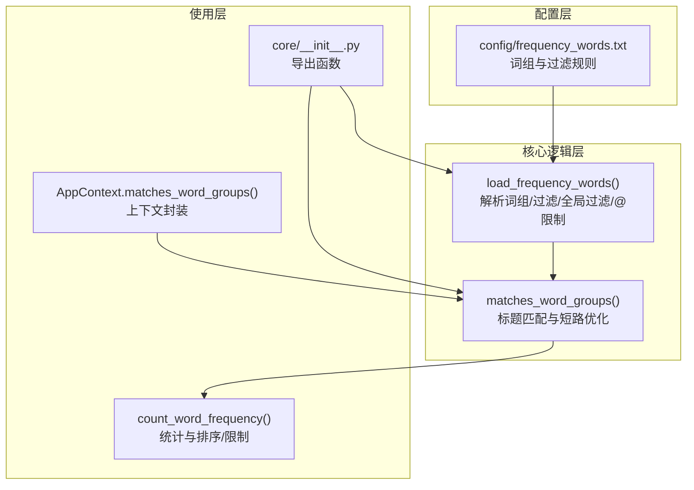
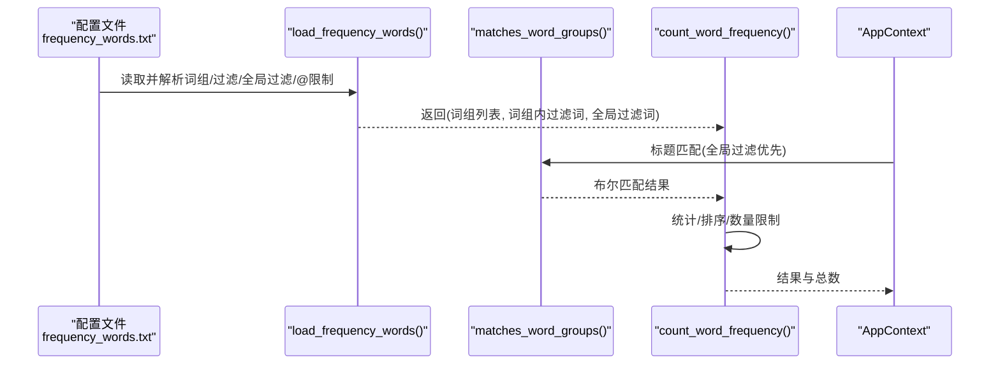
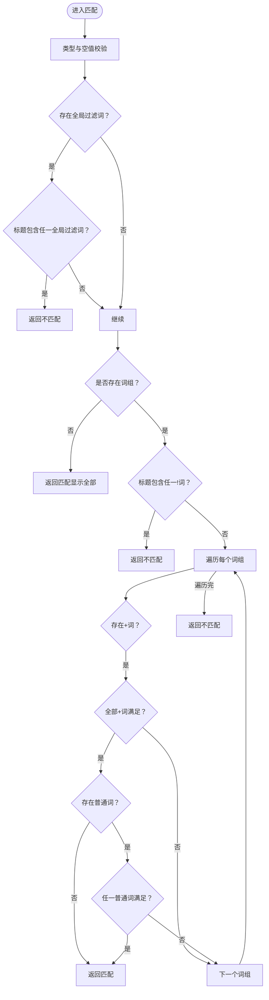
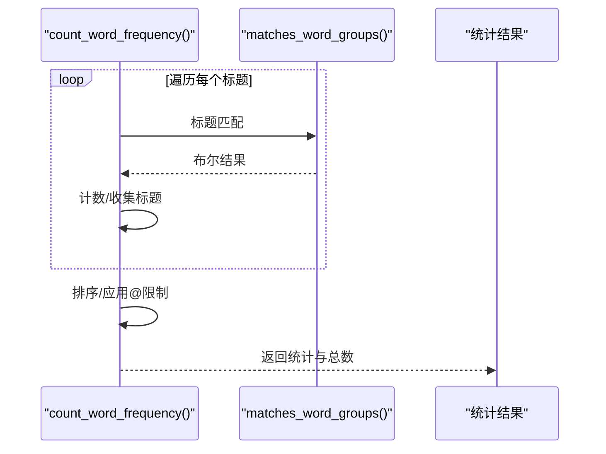
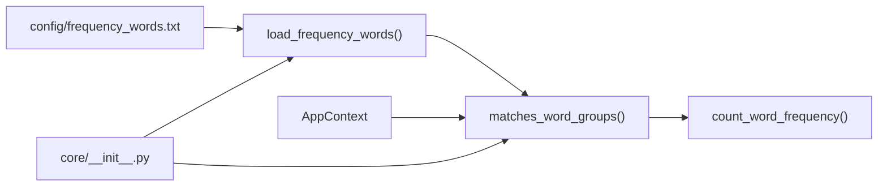

# 精准内容筛选

<cite>
**本文引用的文件**
- [config/frequency_words.txt](file://config/frequency_words.txt)
- [trendradar/core/frequency.py](file://trendradar/core/frequency.py)
- [trendradar/core/analyzer.py](file://trendradar/core/analyzer.py)
- [trendradar/context.py](file://trendradar/context.py)
- [trendradar/core/__init__.py](file://trendradar/core/__init__.py)
- [README-EN.md](file://README-EN.md)
</cite>

## 目录
1. [简介](#简介)
2. [项目结构](#项目结构)
3. [核心组件](#核心组件)
4. [架构总览](#架构总览)
5. [详细组件分析](#详细组件分析)
6. [依赖关系分析](#依赖关系分析)
7. [性能考量](#性能考量)
8. [故障排查指南](#故障排查指南)
9. [结论](#结论)
10. [附录](#附录)

## 简介
本文件围绕“频率词配置”展开，系统性解析以下内容：
- 配置文件语法：普通词、必须词(+前缀)、过滤词(!前缀)、数量限制(@前缀)、全局过滤([GLOBAL_FILTER])区域
- 解析逻辑：`load_frequency_words`如何拆分词组、解析语法、构建词组数据结构
- 匹配算法：`matches_word_groups`的匹配顺序与短路优化、全局过滤优先级
- 复杂筛选规则示例与正则扩展思路
- 常见配置错误与调试方法

## 项目结构
与“精准内容筛选”直接相关的文件与职责如下：
- 配置文件：config/frequency_words.txt
- 解析与匹配：trendradar/core/frequency.py
- 使用入口与统计：trendradar/core/analyzer.py
- 上下文封装：trendradar/context.py
- 导出入口：trendradar/core/__init__.py
- 历史文档参考：README-EN.md（包含必选词等特性说明）



图表来源
- [config/frequency_words.txt](file://config/frequency_words.txt#L1-L114)
- [trendradar/core/frequency.py](file://trendradar/core/frequency.py#L18-L195)
- [trendradar/core/analyzer.py](file://trendradar/core/analyzer.py#L90-L170)
- [trendradar/context.py](file://trendradar/context.py#L186-L202)
- [trendradar/core/__init__.py](file://trendradar/core/__init__.py#L12-L34)

章节来源
- [config/frequency_words.txt](file://config/frequency_words.txt#L1-L114)
- [trendradar/core/frequency.py](file://trendradar/core/frequency.py#L18-L195)
- [trendradar/core/analyzer.py](file://trendradar/core/analyzer.py#L90-L170)
- [trendradar/context.py](file://trendradar/context.py#L186-L202)
- [trendradar/core/__init__.py](file://trendradar/core/__init__.py#L12-L34)

## 核心组件
- 配置文件：以空行分隔的词组；支持区域标记[GLOBAL_FILTER]与[WORD_GROUPS]（默认）
- 解析函数：load_frequency_words
  - 支持普通词、+必须词、!过滤词、@数量限制
  - 支持[GLOBAL_FILTER]区域，其中不支持特殊语法前缀
  - 输出：词组列表、词组内过滤词、全局过滤词
- 匹配函数：matches_word_groups
  - 全局过滤优先级最高
  - 无词组时默认匹配所有标题
  - 词组内：必须词全满足且普通词至少一个满足即命中
  - 短路优化：一旦命中立即返回

章节来源
- [trendradar/core/frequency.py](file://trendradar/core/frequency.py#L18-L129)
- [trendradar/core/frequency.py](file://trendradar/core/frequency.py#L132-L195)

## 架构总览
下面的序列图展示了“加载配置—匹配标题—统计输出”的关键流程。



图表来源
- [config/frequency_words.txt](file://config/frequency_words.txt#L1-L114)
- [trendradar/core/frequency.py](file://trendradar/core/frequency.py#L18-L129)
- [trendradar/core/analyzer.py](file://trendradar/core/analyzer.py#L233-L246)
- [trendradar/context.py](file://trendradar/context.py#L186-L202)

## 详细组件分析

### 配置文件语法与解析（load_frequency_words）
- 词组分隔：以空行分隔不同词组
- 区域标记：支持[GLOBAL_FILTER]与[WORD_GROUPS]（默认）
- 语法支持：
  - 普通词：直接写入，任意匹配即可
  - +词：必须词，词组内所有+词均需出现在标题中
  - !词：过滤词，若匹配则排除
  - @数字：该词组最多显示条数（仅接受正整数）
  - [GLOBAL_FILTER]区域：定义全局过滤词，不支持特殊语法前缀
- 输出结构：
  - 词组列表：每组包含required、normal、group_key、max_count
  - 词组内过滤词：扁平化的!词列表
  - 全局过滤词：扁平化的全局过滤词列表

```mermaid
flowchart TD
Start(["开始"]) --> Read["读取配置文件"]
Read --> SplitGroups["按空行分割为词组"]
SplitGroups --> LoopGroups{"遍历每个词组"}
LoopGroups --> CheckSection{"首行是否为区域标记？"}
CheckSection --> |是| SetSection["切换当前区域(GLOBAL_FILTER/WORD_GROUPS)"]
CheckSection --> |否| ParseWords["解析词组内的词"]
SetSection --> ParseWords
ParseWords --> TypeCheck{"词类型判断"}
TypeCheck --> |@数字| MaxCount["解析正整数并设置max_count"]
TypeCheck --> |!词| AddFilter["加入词组内过滤词"]
TypeCheck --> |+词| AddRequired["加入必须词"]
TypeCheck --> |普通词| AddNormal["加入普通词"]
MaxCount --> Next
AddFilter --> Next
AddRequired --> Next
AddNormal --> Next
Next --> CollectGroup{"收集组数据"}
CollectGroup --> LoopGroups
LoopGroups --> |结束| Return["返回(词组列表, 词组内过滤词, 全局过滤词)"]
```

图表来源
- [trendradar/core/frequency.py](file://trendradar/core/frequency.py#L56-L129)

章节来源
- [trendradar/core/frequency.py](file://trendradar/core/frequency.py#L18-L129)
- [config/frequency_words.txt](file://config/frequency_words.txt#L1-L114)

### 匹配算法与短路优化（matches_word_groups）
- 匹配顺序与优先级：
  1) 全局过滤：若标题包含任一全局过滤词，直接返回不匹配
  2) 无词组：返回匹配（支持显示全部新闻）
  3) 词组内过滤：若标题包含任一!词，返回不匹配
  4) 词组匹配：对每个词组
     - 若存在+词，必须全部满足
     - 若存在普通词，至少一个满足
     - 任一词组满足即返回匹配
- 短路优化：一旦命中立即返回，避免多余计算
- 字符串处理：统一转为小写进行匹配，提升容错性



图表来源
- [trendradar/core/frequency.py](file://trendradar/core/frequency.py#L132-L195)

章节来源
- [trendradar/core/frequency.py](file://trendradar/core/frequency.py#L132-L195)

### 在统计流程中的使用（count_word_frequency）
- 统计阶段会逐条标题调用匹配函数，决定是否计入某词组
- 若未配置词组，会创建一个“全部新闻”的虚拟词组，清空过滤词，显示所有新闻
- 统计完成后，按权重排序并应用数量限制（优先使用词组级@限制，否则使用全局配置）



图表来源
- [trendradar/core/analyzer.py](file://trendradar/core/analyzer.py#L233-L246)
- [trendradar/core/analyzer.py](file://trendradar/core/analyzer.py#L411-L473)

章节来源
- [trendradar/core/analyzer.py](file://trendradar/core/analyzer.py#L90-L170)
- [trendradar/core/analyzer.py](file://trendradar/core/analyzer.py#L200-L260)
- [trendradar/core/analyzer.py](file://trendradar/core/analyzer.py#L411-L473)

### 上下文封装与导出（AppContext 与 core/__init__）
- AppContext 将 load_frequency_words 与 matches_word_groups 作为便捷方法暴露
- core/__init__.py 导出上述两个函数，便于外部模块直接导入

章节来源
- [trendradar/context.py](file://trendradar/context.py#L186-L202)
- [trendradar/core/__init__.py](file://trendradar/core/__init__.py#L12-L34)

## 依赖关系分析
- 配置文件依赖解析函数
- 解析函数被匹配函数与统计函数共同使用
- 上下文封装层统一对外暴露匹配与解析能力
- 导出入口保证模块间解耦



图表来源
- [config/frequency_words.txt](file://config/frequency_words.txt#L1-L114)
- [trendradar/core/frequency.py](file://trendradar/core/frequency.py#L18-L195)
- [trendradar/core/analyzer.py](file://trendradar/core/analyzer.py#L90-L170)
- [trendradar/context.py](file://trendradar/context.py#L186-L202)
- [trendradar/core/__init__.py](file://trendradar/core/__init__.py#L12-L34)

章节来源
- [trendradar/core/frequency.py](file://trendradar/core/frequency.py#L18-L195)
- [trendradar/core/analyzer.py](file://trendradar/core/analyzer.py#L90-L170)
- [trendradar/context.py](file://trendradar/context.py#L186-L202)
- [trendradar/core/__init__.py](file://trendradar/core/__init__.py#L12-L34)

## 性能考量
- 匹配短路：一旦命中立即返回，减少不必要的循环
- 字符串预处理：统一转小写，避免重复大小写比较
- 词组内过滤与全局过滤前置检查，降低后续开销
- 数量限制：在排序后截断，避免后续渲染与推送大量无关数据

[本节为通用建议，无需特定文件来源]

## 故障排查指南
- 文件不存在
  - 现象：解析函数抛出文件不存在异常
  - 排查：确认 FREQUENCY_WORDS_PATH 或默认路径 config/frequency_words.txt 是否存在
  - 参考：解析函数对文件路径的检查与报错
- 语法错误
  - @数字格式非法：仅接受正整数，非法将被忽略
  - 区域标记拼写错误：仅支持[GLOBAL_FILTER]与[WORD_GROUPS]
  - 全局过滤区使用特殊语法：全局过滤区不支持!/+/@，会被忽略
- 匹配不符合预期
  - 全局过滤优先级最高：若标题包含任一全局过滤词，将不匹配
  - 词组内必须词全满足且普通词至少一个满足才命中
  - 无词组时默认匹配所有标题（可通过统计逻辑控制显示）
- 调试建议
  - 在统计阶段开启日志，观察“频率词过滤后”的匹配条数
  - 逐步缩小词组范围，定位问题词组
  - 使用最小化配置复现问题，再逐步增加复杂度

章节来源
- [trendradar/core/frequency.py](file://trendradar/core/frequency.py#L44-L51)
- [trendradar/core/frequency.py](file://trendradar/core/frequency.py#L97-L105)
- [trendradar/core/frequency.py](file://trendradar/core/frequency.py#L158-L169)
- [trendradar/core/analyzer.py](file://trendradar/core/analyzer.py#L200-L208)

## 结论
- 该机制通过简单而清晰的语法与解析流程，实现了灵活的内容筛选
- 全局过滤优先级与短路优化确保了高效与稳定
- 统计阶段的排序与数量限制进一步提升了可读性与实用性
- 建议在复杂规则场景下，结合最小化配置与日志输出进行迭代调试

[本节为总结，无需特定文件来源]

## 附录

### 语法速查表
- 普通词：直接写入，任意匹配
- +词：必须词，词组内全部满足
- !词：过滤词，匹配则排除
- @数字：该词组最多显示条数（正整数）
- [GLOBAL_FILTER]：全局过滤词区域（不支持特殊语法前缀）
- [WORD_GROUPS]：词组区域（默认）

章节来源
- [trendradar/core/frequency.py](file://trendradar/core/frequency.py#L24-L34)
- [trendradar/core/frequency.py](file://trendradar/core/frequency.py#L71-L87)

### 复杂筛选规则示例（描述性）
- 多组并列：每组独立生效，互不影响
- 组内组合：+A +B 且至少一个普通词命中
- 过滤优先：全局过滤 > 词组内过滤 > 词组匹配
- 数量限制：优先使用词组级@限制，否则使用全局配置

章节来源
- [trendradar/core/frequency.py](file://trendradar/core/frequency.py#L97-L127)
- [trendradar/core/analyzer.py](file://trendradar/core/analyzer.py#L435-L443)

### 正则表达式支持的扩展可能性
- 当前实现为子串匹配，若需正则：
  - 在解析阶段增加“正则标记”，区分普通词与正则词
  - 在匹配阶段引入 re.search 或编译后的 Pattern 缓存
  - 注意性能与安全：避免 OOM 与 ReDoS
  - 保持现有短路与优先级不变，仅替换匹配策略

[本节为概念性扩展建议，无需特定文件来源]

### 历史特性参考（必选词）
- 文档中曾记录“必选词”特性，使用+前缀
- 与当前实现一致：+词为必须词，需全部满足

章节来源
- [README-EN.md](file://README-EN.md#L802-L819)