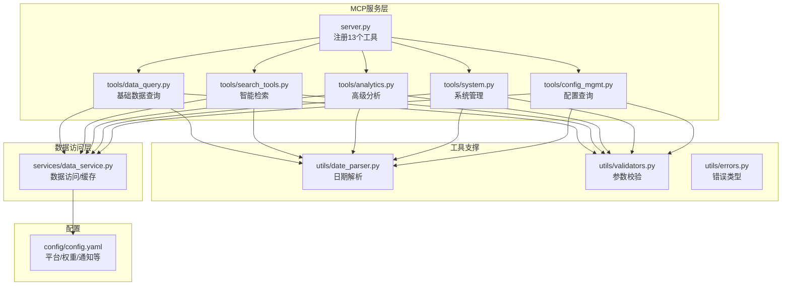
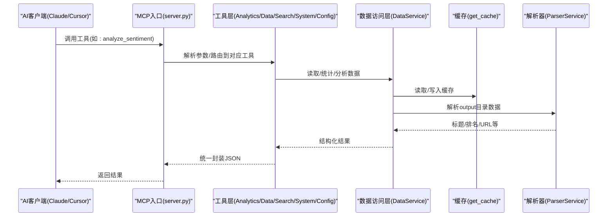
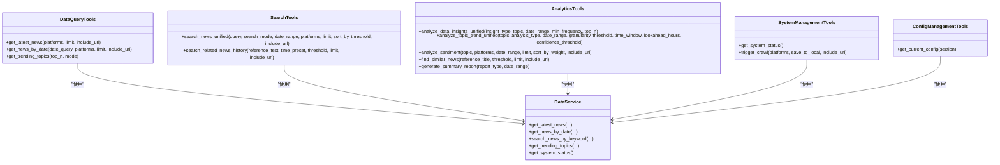
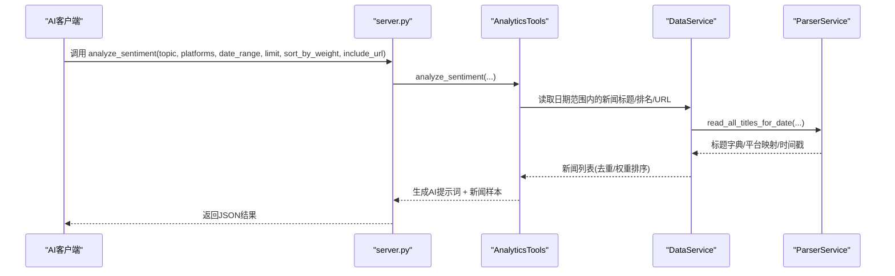
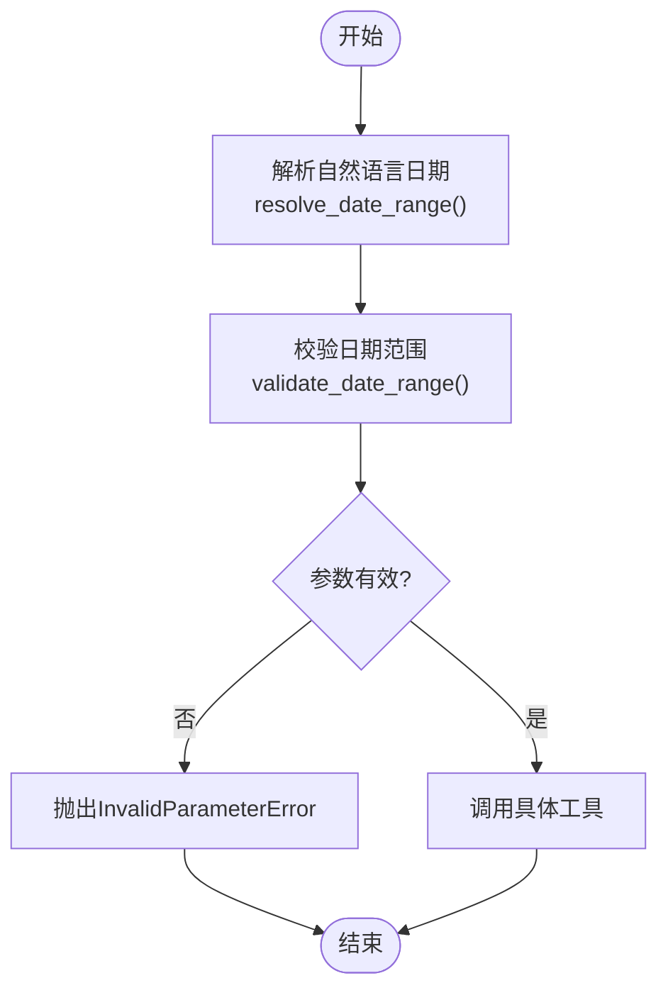

# AI智能分析

<cite>
**本文引用的文件**
- [mcp_server/server.py](file://mcp_server/server.py)
- [mcp_server/__init__.py](file://mcp_server/__init__.py)
- [mcp_server/tools/analytics.py](file://mcp_server/tools/analytics.py)
- [mcp_server/tools/data_query.py](file://mcp_server/tools/data_query.py)
- [mcp_server/tools/search_tools.py](file://mcp_server/tools/search_tools.py)
- [mcp_server/tools/system.py](file://mcp_server/tools/system.py)
- [mcp_server/tools/config_mgmt.py](file://mcp_server/tools/config_mgmt.py)
- [mcp_server/utils/date_parser.py](file://mcp_server/utils/date_parser.py)
- [mcp_server/utils/validators.py](file://mcp_server/utils/validators.py)
- [mcp_server/utils/errors.py](file://mcp_server/utils/errors.py)
- [mcp_server/services/data_service.py](file://mcp_server/services/data_service.py)
- [config/config.yaml](file://config/config.yaml)
- [docs/MCP-API-Reference.md](file://docs/MCP-API-Reference.md)
- [README.md](file://README.md)
</cite>

## 目录
1. [简介](#简介)
2. [项目结构](#项目结构)
3. [核心组件](#核心组件)
4. [架构总览](#架构总览)
5. [详细组件分析](#详细组件分析)
6. [依赖关系分析](#依赖关系分析)
7. [性能考量](#性能考量)
8. [故障排查指南](#故障排查指南)
9. [结论](#结论)
10. [附录](#附录)

## 简介
本文件面向希望基于MCP协议实现“自然语言对话式数据分析”的开发者与使用者，系统阐述TrendRadar的AI智能分析能力。mcp_server/server.py作为AI分析入口，提供13个分析工具，覆盖基础数据查询、智能检索、高级趋势与洞察分析、情感分析、相似新闻查找、摘要生成、系统状态与配置查询、以及手动触发爬取等能力。通过mcp_server/tools目录下的工具模块，系统将自然语言查询转化为结构化数据请求，并结合缓存与权重算法，为Claude、Cursor等AI客户端提供稳定、可扩展的分析服务。

## 项目结构
- mcp_server：MCP分析服务核心
  - server.py：MCP工具注册与入口，暴露13个分析工具
  - tools：工具层，按功能拆分为数据查询、分析、检索、系统与配置管理
  - utils：日期解析、参数校验、错误类型
  - services：数据访问层，封装数据读取、缓存与解析
- config：系统配置（平台、权重、通知等）
- docs：MCP API参考文档
- README：项目总体介绍与AI分析能力说明

图表来源
- [mcp_server/server.py](file://mcp_server/server.py#L1-L120)
- [mcp_server/tools/data_query.py](file://mcp_server/tools/data_query.py#L1-L60)
- [mcp_server/tools/search_tools.py](file://mcp_server/tools/search_tools.py#L1-L60)
- [mcp_server/tools/analytics.py](file://mcp_server/tools/analytics.py#L1-L60)
- [mcp_server/tools/system.py](file://mcp_server/tools/system.py#L1-L60)
- [mcp_server/tools/config_mgmt.py](file://mcp_server/tools/config_mgmt.py#L1-L40)
- [mcp_server/utils/date_parser.py](file://mcp_server/utils/date_parser.py#L1-L60)
- [mcp_server/utils/validators.py](file://mcp_server/utils/validators.py#L1-L60)
- [mcp_server/utils/errors.py](file://mcp_server/utils/errors.py#L1-L40)
- [mcp_server/services/data_service.py](file://mcp_server/services/data_service.py#L1-L60)
- [config/config.yaml](file://config/config.yaml#L110-L140)

章节来源
- [mcp_server/server.py](file://mcp_server/server.py#L1-L120)
- [README.md](file://README.md#L330-L347)

## 核心组件
- MCP入口与工具注册
  - server.py通过FastMCP装饰器注册13个工具，统一对外提供MCP接口；工具间通过_get_tools单例获取DataQueryTools、AnalyticsTools、SearchTools、ConfigManagementTools、SystemManagementTools实例。
- 工具层
  - data_query：提供最新新闻、按日期查询、关注词趋势等基础查询工具
  - search_tools：提供统一搜索、历史相关检索、模糊/实体/关键词模式
  - analytics：提供话题趋势、平台对比、关键词共现、情感分析、相似新闻、摘要生成等高级分析
  - system：系统状态查询、手动触发爬取
  - config_mgmt：按节查询系统配置
- 支撑层
  - date_parser：将自然语言日期解析为标准日期范围
  - validators：统一参数校验（平台、limit、date_range、keyword、mode、config_section等）
  - errors：统一错误类型（MCPError、DataNotFoundError、InvalidParameterError、ConfigurationError、PlatformNotSupportedError、CrawlTaskError、FileParseError）
- 数据访问层
  - data_service：封装读取、缓存、可用日期范围、系统状态等

章节来源
- [mcp_server/server.py](file://mcp_server/server.py#L22-L78)
- [mcp_server/tools/data_query.py](file://mcp_server/tools/data_query.py#L22-L40)
- [mcp_server/tools/search_tools.py](file://mcp_server/tools/search_tools.py#L18-L40)
- [mcp_server/tools/analytics.py](file://mcp_server/tools/analytics.py#L77-L90)
- [mcp_server/tools/system.py](file://mcp_server/tools/system.py#L15-L33)
- [mcp_server/tools/config_mgmt.py](file://mcp_server/tools/config_mgmt.py#L14-L26)
- [mcp_server/utils/date_parser.py](file://mcp_server/utils/date_parser.py#L14-L40)
- [mcp_server/utils/validators.py](file://mcp_server/utils/validators.py#L16-L41)
- [mcp_server/utils/errors.py](file://mcp_server/utils/errors.py#L10-L40)
- [mcp_server/services/data_service.py](file://mcp_server/services/data_service.py#L17-L30)

## 架构总览
MCP服务采用“工具层-支撑层-数据访问层”三层结构，工具层负责业务语义，支撑层负责参数与日期解析，数据访问层负责数据读取与缓存。server.py作为统一入口，将自然语言查询转化为结构化工具调用，并返回JSON结果。

图表来源
- [mcp_server/server.py](file://mcp_server/server.py#L111-L222)
- [mcp_server/tools/analytics.py](file://mcp_server/tools/analytics.py#L631-L799)
- [mcp_server/tools/data_query.py](file://mcp_server/tools/data_query.py#L34-L88)
- [mcp_server/tools/search_tools.py](file://mcp_server/tools/search_tools.py#L38-L110)
- [mcp_server/tools/system.py](file://mcp_server/tools/system.py#L68-L120)
- [mcp_server/tools/config_mgmt.py](file://mcp_server/tools/config_mgmt.py#L26-L59)
- [mcp_server/services/data_service.py](file://mcp_server/services/data_service.py#L30-L60)

## 详细组件分析

### 13个分析工具概览与职责
- 基础数据查询
  - get_latest_news：获取最新一批新闻，支持平台过滤、limit限制、URL包含
  - get_news_by_date：按日期查询新闻，支持自然语言日期解析
  - get_trending_topics：基于关注词列表统计出现频率
- 智能检索
  - search_news_unified：统一搜索，支持keyword/fuzzy/entity模式、排序、阈值、日期范围
  - search_related_news_history：基于种子新闻在历史数据中检索相关新闻
- 高级分析
  - analyze_topic_trend_unified：话题趋势分析（trend/lifecycle/viral/predict）
  - analyze_data_insights_unified：平台对比/活跃度/关键词共现
  - analyze_sentiment：情感倾向分析，生成AI提示词
  - find_similar_news：基于标题相似度查找相似新闻
  - generate_summary_report：每日/每周摘要生成
- 系统与配置
  - get_current_config：按节查询系统配置
  - get_system_status：系统运行状态与健康检查
  - trigger_crawl：手动触发爬取（可选保存到本地）

章节来源
- [mcp_server/server.py](file://mcp_server/server.py#L111-L782)
- [docs/MCP-API-Reference.md](file://docs/MCP-API-Reference.md#L1-L120)

### 工具类关系图

图表来源
- [mcp_server/tools/data_query.py](file://mcp_server/tools/data_query.py#L22-L40)
- [mcp_server/tools/search_tools.py](file://mcp_server/tools/search_tools.py#L18-L40)
- [mcp_server/tools/analytics.py](file://mcp_server/tools/analytics.py#L77-L90)
- [mcp_server/tools/system.py](file://mcp_server/tools/system.py#L15-L33)
- [mcp_server/tools/config_mgmt.py](file://mcp_server/tools/config_mgmt.py#L14-L26)
- [mcp_server/services/data_service.py](file://mcp_server/services/data_service.py#L17-L30)

### 工具调用序列图（以情感分析为例）

图表来源
- [mcp_server/server.py](file://mcp_server/server.py#L334-L396)
- [mcp_server/tools/analytics.py](file://mcp_server/tools/analytics.py#L631-L799)
- [mcp_server/services/data_service.py](file://mcp_server/services/data_service.py#L104-L182)

### 日期解析与参数校验流程

图表来源
- [mcp_server/server.py](file://mcp_server/server.py#L40-L110)
- [mcp_server/utils/date_parser.py](file://mcp_server/utils/date_parser.py#L330-L424)
- [mcp_server/utils/validators.py](file://mcp_server/utils/validators.py#L145-L210)

## 依赖关系分析
- 工具与服务
  - 所有工具类均依赖DataService进行数据读取与缓存；部分工具依赖ParserService解析output目录数据
- 工具与支撑
  - 工具层广泛使用validators进行参数校验，date_parser进行日期解析，errors提供统一错误类型
- 配置与平台
  - config/config.yaml提供平台列表、权重、通知等配置；validators动态读取平台列表并进行校验
- 传输与启动
  - server.py支持stdio与http两种传输模式，提供工具清单与启动信息打印

章节来源
- [mcp_server/server.py](file://mcp_server/server.py#L660-L782)
- [mcp_server/utils/validators.py](file://mcp_server/utils/validators.py#L16-L41)
- [config/config.yaml](file://config/config.yaml#L110-L140)

## 性能考量
- 缓存策略
  - data_service对最新新闻、按日期查询、趋势话题、系统状态等结果进行缓存，减少重复读取
- 排序与限制
  - 分析工具默认按权重排序，limit参数限制返回规模，避免大流量冲击
- 搜索优化
  - 模糊搜索支持阈值过滤，减少低相关度结果
- 平台与日期范围
  - 通过平台白名单与日期范围限制，避免跨平台全量扫描

章节来源
- [mcp_server/services/data_service.py](file://mcp_server/services/data_service.py#L30-L102)
- [mcp_server/tools/search_tools.py](file://mcp_server/tools/search_tools.py#L187-L240)
- [mcp_server/utils/validators.py](file://mcp_server/utils/validators.py#L90-L121)

## 故障排查指南
- 常见错误类型
  - INVALID_PARAMETER：参数格式/范围不合法
  - DATA_NOT_FOUND：未找到匹配数据或无可用数据
  - INTERNAL_ERROR：内部异常
  - CRAWL_TASK_ERROR：爬取任务异常
- 排查要点
  - 检查日期范围是否在未来或过远
  - 检查平台ID是否在config.yaml中配置
  - 检查output目录是否存在可用数据
  - 检查网络与代理配置（爬取时）

章节来源
- [mcp_server/utils/errors.py](file://mcp_server/utils/errors.py#L10-L94)
- [mcp_server/utils/validators.py](file://mcp_server/utils/validators.py#L145-L210)
- [mcp_server/services/data_service.py](file://mcp_server/services/data_service.py#L498-L605)

## 结论
TrendRadar的MCP分析服务以server.py为核心入口，通过工具层与数据访问层的清晰分工，提供了覆盖基础查询、智能检索、高级分析与系统管理的完整能力矩阵。配合自然语言日期解析与严格的参数校验，系统能够稳定地为Claude、Cursor等AI客户端提供高质量的对话式数据分析体验。建议在生产环境中优先使用HTTP传输模式，并结合缓存与limit策略优化性能。

## 附录

### 使用示例（自然语言到热点趋势洞察）
- 步骤
  1) 使用resolve_date_range将“本周/最近7天”等自然语言解析为标准日期范围
  2) 调用analyze_topic_trend_unified进行趋势分析（trend/lifecycle/viral/predict）
  3) 如需对比平台，调用analyze_data_insights_unified进行平台对比/活跃度/关键词共现
  4) 如需情感分析，调用analyze_sentiment生成AI提示词
- 参考调用链
  - resolve_date_range → analyze_topic_trend_unified
  - resolve_date_range → analyze_sentiment
  - search_news_unified → find_similar_news

章节来源
- [mcp_server/server.py](file://mcp_server/server.py#L40-L110)
- [mcp_server/server.py](file://mcp_server/server.py#L224-L396)
- [docs/MCP-API-Reference.md](file://docs/MCP-API-Reference.md#L149-L225)

### MCP API参考
- 工具清单与参数说明、错误格式、性能建议、示例客户端调用均可在MCP API参考文档中查阅。

章节来源
- [docs/MCP-API-Reference.md](file://docs/MCP-API-Reference.md#L1-L120)
- [docs/MCP-API-Reference.md](file://docs/MCP-API-Reference.md#L384-L475)