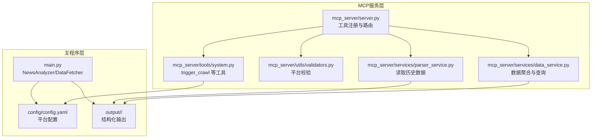
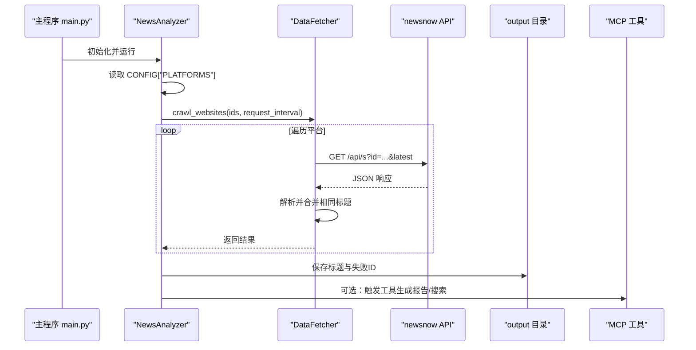
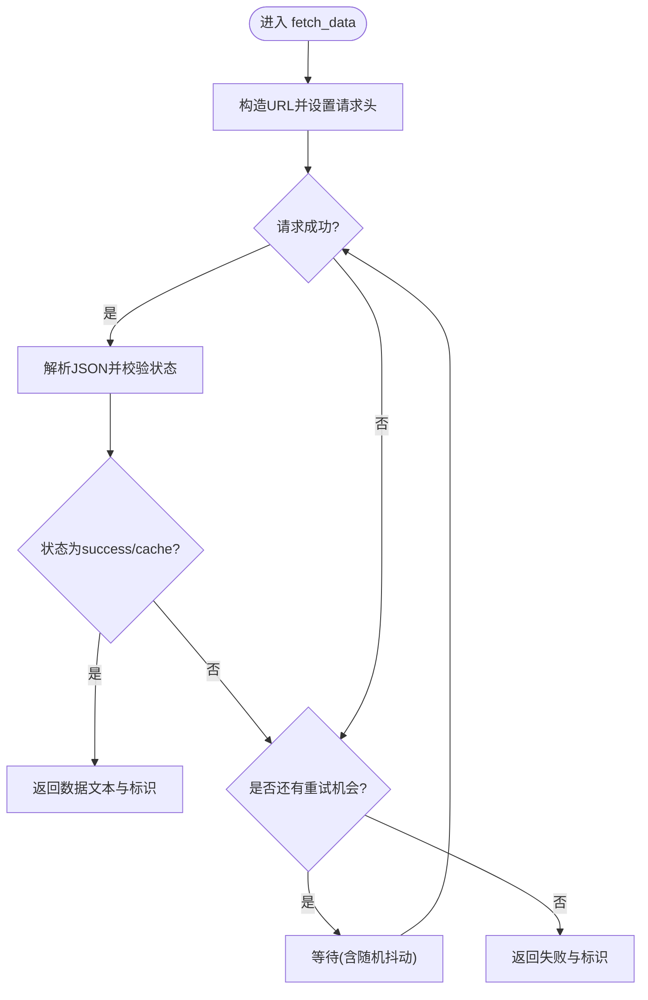
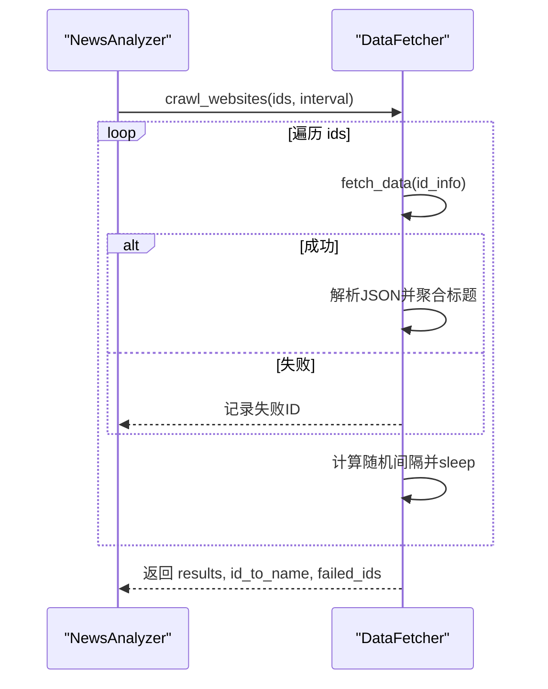
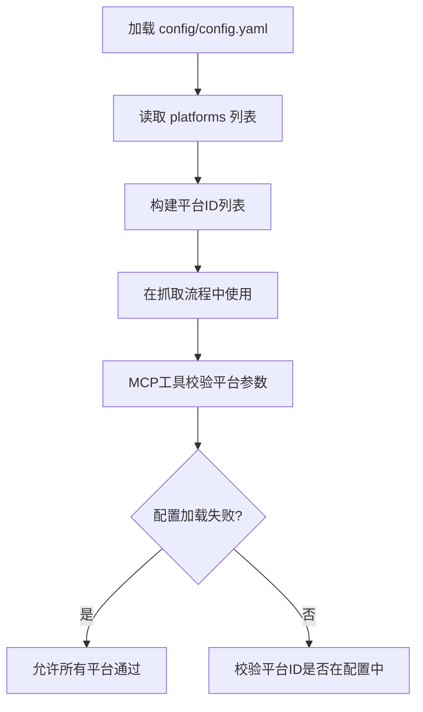
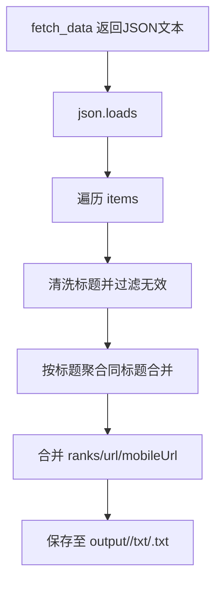
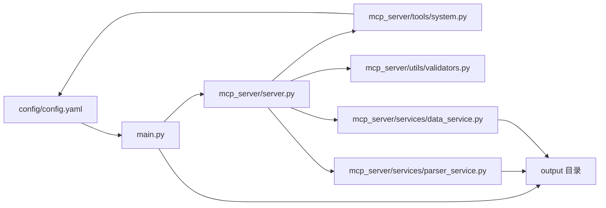

# 全网热点聚合

<cite>
**本文引用的文件**
- [main.py](file://main.py)
- [config/config.yaml](file://config/config.yaml)
- [mcp_server/server.py](file://mcp_server/server.py)
- [mcp_server/tools/system.py](file://mcp_server/tools/system.py)
- [mcp_server/utils/validators.py](file://mcp_server/utils/validators.py)
- [mcp_server/services/parser_service.py](file://mcp_server/services/parser_service.py)
- [mcp_server/services/data_service.py](file://mcp_server/services/data_service.py)
- [README.md](file://README.md)
</cite>

## 目录
1. [简介](#简介)
2. [项目结构](#项目结构)
3. [核心组件](#核心组件)
4. [架构总览](#架构总览)
5. [详细组件分析](#详细组件分析)
6. [依赖关系分析](#依赖关系分析)
7. [性能考量](#性能考量)
8. [故障排查指南](#故障排查指南)
9. [结论](#结论)
10. [附录](#附录)

## 简介
本项目提供“全网热点聚合”能力，从知乎、微博、抖音、百度热搜、今日头条等13个平台统一抓取热搜数据，经过统一解析与结构化存储，支持按日/当前榜单/增量模式生成报告，并可将结果推送到多种通知渠道。本文档围绕以下目标展开：
- DataFetcher 类如何通过统一API接口获取各平台数据，并处理网络请求重试机制
- 结合 config.yaml 中的 platforms 配置，说明如何添加或移除监控平台
- 通过 main.py 中的 crawl_websites 方法，说明数据采集的流程控制与请求间隔策略
- 展示数据解析与结构化存储过程的实际代码示例路径

## 项目结构
项目采用“主程序 + MCP 服务”的双层架构：
- 主程序层：负责定时抓取、解析、存储、报告生成与通知
- MCP 服务层：提供统一工具接口，支持外部系统调用（如搜索、分析、触发爬取等）

图表来源
- [main.py](file://main.py#L5235-L5431)
- [config/config.yaml](file://config/config.yaml#L116-L140)
- [mcp_server/server.py](file://mcp_server/server.py#L111-L174)
- [mcp_server/tools/system.py](file://mcp_server/tools/system.py#L68-L111)
- [mcp_server/utils/validators.py](file://mcp_server/utils/validators.py#L47-L77)
- [mcp_server/services/parser_service.py](file://mcp_server/services/parser_service.py#L168-L198)
- [mcp_server/services/data_service.py](file://mcp_server/services/data_service.py#L226-L254)

章节来源
- [main.py](file://main.py#L5235-L5431)
- [config/config.yaml](file://config/config.yaml#L116-L140)
- [mcp_server/server.py](file://mcp_server/server.py#L111-L174)

## 核心组件
- DataFetcher：封装统一API请求、重试与数据解析
- NewsAnalyzer：编排抓取、解析、存储、报告与通知
- 配置系统：通过 config.yaml 的 platforms 字段控制监控平台集合
- MCP 工具：提供 trigger_crawl 等工具，支持外部触发与平台校验

章节来源
- [main.py](file://main.py#L616-L740)
- [main.py](file://main.py#L5235-L5431)
- [config/config.yaml](file://config/config.yaml#L116-L140)
- [mcp_server/server.py](file://mcp_server/server.py#L626-L658)
- [mcp_server/tools/system.py](file://mcp_server/tools/system.py#L68-L111)
- [mcp_server/utils/validators.py](file://mcp_server/utils/validators.py#L47-L77)

## 架构总览
整体流程：配置加载 → 平台枚举 → DataFetcher 抓取 → 结构化存储 → 报告生成 → 通知推送

图表来源
- [main.py](file://main.py#L5256-L5278)
- [main.py](file://main.py#L683-L739)
- [main.py](file://main.py#L742-L790)
- [mcp_server/server.py](file://mcp_server/server.py#L626-L658)

## 详细组件分析

### DataFetcher：统一API抓取与重试
- 统一API：通过 https://newsnow.busiyi.world/api/s?id=<platform>&latest 获取数据
- 重试策略：支持最大重试次数、最小/最大等待时间，每次重试加入随机抖动
- 错误处理：对响应状态进行校验；JSON解析失败或处理异常时记录失败ID
- 结果结构：将相同标题按平台聚合，记录 ranks/url/mobileUrl

图表来源
- [main.py](file://main.py#L623-L682)

章节来源
- [main.py](file://main.py#L623-L682)

### crawl_websites：采集流程控制与请求间隔
- 输入：平台ID列表（支持(id,name)二元组）
- 流程：逐个调用 fetch_data；解析响应并聚合相同标题；记录失败ID
- 请求间隔：在相邻请求间插入随机抖动，确保总间隔在合理范围内
- 输出：results/id_to_name/failed_ids

图表来源
- [main.py](file://main.py#L683-L739)

章节来源
- [main.py](file://main.py#L683-L739)

### 配置与平台管理：platforms 配置
- platforms 列表决定监控平台集合，每个元素包含 id 与 name
- 支持添加/移除平台：直接在 config.yaml 中增删对应项
- MCP 层对平台参数进行校验，若未加载配置则允许所有平台通过（降级策略）

图表来源
- [config/config.yaml](file://config/config.yaml#L116-L140)
- [mcp_server/utils/validators.py](file://mcp_server/utils/validators.py#L47-L77)
- [mcp_server/tools/system.py](file://mcp_server/tools/system.py#L98-L111)

章节来源
- [config/config.yaml](file://config/config.yaml#L116-L140)
- [mcp_server/utils/validators.py](file://mcp_server/utils/validators.py#L47-L77)
- [mcp_server/tools/system.py](file://mcp_server/tools/system.py#L98-L111)

### 数据解析与结构化存储
- 解析：从统一API响应中提取 items，过滤无效标题
- 聚合：相同标题按平台合并，记录 ranks/url/mobileUrl
- 存储：将结果写入 output/<date>/txt/<time>.txt，包含失败ID清单

图表来源
- [main.py](file://main.py#L683-L739)
- [main.py](file://main.py#L742-L790)

章节来源
- [main.py](file://main.py#L683-L739)
- [main.py](file://main.py#L742-L790)

### 报告生成与通知
- 报告模式：daily/current/incremental
- 通知渠道：飞书、钉钉、企业微信、Telegram、邮件、ntfy、Bark、Slack
- 推送窗口：可配置时间范围与每日仅推送一次

章节来源
- [main.py](file://main.py#L162-L259)
- [main.py](file://main.py#L5110-L5160)

## 依赖关系分析
- 主程序依赖配置系统与通知系统
- MCP 服务依赖解析与数据服务，提供统一工具接口
- 平台校验在 MCP 层实现，保证工具调用的安全性

图表来源
- [config/config.yaml](file://config/config.yaml#L116-L140)
- [main.py](file://main.py#L5235-L5431)
- [mcp_server/server.py](file://mcp_server/server.py#L111-L174)
- [mcp_server/tools/system.py](file://mcp_server/tools/system.py#L68-L111)
- [mcp_server/utils/validators.py](file://mcp_server/utils/validators.py#L47-L77)
- [mcp_server/services/parser_service.py](file://mcp_server/services/parser_service.py#L168-L198)
- [mcp_server/services/data_service.py](file://mcp_server/services/data_service.py#L226-L254)

章节来源
- [config/config.yaml](file://config/config.yaml#L116-L140)
- [main.py](file://main.py#L5235-L5431)
- [mcp_server/server.py](file://mcp_server/server.py#L111-L174)
- [mcp_server/tools/system.py](file://mcp_server/tools/system.py#L68-L111)
- [mcp_server/utils/validators.py](file://mcp_server/utils/validators.py#L47-L77)
- [mcp_server/services/parser_service.py](file://mcp_server/services/parser_service.py#L168-L198)
- [mcp_server/services/data_service.py](file://mcp_server/services/data_service.py#L226-L254)

## 性能考量
- 请求间隔：crawl_websites 在相邻请求间插入随机抖动，避免被限流
- 重试策略：指数退避+抖动，降低并发压力
- 缓存：MCP 读取历史数据时对今日/历史采用不同TTL，减少IO
- 存储：按日期与时间分目录，便于归档与检索

章节来源
- [main.py](file://main.py#L733-L739)
- [mcp_server/services/parser_service.py](file://mcp_server/services/parser_service.py#L181-L194)

## 故障排查指南
- 配置文件缺失：主程序在启动时会检查配置文件是否存在
- 平台校验失败：MCP 层对平台参数进行校验，若配置加载失败则允许所有平台通过
- 网络异常：DataFetcher 的重试机制会自动补偿；如持续失败，检查代理与网络连通性
- 输出路径：确保 output 目录可写，日期/时间子目录会自动创建

章节来源
- [main.py](file://main.py#L5415-L5431)
- [mcp_server/utils/validators.py](file://mcp_server/utils/validators.py#L47-L77)
- [main.py](file://main.py#L742-L790)

## 结论
本项目通过统一API与可配置平台列表，实现了跨平台热点数据的采集、解析与存储；配合灵活的报告模式与通知策略，满足日常监控与实时追踪需求。MCP 服务进一步增强了系统的可扩展性与外部集成能力。

## 附录

### 添加/移除监控平台的操作指引
- 在 config/config.yaml 的 platforms 列表中添加或删除平台项
- 重启主程序或通过 MCP 工具 trigger_crawl 触发新的抓取任务
- 如需外部系统调用，可通过 MCP 工具传入 platforms 参数进行定向抓取

章节来源
- [config/config.yaml](file://config/config.yaml#L116-L140)
- [mcp_server/server.py](file://mcp_server/server.py#L626-L658)
- [mcp_server/tools/system.py](file://mcp_server/tools/system.py#L68-L111)

### 代码示例路径（不展示具体代码，仅提供定位）
- DataFetcher.fetch_data 重试与状态校验
  - [main.py](file://main.py#L623-L682)
- DataFetcher.crawl_websites 请求间隔与聚合逻辑
  - [main.py](file://main.py#L683-L739)
- 结构化存储与失败ID记录
  - [main.py](file://main.py#L742-L790)
- 平台配置与校验
  - [config/config.yaml](file://config/config.yaml#L116-L140)
  - [mcp_server/utils/validators.py](file://mcp_server/utils/validators.py#L47-L77)
- MCP 触发爬取与平台参数校验
  - [mcp_server/server.py](file://mcp_server/server.py#L626-L658)
  - [mcp_server/tools/system.py](file://mcp_server/tools/system.py#L98-L111)
- 历史数据读取与缓存
  - [mcp_server/services/parser_service.py](file://mcp_server/services/parser_service.py#L168-L198)
- 数据聚合与关键词匹配
  - [mcp_server/services/data_service.py](file://mcp_server/services/data_service.py#L226-L254)