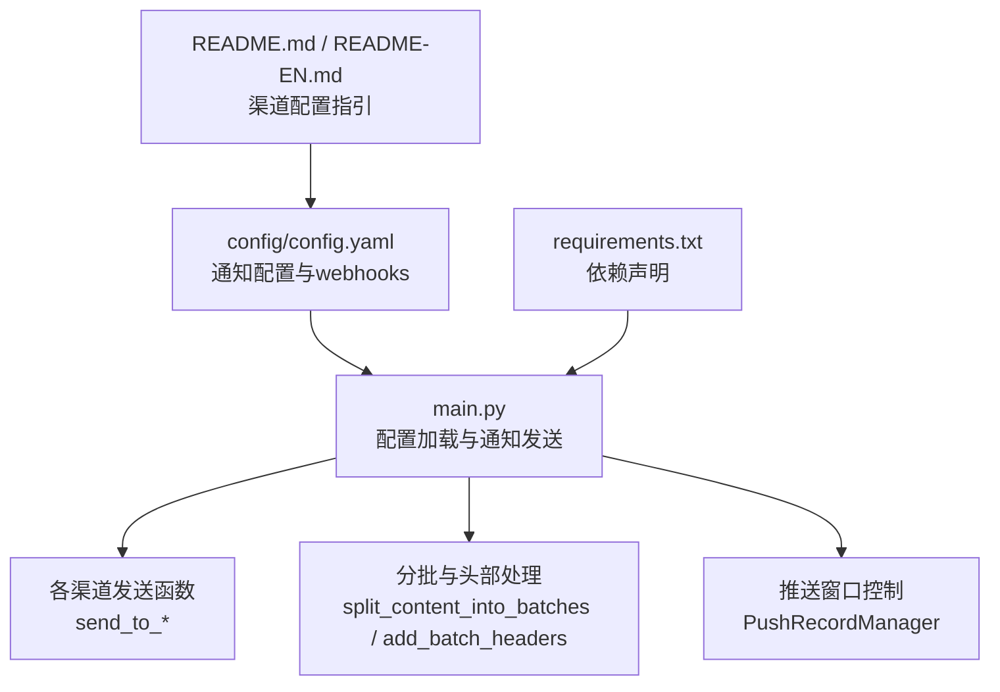
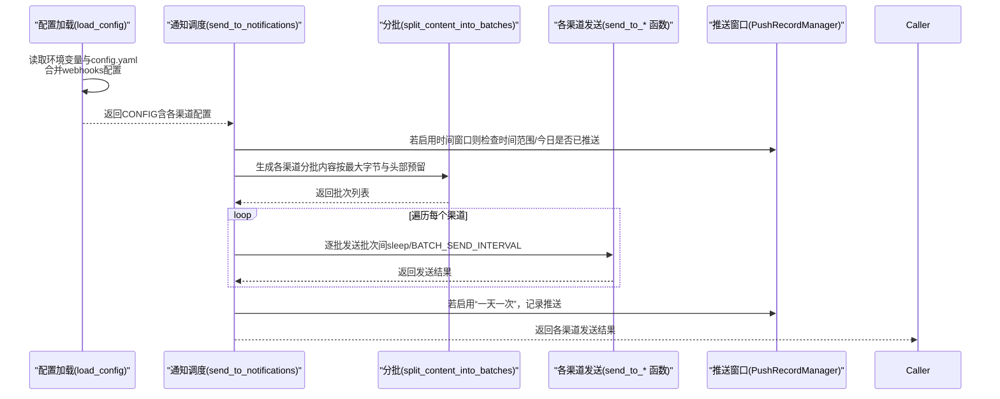
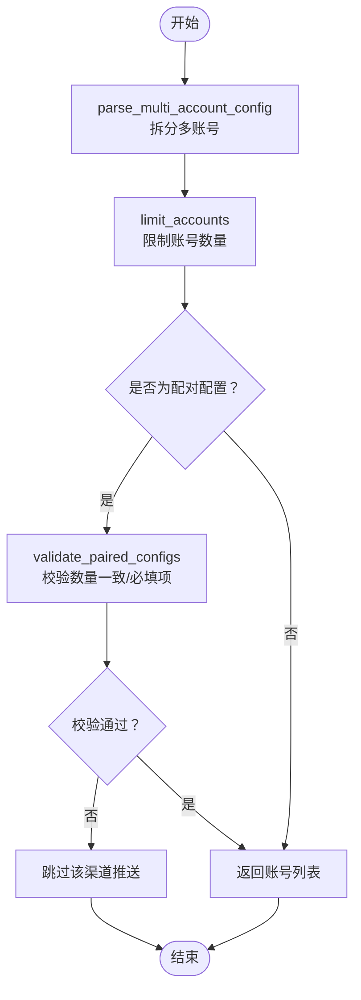
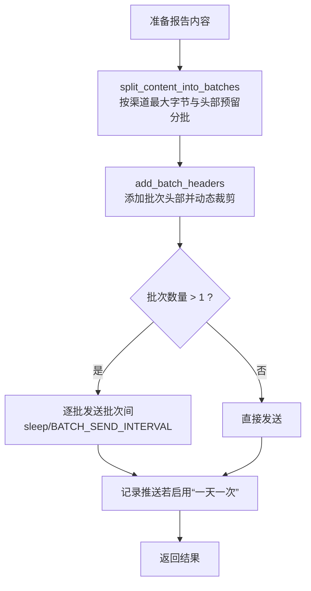
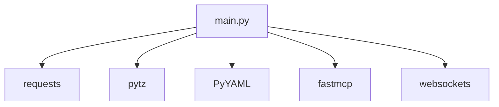

# 多渠道实时通知

<cite>
**本文引用的文件**
- [config/config.yaml](file://config/config.yaml)
- [main.py](file://main.py)
- [README.md](file://README.md)
- [README-EN.md](file://README-EN.md)
- [requirements.txt](file://requirements.txt)
</cite>

## 目录
1. [简介](#简介)
2. [项目结构](#项目结构)
3. [核心组件](#核心组件)
4. [架构总览](#架构总览)
5. [详细组件分析](#详细组件分析)
6. [依赖关系分析](#依赖关系分析)
7. [性能考量](#性能考量)
8. [故障排查指南](#故障排查指南)
9. [结论](#结论)
10. [附录](#附录)

## 简介
本文件面向希望在 TrendRadar 中启用多渠道实时通知的用户与开发者，系统性说明如何配置与使用企业微信、飞书、钉钉、Telegram、邮件、ntfy、Bark、Slack 等 10+ 通知渠道；深入解析 parse_multi_account_config 与 validate_paired_configs 的多账号与配对校验机制；结合 config.yaml 中的 webhooks 配置，给出各渠道的配置要点；并通过 main.py 中的通知发送流程，解释消息分批策略与发送间隔控制；最后强调安全警告，说明为何不应在配置文件中直接填写敏感信息。

## 项目结构
- 配置文件位于 config/config.yaml，包含通知开关、分批大小、发送间隔、时间窗口、webhooks 等关键配置。
- 主程序入口 main.py 实现了通知配置加载、多账号解析与校验、消息分批与发送、各渠道适配与错误处理。
- README.md 与 README-EN.md 提供 GitHub Secrets 配置指引与多账号推送说明。
- requirements.txt 列出运行通知功能所需的外部依赖。

图表来源
- [config/config.yaml](file://config/config.yaml#L34-L110)
- [main.py](file://main.py#L162-L395)
- [README.md](file://README.md#L846-L1522)
- [README-EN.md](file://README-EN.md#L809-L1422)
- [requirements.txt](file://requirements.txt#L1-L6)

章节来源
- [config/config.yaml](file://config/config.yaml#L34-L110)
- [main.py](file://main.py#L162-L395)
- [README.md](file://README.md#L846-L1522)
- [README-EN.md](file://README-EN.md#L809-L1422)
- [requirements.txt](file://requirements.txt#L1-L6)

## 核心组件
- 多账号解析与校验
  - parse_multi_account_config：将分号分隔的多账号字符串拆分为列表，保留空串占位，便于后续按索引一一对应。
  - validate_paired_configs：校验配对配置（如 Telegram 的 token 与 chat_id、ntfy 的 topic 与 token）数量一致，必要项是否齐全。
  - limit_accounts：限制每个渠道最多账号数，避免过度推送导致资源占用或风险。
  - get_account_at_index：安全获取指定索引的账号值，支持默认值与越界保护。
- 配置加载与来源优先级
  - load_config：从环境变量与 config.yaml 的 webhooks 中合并配置，优先使用环境变量；输出各渠道配置来源与账号数量。
- 通知发送主流程
  - send_to_notifications：统一调度各渠道发送，支持多账号循环发送；在启用推送窗口时进行时间窗口与“一天一次”控制；成功后记录推送记录。
- 分批策略与发送间隔
  - split_content_into_batches：按渠道最大字节限制与批次头部预留空间，保证词组标题+第一条新闻的原子性，避免截断破坏语义。
  - add_batch_headers：为每批内容添加批次头部，并动态计算允许内容大小，防止超限。
  - BATCH_SEND_INTERVAL：批次间通用发送间隔；部分渠道（如 Slack）在批次间显式 sleep。
- 各渠道适配
  - send_to_feishu、send_to_dingtalk、send_to_wework、send_to_telegram、send_to_email、send_to_ntfy、send_to_bark、send_to_slack：针对不同平台的消息格式、大小限制、分批策略与错误处理进行适配。

章节来源
- [main.py](file://main.py#L59-L159)
- [main.py](file://main.py#L162-L395)
- [main.py](file://main.py#L3800-L3987)
- [main.py](file://main.py#L3263-L3798)
- [main.py](file://main.py#L3990-L4874)

## 架构总览
下图展示了从配置加载到各渠道发送的整体流程，包括多账号解析、配对校验、分批与头部处理、发送间隔控制以及推送窗口控制。

图表来源
- [main.py](file://main.py#L162-L395)
- [main.py](file://main.py#L3800-L3987)
- [main.py](file://main.py#L3263-L3798)
- [main.py](file://main.py#L3990-L4874)

## 详细组件分析

### 多账号与配对校验
- parse_multi_account_config
  - 功能：将分号分隔的多账号字符串拆分为列表，保留空串占位，便于“占位”场景（如第一个账号为空）。
  - 复杂度：O(n)，n 为配置字符串长度。
- validate_paired_configs
  - 功能：过滤空列表后，若存在非空配置，检查必填项是否存在；随后比较各配置的长度集合，若长度不一致则打印错误并返回失败。
  - 复杂度：O(k)，k 为配对配置项数量。
- limit_accounts
  - 功能：限制账号数量，超过上限时截断并打印警告。
- get_account_at_index
  - 功能：安全获取指定索引的账号值，支持默认值与越界保护。

图表来源
- [main.py](file://main.py#L59-L159)

章节来源
- [main.py](file://main.py#L59-L159)

### 配置加载与来源优先级
- 优先级规则
  - 环境变量优先于 config.yaml 的 webhooks 字段。
  - 输出各渠道配置来源（环境变量/配置文件）与账号数量，便于调试。
- 关键配置项
  - enable_notification：是否启用通知。
  - message_batch_size、dingtalk_batch_size、feishu_batch_size、bark_batch_size、slack_batch_size：各渠道分批大小（字节）。
  - batch_send_interval：批次发送间隔（秒）。
  - push_window：时间窗口控制（启用、起止时间、一天一次、记录保留天数）。
  - max_accounts_per_channel：每个渠道最大账号数。
  - webhooks：各渠道的 webhook/token/topic 等配置项。

章节来源
- [main.py](file://main.py#L162-L395)
- [config/config.yaml](file://config/config.yaml#L34-L110)

### 消息分批策略与发送间隔
- 分批策略
  - split_content_into_batches：按渠道最大字节限制与批次头部预留空间，保证“词组标题 + 至少第一条新闻”的原子性，避免截断破坏语义。
  - add_batch_headers：为每批内容添加批次头部，并动态计算允许内容大小，防止超限。
  - 不同渠道的批次大小与头部预留不同，例如 Telegram、Slack、Bark、ntfy、钉钉、飞书等。
- 发送间隔控制
  - BATCH_SEND_INTERVAL：全局批次间隔。
  - Slack：在批次间显式 sleep。
  - ntfy：公共服务器建议 2-3 秒，自托管可更短；且按反向顺序推送以保证客户端显示顺序正确。
  - Telegram：按正序推送，批次头部预留空间已考虑。
- 时间窗口控制
  - 若启用推送窗口，将在时间范围外跳过推送；若开启“一天一次”，则在当天已推送后跳过。

图表来源
- [main.py](file://main.py#L3263-L3798)
- [main.py](file://main.py#L3800-L3987)

章节来源
- [main.py](file://main.py#L3263-L3798)
- [main.py](file://main.py#L3800-L3987)

### 各渠道配置与发送流程

#### 飞书（Feishu）
- 配置项
  - feishu_url：多账号用分号分隔。
  - feishu_message_separator：消息分割线（仅飞书）。
- 发送特性
  - 支持分批发送，批次头部与分隔线按飞书格式处理。
  - 飞书批次大小默认来自配置，头部预留空间已考虑。

章节来源
- [config/config.yaml](file://config/config.yaml#L34-L110)
- [main.py](file://main.py#L3990-L4090)

#### 钉钉（DingTalk）
- 配置项
  - dingtalk_url：多账号用分号分隔。
- 发送特性
  - 支持分批发送，批次大小来自配置。

章节来源
- [config/config.yaml](file://config/config.yaml#L34-L110)
- [main.py](file://main.py#L4090-L4190)

#### 企业微信（WeWork）
- 配置项
  - wework_url：多账号用分号分隔。
  - wework_msg_type：消息类型，支持 markdown 与 text。
- 发送特性
  - 支持分批发送，按企业微信格式处理。

章节来源
- [config/config.yaml](file://config/config.yaml#L34-L110)
- [main.py](file://main.py#L4190-L4280)

#### Telegram
- 配置项
  - telegram_bot_token、telegram_chat_id：均为多账号，需一一对应。
- 发送特性
  - 需要 validate_paired_configs 校验 token 与 chat_id 数量一致。
  - 支持分批发送，HTML 解析模式。

章节来源
- [config/config.yaml](file://config/config.yaml#L34-L110)
- [main.py](file://main.py#L4288-L4360)
- [main.py](file://main.py#L3881-L3905)

#### 邮件（Email）
- 配置项
  - email_from、email_password、email_to：多收件人用逗号分隔。
  - email_smtp_server、email_smtp_port：可选，自动识别。
- 发送特性
  - 支持多收件人，自动识别 SMTP 配置。

章节来源
- [config/config.yaml](file://config/config.yaml#L34-L110)
- [main.py](file://main.py#L4364-L4490)

#### ntfy
- 配置项
  - ntfy_server_url：可选，自托管或公共服务。
  - ntfy_topic：多账号用分号分隔。
  - ntfy_token：可选，若提供则与 topic 数量一致。
- 发送特性
  - 支持分批发送，公共服务器建议 2-3 秒间隔；自托管可更短。
  - 按反向顺序推送以保证客户端显示顺序正确。

章节来源
- [config/config.yaml](file://config/config.yaml#L34-L110)
- [main.py](file://main.py#L4504-L4660)

#### Bark
- 配置项
  - bark_url：多账号用分号分隔。
- 发送特性
  - 支持分批发送，使用 markdown 格式；APNs 限制 4KB。

章节来源
- [config/config.yaml](file://config/config.yaml#L34-L110)
- [main.py](file://main.py#L4662-L4805)

#### Slack
- 配置项
  - slack_webhook_url：多账号用分号分隔。
- 发送特性
  - 支持分批发送，mrkdwn 格式；批次间 sleep。

章节来源
- [config/config.yaml](file://config/config.yaml#L34-L110)
- [main.py](file://main.py#L4807-L4874)

### 配置示例与最佳实践（基于 config.yaml 与 README）
- 多账号配置
  - 使用分号分隔多个账号值；Telegram 与 ntfy 需保证配对参数数量一致。
  - 每个渠道最多支持 max_accounts_per_channel 个账号（默认 3）。
- 安全建议
  - 不要在 config.yaml 中直接填写敏感信息；优先使用 GitHub Secrets 或 .env 文件。
  - README 提供了各渠道的 Secret 名称与配置步骤，严格遵循。

章节来源
- [config/config.yaml](file://config/config.yaml#L34-L110)
- [README.md](file://README.md#L846-L1522)
- [README-EN.md](file://README-EN.md#L809-L1422)

## 依赖关系分析
- 外部依赖
  - requests：HTTP 请求，用于各渠道发送。
  - pytz：时区与时钟。
  - PyYAML：解析 YAML 配置。
  - fastmcp、websockets：项目其他模块使用，与通知功能无直接耦合。
- 通知功能内部依赖
  - 配置加载依赖 YAML 解析与环境变量。
  - 分批策略依赖字节编码与字符串截断。
  - 各渠道发送依赖平台接口规范与错误处理。

图表来源
- [requirements.txt](file://requirements.txt#L1-L6)
- [main.py](file://main.py#L1-L25)

章节来源
- [requirements.txt](file://requirements.txt#L1-L6)
- [main.py](file://main.py#L1-L25)

## 性能考量
- 分批大小与头部预留
  - 不同渠道的最大字节限制不同，分批时需预留批次头部空间，避免超限。
- 发送间隔
  - BATCH_SEND_INTERVAL 为通用间隔；Slack 在批次间显式 sleep；ntfy 公共服务器建议 2-3 秒。
- 账号数量限制
  - 限制每个渠道最多账号数，避免过多账号导致运行时间过长与推送压力。
- 时间窗口控制
  - 启用“一天一次”可减少重复推送，降低资源消耗。

章节来源
- [main.py](file://main.py#L3263-L3798)
- [main.py](file://main.py#L3800-L3987)
- [config/config.yaml](file://config/config.yaml#L34-L110)

## 故障排查指南
- 配置错误
  - Telegram/ntfy 配对参数数量不一致：将打印错误并跳过该渠道推送。
  - 邮件配置缺少必需项（FROM/PASSWORD/TO）：将不触发邮件推送。
- 发送失败
  - Slack：返回非 "ok" 文本或状态码异常，打印错误并返回失败。
  - ntfy：公共服务器 429 速率限制时，等待后重试一次。
  - Bark/Telegram：检查 URL 格式与设备 key，确认消息大小未超过平台限制。
- 超时与网络
  - 所有发送函数均捕获连接超时、读取超时与连接错误，打印详细信息以便定位。
- 时间窗口
  - 若不在推送时间窗口内或当天已推送，将跳过推送；可通过记录文件排查。

章节来源
- [main.py](file://main.py#L3800-L3987)
- [main.py](file://main.py#L3990-L4874)

## 结论
本项目通过统一的配置加载、多账号解析与配对校验、精细化的分批策略与发送间隔控制，实现了对飞书、钉钉、企业微信、Telegram、邮件、ntfy、Bark、Slack 等多渠道的稳定通知能力。建议在生产环境中优先使用环境变量或 .env 管理敏感信息，并合理设置账号数量与时间窗口，以平衡推送效果与资源消耗。

## 附录
- 安全警告
  - 不要在 config.yaml 中直接填写敏感信息（Webhook、Token、密码等）。
  - GitHub Fork 用户请使用 GitHub Secrets，避免泄露。
- 多账号与配对配置示例
  - README 提供了各渠道的 Secret 名称与示例，严格遵循即可。

章节来源
- [config/config.yaml](file://config/config.yaml#L60-L110)
- [README.md](file://README.md#L846-L1522)
- [README-EN.md](file://README-EN.md#L809-L1422)