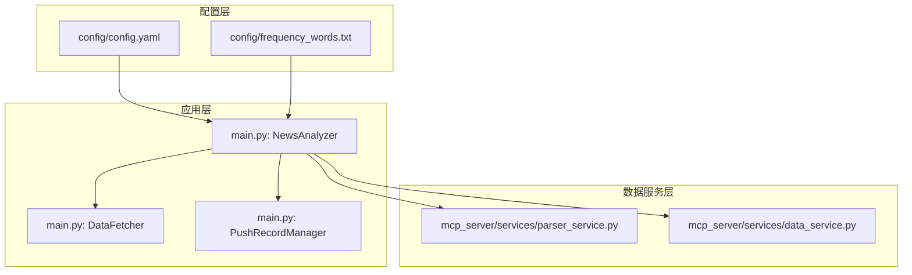
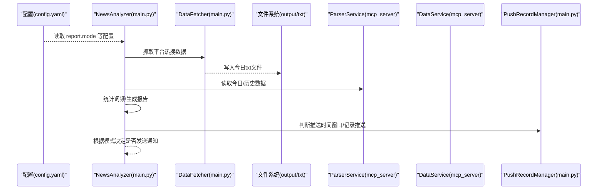
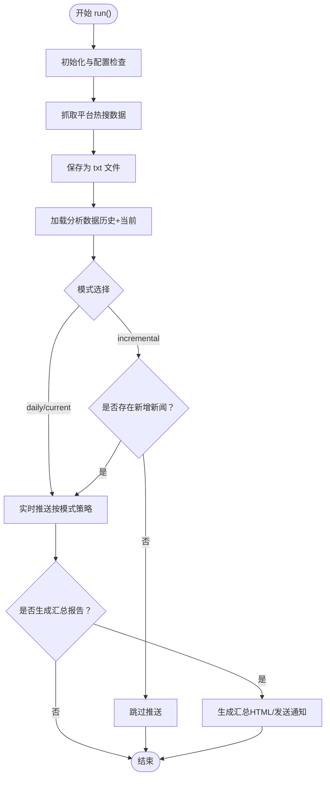
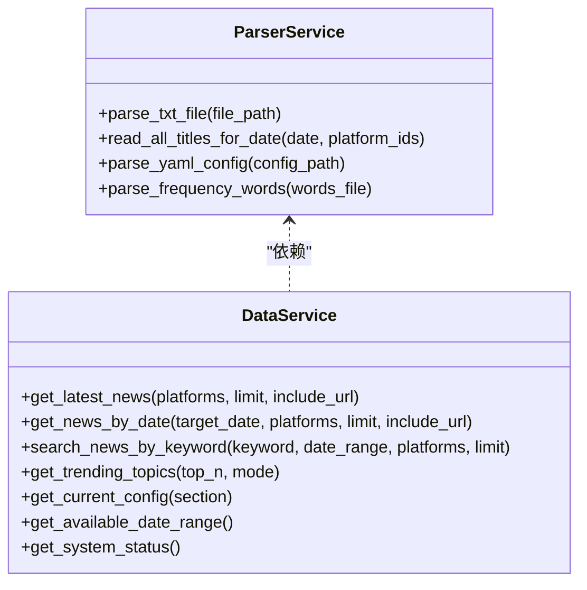
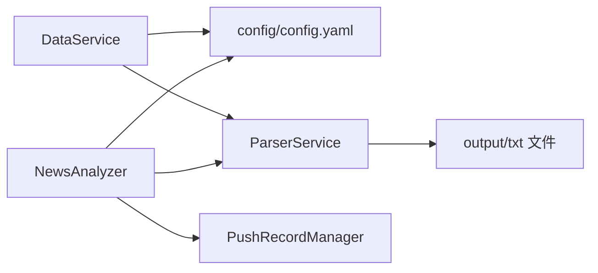

# 智能推送策略

<cite>
**本文引用的文件**
- [config/config.yaml](file://config/config.yaml)
- [main.py](file://main.py)
- [mcp_server/services/data_service.py](file://mcp_server/services/data_service.py)
- [mcp_server/services/parser_service.py](file://mcp_server/services/parser_service.py)
- [config/frequency_words.txt](file://config/frequency_words.txt)
</cite>

## 目录
1. [简介](#简介)
2. [项目结构](#项目结构)
3. [核心组件](#核心组件)
4. [架构总览](#架构总览)
5. [详细组件分析](#详细组件分析)
6. [依赖关系分析](#依赖关系分析)
7. [性能考量](#性能考量)
8. [故障排查指南](#故障排查指南)
9. [结论](#结论)
10. [附录](#附录)

## 简介
本文件围绕 TrendRadar 的“智能推送策略”展开，重点解释三种推送模式（当日汇总 daily、当前榜单 current、增量监控 incremental）的技术实现差异，结合 config.yaml 中的 report.mode 配置，说明不同模式下的数据处理逻辑；并通过 main.py 中的 NewsAnalyzer 类，展示如何根据推送模式选择相应的处理策略；详细说明 is_first_crawl_today 函数如何判断首次爬取，并影响当日汇总模式的行为；最后给出实际场景示例，对比不同模式下的输出内容差异。

## 项目结构
- 配置层：config/config.yaml 定义 report.mode、推送窗口、权重等全局配置；config/frequency_words.txt 定义关键词组。
- 应用层：main.py 定义 NewsAnalyzer 类及推送策略、数据加载、统计与报告生成、通知发送等主流程。
- 数据服务层：mcp_server/services/parser_service.py 负责解析 output 目录下的 txt 数据文件；mcp_server/services/data_service.py 提供按日期、关键词、榜单模式等查询能力。

图表来源
- [config/config.yaml](file://config/config.yaml#L26-L60)
- [config/frequency_words.txt](file://config/frequency_words.txt#L1-L114)
- [main.py](file://main.py#L4877-L5432)
- [mcp_server/services/parser_service.py](file://mcp_server/services/parser_service.py#L160-L260)
- [mcp_server/services/data_service.py](file://mcp_server/services/data_service.py#L30-L120)

章节来源
- [config/config.yaml](file://config/config.yaml#L26-L60)
- [config/frequency_words.txt](file://config/frequency_words.txt#L1-L114)
- [main.py](file://main.py#L4877-L5432)
- [mcp_server/services/parser_service.py](file://mcp_server/services/parser_service.py#L160-L260)
- [mcp_server/services/data_service.py](file://mcp_server/services/data_service.py#L30-L120)

## 核心组件
- NewsAnalyzer：负责加载配置、抓取数据、按模式执行分析流水线、生成报告与通知。
- DataFetcher：负责从远程接口抓取各平台热搜数据，写入 output 目录的 txt 文件。
- ParserService：解析 output 目录下的 txt 文件，按日期聚合标题数据。
- DataService：提供按日期、关键词、榜单模式等查询能力，支撑 MCP 分析工具。
- PushRecordManager：管理推送记录，支持“推送时间窗口控制”。

章节来源
- [main.py](file://main.py#L4877-L5432)
- [mcp_server/services/parser_service.py](file://mcp_server/services/parser_service.py#L160-L260)
- [mcp_server/services/data_service.py](file://mcp_server/services/data_service.py#L30-L120)

## 架构总览
下图展示了从配置到数据抓取、分析、报告生成与通知发送的整体流程，以及三种推送模式在不同阶段的差异。

图表来源
- [config/config.yaml](file://config/config.yaml#L26-L60)
- [main.py](file://main.py#L4877-L5432)
- [mcp_server/services/parser_service.py](file://mcp_server/services/parser_service.py#L160-L260)
- [mcp_server/services/data_service.py](file://mcp_server/services/data_service.py#L30-L120)

## 详细组件分析

### 三种推送模式的技术实现差异
- 配置入口
  - report.mode：在 config/config.yaml 中定义，可选值为 "daily"、"incremental"、"current"。
  - 环境变量 REPORT_MODE 可覆盖配置，便于容器化部署时灵活切换。
- 模式策略定义
  - NewsAnalyzer.MODE_STRATEGIES：集中定义三种模式的名称、描述、是否发送实时通知、是否生成汇总报告、汇总模式（daily/current）等。
- 数据处理差异
  - daily 模式：生成当日汇总报告，包含当日累计匹配新闻与新增新闻区域；适合“看全天完整趋势，不漏热点”的场景。
  - current 模式：按当前榜单匹配新闻 + 新增新闻区域；适合“实时了解当前热度排名变化”的场景；在实时推送时使用完整历史数据以保证统计完整性。
  - incremental 模式：只推送新出现的匹配频率词新闻；适合“高频监控、避免重复信息干扰”的场景；当无新增时不会推送。
- 通知触发条件
  - 通知发送前会检查 ENABLE_NOTIFICATION、是否配置了通知渠道、以及是否有有效内容（不同模式下有效内容的判定略有差异）。

章节来源
- [config/config.yaml](file://config/config.yaml#L26-L60)
- [main.py](file://main.py#L4877-L5200)
- [main.py](file://main.py#L5200-L5432)

### is_first_crawl_today 函数与当日汇总模式
- is_first_crawl_today：用于判断当天是否为首次爬取（依据 output/YYYY年MM月DD日/txt 目录下 .txt 文件数量是否小于等于 1）。该判断会影响当日汇总模式的推送行为，例如在首次爬取时可能需要等待更多数据或调整汇总策略。
- 在 NewsAnalyzer 的 run 流程中，is_first_crawl_today 会在必要时被调用，以决定是否执行某些初始化或延迟策略，从而避免在数据尚未充分采集时发出不完整的推送。

章节来源
- [main.py](file://main.py#L486-L510)
- [main.py](file://main.py#L5400-L5432)

### NewsAnalyzer 的模式选择与执行流程
- 模式策略获取：_get_mode_strategy 根据 CONFIG["REPORT_MODE"] 返回对应策略。
- 数据加载：_load_analysis_data 读取当前监控平台过滤的历史数据，同时加载“新增新闻”集合。
- 实时推送与汇总：
  - current 模式：在实时推送阶段使用完整历史数据进行统计，确保榜单统计的稳定性与完整性。
  - 其他模式：实时推送使用当前抓取结果，随后按策略生成汇总报告（若配置允许）。
- 通知发送：_send_notification_if_needed 统一判断是否发送通知，包含“是否启用通知”“是否配置通知渠道”“是否有有效内容”等条件。

图表来源
- [main.py](file://main.py#L5235-L5432)

章节来源
- [main.py](file://main.py#L5235-L5432)

### 数据解析与查询（ParserService 与 DataService）
- ParserService.read_all_titles_for_date：按日期读取 output 目录下的 txt 文件，合并同标题的排名，返回平台维度的标题集合与平台名映射，同时返回文件时间戳。
- DataService.get_trending_topics：基于 ParserService 的数据，按模式（daily/current）统计关键词组频率，返回 TOP N 话题列表；daily 模式统计当天累计，current 模式统计最新一批（基于时间戳）。

图表来源
- [mcp_server/services/parser_service.py](file://mcp_server/services/parser_service.py#L160-L260)
- [mcp_server/services/data_service.py](file://mcp_server/services/data_service.py#L30-L120)
- [mcp_server/services/data_service.py](file://mcp_server/services/data_service.py#L285-L401)

章节来源
- [mcp_server/services/parser_service.py](file://mcp_server/services/parser_service.py#L160-L260)
- [mcp_server/services/data_service.py](file://mcp_server/services/data_service.py#L285-L401)

### 关键词配置与词频统计
- config/frequency_words.txt：定义关键词组，支持必选词、普通词、过滤词；解析后由 count_word_frequency 使用，用于统计匹配新闻数量与生成报告。
- count_word_frequency：遍历标题，按关键词组匹配，统计每个词组的出现次数与标题列表，支持按配置位置优先或按热点条数优先排序。

章节来源
- [config/frequency_words.txt](file://config/frequency_words.txt#L1-L114)
- [main.py](file://main.py#L1585-L1610)

### 实际场景示例：三种模式的输出差异
- 场景设定：监控“苹果”关键词，每小时执行一次。
- daily 模式：累积展示当天所有匹配新闻（A、B、C 均保留）。
- current 模式：展示当前榜单匹配新闻（排名变化，新闻 D 上榜，新闻 A 掉榜）。
- incremental 模式：只推送新出现的匹配新闻（避免重复干扰）。

章节来源
- [README.md](file://README.md#L1863-L1906)

## 依赖关系分析
- NewsAnalyzer 依赖：
  - 配置：config/config.yaml（report.mode、推送窗口、权重、平台列表等）
  - 数据：output 目录下的 txt 文件（ParserService 解析）
  - 通知：多渠道 webhook/账号配置（由配置解析函数注入）
- ParserService 依赖：
  - 文件系统：output/YYYY年MM月DD日/txt/*.txt
  - 缓存：读取时按日期与平台组合生成缓存键
- DataService 依赖：
  - ParserService：读取与解析 txt 数据
  - 缓存：对历史数据与最新数据分别设置不同 TTL

图表来源
- [main.py](file://main.py#L4877-L5432)
- [mcp_server/services/parser_service.py](file://mcp_server/services/parser_service.py#L160-L260)
- [mcp_server/services/data_service.py](file://mcp_server/services/data_service.py#L30-L120)

章节来源
- [main.py](file://main.py#L4877-L5432)
- [mcp_server/services/parser_service.py](file://mcp_server/services/parser_service.py#L160-L260)
- [mcp_server/services/data_service.py](file://mcp_server/services/data_service.py#L30-L120)

## 性能考量
- 数据缓存：
  - ParserService 对历史数据与当天数据采用不同 TTL，减少重复 IO。
  - DataService 对热门查询（如最新新闻、按日期查询、趋势统计）设置缓存，降低重复计算成本。
- 推送窗口控制：
  - PushRecordManager 与配置中的 push_window 控制每日推送次数与时间范围，避免非工作时间打扰。
- 通知批量与限流：
  - 多渠道通知支持批量发送与分隔符，避免消息过大；同时支持最大账号数量限制，防止过度推送。

章节来源
- [mcp_server/services/parser_service.py](file://mcp_server/services/parser_service.py#L180-L200)
- [mcp_server/services/data_service.py](file://mcp_server/services/data_service.py#L498-L605)
- [main.py](file://main.py#L220-L251)
- [main.py](file://main.py#L514-L580)

## 故障排查指南
- 未配置通知渠道但仍启用通知：
  - 现象：程序会提示“未配置任何通知渠道”，跳过通知发送。
  - 处理：按需配置 webhook 或账号，或关闭通知功能。
- 未检测到有效内容：
  - 现象：实时推送或汇总通知被跳过。
  - 处理：检查关键词配置、监控平台数量、是否启用增量模式且当前无新增。
- 增量模式长时间无推送：
  - 现象：无新增新闻时不会推送。
  - 处理：优化关键词配置、切换为 current/daily 模式、增加监控平台。
- 首次爬取判断：
  - 现象：首次爬取时 output/txt 目录下 .txt 文件数量 ≤ 1。
  - 处理：等待后续爬取生成更多数据后再进行推送。

章节来源
- [main.py](file://main.py#L486-L510)
- [main.py](file://main.py#L5110-L5160)
- [README.md](file://README.md#L1863-L1906)

## 结论
- report.mode 是智能推送策略的核心开关，决定了推送时机、内容构成与是否生成汇总报告。
- NewsAnalyzer 通过 MODE_STRATEGIES 将三种模式的差异抽象为统一的执行流程，既保证了灵活性，又维持了可维护性。
- is_first_crawl_today 与推送窗口控制共同保障了推送的及时性与合理性。
- ParserService 与 DataService 提供了稳定的数据读取与查询能力，支撑了多模式下的统计与分析。

## 附录
- 关键配置项说明（来自 config/config.yaml）
  - report.mode：选择推送模式（daily/incremental/current）
  - report.rank_threshold：排名高亮阈值
  - report.sort_by_position_first：排序优先级（按配置位置优先或按热点条数优先）
  - report.max_news_per_keyword：每关键词最大显示数量
  - report.reverse_content_order：内容顺序（新增热点在前或统计在前）
  - notification.push_window：推送时间窗口控制（启用、起止时间、每日仅一次、记录保留天数）

章节来源
- [config/config.yaml](file://config/config.yaml#L26-L60)
- [config/config.yaml](file://config/config.yaml#L45-L59)