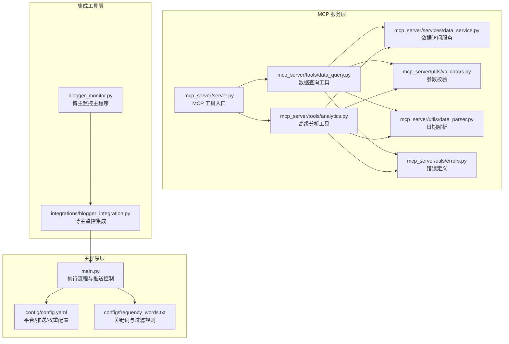
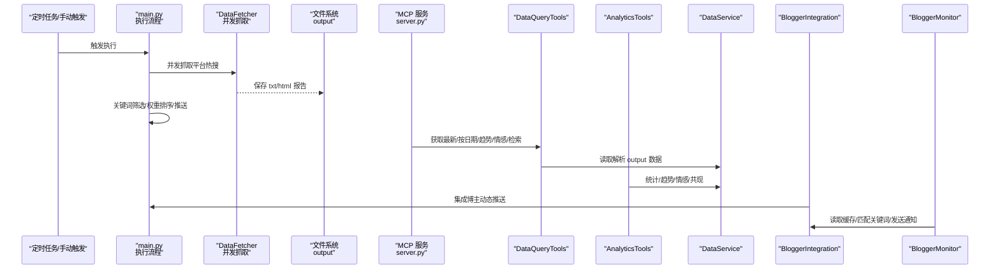
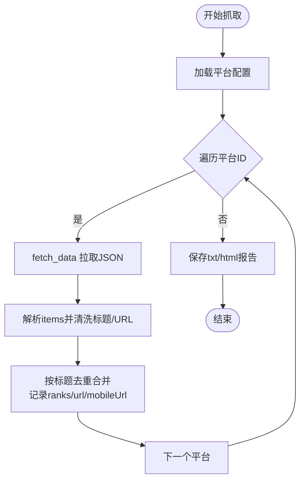
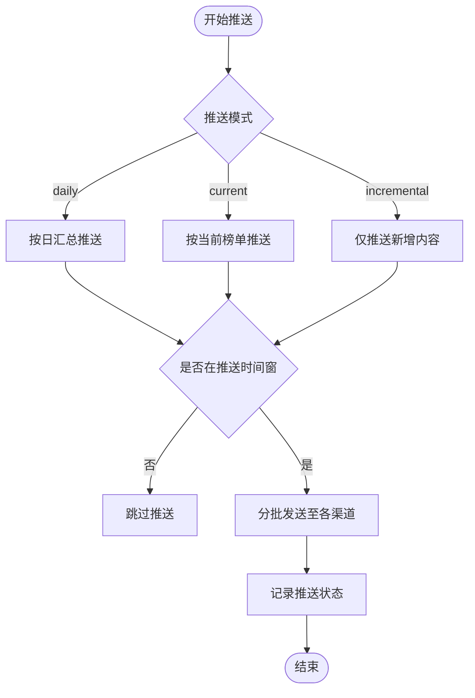
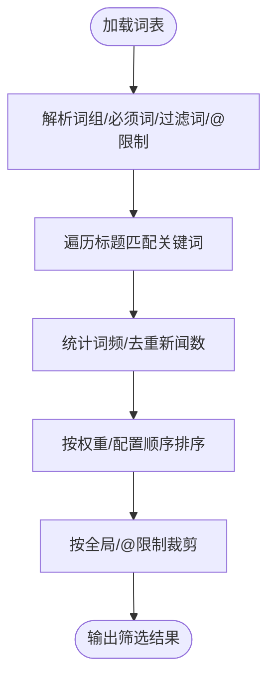
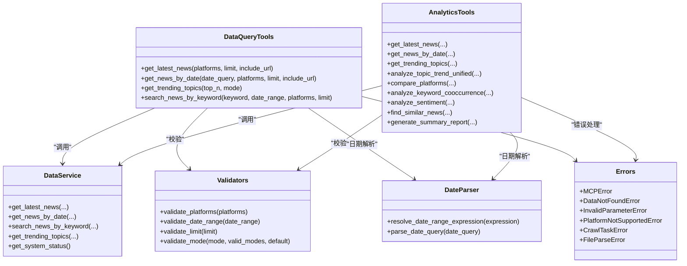
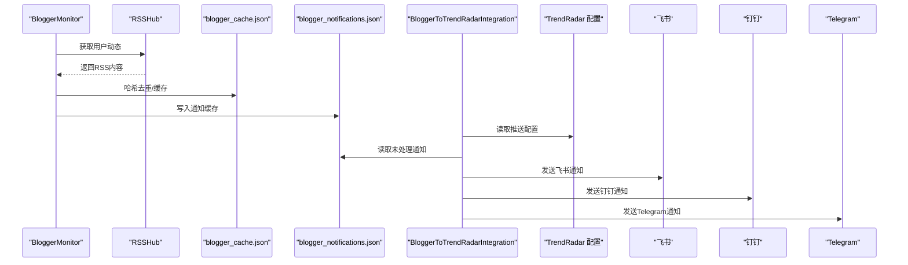
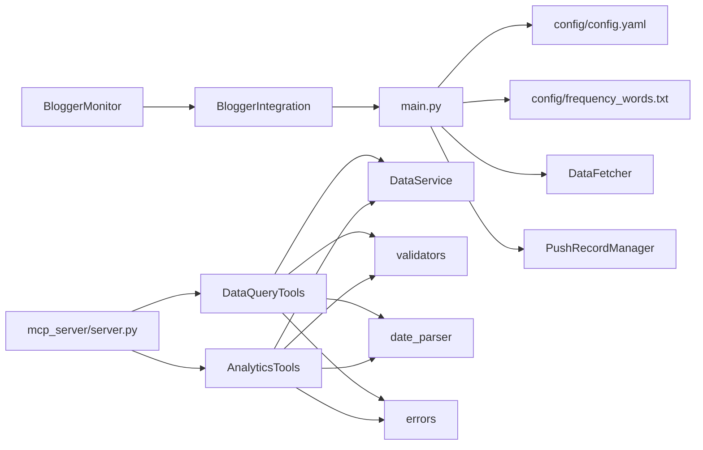

# 核心功能详解

<cite>
**本文引用的文件**
- [main.py](file://main.py)
- [config/config.yaml](file://config/config.yaml)
- [config/frequency_words.txt](file://config/frequency_words.txt)
- [mcp_server/server.py](file://mcp_server/server.py)
- [mcp_server/tools/data_query.py](file://mcp_server/tools/data_query.py)
- [mcp_server/tools/analytics.py](file://mcp_server/tools/analytics.py)
- [mcp_server/services/data_service.py](file://mcp_server/services/data_service.py)
- [mcp_server/utils/date_parser.py](file://mcp_server/utils/date_parser.py)
- [mcp_server/utils/validators.py](file://mcp_server/utils/validators.py)
- [mcp_server/utils/errors.py](file://mcp_server/utils/errors.py)
- [integrations/blogger_integration.py](file://integrations/blogger_integration.py)
- [blogger_monitor.py](file://blogger_monitor.py)
</cite>

## 目录
1. [简介](#简介)
2. [项目结构](#项目结构)
3. [核心组件](#核心组件)
4. [架构总览](#架构总览)
5. [详细组件分析](#详细组件分析)
6. [依赖关系分析](#依赖关系分析)
7. [性能考量](#性能考量)
8. [故障排查指南](#故障排查指南)
9. [结论](#结论)
10. [附录](#附录)

## 简介
本文件面向开发者与使用者，系统性梳理 TrendRadar 的五大核心功能：全网热点聚合、智能推送策略、精准内容筛选、多渠道实时通知、AI 智能分析。围绕 main.py 的执行流程与 MCP 服务工具链，解释各模块的职责边界、数据流与控制流，并给出可视化图示帮助理解。

## 项目结构
项目采用“主程序 + MCP 服务 + 集成工具”的分层组织：
- 主程序层：负责爬取、筛选、聚合、推送与报告生成（main.py）
- MCP 服务层：提供统一的 AI 分析工具接口（mcp_server/*）
- 集成工具层：博主监控与 TrendRadar 推送系统的集成（integrations/*）
- 配置与词表：平台、推送、权重、关键词等配置（config/*）

图表来源
- [main.py](file://main.py#L1-L200)
- [config/config.yaml](file://config/config.yaml#L1-L140)
- [config/frequency_words.txt](file://config/frequency_words.txt#L1-L114)
- [mcp_server/server.py](file://mcp_server/server.py#L1-L120)
- [mcp_server/tools/data_query.py](file://mcp_server/tools/data_query.py#L1-L120)
- [mcp_server/tools/analytics.py](file://mcp_server/tools/analytics.py#L1-L120)
- [mcp_server/services/data_service.py](file://mcp_server/services/data_service.py#L1-L120)
- [mcp_server/utils/date_parser.py](file://mcp_server/utils/date_parser.py#L1-L120)
- [mcp_server/utils/validators.py](file://mcp_server/utils/validators.py#L1-L120)
- [mcp_server/utils/errors.py](file://mcp_server/utils/errors.py#L1-L94)
- [integrations/blogger_integration.py](file://integrations/blogger_integration.py#L1-L120)
- [blogger_monitor.py](file://blogger_monitor.py#L1-L120)

章节来源
- [main.py](file://main.py#L1-L200)
- [config/config.yaml](file://config/config.yaml#L1-L140)
- [mcp_server/server.py](file://mcp_server/server.py#L1-L120)

## 核心组件
- 爬取与聚合：DataFetcher 负责并发拉取多平台热搜，清洗与聚合为统一结构；保存为 txt/html 报告。
- 推送控制：PushRecordManager 管理推送记录与时间窗口；多账号解析与配对校验；分批与限流。
- 关键词筛选：从 frequency_words.txt 加载词组，支持“必须词+”、“过滤词!”、“数量限制@”等语法，按权重排序。
- MCP 服务：提供“获取最新/按日期/趋势/情感/检索”等工具，统一参数校验与错误处理。
- 博主监控：blogger_monitor.py 通过 RSSHub 抓取微博/知乎用户动态，匹配关键词并缓存去重，最终集成到 TrendRadar 推送体系。

章节来源
- [main.py](file://main.py#L160-L395)
- [config/frequency_words.txt](file://config/frequency_words.txt#L1-L114)
- [mcp_server/server.py](file://mcp_server/server.py#L1-L120)
- [mcp_server/tools/data_query.py](file://mcp_server/tools/data_query.py#L1-L120)
- [mcp_server/tools/analytics.py](file://mcp_server/tools/analytics.py#L1-L120)
- [integrations/blogger_integration.py](file://integrations/blogger_integration.py#L1-L120)
- [blogger_monitor.py](file://blogger_monitor.py#L1-L120)

## 架构总览
下图展示从“平台热搜抓取”到“AI 查询与分析”的端到端流程，以及与“博主监控”的集成路径。

图表来源
- [main.py](file://main.py#L616-L790)
- [mcp_server/server.py](file://mcp_server/server.py#L110-L220)
- [mcp_server/tools/data_query.py](file://mcp_server/tools/data_query.py#L1-L120)
- [mcp_server/tools/analytics.py](file://mcp_server/tools/analytics.py#L1-L120)
- [mcp_server/services/data_service.py](file://mcp_server/services/data_service.py#L1-L120)
- [integrations/blogger_integration.py](file://integrations/blogger_integration.py#L1-L120)
- [blogger_monitor.py](file://blogger_monitor.py#L1-L120)

## 详细组件分析

### 全网热点聚合（多平台热搜抓取与聚合）
- 抓取入口：DataFetcher.crawl_websites 并发遍历 config.yaml 中的 platforms 列表，逐个调用 fetch_data 获取 JSON 数据。
- 数据清洗：按排名去重合并相同标题，记录 url/mobileUrl；失败 ID 记录到 failed_ids。
- 聚合输出：save_titles_to_file 生成 txt 报告，按平台分段、按排名排序；同时生成 HTML 报告（由 MCP 服务生成）。
- 并发控制：请求间隔随机抖动，避免触发风控；失败重试与等待策略。

图表来源
- [main.py](file://main.py#L616-L790)
- [config/config.yaml](file://config/config.yaml#L116-L140)

章节来源
- [main.py](file://main.py#L616-L790)
- [config/config.yaml](file://config/config.yaml#L116-L140)

### 智能推送策略（三种模式与时间窗口）
- 模式定义：config.yaml 的 report.mode 支持 daily/current/incremental，分别对应“当日汇总/当前榜单/增量监控”。
- 时间窗口：push_window.enabled 控制是否启用；start/end 定义推送时间窗；once_per_day 控制窗口内只推送一次；push_record_retention_days 控制记录保留天数。
- 推送记录：PushRecordManager.has_pushed_today/is_in_time_range/record_push 管理推送状态与记录清理。
- 多账号：parse_multi_account_config/validate_paired_configs/limit_accounts 支持多账号配置与配对校验，限制最大账号数。

图表来源
- [config/config.yaml](file://config/config.yaml#L26-L59)
- [main.py](file://main.py#L513-L615)
- [main.py](file://main.py#L160-L259)

章节来源
- [config/config.yaml](file://config/config.yaml#L26-L59)
- [main.py](file://main.py#L513-L615)
- [main.py](file://main.py#L160-L259)

### 精准内容筛选（关键词配置与过滤语法）
- 词表加载：load_frequency_words 从 frequency_words.txt 读取词组，支持“必须词+”、“过滤词!”、“数量限制@”等语法；支持全局过滤区域标记。
- 筛选逻辑：按模式（daily/current）统计词频，匹配标题后按权重排序；可按 max_news_per_keyword 限制每关键词显示数量。
- 词组化管理：空行分隔不同主题，独立统计与展示。

图表来源
- [config/frequency_words.txt](file://config/frequency_words.txt#L1-L114)
- [mcp_server/services/data_service.py](file://mcp_server/services/data_service.py#L285-L401)

章节来源
- [config/frequency_words.txt](file://config/frequency_words.txt#L1-L114)
- [mcp_server/services/data_service.py](file://mcp_server/services/data_service.py#L285-L401)

### 多渠道实时通知（飞书/钉钉/企业微信/Telegram/邮件/ntfy/Bark/Slack）
- 配置来源：FEISHU_WEBHOOK_URL/DINGTALK_WEBHOOK_URL/WEWORK_WEBHOOK_URL/TELEGRAM_BOT_TOKEN/TELEGRAM_CHAT_ID/EMAIL_* 等。
- 多账号：parse_multi_account_config/validate_paired_configs/limit_accounts 支持多账号配置与配对校验。
- 分批与限流：message_batch_size/dingtalk_batch_size/feishu_batch_size/bark_batch_size/slack_batch_size/batch_send_interval 控制分批大小与间隔。
- 发送实现：各渠道发送函数（如 send_to_feishu/send_to_dingtalk/send_to_telegram 等）在 main.py 中实现，统一错误处理与日志。

章节来源
- [main.py](file://main.py#L160-L395)
- [config/config.yaml](file://config/config.yaml#L92-L109)

### AI 智能分析（MCP 工具链）
- 工具入口：mcp_server/server.py 注册工具，提供“获取最新/按日期/趋势/情感/检索/摘要/系统状态/触发爬取”等工具。
- 数据查询：DataQueryTools.get_latest_news/get_news_by_date/get_trending_topics/search_news_by_keyword 等，统一参数校验与错误处理。
- 高级分析：AnalyticsTools.analyze_topic_trend_unified/compare_platforms/analyze_keyword_cooccurrence/analyze_sentiment/find_similar_news/generate_summary_report 等。
- 日期解析：DateParser.resolve_date_range_expression 统一自然语言日期解析，避免 AI 自行计算误差。
- 参数校验：validators 提供平台、日期、limit、mode、top_n 等校验；errors 定义统一错误类型。

图表来源
- [mcp_server/server.py](file://mcp_server/server.py#L110-L220)
- [mcp_server/tools/data_query.py](file://mcp_server/tools/data_query.py#L1-L285)
- [mcp_server/tools/analytics.py](file://mcp_server/tools/analytics.py#L1-L800)
- [mcp_server/services/data_service.py](file://mcp_server/services/data_service.py#L1-L605)
- [mcp_server/utils/date_parser.py](file://mcp_server/utils/date_parser.py#L1-L200)
- [mcp_server/utils/validators.py](file://mcp_server/utils/validators.py#L1-L120)
- [mcp_server/utils/errors.py](file://mcp_server/utils/errors.py#L1-L94)

章节来源
- [mcp_server/server.py](file://mcp_server/server.py#L1-L220)
- [mcp_server/tools/data_query.py](file://mcp_server/tools/data_query.py#L1-L285)
- [mcp_server/tools/analytics.py](file://mcp_server/tools/analytics.py#L1-L800)
- [mcp_server/utils/date_parser.py](file://mcp_server/utils/date_parser.py#L1-L200)
- [mcp_server/utils/validators.py](file://mcp_server/utils/validators.py#L1-L120)
- [mcp_server/utils/errors.py](file://mcp_server/utils/errors.py#L1-L94)

### 博主监控与推送集成
- 博主监控：blogger_monitor.py 通过 RSSHub 抓取微博/知乎用户动态，匹配关键词并缓存去重，输出到 output/blogger_notifications.json。
- 集成推送：integrations/blogger_integration.py 读取 TrendRadar 配置，将博主动态格式化为 TrendRadar 新闻格式并保存，同时通过飞书/钉钉/Telegram 渠道推送。

图表来源
- [blogger_monitor.py](file://blogger_monitor.py#L1-L200)
- [integrations/blogger_integration.py](file://integrations/blogger_integration.py#L1-L180)
- [config/config.yaml](file://config/config.yaml#L92-L109)

章节来源
- [blogger_monitor.py](file://blogger_monitor.py#L1-L200)
- [integrations/blogger_integration.py](file://integrations/blogger_integration.py#L1-L180)
- [config/config.yaml](file://config/config.yaml#L92-L109)

## 依赖关系分析
- 主程序依赖配置与词表，调用 DataFetcher 与推送工具；MCP 服务通过工具类与数据服务访问 output 数据。
- MCP 工具链内部依赖 validators/date_parser/errors 提供统一的参数校验与错误处理。
- 博主监控与 TrendRadar 推送系统通过文件缓存与配置集成，实现“动态内容”无缝接入。

图表来源
- [main.py](file://main.py#L160-L395)
- [mcp_server/server.py](file://mcp_server/server.py#L1-L120)
- [mcp_server/tools/data_query.py](file://mcp_server/tools/data_query.py#L1-L120)
- [mcp_server/tools/analytics.py](file://mcp_server/tools/analytics.py#L1-L120)
- [mcp_server/utils/validators.py](file://mcp_server/utils/validators.py#L1-L120)
- [mcp_server/utils/date_parser.py](file://mcp_server/utils/date_parser.py#L1-L120)
- [mcp_server/utils/errors.py](file://mcp_server/utils/errors.py#L1-L94)
- [integrations/blogger_integration.py](file://integrations/blogger_integration.py#L1-L120)
- [blogger_monitor.py](file://blogger_monitor.py#L1-L120)

章节来源
- [main.py](file://main.py#L160-L395)
- [mcp_server/server.py](file://mcp_server/server.py#L1-L120)
- [mcp_server/tools/data_query.py](file://mcp_server/tools/data_query.py#L1-L120)
- [mcp_server/tools/analytics.py](file://mcp_server/tools/analytics.py#L1-L120)
- [mcp_server/utils/validators.py](file://mcp_server/utils/validators.py#L1-L120)
- [mcp_server/utils/date_parser.py](file://mcp_server/utils/date_parser.py#L1-L120)
- [mcp_server/utils/errors.py](file://mcp_server/utils/errors.py#L1-L94)
- [integrations/blogger_integration.py](file://integrations/blogger_integration.py#L1-L120)
- [blogger_monitor.py](file://blogger_monitor.py#L1-L120)

## 性能考量
- 并发抓取：DataFetcher.crawl_websites 对平台列表并发请求，请求间隔随机抖动，避免触发风控。
- 缓存策略：DataService 对“最新新闻/按日期/趋势话题/配置”进行缓存，减少重复 IO。
- 分批推送：各渠道分批大小与间隔配置，避免消息超限与风控。
- 去重与裁剪：标题去重、词频统计、@限制与全局 max_news_per_keyword，控制输出规模。
- Docker 与 MCP：MCP 服务独立部署，便于横向扩展与资源隔离。

章节来源
- [main.py](file://main.py#L616-L790)
- [mcp_server/services/data_service.py](file://mcp_server/services/data_service.py#L1-L120)
- [config/config.yaml](file://config/config.yaml#L34-L43)

## 故障排查指南
- 版本检查失败：check_version_update 通过远程版本接口比较，失败时打印错误并忽略。
- 推送时间窗判断：is_in_time_range 对时间格式进行标准化与范围判断，失败时打印窗口与当前时间。
- 参数校验错误：validators 对平台、日期、limit、mode、top_n 等进行严格校验，抛出 InvalidParameterError。
- 数据不存在：DataNotFoundError 在查询不到匹配数据时抛出，建议检查日期范围或等待爬取任务完成。
- 平台不支持：PlatformNotSupportedError 提示支持平台列表。
- 爬取任务错误：CrawlTaskError 提示配置文件与平台配置问题。

章节来源
- [main.py](file://main.py#L443-L485)
- [main.py](file://main.py#L581-L614)
- [mcp_server/utils/validators.py](file://mcp_server/utils/validators.py#L1-L120)
- [mcp_server/utils/errors.py](file://mcp_server/utils/errors.py#L1-L94)

## 结论
TrendRadar 通过“主程序 + MCP 服务 + 集成工具”的架构，实现了从多平台热搜抓取、关键词筛选、权重排序、多渠道推送，到 AI 智能分析与博主监控的闭环。配置文件与词表驱动行为，MCP 工具链提供统一的查询与分析能力，满足不同场景下的热点追踪与内容消费需求。

## 附录
- 关键词语法与示例：支持“必须词+”、“过滤词!”、“数量限制@”、“全局过滤区域标记”，详见频率词配置文件。
- 推送模式选择：根据使用场景选择 daily/current/incremental；配合推送时间窗口控制，避免非工作时间打扰。
- MCP 工具使用：通过 server.py 注册的工具，结合 DateParser 的日期解析，实现自然语言到结构化查询的转换。

章节来源
- [config/frequency_words.txt](file://config/frequency_words.txt#L1-L114)
- [config/config.yaml](file://config/config.yaml#L26-L59)
- [mcp_server/server.py](file://mcp_server/server.py#L1-L120)
- [mcp_server/utils/date_parser.py](file://mcp_server/utils/date_parser.py#L1-L120)