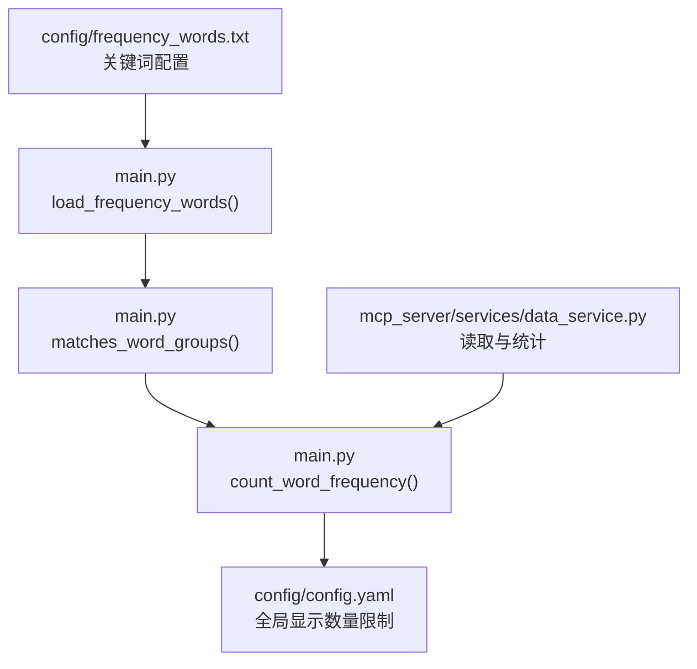
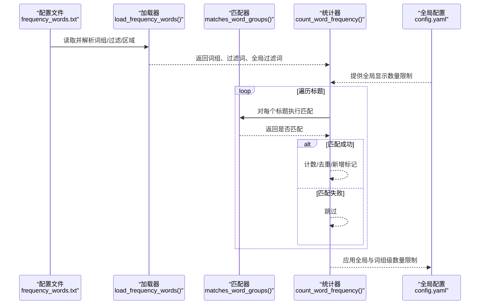
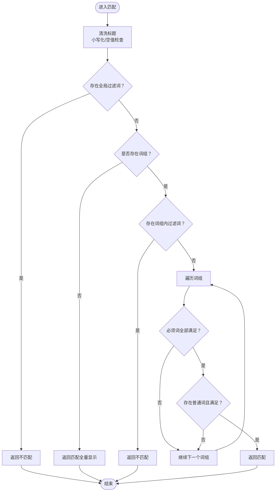
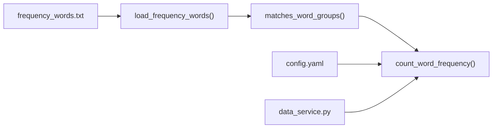

# 精准内容筛选

<cite>
**本文引用的文件**
- [main.py](file://main.py)
- [config/frequency_words.txt](file://config/frequency_words.txt)
- [config/config.yaml](file://config/config.yaml)
- [README.md](file://README.md)
- [README-EN.md](file://README-EN.md)
- [mcp_server/services/data_service.py](file://mcp_server/services/data_service.py)
</cite>

## 目录
1. [简介](#简介)
2. [项目结构](#项目结构)
3. [核心组件](#核心组件)
4. [架构总览](#架构总览)
5. [详细组件分析](#详细组件分析)
6. [依赖关系分析](#依赖关系分析)
7. [性能考量](#性能考量)
8. [故障排查指南](#故障排查指南)
9. [结论](#结论)
10. [附录](#附录)

## 简介
本文件围绕“精准内容筛选”能力，系统阐述如何通过 config/frequency_words.txt 文件实现个性化内容过滤。文档重点解释以下语法与机制：
- 必须词（+）：限定匹配范围
- 过滤词（!）：排除噪声
- 数量限制（@）：控制显示数量
- 全局过滤 [GLOBAL_FILTER]：最高优先级的全局排除
- 词组分组：通过空行分隔实现独立统计与复杂筛选逻辑（例如将“AI”和“人工智能”作为同义词处理）

同时，文档深入剖析 main.py 中 matches_word_groups 函数的关键词匹配算法实现细节，并结合 README 中的配置示例，给出可操作的实际案例，帮助读者快速搭建精确的内容监控体系。

## 项目结构
与“精准内容筛选”直接相关的核心文件与职责如下：
- config/frequency_words.txt：关键词配置文件，定义词组、必须词、过滤词、数量限制以及全局过滤区
- main.py：核心逻辑入口，包含关键词加载与匹配算法
- config/config.yaml：全局报告与推送配置，影响筛选结果的呈现与数量上限
- README.md / README-EN.md：官方文档，提供语法说明、示例与最佳实践
- mcp_server/services/data_service.py：服务层读取与统计，间接体现筛选流程

图表来源
- [main.py](file://main.py#L793-L887)
- [main.py](file://main.py#L1173-L1221)
- [main.py](file://main.py#L1277-L1399)
- [config/config.yaml](file://config/config.yaml#L1-L140)
- [mcp_server/services/data_service.py](file://mcp_server/services/data_service.py#L1-L200)

章节来源
- [main.py](file://main.py#L793-L887)
- [config/frequency_words.txt](file://config/frequency_words.txt#L1-L114)
- [config/config.yaml](file://config/config.yaml#L1-L140)
- [README.md](file://README.md#L1561-L1690)
- [README-EN.md](file://README-EN.md#L222-L241)

## 核心组件
- 关键词加载器（load_frequency_words）：解析 frequency_words.txt，拆分为词组、词组内过滤词、全局过滤词；支持区域标记 [GLOBAL_FILTER] 与 [WORD_GROUPS]，并兼容无标记的向后兼容模式
- 匹配引擎（matches_word_groups）：实现“全局过滤 > 词组内过滤 > 词组匹配”的优先级；支持必须词（+）与普通词（无前缀）的组合匹配
- 统计与展示（count_word_frequency）：在不同报告模式（daily/current/incremental）下，对匹配结果进行统计、去重与新增标记，并受全局与词组级数量限制影响

章节来源
- [main.py](file://main.py#L793-L887)
- [main.py](file://main.py#L1173-L1221)
- [main.py](file://main.py#L1277-L1399)

## 架构总览
下图展示了从关键词配置到匹配与统计的整体流程，以及与全局配置的关系。

图表来源
- [main.py](file://main.py#L793-L887)
- [main.py](file://main.py#L1173-L1221)
- [main.py](file://main.py#L1277-L1399)
- [config/config.yaml](file://config/config.yaml#L1-L140)

## 详细组件分析

### 关键词文件语法与区域标记
- 语法类型与作用
  - 普通词：包含任意一个即命中
  - 必须词（+）：必须同时包含普通词与必须词
  - 过滤词（!）：包含即排除
  - 数量限制（@）：限制该词组最多显示数量（优先级高于全局配置）
  - 全局过滤（[GLOBAL_FILTER]）：任何情况下都优先过滤，优先级最高
- 区域标记
  - [GLOBAL_FILTER]：全局过滤区，仅允许纯文本，不支持 +、!、@ 语法
  - [WORD_GROUPS]：词组区，维持现有语法（!、+、@）
  - 无标记：默认视为词组区，向后兼容
- 词组分组
  - 使用空行分隔不同词组，每个词组独立统计与计数

章节来源
- [README.md](file://README.md#L1561-L1690)
- [README-EN.md](file://README-EN.md#L222-L241)
- [config/frequency_words.txt](file://config/frequency_words.txt#L1-L114)

### 关键词加载器（load_frequency_words）
- 功能要点
  - 读取配置文件，按空行切分为多个词组
  - 识别区域标记，切换当前处理区（GLOBAL_FILTER 或 WORD_GROUPS）
  - 在 GLOBAL_FILTER 区域收集全局过滤词（忽略 +、!、@ 前缀）
  - 在 WORD_GROUPS 区域解析普通词、必须词（+）、过滤词（!）、数量限制（@）
  - 生成词组对象，包含 required、normal、group_key、max_count 字段
- 复杂度与性能
  - 时间复杂度：O(N)，N 为词组与行数之和
  - 空间复杂度：O(M)，M 为词组与词表规模
- 错误处理
  - 文件不存在抛出异常
  - 非法 @ 数字格式被忽略

章节来源
- [main.py](file://main.py#L793-L887)

### 匹配算法（matches_word_groups）
- 匹配优先级
  1) 全局过滤：若标题包含任一全局过滤词，直接返回不匹配
  2) 词组内过滤：若标题包含任一词组内过滤词，直接返回不匹配
  3) 词组匹配：遍历词组，要求：
     - 若存在必须词，则标题必须包含所有必须词
     - 若存在普通词，则标题必须包含至少一个普通词
  4) 若无词组配置，返回匹配（支持显示全部新闻）
- 大小写与输入健壮性
  - 对标题进行小写化处理，避免大小写差异
  - 对输入类型进行防御性校验，确保空标题不匹配
- 复杂度与性能
  - 时间复杂度：O(G×(R+N))，G 为词组数，R 为必须词数，N 为普通词数
  - 空间复杂度：O(1)
- 边界与陷阱
  - 全局过滤优先级最高，可能覆盖所有词组匹配
  - 词组内过滤优先于词组匹配，避免误报
  - 无词组配置时返回匹配，便于“全量显示”

图表来源
- [main.py](file://main.py#L1173-L1221)

章节来源
- [main.py](file://main.py#L1173-L1221)

### 统计与展示（count_word_frequency）
- 报告模式
  - daily：处理当天所有新闻，统计全部匹配
  - current：仅处理最新一批新闻，但统计信息来自全部历史
  - incremental：增量模式，首次或仅新增新闻时统计新增数量
- 数量限制
  - 词组级 @ 数字 > 全局配置 > 不限制
  - 全局配置由 config/config.yaml 的 max_news_per_keyword 控制
- 新增标记
  - 在增量/首次 current 模式下，统计匹配的新闻数量并标记新增
- 复杂度与性能
  - 时间复杂度：O(T×G)，T 为处理标题数，G 为词组数
  - 空间复杂度：O(U)，U 为去重后的标题集合

章节来源
- [main.py](file://main.py#L1277-L1399)
- [config/config.yaml](file://config/config.yaml#L1-L140)

### 词组分组与同义词处理
- 通过空行分隔词组，实现独立统计
- 将“AI”和“人工智能”放入同一词组，即可作为同义词处理，提升覆盖率
- 结合必须词（+）限定范围，避免误匹配

章节来源
- [README.md](file://README.md#L1692-L1721)
- [config/frequency_words.txt](file://config/frequency_words.txt#L1-L114)

### 实际案例与配置建议
- 案例一：手机新品类
  - 词组：iPhone、华为、OPPO（普通词）+ 发布（必须词）
  - 过滤：预测（过滤词）
  - 目的：聚焦新品发布，排除预测类内容
- 案例二：AI 与人工智能
  - 词组：人工智能、AI（普通词）
  - 目的：将两者作为同义词处理，提升覆盖面
- 案例三：全局过滤
  - 在 [GLOBAL_FILTER] 区域添加“广告”“标题党”等词，确保任何情况下都被过滤
- 案例四：数量限制
  - 对热点词组使用 @20，覆盖全局配置，突出重点

章节来源
- [README.md](file://README.md#L1692-L1721)
- [README.md](file://README.md#L1723-L1780)
- [README.md](file://README.md#L1830-L1844)
- [config/frequency_words.txt](file://config/frequency_words.txt#L1-L114)

## 依赖关系分析
- 配置依赖
  - frequency_words.txt 为筛选规则来源，决定匹配行为
  - config/config.yaml 提供全局显示数量限制与排序策略
- 代码依赖
  - load_frequency_words 依赖文件系统与路径解析
  - matches_word_groups 依赖词组与过滤词列表
  - count_word_frequency 依赖 matches_word_groups 与全局配置
- 服务依赖
  - mcp_server/services/data_service.py 读取标题数据，间接驱动筛选流程

图表来源
- [main.py](file://main.py#L793-L887)
- [main.py](file://main.py#L1173-L1221)
- [main.py](file://main.py#L1277-L1399)
- [config/config.yaml](file://config/config.yaml#L1-L140)
- [mcp_server/services/data_service.py](file://mcp_server/services/data_service.py#L1-L200)

章节来源
- [main.py](file://main.py#L793-L887)
- [main.py](file://main.py#L1173-L1221)
- [main.py](file://main.py#L1277-L1399)
- [config/config.yaml](file://config/config.yaml#L1-L140)
- [mcp_server/services/data_service.py](file://mcp_server/services/data_service.py#L1-L200)

## 性能考量
- 关键词匹配
  - 采用 O(G×(R+N)) 的线性扫描，词组数与词数较少时开销可控
  - 全局过滤与词组内过滤短路返回，减少后续比较
- 数量限制
  - 词组级 @ 与全局配置共同作用，避免输出膨胀
- I/O 与缓存
  - 服务层具备缓存机制，降低重复读取成本（与筛选流程配合使用）

[本节为通用指导，无需列出具体文件来源]

## 故障排查指南
- 配置文件缺失
  - 现象：启动时报错提示频率词文件不存在
  - 处理：确认 config/frequency_words.txt 存在，或设置环境变量 FREQUENCY_WORDS_PATH
- 语法错误
  - 现象：@ 后非正整数被忽略；全局过滤区出现 +、!、@ 语法无效
  - 处理：修正 @ 数字格式；将全局过滤词置于 [GLOBAL_FILTER] 区域且不带前缀
- 匹配异常
  - 现象：标题未按预期过滤或未命中
  - 处理：检查全局过滤优先级；确认必须词与普通词组合；核对大小写与空格
- 数量限制未生效
  - 现象：词组级 @ 未覆盖全局配置
  - 处理：确保 @ 数字大于 0；核对词组与全局配置的优先级关系

章节来源
- [main.py](file://main.py#L793-L887)
- [main.py](file://main.py#L1173-L1221)
- [config/config.yaml](file://config/config.yaml#L1-L140)

## 结论
通过 frequency_words.txt 的五种语法与区域标记，结合 main.py 的匹配与统计逻辑，系统实现了灵活、可扩展的精准内容筛选能力。合理运用必须词、过滤词、数量限制与全局过滤，辅以词组分组与最佳实践，可在海量新闻中高效提取目标内容，支撑日报、增量监控与实时热点追踪等多种场景。

[本节为总结性内容，无需列出具体文件来源]

## 附录
- 术语
  - 词组：由空行分隔的一组关键词，独立统计
  - 必须词（+）：限定匹配范围
  - 过滤词（!）：排除噪声
  - 数量限制（@）：控制显示数量
  - 全局过滤（[GLOBAL_FILTER]）：最高优先级的全局排除

[本节为补充说明，无需列出具体文件来源]