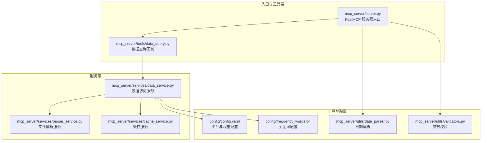
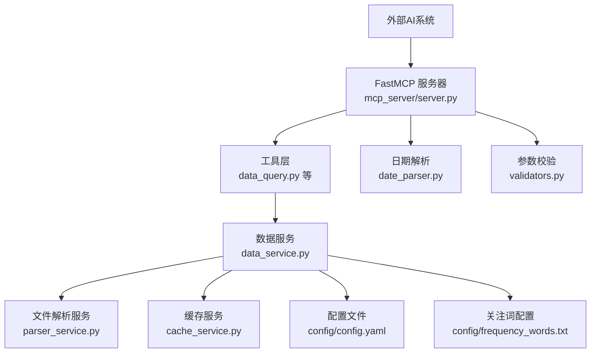
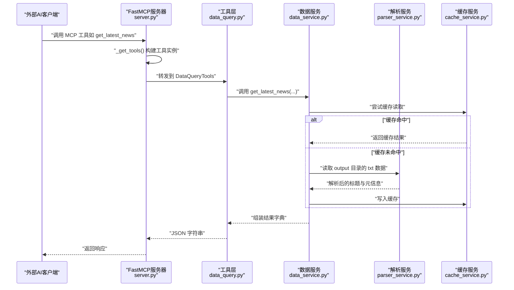
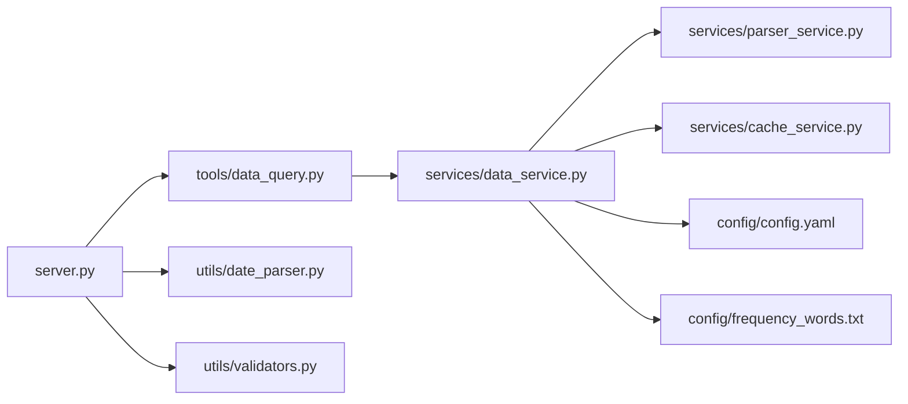
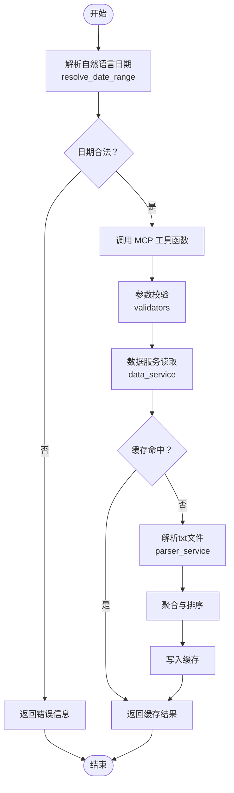

# AI分析管道阶段

<cite>
**本文引用的文件**
- [mcp_server/server.py](file://mcp_server/server.py)
- [mcp_server/tools/data_query.py](file://mcp_server/tools/data_query.py)
- [mcp_server/services/data_service.py](file://mcp_server/services/data_service.py)
- [mcp_server/services/cache_service.py](file://mcp_server/services/cache_service.py)
- [mcp_server/services/parser_service.py](file://mcp_server/services/parser_service.py)
- [mcp_server/utils/date_parser.py](file://mcp_server/utils/date_parser.py)
- [mcp_server/utils/validators.py](file://mcp_server/utils/validators.py)
- [config/config.yaml](file://config/config.yaml)
- [config/frequency_words.txt](file://config/frequency_words.txt)
</cite>

## 目录
1. [引言](#引言)
2. [项目结构](#项目结构)
3. [核心组件](#核心组件)
4. [架构总览](#架构总览)
5. [详细组件分析](#详细组件分析)
6. [依赖关系分析](#依赖关系分析)
7. [性能考量](#性能考量)
8. [故障排查指南](#故障排查指南)
9. [结论](#结论)
10. [附录](#附录)

## 引言
本章节聚焦 TrendRadar 的 AI 分析管道阶段，围绕 MCP 服务器如何为外部 AI 系统提供数据查询接口，实现“自然语言驱动的数据分析”。以 mcp_server/server.py 为入口，解释 FastMCP 框架的初始化过程与工具注册机制；重点分析 data_query.py 中实现的各类查询工具（如 get_latest_news、get_news_by_date、get_trending_topics 等），说明其输入参数、查询逻辑与返回格式；阐述数据服务（data_service）如何从本地存储的文本文件中加载与解析历史数据，支持时间范围查询与趋势分析；说明缓存服务（cache_service）如何提升查询性能；给出 MCP 工具调用的序列图，展示从自然语言请求到数据返回的完整流程；最后讨论如何扩展新的分析工具。

## 项目结构
TrendRadar 的 MCP 服务采用模块化组织，入口位于 mcp_server/server.py，工具层（tools）负责对外暴露的 MCP 工具函数，服务层（services）封装数据访问与解析逻辑，工具层通过服务层访问数据与配置，utils 层提供日期解析与参数校验等通用能力。

图表来源
- [mcp_server/server.py](file://mcp_server/server.py#L1-L120)
- [mcp_server/tools/data_query.py](file://mcp_server/tools/data_query.py#L1-L60)
- [mcp_server/services/data_service.py](file://mcp_server/services/data_service.py#L1-L60)
- [mcp_server/services/parser_service.py](file://mcp_server/services/parser_service.py#L1-L60)
- [mcp_server/services/cache_service.py](file://mcp_server/services/cache_service.py#L1-L40)
- [mcp_server/utils/date_parser.py](file://mcp_server/utils/date_parser.py#L1-L60)
- [mcp_server/utils/validators.py](file://mcp_server/utils/validators.py#L1-L40)
- [config/config.yaml](file://config/config.yaml#L110-L140)
- [config/frequency_words.txt](file://config/frequency_words.txt#L1-L40)

章节来源
- [mcp_server/server.py](file://mcp_server/server.py#L1-L120)
- [mcp_server/tools/data_query.py](file://mcp_server/tools/data_query.py#L1-L60)
- [mcp_server/services/data_service.py](file://mcp_server/services/data_service.py#L1-L60)
- [mcp_server/services/parser_service.py](file://mcp_server/services/parser_service.py#L1-L60)
- [mcp_server/services/cache_service.py](file://mcp_server/services/cache_service.py#L1-L40)
- [mcp_server/utils/date_parser.py](file://mcp_server/utils/date_parser.py#L1-L60)
- [mcp_server/utils/validators.py](file://mcp_server/utils/validators.py#L1-L40)
- [config/config.yaml](file://config/config.yaml#L110-L140)
- [config/frequency_words.txt](file://config/frequency_words.txt#L1-L40)

## 核心组件
- FastMCP 服务器与工具注册
  - 通过 FastMCP 实例创建 MCP 应用，使用装饰器注册工具函数，统一暴露为 MCP 工具。
  - 工具采用单例模式延迟初始化，首次请求时构建 DataQueryTools、AnalyticsTools、SearchTools、ConfigManagementTools、SystemManagementTools 实例，避免启动时资源占用。
- 数据查询工具（DataQueryTools）
  - 提供 get_latest_news、get_news_by_date、get_trending_topics 等方法，封装参数校验、服务调用与结果组装。
- 数据服务（DataService）
  - 封装数据访问逻辑，负责从本地 output 目录按日期读取 txt 文本，解析标题、排名、URL 等信息，支持时间范围查询与趋势统计。
- 缓存服务（CacheService）
  - 提供 TTL 缓存，按 key 与存活时间缓存查询结果，显著降低重复查询开销。
- 文件解析服务（ParserService）
  - 解析 txt 格式的标题数据与 YAML 配置，支持按日期聚合与平台过滤。
- 日期解析与参数校验
  - DateParser 支持多种自然语言日期表达式解析；validators 提供平台、数量、日期范围、关键词等参数校验。

章节来源
- [mcp_server/server.py](file://mcp_server/server.py#L20-L70)
- [mcp_server/tools/data_query.py](file://mcp_server/tools/data_query.py#L20-L60)
- [mcp_server/services/data_service.py](file://mcp_server/services/data_service.py#L1-L40)
- [mcp_server/services/cache_service.py](file://mcp_server/services/cache_service.py#L1-L40)
- [mcp_server/services/parser_service.py](file://mcp_server/services/parser_service.py#L1-L40)
- [mcp_server/utils/date_parser.py](file://mcp_server/utils/date_parser.py#L1-L40)
- [mcp_server/utils/validators.py](file://mcp_server/utils/validators.py#L1-L40)

## 架构总览
MCP 服务器通过 FastMCP 注册工具函数，外部 AI 系统以自然语言发起请求，服务器解析日期表达式、校验参数、调用数据服务读取本地文本文件并返回结构化结果。缓存服务贯穿数据服务层，提升查询性能。

图表来源
- [mcp_server/server.py](file://mcp_server/server.py#L1-L120)
- [mcp_server/tools/data_query.py](file://mcp_server/tools/data_query.py#L1-L60)
- [mcp_server/services/data_service.py](file://mcp_server/services/data_service.py#L1-L60)
- [mcp_server/services/parser_service.py](file://mcp_server/services/parser_service.py#L1-L60)
- [mcp_server/services/cache_service.py](file://mcp_server/services/cache_service.py#L1-L40)
- [mcp_server/utils/date_parser.py](file://mcp_server/utils/date_parser.py#L1-L60)
- [mcp_server/utils/validators.py](file://mcp_server/utils/validators.py#L1-L40)
- [config/config.yaml](file://config/config.yaml#L110-L140)
- [config/frequency_words.txt](file://config/frequency_words.txt#L1-L40)

## 详细组件分析

### FastMCP 初始化与工具注册
- 初始化
  - 创建 FastMCP 应用实例，命名空间为 trendradar-news。
  - 定义全局工具实例字典，首次请求时按需构建 DataQueryTools、AnalyticsTools、SearchTools、ConfigManagementTools、SystemManagementTools。
- 工具注册
  - 使用装饰器将工具函数注册为 MCP 工具，统一返回 JSON 字符串，便于外部 AI 系统消费。
- 传输模式
  - 支持 stdio 与 http 两种传输模式，http 模式下监听指定 host/port，路径为 /mcp。

图表来源
- [mcp_server/server.py](file://mcp_server/server.py#L20-L120)
- [mcp_server/tools/data_query.py](file://mcp_server/tools/data_query.py#L20-L120)
- [mcp_server/services/data_service.py](file://mcp_server/services/data_service.py#L30-L120)
- [mcp_server/services/parser_service.py](file://mcp_server/services/parser_service.py#L160-L260)
- [mcp_server/services/cache_service.py](file://mcp_server/services/cache_service.py#L20-L80)

章节来源
- [mcp_server/server.py](file://mcp_server/server.py#L20-L120)
- [mcp_server/server.py](file://mcp_server/server.py#L660-L782)

### 数据查询工具：get_latest_news
- 输入参数
  - platforms：平台ID列表，默认使用配置文件中的平台集合；支持空列表回退到配置平台。
  - limit：返回条数上限，默认50，最大1000。
  - include_url：是否包含 URL 链接，默认 False。
- 查询逻辑
  - 参数校验：平台列表、limit、日期范围（若涉及）。
  - 调用 DataService.get_latest_news，按最新时间戳聚合各平台标题，按排名排序，限制返回数量。
  - 可选添加 URL 字段。
- 返回格式
  - 包含 news 列表、total、platforms、success 等字段的 JSON 字符串。

章节来源
- [mcp_server/server.py](file://mcp_server/server.py#L113-L149)
- [mcp_server/tools/data_query.py](file://mcp_server/tools/data_query.py#L34-L90)
- [mcp_server/services/data_service.py](file://mcp_server/services/data_service.py#L30-L103)

### 数据查询工具：get_news_by_date
- 输入参数
  - date_query：支持自然语言（今天、昨天、上周一、本周三、最近7天等）与绝对日期（YYYY-MM-DD、MM/DD 等）。
  - platforms：平台过滤。
  - limit：返回条数上限，默认50。
  - include_url：是否包含 URL。
- 查询逻辑
  - 使用 DateParser.validate_date_query 解析 date_query，支持相对/绝对/星期/斜杠等多种格式。
  - 调用 DataService.get_news_by_date，按目标日期读取 txt 文件，合并同标题不同平台的排名，计算平均排名，按排名排序并限制返回数量。
- 返回格式
  - 包含 news 列表、total、date、date_query、platforms、success 等字段的 JSON 字符串。

章节来源
- [mcp_server/server.py](file://mcp_server/server.py#L176-L222)
- [mcp_server/tools/data_query.py](file://mcp_server/tools/data_query.py#L211-L285)
- [mcp_server/services/data_service.py](file://mcp_server/services/data_service.py#L104-L182)
- [mcp_server/utils/date_parser.py](file://mcp_server/utils/date_parser.py#L90-L248)

### 数据查询工具：get_trending_topics
- 输入参数
  - top_n：返回 TOP N 关注词，默认10，最大100。
  - mode：模式选择，daily（当日累计）、current（最新一批）。
- 查询逻辑
  - 参数校验：top_n、mode。
  - 读取 today 的标题数据，解析 config/frequency_words.txt 中的词组（required/normal/filter_words），统计词频与匹配新闻数量。
  - 支持两种模式：daily 聚合当天累计，current 使用最新时间戳批次。
- 返回格式
  - 包含 topics（keyword、frequency、matched_news 等）、generated_at、mode、total_keywords、description 等字段的 JSON 字符串。

章节来源
- [mcp_server/server.py](file://mcp_server/server.py#L151-L174)
- [mcp_server/tools/data_query.py](file://mcp_server/tools/data_query.py#L154-L210)
- [mcp_server/services/data_service.py](file://mcp_server/services/data_service.py#L285-L401)
- [config/frequency_words.txt](file://config/frequency_words.txt#L1-L114)

### 数据服务：从本地文本文件加载与解析
- 读取策略
  - ParserService.read_all_titles_for_date 按日期定位 output/<YYYY年MM月DD日>/txt 目录，遍历 *.txt 文件，解析标题、排名、URL、移动端 URL 等信息。
  - 支持平台过滤与缓存，缓存键包含日期与平台集合。
- 数据聚合
  - 合并同标题在不同平台的排名，计算平均排名；支持 include_url 控制是否返回链接。
- 历史数据扫描
  - get_available_date_range 扫描 output 目录，返回最早与最新日期，辅助前端或工具层判断可用范围。

章节来源
- [mcp_server/services/parser_service.py](file://mcp_server/services/parser_service.py#L160-L260)
- [mcp_server/services/data_service.py](file://mcp_server/services/data_service.py#L104-L182)
- [mcp_server/services/data_service.py](file://mcp_server/services/data_service.py#L498-L537)

### 缓存服务：提升查询性能
- 缓存机制
  - CacheService 提供 get/set/delete/clear/cleanup_expired/get_stats 等方法，使用字典与时间戳维护 TTL。
  - 全局单例 get_cache() 返回共享实例，避免重复初始化。
- 使用策略
  - DataService 在读取最新新闻、按日期查询、趋势统计、配置读取等场景使用缓存，设置不同 TTL（如 15 分钟、30 分钟、1 小时）。
  - ParserService 在读取日期数据时也使用缓存，区分今日与历史数据的 TTL。

章节来源
- [mcp_server/services/cache_service.py](file://mcp_server/services/cache_service.py#L1-L137)
- [mcp_server/services/data_service.py](file://mcp_server/services/data_service.py#L30-L120)
- [mcp_server/services/parser_service.py](file://mcp_server/services/parser_service.py#L180-L260)

### 日期解析与参数校验
- DateParser
  - 支持中文/英文相对日期（今天、昨天、N天前、last N days）、星期（上周一、本周三）、绝对日期（YYYY-MM-DD、MM/DD、YYYY年MM月DD日）等。
  - 提供 resolve_date_range_expression 将自然语言表达式解析为标准日期范围，避免 AI 模型自行计算导致不一致。
- validators
  - 平台校验：从 config/config.yaml 动态读取支持平台列表，支持空列表回退到配置平台。
  - 限制校验：limit、top_n、日期范围、关键词长度等。
  - 日期查询校验：validate_date_query 结合 DateParser，支持未来日期与过久远日期约束。

章节来源
- [mcp_server/utils/date_parser.py](file://mcp_server/utils/date_parser.py#L1-L248)
- [mcp_server/utils/date_parser.py](file://mcp_server/utils/date_parser.py#L330-L491)
- [mcp_server/utils/validators.py](file://mcp_server/utils/validators.py#L1-L200)
- [mcp_server/utils/validators.py](file://mcp_server/utils/validators.py#L309-L352)
- [config/config.yaml](file://config/config.yaml#L110-L140)

### 扩展新的分析工具
- 步骤
  - 在 tools 层新增工具类或函数，使用 @mcp.tool 装饰器注册。
  - 在 tools 层调用 services 层提供的数据访问方法，必要时引入 validators 与 date_parser。
  - 在 server.py 中注册新工具，确保 _get_tools() 初始化时包含新工具实例。
  - 如需缓存，复用 DataService 的缓存策略或在新工具中显式使用 CacheService。
- 注意事项
  - 统一返回 JSON 字符串，包含 success 字段与错误时的 error 字典。
  - 明确输入参数与返回格式，提供清晰的文档注释与示例。

章节来源
- [mcp_server/server.py](file://mcp_server/server.py#L20-L120)
- [mcp_server/server.py](file://mcp_server/server.py#L660-L782)
- [mcp_server/tools/data_query.py](file://mcp_server/tools/data_query.py#L1-L60)

## 依赖关系分析
- 组件耦合
  - server.py 依赖 tools、utils（date_parser、validators），并通过工具层间接依赖 services。
  - tools.data_query 依赖 services.data_service 与 utils.validators。
  - services.data_service 依赖 services.parser_service 与 services.cache_service。
  - utils.validators 依赖 utils.date_parser。
- 外部依赖
  - FastMCP 框架（第三方库）。
  - Python 标准库（datetime、yaml、pathlib、threading 等）。

图表来源
- [mcp_server/server.py](file://mcp_server/server.py#L1-L120)
- [mcp_server/tools/data_query.py](file://mcp_server/tools/data_query.py#L1-L60)
- [mcp_server/services/data_service.py](file://mcp_server/services/data_service.py#L1-L60)
- [mcp_server/services/parser_service.py](file://mcp_server/services/parser_service.py#L1-L60)
- [mcp_server/services/cache_service.py](file://mcp_server/services/cache_service.py#L1-L40)
- [mcp_server/utils/date_parser.py](file://mcp_server/utils/date_parser.py#L1-L60)
- [mcp_server/utils/validators.py](file://mcp_server/utils/validators.py#L1-L40)
- [config/config.yaml](file://config/config.yaml#L110-L140)
- [config/frequency_words.txt](file://config/frequency_words.txt#L1-L40)

章节来源
- [mcp_server/server.py](file://mcp_server/server.py#L1-L120)
- [mcp_server/tools/data_query.py](file://mcp_server/tools/data_query.py#L1-L60)
- [mcp_server/services/data_service.py](file://mcp_server/services/data_service.py#L1-L60)
- [mcp_server/services/parser_service.py](file://mcp_server/services/parser_service.py#L1-L60)
- [mcp_server/services/cache_service.py](file://mcp_server/services/cache_service.py#L1-L40)
- [mcp_server/utils/date_parser.py](file://mcp_server/utils/date_parser.py#L1-L60)
- [mcp_server/utils/validators.py](file://mcp_server/utils/validators.py#L1-L40)
- [config/config.yaml](file://config/config.yaml#L110-L140)
- [config/frequency_words.txt](file://config/frequency_words.txt#L1-L40)

## 性能考量
- 缓存策略
  - 今日数据缓存 15 分钟，历史数据缓存 1 小时；趋势统计与配置读取分别使用 30 分钟与 1 小时 TTL。
  - 缓存键包含关键参数（如平台、limit、include_url、日期），避免误命中。
- I/O 优化
  - ParserService 一次性读取并合并同标题跨平台排名，减少多次文件读取。
  - 读取失败的单个文件会被忽略，保证整体稳定性。
- 参数限制
  - 限制返回条数上限，避免超大数据量返回；对关键词长度与模式参数进行约束，降低异常输入带来的开销。

[本节为通用指导，无需具体文件分析]

## 故障排查指南
- 常见错误与定位
  - 数据不存在：当 output 目录缺失或日期无数据时，抛出 DataNotFoundError；可通过 get_available_date_range 获取可用范围。
  - 日期非法：InvalidParameterError，检查 date_query 格式或使用 resolve_date_range 工具规范化。
  - 平台不支持：InvalidParameterError，确认 config/config.yaml 中 platforms 配置。
  - 配置文件解析失败：FileParseError，检查 YAML 语法或权限。
- 建议排查步骤
  - 使用 get_system_status 查看系统状态与缓存统计。
  - 使用 get_current_config 获取当前配置，确认平台与权重设置。
  - 使用 resolve_date_range 将自然语言日期转换为标准范围，再调用相关工具。

章节来源
- [mcp_server/services/data_service.py](file://mcp_server/services/data_service.py#L498-L605)
- [mcp_server/utils/date_parser.py](file://mcp_server/utils/date_parser.py#L330-L491)
- [mcp_server/utils/validators.py](file://mcp_server/utils/validators.py#L43-L121)
- [mcp_server/server.py](file://mcp_server/server.py#L586-L658)

## 结论
TrendRadar 的 MCP 服务器通过 FastMCP 框架将本地文本数据以工具形式暴露给外部 AI 系统，结合参数校验与日期解析，实现了“自然语言驱动的数据分析”。数据服务与缓存服务协同，既保证了查询的准确性与一致性，又提升了性能与稳定性。通过模块化设计与清晰的依赖关系，系统易于扩展新的分析工具，满足多样化的热点分析需求。

[本节为总结，无需具体文件分析]

## 附录
- 关键流程：自然语言日期解析到数据返回

图表来源
- [mcp_server/server.py](file://mcp_server/server.py#L40-L120)
- [mcp_server/utils/date_parser.py](file://mcp_server/utils/date_parser.py#L330-L491)
- [mcp_server/utils/validators.py](file://mcp_server/utils/validators.py#L90-L200)
- [mcp_server/services/data_service.py](file://mcp_server/services/data_service.py#L30-L120)
- [mcp_server/services/parser_service.py](file://mcp_server/services/parser_service.py#L160-L260)
- [mcp_server/services/cache_service.py](file://mcp_server/services/cache_service.py#L20-L80)