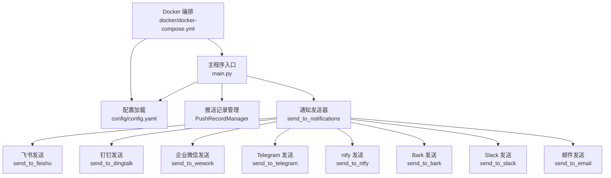
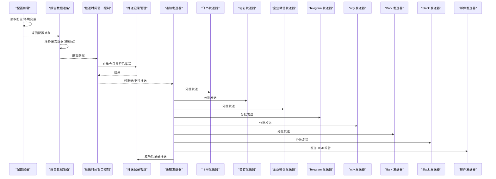
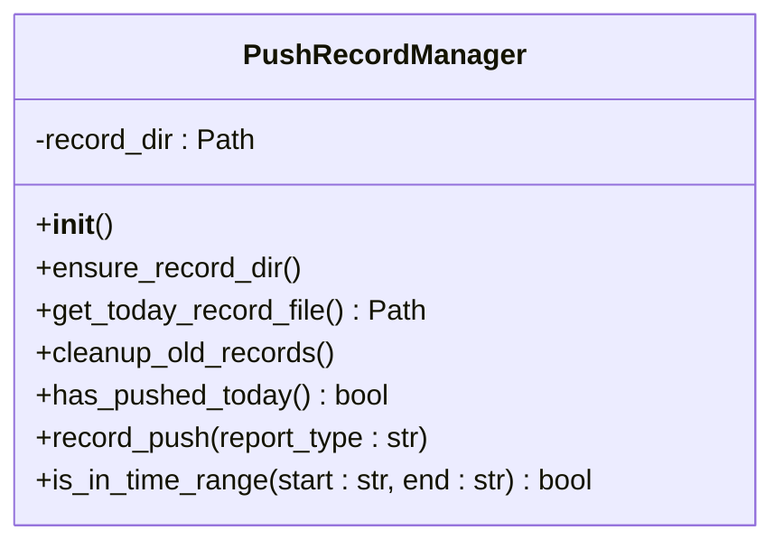
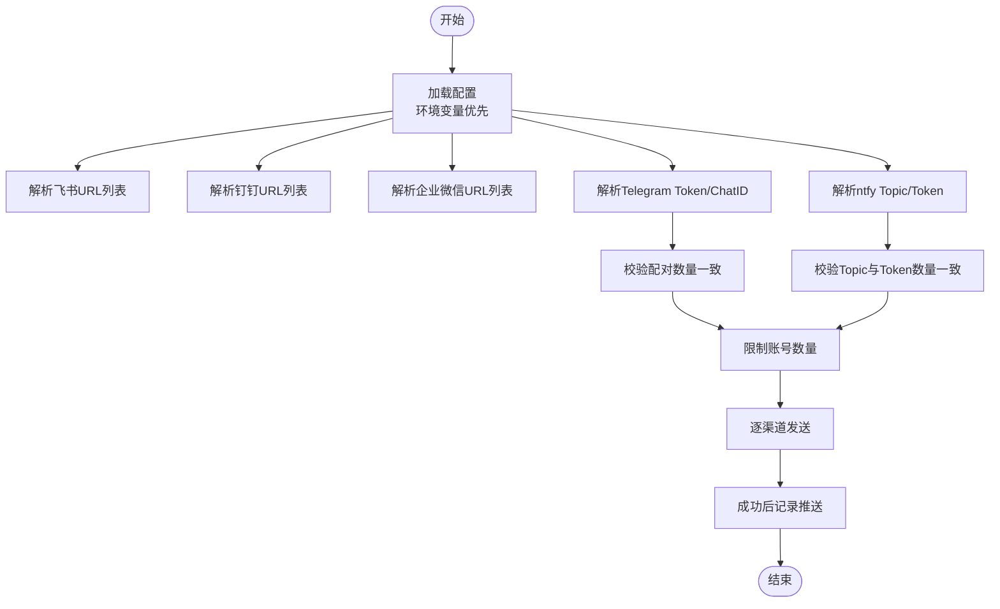
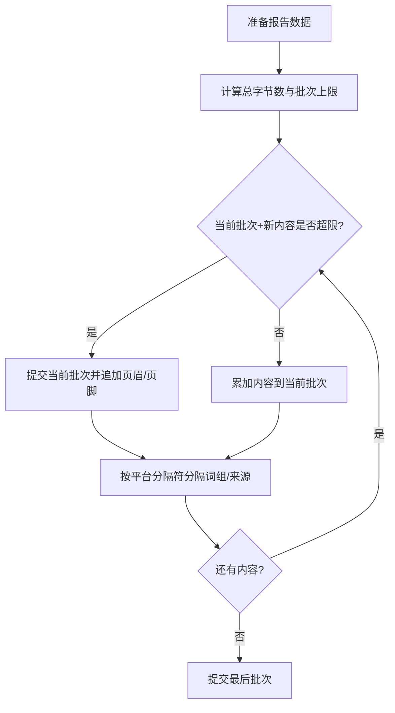
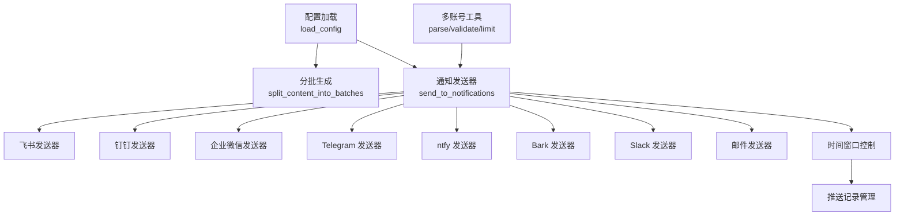

# 推送管道阶段

<cite>
**本文引用的文件**
- [main.py](file://main.py)
- [config/config.yaml](file://config/config.yaml)
- [docker/docker-compose.yml](file://docker/docker-compose.yml)
- [README.md](file://README.md)
- [README-EN.md](file://README-EN.md)
</cite>

## 目录
1. [简介](#简介)
2. [项目结构](#项目结构)
3. [核心组件](#核心组件)
4. [架构总览](#架构总览)
5. [详细组件分析](#详细组件分析)
6. [依赖关系分析](#依赖关系分析)
7. [性能考量](#性能考量)
8. [故障排查指南](#故障排查指南)
9. [结论](#结论)
10. [附录](#附录)

## 简介
本章节聚焦 TrendRadar 的“推送管道阶段”，系统性阐述如何依据配置的推送模式（当日汇总、当前榜单、增量监控）决定推送时机与内容；深入解析 PushRecordManager 如何管理推送记录，实现“每日仅推送一次”的控制；说明通知渠道的配置与验证机制（从环境变量或配置文件读取 Webhook URL，以及 validate_paired_configs 对多账号配对配置的一致性校验）；解释消息分批发送的逻辑（BATCH_SEND_INTERVAL 与各渠道的批量大小限制）；并结合 Docker 部署场景，说明如何通过环境变量覆盖配置文件中的推送设置。

## 项目结构
推送管道相关的关键代码集中在主程序入口文件中，配置文件提供推送模式、时间窗口、渠道与批量参数，Docker 编排文件提供环境变量注入。

图表来源
- [main.py](file://main.py#L162-L395)
- [config/config.yaml](file://config/config.yaml#L26-L109)
- [docker/docker-compose.yml](file://docker/docker-compose.yml#L1-L74)

章节来源
- [main.py](file://main.py#L162-L395)
- [config/config.yaml](file://config/config.yaml#L26-L109)
- [docker/docker-compose.yml](file://docker/docker-compose.yml#L1-L74)

## 核心组件
- 配置加载与环境变量覆盖：从配置文件读取推送相关参数，并允许通过环境变量覆盖；包含推送模式、批量大小、批次间隔、时间窗口、最大账号数等。
- 推送记录管理：PushRecordManager 负责每日推送记录的创建、读取与过期清理，支撑“每天仅推送一次”控制。
- 通知发送器：send_to_notifications 统一调度各渠道发送，按模式生成内容并进行分批；对 Telegram、ntfy 等配对配置进行一致性校验。
- 渠道发送器：各平台发送器负责按平台规范构造消息、分批发送、批次间隔等待。
- Docker 环境变量：docker-compose.yml 提供推送相关环境变量注入，便于在容器中覆盖配置文件。

章节来源
- [main.py](file://main.py#L162-L395)
- [main.py](file://main.py#L514-L614)
- [main.py](file://main.py#L3801-L3999)
- [docker/docker-compose.yml](file://docker/docker-compose.yml#L14-L59)

## 架构总览
推送管道的整体流程如下：
- 加载配置（支持环境变量覆盖）
- 根据推送模式准备报告数据
- 若启用时间窗口控制：检查当前时间是否在窗口内；若开启“每日仅一次”，检查今日是否已推送
- 生成分批内容并逐批发送至各渠道
- 成功发送后记录推送（若启用每日仅一次）

图表来源
- [main.py](file://main.py#L162-L395)
- [main.py](file://main.py#L3801-L3999)
- [main.py](file://main.py#L3990-L4500)

## 详细组件分析

### 推送模式与内容生成
- 推送模式
  - daily（当日汇总）：展示当日所有匹配新闻 + 新增新闻区域
  - current（当前榜单）：展示当前榜单匹配新闻 + 新增新闻区域
  - incremental（增量监控）：仅推送新出现的匹配新闻，避免重复干扰
- 模式对内容的影响
  - 分批内容生成 split_content_into_batches 会根据模式调整文案与结构
  - 当模式为增量且无新增时，生成“暂无新增匹配的热点词汇”等提示
- 关键实现路径
  - 模式选择与行为说明：参见配置文件注释与 README 文档
  - 分批内容生成与模式分支：参见函数 split_content_into_batches 的实现

章节来源
- [config/config.yaml](file://config/config.yaml#L11-L25)
- [README.md](file://README.md#L1879-L1905)
- [README-EN.md](file://README-EN.md#L1819-L1878)
- [main.py](file://main.py#L3262-L3800)

### 推送记录管理（PushRecordManager）
- 存储位置与命名规则
  - 记录文件位于 output/.push_records/ 下，按日期命名 push_record_YYYYMMDD.json
- 功能职责
  - 创建记录目录
  - 清理过期记录（保留天数由配置决定）
  - 判断今日是否已推送
  - 记录推送（包含推送时间、报告类型）
- 与每日仅一次控制的关系
  - 当启用 once_per_day 时，若已推送则跳过本次推送
  - 成功发送后记录推送，避免重复

图表来源
- [main.py](file://main.py#L514-L614)

章节来源
- [main.py](file://main.py#L514-L614)
- [config/config.yaml](file://config/config.yaml#L45-L58)

### 通知渠道配置与验证
- 配置来源优先级
  - 环境变量优先于配置文件
  - 支持的渠道：飞书、钉钉、企业微信、Telegram、ntfy、Bark、Slack、邮件
- 多账号与配对校验
  - 多账号使用分号分隔
  - Telegram、ntfy 需要配对参数数量一致（validate_paired_configs）
  - 每个渠道最大账号数受 max_accounts_per_channel 限制
- 关键实现路径
  - 配置加载与来源打印：参见 load_config
  - 多账号解析与限制：parse_multi_account_config、limit_accounts
  - 配对校验：validate_paired_configs
  - 渠道发送与配对校验：send_to_notifications

图表来源
- [main.py](file://main.py#L162-L395)
- [main.py](file://main.py#L58-L141)
- [main.py](file://main.py#L3801-L3999)

章节来源
- [main.py](file://main.py#L162-L395)
- [main.py](file://main.py#L58-L141)
- [main.py](file://main.py#L3801-L3999)

### 消息分批发送逻辑
- 分批策略
  - split_content_into_batches 按平台与模式生成批次，确保“词组标题+第一条新闻”的原子性
  - 不同平台采用不同的批次大小上限（如飞书、钉钉、ntfy、通用）
  - 为避免批次头部导致超限，预留头部空间后进行分批
- 批次间隔
  - BATCH_SEND_INTERVAL 控制批次间的等待时间
- 关键实现路径
  - 分批生成：split_content_into_batches
  - 各平台发送器的批次构造与间隔：send_to_feishu、send_to_dingtalk、send_to_wework、send_to_telegram、send_to_ntfy、send_to_bark、send_to_slack

图表来源
- [main.py](file://main.py#L3262-L3800)
- [config/config.yaml](file://config/config.yaml#L34-L43)

章节来源
- [main.py](file://main.py#L3262-L3800)
- [config/config.yaml](file://config/config.yaml#L34-L43)

### Docker 部署与环境变量覆盖
- docker-compose.yml 注入推送相关环境变量，覆盖 config/config.yaml 中的推送设置
- 常用覆盖项
  - ENABLE_NOTIFICATION、REPORT_MODE、SORT_BY_POSITION_FIRST、MAX_NEWS_PER_KEYWORD、REVERSE_CONTENT_ORDER
  - PUSH_WINDOW_*（启用、起止时间、每日仅一次、保留天数）
  - 各渠道 Webhook/Token/Topic 等
- 使用建议
  - 在容器环境中通过 .env 文件或 compose 的 environment 注入，避免将敏感信息写入配置文件

章节来源
- [docker/docker-compose.yml](file://docker/docker-compose.yml#L14-L59)
- [README.md](file://README.md#L2692-L2708)
- [README-EN.md](file://README-EN.md#L2569-L2597)

## 依赖关系分析
- 配置依赖
  - 配置加载依赖 config/config.yaml，同时读取环境变量进行覆盖
- 时间窗口与记录管理
  - send_to_notifications 依赖 PushRecordManager 的时间范围判断与每日推送记录
- 渠道发送器
  - 各平台发送器依赖 split_content_into_batches 生成分批内容
  - 各平台发送器依赖配置中的批次大小与批次间隔
- 多账号与配对
  - parse_multi_account_config、validate_paired_configs、limit_accounts 为多账号与配对校验提供统一工具

图表来源
- [main.py](file://main.py#L162-L395)
- [main.py](file://main.py#L3262-L3999)
- [main.py](file://main.py#L514-L614)

章节来源
- [main.py](file://main.py#L162-L395)
- [main.py](file://main.py#L3262-L3999)
- [main.py](file://main.py#L514-L614)

## 性能考量
- 分批大小与批次间隔
  - 不同平台的分批大小不同，避免超限；批次间隔减少触发风控概率
- 多账号发送
  - 每个账号独立发送，总耗时约为 账号数 × 单账号耗时；建议控制账号数量
- 时间窗口与每日仅一次
  - 合理设置 once_per_day 与时间窗口，避免无效执行与重复推送
- 网络与代理
  - 发送器支持代理参数，必要时可配置代理提升稳定性

[本节为通用指导，不直接分析具体文件]

## 故障排查指南
- 未配置任何通知渠道
  - 现象：日志提示未配置任何通知渠道，跳过通知发送
  - 处理：检查环境变量或配置文件中的渠道配置
- 配对配置数量不一致
  - 现象：Telegram/ntfy 配置错误，跳过该渠道推送
  - 处理：确保 token/chat_id 或 topic/token 数量一致
- 账号数量超过限制
  - 现象：系统自动截断到最大账号数并输出警告
  - 处理：调整 max_accounts_per_channel 或减少账号数量
- 时间窗口内未推送
  - 现象：不在时间窗口内或今日已推送
  - 处理：检查 PUSH_WINDOW_* 配置与 PushRecordManager 的记录
- 分批超限或格式异常
  - 现象：平台返回错误或批次过大
  - 处理：降低内容量、调整分批大小或切换模式

章节来源
- [main.py](file://main.py#L80-L141)
- [main.py](file://main.py#L3801-L3999)
- [main.py](file://main.py#L514-L614)

## 结论
TrendRadar 的推送管道通过“配置驱动 + 时间窗口控制 + 分批发送 + 多账号与配对校验”的设计，实现了灵活、可控、稳定的多渠道推送。PushRecordManager 提供了可靠的每日仅一次推送保障；分批策略兼顾平台限制与内容完整性；Docker 环境变量覆盖使得在容器化部署中能够灵活调整推送策略。建议在生产环境中合理设置时间窗口与账号数量，结合增量模式减少冗余推送。

[本节为总结性内容，不直接分析具体文件]

## 附录
- 推送模式与行为对照
  - daily：当日累计展示，适合日报总结
  - current：当前榜单展示，适合实时追踪
  - incremental：仅推送新增，适合高频监控
- Docker 环境变量覆盖清单（节选）
  - ENABLE_NOTIFICATION、REPORT_MODE、PUSH_WINDOW_*、各渠道 Webhook/Token/Topic 等

章节来源
- [README.md](file://README.md#L1879-L1905)
- [README-EN.md](file://README-EN.md#L1819-L1878)
- [docker/docker-compose.yml](file://docker/docker-compose.yml#L14-L59)