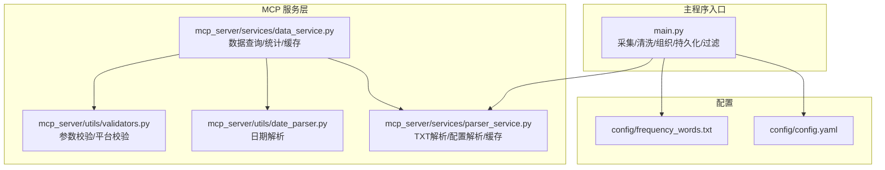
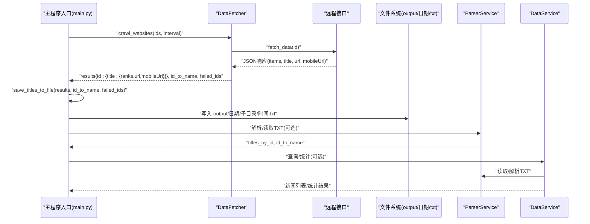
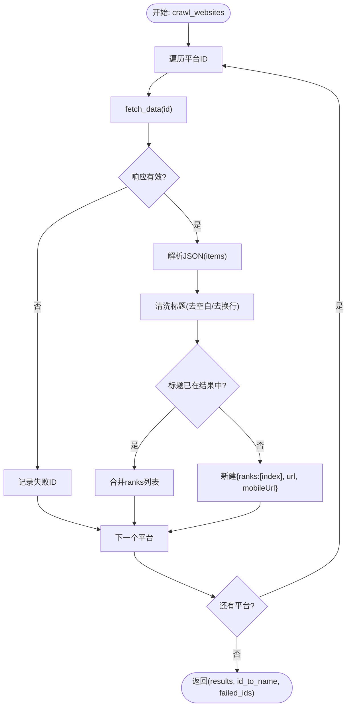
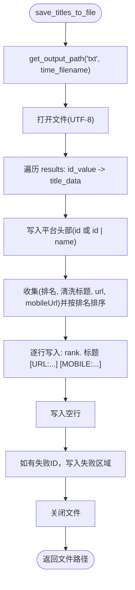
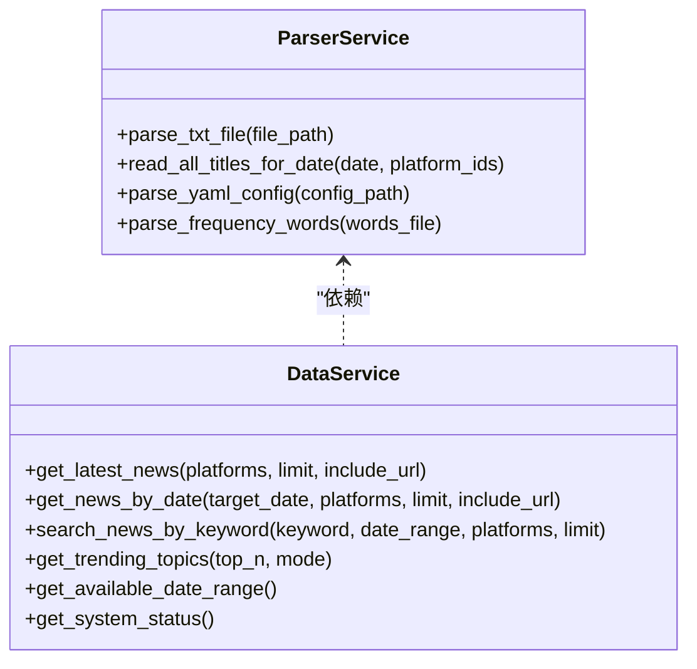
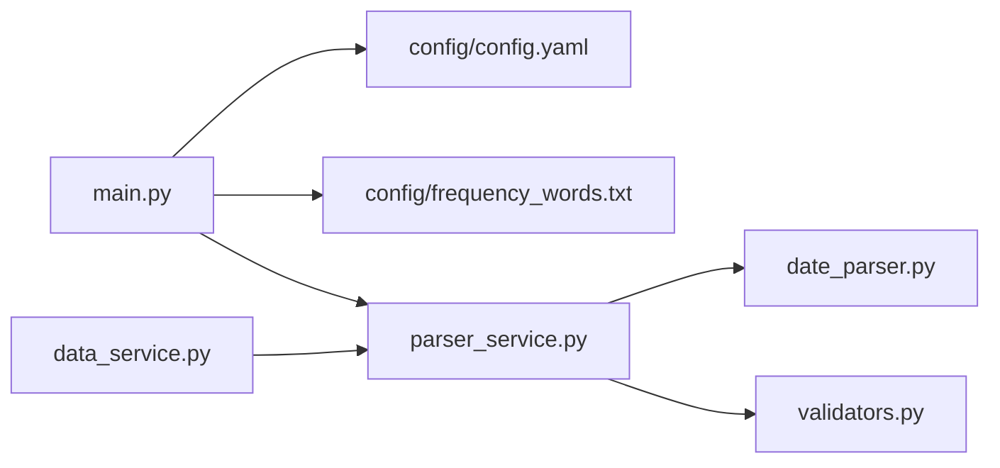

# 数据处理阶段

<cite>
**本文引用的文件**
- [main.py](file://main.py)
- [config/config.yaml](file://config/config.yaml)
- [config/frequency_words.txt](file://config/frequency_words.txt)
- [mcp_server/services/data_service.py](file://mcp_server/services/data_service.py)
- [mcp_server/services/parser_service.py](file://mcp_server/services/parser_service.py)
- [mcp_server/utils/date_parser.py](file://mcp_server/utils/date_parser.py)
- [mcp_server/utils/validators.py](file://mcp_server/utils/validators.py)
</cite>

## 目录
1. [简介](#简介)
2. [项目结构](#项目结构)
3. [核心组件](#核心组件)
4. [架构总览](#架构总览)
5. [详细组件分析](#详细组件分析)
6. [依赖分析](#依赖分析)
7. [性能考虑](#性能考虑)
8. [故障排查指南](#故障排查指南)
9. [结论](#结论)
10. [附录](#附录)

## 简介
本章节聚焦 TrendRadar 的数据处理阶段，系统性梳理从原始 JSON 数据到结构化信息的转换过程，涵盖标题清洗、排名提取、URL 处理、数据去重、按平台 ID 组织、标题到排名与 URL 的映射、持久化到文本文件（output/日期/子目录）、关键词筛选（frequency_words.txt）机制与配置驱动的过滤策略，以及处理大量数据时的内存优化策略。文档还提供从采集结果到文件输出的时序图，帮助读者建立端到端的数据流认知。

## 项目结构
TrendRadar 的数据处理主要分布在主程序入口与 MCP 服务层：
- 主程序入口负责采集、清洗、组织、持久化与关键词过滤的全流程编排
- MCP 服务层提供数据查询、解析、缓存与统计分析能力，支撑对外检索与报表生成

图表来源
- [main.py](file://main.py#L616-L815)
- [config/config.yaml](file://config/config.yaml#L1-L140)
- [config/frequency_words.txt](file://config/frequency_words.txt#L1-L114)
- [mcp_server/services/data_service.py](file://mcp_server/services/data_service.py#L1-L120)
- [mcp_server/services/parser_service.py](file://mcp_server/services/parser_service.py#L1-L120)
- [mcp_server/utils/date_parser.py](file://mcp_server/utils/date_parser.py#L1-L120)
- [mcp_server/utils/validators.py](file://mcp_server/utils/validators.py#L1-L120)

章节来源
- [main.py](file://main.py#L616-L815)
- [config/config.yaml](file://config/config.yaml#L1-L140)
- [config/frequency_words.txt](file://config/frequency_words.txt#L1-L114)
- [mcp_server/services/data_service.py](file://mcp_server/services/data_service.py#L1-L120)
- [mcp_server/services/parser_service.py](file://mcp_server/services/parser_service.py#L1-L120)
- [mcp_server/utils/date_parser.py](file://mcp_server/utils/date_parser.py#L1-L120)
- [mcp_server/utils/validators.py](file://mcp_server/utils/validators.py#L1-L120)

## 核心组件
- 数据获取器 DataFetcher：从远程接口拉取 JSON，按平台 ID 组织，提取标题、URL、移动端 URL，并将相同标题按不同来源的排名合并
- 数据处理函数 save_titles_to_file：将结构化结果写入 output/日期/子目录的文本文件，按时间命名
- 频率词加载与过滤：解析 frequency_words.txt，支持“必须词”、“普通词”、“过滤词”、“数量限制”、“全局过滤”等语法
- MCP 解析与查询：ParserService 负责 TXT 文件解析与配置解析；DataService 提供查询、统计、缓存与日期范围扫描

章节来源
- [main.py](file://main.py#L616-L815)
- [main.py](file://main.py#L742-L941)
- [mcp_server/services/parser_service.py](file://mcp_server/services/parser_service.py#L1-L120)
- [mcp_server/services/data_service.py](file://mcp_server/services/data_service.py#L1-L120)

## 架构总览
下图展示了从采集到持久化的端到端流程，以及关键词过滤与查询统计的集成点。

图表来源
- [main.py](file://main.py#L616-L815)
- [main.py](file://main.py#L742-L941)
- [mcp_server/services/parser_service.py](file://mcp_server/services/parser_service.py#L160-L261)
- [mcp_server/services/data_service.py](file://mcp_server/services/data_service.py#L30-L120)

## 详细组件分析

### 数据采集与组织（DataFetcher）
- 输入：平台 ID 列表（支持 (id, name) 元组）
- 输出：按平台 ID 组织的标题字典，同一标题在不同来源的排名被合并
- 关键行为：
  - 逐个平台请求 JSON，解析 items
  - 标题清洗：跳过 None、浮点数、空字符串；去除多余空白
  - URL/移动端 URL 提取：url、mobileUrl
  - 去重与合并：相同标题在同平台下合并 ranks 列表；不同平台独立键空间
  - 失败 ID 记录：网络/解析异常时收集失败平台

图表来源
- [main.py](file://main.py#L683-L740)

章节来源
- [main.py](file://main.py#L616-L740)

### 标题清洗、排名提取与 URL 处理
- 标题清洗：移除换行/回车，压缩多余空白，去首尾空白
- 排名提取：按 JSON 中 items 的顺序作为初始排名，相同标题合并时追加 ranks
- URL 处理：保留 url 与 mobileUrl 字段，写入文件时以 [URL:...] 与 [MOBILE:...] 形式标注

章节来源
- [main.py](file://main.py#L420-L428)
- [main.py](file://main.py#L708-L723)
- [main.py](file://main.py#L742-L791)

### 按平台 ID 组织与映射关系
- 结果结构：{platform_id: {title: {ranks:[], url:"", mobileUrl:""}}}
- id_to_name：记录平台 id 到显示名称的映射，用于输出头部标识
- 合并策略：相同标题在同平台下合并 ranks；不同平台各自独立

章节来源
- [main.py](file://main.py#L683-L740)

### 持久化到文本文件（save_titles_to_file）
- 目录结构：output/日期/txt，日期与文件名均基于北京时间
- 文件命名：按小时分钟命名（如 14时30分.txt）
- 输出格式：
  - 平台头部：id 或 id | name
  - 标题行：rank. 清洗后的标题，若存在 URL/MOBILE 则附加 [URL:...] 与 [MOBILE:...]
  - 空行分隔
  - 失败 ID 区域：列出请求失败的平台 ID

图表来源
- [main.py](file://main.py#L742-L791)

章节来源
- [main.py](file://main.py#L404-L441)
- [main.py](file://main.py#L742-L791)

### frequency_words.txt 的筛选机制与配置
- 文件结构：按空行分组的词组，支持区域标记 [GLOBAL_FILTER] 与 [WORD_GROUPS]
- 语法：
  - 普通词：匹配任意一个
  - 必须词 +word：必须同时包含
  - 过滤词 !word：包含则排除
  - 数量限制 @N：限制该组最多显示 N 条
  - 全局过滤 [GLOBAL_FILTER]：任何情况下都过滤
- 加载与解析：
  - 读取文件内容，按双换行切分为词组
  - 支持区域切换与语法解析，生成 processed_groups、filter_words、global_filters
- 使用场景：
  - 词频统计与新增检测时，对标题进行匹配与过滤
  - 增量模式下仅输出匹配的新标题

章节来源
- [config/frequency_words.txt](file://config/frequency_words.txt#L1-L114)
- [main.py](file://main.py#L793-L888)
- [mcp_server/services/parser_service.py](file://mcp_server/services/parser_service.py#L290-L356)

### 查询与统计（MCP 服务层）
- ParserService：
  - parse_txt_file：解析单个 TXT 文件，恢复标题到排名、URL 的映射
  - read_all_titles_for_date：读取指定日期的所有 TXT 文件，按平台聚合，支持缓存
  - parse_yaml_config：解析 YAML 配置
  - parse_frequency_words：解析 frequency_words.txt
- DataService：
  - get_latest_news/get_news_by_date：按平台与限制返回新闻列表，支持包含 URL
  - search_news_by_keyword：按关键词搜索，统计平台分布与平均排名
  - get_trending_topics：基于频率词统计 TOP N 关注词
  - get_available_date_range：扫描 output 目录，返回可用日期范围
  - get_system_status：返回系统状态与缓存统计

图表来源
- [mcp_server/services/parser_service.py](file://mcp_server/services/parser_service.py#L1-L120)
- [mcp_server/services/data_service.py](file://mcp_server/services/data_service.py#L1-L120)

章节来源
- [mcp_server/services/parser_service.py](file://mcp_server/services/parser_service.py#L1-L120)
- [mcp_server/services/data_service.py](file://mcp_server/services/data_service.py#L1-L120)

## 依赖分析
- 主程序依赖配置文件与频率词文件
- MCP 服务层依赖 ParserService 进行文件与配置解析，依赖缓存提升查询性能
- 参数校验与日期解析由工具模块提供，保障输入合法性

图表来源
- [main.py](file://main.py#L162-L210)
- [config/config.yaml](file://config/config.yaml#L1-L140)
- [config/frequency_words.txt](file://config/frequency_words.txt#L1-L114)
- [mcp_server/services/parser_service.py](file://mcp_server/services/parser_service.py#L1-L120)
- [mcp_server/utils/date_parser.py](file://mcp_server/utils/date_parser.py#L1-L120)
- [mcp_server/utils/validators.py](file://mcp_server/utils/validators.py#L1-L120)
- [mcp_server/services/data_service.py](file://mcp_server/services/data_service.py#L1-L120)

章节来源
- [main.py](file://main.py#L162-L210)
- [config/config.yaml](file://config/config.yaml#L1-L140)
- [config/frequency_words.txt](file://config/frequency_words.txt#L1-L114)
- [mcp_server/services/parser_service.py](file://mcp_server/services/parser_service.py#L1-L120)
- [mcp_server/utils/date_parser.py](file://mcp_server/utils/date_parser.py#L1-L120)
- [mcp_server/utils/validators.py](file://mcp_server/utils/validators.py#L1-L120)
- [mcp_server/services/data_service.py](file://mcp_server/services/data_service.py#L1-L120)

## 性能考虑
- 内存优化
  - 采用“按平台聚合 + 合并 ranks”的结构，避免重复存储相同标题的多份副本
  - 读取 TXT 文件时按文件粒度解析，逐个文件合并，减少一次性加载全部文件的内存峰值
  - 缓存策略：ParserService 与 DataService 对读取结果进行缓存，缩短重复查询耗时
- I/O 优化
  - 输出文件按时间命名，便于按批次管理与增量处理
  - 目录结构清晰，按日期分层，利于磁盘空间与检索效率
- 网络与重试
  - DataFetcher 对远程请求进行重试与退避，降低瞬时失败的影响
  - 请求间隔随机抖动，避免集中请求带来的限流风险

章节来源
- [main.py](file://main.py#L683-L740)
- [mcp_server/services/parser_service.py](file://mcp_server/services/parser_service.py#L160-L261)
- [mcp_server/services/data_service.py](file://mcp_server/services/data_service.py#L30-L120)

## 故障排查指南
- 采集失败
  - 检查远程接口状态与返回字段（status、items）
  - 查看 DataFetcher 的重试日志与失败 ID 列表
- 文件写入异常
  - 确认 output/日期/txt 目录可写
  - 检查文件名是否包含非法字符（基于时间命名，通常不会）
- 频率词配置错误
  - 确认 frequency_words.txt 的分组与语法正确
  - 使用 [GLOBAL_FILTER] 时注意不支持特殊语法前缀
- 查询不到数据
  - 使用 DataService 的 get_available_date_range 确认已有数据日期范围
  - 检查 ParserService 的 read_all_titles_for_date 抛出的异常信息

章节来源
- [main.py](file://main.py#L616-L740)
- [main.py](file://main.py#L793-L888)
- [mcp_server/services/parser_service.py](file://mcp_server/services/parser_service.py#L200-L261)
- [mcp_server/services/data_service.py](file://mcp_server/services/data_service.py#L498-L605)

## 结论
TrendRadar 的数据处理阶段以 DataFetcher 为核心，围绕“标题清洗、排名提取、URL 处理、按平台 ID 组织、去重合并”构建了稳定的结构化数据模型；通过 save_titles_to_file 实现按北京时间命名与目录组织的持久化；结合 frequency_words.txt 的灵活语法，实现了面向关键词的筛选与过滤。MCP 服务层进一步提供了强大的查询、统计与缓存能力，支撑后续的报表与分析。整体设计兼顾了可维护性与可扩展性，适合在大规模数据场景下持续演进。

## 附录
- 配置要点
  - request_interval：请求间隔（毫秒）
  - PLATFORMS：监控平台列表（id/name）
  - report.mode：daily/current/incremental
  - weight.*：排名、频率、热度权重
- 频率词语法速览
  - 普通词：匹配任意一个
  - 必须词 +word：必须同时包含
  - 过滤词 !word：包含则排除
  - 数量限制 @N：限制该组最多显示 N 条
  - 全局过滤 [GLOBAL_FILTER]：任何情况下都过滤

章节来源
- [config/config.yaml](file://config/config.yaml#L1-L140)
- [config/frequency_words.txt](file://config/frequency_words.txt#L1-L114)